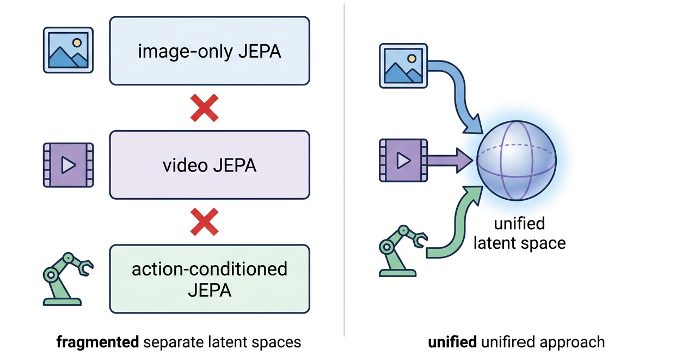
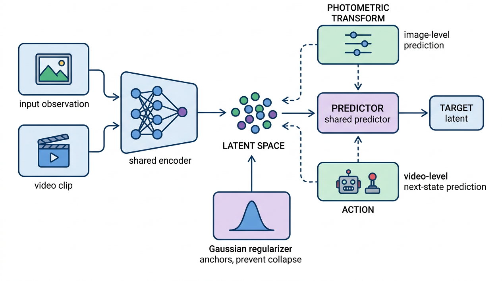
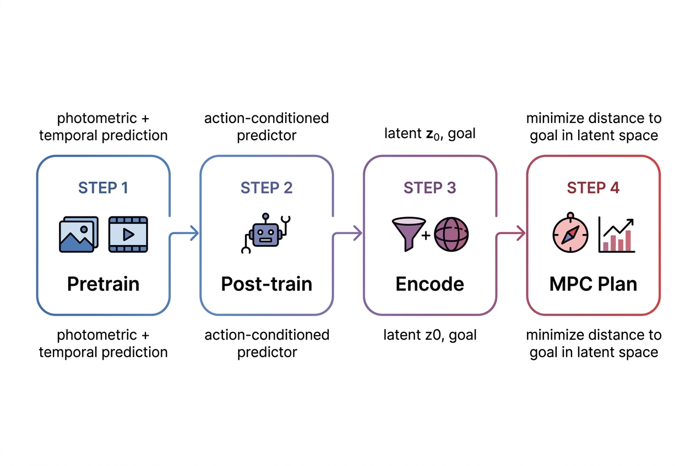
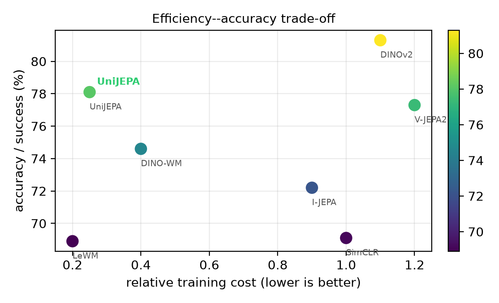

# AI Daily

## UniJEPA: A Unified Joint-Embedding Predictive Architecture for Task-Agnostic Visual World Modeling

**發表日期**: 2026-08-07
**論文來源**: [arXiv:2608.07409](https://arxiv.org/abs/2608.07409)
**作者**: An Lanji, Dawei Liu, Jin Li, Haoran Xu, Mei Chen, Yu Tian
**發表會議/期刊**: ICML 2026

### 論文核心貢獻和創新點

聯合嵌入預測架構（Joint-Embedding Predictive Architectures, JEPAs）已經成為在緊湊潛在空間（Latent Space）中自我監督學習世界模型的原則性框架。然而，現有的 JEPA 方法高度碎片化：例如 I-JEPA 專注於在潛在空間預測單一圖像的遮罩部分，圖像世界模型（Image World Models, IWM）學習預測全局光度變換（Photometric Transformations），而視頻規模的 JEPAs（如 V-JEPA 2、DINO-World）則預測未來的時間狀態並為動作條件規劃（Action-Conditioned Planning）進行後訓練。這些目標被視為獨立的方法，擁有各自的編碼器、預測器和防止崩潰的正則化器，這阻礙了單一模型統一圖像級別和視頻級別的世界建模。

本文提出 **UniJEPA**，這是一個統一的 JEPA 框架，能夠在同一個共享的潛在空間中聯合學習光度預測（圖像級別變換）和時間預測（視頻級別下一狀態動態）。其核心創新點包括：

1. **統一的目標函數**：將光度預測和時間預測視為同一潛在預測任務的兩個實例，透過單一的下一個嵌入預測損失（Next-Embedding Prediction Loss）加上高斯正則化器進行端到端優化。
2. **可證明的防止崩潰保證（Provable Anti-Collapse）**：提出了一個數學定理，證明該正則化器能防止表示崩潰（Representational Collapse）並產生表現良好的潛在分佈，且無需使用指數移動平均（EMA）、停止梯度（Stop-Gradient）或預訓練的編碼器。
3. **可控的抽象化（Controllable Abstraction）**：證明了同一個潛在空間支持可控的抽象化。光度預測學習不變結構（Invariant Structure），而時間預測學習等變動態（Equivariant Dynamics）。
4. **零樣本規劃（Zero-Shot Planning）**：在離線軌跡上進行動作條件後訓練後，UniJEPA 透過將目標特徵視為預測目標，實現了零樣本的模型預測控制（Model-Predictive-Control, MPC）規劃。

*圖 1：現有 JEPA 方法在圖像、視頻和動作條件預測上各自獨立，而 UniJEPA 將它們統一在一個共享的潛在空間中。*

### 技術方法簡述

UniJEPA 的架構由一個共享的編碼器 $f_{\theta}$ 和一個單一的預測器 $g_{\psi}$ 組成。編碼器將觀察值 $x$ 映射到潛在嵌入 $z = f_{\theta}(x)$。預測器根據條件潛在向量（以及可選的動作）預測目標潛在向量。

#### 統一的預測目標

對於光度預測，預測器 $g_{\psi}(z, a)$ 接收光度變換參數 $a = \tau$，目標是匹配變換後的圖像嵌入 $z^{\prime} = f_{\theta}(\tau(x))$：
$$ \mathcal{L}_{\mathrm{photo}}(\theta, \psi) = \mathbb{E}_{x, \tau} \left[ \left\| g_{\psi}(f_{\theta}(x), \tau) - f_{\theta}(\tau(x)) \right\|_{2}^{2} \right] $$

對於時間預測，給定當前狀態 $z_{t} = f_{\theta}(x_{t})$ 和動作 $a_{t}$，預測下一狀態 $z_{t+1} = f_{\theta}(x_{t+1})$：
$$ \mathcal{L}_{\mathrm{temp}}(\theta, \psi) = \mathbb{E}_{(x_{t}, a_{t}, x_{t+1})} \left[ \left\| g_{\psi}(f_{\theta}(x_{t}), a_{t}) - f_{\theta}(x_{t+1}) \right\|_{2}^{2} \right] $$

#### 防止崩潰的高斯正則化

為了防止編碼器將所有輸入映射到相同的嵌入（即表示崩潰），UniJEPA 引入了一個高斯正則化器，強制潛在分佈接近球形高斯分佈。具體而言，它約束沿著隨機單位向量 $u$ 的投影的平方馬哈拉諾比斯偏差（Squared Mahalanobis Deviation）$\chi^{2}_{1}$：
$$ \mathcal{R}(\theta) = \mathbb{E}_{x, u} \left[ \chi^{2}_{1}((u^{\mathsf{T}}z)^{2}) \right] $$

最終的端到端訓練目標為：
$$ \mathcal{L}_{\mathrm{UniJEPA}}(\theta, \psi) = \mathcal{L}_{\mathrm{photo}} + \mathcal{L}_{\mathrm{temp}} + \alpha \mathcal{R} $$
其中 $\alpha > 0$ 是單一的損失超參數。

*圖 2：UniJEPA 架構。共享編碼器將觀察值映射到潛在空間，單一預測器根據光度變換或動作進行預測，高斯正則化器防止崩潰。*

#### 零樣本規劃流程

在預訓練後，凍結編碼器並在離線軌跡上對預測器進行後訓練。規劃被表述為視覺目標達成問題：給定當前觀察 $z_{0}$ 和目標 $z^{g}$，透過採樣優化解決以下模型預測控制（MPC）問題：
$$ \min_{a_{0:H-1}} \sum_{h=1}^{H} \left\| \hat{z}_{h} - z^{g} \right\|_{2}^{2}, \quad \hat{z}_{h} = g_{\psi}(\hat{z}_{h-1}, a_{h-1}) $$

*圖 3：UniJEPA 的訓練與規劃工作流程。*

### 實驗結果和性能指標

UniJEPA 在圖像、視頻和控制基準測試中均表現出色，同時保持了極高的計算效率。

| 評估項目 | UniJEPA 表現 | 比較對象與基準 |
| :--- | :--- | :--- |
| **ImageNet 線性探測** | 74.9% 準確率 | 超越僅光度預測的 IWM (73.5%)，接近 DINOv2 |
| **SSv2 (動作識別)** | 78.1% Top-1 準確率 | 超越 V-JEPA-2 (77.3%) |
| **EK-100 (動作預期)** | 40.6% Recall@5 | 優於 V-JEPA-2 (39.7%) |
| **規劃成功率 (Plan-Succ)** | 75.8% | 超越 DINO-WM (74.6%) 和 LeWorldModel (68.9%) |
| **規劃速度 (Plan-Speed)** | 44x 提升 | 遠快於基於像素的生成式世界模型 |

實驗表明，結合光度損失不僅提升了圖像特徵的質量，還透過引入不變性（Invariance）幫助了時間推理（Temporal Grounding）。在消融實驗中，移除光度損失會導致 ImageNet 準確率下降 4.8%，移除時間損失則無法進行動態規劃。

*圖 4：效率與準確率的權衡。UniJEPA 在保持高準確率和規劃成功率的同時，訓練成本遠低於其他方法，位於帕雷托最優（Pareto-optimal）區域。*

### 相關研究背景

JEPA 框架最初由 Yann LeCun 提出，旨在引導機器學習自主智能。早期的 I-JEPA 專注於圖像內的遮罩預測，隨後的 V-JEPA 將其擴展到視頻領域。然而，這些方法通常需要依賴 EMA 或停止梯度等啟發式技巧來避免表示崩潰。LeWorldModel 首次證明了單一高斯正則化器可以實現穩定的端到端訓練。

同時，基於像素的生成式世界模型（如 Sora、Stable Video Diffusion）雖然能生成高保真視頻，但其推理成本極高，不適合即時的在線規劃。UniJEPA 結合了這些研究的優點，在一個統一的框架內實現了高效的潛在空間預測和規劃。

### 個人評價和意義

UniJEPA 是一項具有里程碑意義的研究，特別是在我們關注的 **JEPA** 和 **Zero-shot** 領域。它成功打破了視覺表徵學習中「圖像」與「視頻」之間的壁壘。

1. **理論與實踐的完美結合**：其提出的單一高斯正則化器不僅在數學上可證明防止崩潰，在實踐中也去除了繁瑣的 EMA 技巧，這使得模型訓練更加優雅和穩定。
2. **對 Zero-shot Planning 的啟發**：透過在潛在空間中直接計算與目標特徵的距離來進行 MPC 規劃，避免了生成像素的巨大開銷。這為未來將視覺基礎模型應用於機器人控制（Robotics）和具身智能（Embodied AI）提供了一條極具潛力的捷徑。
3. **可控抽象化的價值**：論文指出光度預測帶來不變性，時間預測帶來等變性，這種將不變性與等變性統一起來的視角，對未來設計 Energy-based Transformer 或其他需要靈活表徵的模型具有深刻的啟發意義。

整體而言，UniJEPA 以極高的效率達成了多項任務的 SOTA，證明了「預測未來」與「理解當前變換」本質上可以（也應該）在同一個潛在空間中完成。

---
*本報告由 AI Daily 系統自動生成。*
