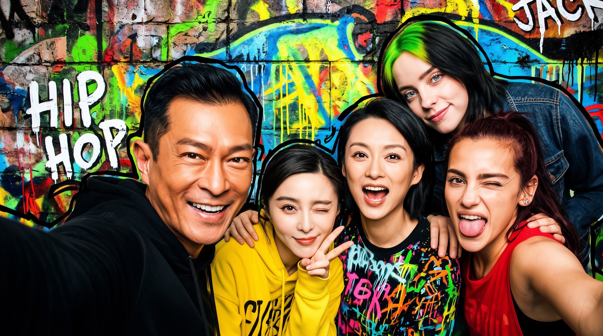

# AI Daily

## WithEveryone：把「每個人」變成可尋址的身份—佈局計畫，讓群像生成擴展到十人

**研究日期：** 2026-08-23　　**作者：** Manus AI　　**論文日期：** 2026-08-20　　**來源：** arXiv:2608.20336v1 [cs.CV] [1]

> 本日精選 **WithEveryone: Unified Planning and Identity Grounding for Group Image Generation**。這篇論文沒有選擇再提出一個更強的單人身份注入器，而是重新定義多人身份生成的瓶頸：當五至十個參考身份同時進入長上下文時，模型不只要「記住誰」，還要知道「誰應該出現、位於哪裡、採取什麼姿勢，以及生成出的哪一張臉應該由哪一個身份負責」。

## 一、為什麼選這篇？

本次先檢查 `KaiCobra/AI_Daily` 的既有文章與索引，排除了已經收錄的 Energy-Based Transformers、Scalable EBM、UniJEPA、TC-JEPA、VPG、SparVAR、Semantic Steering、GATO-Vid、EditMod 等題目。候選搜尋涵蓋 Hugging Face Daily/Trending、arXiv 與正式會議頁面；其中 Orthogonal JEPA 更貼近 JEPA 偏好，K2N 更貼近 VAR 與粗尺度前綴控制，但 WithEveryone 同時滿足「最新、直接面向圖像生成、頂尖研究機構、方法新穎且有完整多模型比較」四項條件，因此作為今日主文。Orthogonal JEPA、K2N、PROVE 與 Nano World Models 均確認尚未出現在既有 inventory 中，但本日不重複收錄它們。[1] [2] [8] [9]

| 篩選面向 | WithEveryone 的判斷 | 評價 |
|---|---|---|
| 時效性 | arXiv v1 於 2026-08-20 提交，距本日僅三天 | 高 |
| 作者與機構 | Fudan University、Hunyuan/Tencent、The University of Hong Kong | 高 |
| 研究問題 | 直接處理五至十人群像中的身份遺失、身份混淆、copy-paste 與空間規劃 | 高 |
| 頂會狀態 | 目前是 arXiv 預印本，尚無本文正式會議錄用標記 | 中 |
| 與近期偏好的吻合 | 非 training-free、非純 VAR、非 EBT；但具有 representation forcing、layout-addressed conditioning、flow matching 與可延伸的 attention/energy/JEPA 接口 | 中高 |
| 既有文章重複風險 | 本地 inventory 未見 WithEveryone 或 arXiv:2608.20336 | 低 |

### 原文摘要摘錄

> “WithEveryone injects each selected identity as an addressed token, predicts a structured identity–layout plan, and renders the plan as a visual condition.” [1]

這句話是全文的核心：**身份不是一組無序的參考影像，而是必須被賦予明確地址的條件變數；佈局不是生成後的修補，而是在圖像合成前就形成的中介狀態。**

## 二、論文基本資訊

| 欄位 | 內容 |
|---|---|
| 論文標題 | WithEveryone: Unified Planning and Identity Grounding for Group Image Generation |
| 作者 | Hengyuan Xu、Qixun Wang、Yiji Cheng、Miles Yang、Zhao Zhong、Wei Cheng、Xingjun Ma、Yu-Gang Jiang |
| 研究機構 | Fudan University；Hunyuan, Tencent；The University of Hong Kong |
| 發表狀態 | arXiv:2608.20336v1，2026-08-20；目前為預印本 |
| 任務 | Text + 5–10 個參考身份 → 一張語義、空間與身份一致的群體圖像 |
| 生成骨幹 | Transfusion-style mixture-of-transformers；理解/規劃使用自回歸 token，目標圖像 latent 使用 flow matching |
| 訓練資料 | 約 400K 個群像樣本；評估集為 identity-disjoint 的 210 張真實群像 |
| 主要結果 | Sim(Tgt)=0.499、Sim(Ref)=0.540、Coverage=0.973、Dup=0.028、Copy-Paste=0.055 |

論文的研究系統最多處理十個參考身份，但官方專案頁也明確說明，目前研究系統使用的 foundation model license 不允許釋出 checkpoint；團隊正在以可公開釋出的 foundation model 訓練開放版本。因此，本文應被描述為**方法與實驗已公開、權重仍在開放版本訓練中**，不應誤寫成目前已完整開源。[1] [2]

## 三、問題定義：多人生成不是單人生成的簡單重複

傳統身份客製化方法通常可以把一張參考人臉注入生成模型，再用身份 loss 或 cross-attention 讓結果接近該人。然而，當參考身份數量從一人增加到五至十人，問題會出現非線性惡化。長序列中的身份訊號被稀釋；兩個參考人可能被生成成同一張臉；某張臉可能被錯誤配對到另一個 reference；即使每個人都具有相似度，整體也可能出現重複、錯位、肢體重疊或不合理姿勢。[1]

WithEveryone 指出，既有 output-side identity loss 的主要障礙不是 loss 不夠強，而是**訓練時不知道哪一個生成臉對應哪一個參考身份**。在高噪聲 one-step estimate 中，多張臉幾乎不可辨識；若依生成臉的 ArcFace embedding 做 Hungarian matching，配對可能近似隨機，錯配後的梯度會互相抵消。論文因此選擇移除 matching problem，而不是再設計更複雜的 matcher：既然訓練資料已經提供每一張臉的空間標註，就直接用 layout annotation 作為身份地址。[1]

## 四、整體方法：Reason before rendering

WithEveryone 採用統一多模態模型，讓「理解、身份選擇、佈局推理、身份表徵預測與圖像生成」處在同一條 causal context 中。模型先從 prompt 判斷哪些參考身份真正參與場景，再為每一個被選中的身份建立 ID token；接著以 Layout Chain of Thought（Layout CoT）預測身份—人物綁定、人物與臉部 bounding boxes、身體範圍與 pose keypoints；最後由 deterministic renderer 把離散佈局計畫轉成視覺條件，供 flow-based image generation 使用。[1] [2]

**圖一。** WithEveryone 的完整流程。此圖由官方專案頁提供，呈現各種 supervision 在統一序列中的位置；其中「Rep Forcing」負責讓每個身份在生成前保持可尋址，「Layout Render」將結構化計畫轉成視覺條件，「Flow Matching + LG-ID Loss」則在 noisy latent 的 one-step clean estimate 上做區域身份監督。[2]

### 4.1 Identity token：從 unordered pool 到 addressed set

對每一個被選中的參考人物，論文先抽取 512 維 ArcFace identity embedding，並透過輕量 MLP 投影到模型 hidden dimension，插入對應的 ID-token 位置。這個設計的重點不在於 ArcFace 本身，而在於**每個 identity token 都有一個可被後續 Layout CoT 指派的地址**。因此參考集合不再只是視覺條件的堆疊，而是由「身份索引—人物位置—生成結果」構成可追蹤的對應關係。[1]

### 4.2 ID Representation Forcing：先預測身份，再生成圖像

單純把 ID token 放入 10K–20K token 的交錯序列，不能保證後續圖像 token 會持續讀取它。WithEveryone 因此在目標圖像前放入每個身份的 representation token，由 backbone 依據 prompt、參考影像、ID tokens 與 layout reasoning 產生隱藏狀態，再以輸出投影器預測該人物的 ArcFace representation。對第 $i$ 個身份，論文定義

$$
\hat{\mathbf e}_i = g_{\mathrm{out}}\!\left(\mathbf h_i^{\mathrm{rep}}\right),
$$

並以 cosine alignment 作為 Representation Forcing loss：

$$
\mathcal L_{\mathrm{RF}}
= \frac{1}{M}\sum_{i=1}^{M}
\left[1-\cos\!\left(\hat{\mathbf e}_i,\mathbf e_i^{\mathrm{tgt}}\right)\right],
$$

其中 $M$ 是有監督的參考身份數量，$\mathbf e_i^{\mathrm{tgt}}$ 是目標群像中對應人物的 ArcFace embedding。這個預測結果不是額外的 inference-time identity condition；它的作用是建立一個在 causal context 中、可供後續 image tokens 讀取的**身份 scaffold**。這裡直接延續 Representation Forcing 的思想：讓模型在低階像素或 flow generation 之前，先預測一個具有語義結構的中介表徵。[1] [3]

### 4.3 Layout Chain of Thought：把「誰」與「在哪裡」聯合建模

Layout CoT 使用離散座標詞彙來自回歸生成 identity–layout binding、人物框、臉部框、身體範圍與 pose keypoints。其座標詞彙共 2,002 個 token，對應 $x$ 與 $y$ 軸各 1,001 個位置。固定的 causal order 使後續空間決策能看到先前已承諾的身份與區域；短文字 connector 維持場景狀態，而真正的空間欄位仍可被解析與直接監督。計畫完成後，deterministic renderer 將臉部框、身體框與骨架繪製到空白 canvas，再將這張 layout condition 放回模型上下文。[1]

這個設計與 PlanGen 的 unified layout planning 類似，都是把「先規劃、後生成」放入同一個自回歸視覺語言模型，而不是採用完全分離的 planner 與 renderer；WithEveryone 的新增點則是讓每一個 planned person 與具體 reference identity 綁定。[1] [7]

### 4.4 Layout-Grounded ID Loss：用空間標註消除身份錯配

令 noisy latent 為 $\mathbf x_t$，模型在 reverse-flow convention 下預測 velocity $\mathbf v_\theta(\mathbf x_t,t)$。論文以 one-step clean estimate

$$
\hat{\mathbf x}_{\mathrm{clean}}
= \mathbf x_t - t\,\mathbf v_\theta(\mathbf x_t,t)
$$

近似目前 latent 對應的乾淨圖像，再經 VAE decode 得到可微的圖像估計。對第 $i$ 個參考身份，論文使用 ground-truth face bounding box 與 landmarks，在預測圖像和 target image 的**同一個座標區域**取 crop，並以 frozen ArcFace 編碼。若有效身份數為 $M_v$，可以將其區域身份監督寫成

$$
\mathcal L_{\mathrm{LG\text{-}ID}}
= \frac{1}{M_v}\sum_{i=1}^{M_v}
\left[1-\cos\!\left(\mathbf e_i^{\mathrm{pred}},
\mathbf e_i^{\mathrm{tgt}}\right)\right].
$$

關鍵不是公式表面上的 cosine，而是它的 correspondence 來源：**每個 crop 的身份由已標註的空間位置決定，不由 noisy generated-face embedding matching 決定。** 為避免高噪聲 one-step estimate 沒有可辨識人臉，論文只在 $t\leq0.85$ 時計算此 loss；作者的附錄指出 $t=0.85$ 以上的臉部細節會快速惡化。[1]

### 4.5 聯合目標

不同序列區段採用不同監督：connector text、Layout CoT、summary 與 recaption 使用 next-token prediction；目標圖像 latent 使用 flow matching；身份 representation 使用 cosine alignment；區域臉部則由 LG-ID Loss 監督。整體目標為

$$
\mathcal L
= \mathcal L_{\mathrm{NTP}}
+ \lambda_{\mathrm{FM}}\mathcal L_{\mathrm{FM}}
+ \lambda_{\mathrm{RF}}\mathcal L_{\mathrm{RF}}
+ \lambda_{\mathrm{ID}}\mathcal L_{\mathrm{ID}},
$$

其中主實驗設定為 $\lambda_{\mathrm{FM}}=1.0$、$\lambda_{\mathrm{RF}}=1.0$、$\lambda_{\mathrm{ID}}=0.5$。值得注意的是，target identity embedding 只在訓練時作為 representation forcing target，推理時不直接餵給模型；推理階段是自回歸生成 identity selection、Layout CoT 與 recaption，再由 renderer 建構 visual condition。[1]

## 五、資料與實驗設計

論文建構約 400K 個群像樣本，參考身份數量覆蓋五至十人。主要 benchmark 包含 210 張真實群像，每張圖恰有與 reference 數量相同的臉，並排除重複身份。訓練與測試身份完全 disjoint，且移除所有含有測試身份的訓練樣本，避免結果只是 image-level memorization。五至十人分組的樣本數依序為 60、50、40、30、20、10，因此十人組的統計量應被視為趨勢證據，而不宜過度解讀為精確估計。[1]

| 指標 | 定義與解讀 |
|---|---|
| Sim(Tgt) | 生成臉與 target identity 的相似度，主比較採 ArcFace、FaceNet、AdaFace 三個 face encoders 平均；越高越好 |
| Sim(Ref) | 生成臉與 reference identity 的相似度；過高不一定代表好，可能反映直接複製 |
| Copy-Paste | 衡量生成臉是否僵硬複製 reference；越低越好 |
| Coverage | 參考身份被獨立生成且達到相似度門檻的比例；越高越好 |
| Dup | 多個 reference collapse 到同一生成臉的比例；越低越好 |
| CLIP-I / DINO-I | 生成圖像與 target 圖像的視覺相似度 |
| CLIP-T | 生成圖像與文字 prompt 的對齊度 |

## 六、實驗結果

### 6.1 主要比較：身份、覆蓋率與複製偽影的整體平衡

下表摘錄論文 Table 1 的代表性方法。主結論不是 WithEveryone 在每個指標都第一，而是它在 **Sim(Tgt)、Coverage、Dup 與 CLIP-I** 之間取得最完整的 Pareto balance。尤其 Sim(Ref) 高於多數方法、但 Copy-Paste 顯著低於 GPT-Image 2，表示相似度較不依賴把 reference 臉原封不動貼回去。[1]

| 方法 | Sim(Tgt) ↑ | Sim(Ref) ↑ | Copy-Paste ↓ | Coverage ↑ | Dup ↓ | CLIP-I ↑ | DINO-I ↑ | CLIP-T ↑ |
|---|---:|---:|---:|---:|---:|---:|---:|---:|
| WithAnyone（學術） | 0.405 | 0.483 | 0.096 | 0.957 | 0.045 | 0.807 | 0.695 | 0.281 |
| UMO | 0.371 | 0.484 | 0.112 | 0.630 | 0.258 | 0.780 | 0.663 | 0.286 |
| Nano Banana Pro | 0.453 | 0.478 | 0.041 | 0.674 | 0.148 | 0.839 | 0.712 | 0.275 |
| Nano Banana 2 | 0.451 | 0.480 | 0.045 | 0.884 | 0.099 | 0.860 | 0.731 | 0.276 |
| GPT-Image 2 | 0.462 | 0.583 | 0.169 | 0.905 | 0.075 | 0.853 | 0.719 | 0.270 |
| Seedream 5.0 Pro | 0.436 | 0.522 | 0.114 | 0.913 | 0.065 | 0.850 | 0.715 | 0.275 |
| **WithEveryone** | **0.499** | **0.540** | **0.055** | **0.973** | **0.028** | **0.861** | 0.716 | 0.273 |

在 identity-disjoint benchmark 上，WithEveryone 的 **Sim(Tgt)=0.499** 高於 GPT-Image 2 的 0.462；**Coverage=0.973** 高於 GPT-Image 2 的 0.905；**Dup=0.028** 低於 0.075；Copy-Paste 則由 GPT-Image 2 的 0.169 降至 0.055。CLIP-I=0.861 與 Nano Banana 2 的 0.860 幾乎難以區分，顯示身份控制並未明顯犧牲整體視覺相似度。另一方面，CLIP-T=0.273 並非最高，提醒我們文字對齊與多身份保真是不同目標，不能只用單一分數判斷模型優劣。[1]

**圖二。** 論文 PDF 以 PDF image extractor 擷取的高解析定性生成樣例。這張圖只作為方法輸出的視覺輔助，不用來替代表格中的定量證據；人臉與場景均應視為論文作者提供的研究示例。[1]

### 6.2 隨參考身份數量增加的退化曲線

在單一 ArcFace secondary analysis 中，WithEveryone 的相似度由五個 reference 的 0.629 降至十個 reference 的 0.571；GPT-Image 2 則由 0.593 降至 0.496，UMO 由 0.412 降至 0.330。這說明 WithEveryone 的退化曲線較平坦，但論文也提醒五至十人的上限區間樣本數較少，結論應理解為一致性趨勢，而不是每一個群體大小的精確統計定律。[1]

### 6.3 消融：LG-ID Loss 是最大單項增益來源

論文將消融分成 layout、ID token + Representation Forcing、LG-ID Loss 三條分支。所有數值均為 1K 設定；主表 2K 的 ArcFace 0.614 與消融表並非同一 scoring pipeline，因此不能直接混比。[1]

| 變體 | Sim(Ref) ↑ | Sim(Tgt) ↑ | Count ↑ | Coverage ↑ | 變化解讀 |
|---|---:|---:|---:|---:|---|
| P1 Default | 0.339 | 0.304 | 0.771 | 0.741 | 無 Layout CoT、無 ID token 的基準 |
| P2 Model Layout | 0.364 | 0.316 | 0.828 | 0.813 | 預測 layout 改善人數與身份覆蓋 |
| P3 GT Layout | 0.412 | 0.367 | 0.958 | 0.891 | oracle upper bound，不代表可直接部署 |
| P4 ID Token | 0.351 | 0.313 | 0.827 | 0.761 | ID token 帶來小幅、穩定改善 |
| P5 ID Token + RF | 0.364 | 0.328 | 0.817 | 0.782 | RF 額外提升 Sim(Ref) 0.013、Sim(Tgt) 0.015 |
| P6 LG-ID Loss only | 0.506 | 0.435 | 0.845 | 0.947 | 最大單項 identity/coverage 增益 |
| **P7 Full Model** | **0.555** | **0.461** | **0.869** | **0.960** | 所有模組加上 text-to-layout corpus |

LG-ID Loss 單獨把 Sim(Ref) 從 0.339 提升至 0.506、Sim(Tgt) 從 0.304 提升至 0.435，並同時改善 Count 與 Coverage。這是一個重要的機制性結果：**當身份 supervision 綁定在空間區域時，它不只是教模型「長得像誰」，也在間接教模型「把誰放到正確位置」。** 但 P7 同時加入 LG-ID、ID token、RF、Layout CoT 與額外 text-to-layout corpus，所以 P7 相對於 P6 的完整增益不能歸因於任一單一模組。[1]

### 6.4 計畫與執行：剩餘瓶頸在 planner，而不只是 renderer

模型自己的 plan IoU 約為 0.773，完整模型訓練後可達約 0.814；使用 ground-truth layout 作為輸入時，身份相似度與 coverage 仍會顯著提升。這表示模型大多能執行「自己已經提出的計畫」，但真正的剩餘誤差更多來自**計畫本身預測得不夠好**。此外，plan execution 的收斂早於 identity preservation，說明後續工作不應只投入更強的 image renderer，也應改善 identity-aware layout planner。[1]

Representation Forcing 的注意力診斷顯示，三個例子中 supervised identity prediction 對其對應 ID token 的 layer-24 diagonal attention 約為 0.378–0.574，而對非對應身份約為 0.104–0.121；這支持「每個身份 prediction position 具有身份特異性路由」的解釋。不過作者也審慎指出，這是局部 attention evidence，並不能單獨證明它相對於沒有 RF 的模型一定造成全部 end-to-end gain。[1]

## 七、相關研究脈絡

| 研究 | 核心路徑 | 與 WithEveryone 的差異與關係 |
|---|---|---|
| PuLID，NeurIPS 2024 | Tuning-free ID customization；contrastive alignment + accurate ID loss | 主要處理單一身份/少量身份，強調身份保真與可編輯性的平衡；WithEveryone 把 supervision 擴展到五至十人並以 layout annotation 解決 correspondence。[5] |
| WithAnyone，ICLR 2026 | MultiID-2M paired dataset、copy-paste benchmark、contrastive identity loss | WithAnyone 研究 identity fidelity vs. variation；WithEveryone 進一步研究多身份與空間綁定，主表也直接把 WithAnyone 作為學術基線。[4] |
| UMO，arXiv:2509.06818 | Multi-identity consistency、matching reward、可擴展的多參考資料 | UMO 偏向 matching/optimization；WithEveryone 的核心主張是不要在 noisy face 上做 matching，而改用已知 layout correspondence。[6] |
| PlanGen，arXiv:2503.10127 / ICCV 2025 | Unified layout planning + image generation 的自回歸視覺語言模型 | WithEveryone 沿用「同一上下文先規劃後生成」，再加上每人身份地址、face/body/pose 與 LG-ID Loss。[7] |
| Representation Forcing，arXiv:2605.31604 | 先自回歸預測 visual representation tokens，再引導 pixel-space generation | WithEveryone 將 RF 特化成 per-identity continuous prediction；它不是預測全局視覺 latent，而是預測每個身份的 ArcFace representation。[3] |
| Orthogonal JEPA，arXiv:2608.20065 | 以正交 predictive factorization 分解 latent state，避免單一路徑容量被主導訊號佔用 | 未直接處理圖像生成，但可啟發將 identity、layout、pose 分成可預測且互相正交的 latent factors。[8] |
| K2N，arXiv:2608.01823 | VAR 超解析的可信 coarse prefix + fine-detail continuation | 未直接處理多人身份，但「先建立可信粗尺度狀態，再生成不確定細節」可與 WithEveryone 的 layout condition / identity scaffold 組合。[9] |

歷史脈絡顯示，WithEveryone 的貢獻並不是單獨發明身份 embedding、layout planning 或 flow matching，而是把三者放到同一個可追蹤的 causal sequence 中，並用**空間地址**使 output-side identity loss 在多人情況下仍然具備正確 supervision。這個「把 correspondence 外顯化」的策略，是它相對於簡單堆疊更多 reference token 最有價值的地方。

## 八、批判性評價

### 8.1 我認為最有價值的創新

第一，LG-ID Loss 的洞見簡潔而有力。若 correspondence 在訓練時已由 ground-truth layout 提供，就不應該把它重新交給 noisy generated face 的 embedding matcher；這把一個看似需要更強辨識模型的問題，改寫成 supervision interface 設計問題。第二，Layout CoT 不是只輸出 bounding box，而是同步預測身份綁定、臉部區域、身體範圍與姿勢，讓 identity 與 spatial relation 在同一個 state 中決定。第三，Representation Forcing 將「身份是否被模型讀取」從不可見的 attention 行為，轉成可以單獨監督的中間預測，具有良好的可診斷性。[1] [3]

### 8.2 重要限制與不能過度宣稱之處

這不是 training-free 方法。它依賴約 400K 群像訓練樣本、Layout CoT 標註流程、ArcFace identity supervision 與一個統一多模態 foundation model；因此不能與 repo 中的 inference-only attention modulation、zero-shot guidance 或 VAR cache acceleration 直接以「是否需要訓練」比較。更準確的說法是：WithEveryone 提供一個**訓練期身份—佈局介面**，可作為未來 training-free controller 的可觀測狀態來源。[1]

評估也有三個需要保留的限制。第一，結論來自單一 210-example benchmark，且五至十人分層後十人組樣本最少；第二，所有 identity metric 都依賴 face detector 與 face recognizer，其表現可能隨 demographic group 變動；第三，prompt 若沒有指定唯一 layout，許多不同構圖都可能合理，單一 target image 並不足以完整衡量 layout quality。最後，身份條件生成可被用於未經同意的肖像重建、把真人放入未曾參與的場景或冒充真人；論文因此建議要求被引用身份者同意，並加入 provenance signalling。[1]

## 九、對 Energy-based Transformer、JEPA、VAR 與 training-free 的研究啟發

### 9.1 Energy-based identity–layout consistency

可以把 WithEveryone 的中介狀態寫成一個身份—佈局能量函數，而不只把各 loss 當作互相獨立的工程項目。令 $\pi$ 表示 layout plan、$I_i$ 表示第 $i$ 個 reference identity、$x$ 表示生成圖像，可定義

$$
E(x,\pi,\{I_i\})
= \alpha E_{\mathrm{id}}(x,\pi)
+ \beta E_{\mathrm{layout}}(x,\pi)
+ \gamma E_{\mathrm{dup}}(x,\{I_i\}).
$$

其中 $E_{\mathrm{id}}$ 可由每個 layout crop 與 target ArcFace 的 cosine distance 組成，$E_{\mathrm{layout}}$ 可懲罰人數、框重疊與 pose/region 違反，$E_{\mathrm{dup}}$ 則可懲罰不同 identity 對同一生成臉的 collapse。這會把「身份像不像、位置對不對、是否重複」統一成一個可 rerank 或 guidance 的 energy landscape。若進一步對 intermediate latent 求梯度，就能測試 energy-based transformer 是否能在不重訓整個 backbone 的情況下修正身份—佈局衝突。

### 9.2 JEPA critic：預測比對，而不是只在輸出後評分

WithEveryone 已經建立了 per-identity representation prediction；下一步可以讓 JEPA-style predictor 由 noisy latent、Layout CoT 與 ID tokens 預測較乾淨的 identity-layout state，再與 target state 做 latent consistency。和直接在像素或 ArcFace output 上監督相比，JEPA critic 可以預測「下一個 denoising stage 是否仍會保留身份與相對位置」，形成一個 anticipatory signal。這個方向與 Orthogonal JEPA 的 factorized predictive states 對應：將 identity、spatial position、pose 與 group relation 拆成多個 predictive factors，再以 orthogonality 或 variance regularization 防止所有 supervision 塌縮到單一 identity direction。[8]

### 9.3 VAR / coarse-to-fine：把 layout plan 當成可重用的 coarse prefix

WithEveryone 的 Layout CoT 與 renderer condition 可以被視為圖像生成前的 coarse semantic prefix。對 VAR-based decoder 而言，可以先生成 identity/layout/pose scales，再只對 fine appearance scales 做 next-scale prediction；對 K2N 類模型而言，可信的 layout prefix 可取代早期不穩定的自回歸尺度，讓細節生成更像「detail continuation」。一個值得測試的問題是：若 layout prefix 本身也附帶每個 identity 的 representation token，是否能降低大群體生成中的 early commitment error？[9]

### 9.4 Training-free attention modulation：由 representation confidence 決定介入

本文的 Representation Forcing 提供了可量化的身份可尋址度。未來可以在 frozen model inference 時，以目前 supervised representation position 或近似的 identity probe 計算每個 ID token 的 confidence；當第 $i$ 個 identity 的 attention mass 低於門檻時，只對對應的 cross-attention logits 加入小幅 bias：

$$
A'_{q,k_i}=A_{q,k_i}+\eta_i,
\qquad
\eta_i=\rho\,[\tau-c_i]_+,
$$

其中 $c_i$ 是 identity confidence，$\tau$ 是最低信心門檻。這是一個**研究構想**，不是 WithEveryone 論文的既有方法；它可與 repo 已有的 attention modulation / zero-shot steering 工作對接，並用 Copy-Paste、Coverage、Dup 與 Sim(Tgt) 檢驗「提高讀取身份」是否會反而造成 reference copying。

### 9.5 零樣本評估的新問題

若要讓此方向更貼近 zero-shot generation，不能只做 reference-to-output cosine。應該建立 identity-disjoint、layout-ambiguous、occluded-face、unequal-face-size 與 demographic-shift 的測試切片，並同時報告 identity fidelity、coverage、duplicate、copy-paste、layout validity 與 human preference。尤其本文顯示 plan execution 與 plan prediction 是兩個不同誤差來源，未來 benchmark 應分別評估「模型是否執行自己的 plan」與「plan 是否本身合理」，避免把 planner 錯誤錯歸因於 image generator。

## 十、個人評價與研究意義

我給 WithEveryone 的整體研究價值評分為 **8.8/10**。它不是本週最貼近 Energy-Based Transformer 或 JEPA 的論文，也不是 training-free 方法；但它在一個非常具體且尚未被充分解決的圖像生成瓶頸上，提出了清楚的 interface-level 解法：**讓 identity correspondence 具有空間地址，讓 identity preservation 在生成前就有可預測 scaffold，並讓輸出端 supervision 使用已知 layout 而非不穩定 matching。**

最值得帶走的不是「最多十人」這個 headline，而是它對模型內部狀態的重新切分。身份選擇、空間計畫、身份 representation 與 flow latent 不必互相競爭一個模糊的 conditioning channel；它們可以依照生成因果順序被顯式排列，再使用不同 loss 對齊。這個觀點有機會轉化為下一代 Energy-based / JEPA / VAR 系統中的**可解釋中間狀態設計**：先形成能量可評分的關係結構，再生成像素或細節。

但也應保持技術上的誠實：WithEveryone 的主要增益來自訓練期資料、標註與 loss 設計，不代表相同性能能直接由 frozen backbone 或 inference-time modulation 取得；它的 benchmark 也還不足以證明十人以上、非人類身份、遮擋嚴重或跨文化臉部資料上的普遍性。對 AI Daily 讀者而言，最好的閱讀方式不是把它當成「又一個身份客製化模型」，而是把它當成一個問題提示器：**當模型在複雜條件下失敗時，我們是否能把不可見的 correspondence 變成顯式、可尋址、可預測、可評分的中間狀態？**

## 十一、結論

WithEveryone 將群體圖像生成拆成三個相互連接但可分別診斷的問題：誰參與、誰位於何處，以及每個身份是否真的被生成。它以 addressed ID token、ID Representation Forcing、identity-aware Layout CoT、deterministic layout rendering 與 Layout-Grounded ID Loss 串成統一流程。在 210 張 identity-disjoint、五至十人 benchmark 上，模型得到 Sim(Tgt)=0.499、Coverage=0.973、Dup=0.028 與 Copy-Paste=0.055，並在身份保持、群體覆蓋與視覺品質間取得比多個學術、開源與商用系統更平衡的結果。[1]

對後續研究而言，最直接的延伸是把 layout-grounded identity state 轉成 energy function，把 per-identity representation prediction 接成 JEPA critic，把 Layout CoT 作為 VAR coarse prefix，或在 inference-time 以 confidence-conditioned attention modulation 取代部分訓練期控制。這些方向都可以把今天的「多身份圖像生成」問題，推進成更一般的**關係條件生成與可驗證中間狀態建模**。

## References

[1]: <https://arxiv.org/html/2608.20336> "WithEveryone: Unified Planning and Identity Grounding for Group Image Generation"
[2]: <https://doby-xu.github.io/WithEveryone/> "WithEveryone official project page"
[3]: <https://arxiv.org/html/2605.31604v1> "Representation Forcing for Bottleneck-Free Unified Multimodal Models"
[4]: <https://iclr.cc/virtual/2026/poster/10006655> "WithAnyone: Toward Controllable and ID Consistent Image Generation, ICLR 2026"
[5]: <https://proceedings.neurips.cc/paper_files/paper/2024/hash/409fcc9d24b549969b8b9be68b56a7be-Abstract-Conference.html> "PuLID: Pure and Lightning ID Customization via Contrastive Alignment, NeurIPS 2024"
[6]: <https://arxiv.org/abs/2509.06818> "UMO: Scaling Multi-Identity Consistency for Image Customization via Matching Reward"
[7]: <https://arxiv.org/abs/2503.10127> "PlanGen: Towards Unified Layout Planning and Image Generation in Auto-Regressive Vision Language Models"
[8]: <https://arxiv.org/html/2608.20065> "Orthogonal JEPA: Factorized Predictive States for Latent World Models"
[9]: <https://arxiv.org/html/2608.01823> "Detail Continuation over a Trustworthy Coarse Scale for Autoregressive Super-Resolution"

---

**資料與資產備註：** `WithEveryone_pipeline.png` 由官方專案頁取得；`WithEveryone_group_sample.png` 由 WithEveryone PDF 依 `/home/ubuntu/skills/pdf-image-extractor/` 規範抽取並挑選。兩者均放置於 repository 的 `asset/` 資料夾。
