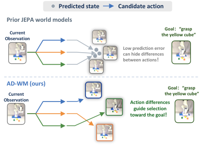
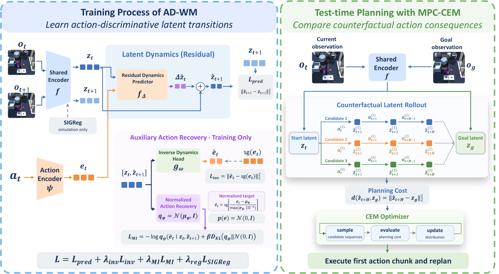
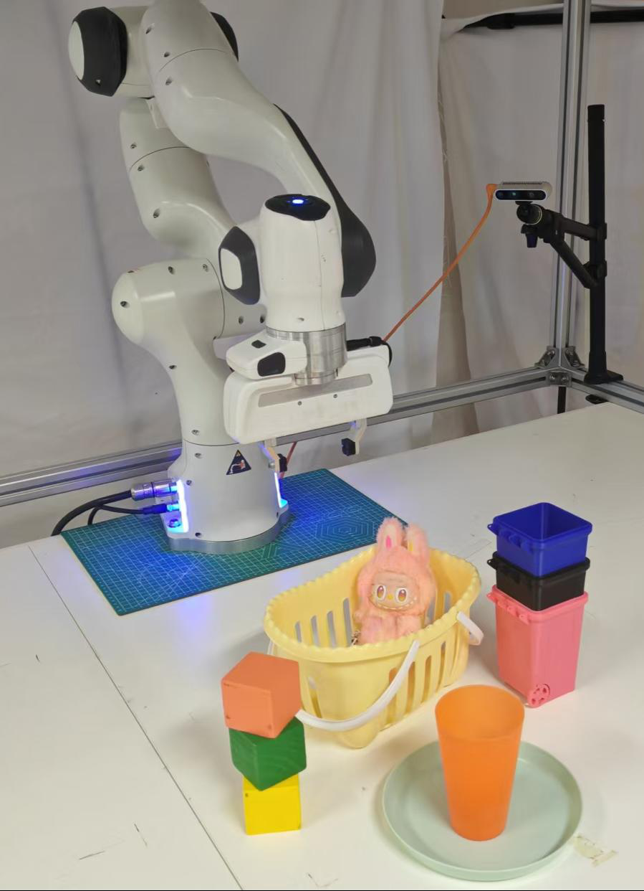

# AI Daily

## 2026-09-26 — AD-WM：讓 JEPA 世界模型真正分辨「不同動作會造成什麼」

> **今日一句話**：AD-WM 指出，world model 的低 factual prediction error 不代表它能在同一個狀態下分辨候選動作的 counterfactual 後果；它以 **residual latent dynamics + predictor-level action recovery** 讓 MPC 使用的 latent rollout 保留 action-dependent differences，並在不改變部署時 MPC 的情況下，把 OGBench-Cube hard-start success 從 3.7% 提高到 52.0%。[1]

*圖 1。論文 teaser 的局部圖像；重點不是畫面預測得多像，而是候選動作是否被 latent dynamics 分開。[1]*

## 一、論文基本資料

| 項目 | 內容 |
|---|---|
| 論文標題 | *AD-WM: Action-Discriminative World Models for Counterfactual Model Predictive Control* |
| 作者 | Jiabin Qiu、Zixuan Chen、Hongye Cao、Jieqi Shi、Jing Huo、Yang Gao；Jiabin Qiu 與 Zixuan Chen equal contribution |
| 研究單位 | Nanjing University |
| 發表狀態 | arXiv:2609.30264v1，2026-09-24；截至 2026-09-26 為預印本，頁面未標示正式會議或期刊 venue |
| 研究領域 | JEPA world model、offline model-based control、latent MPC、action-sensitive representation learning、robot manipulation |
| 主要模型 | simulation 使用 ViT-tiny encoder、192 維 latent、6-layer/16-head predictor；Franka transfer 使用 frozen V-JEPA 2 encoder 與 1024 維 predictor |
| 評估 | OGBench 的 Cube、Reacher、TwoRoom、PushT、Scene，以及 Franka 真機 pick-and-place |
| 核心結果 | matched LeWM 的 Cube hard-start 3.7% → 52.0%；五個 simulation environment 中四個提升；Franka basic pick-and-place 19/45 → 32/45（42.2% → 71.1%） |

論文已逐項比對 `KaiCobra/AI_Daily` 既有文章與 arXiv ID，倉庫中沒有 AD-WM、2609.30264 或同名報告。需要先釐清：AD-WM 是 **JEPA latent world model**，不是 Energy-Based Transformer、VAR、training-free 或 inference-only attention modulation 論文；它的「zero-shot」也只指在共享 pipeline 下轉移到研究者的 Franka setup，而不是沒有 offline data 或沒有 post-training。[1] [2]

## 二、為什麼這篇值得讀

### 2.1 它抓到 planning 與 prediction 之間容易被忽略的失配

對一筆 offline transition，訓練資料只告訴模型「這個狀態執行了這個 action 後，實際去了哪裡」。但 MPC 在測試時要比較的是：**如果從同一個狀態改做另一個 action，哪一條 imagined trajectory 更接近 goal？**

若視覺表徵大部分由不變的背景、桌面或物件外觀組成，一個近似「忽略 action、保留目前 state」的 predictor 可能得到不錯的平均 prediction error，卻把所有候選 action 映射成相似的 terminal latent。對控制而言，這不是小誤差，而是失去排序候選動作的能力。[1]

### 2.2 它把 action information 直接施加到 planner 會使用的 predicted transition

普通 inverse dynamics 可以從真實相鄰表徵恢復 action，但 AD-WM 讓 recovery head 讀取 **current representation 與 predictor 產生的 next representation**。因此 auxiliary gradient 直接約束 MPC 將要 rollout 的 transition，而不只是約束 encoder 對已觀測資料的表示。[1]

### 2.3 它沒有用更大的 planner 掩蓋 representation 問題

部署時會丟掉 inverse head 與 normalized-recovery head，只保留 encoder、action embedding、residual predictor 與原本的 CEM-MPC。也就是說，作者的主張不是「加一個 test-time critic 後變強」，而是「訓練時塑造更能支援 counterfactual selection 的 latent dynamics」。[1] [3]

## 三、核心貢獻與創新點

1. **重新定義 JEPA world model 的品質問題。** 作者把 factual prediction 與 counterfactual action comparison 分開，指出低 latent MSE 不足以保證 closed-loop control 成功。
2. **Residual latent prediction。** 讓 predictor 只估計 latent increment，將大部分持續不變的 state information 留在目前表徵中。
3. **Predictor-level action recovery。** 以 inverse dynamics 與受 conditional mutual information 啟發的 normalized recovery，迫使 predicted transition 保留可恢復的 action information。
4. **Planning-facing diagnostics。** 不只看整個 candidate bank 的 ranking，而是測量 CEM 會保留的 elite set 是否包含真實上接近最佳的候選。
5. **Simulation 與真機 transfer。** 在五個 simulation environment 與 Franka 上驗證，並保留人工 subgoal、單一 camera、非隨機 model block 等條件與限制，不把結果誇大成通用 robot zero-shot。[1] [3]

*圖 2。AD-WM 方法總覽。圖中最重要的設計是：auxiliary recovery heads 只在 training 用，CEM 與 test-time rollout 介面不變。[1]*

## 四、技術方法詳解

### 4.1 問題設定：goal-conditioned latent MPC

給定沒有 reward 的 offline dataset：

$$
\mathcal{D}=\{(o_t,a_t,o_{t+1})\},
$$

其中 $o_t$ 是影像觀測，$a_t$ 是連續 action。Encoder 將 observation 映射到 latent：

$$
 z_t=e_{\phi}(o_t),
 \qquad z_g=e_{\phi}(g),
$$

其中 $g$ 是 goal image。Predictor $F_\theta$ 依目前 latent 與 action 產生未來 latent，MPC 再以 terminal goal distance 評估候選 action sequence $a_{t:t+H-1}$：

$$
\hat c(a)=\left\|\hat z_{t+H}(z_t,a)-z_g\right\|_2^2.
$$

CEM 反覆抽樣候選、保留低成本 elite、重新擬合 sampling distribution，最後只執行第一段 action 再重新規劃。核心危險在於：若 predictor 不區分 action，所有 $a$ 可能得到相近的 $\hat z_{t+H}$，CEM 就沒有可靠的反事實比較依據。[1]

### 4.2 為什麼低 MSE 可能完全不夠

考慮小幅 latent transition：

$$
 z_{t+1}=z_t+\delta_t.
$$

一個 action-independent 的退化 predictor

$$
 F_0(z,a)=z
$$

其 expected factual error 只有：

$$
\mathbb{E}\left[\|\delta_t\|_2^2\right].
$$

但它對所有候選 action 都輸出相同的 state，因而給出相同的 terminal cost。這說明 **prediction accuracy 與 planning usefulness 是不同軸**：前者問「平均上像不像觀測到的 next state」，後者問「能不能把不同 action 的後果分開」。[1]

### 4.3 Residual latent dynamics

令 action embedding 為：

$$
 e_t=\psi_{\rho}(a_t).
$$

AD-WM 不直接讓 predictor 重建完整 next latent，而是預測 increment：

$$
 \Delta\hat z_t=f_\theta(z_t,e_t),
 \qquad
 \hat z_{t+1}=z_t+\Delta\hat z_t.
$$

以 encoder 對真實 successor 的輸出作 supervision：

$$
 z_{t+1}=e_\phi(o_{t+1}),
$$

$$
 \mathcal{L}_{\mathrm{pred}}
 =\left\|\hat z_{t+1}-z_{t+1}\right\|_2^2.
$$

Residual parameterization 不會在 unconstrained function class 中改變理想 optimum；它改變的是 learning bias：模型被明確要求學習 local latent change，而不是每一步重新估計全部 state。[1]

### 4.4 Inverse dynamics：讓 predicted endpoint 留住 action

Inverse head 讀取目前 latent 與 **predicted** next latent：

$$
 \hat e_t=g_\omega(z_t,\hat z_{t+1}),
$$

並以 stop-gradient 的 action embedding 作 target：

$$
 \mathcal{L}_{\mathrm{inv}}
 =\left\|\hat e_t-\operatorname{sg}(e_t)\right\|_2^2.
$$

`sg` 只切斷 target 分支；$\hat z_{t+1}$ 仍可微，因此這個 loss 的梯度會回到 predictor 與 action encoder。換句話說，模型不能只讓真實表徵容易被 inverse head 讀取，還必須讓 **自己 rollout 出來的 predicted transition** 具有 action 可辨識性。[1]

### 4.5 Normalized recovery：以 conditional mutual information 為動機

Inverse loss 受 action embedding 尺度影響。AD-WM 先在 batch 內逐維標準化 action embedding，並 detach normalization target：

$$
 \bar e_t=\operatorname{sg}\left[
 \frac{e_t-\mu_B}{\max(\sigma_B,10^{-6})}
 \right].
$$

再令 recovery distribution 為固定單位 covariance 的 Gaussian：

$$
 q_\eta(\cdot\mid z_t,\hat z_{t+1})
 =\mathcal{N}(\mu_\eta,I).
$$

normalized recovery loss 是：

$$
\begin{aligned}
\mathcal{L}_{\mathrm{MI}}
={}&-\log q_\eta(\bar e_t\mid z_t,\hat z_{t+1})\\
&+\beta D_{\mathrm{KL}}
\left(q_\eta(\cdot\mid z_t,\hat z_{t+1})\,\|\,\mathcal{N}(0,I)\right).
\end{aligned}
$$

因 covariance 固定為 $I$，忽略 additive constant 後可寫成：

$$
\mathcal{L}_{\mathrm{MI}}
=\frac12\left\|\bar e_t-\mu_\eta\right\|_2^2
+\frac\beta2\left\|\mu_\eta\right\|_2^2.
$$

第一項要求從 $(z_t,\hat z_{t+1})$ 恢復 standardized action；第二項抑制 recovery mean 無限制地放大。作者將這個 recovery likelihood 視為 conditional mutual information $I(\bar e_t;\hat z_{t+1}\mid z_t)$ 的 variational term，並額外加入 KL regularization。[1]

### 4.6 聯合訓練與部署

Simulation 的總目標為：

$$
\mathcal{L}
=\mathcal{L}_{\mathrm{pred}}
+\lambda_{\mathrm{sig}}\mathcal{L}_{\mathrm{sig}}
+\lambda_{\mathrm{inv}}\mathcal{L}_{\mathrm{inv}}
+\lambda_{\mathrm{MI}}\mathcal{L}_{\mathrm{MI}}.
$$

其中 $\mathcal{L}_{\mathrm{sig}}$ 沿用 LeWM 的 SIGReg，用於 representation regularization；AD-WM 的新增重點是 residual parameterization、Inv 與 MI。[1] [4]

部署時丟掉 Inv 與 MI heads，只 recursively apply residual dynamics，再交給原本 CEM。Simulation 的主要設定為 300 candidates、30 elites、30 iterations、horizon 5、action block 5；Franka transfer 使用 800 CEM samples、10 elites、10 iterations。這種設計讓方法的主要成本出現在 post-training，而不是每次控制決策再額外執行 recovery network。[1]

### 4.7 Planning-facing diagnostics

在 shared candidate bank $\mathcal{A}=\{a^{(i)}\}_{i=1}^{N}$ 上，先用模型得到 predicted cost $\hat c(a)$，再在 simulator 內實際執行相同候選得到 realized cost $c^\star(a)$。這些 realized outcomes 只用於 simulation diagnosis，不會流入訓練或 MPC。[1]

**Counterfactual Action Discriminability（CAD）** 以 Spearman rank correlation 衡量全候選 bank 的排序一致性：

$$
\mathrm{CAD}(z_t)
=\rho_S\left(\{\hat c(a^{(i)})\}_{i=1}^{N},
\{c^\star(a^{(i)})\}_{i=1}^{N}\right).
$$

若 $E_k(\hat c)$ 是模型選出的 $k$ 個低成本 elites，則 normalized best-in-elite regret 為：

$$
R_k=
\frac{\min_{a\in E_k(\hat c)}c^\star(a)
-\min_{a\in\mathcal{A}}c^\star(a)}
{D_\mathcal{A}},
$$

其中 $D_\mathcal{A}$ 是整個 candidate bank 的 realized cost range。$R_k$ 越低，代表模型至少保留了一個接近真實最佳的候選。另有 elite-mean regret，衡量整個 elite set 的平均 realized cost 與真實 top-$k$ set 的差距。[1]

## 五、實驗結果與性能指標

### 5.1 Cube：hard-start 是最有說服力的差異

Cube 的 hard-start protocols P00–P04 在 tabletop state 上加入 0–4 cm 的 cube $xy$ perturbation；每個 checkpoint、每個 protocol 50 episodes，三個 seeds。AD-WM 與 matched LeWM 使用相同 images、encoder size、training budget 與 MPC 設定。[1] [3]

| 方法 | Original | P00 | P01 | P02 | P03 | P04 | Hard starts 平均 |
|---|---:|---:|---:|---:|---:|---:|---:|
| LeWM | 73.3 ± 2.5 | 8.0 | 4.7 | 4.7 | 1.3 | 0.0 | 3.7 ± 1.4 |
| AD-WM | **90.7 ± 3.4** | **74.0 ± 2.8** | **68.0 ± 4.3** | **56.0 ± 1.6** | **36.7 ± 5.2** | **25.3 ± 3.4** | **52.0 ± 3.1** |

AD-WM 在每一個 Cube protocol 都高於 matched LeWM。外部 baseline 的 inference interface 與 checkpoint 不完全相同，不能把所有差距都歸因於 AD-WM 的 objective；例如 INTACT Direct 在 Original 到 P02 表現更高，但在 P04 AD-WM 為 25.3%，高於 Direct 的 10.0% 與 Actor-CEM 的 10.7%。[1] [3]

### 5.2 五個 simulation environment

| Environment | matched LeWM | AD-WM | 變化 |
|---|---:|---:|---:|
| Cube | 73.3% | 90.7% | +17.4 pp |
| Reacher | 76.7% | 83.3% | +6.6 pp |
| TwoRoom | 90.0% | 98.0% | +8.0 pp |
| Scene | 35.5% | 39.5% | +4.0 pp |
| PushT | 94.0% | 92.0% | −2.0 pp |

因此「四勝一負」是準確摘要，但不是所有任務都改善。Scene 的總體提升在 paired seed test 中仍未解決（$p=0.13$），PushT 也下降 2 個百分點。這兩點使論文的更準確結論是：action-discriminative objective 對部分 configuration-shift 與 goal-conditioned control 有幫助，而不是普遍支配所有 representation learning setting。[1] [3]

### 5.3 消融：Residual 與 MI 是主要增益來源

| Variant | Original | Hard starts |
|---|---:|---:|
| LeWM | 73.3 ± 2.5 | 3.7 ± 1.4 |
| Absolute + Inv + MI | 83.3 ± 0.9 | 14.4 ± 2.9 |
| Residual | 82.7 ± 2.5 | 34.7 ± 1.6 |
| Residual + Inv | 83.3 ± 1.9 | 37.1 ± 4.7 |
| Residual + MI | 89.3 ± 3.8 | **54.7 ± 3.0** |
| AD-WM（Residual + Inv + MI） | **90.7 ± 3.4** | 52.0 ± 3.1 |

最重要的訊號是：

- 單獨換成 residual predictor，hard-start 從 3.7% 到 34.7%。
- 在 residual 之上加入 MI，達到 54.7%；預設完整 AD-WM 的 52.0% 並非後設敏感度實驗的最高均值。
- 預設 $\lambda_{\mathrm{MI}}=0.01$；事後測試中 $\lambda_{\mathrm{MI}}=0.03$ 的 hard-start mean 為 65.2%，但作者保留預先指定的 default 作為 headline model。
- Inv 的效果較小且依 weight 而變；default 0.10 並不比 no-Inv mean 高，0.05 與 0.20 反而較高。

這組結果讓方法解讀更精確：AD-WM 的主要故事不是「兩個 auxiliary head 都同等重要」，而是 residual inductive bias 與 normalized recovery 對 candidate selection 的作用比較穩定；plain inverse dynamics 的額外增益較脆弱。[1] [3]

### 5.4 低 MSE 反而可能對應低 control success

Cube planning diagnostics 的數字很反直覺：

| Variant | One-step MSE ↓ | Local MSE ↓ | CAD ↑ | Best-elite regret ↓ | Elite-mean regret ↓ | Hard starts ↑ |
|---|---:|---:|---:|---:|---:|---:|
| LeWM | **2.72** | **10.36** | 0.460 | 0.074 | 0.298 | 3.7 |
| Res + Inv | 3.43 | 11.00 | **0.470** | 0.043 | 0.245 | 37.1 |
| Res + MI | 4.20 | 15.17 | 0.454 | **0.029** | **0.228** | **54.7** |
| AD-WM | 4.27 | 15.77 | 0.448 | **0.029** | 0.229 | 52.0 |

MSE 已乘 $10^3$。LeWM 的 factual MSE 最低，卻是 hard-start success 最差；AD-WM 的 MSE 最高，卻有更低的 elite regret。跨 15 個 model–seed observations，hard-start success 與 CAD 的 Spearman correlation 是 $-0.399$，與 negative best-in-elite regret 和 negative elite-mean regret 則分別為 $0.863$ 與 $0.810$。這支持作者的核心判斷：**CEM 真正需要的是 elite set 的品質，而不是整個 candidate bank 的平均排序或單步重建誤差。**[1]

### 5.5 Franka：有價值，但要正確理解「zero-shot」

Franka 實驗使用 frozen V-JEPA 2 ViT-G encoder、matched DROID post-training、相同 predictor architecture、CEM、clipping 與 deployment stack；沒有使用 laboratory-specific images 或 demonstrations 做 adaptation。[1] V-JEPA 2 的上游工作本身先用超過 1M 小時 internet video 預訓練，再以少量 DROID interaction data 訓練 V-JEPA 2-AC，展示以 latent prediction 做 robot planning 的路線。[6]

| Protocol | V-JEPA 2-AC | AD-WM |
|---|---:|---:|
| Basic pick-and-place | 19/45（42.2%） | **32/45（71.1%）** |
| Complex-object success | 2/10 | **5/10** |
| Specified target moved | 14/27 | **21/27** |
| Specified-target lift-and-place | 9/27 | **17/27** |
| Abnormal motion（越低越好） | 6/10 | **2/10** |

但 protocol 仍是 short-horizon MPC：single side/rear RealSense camera、8 frames at 4 fps、manual grasp/move/place image goals、非隨機 model blocks、單一 site。作者也明確說這些不是完整 evaluation set 的影片統計，不能解讀成跨 lab、跨 robot、跨 camera 的普遍 zero-shot generalization。[1] [3]

*圖 3。Franka 與單一 RGB camera 的實驗環境局部畫面。這張圖由 `pdf-image-extractor` 從 AD-WM PDF 提取後放入本報告的 `asset/`。[1]*

## 六、相關研究與差異

### 6.1 LeWorldModel：穩定性先於 action sensitivity

LeWM 是 AD-WM 最直接的 simulation baseline。它主張以約 15M 參數、end-to-end pixel training、next-embedding prediction 與 Gaussian-distribution regularizer 穩定 JEPA，並在單一 GPU 上以低成本完成 latent MPC；其報告稱 planning 可比 foundation-model world model 快至 48 倍。[4]

AD-WM 沿用 LeWM 的 SIGReg 與 evaluation family，卻把問題往前推一步：**latent 不 collapse 並不等於 latent 對 action 足夠敏感**。因此 AD-WM 的 residual、Inv、MI 不是單純替代 SIGReg，而是為 planning transition 加入 action-discriminability bias。[1] [4]

### 6.2 Delta-JEPA：相似方向，但 recovery 施加的位置不同

Delta-JEPA 也認為 reconstruction-free JEPA 容易學出 action-insensitive latent，提出 Latent Difference Action Decoder（LDAD）：

$$
\Delta z_t=z_{t+1}-z_t,
\qquad
\hat a_t=D_\Theta(\Delta z_t),
$$

並用 $\|\hat a_t-a_t\|_2^2$ 直接監督 latent displacement。[5]

兩者共同的研究直覺是：**action supervision 應該約束 transition geometry，而不只是讓 representation 分佈看起來健康。** 差異在於：

- Delta-JEPA 的 LDAD 從真實相鄰 latent 的 displacement 解碼 action，重點是讓不同 action 造成可分辨的 latent difference。
- AD-WM 的 inverse head 與 MI head 讀取 current latent 與 **predicted endpoint**，所以梯度直接穿過 model-generated rollout；它另外使用 residual prediction、conditional-MI-inspired normalized objective 與 CEM elite-regret diagnostics。[1] [5]

這兩條路線可以合併成很有價值的 ablation：真實 displacement recovery、predicted endpoint recovery、predicted increment recovery 是否在不同 offline coverage 下各自有優勢？AD-WM 的 Table II 已顯示，Inv 改讀 predicted increment 或 encoded endpoint 時，MI-enabled hard-start mean 可到 60.3% 或 60.7%，值得進一步做統一 protocol。[1]

### 6.3 V-JEPA 2：foundation encoder + small interaction post-training

V-JEPA 2 以超過 1M 小時 internet-scale video 預訓練 video encoder，再用少量 robot interaction data 訓練 300M-parameter V-JEPA 2-AC predictor；它展示 frozen visual encoder 加 action-conditioned latent predictor 可以在新環境做 prehensile manipulation。[6]

AD-WM 的 Franka transfer 正是沿用這種 foundation representation 路徑，但把 predictor objective 改成 action-discriminative：共享 frozen encoder、DROID post-training 與 MPC pipeline，檢驗 improvement 是否來自 transition parameterization 與 auxiliary loss，而不是更換視覺 backbone。[1]

### 6.4 LeJEPA、DINO-WM 與 action-grounded world model 的位置

- **LeJEPA／SIGReg**：主要處理 representation distribution 與 anti-collapse；AD-WM 關心的是沿 model rollout 的 action-conditioned distinguishability。[4]
- **DINO-WM**：以 frozen pretrained visual feature 做 goal-conditioned zero-shot planning，說明 representation quality 可以直接支援 new goal planning；AD-WM 則在 learned predictor 中加入 action recovery，嘗試讓 candidate transition 更適合 MPC。[7]
- **Action-aware representation learning**：inverse dynamics 是常見的 controllability signal，但 AD-WM 的重點是把它放在 predicted transition 上，並用 elite regret 直接對應 closed-loop control，而不只報 representation probing。[1]

## 七、對 Energy-based Transformer、VAR、training-free 與 attention modulation 的啟發

### 7.1 Energy-Based Transformer：從 prediction error 走向 transition compatibility energy

可以把 AD-WM 的訓練訊號重寫成 candidate transition energy：

$$
\begin{aligned}
E_{\mathrm{AD}}(z_t,\hat z_{t+1},a_t)
={}&\lambda_p\|\hat z_{t+1}-z_{t+1}\|_2^2\\
&+\lambda_a\|g_\omega(z_t,\hat z_{t+1})-\operatorname{sg}(e_t)\|_2^2\\
&+\lambda_m\,\mathcal{L}_{\mathrm{MI}}.
\end{aligned}
$$

在 training 時，它是 supervision；在 inference 時，可以改成：

1. 以 $E_{\mathrm{AD}}$ 對 CEM elites rerank；
2. 以 action-recovery disagreement 作 uncertainty gate；
3. 對 physical plausibility、goal distance 與 action recoverability 做 multi-energy Pareto selection；
4. 讓 Energy-Based Transformer 的 hidden state 直接預測「transition compatibility」，而不是只有 next-token likelihood。

真正值得做的不是把所有 loss 名稱換成 energy，而是驗證 energy 是否在 **不同 task、horizon、action distribution 與 OOD state** 上仍然 calibrated。AD-WM 現在的 realized cost diagnostics 只在 shared simulator candidate bank 上使用，尚不是跨任務 energy calibration。[1]

### 7.2 JEPA × VAR：將 action-sensitive transition 放到 next-scale token space

VAR 將 image token 以 coarse-to-fine next-scale 方式生成。可以把 AD-WM 的 residual transition 改成 scale-conditioned predictor：

$$
\Delta \hat z_t^{(\ell)}
=F_\ell\left(z_t^{(\leq \ell)},c\right),
$$

其中 $c$ 可以是 text condition、edit condition 或 layout constraint。對每一個 scale 同時加入：

- token prediction loss；
- condition recovery loss；
- coarse-scale layout／identity energy；
- fine-scale local detail／boundary energy。

這會把「下一個 scale 哪些 token 最可能」改成「哪些 token transition 既符合條件，又落在可解釋的 compatibility manifold」。尤其可以測量：一個 token candidate 是否保留 prompt attribute、object identity 與 spatial relation，而不是只看 local logit。

### 7.3 Training-free attention modulation：以 predictive disagreement 決定何時介入

AD-WM 不是 training-free，因為 encoder/predictor 與 recovery objectives 都需要 post-training。但它可以提供一個更有結構的 inference-time signal：

$$
\Delta E_{\mathrm{disagree}}
=\operatorname{Var}_{a\in\mathcal{C}}
\left[E_{\mathrm{AD}}(z_t,\hat z_{t+1}^{(a)},a)\right].
$$

在 diffusion 或 VAR sampling 時，只有當多個 candidate 的 predicted transition energy／condition recovery disagreement 很大，才增加 attention modulation；若 candidate ranking 已穩定，就降低 guidance。這比固定每一層、每一個 timestep 使用相同 bias 更接近 model-predictive control。

一個嚴格的 training-free protocol 應該同時報告：原始 model、介入後品質、額外 forward/backward 次數、wall-clock、是否需要 per-image optimization，以及是否使用 hidden labels 或 external verifier。不能把「frozen backbone」直接寫成 zero-shot 或 zero-cost。

### 7.4 嚴格拆開 zero-shot 的四種含義

AD-WM 的真機結果適合稱為 **within-pipeline zero-shot transfer without lab-specific adaptation**，但不適合泛稱為完全 zero-shot。至少要分開：

1. new goal image；
2. new object／layout；
3. new camera、dynamics、friction 或 action scale；
4. 沒有相關 offline trajectory 或 post-training data。

AD-WM 目前主要支持前兩種附近的 transfer，並未證明後兩種。下一個實驗應以部分 dynamics regime 訓練，測試不同 object mass、friction、viewpoint、robot 或 action scale，再比較 LeWM、AD-WM、Delta-JEPA 與 energy-reranked planner。[1] [5]

## 八、限制與批判性評估

1. **預印本與 venue status。** 截至本文整理日，AD-WM 是 arXiv v1，頁面未標示已接收的頂會或期刊；結果應視為值得追蹤的 early signal，而非同行評審後的定論。[1] [2]
2. **simulation 的統計訊號仍有限。** Scene 的 overall paired seed test 為 $p=0.13$；PushT 從 94% 降至 92%；而 external baselines 的 training、checkpoint 與 inference interface 不完全 matched。[1]
3. **headline model 不是每項消融的最佳點。** Res + MI 的 hard-start mean 為 54.7%，高於完整 AD-WM 的 52.0%；$\lambda_{MI}=0.03$ 的 post-hoc mean 為 65.2%，因此作者的 default choice 與後設敏感度 peak 應分開報告。[1] [3]
4. **real-robot protocol 不是開放式 long-horizon autonomy。** 實驗使用 manual image goals、structured grasp/move/place stages、single camera、non-randomized model blocks 與 single site。成功率改善有意義，但不能直接外推至任意 robot policy 或未見 dynamics。[1] [3]
5. **offline coverage 與 model rollout OOD。** CEM 可以在 latent space 搜尋到低 goal distance，卻不保證 action sequence 在 training distribution 內。下一步需要把 recovery disagreement、elite regret 或 transition energy 當作 OOD detector，而不是只延長 planning horizon。

## 九、我的評價與研究意義

我認為 AD-WM 最值得帶走的不是「加了一個 inverse head」，而是它把 world-model quality 拆成三個可以各自驗證的層次：

- **factual prediction**：預測觀測到的 successor；
- **action identifiability**：從 transition 恢復造成變化的 action；
- **planning alignment**：CEM 實際保留的 elite 是否接近真實可行動後果。

這個拆分能避免一個常見錯誤：把總 loss 下降、latent MSE 下降或 trajectory 更平滑，直接當成 world model 更好。AD-WM 的 Cube 結果甚至顯示，較低 factual MSE 的 LeWM 在 hard-start control 上更差；因此對使用者關注的 Energy-based Transformer、JEPA、VAR 與 attention modulation，最有價值的研究問題是：**模型是否能把條件、動作、空間關係與物理後果保持在可比較的 latent geometry 中？**

如果要從今天開始做一個最小可行研究，我會選擇 **Energy-Gated JEPA–VAR**：

1. 以 frozen 或 lightly-tuned VAR 產生多個 scale-wise token candidates；
2. 用 JEPA-style predictor 預測每個 candidate 對 identity、layout、attribute 的 latent change；
3. 以 action/condition recovery 與 normalized uncertainty 建立 transition compatibility energy；
4. 只在 energy disagreement 高的 scale 做 attention modulation；
5. 以 composition、identity preservation、layout consistency、額外延遲與 strict zero-shot protocol 同時評估。

這樣的延伸不會把 AD-WM 誤稱成圖像生成方法，而是把它提供的「**保留可用差異，而不只追求平均預測準確**」原則，移植到 VAR 與 diffusion 的條件生成場景。

## References

[1]: https://arxiv.org/html/2609.30264v1 "AD-WM: Action-Discriminative World Models for Counterfactual Model Predictive Control"
[2]: https://arxiv.org/abs/2609.30264 "AD-WM arXiv abstract and bibliographic metadata"
[3]: https://ad-wm.github.io/ "AD-WM project page, results, diagnostics, and robot demonstrations"
[4]: https://arxiv.org/html/2603.19312v1 "LeWorldModel: Stable End-to-End Joint-Embedding Predictive Architecture from Pixels"
[5]: https://arxiv.org/html/2606.31232v1 "Delta-JEPA: Learning Action-Sensitive World Models via Latent Difference Decoding"
[6]: https://arxiv.org/html/2506.09985v1 "V-JEPA 2: Self-Supervised Video Models Enable Understanding, Prediction and Planning"
[7]: https://proceedings.mlr.press/v267/zhou25t.html "DINO-WM: World Models on Pre-trained Visual Features enable Zero-shot Planning"
