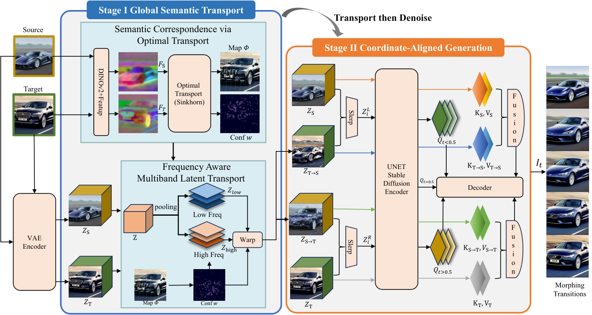
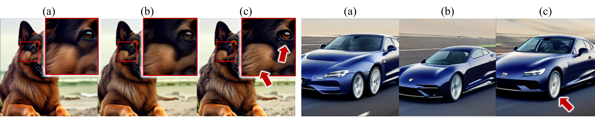
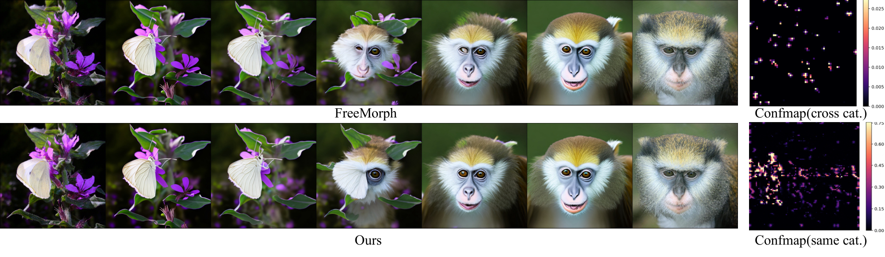

# AI Daily

## AlignMorph：用顯式語義傳輸解決 Diffusion Image Morphing 的重影問題

> **一句話結論：** AlignMorph 把免訓練的 diffusion image morphing 改寫成 **transport-then-denoise**：先用 DINOv2+FeatUp 特徵與熵正則最優傳輸建立稠密語義對應，再以可靠度感知的多頻帶 latent warp 對齊幾何，最後在去噪過程中以雙階段 attention handoff 切換座標系。這個拆分直接處理大布局差異造成的 ghosting、透明疊影與時間不連貫，並在 MorphBench/Morph4Data 的整體指標上優於 FreeMorph、DiffMorpher 與 IMPUS。[1] [2]

## 論文基本資訊

| 項目 | 內容 |
|---|---|
| 論文 | *AlignMorph: Tuning-Free Diffusion Image Morphing via Explicit Semantic Transport* |
| 作者 | Wuyi Liu、Xu Han、Yuren Chen、Yige Mao、Zishuo Peng、Xianzhi Li（以 arXiv metadata 與 ECCV 接收清單為準）[1] [2] |
| 研究單位 | Huazhong University of Science and Technology、Beijing Jiaotong University、Beihang University；arXiv 候選資料另列 Peking University，但官方 ECCV PDF 首頁未列該單位，且漏列 Zishuo Peng，作者—機構對應應等待最終 proceedings 核對。[1] [3] |
| 發表狀態 | **ECCV 2026 accepted paper**；官方頁面列為 Poster #4288。arXiv:2609.24330v1 於 2026-09-21 提交。[1] [2] |
| 研究主題 | Diffusion image morphing、semantic correspondence、optimal transport、training-free inference、latent warping、attention modulation |
| 實作基礎 | Stable Diffusion 2.1、DDIM、DINOv2+FeatUp、單張 RTX 3090；官方程式碼已公開。[4] [5] |
| 本庫排除查核 | 已比對 `README.md`、`INDEX.md`、`papers/` 目錄中的標題、arXiv ID、作者與方法關鍵字，未找到 2609.24330、AlignMorph 或同標題文章，因此是本次新增研究。 |

### 為什麼今天選它

這篇論文的價值不只在於把一個 morphing benchmark 的數字做得更好，而在於它指出了 diffusion morphing 中一個容易被忽略的結構性問題：**若兩個端點的語義部件位於不同座標，直接插值 latent 或混合 attention memory，模型會在錯誤座標之間做 retrieval。** FreeMorph 已經免除逐對調參，但仍主要依賴隱式空間對齊；AlignMorph 則先建立可檢查的 semantic transport，再讓去噪只負責生成與細節修復。[1] [6]

它也與你近期關注的方向有直接交集。它是 inference-time 的 training-free attention/latent modulation，提供了可替換的 reliability gate；它把「能否把某個 token 搬到另一個座標」變成 OT cost、cycle consistency 與 confidence 的問題；它的雙階段 handoff 又天然提供一個可與 VAR 的 scale-wise routing 或 JEPA predictive uncertainty 對接的控制點。不過，論文本身不是 Energy-Based Transformer、JEPA 或 VAR；下面的跨領域延伸會明確區分原論文結果與研究構想。

## 核心貢獻

### 1. 用全局 OT 建立語義而非像素對應

給定 source image $S$ 與 target image $T$，作者先以 DINOv2+FeatUp 取得 dense semantic features。令 source token 與 target token 分別為

$$
\{x_i,p_i\}_{i=1}^{N_S},\qquad \{y_j,q_j\}_{j=1}^{N_T},
$$

其中 $x_i,y_j$ 是特徵向量，$p_i,q_j\in\mathbb{R}^2$ 是它們的二維座標。token 之間的成本使用 cosine distance：

$$
C_{ij}=1-\frac{\langle x_i,y_j\rangle}{\lVert x_i\rVert_2\lVert y_j\rVert_2}.
$$

接著在均勻邊際分布下解 balanced entropic optimal transport。以 log-domain Sinkhorn 得到 transport plan $T^{\star}$，再以 row-normalized barycentric projection 轉成 source-to-target 的連續座標圖：

$$
\bar T_{ij}=\frac{T^{\star}_{ij}}{\sum_kT^{\star}_{ik}+\delta},
\qquad
\Phi_{S\to T}(p_i)=\sum_j\bar T_{ij}q_j.
$$

這個選擇有一個重要含義：它不是對每個 source token 貪婪地選一個 target token，而是先在全局上尋找成本較低、質量守恆的對應，因此較不容易把大量 source 部件錯誤地壓到同一個 target 區域。方法圖中的 `warping.png` 也顯示了車輛、狗與人物臉部等部件在不同取景下的跨位置傳輸。[1]

### 2. 用 cycle consistency 和 plan sharpness 抑制錯誤搬運

OT 在遮擋、背景或跨類別區域仍可能產生不可靠的 soft match。作者因此同時計算反向映射，並用 forward–backward cycle error 衡量幾何一致性：

$$
\Delta(p_i)=\left\|p_i-\Phi_{T\to S}\bigl(\Phi_{S\to T}(p_i)\bigr)\right\|_2.
$$

再把 OT plan 的 row-max mass 作為 confidence，形成可靠度權重：

$$
 w(p_i)=c_{S\to T}(p_i)\,c_{T\to S}\bigl(\Phi_{S\to T}(p_i)\bigr)
 \exp\left(-\frac{\Delta(p_i)^2}{2\sigma^2}\right).
$$

這讓模型不必強迫所有像素都產生看似精確的 warp。對同類別但位移很大的端點，confidence map 通常仍然密集；對 flower-to-monkey 這類沒有明確部件對應的 pair，confidence 會下降，方法便減少錯誤搬運，退化成 interpolation-dominant 的路徑。[1]

### 3. 以多頻帶 latent transport 分開「結構」與「紋理」

若把整個 diffusion latent 直接 warp，低頻的布局資訊雖然能對齊，高頻的紋理與噪聲統計卻會被同樣的幾何變換破壞。AlignMorph 因此將 latent 分解為

$$
 z=z_{\mathrm{low}}+z_{\mathrm{high}},
 \qquad
 z_{\mathrm{high}}=z-z_{\mathrm{low}}.
$$

其中 $z_{\mathrm{low}}$ 使用 $9\times9$ average pooling 取得，$z_{\mathrm{high}}$ 則保留局部細節與 stochastic residual。令 $\mathcal{W}(\cdot;\Phi^z)$ 代表 latent-grid warp，$w^z$ 是投影到 latent grid 的可靠度，傳輸後的 latent 為

$$
 z^{\prime}=\underbrace{\mathcal{W}(z_{\mathrm{low}};\Phi^z)}_{\text{幾何結構搬運}}
 +\underbrace{w^z\,\mathcal{W}(z_{\mathrm{high}};\Phi^z)+(1-w^z)z_{\mathrm{high}}}_{\text{高頻統計保留}}.
$$

也就是說，低頻結構會積極對齊；高頻訊號只有在 correspondence 可靠時才跟著搬運，否則保留原本的局部統計。這是本篇最值得移植到其他生成模型的設計：**alignment strength 不應該對所有頻率、所有位置都相同。**

*圖 1。AlignMorph 的兩階段流程。Stage I 先建立共用語義座標，Stage II 再在座標一致的條件下進行 diffusion denoising。*

*圖 2。左側狗臉局部放大與右側車燈/車身細節顯示，直接 warp 全部 latent 會造成模糊或細節損失；多頻帶傳輸能保留較清晰的高頻結構。*

### 4. 以雙向 Slerp 和 bi-phase attention handoff 維持座標一致

完成 source-to-target 與 target-to-source 的 latent transport 後，作者不是只生成一條未對齊的直線，而是建立兩條方向相反的路徑。令 $\alpha_i=i/(N-1)$，其中 $i$ 是 frame index：

$$
 z_i^L=\operatorname{Slerp}(z_S,z_{T\to S},\alpha_i),
 \qquad
 z_i^R=\operatorname{Slerp}(z_{S\to T},z_T,\alpha_i).
$$

在中點 $m=\lfloor N/2\rfloor$，作者先以半強度 transport 把右路徑拉回 source frame，再融合兩個中點候選，以減少切換不連續：

$$
 \tilde z_m^{R\to S}=\mathcal{T}_{1/2}(z_m^R;\Phi^z_{T\to S},w_S^z),
 \qquad
 z_m=\operatorname{Slerp}(z_m^L,\tilde z_m^{R\to S},0.5).
$$

對任一 UNet attention layer，query $Q_{i,k}^l$ 由當前 frame latent 產生；兩組 endpoint memory 則來自當前 phase 的 aligned latent。attention 輸出是

$$
\operatorname{Out}_{i,k}^l
=(1-\lambda_i)\operatorname{Attn}(Q_{i,k}^l,K_{i,k}^{(1)},V_{i,k}^{(1)})
+\lambda_i\operatorname{Attn}(Q_{i,k}^l,K_{i,k}^{(2)},V_{i,k}^{(2)}),
$$

其中 $\lambda_0=0$、$\lambda_{N-1}=1$，並且在 morph midpoint 將 memory pair 從 $(z_S,z_{T\to S})$ 切換成 $(z_{S\to T},z_T)$。這個 handoff 的重點不是「把兩個 attention map 做平均」，而是先讓 query 與 K/V 位於同一幾何座標，再做 interpolation。

作者的消融提供一個很有用的機制性結論：移除 bi-phase handoff 後，路徑被限制在 source-aligned frame，不能完整進入 target geometry；移除 K/V warp 的損失較小，表示 query-side latent alignment 是主要的宏觀幾何驅動，而 K/V alignment 更像是細節與 texture consistency 的補強。[1]

## 實驗設定與結果

作者嚴格沿用 FreeMorph protocol，在 Stable Diffusion 2.1 上使用 DDIM scheduler，50 個 scheduler steps、40-step inversion/denoising、$768\times768$ 解析度、CFG 7.5，產生 7 frames。semantic correspondence 最多使用 16,384 個 DINOv2+FeatUp tokens，Sinkhorn 的 entropy regularization 為 $\varepsilon=0.1$、100 次迭代，cycle threshold 為 8 pixels，最低 confidence 為 0.2。所有主要設定在單張 RTX 3090 上完成。[1] [4]

### 1. MorphBench 與 Morph4Data

評估指標為 adjacent-frame LPIPS、FID 與 PPL，三者皆以越低越好。下表使用論文 Table 1 的 Overall 結果；FreeMorph 同時列出作者引用數字與官方 implementation 的 reproduced 數字，這兩者略有差異，因此不混用。

| 方法 | Overall LPIPS ↓ | Overall FID ↓ | Overall PPL ↓ |
|---|---:|---:|---:|
| IMPUS | 265.40 | 174.76 | 6462.93 |
| DiffMorpher | 189.13 | 209.10 | 4658.25 |
| FreeMorph（論文引用） | 165.21 | 152.88 | 4130.32 |
| FreeMorph（reproduced） | 164.57 | 154.45 | 4138.79 |
| **AlignMorph** | **153.78** | **140.12** | **3896.93** |

相較 reproduced FreeMorph，AlignMorph 的 Overall LPIPS、FID、PPL 約分別降低 **6.6%、9.3%、5.8%**。這個改善不是單純來自更換 backbone，而是與 FreeMorph 相同的 SD 2.1、DDIM 與影像尺寸協議下，加入顯式 correspondence、multiband transport 與 coordinate handoff 的結果。[1]

### 2. 消融：每個模組對應一個失敗模式

在 Morph4Data 上，論文的消融結果如下。

| 變體 | LPIPS ↓ | FID ↓ | PPL ↓ |
|---|---:|---:|---:|
| FreeMorph | 80.30 | 201.09 | 2007.52 |
| Random OT | 132.14 | 297.60 | 2803.76 |
| w/o Multiband | 88.16 | 231.97 | 2255.20 |
| w/o Handoff | 91.70 | 257.91 | 2670.11 |
| w/o KV warp | **76.12** | 193.76 | 1940.46 |
| **AlignMorph** | **74.23** | **188.44** | **1896.30** |

Random OT 破壞了語義對應，證明 OT 不是只用來產生平滑的任意 warp；移除 multiband 會讓毛髮等高頻細節變模糊；移除 handoff 則讓過程難以從 source frame 進入 target frame。值得注意的是，`w/o KV warp` 的 LPIPS 低於完整模型，說明單一指標不能代表完整的結構正確性；作者仍根據 FID、PPL 與定性案例判斷 K/V warp 對消除殘餘 texture drift 有幫助。[1]

### 3. 使用者研究與運算成本

使用者研究包含 25 位參與者，每人觀看 50 個隨機案例，依 structural integrity 與 smoothness 選出最佳結果。AlignMorph 的偏好率為 **50.9%**，FreeMorph 為 26.4%，IMPUS 為 14.5%，DiffMorpher 為 8.2%。這不是盲測統計的完整信賴區間，樣本規模也有限，因此較適合解讀為補充性的 perceptual evidence，而不是取代 benchmark。[1]

單張 RTX 3090 上，每個 image pair 約需 **115 秒**，其中 offline correspondence 約 25 秒，diffusion sampling 約 90 秒；FreeMorph 約 90 秒。作者所說相對 optimization-based 方法約 20×–50× 的加速，主要是避免逐對 LoRA 或 latent optimization，並不是比所有 training-free 方法都快。[1] [4]

## 相關研究：AlignMorph 位於哪條路線

### IMPUS：以 probability-flow ODE 和文字嵌入追求 perceptually uniform morph

IMPUS 把 morphing 寫成 smoothness、realism 與 directness 的折衷，透過 diffusion inversion、textual inversion 與 probability-flow ODE 在 embedding/latent 空間構造路徑，並以 bottleneck constraint 控制直接性。[8] 它的優點是理論上更接近 perceptual path 的設計，缺點是仍需對 image pair 做優化，因此在大規模或互動式使用上成本較高。AlignMorph 不試圖重新學出一條全局最優 path，而是先用 OT 解決局部空間座標的錯配。

### DiffMorpher：以逐對 LoRA 和 attention interpolation 保留端點身份

DiffMorpher 為每個輸入影像訓練 LoRA，再對 LoRA 參數、latent noise、文字條件與 self-attention 做插值；它能把單張影像的高層語義寫進低秩參數，但逐對 fine-tuning 使成本上升，且大布局差異仍可能造成中間結構不穩定。[7] AlignMorph 的 training-free 主張正是針對這個 per-pair optimization bottleneck，但代價是更依賴預訓練視覺特徵能否找到有意義的對應。

### FreeMorph：第一個重要的免調參 diffusion morphing 基線

FreeMorph 以 guidance-aware spherical interpolation、prior-driven self-attention 與 step-oriented variation trend 在 frozen diffusion model 內產生中間帧，並以改良 DDIM inversion/denoising 提供快速 morphing。[6] AlignMorph 沿用其低成本與 attention intervention 精神，但把原本 implicit spatial alignment 改成顯式 OT correspondence。換句話說，FreeMorph 解決的是「不調參也要生成平滑序列」；AlignMorph 進一步解決「端點在不同空間位置時，attention 到底應該在哪一個座標讀取」。

### FlowMorph：把 geometry offset 與 semantic vector 分離

FlowMorph 同樣是 training-free 路線，但其核心是把 frozen flow model latent 拆成 geometry offset 與 semantic one-step vector，再以線性/球面混合控制 morph。[9] 它與 AlignMorph 的共同點是都拒絕把所有變化壓在單一 latent 插值上；差別是 FlowMorph 在 latent dynamics 中分離「形狀」與「語義」，AlignMorph 則在空間對應與頻率成分上分離「座標」與「紋理」。兩條路線可以互補：前者提供可優化的 semantic direction，後者提供 spatially reliable transport map。

## 對 EBT、JEPA、VAR 與 zero-shot 的啟發

### 1. Energy-based reliability controller

AlignMorph 的 OT cost 與 confidence map 可以被重新表達成 compatibility energy，但不能直接把 attention logit 稱為完整 Energy-Based Transformer。較嚴謹的延伸是定義

$$
E_{ij}=C_{ij}+\lambda_{\mathrm{cyc}}\Delta_{ij}^{2}
-\lambda_{\mathrm{feat}}\,\operatorname{sim}(x_i,y_j),
$$

再用 energy margin 或 normalised free energy 決定某個位置是否允許高頻 warp。若 energy 不確定，controller 應降低 transport strength、擴大保留的高頻 residual，或回退到 full attention。這會把固定的 minimum confidence 0.2 改成 sample-adaptive 的 compute/transport policy。實驗上應同時測 LPIPS、FID、PPL、平均 warp ratio 與 GPU energy；只有品質與運算的 Pareto curve 都改善，才足以支持 EBT-style routing 的說法。這是研究構想，不是 AlignMorph 已驗證的 EBT 模組。

### 2. JEPA predictive disagreement 作為 handoff fallback

bi-phase handoff 目前由固定 morph progress 和 midpoint 控制。可以加入一個 frozen 或輕量 predictor，預測當前 aligned latent 在下一個 denoising phase 的表示：

$$
\widehat z_{k+1}=g_{\phi}(z_k,\alpha_k),
\qquad
U_k=\left\|\operatorname{sg}(z_{k+1})-\widehat z_{k+1}\right\|_2^2.
$$

當 $U_k$ 在某個 frame 或 spatial band 顯著升高時，controller 暫停 handoff、降低 $\lambda_i$ 的變化速度，或暫時回到 source/target 的較寬 memory。這把 JEPA 的 predictive consistency 變成 diffusion inference-time 的 uncertainty signal。要注意：若 predictor 需要額外訓練，整個系統便不再是完全的 zero-training；若使用預訓練視覺 predictor，仍需驗證其 latent geometry 與 diffusion latent 是否相容。

### 3. VAR 的 scale-wise semantic transport

AlignMorph 的 coordinate map 目前建立在 diffusion latent grid。對 VAR，可將 token 位置寫成 $(s,r,c)$，其中 $s$ 是 scale，$(r,c)$ 是該 scale 的二維位置，並令 transport strength 依 scale 變化：

$$
 z^{\prime}_{s,r,c}
=\mathcal{W}_{s}(z_{s,\mathrm{low}};\Phi_s)
 +\rho_s(r,c)\,\mathcal{W}_{s}(z_{s,\mathrm{high}};\Phi_s)
 +\bigl(1-\rho_s(r,c)\bigr)z_{s,\mathrm{high}}.
$$

粗尺度先負責 object layout 與 semantic binding，細尺度再根據 confidence 和 predictive disagreement 逐步釋放紋理。這可能比把同一組 attention modulation 參數套在所有 VAR scales 更合理，也能與近期的 VAR test-time compositional alignment、logit refinement 及 dynamic-resolution tokenizer 形成可比較的實驗矩陣。[10] [11] [12]

### 4. 嚴格區分 training-free、zero-shot 與 zero-cost

AlignMorph 不更新 diffusion backbone，也不為每個 image pair 訓練 LoRA，因此可以稱為 **training-free inference**。但它仍需要 DINOv2+FeatUp 特徵提取、Sinkhorn OT、latent inversion、50-step denoising 與 115 秒左右的推理時間。它也不是「不使用任何先驗」的 zero-shot：它依賴 Stable Diffusion 2.1、DINOv2、FeatUp 與人工/自動 caption。這個界線很重要，否則容易把免調參方法誤寫成零成本或完全 zero-shot 方法。

## 限制與我的評價

AlignMorph 最重要的限制不是 deformation magnitude，而是 **是否存在可定義的 semantic correspondence**。同類別車輛或狗即使有很大的位置變化，仍可能找到輪胎對輪胎、臉部對臉部的對應；花朵到猴子則沒有自然的 canonical mapping。此時 confidence map 低，reliability gate 雖能避免更嚴重的錯誤 warp，卻也代表方法的顯式對齊優勢會下降。[1]

*圖 3。方法不會假裝跨類別 correspondence 很可靠；它寧可抑制 transport，讓生成路徑退回較偏 interpolation 的狀態。*

第二個限制是成本。115 秒雖然比逐對 optimization 低很多，但不屬於即時互動；25 秒的 DINOv2+FeatUp 與 Sinkhorn correspondence 也不是免費的。第三個限制是實驗規模。論文主要使用 MorphBench/Morph4Data、Stable Diffusion 2.1 與 25 人使用者研究；表格沒有標準差或信賴區間，FreeMorph 的引用結果與 reproduced 結果也略有差異。因此，結果支持「顯式空間對齊有效」這個機制性結論，但還不足以證明它在所有 diffusion backbone、非自然圖像或開放類別 morphing 上都穩定。

我的評價是：**這篇論文最值得帶走的不是 Sinkhorn 本身，而是它對 attention modulation 的座標觀。** 在生成模型中，query 決定「在哪裡讀取」，K/V 決定「讀取什麼」；若 query 與 memory 不在同一個語義座標，後續 attention 再精細也只是在錯誤位置做高品質的錯誤聚合。這個觀點能自然延伸到 EBT 的 energy routing、JEPA 的 predictive fallback 以及 VAR 的 scale-wise control，具有比單一 morphing benchmark 更廣的研究啟發性。

## 參考文獻

[1]: https://arxiv.org/html/2609.24330 "AlignMorph: Tuning-Free Diffusion Image Morphing via Explicit Semantic Transport — arXiv HTML full text"

[2]: https://eccv.ecva.net/Conferences/2026/AcceptedPapers "ECCV 2026 Accepted Papers"

[3]: https://media.eventhosts.cc/Conferences/ECCV2026/pdfs/5275.pdf "AlignMorph ECCV 2026 conference PDF"

[4]: https://export.arxiv.org/api/query?id_list=2609.24330 "arXiv API metadata for AlignMorph"

[5]: https://github.com/51xOne/Alignmorph "Official AlignMorph implementation"

[6]: https://arxiv.org/html/2507.01953 "FreeMorph: Tuning-Free Image Morphing with Diffusion Models"

[7]: https://arxiv.org/html/2312.07409 "DiffMorpher: Unleashing the Capability of Diffusion Models for Image Morphing"

[8]: https://arxiv.org/html/2311.06792v2 "IMPUS: Image Morphing with Perceptually-uniform Sampling"

[9]: https://openaccess.thecvf.com/content/WACV2026/html/Zheng_FlowMorph_Revealing_an_Optimizable_Flow_Latent_Space_for_Controlled_Image_WACV_2026_paper.html "FlowMorph: Revealing an Optimizable Flow Latent Space for Controlled Image Morphing"

[10]: https://arxiv.org/html/2608.22521 "VISTA: Test-Time Compositional Alignment for Visual Autoregressive Generation"

[11]: https://arxiv.org/html/2609.11804 "Logit Refiner: Improving Visual Autoregressive Generation with Joint Sampling"

[12]: https://arxiv.org/html/2604.24885 "VibeToken: Scaling 1D Image Tokenizers and Autoregressive Models for Dynamic Resolution Generations"
