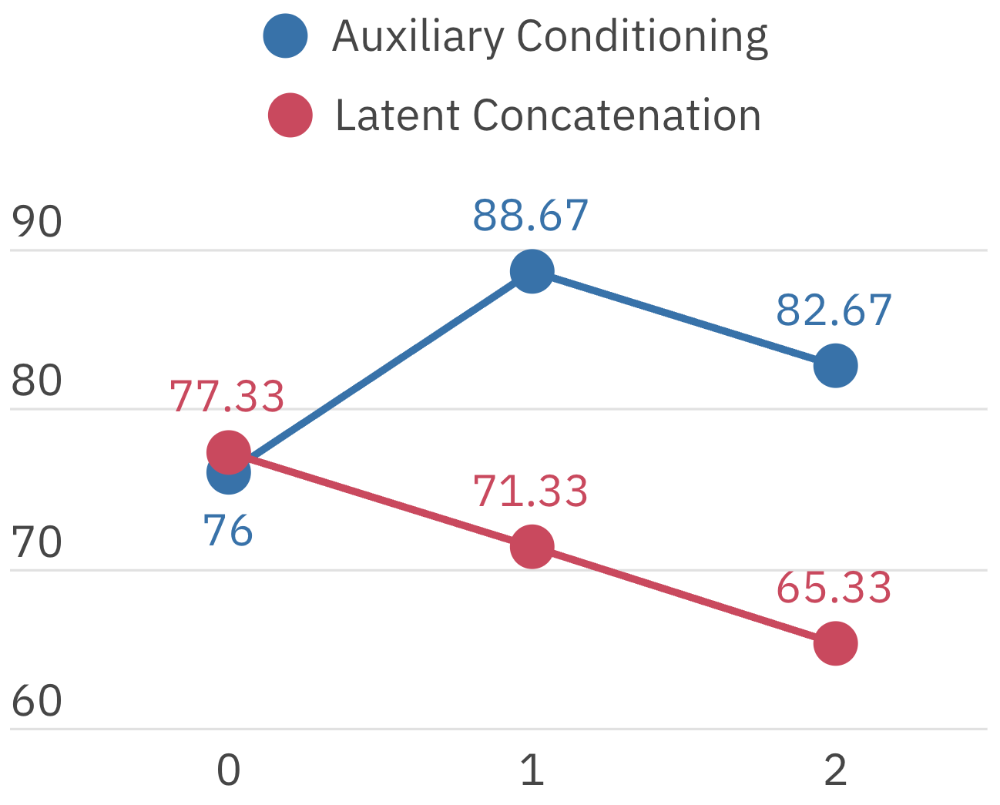
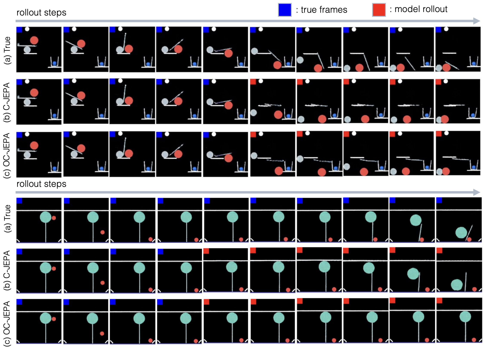
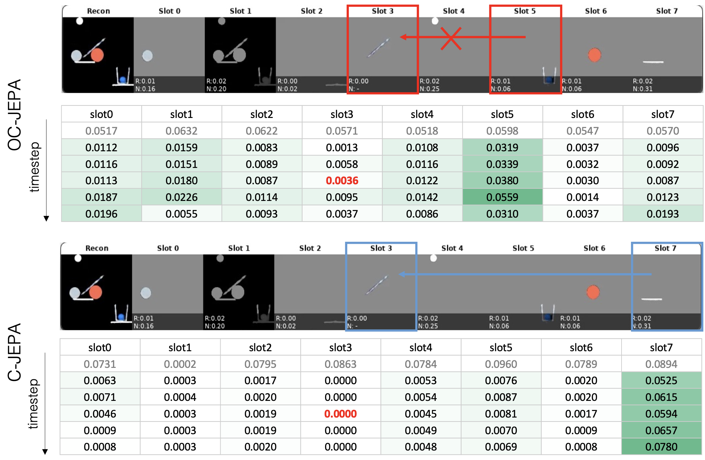

# AI Daily

## 2026-09-10 — Causal-JEPA：用物件級 latent masking 迫使世界模型學會互動

> **今日一句話**：Causal-JEPA（C-JEPA）沒有把「因果」寫成一張固定的圖，而是把某個物件的歷史 latent 有系統地遮掉，只留下身份錨點，讓模型必須從其他物件與輔助變量恢復它；這個可控的 observability intervention 使 interaction-dependent prediction 成為降低 JEPA prediction loss 的必要條件。[1]

## 一、選文結論與基本資料

本次先以 Energy-Based Transformer、JEPA、VAR、training-free、attention modulation 與 zero-shot 為主題廣泛檢索，再與 repository 的 `.existing_reports_inventory.txt`、`README.md` 和 `INDEX.md` 比對。Energy-Based Transformers、Mirai、FlexVAR 與 Attention Frequency Modulation 都已在 `KaiCobra/AI_Daily` 發布，因此排除重複。Causal-JEPA 是候選中唯一尚未收錄、且最直接連結 JEPA、object-centric representation、世界模型與因果式遮蔽的研究。[1] [2]

需要先界定研究範圍：**Causal-JEPA 不是圖像生成 SOTA，也不是 training-free image editing 方法。**它是一個以物件中心 latent 表徵學習世界動力學的模型。它對圖像生成研究的價值，主要在於提供一種可以移植到 Energy-based controller、VAR scale-wise latent 或 inference-time attention modulation 的結構性 inductive bias，而不是直接提升 FID。[1] [3]

| 項目 | 內容 |
|---|---|
| 論文標題 | *Causal-JEPA: Learning World Models through Object-Level Latent Masking* |
| 作者 | Heejeong Nam、Quentin Le Lidec、Lucas Maes、Yann LeCun、Randall Balestriero；Quentin Le Lidec 與 Lucas Maes 為 equal contribution |
| 研究單位 | Brown University、GalilAI、New York University、Mila、Université de Montréal |
| 發表狀態 | **ICML 2026 主會議 poster；PMLR 306, 2026**。arXiv v1 於 2026-02-11 提交，v2 於 2026-05-28 修訂；官方 ICML 頁面列出主會議 poster 資訊。[1] [2] |
| 研究領域 | JEPA、object-centric representation、latent world model、visual reasoning、model-predictive control |
| 核心資料集 | CLEVRER、Push-T；另以 PHYRE 做定性分析 |
| 核心結果 | CLEVRER SAVi 設定下，平均 VQA 由 OC-JEPA 的 77.28% 升至 C-JEPA 的 83.88%；counterfactual per-question 由 41.10% 升至 60.19%。Push-T 上以 6 × 128 個 object-centric features 達到 88.67% success，而 patch-based DINO-WM 使用 196 × 384 個 features 達到 91.33%。[1] |
| 程式與權重 | 官方 GitHub、預抽取 slot representations 與 Hugging Face checkpoints 已公開。[3] [4] |

### 最值得記住的數字

C-JEPA 在主論文設定下，以 **+19.09 個百分點的 counterfactual VQA 改善**與 **1.02% 的 patch-level latent budget**支持其核心直覺。不過，這些結果依賴固定 encoder、特定資料集與特定 planner protocol；2026-08 發布的獨立 reproduction audit 在自己的重現設定下沒有重現這三項 headline claim，反而報告 counterfactual、Push-T success 與 planning timing 的方向或數值相反。因此，本文應被視為一個有清楚機制與可檢驗假說的研究，而不是已經完全定案的因果世界模型。[1] [3] [9]

## 二、問題背景：物件中心不等於互動理解

世界模型的目標，是把視覺觀測轉成可預測、可推理、可規劃的狀態。若直接在像素上預測，模型容易把計算花在紋理、光照與不可預測細節；若先把畫面轉成 object-centric slots，則可以用較少的 token 表達場景中的物件與關係。然而，較小的 token 數量本身不保證模型真的學到物件互動。模型可能只依賴某個物件自己的時間序列，或利用資料中的偶然相關性來完成 future prediction。[1] [6]

SlotFormer 是一個重要先行基線。它先以 object-centric encoder 抽取 slots，再使用 autoregressive Transformer 預測未來 slots，並將模型用於長期 video prediction、VQA 與 goal-conditioned planning。它證明了 slots 可以成為世界動力學的工作空間，但其主要 dynamics objective 沒有明確要求模型在缺少某個物件自身歷史時，必須依賴其他物件的狀態。[6]

C-JEPA 的問題設定因此不是「能不能預測下一幀」，而是更精確地問：**若把目標物件的歷史資訊移除，模型是否仍能從其他實體與外部變量恢復它？**如果答案是肯定的，則模型至少學到一組在受控資訊缺失下仍然有用的 predictive dependencies。[1]

## 三、核心貢獻與創新點

| 貢獻 | 論文做法 | 研究意義 |
|---|---|---|
| 物件級 latent intervention | 對一個物件的歷史 slot trajectory 全段遮蔽，只保留最早時間點的身份錨點 | 把「部分可觀測」直接寫入 JEPA 訓練任務，而不是只依賴架構偏好 |
| Object-centric JEPA | 將 image/video patch-level prediction 移到 object-centric slot space | 以更小的 token 空間做 interaction-aware latent prediction |
| History recovery + future prediction | 同時恢復被遮蔽的歷史 slots，並預測未來 slots | history term 抑制 self-dynamics shortcut，future term 保留 forward world-model 能力 |
| Influence neighborhood | 形式化恢復一個 masked object 所需的最小 context subset | 將 attention/interactions 解釋為 predictive sufficiency，而非宣稱發現真實因果圖 |
| 高效規劃 | 在 Push-T 使用 6 × 128 個 object-centric features | 在主要 paper protocol 中以約 1% latent input features 接近 patch-based world model |

最重要的創新不只是「多加一個 mask」。C-JEPA 的 mask 單位是**整個物件的歷史軌跡**，而不是任意 patch、單一 token 或時空 tube。這使缺失資訊與物理實體對齊，較容易將學習到的 dependency 解讀成「哪些其他實體對目標物件有預測作用」。[1]

## 四、技術方法詳解

### 4.1 從畫面到 object-centric latent

給定時間 $t$ 的影像觀測 $X_t\in\mathbb{R}^{H\times W\times C}$，凍結的 object-centric encoder $g$ 將影像映射成 $N$ 個 slots：

$$
S_t=g(X_t)=\{s_t^1,\ldots,s_t^N\},\qquad s_t^i\in\mathbb{R}^{d}.
$$

$N$ 是固定 slot 數量，$d$ 是每個 slot 的維度。Slot set 對 entity 維度具有 permutation equivariance，因此 slot token 不使用一般的 entity positional embedding。這個設計也帶來一個問題：如果模型不知道被遮掉的是哪個 slot，就難以恢復正確的物件狀態。C-JEPA 因此保留一個最早時間點的 identity anchor。[1]

除了物件 slots，模型可以接受外部 observable variables，例如 action 與 proprioception：

$$
Z_t=\{S_t,U_t\},\qquad U_t=\{a_t,p_t\}.
$$

作者將這些變量視為獨立的 auxiliary entities，而不是直接把它們 concatenation 到每個 object latent。Push-T 實驗顯示，將 auxiliaries 以獨立 token 提供給 predictor，比單純 latent concatenation 更有利。[1]

### 4.2 Object-level masking 的實際構造

令歷史視窗為

$$
T=\{t-T_h+1,\ldots,t\},
$$

令未來預測區間為

$$
\mathcal{T}=\{t-T_h+1,\ldots,t+T_p\}.
$$

對每個時間點 $\tau$，將 object set 拆成 masked subset 與 visible context：

$$
S_\tau^{\mathrm m}=\{s_\tau^i\mid i\in\mathcal M_\tau\},
\qquad
S_\tau^{\mathrm c}=\{s_\tau^j\mid j\notin\mathcal M_\tau\}.
$$

對被選中的物件 $i$，從歷史視窗中移除其可觀測狀態，但保留最早時間 $t_0$ 的 identity anchor。masked token 定義為：

$$
\tilde z_\tau^i=\phi(z_{t_0}^i)+e_\tau,
$$

其中 $\phi$ 是線性投影，$z_{t_0}^i$ 提供「這是哪一個 entity」的最小身份資訊，$e_\tau$ 是結合 temporal positional encoding 的可學習 embedding。這裡的關鍵是：$\tilde z_\tau^i$ 不包含 $z_\tau^i$ 的目前值，所以 predictor 不能直接複製目標物件自己的歷史。[1]

作者把這個操作稱為 latent intervention on observability。它**不修改真實資料生成機制，也不等於對環境做 do-intervention**；它只控制 predictor 在訓練時可以看到哪些 latent variables。更準確的說法是「受控的資訊移除，產生 counterfactual-like prediction query」。[1]

### 4.3 Predictor 與 JEPA objective

C-JEPA 使用具有 bidirectional attention 的 ViT-style masked Transformer predictor $f$。輸入是已套用 masking 的完整 history–future token sequence $\bar Z_\mathcal{T}$，輸出所有 entity tokens 的 latent predictions：

$$
\hat Z_\mathcal{T}=f(\bar Z_\mathcal{T}).
$$

訓練時，只對輸入中被遮蔽的 token 計算 latent prediction loss：

$$
\mathcal L_{\mathrm{mask}}
=\mathbb E\left[
\sum_{\tau\in\mathcal T}\sum_{i=1}^{N}
\mathbf 1[\bar z_\tau^i\neq z_\tau^i]
\left\|\hat z_\tau^i-z_\tau^i\right\|_2^2
\right].
$$

這個 objective 可以拆成 history recovery 與 future prediction：

$$
\mathcal L_{\mathrm{mask}}
=\underbrace{\mathbb E\left[\left\|\hat z_\tau^i-z_\tau^i\right\|_2^2\mid i\in\mathcal M,\tau\leq t\right]}_{\mathcal L_{\mathrm{history}}}
+
\underbrace{\mathbb E\left[\left\|\hat Z_\tau-Z_\tau\right\|_2^2\mid \tau>t\right]}_{\mathcal L_{\mathrm{future}}}.
$$

$\mathcal L_{\mathrm{history}}$ 的作用不是單純增加資料增強，而是移除 target object 的 shortcut。$\mathcal L_{\mathrm{future}}$ 則把 predictor 綁回標準的 forward world-model task。推理時，歷史視窗完整可見，只遮蔽 future tokens，因此模型可以直接 rollout 未來 latent。[1]

### 4.4 為何 masked history 會強迫模型看互動？

考慮要恢復時間 $t$ 的物件 $i$。令 $Z_T^{(-i)}$ 表示歷史視窗內除去物件 $i$ 歷史、但保留身份 anchor 後的可觀測變量。作者定義 influence neighborhood $\mathcal N_t(i)$ 為一個最小充分子集：

$$
 p(z_t^i\mid Z_T^{(-i)})
 =p(z_t^i\mid \mathcal N_t(i)).
$$

在有限歷史足夠、transition mechanism 跨 trajectory 共享、slot 確實代表 coherent object state 等假設下，平方誤差的 Bayes-optimal predictor 為：

$$
\hat z_t^{i*}
=\mathbb E[z_t^i\mid Z_T^{(-i)}]
=\mathbb E[z_t^i\mid \mathcal N_t(i)].
$$

因此，若 predictor 完全忽略 $\mathcal N_t(i)$，就無法達到最低可得的期望 MSE。這是論文 Theorem 1 的核心：**在 masked-history completion 下，互動相關 context 不再只是可能有用，而是對最優預測具有必要性。**[1]

這裡的「causal」必須保守解讀。Influence neighborhood 是在 masking protocol 下對預測有用的最小集合，它可能包含 downstream variable、latent confounder 的 proxy 或僅是部分可觀測下的相關變量。它不是經由 causal discovery 識別出的 true parents，也不是證明了物理世界的因果機制。[1]

### 4.5 Push-T 的 latent MPC

Push-T 中，模型以三個歷史時間點預測下一個 latent state。規劃器在 latent space 以 Cross-Entropy Method（CEM）搜尋 action sequence，並以 model-predicted terminal state 與 goal state 的距離作為成本：

$$
 a^*_{t:t+H-1}
 =\arg\min_{a_{t:t+H-1}}
 \left\|\hat S_{t+H}-S_g\right\|_2^2.
$$

實驗設定為 planning horizon $H=5$、action block size $B=5$、每次 CEM 取樣 300 個 candidate、保留 30 個 elite、重複 30 iterations，然後以 receding-horizon MPC 執行。成功條件是在原始 state space 中，位置誤差小於 20 且方向誤差小於 $\pi/9$。[1]

這說明 C-JEPA 的「zero-shot」不能直接照字面理解。Push-T 規劃仍需要已訓練 world model、CEM test-time optimization、offline trajectories 與固定環境協議。它不是 training-free，也不是完全不需要 environment-specific data 的 zero-shot agent。[1] [7]

## 五、實驗結果與性能指標

### 5.1 CLEVRER：counterfactual reasoning 的改善

CLEVRER 是包含多物件碰撞與問答的合成影片 benchmark。作者固定使用七個 slots，並以 ALOE 在 world-model rollout 上回答 descriptive、predictive、explanatory 與 counterfactual questions。主要公平比較使用相同的 SAVi encoder。[1]

| 模型 | Reconstruction | Average per question | Counterfactual per option | Counterfactual per question |
|---|---:|---:|---:|---:|
| SlotFormer | Yes | 79.44% | 79.28% | 47.29% |
| SlotFormer | No | 44.94% | 55.62% | 11.10% |
| OCVP-Seq | Yes | 83.11% | 83.21% | 56.06% |
| OCVP-Seq | No | 80.09% | 77.46% | 43.00% |
| OC-JEPA（history unmasked） | No | 77.28% | 76.69% | 41.10% |
| **C-JEPA（object masking）** | **No** | **83.88%** | **85.16%** | **60.19%** |

與同架構的 OC-JEPA 相比，C-JEPA 的 average per question 提升 **6.60 個百分點**，counterfactual per question 提升 **19.09 個百分點**。這支持作者的消融解釋：收益不只是來自 object-centric representation，而是來自 object-level history masking。[1]

遮蔽數量也不是越多越好。在 SAVi 設定下，遮蔽 2/7 個物件時達到 83.88% average per question 與 60.19% counterfactual per question；遮蔽 4/7 後反而下降到 73.28% 與 34.06%。這符合直覺：適度資訊移除可迫使模型學互動，過度移除則會使 context 本身不足。[1]

### 5.2 Push-T：少 token 的 predictive control

| World model | Input features | Success rate |
|---|---:|---:|
| DINO-WM | $196\times384$ patch features | 91.33% |
| DINO-WM with register | $196\times384$ patch features | 88.00% |
| OC-DINO-WM | $6\times128$ object features | 60.67% |
| OC-JEPA | $6\times128$ object features | 76.00% |
| **C-JEPA** | **$6\times128$ object features** | **88.67%** |

$6\times128=768$，而 $196\times384=75{,}264$，因此 object-centric C-JEPA 使用的 feature count 約為 patch-based DINO-WM 的 **1.02%**。從 OC-DINO-WM 的 60.67% 到 OC-JEPA 的 76.00%，可以看到 JEPA-style joint latent prediction 本身已帶來改善；再加入 object-level masking 後，C-JEPA 達 88.67%，接近 DINO-WM 的 91.33%。[1]

作者也報告在同一張 L40S GPU 上，C-JEPA 評估 50 trajectories 平均約 673 秒，DINO-WM 約 5,763 秒，宣稱 planning 約快 8 倍。但這個速度數字依賴兩個 code stack 的具體 implementation；後續獨立 audit 在其 matched CEM protocol 下報告 DINO-WM 約 114 秒／trajectory、C-JEPA 約 237 秒／solve，方向與原文不同。因此，較穩健的結論是：**C-JEPA 大幅壓縮 latent token 數量是確定的設計事實；8 倍 wall-clock speedup 則需要同一 planner stack、同一 hardware 與相同 profiling 邊界下重新核驗。**[1] [9]

*圖 3。論文 Figure 3 的圖像摘錄。藍線將 action／proprioception 作為獨立 auxiliary entities，紅線則把它們 concatenation 到 latent；在一個 masked object 的設定下，獨立 auxiliary conditioning 達 88.67%，高於 concatenation 的 71.33%。[1]*

### 5.3 Masking strategy 消融

作者比較 object-level、token-level 與 tube-level masking。CLEVRER 的結果顯示，較高 masking budget 通常有助於 VQA，但 token/tube masking 對 budget 較敏感，且會產生不穩定的缺失組合，例如同時遮蔽多個物件或整個時間點的 token。[1]

Push-T 中的 matched budget 結果如下：

| Masking budget | Object | Token | Tube |
|---|---:|---:|---:|
| 1/4（25%） | **88.67%** | 84.67% | 55.33% |
| 2/4（50%） | 82.67% | 84.00% | 5.33% |

這個消融支持「mask 的結構單位很重要」，但不應誇大成 object-level 在所有 budget、所有資料集都全面勝出。論文附錄本身指出，由於 $T\times N$ 的 latent space 相對小，三種 masking 方法在部分設定下差異有限。[1]

### 5.4 定性 PHYRE 分析

PHYRE 沒有 ground-truth temporal causal graph，因此作者沒有把 attention map 當成 causal graph recovery。作者只做兩種定性分析：第一，C-JEPA 的 imagined rollouts 在多物件碰撞、重力與 momentum transfer 情境中較常維持物理上合理的後果；第二，cross-slot attention 較集中於與目標物件有關的 slot。這些證據可以支持 interaction-aware predictive dependency 的假說，但不能單獨證明模型恢復了真正因果結構。[1]

*圖 1。論文 Figure A3 的圖像摘錄。藍色區塊代表 true frames，紅色區塊代表 model rollout；圖中比較真值、C-JEPA 與 OC-JEPA 在物理互動場景中的長期預測。圖片由論文 PDF 依 `pdf-image-extractor` skill 提取。[1]*

*圖 2。論文 Figure A4 的圖像摘錄。作者以 cross-slot attention 作為 local temporal interaction structure 的定性 proxy；紅框與藍框標出不同模型對 target slot 的依賴差異。它不是 ground-truth causal graph，也不是可直接部署的 attention controller。[1]*

## 六、相關研究脈絡

| 研究 | 核心 representation／objective | 與 C-JEPA 的關係 |
|---|---|---|
| I-JEPA，ICCV 2023 | 從同一影像的 context block 預測 target block 的 representation，不重建像素 | C-JEPA 延續 JEPA 的 latent prediction，但將 mask 單位從 image patch 改成 object trajectory，並加入 future dynamics。[5] |
| SlotFormer，ICLR 2023 | 在 learned object slots 上使用 autoregressive Transformer 做長期 dynamics simulation | C-JEPA 沿用 object-centric world model 設定，但用 bidirectional masked predictor 與 history recovery 抑制 self-dynamics shortcut。[6] |
| DINO-WM，ICML 2025 | 凍結 DINOv2 patch features，以 latent transition prediction 建立 offline world model，並以 goal feature 做 test-time planning | C-JEPA 以 object slots 取代 patch tokens，在 Push-T 以約 1% feature count 接近 DINO-WM；DINO-WM 的 zero-shot planning 主張則不能直接轉移給 C-JEPA。[7] |
| V-JEPA 2，2025 | 在大規模影片上以 mask-denoising prediction 學習 representation，再以少量 robot interaction data 訓練 action-conditioned predictor | V-JEPA 2 著重大規模 video pretraining 與 robot planning；C-JEPA 著重 object-level observability intervention 與 interaction bias。兩者都預測 latent，但 mask 粒度與研究問題不同。[8] |
| C-JEPA，ICML 2026 | 以物件級 history masking + future prediction 學習 interaction-aware world model | 把「互動結構」由 architecture preference 變成 learning objective 的必要條件，並以 influence neighborhood 提供可分析的語言。[1] |

DINO-WM 對本論文尤其重要，因為它說明 frozen visual features 加上 latent transition model 可以支援新的 goals 與環境配置的 planning。DINO-WM 的 transition loss 為：

$$
\mathcal L_{\mathrm{pred}}
=\left\|p_\theta\bigl(\mathrm{enc}_\theta(o_{t-H:t}),\phi(a_{t-H:t})\bigr)
-\mathrm{enc}_\theta(o_{t+1})\right\|_2^2.
$$

C-JEPA 則多加了一個關鍵的 training-time question：如果 target object 的歷史不在 context 中，模型是否仍能預測它？因此兩者可以被視為互補：DINO-WM 強調通用 patch feature 與 test-time goal planning，C-JEPA 強調 object-centric context dependency。[7]

V-JEPA 2 的 objective 也有相似的「在 representation space 預測，而非像素重建」精神。它先以 EMA target encoder 與 mask-denoising loss 做大規模 pretraining，再以 action-conditioned predictor 支援 Franka robot planning。C-JEPA 的差異在於，它不只隨機移除 patch，而是保留 object identity anchor、移除整段 object history，並以此建構 interaction-specific observability intervention。[8]

## 七、對使用者關注方向的研究啟發

### 7.1 Energy-Based Transformer：把 masked prediction loss 變成 interaction energy

C-JEPA 本身不是 Energy-Based Transformer。它沒有學習一個明確的 scalar energy landscape，也沒有像 EBT 那樣透過對候選 prediction 做 gradient-based energy minimization。不過，C-JEPA 的 loss 可以自然改寫成一個針對候選 latent trajectory 的 interaction energy：

$$
E_{\mathrm{C\text{-}JEPA}}(\hat Z, Z;\mathcal M)
=\sum_{\tau,i}
\mathbf 1[\bar z_\tau^i\neq z_\tau^i]
\left\|\hat z_\tau^i-z_\tau^i\right\|_2^2.
$$

下一步可以讓 Transformer 直接輸出一個 compatibility energy，並用 object-level masked contexts 產生 positive／negative candidate trajectories。這會把「能否用其他物件解釋 target state」與 EBT 的「context–candidate compatibility」接在一起。較有研究價值的版本不是直接把 MSE 改名為 energy，而是測試 energy 是否能在 OOD object mass、friction、camera viewpoint 或 unseen interaction 下校準 uncertainty。

### 7.2 JEPA × VAR：從 object scale 到 visual scale 的分層預測

VAR 將影像生成拆成 coarse-to-fine 的 next-scale prediction；C-JEPA 將世界動力學拆成 object-centric latent prediction。兩者可以構成一個 scale–entity factorization：

$$
\hat z_{t}^{(\ell+1,i)}
=F_\ell\left(z_t^{(\leq\ell,1:N)},\,u_t,\,\mathcal M_\ell\right),
$$

其中 $\ell$ 是 visual scale，$i$ 是 object entity，$\mathcal M_\ell$ 是該 scale 的 masked entities。粗尺度可以保留 object identity、layout 與 interaction topology；細尺度再處理 texture、局部 geometry 與 appearance residual。這比直接在 VAR token 上做隨機 masking 更可解釋，因為被遮蔽的單位同時具有 entity semantics 與 spatial scale。

### 7.3 Training-free attention modulation：用 influence neighborhood 做結構化控制

C-JEPA 的 PHYRE attention analysis 只是定性 proxy，不是 inference-time attention modulation。但它提供一個可移植的想法：對每個 target object 或 target visual region，估計哪些 context entities 是 influence neighborhood，然後在 generation 或 planning 時對相關 cross-attention heads 施加較高權重。

一個候選的 inference-only controller 可以寫成：

$$
A'_{q,k}
=A_{q,k}+\lambda_t\,\mathbf 1[k\in\widehat{\mathcal N}(q)],
$$

其中 $A_{q,k}$ 是 attention logit，$\widehat{\mathcal N}(q)$ 是由 frozen C-JEPA predictor 或 auxiliary probe 估計的 influence neighborhood，$\lambda_t$ 隨 denoising timestep 或 VAR scale 調整。這個方向必須嚴格區分兩件事：C-JEPA 提供的是 training-time predictive structure；真正的 training-free attention modulation 還需要證明 frozen probe 不會破壞原模型的 semantic alignment。

### 7.4 Zero-shot 的四個層次

C-JEPA 的研究價值也在於它迫使我們把 zero-shot 說清楚。至少應分成四種：

| 層次 | 問題 | C-JEPA 目前證據 |
|---|---|---|
| 新 goal | 同一環境、訓練後換目標狀態 | Push-T 的 latent MPC 可支援，但不是完全不需 test-time optimization |
| 新 object／layout | 換物件形狀或排列 | 原文未提供足夠的系統性 zero-shot matrix |
| 新 dynamics | 換質量、摩擦、接觸規則或 camera | 尚未充分驗證 |
| 無相關 offline data | 沒有相近 trajectory 仍可規劃 | C-JEPA 沒有證據；DINO-WM 的 claim 也不能直接套用 |

因此，報告中的「zero-shot」應限定為 **new-goal latent planning under a trained world model**，不能寫成 training-free generalization。[1] [7]

## 八、獨立重現與批判性核驗

2026-08-02，Hugging Face 上一篇 ICML 2026 Agent Reproduction audit 公開了 Causal-JEPA 的重現結果。該 audit 的自動評分約為 8/10，並把五項主張拆開檢查。它報告 Theorem 1 在 synthetic neural audit 中得到支持，但對三項 empirical headline claims 沒有重現：counterfactual VQA 在其 protocol 下由未遮蔽約 70% 降至遮蔽約 44%；Push-T 的 $|\mathcal M|=1$ success mean 約 49.33%，低於 paper 的 88.67%；同一 L40S class 與 matched CEM knobs 下，C-JEPA 約 237 秒／solve，DINO-WM 約 114 秒／trajectory，沒有出現 paper 所稱的 8 倍 speedup。[9]

這個 audit 不能直接推翻原論文，因為它明確披露 encoder／rollout provenance、code stack 與 timing boundary 可能不同，而且它沒有重訓所有 SlotFormer、OCVP-Seq 與 DINO-WM baseline。因此較精確的判讀是：

1. **Theorem 1 的邏輯主張與 empirical benchmark claim 應分開看。** Theorem 1 是在明確假設下對 Bayes-optimal masked completion 的推論；它不保證實作模型在有限資料與特定 encoder 下一定獲得 paper table 的性能。
2. **主論文結果目前需要 protocol-level replication。** 尤其是 ALOE fine-tuning、slot checkpoint、Push-T goal definition、CEM implementation 與 profiling boundary 都應由同一套公開 pipeline 重跑。
3. **最穩健的設計結論仍然成立為研究假說。** Object-level masking 的確比 random token masking 更貼近 entity semantics；但它是否在真實世界、不同 encoder 與不同 dynamics 下穩定提升 performance，還需要更廣泛驗證。

## 九、限制

第一，方法依賴 object-centric encoder 的品質。若一個 slot 混合多個物件、身份在時間上漂移，masking 就不再等價於移除一個 coherent object variable。作者使用 VideoSAUR 或 SAVi，而不是從像素端到端共同學習 object decomposition，因此 performance ceiling 受 frozen/pretrained encoder 限制。[1]

第二，主要量化實驗集中在 synthetic CLEVRER 與 Push-T。CLEVRER 的物理互動可控，Push-T 的物件數量與場景結構也相對簡單；PHYRE 只有定性分析。真實影片中的遮擋、物件進出場、slot identity drift 與非平穩 dynamics 仍未充分測試。[1]

第三，causal terminology 必須保守。論文已明確說明 influence neighborhood 不是 true causal parents。它描述的是在 latent observability intervention 下對預測充分的 context subset，而不是從 observational data 識別固定 SCM。[1]

第四，Push-T planner 的成本很高。CEM 每次 300 candidates、30 iterations、5-step horizon，且是 learned model 的 MPC loop。這不是 free inference，也不等於單次 forward prediction 的 real-time guarantee。[1]

第五，independent audit 暗示原始 benchmark 可能存在 reproduction sensitivity。這不會消除方法的理論價值，但會降低目前 empirical claims 的可信度。後續工作應提供單一 container、固定 seeds、完整 checkpoint、相同 CEM library 與逐步 wall-clock profile。[4] [9]

## 十、我的評價與研究意義

我認為 Causal-JEPA 最有價值的地方，是把「模型似乎學到互動」轉成一個明確的訓練干預：拿走目標物件自身的歷史，觀察模型是否能利用其他 entities 完成 latent prediction。這比只看 cross-attention heatmap 更接近可檢驗的機制；因為模型如果只看 target self-dynamics，就無法在 masked-history objective 下持續降低 loss。

它的理論貢獻也應以正確尺度理解。Influence neighborhood 並不是 causal discovery 的替代品，而是一種比 true causal graph 更弱、但在高維 partial observability 場景中更可操作的 predictive set。這種「先定義可控資訊移除，再分析哪些 context 對恢復不可或缺」的路線，值得延伸到 video generation、robotics 與 multimodal planning。

對使用者目前關注的方向，我會給出以下判斷：

| 方向 | 契合度 | 我的判斷 |
|---|---:|---|
| JEPA | 很高 | 直接把 masked joint-embedding prediction 從 patch 提升到 object trajectory |
| Energy-based Transformer | 中高 | 原文不是 EBT，但 masked prediction error 可作 interaction compatibility energy 的起點 |
| VAR | 中 | 沒有 next-scale image generation；可借鑑 entity-aware multi-scale prediction |
| Training-free | 低 | 方法需要訓練 world model、encoder 與 downstream planner |
| Attention modulation | 中 | attention 只被當作分析 proxy，尚未形成 inference-time controller |
| Zero-shot | 中低 | 可做 new-goal planning，但不是無資料、無訓練或無 test-time optimization 的 zero-shot |

如果要把這篇工作發展成真正能影響圖像生成的研究，我最推薦的下一步是 **Influence-Gated JEPA-VAR**：先用 object-level latent masking 學習 entity-to-entity predictive structure，再把這個 structure 投影到 VAR 的 coarse-to-fine token scales；在推理時只對高 uncertainty 或高 interaction-disagreement 的 scale 啟用 attention modulation，並以 energy ranking 選擇候選 latent trajectory。評估時不能只看 FID，還要同時測 composition、identity preservation、layout consistency、OOD object arrangement 與 inference cost。

總結而言，Causal-JEPA 值得讀，不是因為它已經證明「masking 等於因果」，而是因為它提出一個乾淨的研究問題：**當一個可預測變量被從自身歷史中拿走，模型是否被迫學會依賴真正有用的互動 context？**這個問題可以被移植到 EBT、VAR、diffusion 與 training-free control，而獨立重現 audit 則提醒我們，任何漂亮的 benchmark gain 都必須和完整 protocol 一起驗證。

## References

[1]: https://arxiv.org/html/2602.11389v2 "Causal-JEPA: Learning World Models through Object-Level Latent Masking"
[2]: https://icml.cc/virtual/2026/poster/63623 "Causal-JEPA: Learning World Models through Object-Level Latent Masking — ICML 2026 official poster"
[3]: https://hazel-heejeong-nam.github.io/cjepa/ "Causal-JEPA official project page"
[4]: https://github.com/galilai-group/cjepa "galilai-group/cjepa official code and checkpoints"
[5]: https://arxiv.org/abs/2301.08243 "Self-Supervised Learning from Images with a Joint-Embedding Predictive Architecture"
[6]: https://slotformer.github.io/ "SlotFormer: Unsupervised Visual Dynamics Simulation with Object-Centric Models"
[7]: https://proceedings.mlr.press/v267/zhou25t.html "DINO-WM: World Models on Pre-trained Visual Features enable Zero-shot Planning"
[8]: https://arxiv.org/html/2506.09985v1 "V-JEPA 2: Self-Supervised Video Models Enable Understanding, Prediction and Planning"
[9]: https://huggingface.co/blog/Ryukijano/causal-jepa-icml2026-agent-repro "Independent Reproduction of Causal-JEPA: An Audit of Object-Level Latent Masking Claims"
