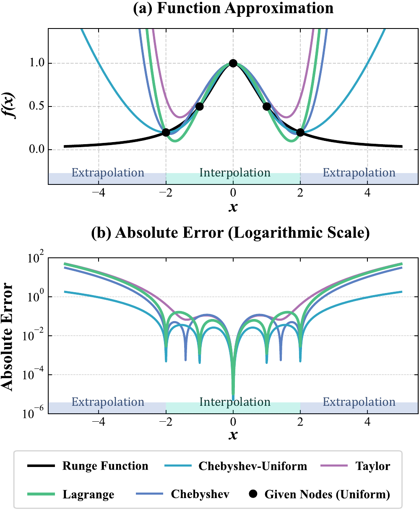
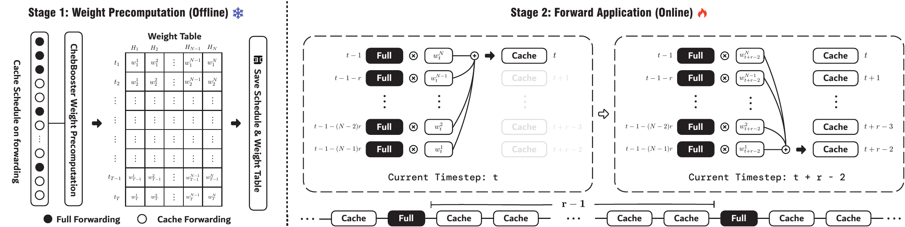
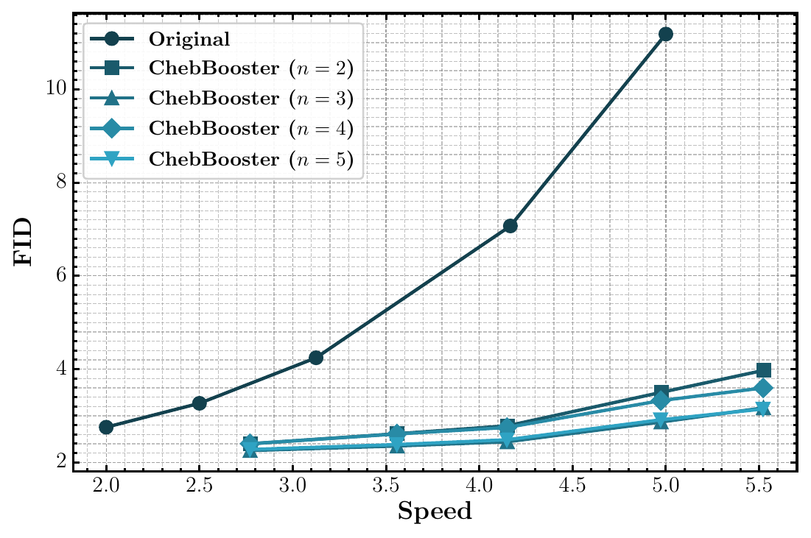

# AI Daily

> **研究日期：** 2026-09-02　　**整理：** Manus AI　　**主題：** Training-free DiT acceleration、feature forecasting、Chebyshev extrapolation、cache efficiency

## ChebBooster: Training-Free DiT Inference via Chebyshev-Inspired Extrapolation

## 一、論文基本資訊

| 欄位 | 內容 |
|---|---|
| 論文標題 | *ChebBooster: A Training-Free Approach for Efficient Diffusion Transformer Inference via Chebyshev-Inspired Extrapolation* |
| 作者 | Chengjie Lu、Tianchi Deng、Zhengqi He、Chengwen Luo、Xueliang Li |
| 研究單位 | Shenzhen University：College of Electronics and Information Engineering、School of Artificial Intelligence |
| 發表狀態 | arXiv:2608.23429v1；2026-08-24；目前頁面未標示已接收之會議或期刊 |
| 論文頁面 | [arXiv abstract][1]／[arXiv HTML][2]／[PDF][3] |
| 程式碼 | [官方 GitHub repository][4] |
| 評估模型 | DiT-XL/2、PixArt-Σ、FLUX.1-dev |
| 任務與解析度 | DiT-XL/2：class-to-image、256×256；PixArt-Σ：text-to-image、512×512；FLUX.1-dev：text-to-image、1024×1024 |
| 核心結果 | 最高約 **3.68× latency speedup** 與 **5.12× FLOPs reduction**，在多種加速設定下維持競爭力十足的生成品質 |

本篇選擇 **ChebBooster**，是因為它在不更新模型權重、不新增訓練資料的條件下，將 diffusion inference 的「快取」問題重新表述成 **沿 diffusion timestep 預測中間 feature trajectory** 的數值外推問題。[1] 這和單純重複利用上一個 timestep 的 feature 不同，也和僅減少 sampling steps 的做法不同：它試圖回答的是，當模型不值得在每一步完整 forward 時，能否用少量已計算的 feature 可靠地預測中間狀態？

> **論文摘要的核心主張：** ChebBooster 以 Chebyshev polynomial theory 為靈感，使用數值穩定的 barycentric formulation，將外推權重預計算與線上套用解耦，從而在 DiT-XL/2、PixArt-Σ 與 FLUX.1-dev 上取得最高 3.68× latency speedup 與 5.12× FLOPs reduction。[1]

本次先檢查 `KaiCobra/AI_Daily` 的 `README.md`、`INDEX.md` 與文章內容；**HRDiT 已經在 repository 中有獨立報告**，因此不重複發布。HRDiT 解決的是高解析度 DiT 的 spatial position alignment 與 head-adaptive attention pruning，而本篇聚焦於不同的時間維度：以 polynomial extrapolation 預測被跳過 timestep 的 feature。[10]

## 二、為什麼值得讀：把 Feature Cache 改寫成數值外推

Diffusion Transformer 的成本不只來自模型參數量，也來自它通常在每個 denoising timestep 執行完整的 attention、cross-attention 與 MLP。相鄰 timestep 的 hidden features 往往具有時間冗餘，所以早期方法會直接快取上一個 timestep 的中間結果；但當 refresh interval 拉長，feature 相似度下降，誤差就會累積。ChebBooster 將這個現象視為「平滑但不一定局部線性的 trajectory」：如果 feature tensor 是 timestep 的函數，那麼 cache 可以提供少量觀測點，而被跳過的 timestep 可以透過外推得到近似值。[1]

這個視角的關鍵，不是「Chebyshev nodes 永遠比均勻節點好」，而是**插值與外推是不同問題**。Chebyshev 節點在區間內 interpolation 能抑制 Runge phenomenon，但 ChebBooster 的目標是從已完成的歷史 timestep 推向尚未完整計算的 timestep。作者以 Runge function 做比較後，採用 normalized equispaced nodes，再搭配正確的 barycentric weights，以控制長距離 extrapolation 的數值行為。[2]

這也使 ChebBooster 成為很好的研究跳板：它把「模型加速」從工程性的 cache trick 提升成可分析的 **latent dynamics forecasting**。這條線可以自然接到 JEPA 的 latent prediction、Energy-based Transformer 的狀態一致性評分、VAR 的 scale-wise state prediction，以及以 head/token sensitivity 動態決定 refresh 的 attention modulation。

## 三、核心貢獻與創新點

### 3.1 從 reuse 走向 forecasting

FORA 等早期方法主要儲存並重用 attention 或 MLP 的中間輸出；ToCa 更進一步根據不同 token 對快取的敏感度，決定哪些 token 可以被重用。[5] ChebBooster 的新意在於：它不把歷史 feature 視為要原封不動複製的結果，而是把某個 feature module 的輸出寫成 timestep 的函數，利用多個歷史觀測點預測下一個未完整 forward 的 feature。

### 3.2 數值穩定的 barycentric extrapolation

TaylorSeer 已經將 Taylor series 引入 diffusion feature forecasting，但高階或長距離 Taylor 外推可能出現 Runge-like oscillation。[3] ChebBooster 改採 barycentric 形式，使「只依賴 timestep schedule 的係數」與「實際 feature values」分離；係數可在 inference 前一次計算，線上只需要對少量 cache tensor 做加權和。

### 3.3 Offline／online 解耦

ChebBooster 的 offline stage 先固定 refresh schedule，再計算每一個被跳過 timestep 的外推係數。online stage 則在完整 forward 的 timestep 將 module outputs 放入固定大小的歷史 buffer，遇到 cache timestep 時直接取出 buffer 並套用預先計算的係數。這種設計適合重複使用相同 sampling schedule 的大批次推理，也讓實作更接近可以封裝成 drop-in accelerator 的形式。[4]

## 四、技術方法與數學細節

### 4.1 Diffusion Transformer 的可快取模組

令 diffusion model 由 $L$ 個 DiT blocks 組成：

$$
G=B^1\circ B^2\circ\cdots\circ B^L.
$$

對第 $\ell$ 個 block，將 self-attention、cross-attention 與 MLP 的輸出分別記為 $S^\ell$、$C^\ell$ 與 $M^\ell$，可用簡化的 residual 形式表示為

$$
B^\ell(x)=x+S^\ell(x)+C^\ell(x)+M^\ell(x).
$$

在 timestep $t$，ChebBooster 將一個待快取的 feature module output 記為 $f_t$。它把整個 feature trajectory 視為連續函數 $h(\tau)$ 在離散 timestep 上的觀測，其中 $\tau\in[-1,1]$ 是將 diffusion timestep 正規化後的座標。已完整計算的 timestep 提供觀測點 $(\tau_j,f_j)$，被跳過的 timestep 則要預測 $f_t$。[2]

### 4.2 從 Chebyshev polynomial 到 barycentric 公式

Chebyshev polynomial of the first kind 定義為

$$
T_N(x)=\cos\left(N\arccos x\right).
$$

在標準 interpolation 問題中，Chebyshev nodes 為

$$
 x_j=\cos\left(\frac{2j-1}{2N}\pi\right),
 \qquad j=1,2,\ldots,N.
$$

對節點 $x_j$ 與已知函數值 $h(x_j)$，barycentric interpolation 可寫成

$$
P_N(x)=
\frac{\displaystyle\sum_{j=1}^{N}\frac{\rho_j}{x-x_j}h(x_j)}
{\displaystyle\sum_{j=1}^{N}\frac{\rho_j}{x-x_j}},
$$

其中 $\rho_j$ 是只由節點幾何決定的 barycentric weights。對 Chebyshev nodes，常見權重為

$$
\rho_j=(-1)^j
\begin{cases}
0.5,&j=1\ \text{或}\ j=N,\\
1,&\text{其他情況}.
\end{cases}
$$

將係數獨立寫出：

$$
 w_x^j=
 \frac{\rho_j/(x-x_j)}
 {\displaystyle\sum_{i=1}^{N}\rho_i/(x-x_i)},
 \qquad
 P_N(x)=\sum_{j=1}^{N}w_x^j h(x_j).
$$

這個分解是 ChebBooster 的核心。$w_x^j$ 只取決於節點位置與 query point $x$，**不取決於 feature tensor 的內容**，因此可以在 offline stage 預計算。值得注意的是，論文實際用於長距離 extrapolation 的是均勻節點，而不是直接照搬 interpolation 的 Chebyshev nodes。對 $N$ 個 equispaced nodes，附錄由 Lagrange basis 推出其 barycentric weights 可寫成

$$
\rho_j\propto(-1)^{j-1}\binom{N-1}{j-1}.
$$

作者的實驗觀察是：Chebyshev nodes 在區間外的 extrapolation error 可能快速放大；在 cache points 稀疏、目標點落在歷史範圍外的情境，equispaced nodes 具有更可控的外推行為。[2]

*圖 2：論文局部數值分析圖。Taylor expansion 在近距離外推便出現振盪；Chebyshev-Uniform 則在作者關注的外推區間呈現較穩定的誤差行為。[1] [2]*

### 4.3 Refresh schedule 與 offline weight precomputation

令 diffusion process 有 $T$ 個 sampling steps。完整 forward 的 timestep 集合定義為

$$
\mathcal{F}=\left\{s\ \middle|\ s\notin[s_0,T-1-s_1]
\ \text{或}\ r\mid(s-s_0)\right\},
\qquad s\in[0,T-1].
$$

其中 $s_0$ 與 $s_1$ 保留 diffusion 的初始與末端區段做完整計算，$r$ 是中間區段的 refresh ratio。這種設計反映一個實務假設：diffusion trajectory 的兩端可能比中段更敏感，而中間 timestep 可以用較疏的完整計算加上外推補足。

對每個不在 $\mathcal{F}$ 的 target timestep $t$，先把 $t$ 與歷史 cache timesteps $\{s_j\}$ 映射到 $[-1,1]$，再使用 barycentric coefficient $w_t^j$ 計算 weight table。這一步只依賴 schedule，因此同一個 schedule 可以在多次 inference 之間重用。

### 4.4 Online forward application

在完整計算 timestep $s\in\mathcal{F}$，模型照常產生 feature tensor $f_s$，並將其從 computational graph detach 後放入固定大小的歷史 buffer：

$$
H=\left\{(s_j,f_{s_j})\right\}_{j=1}^{N}.
$$

當 buffer 已經累積足夠的歷史 feature，而目前 timestep $t\notin\mathcal{F}$ 時，ChebBooster 以預先計算的係數作線性組合：

$$
 f_t=\sum_{j=1}^{N}w_t^j f_{s_j},
 \qquad (s_j,f_{s_j})\in H.
$$

這一步不需要再執行整個 attention 或 MLP module；相對於完整 network pass，單一 module 的線上組合成本約為 $O(N)$。因此，ChebBooster 的計算收益取決於兩個因素：一是 refresh ratio $r$ 帶來多少完整 forward 的減少，二是歷史 buffer 大小 $N$ 是否足夠表達當下 feature trajectory。

*圖 1：論文方法總覽的局部圖像。左側為 Weight Precomputation，右側為 Forward Application；圖片由論文 PDF 的圖像擷取與局部轉檔流程取得，未使用整個瀏覽器畫面。[1] [4]*

## 五、實驗設計與主要結果

作者在三個具代表性的 DiT family 上評估 ChebBooster：DiT-XL/2 使用 50K ImageNet samples 並報告 FID、sFID、Inception Score；PixArt-Σ 使用 HPSv2 的 400 prompts 並報告 ImageReward 與 CLIP score；FLUX.1-dev 使用 DrawBench 的 200 prompts 並報告 ImageReward 與 CLIP score。DiT-XL/2 與 PixArt-Σ 的 sampling 使用 DDIM，FLUX.1-dev 使用 Rectified Flow；實驗分別在 NVIDIA RTX 4090 與 NVIDIA A800 上執行。[2] [4]

| 模型與解析度 | 代表設定 | Latency / speed | FLOPs / speed | 品質指標 |
|---|---|---:|---:|---:|
| DiT-XL/2，256×256 | DDIM-50 baseline | 0.506 s / 1.000× | 23.735 T / 1.000× | FID 2.18、sFID 4.29、IS 251.56 |
| DiT-XL/2，256×256 | ChebBooster，$H=3,r=3$ | 0.302 s / **1.674×** | 8.564 T / 2.771× | FID 2.25、sFID 4.59、IS 246.49 |
| DiT-XL/2，256×256 | ChebBooster，$H=3,r=5$ | 0.267 s / **1.894×** | 5.720 T / 4.150× | FID 2.44、sFID 4.96、IS 238.48 |
| PixArt-Σ，512×512 | DDIM-50 baseline | 1.255 s / 1.000× | 95.362 T / 1.000× | ImageReward 1.1318、CLIP 33.0278 |
| PixArt-Σ，512×512 | ChebBooster，$H=3,r=3$ | 0.706 s / **1.778×** | 33.540 T / 2.843× | ImageReward **1.1392**、CLIP 33.0943 |
| PixArt-Σ，512×512 | ChebBooster，$H=2,r=6$ | 0.499 s / **2.513×** | 18.640 T / **5.116×** | ImageReward 1.0784、CLIP 33.1923 |
| FLUX.1-dev，1024×1024 | 50-step baseline | 26.039 s / 1.000× | 3719.500 T / 1.000× | ImageReward 0.9613、CLIP 31.63 |
| FLUX.1-dev，1024×1024 | ChebBooster，$H=2,r=5$ | 8.031 s / **3.242×** | 893.666 T / **4.162×** | ImageReward **1.0070**、CLIP **31.63** |
| FLUX.1-dev，1024×1024 | ChebBooster，$H=2,r=6$ | 7.078 s / **3.679×** | 744.938 T / **4.993×** | ImageReward 0.9962、CLIP 31.61 |

上表最值得注意的不是單一最高 speedup，而是品質–效率 frontier。以 FLUX.1-dev 為例，$H=2,r=5$ 將 latency 從 26.039 秒降至 8.031 秒，約 **3.24×** 加速，同時 ImageReward 由 0.9613 上升至 1.0070，CLIP score 維持在 31.63；更激進的 $r=6$ 可達 3.679× latency speedup 與 4.993× FLOPs speedup，但 ImageReward 略降至 0.9962。[2]

在 DiT-XL/2 上，$H=3,r=3$ 的 FID 為 2.25，接近 50-step baseline 的 2.18，且比 TaylorSeer 的 2.34 更低；$H=3,r=5$ 則以 FID 2.44 換取 1.894× latency speedup。PixArt-Σ 的 $H=3,r=3$ 也比同 refresh ratio 的 TaylorSeer 具有更高 ImageReward（1.1392 對 1.1195），而 FLUX 的 $H=2,r=5$ 則在速度與 ImageReward 上同時優於 TaylorSeer（3.242× 對 3.154×；1.0070 對 0.9899）。[2]

*圖 2：論文局部性能曲線。ChebBooster 在相近 speed 下維持較低 FID，說明 feature extrapolation 能把「少做 forward」與「避免品質崩壞」同時推進。[1] [2]*

## 六、消融實驗與研究解讀

### 6.1 Refresh ratio 與 history size 的角色

論文的 DiT-XL/2 附加實驗顯示，refresh ratio $r$ 主要控制計算預算，而 history size $H$ 比較像在固定預算下調節品質。以 $r=5$ 為例，$H=3$ 的 ChebBooster 取得 FID 2.44；在更保守的設定 $r=3$ 下，$H=3$ 的 FID 為 2.25，而 $H=5$ 的 FID 為 2.28、Inception Score 為 247.27。這表示增加歷史點不會保證單調改善，因為更大的 interpolation/extrapolation stencil 也可能把不一致的 feature dynamics 帶入預測。

論文進一步指出，原始模型從 50 steps 降至 10 steps 時，FLOPs 約減少 80%，但 FID 由 2.18 惡化到 11.19；相較之下，ChebBooster 的 $r=5,n=5$ 設定可取得 FID 2.28 與 IS 247.27，且比 20-step original baseline 的 FID 3.27 更好。這個對照支持作者的主要論點：**少做完整 denoising computation 不等於必然要犧牲同等幅度的 feature quality**。[2]

### 6.2 為什麼 barycentric 與節點選擇重要

若直接使用 Taylor expansion，長距離 forecast 容易出現振盪；若只用固定 cache reuse，則未能表達 feature 隨 timestep 演化的斜率與曲率。Barycentric formula 將係數與 feature value 解耦，線上只做張量的 weighted sum，因此避開了顯式求導與高階 derivative 的不穩定。另一方面，作者沒有把「Chebyshev」機械式等同於「使用 Chebyshev nodes」：他們根據 extrapolation domain 的誤差觀察改用 equispaced nodes，這是本篇最值得帶走的數值分析洞見。

### 6.3 可重現性與限制

官方程式碼已分別釋出 DiT、PixArt-Σ 與 FLUX 實作，但不包含模型權重；FLUX 需要 flow、autoencoder、T5 與 CLIP 權重，且其模型條款與硬體需求仍然存在。[4] 此外，論文主要在 256×256、512×512 與 1024×1024 上驗證，沒有直接取代既有高解析度 extrapolation 工作。由於方法預設 feature trajectory 在 cache interval 內足夠平滑，遇到快速語義變化、極端 guidance、長距離 extrapolation 或跨模型的 module dynamics 時，線性組合可能失真。固定 schedule 也限制了它對每張輸入的自適應能力：真正部署時，最好加入 uncertainty 或 error monitor，在預測不可靠時觸發 refresh。

## 七、相關研究背景與比較

| 研究 | 核心操作 | 與 ChebBooster 的關係 |
|---|---|---|
| FORA：Fast-Forward Caching，arXiv:2407.01425 | 快取並重用 attention 與 MLP intermediate outputs，不需 retraining | 早期 DiT module-level reuse 基線；ChebBooster 將 reuse 擴展成 feature forecasting。[6] |
| ToCa：Token-wise Feature Caching，ICLR 2025 | 根據 token 對 caching 的敏感度做 token-wise selection，並調整 layer/depth ratio | 將「該快取哪些 token」做細粒度化；ChebBooster 改問「被跳過的 module output 如何由 timestep trajectory 預測」。[5] |
| TaylorSeer：From Reusing to Forecasting，ICCV 2025 | 以高階 finite differences 與 Taylor series 預測未來 features | 最直接的前身；ChebBooster 用 barycentric extrapolation 及 offline weight table 處理長距離與數值穩定性。[3] |
| I-Max，arXiv:2410.07536 | 以 Projected Flow 與 inference toolkit 做高解析度 rectified-flow extrapolation | 主要改 sampling flow 與 resolution extrapolation；ChebBooster 改 timestep feature computation。[7] |
| HiFlow，arXiv:2504.06232 | 建立 high-resolution virtual reference flow，做 initialization、direction、acceleration alignment | 主要改高解析度 flow guidance；ChebBooster 主要改 DiT 中間 feature 的重建。[8] |
| FreeScale，ICCV 2025 | 從不同 receptive scales 擷取頻率元件並融合，以抑制高解析度 repetitive patterns | 主要處理 scale/frequency fusion；ChebBooster 主要處理 temporal feature redundancy。[9] |

這條研究脈絡可整理成三個正交軸。第一個軸是 **where to cache**：ToCa 在 token 層級選擇敏感度；第二個軸是 **what to predict**：TaylorSeer 與 ChebBooster 在 module feature trajectory 上做預測；第三個軸是 **how to preserve structure**：I-Max、HiFlow、FreeScale 與 repository 已有的 HRDiT 分別從 flow、scale/frequency、position embedding 或 attention window 角度處理高解析度失真。[7] [8] [9] [10]

## 八、個人評價與可延伸想法

### 8.1 個人評價

我認為 ChebBooster 最有價值的地方不是「最高 3.68×」這個 headline，而是它用一個非常清楚的 abstraction 連接了數值分析與生成模型：**diffusion feature 是隨 timestep 演化的狀態函數，cache 是稀疏觀測，而 acceleration 是受限的外推問題**。這個 abstraction 讓方法具有可解釋的旋鈕（refresh ratio、history size、node placement），也讓失敗模式可以被分析，而不是把加速完全交給經驗性的 cache threshold。

但它仍是 arXiv preprint，論文頁面沒有標示頂會接收狀態；而且其主要實驗集中在三個 image DiT 與標準解析度。官方 implementation 雖然已釋出，但重現 ImageReward、CLIP、FID 或完整速度數字仍需要正確模型權重、CUDA 環境與評估資料。這些因素都表示，3.68× 與 5.12× 應被理解為作者實驗設定下的結果，而不是對所有 DiT 或所有 prompt 的保證。[1] [4]

### 8.2 與 Energy-based Transformer 的連接

可以把外推預測的不確定性寫成一個 energy，而不是只看 feature 的 $\ell_2$ 誤差。例如，對當前預測 $\hat f_t$ 與少量 probe forward 得到的 exact feature $f_t$，定義

$$
E_t=\|f_t-\hat f_t\|_2^2
+\lambda\,\|\Phi(f_t)-\Phi(\hat f_t)\|_2^2,
$$

其中 $\Phi$ 可以是跨 layer 的低維 projection、attention response 或語義 encoder。當 $E_t$ 高於 threshold，就在下一個 interval 提前 refresh；當 $E_t$ 低，則允許更長的 extrapolation。這會把 ChebBooster 的固定 schedule 變成 **energy-gated adaptive cache**，也能把「數值外推看似穩定但生成結果失真」轉換成可監控的狀態能量。

### 8.3 與 JEPA、VAR 與 attention modulation 的連接

ChebBooster 的 feature forecasting 和 JEPA 的共同點，是在 latent space 預測 target representation，而不必直接預測像素。下一步可以將 ChebBooster 的 polynomial prior 當成 JEPA predictor 的 deterministic initialization，再由一個輕量 residual predictor 學習 polynomial 未能解釋的 component；同時加入 covariance 或 variance regularization，讓長距離預測不會 collapse 到過度平滑的 latent。

對 VAR 而言，不能直接假設每個 scale 的 hidden state 像 diffusion timestep 一樣平滑，因為 VAR 有離散 token、causal state 與 coarse-to-fine transition。不過可以在同一個 scale 內，把未執行的 decoder block 或候選 token logits 視為 trajectory，使用 ChebBooster 做 block-level forecasting，再用 low-cost token confidence 觸發 refresh。這會形成 **scale-aware polynomial cache**，與既有的 VISTA、SparVAR 或其他 VAR training-free 方法形成互補，而不是重複使用同一個 attention trick。[10]

最後，ChebBooster 目前是 module-level 的 feature forecasting；若與 attention modulation 結合，可以讓不同 head 擁有不同的 history size、refresh ratio 或 forecast order。對高敏感 head 使用較短 interval，對低敏感 head 使用更長 interval，便能將 ToCa 的 token sensitivity、HRDiT 的 head-wise scope 與 ChebBooster 的 timestep extrapolation 放在同一個 adaptive controller 中。這是我認為最值得實作的方向：**先用 cheap predictor 預測，再用 energy／attention sensitivity 決定哪些 head 真正需要完整 forward**。

## 九、結論

ChebBooster 展示了一條簡潔而有啟發性的 training-free DiT 加速路徑：先用完整 forward 取得稀疏 feature observations，再用 barycentric extrapolation 填補被跳過的 timestep。它在 DiT-XL/2、PixArt-Σ 與 FLUX.1-dev 上呈現一致的 quality–efficiency trade-off，最高約 3.68× latency speedup 與 5.12× FLOPs reduction。[1] 真正值得帶走的不是一組固定超參數，而是「生成模型的中間狀態可以被當成可預測動態系統」這個研究觀點。對 Energy-based Transformer、JEPA latent prediction、VAR scale-wise inference 與 training-free attention modulation 而言，ChebBooster 提供了一個很適合繼續拆解、加上 uncertainty 與 adaptive routing 的基礎。

## References

[1]: https://arxiv.org/abs/2608.23429 "ChebBooster: A Training-Free Approach for Efficient Diffusion Transformer Inference via Chebyshev-Inspired Extrapolation"
[2]: https://arxiv.org/html/2608.23429v1 "ChebBooster HTML full text"
[3]: https://arxiv.org/pdf/2608.23429 "ChebBooster PDF"
[4]: https://github.com/Kiramei/ChebBooster "Official ChebBooster implementation"
[5]: https://arxiv.org/abs/2410.05317 "Accelerating Diffusion Transformers with Token-wise Feature Caching"
[6]: https://arxiv.org/abs/2407.01425 "FORA: Fast-Forward Caching in Diffusion Transformer Acceleration"
[7]: https://arxiv.org/abs/2410.07536 "I-Max: Maximize the Resolution Potential of Pre-trained Rectified Flow Transformers with Projected Flow"
[8]: https://arxiv.org/abs/2504.06232 "HiFlow: Training-free High-Resolution Image Generation with Flow-Aligned Guidance"
[9]: https://arxiv.org/abs/2412.09626 "FreeScale: Unleashing the Resolution of Diffusion Models via Tuning-Free Scale Fusion"
[10]: https://arxiv.org/abs/2608.07003 "HRDiT: Training-Free High-Resolution Image Generation with Off-the-Shelf Diffusion Transformer Models"
