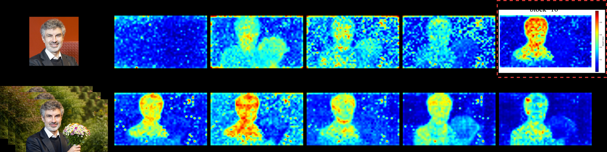
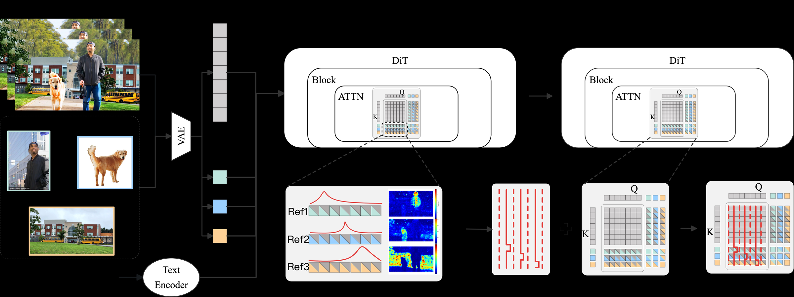

# AI Daily｜DIAL：讓 DiT 內生注意力成為可控的多主體影片生成介面

> **研究日期：2026-09-13**　|　**論文日期：2026-09-10**　|　**主題：Diffusion Transformer、attention modulation、training-free inference、subject-to-video**

## 一、先說結論

**DIAL 的核心洞見是：Diffusion Transformer（DiT）並不是每一層都同樣有用；某些 attention block 會自然形成可定位參考主體的「內生空間 grounding map」（Intrinsic Spatial Grounding Map, ISGM）。** 作者把這個內部訊號變成兩階段控制介面：在低噪聲去噪階段，以 ISGM 對注意力 logit 施加局部、可調的主體級 bias；在高噪聲階段，則以 ISGM 與主體 mask 的對齊度自動產生偏好對，再用多步 DPO 與 LoRA 錨定參考主體。這使得「主體保真度」可以在推理時按參考主體獨立調節，而不是被訓練資料的固定偏差鎖死。[1]

這篇論文非常適合用來激發 **attention modulation、training-free inference 與 zero-cost preference construction** 的想法，但需要先做一個重要範圍修正：DIAL 的任務是 **多主體 Subject-to-Video（S2V）生成**，不是純文字到影像生成。更重要的是，只有 Phase I 是真正的推理期、無模型更新控制；完整 DIAL 包含使用約 14K 資料、SAM3 偽 mask、48 張 H100 與 LoRA-DPO 的 Phase II，因此不能稱為 wholly training-free。[1] [2]

在 Kaleido backbone 上，Kaleido 的 FaceSim 由 **31.81** 提升到 **60.64**（以 `γ=16` 的 Phase I guidance 計），NexusScore 由 **38.62** 提升到 **43.02**；但 NaturalScore 由 **79.77** 降至 **75.23**。這個結果同時展示了方法的價值與代價：局部注意力調製能大幅提高身份保留，但保真度與自然度仍存在可見 trade-off。[1]

## 二、論文基本資料與選稿理由

| 欄位 | 資訊 |
|---|---|
| 論文標題 | *Harnessing Intrinsic Subject-Aware Attention for Controllable Multi-Subject Video Generation* |
| 作者 | Niange Yu、Ye Tian、Biaolong Chen、Miao Lu、Aixi Zhang、Hao Jiang、Yunhai Tong、Pipei Huang |
| 研究單位 | Alibaba Group、Peking University（依論文 HTML 的作者 affiliation 標記） |
| 發表狀態 | arXiv:2609.11507v1，2026-09-10，cs.CV；尚未核實正式會議或期刊接收資訊 |
| 任務 | 多主體 Subject-to-Video（S2V）生成 |
| Backbone | Kaleido-14B、Phantom-14B，均建立於 Wan2.1-T2V-14B 系列 DiT 基礎上 |
| 核心方法 | Dual-phase Intrinsic Attention Leveraging（DIAL） |
| Repo 重複檢查 | `2609.11507` 不在 `KaiCobra/AI_Daily` 既有 arXiv ID 清單中；本次新增文章也沒有重用既有報告的論文 ID |
| 本期選稿理由 | 在近期候選中最直接命中 attention modulation 與推理期控制；同時有明確公式、消融研究與可量化的 fidelity–naturalness trade-off |

本次選稿也考慮了同日的其他候選。AcFlow 更接近文字到影像的 learned activation-flow controller，但其控制器仍需要離線訓練，因此不是嚴格 training-free；SenseNova-U1.5 的研究價值很高，卻主要聚焦 native unified multimodal AR + flow-matching model，沒有直接驗證 attention modulation、JEPA 或 VAR。因此，本期選擇 DIAL 是因為它最能對應「如何利用生成模型內部訊號，在不修改 backbone 的推理階段做可解釋控制」這個研究問題。[7]

## 三、問題背景：S2V 為什麼需要新的控制介面？

Subject-to-Video 介於文字到影片與影像到影片之間。輸入不是單一起始影格，而是多張代表不同主體的參考圖像，加上描述動作與場景的文字提示。模型需要保留人物、動物、物件或背景的身份特徵，同時允許它們在新場景中改變姿勢、視角與互動方式。

既有方法通常透過資料配對、參考特徵注入或新的位置編碼處理這個問題。Phantom 以 text–image–video triplet 和 cross-paired data 避免單純 copy-paste 參考圖，並將參考圖特徵注入 DiT 的視覺與文字分支。[3] Kaleido 則以多參考圖輸入與 Reference Rotary Positional Encoding（R-RoPE）區分參考圖 token 與影片 token，在 S2V Consistency 和 S2V Decoupling 上取得強結果。[4]

但上述方法主要把「保真度」寫入訓練資料或模型結構。推理時，使用者通常不能對每個參考主體單獨說明要保留多少身份特徵。DIAL 的假設是：**控制失效的根源不是缺少更多參考圖，而是去噪過程中影片 token 與參考 token 的注意力互動沒有被正確對齊。** 因此作者先逐層檢查 DiT 的 attention，再把最可靠的內部 map 反過來作為控制訊號。

## 四、核心貢獻與創新點

第一，DIAL 識別出 DiT 中具有「attention peaking」現象的 privileged block。某個 block 對參考主體的 attention mass 會比其他 block 更集中，並在影片 latent 空間中形成可解讀的主體定位訊號。作者將此訊號命名為 ISGM，而不是再訓練一個額外的 subject encoder。[1]

第二，Phase I 將 ISGM 變成推理期、區域自適應的 attention modulation。每個參考主體都有獨立的 guidance scale `γ_k`，因此使用者可以只提高某一個主體的 fidelity，而不必把整個畫面的注意力一律放大。

第三，Phase II 將高噪聲階段的「注意力是否先對準正確主體」改寫成 preference learning 問題。兩個隨機 seed 產生兩條去噪 trajectory，ISGM 與真實 mask 對得較好的 trajectory 就是 winner；這種偏好對不需要人工排序或外部 reward model，因此作者稱為 zero-cost preference construction。[1]

第四，論文把不同噪聲階段分工。早期高噪聲階段的 ISGM 太分散，不適合直接加 bias；後期低噪聲階段的 ISGM 已經足夠清楚，才適合做局部注意力控制。這個「先學習錨定、後推理調製」的時序拆分，是比在所有去噪步驟套用同一個 guidance 更有研究啟發性的地方。

## 五、方法詳解

### 5.1 DiT token layout 與 ISGM

影片經過時空 VAE encoder 後得到 latent `z_0`，模型以 rectified-flow / flow-matching 形式在資料 latent 與高斯噪聲之間進行去噪。於第 `i` 個去噪步驟，DiT 接收由 `K` 組參考圖 token 與影片 token 組成的序列：

$$
H_i = [H_{i,1}^{\mathrm{ref}};\ldots;H_{i,K}^{\mathrm{ref}};H_i^{\mathrm{vid}}].
$$

令第 `k` 組參考 token 數量為 `N_k`，影片 token 數量為 `N_b`。對任一 self-attention module，取 video queries 與所有 keys 的 attention：

$$
\mathbf{A}
= \frac{1}{h}\sum_{m=1}^{h}
\operatorname{softmax}\left(
\frac{\mathbf{Q}^{(m)}_{\mathrm{vid}}(\mathbf{K}^{(m)})^\top}{\sqrt d}
\right)
\in \mathbb{R}^{N_b\times N},
$$

其中 `h` 是 attention heads，`N=\sum_k N_k+N_b`。第 `k` 個主體的 attention score 是該參考 token 區間的 attention mass：

$$
\mathbf{s}_k = \sum_{j\in\mathcal{I}_k}\mathbf{A}_{:,j}
\in \mathbb{R}^{N_b},
$$

再將所有主體的 score 串成 `S=[s_1,\ldots,s_K]`。這個 `S` 將每個影片 query token 對應到每個參考主體，正是 ISGM 的原始形式。[1]

為了找出 privileged block，作者用預測主體區域內外的 attention mass 比值衡量 grounding strength。對主體 `k`：

$$
 r_k =
 \frac{
 \frac{1}{|\mathcal I_+^k|}\sum_{q\in\mathcal I_+^k}s_k(q)
 }{
 \frac{1}{|\mathcal I_-^k|}\sum_{q\in\mathcal I_-^k}s_k(q)
 },
 \qquad
 R=\frac{1}{K}\sum_{k=1}^{K}r_k.
$$

其中 `\mathcal I_+^k` 和 `\mathcal I_-^k` 分別是主體前景與背景的 video query token 集合。作者在 Kaleido 與 Phantom-14B 中都觀察到 attention score 隨 block index 出現 peak；DIAL 使用該 peak block 的 attention 作為 ISGM。

*圖 1：從 PDF 擷取的 DIAL Figure 2。上排展示不同 attention block 的 subject grounding，紅框中的 privileged block 產生最清晰的主體熱圖；下排展示多個影片狀態下的主體定位。圖片由原始 PDF 提取後縮放，未使用整頁截圖。*

### 5.2 Phase I：低噪聲推理期 fidelity control

作者觀察到，去噪最初約 20% 的高噪聲步驟中，ISGM 仍然分散；後續約 80% 的低噪聲步驟才逐漸具有空間結構。因此，在第 `i-1` 步得到 `S_{i-1}` 後，先做逐主體最大值正規化：

$$
\widetilde{\mathbf S}_{i-1}(:,k)=
\frac{\mathbf S_{i-1}(:,k)}{\max(\mathbf S_{i-1}(:,k))}.
$$

接著對第 `i` 步的 attention logits 加入 bias matrix：

$$
\mathbf M_i(q,j)=
\begin{cases}
\log(\gamma_k)\,\widetilde{\mathbf S}_{i-1}(q,k),
& q\in\mathcal I_{\mathrm{vid}},\;j\in\mathcal I_k,\\
0,&\text{otherwise}.
\end{cases}
$$

這個公式有三個關鍵設計。第一，bias 只作用於 **video query → 第 `k` 個 reference key** 的互動。第二，`\widetilde{S}` 將 bias 限制在主體對應的 spatial region，而不是全域增強。第三，`\gamma_k` 以 log scale 進入 logits，能連續控制每個主體的 fidelity。最終 attention 為：

$$
\operatorname{Attn}_i(\mathbf Q_i,\mathbf K_i,\mathbf V_i)
=
\operatorname{softmax}\left(
\frac{\mathbf Q_i\mathbf K_i^\top}{\sqrt d}+\mathbf M_i
\right)\mathbf V_i.
$$

在論文實作中，`γ=0` 是「關閉 Phase I」的實驗基線；由於公式中的 `\log(\gamma)` 在數學上不適用於零，因此這個設定應理解為直接令 `M_i=0`，而不是把零代入 log。該方法不更新 DiT 權重，也不需要為每一個使用者主體重新 fitting；額外工作主要是重用前一步的 ISGM 並注入輕量 bias。

*圖 2：從 PDF 擷取的 DIAL Phase I 方法圖。左側是多主體參考圖、影片與文字條件；中間從 DiT block 讀取每個主體的注意力 map；右側將局部 bias 寫回後續 attention。圖片由原始 PDF 提取後縮放，未使用整頁截圖。*

### 5.3 Phase II：高噪聲階段的 zero-cost preference anchoring

高噪聲階段不適合直接把模糊的 ISGM 當作確定性空間 mask，但仍可用它判斷兩條 trajectory 哪一條更有可能正確使用參考主體。對一個 training sample `(V,T,R)`，作者先用 SAM3 取得各主體的偽 segmentation mask `M_k`，再以兩個 random seeds 產生兩條 attention trajectory。偏好分數為：

$$
P=\sum_{k=1}^{K}
\frac{\sum(\mathbf M_k\odot\operatorname{ISGM}_k)}
{\sum\operatorname{ISGM}_k}.
$$

`P` 越高，代表 ISGM 越集中在正確主體區域；分數較高的 trajectory 是 winner `v^w`，另一條是 loser `v^l`。這裡的「zero-cost」是指不需要人工偏好標註或外部 reward model，不是指不需要訓練資料或 GPU。

作者接著採用 multi-step DPO。令 `\mathcal L` 是 noise prediction 的均方誤差，模型與 reference model 分別在 winner/loser trajectory 上計算 loss，DPO 目標寫成：

$$
\mathcal L_{\mathrm{DPO}}
=-\mathbb E\left[
\log\sigma\left(
\frac{(\mathcal L_{\mathrm{ref}}^w-\mathcal L_{\mathrm{ref}}^l)
-(\mathcal L_{\mathrm{train}}^w-\mathcal L_{\mathrm{train}}^l)}{\tau}
\right)
\right].
$$

其中 `\tau` 是由 loss difference 的 running mean 得到的動態尺度，用來穩定數值。Phase II 使用約 14K Phantom-Data、多步 DPO、LoRA rank 16、學習率 `10^{-4}`、800 steps，並使用 48 張 NVIDIA H100。[1]

## 六、實驗設定與結果

### 6.1 Benchmark 與設定

DIAL 在 OpenS2V-Eval 上評估。該 benchmark 有 180 個 prompts，涵蓋 face、body、entity 單主體，以及多主體與 human–entity interaction。指標包括 Aesthetics、MotionSmoothness、MotionAmplitude、FaceSim，以及 benchmark-specific 的 GmeScore、NexusScore、NaturalScore；所有表格數字均以百分比呈現，越高越好。[1] [5]

作者把 DIAL 套用到 Kaleido-14B 與 Phantom-14B，基礎模型都來自 Wan2.1-T2V-14B 系列。Phase I 報告 `γ∈{0,2,4,8,16}`，並使用 50 個 denoising steps。需要注意的是，`γ=0` 只用來隔離 Phase II 的效果；它不是把 Phase I 以零強度正常運算。

### 6.2 Kaleido backbone：保真度可連續調節

| 方法 | Total | Aes. | Smth. | Amp. | Face | Gme. | Nex. | Nat. |
|---|---:|---:|---:|---:|---:|---:|---:|---:|
| Kaleido | 56.00 | 51.75 | 97.98 | 8.50 | 31.81 | 70.37 | 38.62 | 79.77 |
| DIAL, `γ=0` | 56.32 | 50.40 | 97.07 | 10.05 | 31.79 | 70.54 | 41.22 | 79.86 |
| DIAL, `γ=2` | 58.38 | 50.42 | 97.09 | 9.84 | 43.80 | 70.23 | 42.18 | 77.78 |
| DIAL, `γ=4` | 59.88 | 50.45 | 97.02 | 9.94 | 52.37 | 69.92 | 42.40 | 76.85 |
| DIAL, `γ=8` | 60.78 | 50.23 | 96.99 | 9.96 | 57.46 | 69.65 | 42.40 | 76.62 |
| DIAL, `γ=16` | **61.14** | 50.11 | 96.70 | 9.71 | **60.64** | 69.50 | **43.02** | 75.23 |

`γ` 上升時，FaceSim 大致單調上升，從 31.81 增至 60.64；Total Score 也從 56.00 增至 61.14。另一方面，NaturalScore 從 79.77 降至 75.23，GmeScore 也略降。這說明局部 bias 的確改變了模型的條件依賴，但「更像參考主體」不等於「整體影片更自然」。

在 Phantom-14B 上，baseline 的 FaceSim 是 56.50，DIAL `γ=16` 為 58.92；NexusScore 則由 41.10 提升至 43.10。Phantom 的增幅比 Kaleido 小，可能反映不同 backbone 的原始 attention 結構與可控制空間不同；論文沒有提供足夠的統計檢定，不能把差異解讀成普遍的 backbone scaling law。[1]

### 6.3 Phase II 與 subject presence

關閉 Phase I（`γ=0`）後，Kaleido 的 NexusScore 由 38.62 提升至 41.22，Phantom-14B 則由 41.10 提升至 42.76。這是 Phase II 的主要證據：偏好學習不是直接把後期畫面變得更像參考，而是先改善高噪聲階段的主體 grounding。

在 320 個「case–subject」實例的影片級 detector 測試中，Kaleido 原本只在 155 個實例中至少偵測到查詢主體，match ratio 為 `155/320=0.48`；加入 Phase II 後為 `163/320=0.51`。增幅不大，但它直接對應作者所要處理的 subject disappearance 問題。[1]

### 6.4 局部 ISGM 對比全域 guidance

作者以 uniform all-ones matrix 建立 `Uni` baseline。Kaleido 上，`Uni(γ=2)` 的 FaceSim 為 59.21、NaturalScore 為 69.03；ISGM(`γ=16`) 的 FaceSim 為 60.64、NaturalScore 為 75.23。也就是說，ISGM 只需要在更準確的 subject region 放大 attention，就能接近全域 guidance 的身份保真度，同時保留更好的自然度。[1]

這個對照是 DIAL 最有說服力的 ablation。它把「attention modulation 有效」與「任意放大 attention 都有效」區分開來：真正重要的是 **where to modulate**，而不只是 **how much to modulate**。

### 6.5 DPO horizon 消融

在 Kaleido、`γ=0` 的條件下，DPO iteration `T_{dpo}=2` 的 Total Score 為 56.32、NexusScore 為 41.22、NaturalScore 為 79.86；`T_{dpo}=3` 雖然 MotionAmplitude 上升到 13.61，但 Total Score 降至 55.64、NaturalScore 降至 78.55。作者因此將 `T_{dpo}=2` 作為預設值。這顯示高噪聲偏好訊號不是越長越好，過度強調早期 preference 可能破壞整體 realism。[1]

## 七、相關研究脈絡

### 7.1 Phantom 與 Kaleido：DIAL 是控制層，而不是新的 S2V backbone

Phantom 主要解決資料配對與 reference injection，透過 in-paired/cross-paired data 對抗影像到影片的 copy-paste 偏差。[3] Kaleido 則改造 reference token 的位置編碼，使參考影像 token 與影片 token 在時空 embedding 中可分離，並以多主體資料建構改善 consistency 和 decoupling。[4] DIAL 不重新定義這些輸入條件，而是讀取既有 DiT 的內部 attention，為 backbone 增加一個推理期控制層與一個高噪聲 alignment adapter。

這種分工值得注意：資料與架構方法負責「讓模型具備使用參考主體的能力」，DIAL 則負責「在去噪時把既有能力叫出來，並決定叫得多強」。因此 DIAL 的貢獻較像 control interface，而不是取代 Phantom 或 Kaleido 的全新生成器。

### 7.2 PAG 與 attention-based guidance

Perturbed-Attention Guidance（PAG）展示了不需額外訓練或外部模組，也能透過替換特定 self-attention map 產生結構退化樣本，再把去噪結果引導離開退化方向。[6] DIAL 與 PAG 的共同點是都把 attention 當作可介入的 sampling interface；差異在於 PAG 主要製造結構性對照，而 DIAL 從 DiT 內部辨識 subject-aware privileged block，並把每個 reference subject 的局部 map 轉成可調 logit bias。

### 7.3 與 AcFlow、DiT 控制方向的差異

AcFlow 使用 conditional activation flow 搬運凍結 DiT 的中間 image-token activation，支援 style modulation 與 concept suppression；但 controller 本身需要離線訓練，因此較準確的分類是 frozen-generator、learned-controller，而非完全 training-free。[7] DIAL Phase I 則不需新增控制器訓練，直接重用每一步的 ISGM；這是兩者在 training budget 上的根本差異。DIAL 仍然不是全流程免訓練，因為 Phase II 使用 LoRA-DPO。

## 八、對使用者偏好方向的對照

| 方向 | 本文是否直接命中 | 精確判斷 |
|---|---|---|
| Energy-based Transformer | 否 | 論文沒有 energy objective、EBT architecture 或 energy-based ablation。ISGM 可被視為一種內部 compatibility signal，但這只是後續研究假設。 |
| JEPA | 否 | 沒有 joint-embedding predictive target 或 world-model experiment。可把未來 latent prediction 與 ISGM alignment 結合，但本文沒有驗證。 |
| VAR | 否 | 沒有 next-scale autoregressive tokenizer 或 VAR benchmark；方法中的 token-level spatial control 可能轉移到 VAR，但仍是 conjecture。 |
| Training-free | 部分 | Phase I 是 inference-time、無 backbone update；Phase II 需要 14K data、SAM3、LoRA-DPO 與 48 H100，完整 DIAL 不是 training-free。 |
| Attention modulation | 是 | 這是本文最直接的貢獻：以 ISGM 建立 subject-specific spatial logit bias。 |
| Zero-shot | 部分 | 不需為每個新主體重新 fitting，且使用既有 S2V backbone；但並非無訓練、無資料或跨任務 zero-shot。 |
| Flow matching | 背景層級 | DIAL 建立在 DiT 的 rectified-flow / video diffusion 去噪流程上，但沒有提出新的 flow-matching objective。 |

## 九、個人評價與研究啟發

### 9.1 個人評價

我認為 DIAL 最值得記住的不是「FaceSim 提高了多少」，而是它把生成模型內部的 attention 從被動診斷圖變成 **可操作的控制介面**。這個思路比單純增加 condition encoder 更有可遷移性：如果模型內部已經存在某個與目標對齊的信號，先找出它，再用小幅、空間受限的 logit modification 介入，可能比重新訓練一個大型控制分支更有效率。

論文也提供了一個重要的負面結果。當 `γ` 提高時，identity fidelity 上升，但 naturalness 下降；當所有位置都用 uniform bias 時，背景模糊與紋理損失更早出現。這說明 attention control 的關鍵不是「越強越好」，而是需要一個可靠的 spatial support 和一個能隨 denoising state 變化的 schedule。

然而，證據仍有三個限制。第一，完整框架依賴單一 S2V benchmark 與開源 backbone，沒有證明 ISGM 在不同 DiT 架構、影像生成或 VAR 中都會出現。第二，Phase II 的 preference construction 仍依賴 SAM3 偽 mask與大規模 GPU 訓練；zero-cost 只是相對於人工偏好標註的成本。第三，FaceSim、NexusScore 和 NaturalScore 的提升不是所有指標都同步提升，且論文沒有提供足夠的信賴區間或跨 seed 顯著性分析。因此，本文適合被視為一個有說服力的 control-interface 原型，而不是已經完成的通用 attention theory。

### 9.2 可延伸的研究問題

**第一，Energy-based Transformer。** 可以把 reference–video compatibility 寫成一個可比較的能量：

$$
E(H,R)= -\sum_{k=1}^{K}\sum_{q\in\mathcal I_{\mathrm{vid}}}
\widetilde S(q,k)\,\log a(q,\mathcal I_k),
$$

其中 `a(q,\mathcal I_k)` 是 video query 對第 `k` 個 reference token 區間的注意力質量。推理時不一定要直接最小化全域 energy，而可以只在候選 attention intervention 中選擇能量下降、同時不破壞背景 energy 的控制。這會把 DIAL 的 heuristic bias 轉成可診斷的 energy-guided controller；但這是本文之後的研究構想，不是 DIAL 的實驗結果。

**第二，JEPA。** 在一個視覺 world model 中，可以讓 predictor 預測未來 latent `\hat z_{t+1}`，再要求其 subject-grounding map 與實際未來 latent 的可見主體區域一致：

$$
\mathcal L_{\mathrm{ground}}=
1-\operatorname{IoU}\left(
\operatorname{Norm}(S(\hat z_{t+1})),
\operatorname{TargetMask}_{t+1}
\right).
$$

這可能把 DIAL 的「內生注意力」變成 JEPA 的 auxiliary predictive target，幫助 world model 在長時域保持 entity identity；但需要新的資料與 mask protocol 來驗證。

**第三，VAR。** 對 next-scale visual autoregressive model，可以在每個 scale 取得 token-to-reference 或 token-to-context map，並只在即將生成的 subject token 區域施加 scale-specific bias。由於 VAR 的 coarse scale 決定全局構圖、fine scale 負責局部細節，合理的後續問題是：ISGM 是否只在某些 scale 出現 peaking，而不是只在某個 Transformer block 出現？這可直接將 DIAL 的「privileged block」概念推進成「privileged scale」。

**第四，training-free 與 training-light 的嚴格拆分。** 後續報告應把方法分成三種成本：`inference-only`、`frozen-backbone + learned controller`、以及 `backbone/adapter fine-tuning`。DIAL Phase I 屬第一類，AcFlow 屬第二類，DIAL 完整版則是第一類加第三類。若不做這個拆分，容易把「推理時不更新 backbone」誤寫成「整個方法零訓練」。

## 十、總結

DIAL 的研究價值在於提出一個具體且可操作的答案：**先從生成模型內部找出最可靠的 subject-aware attention，再用局部 logit bias 控制它，而不是盲目增加外部條件或對所有 token 做均勻 guidance。** Phase I 證明了推理期、無 backbone 更新的 fidelity control 可行；Phase II 則說明高噪聲階段可以用內部 grounding quality 建立自動偏好訊號。

對本次 AI Daily 的主題偏好而言，DIAL 最直接啟發的是 **attention modulation + training-free inference + state-dependent control**。它對 Energy-based Transformer、JEPA 與 VAR 沒有直接實驗，因此最好的閱讀方式不是把它硬歸類到那些模型，而是把 ISGM 看成一個可移植的研究原語：在不同生成或預測架構中尋找「內部已存在、但尚未被用來控制」的可靠訊號。

## References

[1]: https://arxiv.org/html/2609.11507v1 "Harnessing Intrinsic Subject-Aware Attention for Controllable Multi-Subject Video Generation"
[2]: https://arxiv.org/abs/2609.11507 "DIAL arXiv abstract and metadata"
[3]: https://arxiv.org/html/2502.11079v1 "Phantom: Subject Consistent Video Generation"
[4]: https://arxiv.org/html/2510.18573v2 "Kaleido: Open-Sourced Multi-Subject Reference Video Generation Model"
[5]: https://arxiv.org/abs/2505.20292 "OpenS2V-Nexus: A Detailed Benchmark and Million-Scale Dataset for Subject-to-Video Generation"
[6]: https://arxiv.org/abs/2403.17377 "Self-Rectifying Diffusion Sampling with Perturbed-Attention Guidance"
[7]: https://arxiv.org/html/2609.10723v1 "AcFlow: Controlling Text-to-Image Diffusion Transformers via Learned Conditional Activation Flow"
