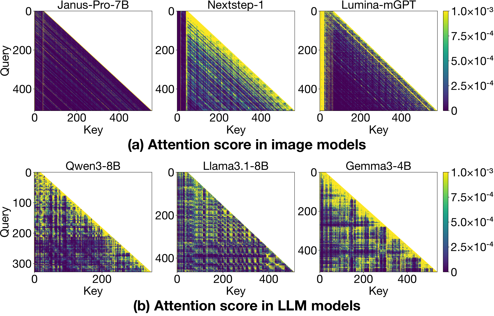
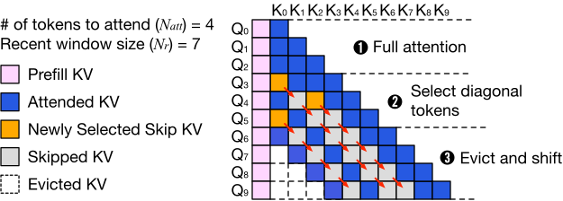
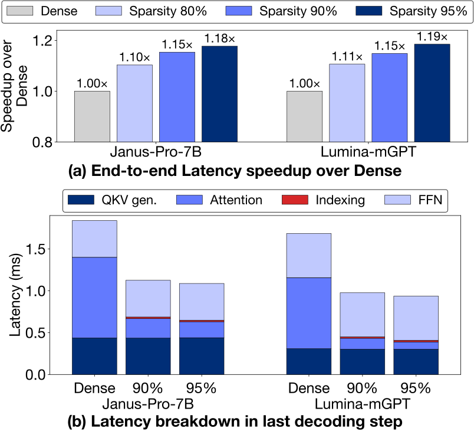
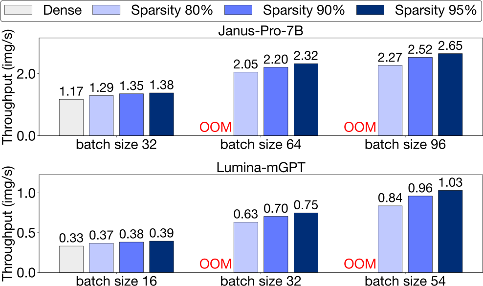

# AI Daily

## Diagonal Attention：利用視覺 token 的對角稀疏加速 Visual Autoregressive Generation

> **一句話結論：** 這篇論文先證明 Visual Autoregressive（VAR/visual AR）生成的 attention pattern 不像文字 LLM 那樣呈現固定的 global heavy hitters，而是受到影像空間局部性影響，形成沿 query–key 相對位置移動的 diagonal sparsity。作者據此提出不改模型權重的 diagonal-aware KV 稀疏策略，在 95% decode-KV sparsity 下仍維持接近 dense 的生成品質，並在特定 batch 與硬體設定上取得最高 3.1× throughput 與 1.19× end-to-end latency improvement。[1] [3]

## 論文基本資訊

| 項目 | 內容 |
|---|---|
| 論文 | *Understanding and Exploiting Diagonal Attention Sparsity in Autoregressive Image Generation* |
| 作者 | Daeun Kim、Junwha Hong、Changhun Oh、Yoonsung Kim、Yoonhyeong Lee、Jongse Park |
| 研究單位 | Korea Advanced Institute of Science and Technology（KAIST）、Agency for Defense Development、Seoul National University |
| 發表狀態 | **IISWC 2026 accepted paper**；arXiv:2609.19702v1，2026-09-17。[2] [3] [4] |
| 研究主題 | Visual autoregressive generation、KV-cache sparsity、attention locality、GPU serving、inference acceleration |
| 評估模型 | Janus-Pro-1B/7B（384×384，576 visual tokens）、Lumina-mGPT-7B（512×512，1,024 visual tokens） |
| 實作 | FlexGen、FlashAttention-2 與 custom Triton kernels；公開 artifact 可重現 Table 2、Figures 15–17。[1] [5] |
| 本庫排除查核 | 已以完整標題、arXiv ID、作者與方法關鍵字比對 `KaiCobra/AI_Daily`，未命中既有文章；因此本篇為新增研究。 |

### 為什麼今天選它

這篇工作不是單純把 LLM 的 sparse attention 搬到圖像生成。它先問一個更基本的問題：**文字 token 的稀疏性假設，是否仍適用於依序生成 visual tokens？** 作者的答案是否定的。文字序列主要遵循語言依賴，而 raster-order visual tokens 同時帶有二維空間鄰近關係。若忽略這個差異，依據累積 attention score 保留 heavy hitters，反而可能刪掉對空間一致性有用的 token。[1]

它也正好對應你近期關注的兩個方向。第一，方法屬於 frozen model 上的 inference-time attention modulation，不需微調 backbone。第二，它把「哪一些 token 應被保留」改寫成相對位置結構問題，提供一個可與 VAR 的 scale-wise routing、energy-based reliability score 和 JEPA-style predictive uncertainty 對接的明確介面。需要保留的界線是：論文本身不是 Energy-Based Transformer、JEPA 或 zero-shot controller；它是一個針對 visual AR serving 的系統與演算法研究。

## 核心貢獻

### 1. 找到 visual AR 與文字 LLM 不同的稀疏結構

在實驗的三個 visual AR 模型中，prompt 通常不到 100 tokens，但 512×512 或更高解析度的 visual decode sequence 可以達到約 1,024–8,100 tokens。以 1/16 latent downsampling ratio 為例，1024×1024 會產生約 4,096 個 visual tokens。因此 KV cache 的主要壓力來自持續累積的 decode tokens，而不是 prefill prompt。[1]

模型的 attention 也會隨生成進程逐漸變得更昂貴。對 Janus-Pro-7B 與 Lumina-mGPT，attention 在平均 decode latency 中最高約佔 40%；在最後的 decoding step，attention 比例分別可升到 53.3% 與 50.8%。這使 KV cache 同時成為**記憶體容量問題**與**attention bandwidth/latency 問題**。[1]

### 2. 證明 position-based sparsity 在圖像生成中反而勝過 score-based sparsity

作者把 token 分成 prompt、local 與 middle 三個區域。local 是最近 10% 的 decoded tokens，middle 則是其餘的歷史 visual tokens。雖然 prompt 只佔很小的序列比例，卻能取得超過一半的累積 attention；middle tokens 在 Janus-Pro、NextStep-1 與 Lumina-mGPT 中只分別取得 6.2%、8.1% 與 8.5% 的 attention mass。[1]

這解釋了為什麼 LLM 中常見的 H2O、TOVA 或 ALISA 在 visual AR 上會快速失效。score-based 方法假設重要 token 的位置會固定或在不同 query 間持續有效；但 visual AR 的重要區域會隨 query 移動。相反地，保留 prompt 與較寬 recent window 的 position-based policy，雖然簡單，卻更符合圖像生成的局部結構。[1]

### 3. 將空間局部性轉成 diagonal attention sparsity

Figure 9 顯示三個 image models 的 attention score map 出現明顯的 diagonal stripes；相同分析放到 Qwen3、Llama 3.1 與 Gemma 3 等文字 LLM 時，則沒有同樣的規律。作者進一步比較 query 間的 vertical similarity 與 diagonal similarity。若 query 相差 $d$，vertical comparison 比較兩個 query 在共同歷史 key 範圍上的 attention；diagonal comparison 則把第二個 query 的 key 範圍向右平移 $d$，比較相同相對位置的 attention。visual AR 的 diagonal similarity 穩定高於 vertical similarity，表示模型更依賴 query–key 的**相對位置**，而不是某些固定的絕對 key 位置。[1]

*圖 1。attention map 的對比。這張圖是從論文公開 HTML 資產保存到 repository `asset/DiagonalAttention/`，不是整個瀏覽器畫面截圖。*

## 方法詳解

### 1. AR image generation 與 KV cache

令 prompt KV cache 為 $(K_p,V_p)$，在第 $t$ 步已生成的 visual decode cache 為 $(K_{0:t},V_{0:t})$。dense causal attention 可概括寫成

$$
\mathbf{o}_t
=\operatorname{Attn}
\left(\mathbf q_t,
[K_p;K_{0:t}],
[V_p;V_{0:t}]
\right),
$$

其中

$$
\operatorname{Attn}(\mathbf q_t,K,V)
=\operatorname{softmax}
\left(\frac{\mathbf q_tK^{\top}}{\sqrt d}\right)V.
$$

若每一步都讀取所有歷史 visual KV，當 decode 長度為 $L$ 時，整個生成過程需要反覆處理不斷成長的 key/value 序列。忽略 prompt 長度與 kernel 常數，一個簡化的總 attention work 近似為 $O(L^2d)$。若每一步只存取固定數量 $N_{\mathrm{att}}$ 的 visual KV，則可降為 $O(LN_{\mathrm{att}}d)$。這是方法的理論直覺；實際端到端 speedup 還會受到 QKV projection、FFN、indexing、GPU memory access pattern 與 batch size 限制。

### 2. 三個觀察導出三個設計決定

作者將方法建立在三個觀察上。第一，decode KV 遠長於 prompt KV，因此稀疏化應集中於 decode region，而不是刪除 prompt。第二，attention 主要集中在 prompt 與 local visual tokens，因此應保留 prompt KV 與 recent window。第三，recent window 內的低 attention 位置會沿 query 的推進方向移動，形成 diagonal pattern；因此可以追蹤一條 diagonal skip path，而不必每一步重新對整個 window 做昂貴的選擇。[1]

### 3. Diagonal-aware sparse attention

令 recent window size 為 $N_r$，第 $t$ 步的 window 定義為

$$
W_t=\{\max(0,t-N_r),\ldots,t\}.
$$

prompt KV $(K_p,V_p)$ 永遠保留。另維護一個 skip index set $S_t$，它只記錄 recent window 中要略過的 decode KV。第 $t$ 步的有效 visual indices 是

$$
I_t=W_t\setminus S_t,
$$

因此 sparse attention 為

$$
\mathbf{o}_t
=\operatorname{Attn}
\left(\mathbf q_t,
[K_p;K_{I_t}],
[V_p;V_{I_t}]
\right).
$$

Figure 12 的流程可分成三個階段。

*圖 2。演算法的核心是讓 skip set 隨 query 一起平移，而不是對每個 query 重新猜測一組互不相關的歷史 token。*

**第一階段是 warm-up。** 當 $t<N_{\mathrm{att}}-1$ 時，skip set 尚未建立，模型在 recent window 與 prompt KV 上做完整 attention。這個階段提供足夠的 local context，也避免一開始就用不穩定的稀疏選擇。

**第二階段是建立 diagonal skip set。** 當 $N_{\mathrm{att}}-1\le t<N_r$ 時，先把既有 skip indices 全部加一，代表它們沿 query–key 平面向右移動。模型對剩餘 indices 計算 attention，得到

$$
\mathbf w_t
=\operatorname{softmax}
\left(\frac{\mathbf q_tK_{I_t}^{\top}}{\sqrt d}\right).
$$

在尚未達到 $N_r-N_{\mathrm{att}}$ 個 skip entries 時，挑選最低 attention weight 的位置：

$$
j^*=\arg\min_{j\in I_t}\mathbf w_t[j],
\qquad
S_{t+1}\leftarrow S_t\cup\{j^*\}.
$$

這個低分 key 在當前 query 仍可能被讀取；真正的 skip 會在下一個 query 以 $+1$ 的相對位移出現。作者用 $N_r=7$、$N_{\mathrm{att}}=4$ 的例子說明：若 $Q_3$ 判定 $K_0$ 是低分項，下一步 $Q_4$ 將追蹤 $K_1$，再下一步 $Q_5$ 追蹤 $K_2$。這就是 diagonal propagation 的核心。

**第三階段是固定大小的 shift-and-evict。** 當 $t\ge N_r$ 時，刪除最舊的 $K_{t-N_r},V_{t-N_r}$，將 $S_t$ 全部加一，再以 $W_t\setminus S_t$ 做 attention。每個 attention head 都維護自己的 diagonal selection，因此不同 head 可以保留不同的 relative-position pattern。[1]

### 4. 為什麼不是普通 sliding window

普通 sliding window 只保留最後一段連續 token。它隱含的假設是「距離越近越重要」。Diagonal-aware policy 保留同樣寬度的 recent window，但只在其中跳過一條隨 query 移動的低分 diagonal。於是它能用相同的 $N_{\mathrm{att}}$ 讀取較寬的 relative context，不必把 window 縮到非常窄。這也是它在 95–96% 稀疏度仍優於 fixed local window 的原因：**比較的不是保留多少 key，而是保留下來的 key 是否覆蓋足夠寬的相對空間。**

### 5. GPU serving 實作

作者把 sparse policy 實作在 FlexGen serving engine 上，以 FlashAttention-2 作為 dense baseline，再用 Triton custom kernels 融合 indirect KV gather、attention 計算與 recent-window logits 的 argmin。這個融合避免先建立額外 gather buffer，也降低了稀疏 indexing 造成的 kernel launch 與 memory traffic overhead。[1]

這裡有一個重要的系統層次區分。方法的演算法本身只需要維護 skip indices，但若直接用高階 Python tensor indexing 實作，理論上的 sparse work 不一定會轉成實際 latency。論文的 latency 結果因此同時依賴 selection rule 與 kernel co-design，不能把所有 speedup 都歸因於 diagonal heuristic。

## 實驗結果與性能指標

### 實驗設定

作者在單張 NVIDIA RTX A6000 48GB 與 Intel Xeon Gold CPU 上完成主要測試。品質評估使用 GenEval 與 DPG-Bench；GenEval 包含 553 個 prompts，每個 prompt 生成 4 張圖片，檢查 object presence、count、color 與 spatial relation。latency/throughput 測試固定 prompt length 為 50 tokens，並在 warm-up 後平均三次 inference。[1]

decode-KV sparsity ratio 表示被跳過的 decode KV 比例，而不是整個模型 FLOPs 的比例。這一點非常重要：95% decode-KV sparsity 並不代表 95% 的 end-to-end compute 都被刪除，因為 prompt attention、QKV projection、FFN、VAE decode 與 serving overhead 仍然存在。

### 1. 品質：95–96% 稀疏度仍可守住品質前緣

下表取自論文 Table 2 的代表性設定。GenEval 與 DPG-Bench 越高越好；稀疏度越高，表示跳過的 decode KV 越多。[1]

| 模型與方法 | Dense GenEval / DPG | 95% sparsity GenEval / DPG | 96% sparsity GenEval / DPG |
|---|---:|---:|---:|
| Janus-Pro-7B Dense | 0.788 / 84.16 | — | — |
| Janus-Pro-7B Diagonal | 0.792 / 83.55（80%） | **0.749 / 83.18** | 0.738 / 82.67 |
| Janus-Pro-7B Diagonal + sink4 | 0.785 / 83.81（80%） | 0.743 / 82.28 | **0.749 / 82.00** |
| Lumina-mGPT-7B Dense | 0.543 / 75.67 | — | — |
| Lumina-mGPT-7B Diagonal | 0.542 / 75.93（80%） | **0.520 / 74.48** | 0.492 / 72.89 |
| Lumina-mGPT-7B Diagonal + sink4 | 0.555 / 76.23（80%） | 0.524 / 73.68 | **0.504 / 72.24** |

Janus-Pro-7B 的 Diagonal 在 95% sparsity 仍保有 dense GenEval 的約 95%，DPG-Bench 則約 98.8%；Lumina-mGPT 在同一稀疏度約保有 dense GenEval 的 95.8%，DPG-Bench 約 98.4%。在 96% sparsity，品質下降開始變得更明顯，但 Diagonal 仍比 score-based baselines 穩定很多。論文的整體觀察是：Diagonal 在三個模型上於 96% sparsity 仍距離 dense 約 1–6%，而最佳 position-based baseline 通常下降 10–30%，score-based baselines 則可能下降超過 80%。[1]

### 2. Latency：sparse attention 的局部收益與端到端收益要分開

*圖 3。attention 本身的加速幅度大於端到端 latency，因為 projection、FFN 與其他 serving 成本仍未消失。*

在 95% sparsity，Janus-Pro-7B 的 end-to-end latency speedup 為 **1.18×**，Lumina-mGPT-7B 為 **1.19×**。但在最後一個 decoding step，attention component 的 speedup 更高：Janus-Pro-7B 在 90% 與 95% sparsity 分別為 **4.15×** 與 **5.03×**；Lumina-mGPT 則為 **6.52×** 與 **9.78×**。這個差距直接展示 Amdahl-style bottleneck：attention 可以大幅變快，但它不是整個生成 pipeline。[1]

### 3. Throughput：KV footprint 讓可行 batch size 變大

*圖 4。throughput 的最大收益來自「每一步讀更少 KV」與「GPU 可以容納更大的 batch」兩者疊加。*

在 Janus-Pro-7B、batch size 32 的可比設定中，95% sparsity 的 Diagonal 達到 **1.38 img/s**，dense 為 **1.17 img/s**。更大的差異來自記憶體容量：dense Janus-Pro-7B 在 batch size 64 以上會 out of memory，而 Diagonal 可以擴展到 batch size 96；Lumina-mGPT 的 dense 上限約為 batch size 16，而 Diagonal 可達 batch size 54。最大可行 batch 下，作者報告 Janus-Pro-7B 最高 **2.65 img/s**、Lumina-mGPT **1.03 img/s**，相對 dense configuration 的 throughput 提升最高為 **2.3×** 與 **3.1×**。[1]

因此，3.1× 不是「每張圖在同一 batch 中的純算力加速」。它混合了 KV sparsity、較小的 memory footprint、可容納更大 batch，以及 custom kernel 的效果。正確的解讀是：在作者指定的 RTX A6000、模型、prompt length 與 batch sweep 下，sparse serving 的 throughput frontier 顯著右移。

### 4. Quality–latency frontier

Figure 15 顯示在 Janus-Pro-7B batch size 96 時，Diagonal+sink4 約 38 秒即可達到 dense-level GenEval，而 StreamingLLM 約需 41 秒才達到相近品質；在 Lumina-mGPT batch size 54 的 sweep 中，Diagonal 在不同 latency operating points 大致比 StreamingLLM 高 2–3% quality。[1]

這個結果比單一「最高 speedup」更有研究價值。實際服務通常不是追求零品質損失或最大稀疏度，而是在草稿生成、prompt exploration、內容安全預覽與互動式編輯中選擇一個可接受的 Pareto point。Diagonal policy 讓這個選擇不再只靠縮小 local window。

## 相關研究：Diagonal Attention 位於哪一條路線

### HACK：以 head function 分類做 VAR KV cache compression

HACK 觀察到 VAR 的 attention heads 可分成偏向 semantic consistency 的 Contextual Heads 與偏向 spatial coherence 的 Structural Heads，並以 offline classification 為不同 head 配置不同 cache budget。它是 training-free 的 VAR KV compression framework，報告最高 70% KV cache compression；在 Infinity-8B 上，作者報告 1.75× memory reduction 與 1.57× speedup。[6]

HACK 與 Diagonal Attention 的差異在介入軸。HACK 的核心是 **head type → asymmetric budget**；Diagonal 的核心是 **query progression → relative-position shift**。兩者不是互斥方法：可以先用 head-aware budget 決定每個 head 的 $N_r$ 與 $N_{\mathrm{att}}$，再在每個 head 的 recent window 中追蹤 diagonal skip set。這會直接產生一個可測試的 head-conditioned diagonal policy。

### ADSA：以語義密度與 token diversity 動態更新 cache

ADSA 也從 visual token 的 spatial locality 出發，但它將 cache 分為 prefix、previous 與 local 三區，並以 value feature 的 cosine similarity 找出較不相似、較能補充 semantic diversity 的歷史 tokens；cache 滿載時則移除冗餘 token，並把歷史 visual tokens offload 到 CPU。[7]

ADSA 的 selection criterion 是 token-level semantic diversity；Diagonal 的 criterion 是 attention map 的相對位置幾何。前者比較像內容摘要，後者比較像 dynamic coordinate tracking。未來可把兩者結合：先使用 diagonal prior 限制候選範圍，再在 diagonal band 內以 value diversity 或 query-conditioned energy 做二次選擇。

### ZipAR：利用空間局部性平行解碼

ZipAR 將空間局部性用在另一個 bottleneck：它讓同一列或鄰近空間區域的 visual tokens 以 next-set prediction 方式平行解碼，報告在 Emu3-Gen 上最多可減少 91% model forward passes，且不需要重新訓練。[8]

ZipAR 與 Diagonal Attention 是很自然的正交組合。ZipAR 減少 forward-pass count；Diagonal 減少每個 forward pass 讀取的 KV 數量。真正困難的問題是平行解碼會改變 query 的時間／空間順序，原本沿 raster sequence 平移的 diagonal skip set 可能需要改寫成二維相對座標或 block-level trajectory。這是比直接疊加兩個方法更有價值的研究問題。

### 與 visual AR 基礎模型的關係

LlamaGen 類工作把圖像生成改寫成 discrete visual token 的 next-token prediction；VAR 則進一步把生成組織成 next-scale prediction。這些模型讓圖像生成能夠使用 LLM-style causal transformer 與 serving stack，但也讓 KV cache 隨 visual sequence 或 scale 累積。[9]

Diagonal Attention 的主要新意不在提出另一個 tokenizer 或 generator，而在於指出：**visual token sequence 的 inference geometry 本身就應該被視為系統設計訊號。** 這個觀點可以跨 tokenizer、模型規模與 serving framework 檢驗，但目前論文只在三個代表性模型上驗證，尚不能宣稱對所有 visual AR 或所有 VAR next-scale 模型成立。

## 對 Energy-based Transformer、JEPA、VAR 與 zero-shot 的延伸構想

### 1. Energy-based diagonal routing

論文目前用 attention weight 的低值選擇 skip token。可以把每個 query–key pair 寫成 compatibility energy：

$$
E_t(j)
=-\frac{\mathbf q_t^{\top}\mathbf k_j}{\sqrt d},
\qquad
p_t(j)=\frac{\exp(-E_t(j))}{\sum_{u\in I_t}\exp(-E_t(u))}.
$$

現有方法實際使用 $p_t(j)$ 的最小值建立 skip set。下一步可以加入 relative-position prior 與 uncertainty term：

$$
\widetilde E_t(j)
=E_t(j)
+\lambda_r\,\phi(\Delta x_j,\Delta y_j)
+\lambda_u\,U_t(j),
$$

其中 $\phi$ 代表相對空間距離，$U_t(j)$ 可由 attention variance、head disagreement 或 predictive disagreement 估計。當能量差異足夠大時，系統沿 diagonal shift；當能量不確定時，暫時擴大 $N_{\mathrm{att}}$。這會把固定 sparsity ratio 改成 energy-calibrated adaptive compute。這段是延伸研究構想，不是原論文已驗證的方法。

需要注意，這樣的 compatibility energy 仍不等於完整 Energy-Based Transformer。若沒有對能量函數、正常化常數、負樣本或 sampling dynamics 做明確定義，就不能把 attention logit 改名為 EBT。比較嚴謹的實驗是測試 energy gate 是否能在固定 GenEval/DPG-Bench 下降低平均 KV reads，並畫出 quality–latency–energy Pareto curve。

### 2. JEPA-style predictive disagreement 作為安全 fallback

Diagonal shift 的假設是相鄰 query 的相對位置 pattern 會持續。如果這個假設在複雜構圖、長距離關係或新 tokenizer 上失效，系統應該知道何時停止追蹤。可以加入一個不改 backbone 的 predictor，對每個候選 token 的下一步 hidden state 做預測：

$$
\widehat{\mathbf z}_{t+1,j}
=g_{\phi}(\mathbf z_{t,j},\mathbf c_t),
\qquad
U_t(j)=
\left\|
\operatorname{sg}(\mathbf z_{t+1,j})
-\widehat{\mathbf z}_{t+1,j}
\right\|_2^2.
$$

若 $U_t(j)$ 在某個 head 或 spatial band 上升，代表沿用過去的 diagonal shift 可能會刪掉重要資訊。controller 可以暫時降低 sparsity、增加 $N_{\mathrm{att}}$，或改用 full attention。這會把 JEPA 的 predictive representation ideas 用在**推理期計算分配**，但仍需要額外訓練 predictor，因此不應描述成原論文的 zero-shot capability。

### 3. 從一維 diagonal shift 推到 VAR 的 scale-wise 2D routing

目前方法以一維 causal sequence index 追蹤 diagonal。若輸入是 next-scale VAR，可把 token 位置寫成 $(s,r,c)$，其中 $s$ 是 scale，$(r,c)$ 是該尺度的二維座標。skip policy 不必只使用 $j\mapsto j+1$，而可以改為

$$
(r,c,s)\mapsto
(r+\Delta r,
 c+\Delta c,
 s+\Delta s),
$$

再以每個 scale 的 relative-position energy 決定允許的 transition。粗尺度可以用較低 sparsity 以保留 global composition；細尺度則可以使用較高 sparsity 以捕捉 local texture。這個方向可與 HACK 的 head-aware cache budget 和 ZipAR 的 parallel next-set decoding 同時評估。

### 4. 嚴格區分 training-free 與 zero-shot

Diagonal Attention 不更新 Janus 或 Lumina 的模型權重，也不需要為每個 prompt 做 gradient optimization，因此可以稱為 inference-time、training-free sparse attention。可是它並不是 zero-cost：它需要額外的 skip-index bookkeeping、custom Triton kernel、特定 GPU memory layout，以及對不同模型重新確認 $N_r$、$N_{\mathrm{att}}$ 與 sparsity–quality curve。

它也不是嚴格意義上的 zero-shot generalization claim。論文在三個 model families 上做了 evaluation，但沒有在全新 tokenizer、不同解析度、不同 GPU 架構與未見過的 visual AR serving stack 上完成全面 transfer protocol。未來如果要宣稱 zero-shot，至少應固定 policy，禁止 model-specific threshold tuning，並在未見模型與新解析度上報告 quality、latency、KV reads 和 memory footprint。

## 限制與證據界線

第一，IISWC 2026 是與計算機架構、系統與 workload characterization 相關的會議，不是 CVPR、ICCV、ICML 或 NeurIPS。這不是缺點，而是應在定位上說清楚：本文的主要貢獻是 visual generation serving 的 workload characterization 與系統 co-design，而不是新的生成模型或 image quality SOTA。[3]

第二，主要品質實驗只涵蓋 Janus-Pro-1B/7B 與 Lumina-mGPT-7B，解析度是 384×384 或 512×512。論文分析段落包含 NextStep-1，但完整 Table 2 與速度實驗沒有涵蓋所有模型。對 1024×1024、不同 latent ratio、不同 tokenizer 或真正 next-scale VAR 的外推仍待驗證。[1]

第三，最大 throughput headline 混合了稀疏 attention、KV footprint、batch size 與 fused kernel。固定 batch 下的 end-to-end speedup 是 1.18–1.19×，明顯低於最大可行 batch 的 2.3–3.1× throughput。任何 reproduction 都應把這兩種 protocol 分開報告。

第四，公開 artifact 的可重現成本不低。論文 appendix 估計完整 quality experiment 需要約 40 天的 4× RTX A6000；GitHub README 則估計 full-ratio quality run 約 36 天，並指出模型與 evaluator 權重約需 60 GB。speedup figures 的 reduced-ratio workflow 低得多，但仍需要 CUDA 12.3、Docker、NVIDIA Container Toolkit、至少 48 GB GPU 與 custom serving environment。[1] [5]

第五，GenEval、DPG-Bench 與自動化 latency 只能提供第一層證據。論文沒有提供不同 prompt length、不同 GPU、不同 kernel implementation 或獨立研究團隊 reproduction 的完整結果。對一個同時涉及 algorithm–kernel co-design 的方法而言，這些外部變因會直接影響實際收益。

## 個人評價與研究意義

我認為這篇論文最值得保留的不是「3.1×」這個 headline，而是它把 visual AR 的 inference bottleneck 從抽象的 KV cache size 問題，轉成可觀測、可反駁的**相對位置幾何**。作者沒有先假設 heavy hitter 或 sliding window 必然有效，而是先分析 image model 與 LLM 的 attention map，再用觀察到的 diagonal structure 設計 policy。這種 characterization-driven workflow 很適合延伸到你關注的 Energy-based Transformer、JEPA 與 attention modulation。

它最有啟發性的研究問題是：**sparsity policy 是否應該是 state-dependent，而不是固定 ratio？** 在容易的 prompt 或穩定的局部紋理中，可以沿 diagonal shift 大幅刪除 KV；在 composition、count、text rendering 或長距離關係困難的 prompt 中，則應該由 energy margin 或 predictive disagreement 自動回退到較密的 attention。這比一律追求 95% sparsity 更可能形成真正可部署的 quality–latency controller。

另一個重要方向是把一維 raster sequence 的 diagonal pattern 推到二維 scale-aware generation。若 VAR 在 coarse scale 先決定物件數量與位置，fine scale 再補細節，那麼不同 scale 可能需要不同的 cache geometry。可以先用 coarse-scale energy 估計哪些區域需要長距離 context，再將 diagonal sparse policy 變成 region-graph attention。這會把 visual AR serving 從「壓縮一條序列」推向「根據生成狀態管理多尺度視覺記憶」。

## 結論

Diagonal Attention 的核心訊息是：**visual AR 的 attention sparsity 由空間局部性塑造，因此不能直接照搬文字 LLM 的 token importance 假設。** 作者透過 prompt/local/middle attention 分布與 vertical/diagonal similarity 分析，提出在 recent window 中沿 diagonal 追蹤 skip indices 的 sparse attention policy。實驗顯示，Janus-Pro 與 Lumina-mGPT 在 95–96% decode-KV sparsity 下仍可保留相當生成品質；在指定硬體和 batch sweep 下，end-to-end latency 改善約 1.18–1.19×，最大可行 batch throughput 最高 2.3–3.1×。[1]

它不是 Energy-Based Transformer、JEPA、VAR foundation model 或 zero-shot controller，但它提供了一個很乾淨的接口：relative-position structure 決定候選範圍，attention energy 決定保留或跳過，predictive disagreement 決定是否回退，scale-aware routing 決定不同解析度與生成階段的記憶體配置。這使它特別適合作為下一步研究的 systems-level baseline。

## References

[1]: https://arxiv.org/html/2609.19702v1 "Understanding and Exploiting Diagonal Attention Sparsity in Autoregressive Image Generation — full HTML paper"
[2]: https://arxiv.org/abs/2609.19702 "Understanding and Exploiting Diagonal Attention Sparsity in Autoregressive Image Generation — arXiv abstract and metadata"
[3]: https://iiswc.org/iiswc2026/program.html "IISWC 2026 official program listing"
[4]: https://zenodo.org/records/21712898 "IISWC Artifact for Understanding and Exploiting Diagonal Attention Sparsity in Autoregressive Image Generation"
[5]: https://github.com/casys-kaist/DiagonalAttn "Official DiagonalAttn artifact and reproduction instructions"
[6]: https://arxiv.org/abs/2504.09261 "Head-Aware KV Cache Compression for Efficient Visual Autoregressive Modeling — HACK"
[7]: https://arxiv.org/html/2506.18226v1 "Make It Efficient: Dynamic Sparse Attention for Autoregressive Image Generation — ADSA"
[8]: https://arxiv.org/abs/2412.04062 "ZipAR: Parallel Auto-regressive Image Generation through Spatial Locality"
[9]: https://arxiv.org/html/2406.06525v1 "Autoregressive Model Beats Diffusion Models at Image Generation — LlamaGen"

---

本文作者：**Manus AI**

日期：**2026-09-21**
