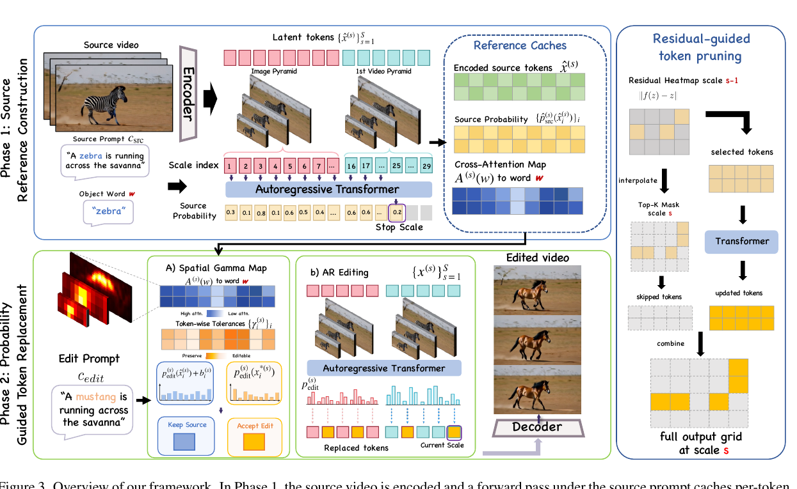
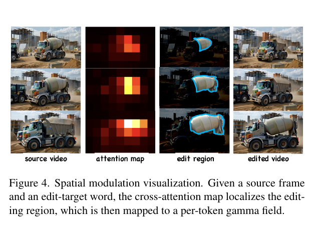
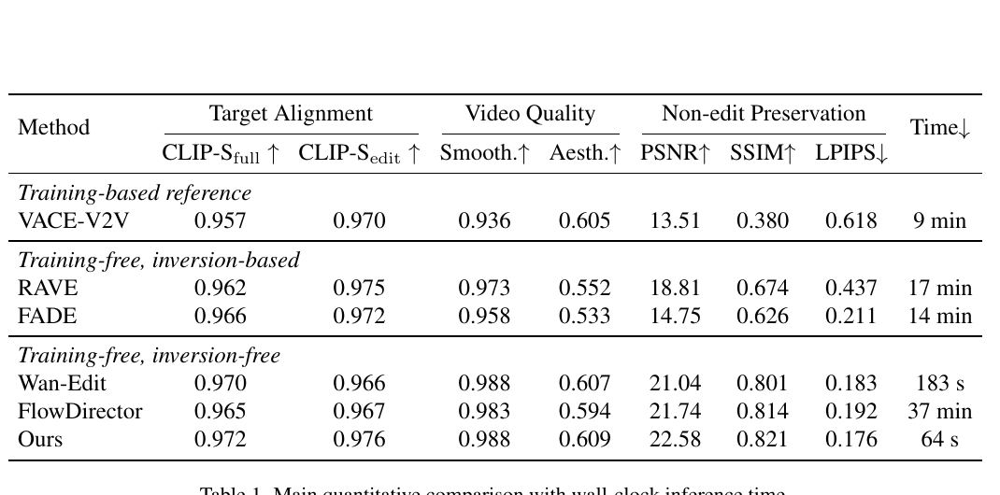

# AI Daily

## 今日精選：Edit-VAR — Taming Visual Autoregressive Model for Precise Video Editing

**研究日期：2026-09-30**　**研究主題：Visual Autoregressive、training-free、attention modulation、zero-shot inference**

**一句話評價：** Edit-VAR 把影片編輯從連續 latent inversion 改寫成 Visual Autoregressive（VAR）多尺度 token 的「保留或替換」決策；再用 cross-attention 產生空間化的 preservation tolerance、在晚期尺度釋放 source constraint，最後以 residual-guided pruning 減少高解析度 token 計算。它是目前很適合拿來思考「VAR 如何成為 training-free video editor」的一篇工作，但其 **CVPR 2026 camera-ready** 標記在官方可查證資料中尚未獲得獨立確認，因此本文只把它視為 **2026-09-18 發布的 arXiv v1 預印本**。[1] [2]

## 論文基本資訊

- **標題：** *Edit-VAR: Taming Visual Autoregressive Model for Precise Video Editing*
- **作者：** Chongbo Zhao、Jiangming Wang、Xilai Wang、Xinyu Wang、Jingyi Tang、Chunjie Hao、Pengjie Song、Yue Ma
- **研究單位：** Sun Yat-sen University、South China University of Technology、Tsinghua University、Shandong University、Nankai University、Hunan University。[1] [2]
- **發表狀態：** arXiv:2609.21268v1，2026-09-18；目前沒有可獨立核對的期刊或正式會議出版紀錄。[1]
- **程式碼：** [官方 GitHub](https://github.com/chongbozhao3-coder/Edit-VAR)，MIT License；以 InfinityStar 8B、81 frames、720p release configuration 為基礎。[3]
- **論文與專案頁：** [arXiv HTML](https://arxiv.org/html/2609.21268v1)、[Project Page](https://chongbozhao3-coder.github.io/Edit-VAR/)。[2] [4]

## 為什麼值得今天讀？

影片編輯通常有兩條路。第一條是把 source video inversion 到一條連續的 noise/latent trajectory，再在 target prompt 下重新生成；第二條是不做 inversion，但用 guidance 或 feature transport 直接限制生成。前者會把 inversion 誤差帶進後續每一步，後者又容易在「改得動」與「保得住」之間取捨。[2]

Edit-VAR 的切入點很乾淨：如果預訓練 VAR 已經能把影片直接 encode 成 coarse-to-fine 的離散 token，那麼 source token 本身就是一個可重用的 reference。編輯不必先找回連續軌跡，只需要在每一個尺度、每一個 token 上回答：**這個 source token 是否仍然被 edit prompt 支持？若支持，保留；若不支持，替換。**

它特別適合本期的研究偏好，因為同時碰到：

1. **VAR：** 直接使用 InfinityStar 的 spatiotemporal next-scale generation。
2. **Training-free：** 不更新模型權重，也不做每張影片的 test-time optimization。
3. **Attention modulation：** 把 source-side cross-attention 轉成 token-wise 的 preservation tolerance。
4. **Zero-shot inference：** 對新影片與新 edit prompt 直接推理；但這不等同於「跨領域 zero-shot 泛化」已被實驗證明。
5. **效率：** 把 late-scale constraint release 與 residual-guided pruning 合併，降低兩階段編輯成本。

## 核心貢獻

### 1. 直接在離散 VAR token 空間編輯

InfinityStar 將影片表達為由粗到細的離散 token blocks：

$$
p(\mathbf{x}\mid c)=\prod_{s=1}^{S}p\left(x^{(s)}\mid x^{(<s)},c\right),
$$

其中 $c$ 是文字條件，$x^{(s)}$ 是第 $s$ 個尺度的 token map。每個尺度內的 token 可以平行預測；早期尺度掌握全局結構，後期尺度補上空間、時間與紋理細節。[2] [5]

這個形式很適合編輯：source video 可以被 deterministic encoder 直接轉成每個尺度的 source token，不需要像 diffusion editing 那樣先做 iterative inversion。Edit-VAR 的介入位置就是 VAR 的 token selection，而不是連續 noise trajectory。

### 2. Probability-guided token replacement

第一階段先用 source prompt $c_{\mathrm{src}}$ 做 force decoding，保存三類 reference cache：

$$
\left\{\hat{x}^{(s)},\hat{p}^{(s)}_{\mathrm{src}},A^{(s)}\right\},
$$

分別代表 source token、source-conditioned probability，以及 source-side cross-attention map。第二階段改用 edit prompt $c_{\mathrm{edit}}$，對每個位置 $i$ 取 edit distribution 的最大候選：

$$
x_{i}^{*(s)}=\arg\max_j p_{\mathrm{edit}}^{(s)}(j).
$$

對 cache 中的 source token 加上一個 preservation bias：

$$
b_i^{(s)}=\max\left(\gamma_i^{(s)}-\hat{p}_{\mathrm{src}}^{(s)}\left(\hat{x}_i^{(s)}\right),0\right).
$$

最後用以下規則保留或替換：

$$
x_i^{(s)}=
\begin{cases}
\hat{x}_i^{(s)}, & p_{\mathrm{edit}}^{(s)}\left(\hat{x}_i^{(s)}\right)+b_i^{(s)}\geq p_{\mathrm{edit}}^{(s)}\left(x_i^{*(s)}\right),\\
x_i^{*(s)}, & \text{otherwise.}
\end{cases}
$$

這個規則的重點不是「source token 的絕對機率有多大」，而是它從 source prompt 到 edit prompt **掉了多少支持度**。當 $b_i^{(s)}>0$ 時：

$$
p_{\mathrm{edit}}^{(s)}\left(\hat{x}_i^{(s)}\right)+b_i^{(s)}
=\gamma_i^{(s)}-
\left[
\hat{p}_{\mathrm{src}}^{(s)}\left(\hat{x}_i^{(s)}\right)-p_{\mathrm{edit}}^{(s)}\left(\hat{x}_i^{(s)}\right)
\right].
$$

因此 source-to-edit support drop 越大，source token 越容易被替換；$\gamma_i^{(s)}$ 則控制容許多少 drop。$\gamma=0$ 等於不施加 preservation bias，完全讓 edit distribution 決定；$\gamma=2$ 時，由於機率被限制在 $[0,1]$，source token 幾乎被強制保留。[2]

*圖 1。從 PDF 的 Figure 3 指定區域裁切。上半部建立 source reference cache，下半部使用 edit prompt 做 token replacement；右側則以 residual map 選擇需要保留計算的 token。*

### 3. Attention-guided spatial modulation

如果整段影片使用一個固定 $\gamma$，編輯區域與背景會受到同一個 preservation 強度，容易出現兩種錯誤：編輯區改不動，或背景被一起改掉。Edit-VAR 觀察 source prompt 中與 edit target 對應的 word，其 cross-attention map 通常能定位目標在影片中的空間位置。[2]

方法分成兩層：先依尺度建立一個 gamma envelope：

$$
\gamma_{\{\mathrm{low},\mathrm{high}\}}^{(s)}
=\gamma_{\mathrm{start}}
+\left(\gamma_{\mathrm{end}}^{\{\mathrm{fg},\mathrm{bg}\}}
-\gamma_{\mathrm{start}}\right)
\sigma\left(\frac{t-t_c}{w_t}\right),
$$

其中 $t$ 是 image/video tower 內的 normalized scale position。作者設定 $\gamma_{\mathrm{start}}=2.0$，讓早期 coarse scales 先保護全局 layout；到了後期，foreground 的 $\gamma_{\mathrm{low}}$ 下降，允許編輯，background 的 $\gamma_{\mathrm{high}}$ 仍維持較高，保護非目標區域。

接著把 attention score $a_i\in[0,1]$ 映射到每個 token 的 tolerance：

$$
\gamma_i^{(s)}
=\gamma_{\mathrm{high}}^{(s)}
+\left(\gamma_{\mathrm{low}}^{(s)}-\gamma_{\mathrm{high}}^{(s)}\right)
\sigma\left(\frac{a_i-c_a}{w_a}\right).
$$

也就是 **high attention $→$ low $\gamma$，low attention $→$ high $\gamma$**。前景 token 會更容易接受 edit distribution，背景 token 需要更大的 support drop 才會被替換。

*圖 2。從 PDF 的 Figure 4 指定區域裁切。cross-attention 先定位水泥車區域，再轉成 per-token gamma field；這不是外部 segmentation mask，而是模型自身 attention 的 inference-time signal。*

### 4. Scale-Decoupled Generation

在高解析度尺度，source token 同時承載細節、姿態與動態。若仍強迫每個細節 token 服從 source，新的 motion 或 texture 可能被切碎。因此 Edit-VAR 在 $S_{\mathrm{stop}}$ 之後停止 Phase 1 的 source caching，Phase 2 改為自由生成：

$$
s\geq S_{\mathrm{stop}}\quad\Rightarrow\quad \gamma=0.
$$

論文設定 $S_{\mathrm{stop}}=25$。早期尺度保留 source global structure，晚期尺度讓 target prompt 自己重建與新動態一致的 fine details。消融顯示，移除 Scale-Decoupled Generation 後，full/edit CLIP-S 由 $0.979/0.980$ 降到 $0.935/0.951$，SSIM 由 $0.833$ 降到 $0.612$；Phase 1 runtime 則由 65.0 秒降到 19.8 秒，約 3.29× 加速。[2]

### 5. Residual-guided token pruning

最後兩個高解析度尺度不一定每個 token 都需要同樣多的 Transformer 更新。Edit-VAR 使用前一尺度的 residual magnitude 作為 activity signal：

$$
r_i^{(s)}\approx\left\|f_\theta(x_i)-x_i\right\|_2.
$$

把 residual map 插值到當前尺度，只保留 residual 最大的 top-$K$ token 通過 36 個 Transformer blocks；其餘 token bypass 當前尺度的 Q/K/V、attention 與 feed-forward，直接保留 input state，再合併回完整的 2D/3D lattice。作者以 $K=50\%$ 為預設 operating point。[2]

這不是把 token 從空間網格刪除，而是把低 activity token 的計算跳過。因此仍保留完整輸出 grid，也讓 retained token 能繼續讀取早期尺度的 cross-scale KV cache。

## 實驗結果

### 實驗設定

- **資料：** 160 個公開來源影片，分為 object replacement、object addition、background replacement、attribute editing 四類，每類 40 個案例。
- **生成：** InfinityStar，81 frames；論文實驗使用單張 NVIDIA A800，補充設定為 480p BF16。官方 release 也提供 720p/81-frame configuration。[2] [3]
- **比較方法：** VACE-V2V（training-based）、RAVE/FADE（training-free inversion-based）、Wan-Edit/FlowDirector（training-free inversion-free）。
- **指標：** full-frame 與 edit-region CLIP-S 衡量目標對齊；VBench Motion Smoothness 與 Aesthetic Quality 衡量影片品質；非編輯區域以 PSNR、SSIM、LPIPS 衡量 source preservation。所有方法共享同一組 SAM2 編輯區 mask。

### 主結果

*圖 3。從 PDF 的 Table 1 指定區域裁切。Time 是作者在同一張 A800 上量測的 wall-clock inference time。*

| 方法 | CLIP-S full | CLIP-S edit | Smooth. | Aesth. | PSNR ↑ | SSIM ↑ | LPIPS ↓ | 時間 |
|---|---:|---:|---:|---:|---:|---:|---:|---:|
| RAVE | 0.962 | 0.975 | 0.973 | 0.552 | 18.81 | 0.674 | 0.437 | 17 min |
| FADE | 0.966 | 0.972 | 0.958 | 0.533 | 14.75 | 0.626 | 0.211 | 14 min |
| Wan-Edit | 0.970 | 0.966 | **0.988** | 0.607 | 21.04 | 0.801 | 0.183 | 183 s |
| FlowDirector | 0.965 | 0.967 | 0.983 | 0.594 | 21.74 | 0.814 | 0.192 | 37 min |
| **Edit-VAR** | **0.972** | **0.976** | **0.988** | **0.609** | **22.58** | **0.821** | **0.176** | **64 s** |

在作者選定的 160-video protocol 中，Edit-VAR 的 full-frame/edit-region CLIP-S 為 $0.972/0.976$，Aesthetic Quality 為 $0.609$，Motion Smoothness 為 $0.988$，並在三個 non-edit preservation 指標都取得表內最佳值：PSNR $22.58$、SSIM $0.821$、LPIPS $0.176$。[2]

時間比較也很醒目：81-frame video edit 為 64 秒，對比 Wan-Edit 的 183 秒、FlowDirector 的 37 分鐘。不過這是單一 A800、固定影片長度與作者自建 160-video protocol 的結果，不能直接推論到其他硬體、解析度或影片長度。

### 消融結果：每個元件是否真的必要？

- **移除 attention guidance：** edit-region CLIP-S 從 $0.980$ 降到 $0.931$，SSIM 從 $0.833$ 降到 $0.563$。這支持 spatial localization 對「只改目標、不動背景」的必要性。
- **移除 scale envelope：** edit-region CLIP-S 下降 $0.047$，SSIM 下降 $0.166$。
- **改成 AREdit-style uniform $\gamma$：** edit-region CLIP-S 只有 $0.913$，LPIPS 升到 $0.456$，說明把 image-level 的單一 preservation policy 直接搬到 video 不夠。
- **移除 Scale-Decoupled Generation：** full/edit CLIP-S 為 $0.935/0.951$；加入後為 $0.979/0.980$。同時 two-phase runtime 從 130.0 秒降到 84.8 秒。
- **random pruning vs. residual pruning：** 在同樣保留 50% token 的條件下，random pruning 的 edit CLIP-S/LPIPS 是 $0.954/0.235$，residual pruning 是 $0.976/0.176$。這表示速度提升不只是來自 token budget 變小，也依賴 residual 作為選擇訊號。
- **最終加速配置：** Scale-Decoupled Generation + 50% residual pruning 為 64 秒，相對未優化的 130 秒約 2.04×；但未開 pruning 的 release command 與論文 final accelerated configuration 不是同一個設定。[2] [3]

### User study 的證據強度

作者以 15 位參與者、50 個隨機案例做 blind user study，評分項目為 editing quality、background preservation、temporal consistency，選項是 Fail/Pass/Good/Excellent。論文只報告 Edit-VAR 在三項指標的 Good+Excellent 合計比例最高，完整百分比放在補充資料，正文沒有提供 confidence interval 或顯著性檢定。因此這項結果可作為支持性證據，但不能被解讀成完整的 statistical proof。[2]

## 相關研究脈絡

### VAR 與 InfinityStar

原始 VAR 將 image generation 從 raster next-token 改寫成 next-scale prediction：每個尺度是一個 token map，尺度內可以平行預測，並保留 coarse-to-fine 的空間結構。[5] Infinity 與後續 InfinityStar 把這個離散、分尺度的生成框架推向高解析度與時空影片。Edit-VAR 沒有重新設計 backbone，而是利用「每個尺度都有 source token」這個性質，把 VAR 的 sampling decision 變成 editing interface。

### AREdit：最直接的 image-level 前身

AREdit 已經在 image-level VAR 中 cache source token index 與 probability，再用 source/target probability difference 做 adaptive token replacement；它同樣是 training-free 且不需要 explicit inversion。[6] Edit-VAR 的主要增量是把單張圖片的 spatial mask 問題，改成影片中的 **token-wise + scale-aware + temporal** preservation：使用 cross-attention 定位區域，用 scale envelope 控制不同 generation stage，再釋放 late-scale source constraint。

### VAREdit 與其他 VAR editing

VAREdit 是需要 paired data / fine-tuning 的 instruction-guided VAR image editing 路線；Edit-VAR 則維持 inference-only。Anchor Token Matching / ISLock 透過 anchor token matching 保存 source structure，與 Edit-VAR 的 probability support-drop 判準不同。這些研究共同說明：VAR 的離散 token 使「保留某些 source token、只替換另一些 token」比連續 latent inversion 更容易精確表達。[2]

### FlowDirector 與 inversion-free video editing

FlowDirector 是重要的非 VAR 對照，直接在影片編輯中處理 appearance、motion 與 stability；Edit-VAR 的差別不是再加一個 continuous guidance term，而是把編輯決策往 discrete token selection 移動。這使它能直接利用 source encoder 的 token identity，但也因此受限於 token replacement 對大幅結構變化的能力。[2] [8]

## 限制與可重現性檢查

1. **不是 object removal 或大幅 layout edit。** conditional token replacement 天生保留 source global structure；如果要移除物體並讓空缺區域合理 inpaint，單純 token replacement 不夠。作者也明確把 object removal 與 significant layout modification 列為限制。[2]
2. **「自動 anchor」與 release CLI 有落差。** 論文描述以 source/edit prompt word difference 自動找到 source-side anchor；但官方 `launch.sh` 介面要求使用者傳入 `--target-word`，且該詞必須存在於 `--source-prompt`。[3] 這是目前最需要修正的 reproducibility caveat。
3. **論文 final speed 與 repo 預設值不完全相同。** 論文 final accelerated configuration 用 50% residual pruning；repo README 的 `--prune-from-si` 預設為 disabled，必須額外打開 pruning。[3]
4. **benchmark 是作者自建 protocol。** 160 個公開來源影片、每類 40 個案例、單一 A800 與固定 81 frames 能說明方法潛力，但不足以證明不同影片來源、解析度、硬體與更長影片仍有同樣排名。
5. **source reconstruction 並非 lossless。** 補充結果中，直接 InfinityStar token reconstruction 的 PSNR/SSIM/LPIPS 為 $29.93/0.920/0.061$，仍不是完美重建；它是比 Wan2.1 inversion-and-regeneration 的 $25.62/0.898/0.124$ 更低漂移的 reference，不代表 source token 完全無損。[2]
6. **user study 的統計資訊不足。** 15 人、50 案例的 Good+Excellent 排名值得注意，但正文沒有百分比、信賴區間或顯著性檢定。
7. **不是 EBT、JEPA 或 VAR training objective 的融合。** Edit-VAR 是 VAR-based inference control；它沒有 Energy-Based Transformer 的 scalar energy、沒有 JEPA target encoder / predictive embedding loss，也沒有額外訓練。這些是和使用者偏好的研究方向的「可接合點」，不是論文已經完成的結果。

## 我的評價與可延伸的研究想法

### 評價

我認為 Edit-VAR 的最大價值不是單一 64 秒數字，而是把 video editing 的 preservation decision 寫成可檢查的離散規則：source token、source probability、edit probability、attention localization、scale schedule、residual activity 都有明確的介入位置。這比「對 latent 做一個黑盒 guidance」更容易分析，也更適合做 ablation 或建立可控的 inference-time controller。

它的真正新意偏向 **系統級組合與問題重寫**，不是全新的 generative backbone。Probability cache 有 AREdit 前身，attention map steering 也不是全新概念，token pruning 更有 VAR acceleration 先例；Edit-VAR 的貢獻在於把三者與 video-specific scale/motion constraint 組成一個合理的 editing algorithm。相對地，論文的「first training-free, inversion-free VAR video editor」仍應視為作者的 literature-positioning claim，不宜當作已被完全證明的全球 priority。

### 對 EBT、JEPA、training-free、attention modulation、zero-shot 的啟發

**1. Energy-Gated VAR Editing：把 support drop 寫成 energy。**

Edit-VAR 現在用 probability bias 做 hard decision。可以定義一個可校準的 token compatibility energy：

$$
E_i^{(s)}
=\lambda_p\left[
\hat{p}_{\mathrm{src}}^{(s)}(\hat{x}_i^{(s)})
-p_{\mathrm{edit}}^{(s)}(\hat{x}_i^{(s)})
\right]
-\lambda_a a_i
+\lambda_r r_i^{(s)}.
$$

其中第一項代表 source-to-edit support drop，第二項用 attention 把 edit region 拉低能量，第三項用 residual activity 表示該位置仍需要多少 computation。這個 energy 可以不直接替換目前的 rule，而是用來做 calibrated threshold、beam selection 或 adaptive NFE，讓「保留／替換／重算」變成同一個 energy ranking 問題。**這是我的延伸提案，不是 Edit-VAR 論文中的既有公式。**

**2. JEPA-Predictive Gamma：用未來表徵一致性決定何時放開 source constraint。**

目前 $\gamma$ 主要由 attention 與 scale 決定，沒有直接檢查「這個 token 的改動是否會破壞跨 frame dynamics」。可以加入 frozen JEPA-style predictor，預測 edit 後的 future embedding $\hat{z}_{t+\Delta}$，再以 predictive disagreement $u_i$ 調整 tolerance：

$$
\gamma_i^{(s)}
=\gamma_{i,\mathrm{EditVAR}}^{(s)}
+\lambda_u u_i,
\qquad
u_i=\left\|g(z_{\leq t},c_{\mathrm{edit}})-z_{t+\Delta}\right\|_2.
$$

如果某個 token 的 edit 會讓 future representation 不穩定，就提高 preservation；如果 attention 很高且 JEPA predictor 對新動態有信心，就降低 $\gamma$，允許更強的 edit。這會把「attention localization」和「temporal causality」接在一起。

**3. 真正的 zero-shot protocol。**

目前的 training-free 是「不訓練、不 inversion、不 per-video optimization」，但並沒有針對 unseen domain、unseen backbone 或 unseen edit grammar 的 zero-shot transfer table。後續可建立：

- 在 InfinityStar 之外測試另一個 VAR video backbone；
- 以完全不同的影片 domain 做 cross-domain edit；
- 分開測試 object replacement、attribute、motion change、background replacement；
- 同時報告 target alignment、non-edit preservation、temporal consistency、runtime 與 peak memory；
- 把 automatic anchor 與 CLI `--target-word` 兩種 protocol 分開比較。

這樣才能把「zero-shot inference」與「zero-shot generalization」清楚區分，避免把 training-free 直接等同於泛化能力。

**4. Adaptive compute：不要只在最後兩個尺度 pruning。**

目前 residual pruning 只作用在 final two scales。更進一步可以把 residual、attention、support drop 與 JEPA disagreement 形成一個 per-scale compute budget：簡單背景 token 走 skip path，edit boundary token 走 full Transformer，motion-sensitive token 在 video tower 保留更高 budget。這會比固定 $K=50\%$ 更接近「依 token uncertainty 分配計算」的 Energy-Based Transformer / adaptive attention modulation 方向。

## 結論

Edit-VAR 讓我最想追的不是「VAR 是否能取代 diffusion」，而是另一個更實際的問題：**當模型已經擁有離散、多尺度、可直接 encode 的 source representation，training-free editing 是否可以被重新定義成一個帶空間、尺度與時間條件的 token selection / energy allocation 問題？**

這篇工作已經給出一個相當完整的 baseline：probability support drop 負責「改不改」、attention gamma 負責「哪裡改」、scale-decoupling 負責「什麼時候放開」、residual pruning 負責「哪裡值得算」。下一步最有研究價值的方向，是用 JEPA 的 predictive consistency 補上 temporal causal signal，再把所有訊號統一成可校準的 energy 或 uncertainty controller。

## References

[1]: https://arxiv.org/abs/2609.21268 "Edit-VAR: Taming Visual Autoregressive Model for Precise Video Editing — arXiv record"
[2]: https://arxiv.org/html/2609.21268v1 "Edit-VAR: Taming Visual Autoregressive Model for Precise Video Editing — full paper"
[3]: https://github.com/chongbozhao3-coder/Edit-VAR "Official Edit-VAR implementation and reproducibility README"
[4]: https://chongbozhao3-coder.github.io/Edit-VAR/ "Edit-VAR official project page"
[5]: https://arxiv.org/html/2404.02905v1 "Visual Autoregressive Modeling: Scalable Image Generation via Next-Scale Prediction"
[6]: https://arxiv.org/abs/2503.23897 "Training-Free Text-Guided Image Editing with Visual Autoregressive Model"
[7]: https://arxiv.org/abs/2511.04675 "InfinityStar: Unified Spacetime AutoRegressive Modeling for Visual Generation"
[8]: https://arxiv.org/abs/2506.05046 "FlowDirector: Training-Free Inversion-Free Video Editing"
[9]: https://arxiv.org/abs/2508.15772 "VAREdit: Visual Autoregressive Modeling for Instruction-Guided Image Editing"
[10]: https://arxiv.org/abs/2503.13684 "FiVE: A Fine-grained Video Editing Benchmark"
