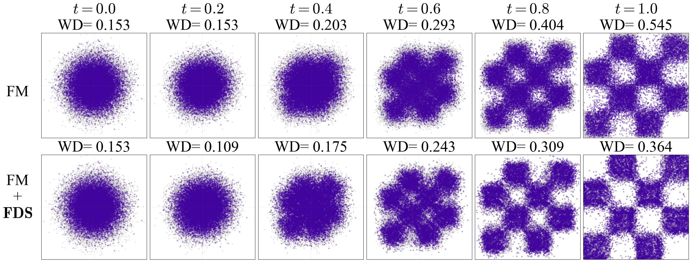

# AI Daily

> **研究日期：** 2026-09-03　　**整理：** Manus AI　　**主題：** Flow Matching、training-free sampling、divergence guidance、Energy-based reliability、zero-shot generation

## Training-Free Refinement of Flow Matching with Divergence-based Sampling

## 一、論文基本資訊

| 欄位 | 內容 |
|---|---|
| 論文標題 | *Training-Free Refinement of Flow Matching with Divergence-based Sampling* |
| 方法名稱 | **Flow Divergence Sampler（FDS）** |
| 作者 | Yeonwoo Cha、Jaehoon Yoo、Semin Kim、Yunseo Park、Jinhyeon Kwon、Seunghoon Hong |
| 研究單位 | KAIST，South Korea |
| 發表狀態 | **ECCV 2026**；arXiv:2604.04646，v2，2026-09-01 [1] [2] |
| 論文頁面 | [arXiv abstract][1]／[arXiv HTML][1]／[官方專案頁][2] |
| 程式碼 | [官方 GitHub repository][3] |
| 評估模型 | EDM、JiT-B/16、JiT-L/16、SiT-XL、SD3-M、SD3.5-M、FLUX.1 |
| 評估任務 | CIFAR-10、ImageNet 256×256、DrawBench text-to-image、MS-COCO zero-shot、Gaussian deblurring、4× super-resolution |
| 核心結果 | 在固定 NFE 下普遍降低 FID；例如 ImageNet 的 JiT-B/16 Euler-50 由 FID 4.151 降至 3.799，JiT-L/16 由 3.859 降至 3.519 [1] |

本篇選擇 **FDS**，是因為它把近期常見的「training-free inference guidance」推向一個更具理論約束的方向：不依賴 reward model、外部視覺編碼器或額外訓練，而是直接觀察 flow field 的局部幾何，尋找一個 divergence 較低的鄰近狀態，再交回原本的 ODE solver 繼續生成。[1] 這個觀點同時對應使用者近期關注的 **Energy-based Transformer、JEPA、VAR、attention modulation、zero-shot**，但又沒有重複 repo 裡已經整理過的 EBT、JEPA、VISTA、ChebBooster 等文章。[4]

> **一句話摘要：** FDS 不修改 flow model 的速度場，而是在每個重要的中間 timestep 先做一次低成本的局部 state refinement；它用 marginal velocity 的 divergence 當作「這個狀態是否容易受到 conflicting sample-wise velocities 誤導」的無資料可靠度代理。[1]

## 二、為什麼值得讀：從 temporal solver 改善走向 spatial trajectory refinement

Flow Matching（FM）以一個 time-dependent velocity field 將簡單先驗分佈推向資料分佈。原始 FM 的核心優點是 simulation-free：模型直接回歸固定 conditional probability path 上的速度，再於推理時以 Euler、Heun 或其他 ODE solver 積分。[6] 但當不同 source–target pair 在相同的中間位置與時間產生不同方向的 sample-wise velocities 時，MSE 會把這些方向平均成一支 marginal velocity。這支平均向量仍可能保留正確的 marginal distribution，卻可能在局部把樣本推向不同模式之間的低密度區域，造成模糊、細節遺失或結構偏移。[1] [7] [8]

既有 sampler 多半把問題視為**時間離散化誤差**：增加 NFE、改用高階 solver、保存歷史狀態，讓數值積分更接近固定 vector field 的連續軌跡。FDS 的切入點不同。它認為即使 solver 的時間誤差已經很小，當前 state 本身仍可能位於 sample-wise velocity 高度衝突的區域。因此 FDS 在固定時間 $t$ 做**空間上的 state relocation**，先把 $x_t$ 移到一個局部較可靠的位置 $\tilde{x}_t$，再用同一個 pretrained flow field 進行下一步積分。[1]

### 本次候選篩選

本次先檢查 `KaiCobra/AI_Daily` 的既有文章與 `INDEX.md`，排除 2026-09-02 的 ChebBooster、2026-09-01 的 VISTA，以及更早的 EBT、JEPA、VAR 和多篇 training-free guidance 報告。[4] 另外瀏覽 Hugging Face Papers Trending；頁面當時列出的熱門項目包括 BDH-CQ、FreeToken、LightNav-0、ABot-Recon、WeMM-Embedding 與 Code as Worlds，雖然具有研究價值，但與今日聚焦的圖像生成／Flow Matching／training-free 交集不如 FDS 直接。[5]

| 候選方向 | 是否選入 | 篩選判斷 |
|---|---:|---|
| FDS：Divergence-based Flow Matching Sampling | **是** | 2026-09-01 arXiv v2、官方頁標示 ECCV 2026；數學定理、完整消融、跨模型與 zero-shot 結果俱全，且直接命中 training-free 與 flow matching。 |
| Energy Matching | 否，作為相關研究 | NeurIPS 2025 主會議、能量場與 flow 的結合很重要，但時間較早且 repo 已有多篇 EBM／EBT 內容；適合用來解釋 FDS 與真正 scalar energy 的差異。[9] [10] |
| Hierarchical Rectified Flow、Variational Rectified Flow Matching | 否，作為相關研究 | 兩者直接處理 multi-modal velocity，但需要重新訓練模型；FDS 的新意是保留強大的 off-the-shelf backbone，將 crossing 問題移到 inference-time 修正。[7] [8] |
| Hugging Face Trending 的通用 VLM／系統論文 | 否 | 熱度高，但不是今日圖像生成與 flow trajectory reliability 的最短研究路徑。[5] |

## 三、核心貢獻與創新點

### 3.1 把不可觀測的 velocity ambiguity 變成可計算的 divergence

論文先定義 flow model 在 $(x_t,t)$ 的 marginal velocity $u_t(x_t)$，以及由特定 source–target pair 產生的 sample-wise velocity $v_t$。局部衝突程度可用最優 CFM predictor 的條件殘差表示：

$$
\mathcal{L}^{*}_{\mathrm{CFM}}(x_t,t)
=\mathbb{E}\left[\left\|u_t(x_t)-v_t\right\|_2^2\mid x_t\right].
$$

這個量在推理時不可直接取得，因為它需要存取訓練資料以及每個 sample pair 的 ground-truth velocity。FDS 的理論結果是：在 interpolant

$$
x_t=\alpha_t x_1+\beta_t x_0
$$

與相應的條件機率路徑下，對任意 $\alpha_t\neq 0$，有

$$
\mathcal{L}^{*}_{\mathrm{CFM}}(x_t,t)
=\frac{\dot{\alpha}_t\beta_t-\alpha_t\dot{\beta}_t}{\alpha_t}
\left(\beta_t\,\nabla_{x_t}\!\cdot u_t(x_t)-\dot{\beta}_t d\right),
$$

其中 $d$ 是資料維度。對固定 timestep 而言，$\alpha_t,\beta_t$ 及其導數與 $d$ 都是常數，因此作者指出：在鄰近候選狀態之間，最小化不可直接觀測的 conditional velocity discrepancy，等價於尋找較低的 spatial divergence。

實作時，真實的 $u_t$ 由 pretrained model $u_\theta$ 近似，形成無資料的 reliability surrogate：

$$
\hat{\delta}_t(x)=\nabla_x\cdot u_\theta(x,t)
=\operatorname{tr}\!\left(J_{u_\theta}(x,t)\right).
$$

這裡要特別注意，$\hat{\delta}_t$ **不是 EBM 中的 scalar energy，也不是 likelihood**。它是由速度場 Jacobian 的 trace 建立的局部幾何指標；論文的理論保證只把它與 velocity mismatch 連結起來，而沒有宣稱它本身等於資料密度或能量函數。[1]

### 3.2 以 Hutchinson estimator 避免顯式計算 Jacobian

直接計算 $J_{u_\theta}$ 在高維影像 latent 或 pixel space 中代價太高。FDS 採用 Hutchinson trace estimator：對零均值、單位協方差的隨機向量 $\epsilon$，有

$$
\operatorname{tr}(J)
=\mathbb{E}_{\epsilon}\left[\epsilon^\top J\epsilon\right]
\approx \epsilon^\top J\epsilon.
$$

實作上先計算 scalar $u_\theta(x,t)^\top\epsilon$ 對 $x$ 的梯度，再與 $\epsilon$ 做內積，便可用一次 vector–Jacobian product 估計 divergence。官方程式碼使用單一 Hutchinson noise vector，並在 flattened data dimension 上做 normalization；它沒有建立完整的 $d\times d$ Jacobian。[3]

### 3.3 Zero-order local refinement：不對 divergence 再做二階微分

如果直接對 $\hat{\delta}_t(x)$ 做 gradient descent，因為 divergence 本身已包含 velocity model 的一階空間導數，再對 $x$ 微分會引入二階導數，對大型生成模型不實際。FDS 因而採用 zero-order random local search，在目前狀態周圍採樣少量候選：

$$
 x^{(0)}=x_t,
 \qquad
 x^{(m)}=x_t+\sigma_t\xi^{(m)},
 \qquad
 \xi^{(m)}\sim\mathcal{N}(0,I),
 \quad m=1,\ldots,M.
$$

逐一計算候選的 divergence 後，選擇最低者：

$$
 m^*=\arg\min_{m\in\{0,\ldots,M\}}
 \hat{\delta}_t\!\left(x^{(m)}\right),
 \qquad
 \tilde{x}_t\leftarrow x^{(m^*)}.
$$

接著才呼叫普通 solver：

$$
 \tilde{x}_{t_k}=\operatorname{Refine}(x_{t_k},t_k,u_\theta),
 \qquad
 x_{t_{k+1}}=\operatorname{SolverStep}
 (\tilde{x}_{t_k},t_k,t_{k+1},u_\theta).
$$

因此 FDS 與 Euler、Heun、RK4、UniPC 或 CFG-Zero* 是可組合的外掛，而非取代它們的新 solver。它修正的是**在哪裡積分**，不是單純把相同路徑切得更細。[1]

### 3.4 Default schedule 與官方實作

論文實驗採用 cosine perturbation schedule，ImageNet 的 $\sigma_{\max}=0.01$，並在主要設定中使用 $N=M=1$。消融顯示，增加 refinement iteration 或候選數仍能改善 FID，但很快進入平台期，因此單一 perturbation 是品質與成本之間較合理的折衷。[1] 官方程式碼的關鍵入口則公開了 `--iter=1`、`--perturb_scale=1e-2`、`--stop_t=0.5` 與 `--num_delta=1`；當 $t\leq 0.5$ 時才進行 divergence refinement，並以一個候選 perturbation 與目前 state 比較。[3]

這裡有一個值得重視的**可重現性歧義**。論文 §3.2 有一句文字稱 FDS 在「early stages（$t<T_{\mathrm{trunc}}$）」關閉，但同一段後續說明、Fig. 8 的消融、$T_{\mathrm{trunc}}=0.5$ 的設定，以及官方程式碼都表示實際策略是只在早期區段啟用 FDS，也就是 $t\leq 0.5$。此外，論文附錄描述 cosine schedule，而官方 CLI 的預設 `--perturb_schedule` 是 `linear`；若要重現表格，應顯式指定論文採用的 cosine 設定，而不能只使用命令列預設值。[1] [3]

## 四、實驗結果與性能指標

### 4.1 CIFAR-10 與 ImageNet 256×256

作者在 EDM 與 JiT 上測試 FDS，並以相同 wall-clock budget 的增加 NFE baseline 作公平比較。下表整理論文主表的 50／99 NFE 設定；FID 越低越好，IS 越高越好。帶有 † 的結果是作者用額外 solver steps 配平 FDS wall-clock 的 baseline。[1]

| 資料集／模型 | Solver | NFE | Baseline FID / IS | Compute-matched FID / IS | + FDS FID / IS |
|---|---|---:|---:|---:|---:|
| CIFAR-10／EDM Cond. | Euler | 50 | 3.003 / 9.576 | 2.515 / 9.671 | **2.319 / 9.660** |
| CIFAR-10／EDM Uncond. | Euler | 50 | 3.034 / 9.371 | 2.550 / 9.464 | **2.440 / 9.387** |
| ImageNet／JiT-B/16 | Euler | 50 | 4.151 / 280.07 | 4.061 / 287.15 | **3.799 / 278.33** |
| ImageNet／JiT-L/16 | Euler | 50 | 3.859 / 277.09 | 3.857 / 278.75 | **3.519 / 278.16** |
| ImageNet／JiT-B/16 | Heun | 99 | 3.637 / 270.18 | 3.815 / 275.10 | **3.394 / 269.09** |
| ImageNet／JiT-L/16 | Heun | 99 | 2.713 / 330.23 | 2.886 / 333.10 | **2.496 / 329.70** |

結果支持 FDS 與「增加 NFE」是兩種不同的 scaling axis。以 JiT-B/16 Euler 為例，額外的 27 個 Euler steps 將 FID 從 4.151 改善至 4.061，但 FDS 在約相同 wall-clock 下進一步降至 3.799。JiT-L/16 也呈現相同趨勢：compute-matched Euler 幾乎沒有改善，而 FDS 將 FID 從 3.859 降到 3.519。這不是單純 solver order 的優勢，而是避開高 discrepancy region 的 spatial intervention。

*圖 1：論文 PDF 擷取的 2D synthetic comparison。上排為標準 FM，下排為 FM + FDS；在 $t=1.0$ 時 Wasserstein Distance 由 0.545 降至 0.364，且 FDS 較少落在 checkerboard 目標區域之外。圖片只擷取論文內的比較圖，未使用整個瀏覽器畫面。[1]*

### 4.2 與訓練式 crossing-resolution 方法比較

FDS 的另一個重要對照是 HRF 與 VRFM。HRF 將階層式 ODE 放到 velocity／acceleration space，以模型化多模態 random velocity；VRFM 則引入 latent variable 與 variational objective 來保留不同 flow directions。[7] [8] 這些方法從 training-time 改造 vector field，本身具備理論價值，但必須重新訓練；FDS 則不重訓 backbone。

| CIFAR-10，Euler-50 | FID ↓ | IS ↑ | 參數量 |
|---|---:|---:|---:|
| VRFM | 5.27 | — | 37.2M |
| HRF | 4.96 | 8.98 | 56.0M |
| EDM | 3.04 | 9.37 | 55.7M |
| **EDM + FDS** | **2.44** | **9.39** | 55.7M |

這個比較不應被解讀為 FDS 在所有條件都「取代」HRF／VRFM。它反映的是：在作者的參數量配平與 50-step 設定下，原本保留標準 MSE marginal velocity 的強 backbone，再於推理時繞開高衝突狀態，可能比從頭學習完整多模態 velocity 更具實務效率。[1]

### 4.3 Text-to-image、zero-shot 與 inverse problems

在 DrawBench 上，FDS 可套用到 SD3-M 與 FLUX.1，且沒有額外 reward model。下表的 IR 是 ImageReward，HPS 是 HPSv2，Aes. 是 Aesthetic Predictor，CLIP 是 CLIP score。[1]

| Backbone | 設定 | IR ↑ | HPSv2 ↑ | Aes. ↑ | CLIP ↑ |
|---|---|---:|---:|---:|---:|
| SD3-M | Baseline | 82.36 | 27.72 | 5.70 | 28.47 |
| SD3-M | **+ FDS** | **89.33** | **27.76** | **5.72** | **28.76** |
| FLUX.1 | Baseline | 92.95 | 29.37 | **6.18** | 27.33 |
| FLUX.1 | **+ FDS** | **94.63** | **29.39** | 6.14 | **27.46** |
| SD3.5-M | Baseline | 81.05 | 27.75 | 5.81 | 28.52 |
| SD3.5-M | **+ FDS** | **83.60** | **27.85** | **5.82** | **28.53** |

FDS 也具備跨任務的 zero-shot 泛化。對 MS-COCO captions，SD3-M 在 CFG $=3.0$ 時 FID／CLIP 由 16.92／25.96 改善至 16.20／26.02；CFG $=7.0$ 時由 23.11／26.29 改善至 22.18／26.33。對 TFG inverse-problem pipeline，Gaussian deblurring 的 FID／LPIPS 由 64.02／15.50 降至 63.17／14.93，4× super-resolution 則由 65.54／18.70 降至 63.14／16.23。[1]

| 組合 | Baseline FID / IS | + FDS FID / IS |
|---|---:|---:|
| UniPC | 6.21 / 270.8 | **5.59 / 272.4** |
| RK4 | 3.77 / 264.40 | **3.45 / 261.9** |
| CFG-Zero* | 4.10 / 276.8 | **3.78 / 276.5** |

這些結果顯示 FDS 並非只對某一個 ImageNet backbone 有效；它可以與不同 solver、CFG 或 inverse guidance 疊加。然而，text-to-image 的改善幅度並非所有指標都同方向，例如 FLUX.1 的 Aesthetic Predictor 從 6.18 降至 6.14，提醒我們「細節與結構更清楚」不必然等同於所有人類偏好 reward 同時上升。

## 五、消融、可靠性與成本分析

論文在 ImageNet 256×256、JiT-B/16、Euler-50 上做消融。將 early-stage threshold 從較小值提高時，FID 改善大致在 $T_{\mathrm{trunc}}=0.5$ 左右飽和；cosine $\sigma_t$ schedule 優於 linear 與 concave，符合早期 flow integration 更需要避開高衝突區域的假設。[1]

| 消融項目 | 設定 | FID ↓ | 解讀 |
|---|---|---:|---|
| Refinement iterations $N$ | 0（baseline） | 4.151 | 不做 state refinement。 |
|  | 1 | 3.799 | 單次更新已帶來主要收益。 |
|  | 2 | 3.795 | 僅有小幅改善。 |
|  | 8 | 3.785 | 邊際收益開始變小。 |
|  | 20 | 3.765 | 品質提高但不符合低成本 default。 |
| Candidates $M$ | 1 | 3.799 | 單一 random candidate 已足夠實用。 |
|  | 2 | 3.795 | 小幅改善。 |
|  | 8 | 3.785 | 收益逐漸平台化。 |
|  | 20 | 3.765 | 可平行化但不值得預設使用。 |

作者以 true discrepancy 與 divergence surrogate 的 pairwise ordering agreement 檢驗可靠度：2D synthetic 為 89.82%，CIFAR-10 為 82.19%。這個數字很重要，因為它表示 FDS 的 proxy 並非一個完美 oracle；在 CIFAR-10 上約有 18% 的局部排序可能判斷錯誤。作者認為局部 perturbation 能限制錯誤的軌跡偏移，這與 FDS 不直接執行大步長 gradient descent 的設計一致。[1]

成本方面，FDS 不是免費的。作者以單張 NVIDIA RTX A6000、batch size 32、64 次完整生成迭代量測 throughput；在同一 NFE 下，FDS 的 wall-clock 約為 baseline 的 1.5 倍。例如 ImageNet JiT-B/16 Euler-50 為 5.87 秒／batch，+FDS 為 9.06 秒／batch，而增加到 77 NFE 的 compute-matched baseline 為 9.11 秒／batch。FDS 的價值不是「每張圖必然更快」，而是**在相同時間預算下，空間 refinement 比單純增加時間步更有效地改善 fidelity**。[1]

此外，作者進行 44 人 user study，涵蓋 ImageNet、text-to-image 與 inverse problems，FDS 版本的平均勝率為 72.9%。這是支持 perceptual quality 的額外證據，但樣本配對數與參與者規模仍不等於大規模人類偏好評測，應與 FID、CLIP 及 reward-model 結果分開解讀。[1]

## 六、相關研究背景與定位

| 研究 | 解決的問題 | 主要操作 | 與 FDS 的差異 |
|---|---|---|---|
| Flow Matching，Lipman et al. | 以 simulation-free 方式學習從 noise 到 data 的 continuous vector field | 對固定 conditional probability path 回歸 marginal velocity，再以 ODE solver 取樣。[6] | FDS 保留 FM 的 backbone 與目標，只在 inference 時修正 state。 |
| Hierarchical Rectified Flow，Zhang et al. | 經典 RF 的 MSE 只學到平均 velocity，難以保留多模態方向 | 以階層式 coupled ODE 建模 velocity／acceleration 的分佈；需要訓練新的模型。[7] | FDS 不學新 velocity distribution，而是找低 discrepancy 的鄰近狀態。 |
| Variational Rectified Flow Matching，Guo & Schwing | 同一 $(x_t,t)$ 可能對應多個 ground-truth flow directions | 引入 latent $z$、recognition model 與 variational objective，推理時採樣 flow mode。[8] | FDS 不改 model capacity，優先服務 off-the-shelf flow model。 |
| Energy Matching，Balcerak et al. | flow model 難以自然整合 partial observation、prior 與 inverse constraints | 以單一、無 time conditioning 的 scalar potential energy 統一 flow 與 EBM，並支援 inverse-problem regularization。[9] [10] | FDS 的 divergence 是局部 reliability surrogate，不是可積分的 scalar energy；兩者可互補。 |
| UniPC、RK4、CFG-Zero* 等 inference enhancement | 降低 temporal discretization 或改善 guidance path | 改 solver、歷史預測或 CFG。 | FDS 提供 orthogonal 的 spatial state refinement，且實驗顯示可疊加。[1] |
| Repo 既有 ChebBooster、VISTA、TetherMem 等 | feature forecasting、VAR compositional alignment、video memory routing | 分別在 timestep feature、VAR state、query-aware memory 上做 inference-time 介入。[4] | FDS 將「可靠度」定義在 flow field 的 divergence，與既有方法的 intervention target 不同。 |

FDS 與 Energy Matching 的關係尤其值得分清楚。Energy Matching 學習一個真正的 scalar potential，使 gradient、transport 與 Boltzmann equilibrium 具備一致的能量語義；FDS 則從 vector field 的 Jacobian trace 提取一個局部 proxy。前者更接近完整 EBM，後者更像是一個不需重新訓練的 reliability sensor。把 $\hat{\delta}_t$ 直接命名為 energy 會過度解讀論文，但把它當成未來 energy-guided sampler 的 cheap signal，則是一個合理的研究連接。[9] [10]

## 七、個人評價與可延伸研究想法

### 7.1 個人評價

我認為 FDS 最有價值的地方，不是單一 FID 數字，而是它指出一個經常被 sampler 研究忽略的區分：**時間積分誤差**與**狀態所在位置的可靠度**不是同一件事。增加 NFE 只能讓 solver 更精確地沿著當前 vector field 走；如果當前 state 已經位於 sample-wise velocity 相互抵消的區域，精確地走錯方向仍然是走錯方向。FDS 的 state refinement 讓「在哪裡取樣」成為可獨立於「如何積分」的研究軸。

它的第二個優點是 inference-only。HRF 與 VRFM 從訓練目標與模型結構正面解決 velocity multimodality，但大型 foundation flow model 的訓練成本與權重取得門檻很高。FDS 則利用已經存在的 SD3、FLUX、JiT 或 SiT，提供一個小型、可插拔、可與既有 solver 疊加的 intervention。對研究原型而言，這比重新訓練一個完整 flow distribution 更容易驗證。

但我不會把 FDS 描述成「無成本的可靠生成」。同一 NFE 下，它約增加 1.5 倍 wall-clock；Hutchinson proxy 在 CIFAR-10 的 ordering agreement 是 82.19%，而非 100%；text-to-image 也有 Aesthetic 指標下降的例子。更根本的限制是，定理描述的是理想 marginal velocity 與 conditional discrepancy 的關係，實際上使用的是可能有 calibration error 的 pretrained neural field。此外，論文正文的 $T_{\mathrm{trunc}}$ 方向與官方 code 不一致，重現時必須依照 code 和消融結果核對，而不能只照讀文字。[1] [3]

### 7.2 Energy-based reliability controller

FDS 已經提供一個低成本的 local reliability score。下一步可以同時估計 divergence 的平均與不確定性，定義一個較接近 controller 的 pseudo-energy：

$$
E_{\mathrm{rel}}(x_t)
=\operatorname{mean}_{k}
\left[\epsilon_k^\top J_{u_\theta}(x_t,t)\epsilon_k\right]
+\lambda\,
\operatorname{Var}_{k}
\left[\epsilon_k^\top J_{u_\theta}(x_t,t)\epsilon_k\right].
$$

第一項延續 FDS 的 divergence criterion，第二項則表示 Hutchinson estimate 本身的 epistemic-like instability。當 $E_{\mathrm{rel}}$ 低時，可以跳過 refinement 或增加 solver step；當它高時，則增加候選數、縮小 perturbation、提早 refresh，甚至在 attention layer 中提高 constraint strength。這會把固定的 $N=M=1$ 與固定 $T_{\mathrm{trunc}}$ 改成 **energy-gated adaptive compute allocation**。

更接近 Energy Matching 的版本，是學習一個 scalar potential $E_\phi(z,t)$，但只在少量 calibration samples 上對齊 divergence ranking，而不重新訓練整個 generator。目標可以是讓

$$
E_\phi(x_t,t)\approx a_t\,\hat{\delta}_t(x_t)+b_t
$$

同時以 actual FID、perceptual error 或 inverse-problem residual 做少量校準。這樣的模型不必宣稱 divergence 就是 energy，而是讓真正的 energy model 學會預測一個 inference-time reliability quantity。

### 7.3 JEPA：從 flow reliability 到 predictive consistency

JEPA 的核心是預測 latent target，而不是直接重建像素。對一個 flow latent $z_t$，可以引入 predictor $g_\phi$ 與 target encoder $h_\psi$，定義

$$
E_{\mathrm{JEPA}}(z_t,z_{t+\Delta})
=\left\|
 g_\phi(z_t,t,\Delta)-
 \operatorname{sg}\!\left(h_\psi(z_{t+\Delta})\right)
\right\|_2^2.
$$

在生成推理時，可將 FDS 的 divergence score 與 JEPA predictive consistency 結合：

$$
E_{\mathrm{hybrid}}(z_t)
=\hat{\delta}_t(z_t)
+\lambda E_{\mathrm{JEPA}}(z_t,z_{t+\Delta}).
$$

前者反映 flow vector field 是否在局部產生 conflicting directions，後者反映該 state 是否能預測下一個 latent representation。這種 hybrid controller 對影片生成尤其有吸引力：divergence 可以避免當前 flow crossing，JEPA error 則可以避免 trajectory 逐步偏離可預測的物理或語義狀態。重要的是，若 JEPA 只在推理時充當 frozen critic，它仍有機會維持 training-free backbone 的設定；代價則是額外 encoder forward 與如何校準兩種 score。

### 7.4 VAR：把 divergence analog 搬到 scale-wise hidden state

VAR 的 next-scale prediction 不是連續 ODE，因此不能直接把 $\nabla_x\cdot u_\theta$ 原封不動套用到離散 token。較自然的做法是對每一個 scale 的 hidden state $h_s$，觀察 logits 對 hidden perturbation 的局部 response：

$$
R_s(h_s)
=\operatorname{tr}
\left(J_{\ell_s}(h_s)\right),
\qquad
\ell_s=\text{next-scale logits}.
$$

若某個 coarse prefix 對多個互相衝突的 scale-wise continuation 都產生高敏感 response，可以把 $R_s$ 與 token entropy、candidate disagreement 或 attention concentration 組成 scale-wise reliability score。當 score 高時，不必重訓 Infinity 或其他 VAR backbone，而是增加該 scale 的 refinement、重抽樣或局部 attention modulation；當 score 低時，則保留原本的快速解碼。這會把 FDS 的「連續 vector-field reliability」轉化成 VAR 的「離散 conditional branching reliability」。

### 7.5 Training-free attention modulation 與 zero-shot control

FDS 與 attention modulation 可以形成互補而非競爭。attention controller 負責把語義或空間條件送到正確 token；FDS 則判斷目前 state 是否位於 flow field 的高衝突區。具體而言，可以讓高 divergence 狀態觸發較強的 region-aware cross-attention，低 divergence 狀態則降低介入，避免過度控制造成 texture 或 naturalness 損失。對 zero-shot editing，也可以把 source-preservation attention 與 divergence-guided state selection 串接：先用 attention map 決定候選 perturbation 的可行子空間，再用 divergence 選擇不會破壞 source identity 的 state。

這個方向的關鍵實驗不是只報一個平均 FID，而是要分解三種失敗：高 divergence 是否真的預測 compositional failure；attention modulation 是否能降低 divergence；兩者結合是否以少於單獨方法的額外 forward 次數達到相同品質。若成功，便能得到一個更一般的 **reliability-aware zero-shot generator**。

## 八、結論

FDS 提供一個非常清楚的研究命題：flow matching 的品質瓶頸不只來自 solver 的 temporal discretization，也來自 marginal velocity 在局部 sample-wise velocity 衝突下的可靠度下降。它以定理把 conditional velocity discrepancy 連到 marginal velocity divergence，再用 Hutchinson estimator 與 zero-order candidate search 形成完全 inference-time 的 state refinement。實驗在 CIFAR-10、ImageNet、SD3、FLUX、MS-COCO 與 inverse problems 上呈現一致方向的改善，且官方頁面已標示 ECCV 2026。[1] [2]

對我而言，這篇論文最值得帶走的不是「每一步多做一次 forward」的工程技巧，而是把生成過程拆成三個可以分別研究的控制量：**state reliability、trajectory integration、condition alignment**。Energy-based Transformer 可以提供可學習的 scalar reliability，JEPA 可以提供 latent predictive consistency，VAR 可以把它改寫成 scale-wise branching uncertainty，而 training-free attention modulation 則可以在可靠度高低之間自適應地調整介入強度。這些方向共同指向一個更值得長期研究的問題：**生成模型是否能在不重新訓練整個 backbone 的情況下，知道自己目前位於哪一種「不應該繼續直走」的狀態？**

## References

[1]: https://arxiv.org/html/2604.04646v2 "Training-Free Refinement of Flow Matching with Divergence-based Sampling"

[2]: https://yeonwoo378.github.io/official_fds/ "FDS official project page"

[3]: https://github.com/yeonwoo378/flow-divergence-sampler "Official FDS code repository"

[4]: https://github.com/KaiCobra/AI_Daily "KaiCobra/AI_Daily existing reports and index"

[5]: https://huggingface.co/papers/trending "Hugging Face Trending Papers"

[6]: https://arxiv.org/abs/2210.02747 "Flow Matching for Generative Modeling"

[7]: https://arxiv.org/html/2502.17436v1 "Towards Hierarchical Rectified Flow"

[8]: https://arxiv.org/html/2502.09616v1 "Variational Rectified Flow Matching"

[9]: https://arxiv.org/abs/2504.10612 "Energy Matching: Unifying Flow Matching and Energy-Based Models for Generative Modeling"

[10]: https://proceedings.neurips.cc/paper_files/paper/2025/hash/0cbbdfb0a4098af8dc7a497a5e59aff7-Abstract-Conference.html "Energy Matching, NeurIPS 2025 Proceedings"
