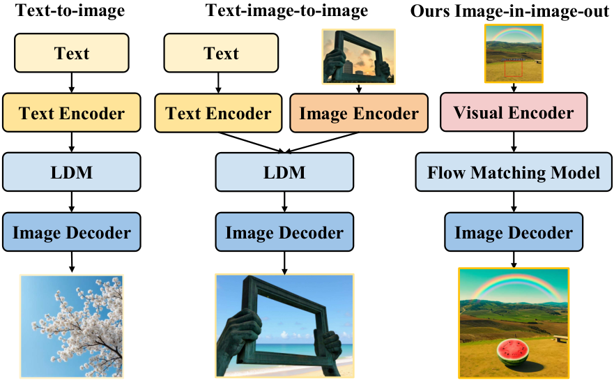
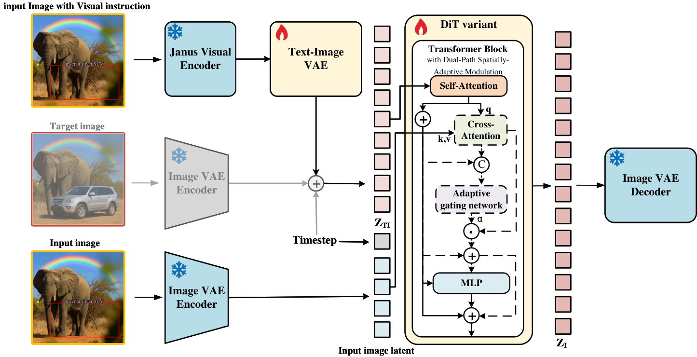
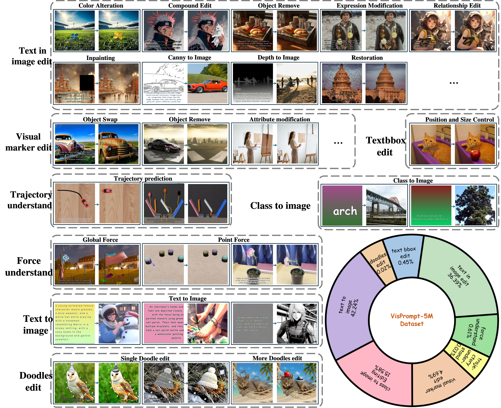

# AI Daily

## FlowInOne：把多模態生成改寫成視覺提示到圖像的單一 Flow

**研究日期：2026-09-16**　　**作者：Manus AI**

## 今日結論

本期選擇 **FlowInOne: Unifying Multimodal Generation as Image-in, Image-out Flow Matching**。它提出一個簡潔但具挑戰性的重新定義：文字描述、空間版面、編輯指令、箭頭、框線與來源圖像，都先被放進同一張「視覺提示畫布」，再由單一 flow-matching 模型把這個輸入圖像狀態連續運輸到目標圖像。模型因此不再以文字編碼器作為中心，也不再為文字到圖像、圖像編輯與物理指令分別設計條件分支。[1] [2]

這個想法的價值不只在於「少一個 text encoder」。更重要的是，它把**語義與空間幾何放進同一種可計算的表示**，使文字中的「把物體放在框內」與圖像中的框線可以在同一個 canvas 上對齊。作者以 500 萬筆 VisPrompt-5M 訓練資料與八類 VP-Bench 評估任務展示這個介面。以四個評估者的總通過率來看，FlowInOne 在 Gemini 3、GPT-5.2、Qwen3.5 與人工評估分別得到 **54.0%、39.2%、50.3% 與 44.9%**；在 GPT-5.2 評估下，略高於論文列出的商用 Nano Banana 39.1%，並明顯高於三個開源基線。[1]

我的判斷是：FlowInOne 是一篇很適合用來激發新研究的工作，但不能把它誤稱為 training-free。它需要 1.2B 級模型、240,000 steps 與約 240 個 A100 GPU-hours 的訓練；真正免除的是推理時的文字條件分支與 diffusion noise schedule，而不是整個學習階段。[1] 它最值得延伸的方向，是將視覺 flow 的速度場再接上 **Energy-Based Transformer 的 compatibility energy、JEPA 的 predictive latent critic、VAR 的 scale-wise state，以及 inference-time attention modulation**。

> **一句話帶走：**FlowInOne 把「多模態條件融合」從跨模態對齊問題，改寫成「在同一個視覺 latent 空間中學習條件畫布到目標圖像的連續運輸」。

## 一、論文基本資訊

| 欄位 | 內容 |
|---|---|
| 論文標題 | *FlowInOne: Unifying Multimodal Generation as Image-in, Image-out Flow Matching* |
| 作者 | Junchao Yi、Rui Zhao、Jiahao Tang、Weixian Lei、Linjie Li、Qisheng Su、Zhengyuan Yang、Lijuan Wang、Xiaofeng Zhu、Alex Jinpeng Wang |
| 研究單位 | University of Electronic Science and Technology of China、National University of Singapore、Central South University、University of Science and Technology of China、Microsoft |
| 發表狀態 | **ECCV 2026 accepted**；arXiv:2604.06757v3，2026-07-28。ECCV 接收資訊由官方程式庫的 release note 標示。[1] [3] |
| 研究任務 | 視覺提示到圖像生成、文字嵌入畫布編輯、文字與 bounding box 編輯、visual marker/doodle 編輯、force 與 trajectory understanding |
| 核心資料 | **VisPrompt-5M**，約 500 萬組視覺提示—目標圖像 pairs；**VP-Bench**，涵蓋八類視覺指令任務。[1] [2] |
| 模型 | 1.2B 級 FlowInOne；以 CrossFlow 權重初始化，視覺輸入使用 Janus-Pro-1B 的 SigLIP-based encoder，圖像端使用凍結 LDM VAE。[1] [4] [6] |
| 官方資源 | [論文首頁](https://csu-jpg.github.io/FlowInOne.github.io/)、[程式碼與模型](https://github.com/CSU-JPG/FlowInOne)、[VisPrompt-5M](https://huggingface.co/datasets/CSU-JPG/VisPrompt5M)、[VP-Bench](https://huggingface.co/datasets/CSU-JPG/VPBench) |

本次選文前已掃描 `KaiCobra/AI_Daily` 的 README、INDEX 與既有論文檔案。EBT、Scalable EBM、JEPA、VAR、training-free flow editing 與 attention modulation 等多個方向已有文章，因此本期排除那些已收錄項目，改選尚未在倉庫中出現的 FlowInOne。這個排除也使本期不只是重述 EBT，而是把 flow matching 與視覺條件介面連接起來。

## 二、為什麼這篇值得讀

### 2.1 它處理的是介面問題，而不只是 backbone 問題

現代文字到圖像模型通常把文字 token 送進 text encoder，再透過 cross-attention 或 multimodal adapter 控制圖像模型。圖像編輯則通常需要額外的來源圖像 encoder、mask、ControlNet-like branch 或 task-specific interface。這些設計各自有效，但也讓「文字描述的空間關係」與「圖像本身的空間特徵」分散在不同表示空間。

FlowInOne 的選擇是把文字直接渲染到輸入畫布。若任務是「在紅框中放一輛車」，紅框、文字與原始圖像都成為一張可被視覺 encoder 讀取的輸入。它不必再問 text encoder 與 image encoder 如何對齊同一個空間關係。這是一個高風險、高回報的取捨：輸入介面變得統一，但模型必須具備足夠的 OCR、版面與視覺推理能力。

*圖 1。論文 Figure 1 的生成範式比較。FlowInOne 將所有條件整合為視覺輸入，圖片取自 arXiv HTML v3，來源與授權見 [1]。*

### 2.2 它把 physics-aware instruction 放進同一個生成框架

VisPrompt-5M 不只包含一般文字到圖像與圖像編輯，還包含力的大小與方向、物體運動軌跡等視覺化指令。這意味著作者不是只想證明「把文字畫進圖片也能生成」，而是想測試同一個 image-in/image-out 模型能否讀取幾何與物理提示，再產生符合指令的圖像結果。

### 2.3 它的 modulation 介面與近期偏好的方向高度相容

FlowInOne 在 editing 任務中不是無條件地把來源圖像特徵加回 Transformer。它用 cross-attention 取得 source structural increment，再透過 token-level adaptive gate 決定每個區域應該保留多少來源結構。這個設計可自然延伸成 energy-based gate、JEPA consistency gate 或完全 inference-time 的 attention modulation。

## 三、核心貢獻與創新點

第一，論文提出 **vision-centric image-in, image-out** 的統一生成範式。文字、版面與編輯指令不再由獨立的文字通道輸入，而是先被轉換成視覺提示。

第二，論文提出 **FlowInOne**。它在共同的 latent space 中學習視覺提示狀態到目標圖像狀態的連續 velocity field，使用同一個 flow-matching 模型處理生成、編輯與視覺指令。

第三，論文建立 **VisPrompt-5M** 與 **VP-Bench**。前者提供跨任務的統一訓練 pair，後者使用 instruction faithfulness、content consistency、visual realism 與 spatial precision 四個維度檢查生成是否真的遵守視覺指令，而不是只計算一般圖像相似度。[1] [2]

第四，論文提出 **Dual-Path Spatially-Adaptive Modulation（Dual-Path SAM）**。純文字生成不啟用來源結構分支；需要保留來源圖像的編輯任務才啟用 cross-attention 與 adaptive gate。模型可以在同一個 backbone 中切換兩種資訊流，而不必把所有來源結構都灌入每個任務。

## 四、方法詳解：從視覺提示到 flow trajectory

### 4.1 Flow matching 的基本設定

Flow matching 將生成視為從 source distribution $p_0$ 到 target distribution $p_1$ 的連續運輸。與把資料逐步加噪、再學習反向去噪的 diffusion 觀點不同，flow matching 直接回歸一條 probability path 上的速度場。[5]

對一組 source latent $z_0$ 與 target latent $z_1$，FlowInOne 使用近似線性的路徑：

$$
 z_t = t z_1 + \left(1-(1-\sigma_{\min})t\right)z_0,
 \qquad t\in[0,1].
$$

其對應的理想速度為

$$
 v_t^\star = \frac{\partial z_t}{\partial t}
 = z_1-(1-\sigma_{\min})z_0.
$$

當 $\sigma_{\min}$ 取接近 0 的簡化設定時，這就是熟悉的 $z_1-z_0$。模型學習時間相依的速度場 $v_\theta(z_t,t)$，以均方誤差回歸理想速度：

$$
\mathcal L_{\mathrm{FM}}
=\mathbb E_{(z_0,z_1),t}
\left[\left\|v_\theta(z_t,t)-(z_1-z_0)\right\|_2^2\right].
$$

推理時不從純 Gaussian noise 開始，而是先建立視覺提示的 source state，再解 ordinary differential equation：

$$
\frac{d z_t}{d t}=v_\theta(z_t,t),
\qquad z_{t=0}=z_0.
$$

最後以圖像 VAE decoder 得到 $\hat I=\mathrm{Dec}_{\mathrm{img}}(z_{t=1})$。因此，FlowInOne 的關鍵不是「用另一個 sampler 取代 diffusion sampler」，而是把 source distribution 本身改成視覺提示 latent。

### 4.2 把文字與幾何統一編碼

令 $I_v$ 表示視覺提示畫布。它可以包含渲染後的文字、來源圖像、bounding box、箭頭、doodle 或其他空間標記。作者使用 Janus-Pro-1B 的視覺 encoder。以 SigLIP Vision Transformer 取得 patch features，再由 MLP 投影到 FlowInOne 的特徵空間：

$$
X_{\mathrm{fuse}}
=\mathrm{MLP}\bigl(\mathrm{SigLIP}(I_v)\bigr)
\in\mathbb R^{N\times D},
$$

其中 $N$ 是 patch/token 數量，$D$ 是目標 embedding 維度。這個序列同時攜帶文字語義與畫布幾何。

接著，Text-Image VAE 將 $X_{\mathrm{fuse}}$ 映射成 source posterior，而不是直接把 encoder feature 當成 deterministic state：

$$
q_\psi(z\mid X)
=\mathcal N\left(\bar\mu_X,\operatorname{diag}(\bar\sigma_X^2)\right),
\qquad
z_0\sim q_\psi(z\mid X).
$$

目標圖像 $I^\star$ 則由凍結的 image VAE 編碼：

$$
z_1=\mathrm{Enc}_{\mathrm{img}}(I^\star).
$$

這裡的 isomorphic latent space 是整個方法成立的必要條件。若 source prompt latent 與 target image latent 的幾何不相容，學到的 velocity field 就可能只是在補償 encoder mismatch，而不是真正學習視覺轉換。

### 4.3 Dual-Path Spatially-Adaptive Modulation

令第 $l$ 層 Transformer 的 hidden state 為 $H^{(l)}\in\mathbb R^{N\times D}$。首先以 self-attention 擷取全局上下文：

$$
\widetilde H^{(l)}
=\mathrm{LayerNorm}\left(
H^{(l)}+\mathcal A_{\mathrm{self}}(H^{(l)})
\right).
$$

如果是純文字到圖像任務，模型不需要保存某一張來源圖像的結構。作者令 editing indicator $\mathbb I_{\mathrm{edit}}=0$，直接跳過來源圖像的 cross-attention。

如果是圖像編輯，先以 image VAE 將來源圖像 $I_{\mathrm{src}}$ 編成 $z_{\mathrm{src}}$，再 reshape 成 reference sequence $S$。接著以當前 hidden state 作 query、來源 sequence 作 key/value：

$$
\Delta H_{\mathrm{struct}}
=\mathrm{Softmax}\left(
\frac{(\widetilde H^{(l)}W_Q)(SW_K)^\top}{\sqrt{d_k}}
\right)SW_V.
$$

這個量可以理解為「來源結構對當前生成狀態的建議增量」。但若把它無條件加入，背景可能過度保留，或被編輯區域拒絕改變。因此作者再以一個輕量 MLP 預測 token-level gate：

$$
\Lambda
=\sigma\left(
\mathrm{MLP}_\theta
\left([\widetilde H^{(l)}\Vert\Delta H_{\mathrm{struct}}]\right)
\right),
\qquad
\Lambda\in[0,1]^N.
$$

最後輸出為

$$
H_{\mathrm{out}}^{(l)}
=\widetilde H^{(l)}
+\mathbb I_{\mathrm{edit}}
\left(\Lambda\odot\Delta H_{\mathrm{struct}}\right).
$$

這個式子清楚表達了兩種任務的差別。文字生成時，$\mathbb I_{\mathrm{edit}}=0$，模型不讓來源結構污染語義 flow。圖像編輯時，$\mathbb I_{\mathrm{edit}}=1$，模型依 token 位置選擇性地加入來源先驗。這正是它與單純 concatenation 或固定 residual injection 的差異。

*圖 2。論文 Figure 3 的圖像資產。圖中藍色雪花表示 frozen component；紅色火焰表示 trainable component。圖片取自 arXiv HTML v3，來源與授權見 [1]。*

### 4.4 完整訓練目標

作者的總目標包含 flow matching、latent regularization 與視覺語義對齊：

$$
\mathcal L
=\mathcal L_{\mathrm{FM}}
+\beta_1\mathcal L_{\mathrm{KLD}}
+\beta_2\mathcal L_{\mathrm{CLIP}}.
$$

其中，$\mathcal L_{\mathrm{FM}}$ 使 latent trajectory 的速度正確；$\mathcal L_{\mathrm{KLD}}$ 將視覺提示 latent 約束在穩定分佈附近，以降低 posterior collapse 或無限制漂移；$\mathcal L_{\mathrm{CLIP}}$ 讓視覺指令 embedding 與目標圖像 embedding 維持語義一致。作者的主要設定是

$$
\beta_1=0.01,\qquad \beta_2=1.
$$

這裡有一個值得注意的研究訊息：FlowInOne 並非只靠 velocity regression 就能得到良好指令遵從。Table 12 顯示，降低 CLIP loss 權重會使 VP-Bench pass rate 從 54.0% 降到約 45%–46%；把 KL 權重提高到 0.1 也會限制 latent 表達能力。這暗示「視覺 flow 的幾何正確」與「指令語義的可辨識」是兩個需要同時校準的目標。

### 4.5 訓練與推理規格

FlowInOne 以 CrossFlow 預訓練權重初始化，在 $256\times256$ resolution、global batch size 512 下訓練 240,000 steps。作者使用 AdamW、base learning rate $10^{-4}$、cosine decay 與 linear warmup。主要 evaluation 使用 CFG 7.0 與 50 sampling steps；10 steps 時 VP-Bench pass rate 只有 25.7%，50 steps 才到 54.0%，所以「不需要 diffusion noise schedule」不等於「只需一步就能生成」。[1] [3]

作者將 FlowInOne 稱為 1.2B model。附錄的 parameter breakdown 顯示，Flow Backbone 有 1,108.40M 個可訓練參數，Text-Image VAE 有 103.65M 個可訓練參數；Visual Encoder 的 322.58M 與 Image VAE 的 83.65M 皆凍結。換句話說，若只計算 trainable components 約為 1.212B；若把 frozen components 也算入執行時 footprint，總參數量會更高。這個區分在比較「參數效率」時不可忽略。

## 五、資料集與評估設計

VisPrompt-5M 將八類輸入—輸出任務放進同一個 image-pair 格式：class-to-image、text-to-image、text-in-image editing、text bounding box editing、visual marker editing、doodles editing、force understanding 與 trajectory understanding。文字指令會被直接畫在輸入 canvas；空間控制則透過 bounding box、箭頭、marker 或 doodle 表達。[1] [2]

*圖 3。論文 Figure 2 的圖像資產。圖片取自 arXiv HTML v3，來源與授權見 [1]。*

資料集中的幾個具體組成值得注意。作者從 text-in-image editing 整理約 1.6M 筆，再加入 PixWizard 的 315K 結構化 pair；text bounding box editing 經過生成與 Qwen3-VL 過濾後保留約 24K；visual marker editing 約 250K；doodles editing 僅保留約 1K 高品質 pair；trajectory data 則包含 Blender-rendered car/ball movement 的人工標註。這種分布說明資料集並非八類平均，而是用大量一般生成與編輯資料提供基礎，再用小型但高約束的物理與幾何資料測試模型是否真正理解空間指令。[1]

VP-Bench 的評估不是單一 FID。每個輸出以 1–5 分檢查 instruction faithfulness、content consistency、visual realism 與 spatial precision；只有同時滿足條件才算 PASS。作者使用 Gemini 3、GPT-5.2、Qwen3.5 與 human judges。為避免 VLM 無法讀出圖片內文字，評估時另外把從 source canvas 擷取出的純文字指令提供給評估者。這使評估較穩定，但也代表 benchmark 並不是完全 image-only 的 judge protocol。[1] [2]

此外，論文報告四個補充指標：CLIP-IQA 衡量整體視覺品質，CLIP Score 衡量文字語義對齊，Directional CLIP Similarity 衡量編輯方向一致性，DINOv3 Similarity 衡量空間與物理結構的 displacement alignment。這組指標比只看 FID 更適合 image-in/image-out 任務，但每一項仍依賴預訓練 encoder 的偏好，不能取代完整的人類判斷。

## 六、實驗結果

### 6.1 VP-Bench 總通過率

| 評估者 | FlowInOne | Nano Banana | OmniGen2 | FLUX.1-Kontext-dev | Qwen-Image-Edit-2509 |
|---|---:|---:|---:|---:|---:|
| Gemini 3 | **54.0%** | 58.9% | 24.8% | 27.1% | 25.8% |
| GPT-5.2 | **39.2%** | 39.1% | 23.1% | 23.7% | 23.1% |
| Qwen3.5 | **50.3%** | 50.8% | 25.1% | 26.9% | 27.8% |
| Human | **44.9%** | 45.9% | 23.3% | 24.0% | 24.3% |

FlowInOne 的主要優勢不是所有任務都得到最高分，而是它在八種任務之間維持較均衡的能力。它在 force understanding、trajectory understanding、text/bbox 與 visual marker 等空間或物理任務中特別有競爭力。相反地，商用 Nano Banana 在純 text-to-image 與 visual realism 上較強，因此在 Gemini、Qwen3.5 與 human 的總分略高。[1]

### 6.2 四個品質維度

FlowInOne 在三個 VLM 上的 spatial precision 分數分別是 Gemini 3 的 **3.42**、GPT-5.2 的 **3.24**、Qwen3.5 的 **3.30**，均高於論文中的開源基線。這與它的輸入設計一致：框線、箭頭與來源圖像並沒有先被壓成一段文字，而是以幾何訊息留在畫布中。

但它的 visual realism 並非最高。以 Gemini 3 為例，Nano Banana 的 realism 是 4.43/5，而 FlowInOne 是 3.12/5；FlowInOne 的優勢主要在 spatial precision，而不是純粹的審美品質。這個 trade-off 很重要，因為它說明「視覺條件統一」改善了可控性，並不自動保證最高的細節品質。

### 6.3 補充定量指標

| 方法 | CLIP-IQA ↑ | CLIP Score Avg. ↑ | Directional CLIP Avg. ↑ | DINOv3 Sim Avg. ↑ |
|---|---:|---:|---:|---:|
| Nano Banana | 0.688 | 0.291 | 0.105 | 0.473 |
| OmniGen2 | 0.603 | 0.191 | 0.003 | 0.125 |
| FLUX.1-Kontext-dev | 0.621 | 0.168 | 0.009 | 0.161 |
| Qwen-Image-Edit-2509 | 0.646 | 0.224 | 0.008 | 0.201 |
| **FlowInOne** | **0.684** | **0.283** | **0.097** | **0.487** |

FlowInOne 的 DINOv3 Similarity 為 **0.487**，略高於 Nano Banana 的 0.473；在 force、trajectory 與 text/bbox 等需要保持空間或物理結構的子任務中，這個優勢更明顯。它的 CLIP-IQA 0.684 也接近 Nano Banana 0.688，顯示視覺提示介面並沒有以非常大的整體畫質損失換取可控性。[1]

### 6.4 消融實驗揭示的真正關鍵

第一，視覺輸入的 compression strategy 很重要。`MLP + truncation` 的平均 pass rate 是 16.9%，`VAE expansion` 是 15.7%，而同時對 sequence length 與 feature dimension 做 MLP projection 的 `MLP + MLP` 提升到 18.2%。簡單截斷會丟掉邊界資訊；只增加 VAE layer 則提高優化難度。

第二，cross-attention 與 adaptive gating 需要一起看。只有 self-attention 的 `Wo CA` 平均 pass rate 是 18.2%；加入 dual-path cross-attention 後為 21.4%；完整 Dual-Path SAM 達 23.1%。這支持「來源結構不是越多越好，而是要在空間上選擇性注入」的設計。

第三，joint training 明顯優於 two-stage training。兩階段設定為 29.1%，把五百萬資料混合訓練則達 47.8%。作者將差距歸因於 two-stage training 的 catastrophic forgetting。從研究角度看，這也表示不同任務之間不是單純共享一個 encoder 而已；它們必須在同一個 flow space 中共同塑造語義、幾何與物理先驗。

第四，sampling budget 對指令遵從有實際影響。CFG 7.0 與 50 steps 是主要設定，CFG 過低或過高都會退化；10 steps 的 pass rate 為 25.7%，20、30、40、50 steps 逐步升至 40.3%、46.3%、48.7%、54.0%。因此，FlowInOne 的「無 noise schedule」應理解為不使用傳統 diffusion 的加噪時間表，不應理解成可以忽略 ODE integration 的數值成本。

## 七、與相關研究的關係

### 7.1 Flow Matching：從 noise-to-image 改成 prompt-to-image

原始 Flow Matching 的重要貢獻，是直接回歸固定 conditional probability path 的 vector field，而不需要在訓練時反覆模擬 CNF ODE。它允許更一般的 source distribution，並展示 optimal-transport path 對訓練與取樣效率的好處。[5] FlowInOne 把這個自由度推到更直接的形式：source 不是 Gaussian noise，而是由視覺提示得到的 latent distribution。

### 7.2 CrossFlow：FlowInOne 的直接前身

CrossFlow 先提出跨模態 flow matching：如果 source distribution 不必是 noise，就可以直接學習 modality-to-modality mapping，並以 Variational Encoder 讓不同模態的 latent 更容易對齊。[4] FlowInOne 延續這條路線，但把「文字、圖像、版面與指令」先轉成 visual prompt，因此進一步將跨模態 mapping 改寫成 single-modality visual evolution。

### 7.3 Janus-Pro：視覺 encoder 的能力與限制

FlowInOne 使用 Janus-Pro-1B 的 SigLIP-based visual encoder 作為視覺提示的入口。Janus-Pro 的重要設計是將理解與生成的 visual encoding 解耦，並以不同的資料與模型規模提升多模態理解及視覺生成。[6] FlowInOne 借用它的視覺語義能力，但把輸出轉送到自己的 Text-Image VAE 與 flow backbone。這也帶來新的瓶頸：若輸入文字被縮小、渲染品質不穩或畫布解析度固定，FlowInOne 仍會受限於 encoder 的 OCR 與空間表徵能力。

### 7.4 與 EBT、JEPA、VAR 的互補關係

FlowInOne 本身不是 Energy-Based Transformer、JEPA 或 VAR。它沒有以 energy landscape 作為 verifier，也沒有用 joint-embedding predictive loss 學 world model dynamics，更沒有以 next-scale token prediction 作為自迴歸生成核心。它真正提供的是一個**視覺條件 state 與連續 transport interface**，因此很適合被其他方法接在上面。

對 EBT 而言，可以把 flow backbone 在時間 $t$ 的 hidden state 與來源提示組成 compatibility energy $E_\phi(H_t,I_v,I^\star)$，用 $-\nabla_{H_t}E_\phi$ 作為額外 refinement direction。對 JEPA 而言，可以在每個 flow time 預測未來 visual latent，並以 target encoder 的 embedding consistency 約束 trajectory。對 VAR 而言，可以把視覺提示畫布先轉成 coarse scale 的 token map，再以 scale-wise flow 逐步補充 fine-scale token。這三個方向都能直接利用 FlowInOne 已經存在的 source latent、target latent 與 token-level gate。

## 八、我的評價與研究啟發

### 8.1 最有價值的洞見

我認為論文最有價值的不是宣稱「文字也可以畫成圖片」，而是它將條件控制的抽象單位改成了**visual prompt state**。一旦所有條件都在同一個 canvas，模型可以用同一組 spatial token 表示語義與位置，並把 editing 變成 source latent 到 target latent 的局部 transport。這比為每一種控制方式再增加一個 adapter 更容易形成統一的研究語言。

第二個洞見是 Dual-Path SAM 的 gating 位置。它不是在輸入端做一次全局融合，而是在 Transformer block 內根據當前 hidden state 與 source structural increment 決定保留或重建。這個位置很適合引入不確定性估計：背景區域可以要求高一致性，編輯區域可以允許較大的 velocity deviation。

### 8.2 需要保守解讀的地方

首先，論文的「vision-centric」不是完全不使用文字。文字要先被渲染到 canvas；評估時又把 OCR/提取出的文字額外提供給 VLM judge。這個設計有助於穩定評估，但不能把它解讀成模型已經完全解決了自然語言理解。

其次，對開源與商用模型的比較仍可能受到介面差異影響。作者為 baseline 使用其 native interface，再以 Qwen3-VL 擴寫指令；FlowInOne 則直接接收視覺提示 canvas。這比較了「整體系統在各自最佳介面下的結果」，不等同於所有模型在完全相同 input budget 下的純 backbone 對照。

最後，模型目前固定輸出 $256\times256$、主要是 single-turn instruction execution，且 human evaluation 只抽樣 250 組。它能否在高解析度、多輪編輯、長鏈物理互動與未見畫布格式上維持優勢，仍然需要新的 protocol。

### 8.3 可直接延伸的四個研究題目

**Energy-Gated Flow Matching。** 令 $E_\phi(H_t,I_v)$ 表示 source/target compatibility，讓速度場變成

$$
\widetilde v_\theta(H_t,t)
=v_\theta(H_t,t)-\lambda_t\nabla_{H_t}E_\phi(H_t,I_v).
$$

如果 $E_\phi$ 能學到背景一致性與編輯可行性的 trade-off，就可以把 Dual-Path SAM 的 learned gate 轉成具有 verifier 意義的 gate，並測試 inference-time extra refinement 是否能改善 hard cases。

**JEPA-Critic Flow。** 以 frozen target encoder $g$ 將 flow trajectory 的中間輸出與 target image 映射到 latent：

$$
\mathcal L_{\mathrm{JEPA}}
=\left\|p_\eta(g(\hat I_t),t)-\operatorname{sg}(g(I^\star))\right\|_2^2.
$$

這可以約束中間 state 先對齊語義與幾何，再完成像素細節，而不是只依賴 endpoint CLIP loss。對 trajectory/force subset，還可以加入 temporal latent consistency。

**Scale-wise Visual Flow for VAR。** 將 visual prompt canvas 先編成 coarse token map $r_1$，再學習

$$
 p(r_{k+1}\mid r_{\le k},I_v)
$$

的 flow-based residual，而不是直接在每一尺度做 categorical next-token sampling。這可能把 VAR 的快速 scale-wise decoding 與 FlowInOne 的 continuous transport 結合，同時保留 coarse layout 與 fine texture 的可控性。

**Training-free Attention Approximation。** 在 frozen DiT 上，用 source image 與當前 hidden state 的 attention entropy、cosine displacement 或 low-rank structural residual 建立近似 gate $\widehat\Lambda_t$，不訓練新的 backbone。這不會完全重現 FlowInOne 的 learned gate，但可測試「哪些 spatial modulation 真的來自 source-target geometry，而不是訓練資料記憶」。

## 九、總結

FlowInOne 的核心主張可以濃縮成一個函數：

$$
\text{visual prompt canvas}
\xrightarrow[
\text{Dual-Path SAM}
]{\text{Flow Matching}}
\text{target image}.
$$

它用 source-conditioned flow 取代傳統 noise-conditioned generation，用 visual prompt 取代分散的 text/image/control branches，再用 token-level gate 平衡來源結構與新指令。實驗顯示，這個介面特別有利於 spatial precision、force/trajectory understanding 與跨任務統一；但它仍受限於 $256\times256$ resolution、1.2B 模型規模、single-turn protocol、VLM 評估偏差與高額訓練成本。

對後續研究而言，最值得追問的不是「視覺提示是否能取代文字」，而是：**一個視覺 latent trajectory 是否能同時被 energy verifier、JEPA predictor 與 VAR scale planner 讀取？** 若答案是肯定的，FlowInOne 可以成為把生成、理解、編輯與推理放進同一個 state space 的實驗基礎。

## References

[1]: https://arxiv.org/html/2604.06757v3 "FlowInOne: Unifying Multimodal Generation as Image-in, Image-out Flow Matching"
[2]: https://csu-jpg.github.io/FlowInOne.github.io/ "FlowInOne official project page"
[3]: https://github.com/CSU-JPG/FlowInOne "FlowInOne official code repository"
[4]: https://arxiv.org/abs/2412.15213 "CrossFlow: A Noise-Free Framework for Cross-Modality Evolution"
[5]: https://arxiv.org/abs/2210.02747 "Flow Matching for Generative Modeling"
[6]: https://arxiv.org/html/2501.17811v1 "Janus-Pro: Unified Multimodal Understanding and Generation with Data and Model Scaling"

> **圖片授權與來源說明：** 本文中的 `flowinone_architecture.png` 與 `flowinone_dataset.png` 是由論文 arXiv HTML v3 的原始圖像資產保存到本倉庫 `asset/FlowInOne/`。使用時請保留論文來源與 arXiv 頁面所示的 CC BY-NC-ND 4.0 授權條件。[1]
