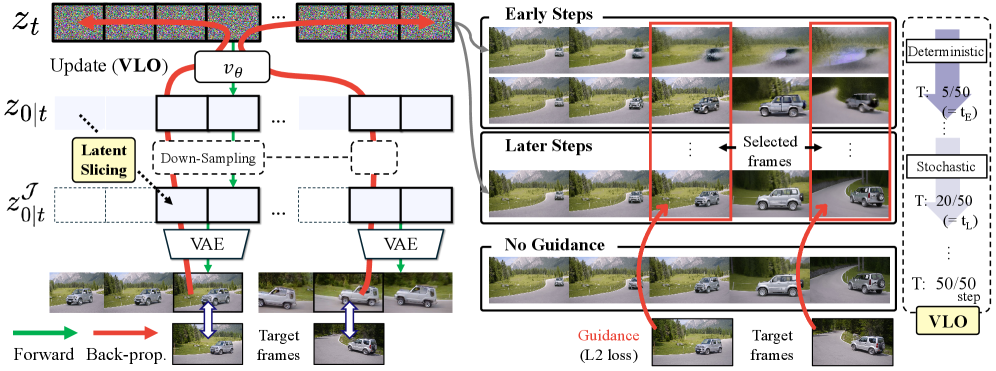
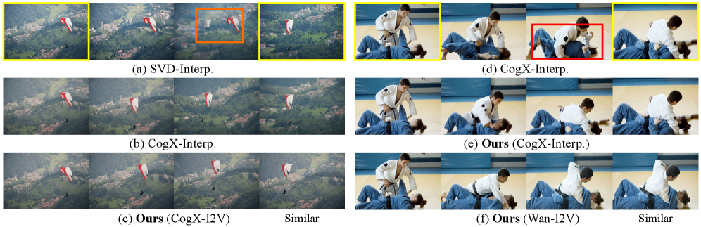
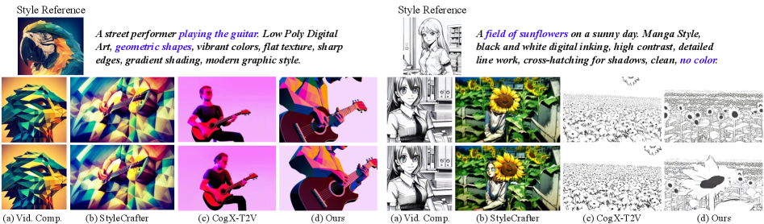
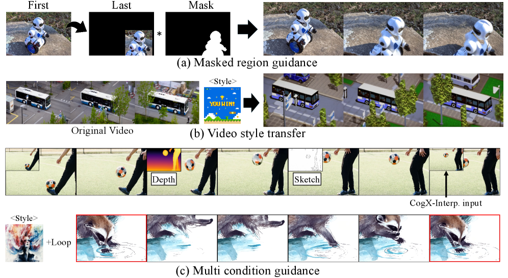

# AI Daily

## 2026-09-29 — Frame Guidance：不用重新訓練，讓少數關鍵影格控制整段影片

> **今日一句話：** Frame Guidance 把 training-free video control 寫成「在少數 frame 上定義條件 loss，然後沿著 denoising network 對整個 video latent 反向傳播」；它再用 **latent slicing** 把 CausalVAE 的記憶體成本最高降低約 15×、搭配 2× 空間下採樣最高降低約 60×，並以 **Video Latent Optimization（VLO）** 在早期 deterministic、後期 stochastic 的分段更新，讓 keyframe、style、depth、sketch、color block 與 loop 條件能在不更新 backbone 權重的情況下影響整段影片。[1]

*圖 1。論文 Figure 3 的局部圖像；紅色路徑表示 guidance loss 對 latent 的反向傳播，右側展示早期 deterministic 與後期 stochastic 的 VLO。這張圖只截取方法圖，不是整頁畫面。[1]*

## 一、論文基本資料

| 項目 | 內容 |
|---|---|
| 論文標題 | *Frame Guidance: Training-Free Guidance for Frame-Level Control in Video Diffusion Models* |
| 作者 | Sangwon Jang、Taekyung Ki、Jaehyeong Jo、Jaehong Yoon、Soo Ye Kim、Zhe Lin、Sung Ju Hwang；Jang 與 Ki equal contribution |
| 研究單位 | KAIST、NTU Singapore、Adobe Research、DeepAuto.ai |
| 發表狀態 | **ICLR 2026 conference paper**；arXiv:2506.07177，v2 於 2026-03-03 更新 |
| 研究領域 | training-free video generation、diffusion/flow matching、frame-level control、latent optimization、video guidance |
| 支援模型 | CogVideoX、CogVideoX-Interpolation、Wan-14B；附加實驗涵蓋 SVD 與 LTX-2B |
| 官方實作 | `agwmon/frame-guidance`，提供 CogVideoX 與 Wan 的 keyframe、style、loop 等 notebook |
| 評估任務 | keyframe-guided generation、stylized video、looped video、masked region、depth/sketch、color block、多條件控制 |

作者的選擇很切合近期影片生成的實際瓶頸：大模型本身已經能產生不錯的影片，但「想讓某一個中間 frame 長什麼樣子」通常需要為每一種控制訊號重新訓練 adapter、control model 或 interpolation model。Frame Guidance 的主張不是再訓練一個更大的 backbone，而是把已訓練好的 video diffusion model 當成可微分的 video prior，對選定 frame 做推理時的 latent optimization。[1] [2]

本篇在研究前已與 `KaiCobra/AI_Daily` 的既有文章與 arXiv ID 比對；repo 中沒有 `Frame Guidance`、`2506.07177` 或同一方法的明顯變體。它與既有的 ReaDiT、GATO-Vid、OAVC、RefineEdit 等 training-free 文章不同：Frame Guidance 的核心單位是 **video frame + denoising-network gradient propagation + VLO stage schedule**，不是 DiT attention logit 的閉式調制、flow residual projection 或單張圖片的 refinement。

## 二、為什麼今天選它

### 2.1 它把「frame-level condition」變成通用介面

作者沒有為 keyframe、style、depth、sketch、loop 各自設計一個模型。只要能寫出一個可微分的 frame-level loss，就能把條件接到同一個 sampling loop：

- RGB keyframe：用像素級 $L_2$ 對齊指定 frame。
- Style reference：用 style encoder 的 cosine similarity 對齊風格。
- Loop：讓第一與最後 frame 接近。
- Depth 或 sketch：先由可微 encoder 取得結構特徵，再做 feature-level $L_2$。
- Mask 或 color block：只在指定區域或粗略編輯區域計算 loss。

這個介面比「訓練一個支援某種 condition 的專用控制器」更有可組合性。多條件控制也只是把多個 loss 合併，而不必修改 backbone 或重新建立資料集。[1]

### 2.2 真正的難題不是 loss，而是 video latent 的計算圖

在 image diffusion 中，做一次 guidance gradient 已經昂貴；在 video diffusion 中，如果要保留從選定 frame 回到完整 video latent 的梯度鏈，CausalVAE 與 denoising network 會同時放大顯存需求。論文報告：即使使用 gradient checkpointing，完整 latent sequence 的 guidance memory 仍可能超過 650 GB。[1]

Frame Guidance 因此先研究 CausalVAE 的 **temporal locality**。把真實影片的一個 frame 替換成黑 frame，再比較原影片與修改影片的 latent 差異，作者發現改動主要影響少數相鄰 latent，而不是整條時間序列。這使得「為了重建第 $i$ 個 frame，不必解碼整個 video latent」成為可行假設。[1]

### 2.3 VLO 把影片控制與圖片控制區分開

直接把 image guidance 常用的 time-travel trick 搬到影片，早期的 noise scale 可能太大，讓 guidance 幾乎無法參與布局形成；到了後期才修正單一 frame，整段影片的 camera motion 或物件路徑卻已經固定。

VLO 的核心判斷是：

1. **早期 step 決定低頻布局與跨 frame 關係**，應用 deterministic update 保留 guidance 方向。
2. **中期 step 需要降低累積誤差與過度約束**，再引入 stochastic/time-travel update。
3. **後期只做必要的細節修整**，避免在已成形的影片中反覆破壞 temporal consistency。

這個 stage-aware schedule 是本文最值得移植到其他生成器的想法。它並非單純把 guidance strength 調大，而是把「何時 deterministic、何時 stochastic」視為生成階段的一部分。[1]

## 三、研究背景與相關工作

### 3.1 從 image training-free guidance 到 video guidance

早期的 FreeDoM 以預訓練模型建立外部 energy，利用 loss gradient 在不重新訓練 diffusion backbone 的情況下施加條件；Universal Guidance 則把多種 guidance modality 統一成對 noisy latent 的推理時更新。[4] [5] 這類方法啟發了 Frame Guidance 的基本形式，但影片多了一個關鍵限制：一個 frame 的條件必須透過 temporal prior 傳給其他 frame，而不是只改善一張獨立圖片。

後續工作進一步研究 training-free loss-based guidance 的有效條件與失敗模式。Frame Guidance 沿用「對 clean estimate 計算 loss，再對 noisy latent 求梯度」的套路，卻指出 video 必須保留經過 denoising network 的梯度路徑；如果採用 shortcut，雖然可以省記憶體，但 guidance 可能只改動被選中的 frame，導致前後 frame 斷裂。[1] [6]

### 3.2 與 training-required video control 的差異

VideoComposer、StyleCrafter、keyframe interpolation 與 motion-control 類方法通常在特定資料、解析度或 frame count 上 fine-tune。它們在固定任務上可以很強，但每次 backbone 或條件類型改變，往往要重新建立訓練流程。Frame Guidance 的取捨相反：它不更新模型權重，換取每張影片在推理時要做額外 backward 與多次 prediction。[1]

因此本文不應被理解成「全面取代 control adapter」。若目標是固定條件、超大量生成、或極低 latency，訓練式控制器可能更實際；若目標是快速探索新條件、組合多種輸入、或在新 released backbone 上立即試驗，Frame Guidance 更有研究價值。

### 3.3 它與使用者偏好的幾條路線如何接上

- **Energy-based Transformer：** Frame Guidance 的 guidance loss 可以被視為 frame-conditioned energy，但論文本身沒有學一個 normalized energy model，也沒有用 energy-based Transformer 取代 denoiser。
- **JEPA：** 目前主要用 RGB 或外部 encoder loss；可以把 predicted future/frame representation 的一致性加入 guidance，使條件不只對像素，也對可預測的 temporal latent 結構負責。
- **VAR：** 本文的 frame index 是時間維度上的稀疏介入點；對 visual autoregressive generator，類似概念可以改成 coarse-to-fine scale 的稀疏 token intervention。
- **training-free / zero-shot：** 它是 frozen-backbone、無 task-specific fine-tuning，但不是零計算、零資料或零優化。每個 sample 仍要做 guidance backward，並依賴外部 style/depth/sketch encoder。

## 四、核心方法詳解

### 4.1 Video diffusion 的 clean estimate

令 $x_0$ 是影片，經 encoder 得到 latent $z_0$。在 diffusion notation 下，forward noising 為：

$$
 z_t=\sqrt{\bar\alpha_t}\,z_0+\sqrt{1-\bar\alpha_t}\,\epsilon,
 \qquad \epsilon\sim\mathcal N(0,I).
$$

若 denoiser 預測 velocity-like quantity $v_\theta(z_t,t)$，則由 Tweedie-style clean estimate 得到：

$$
 z_{0|t}
 =\mathbb E[z_0\mid z_t]
 =\sqrt{\bar\alpha_t}\,z_t
 -\sqrt{1-\bar\alpha_t}\,v_\theta(z_t,t).
$$

將它送入 video decoder $\mathcal D$：

$$
 x_{0|t}=\mathcal D(z_{0|t}).
$$

Frame-level guidance 不直接對最終 sample 做一次性修圖，而是在每個 guided denoising step 對 $x_{0|t}$ 計算條件 loss，再把梯度回傳到當前 noisy latent $z_t$。[1]

### 4.2 Latent slicing：只解碼與 selected frame 對應的短 temporal window

令要控制的 frame index 集合為 $\mathcal I$，由 video encoder 的 temporal compression mapping 找到對應 latent index 集合 $\mathcal J$。對於每個 selected frame，Frame Guidance 只取約 3 個相鄰 temporal latent：

$$
 z^{\mathcal J}_{0|t}
 =\operatorname{Slice}(z_{0|t},\mathcal J),
 \qquad
 x_{0|t}^{\mathcal I}=\mathcal D(z^{\mathcal J}_{0|t}).
$$

實驗的核心觀察是，3-length latent 在重建目標 frame 時已接近 full-sequence decoding；2-length 會出現輕微退化，因此主實驗採用 3-length。這不是把其他 latent 丟掉後宣稱能完整重建影片，而是只在計算 selected frame 的 guidance loss 時使用局部解碼。[1]

此外，latent 在送入 decoder 前可做 2× 空間下採樣。論文報告：

- full latent sequence 的 gradient guidance memory 可能超過 650 GB；
- latent slicing 單獨最高約降低 15×；
- latent slicing 加 2× spatial down-sampling 最高約降低 60×；
- CogVideoX-I2V 實測下，1 個 guided RGB frame 的 peak memory 為 24.75 GB；增加到 2 個與 4 個 frame 時，額外約增加 1.48 GB 與 4.46 GB；Depth loss 則為 26.00 GB，額外約增加 2.05 GB 與 6.15 GB。[1]

### 4.3 VLO：用分階段 latent update 取代固定一種 guidance rule

先定義 selected frame 的 guidance loss：

$$
 g_t=\nabla_{z_t}
 \mathcal L_e\left(x_{0|t}^{\mathcal I},c_{\mathrm{frames}}\right).
$$

在早期布局階段，VLO 使用 deterministic update：

$$
 z_t\leftarrow z_t-\eta g_t,
 \qquad t>t_E.
$$

其中 $\eta$ 是 guidance step size。到了後期但仍在 guidance range 內，VLO 使用 time-travel-style stochastic update：先依目前 denoiser 結果做一步 denoise，再重新引入 noise，並同時套用 guidance gradient。抽象地寫成：

$$
 z_t\leftarrow
 \operatorname{TimeTravel}(z_t,z_{0|t},g_t),
 \qquad t_E\ge t>t_L.
$$

每個 denoising step 內可重複 $M$ 次 latent optimization；完成後才進行下一步 DDIM 或 flow-matching solver update。這個 schedule 的目的不是讓整個 sampling 都更強，而是把 early layout formation 與 later detail refinement 分開。

在 CogVideoX keyframe 實驗，作者以單張 H100 執行，layout stage 約為前 5 個 inference steps，$M=10$、$\eta=3.0$，time-travel 再跨約 15 steps；Wan-14B 的 flow-matching layout 主要形成於前 2 steps。為了維持可用性，作者限制 guidance steps，使總 runtime 不超過 base model 約 4×。[1]

### 4.4 為什麼 gradient 必須穿過 denoising network

如果只在 VAE decoder 後對 selected frame 做 shortcut update，gradient 主要停留在該 frame 的 latent，無法充分使用 denoising network 裡的 temporal prior。Frame Guidance 反而保留：

$$
\frac{\partial \mathcal L_e}{\partial z_t}
 =
\frac{\partial \mathcal L_e}{\partial x_{0|t}^{\mathcal I}}
\frac{\partial x_{0|t}^{\mathcal I}}{\partial z_{0|t}}
\frac{\partial z_{0|t}}{\partial z_t},
$$

其中 $z_{0|t}$ 的計算包含 $v_\theta(z_t,t)$。因此，selected frame 的 loss 可以經過 denoiser 的時空 mixing 影響其他 frame latent。這也解釋了為什麼 latent slicing 並不等於「只控制局部」：**decoder 只對 selected frame 做局部計算，但 gradient 仍從 denoising network 回到整段 video latent。**[1]

### 4.5 四種代表性 guidance loss

**Keyframe：** 對目標 frame $x_*^i$ 與 clean estimate 做像素級對齊：

$$
\mathcal L_{\mathrm{key}}
 =\sum_{i\in\mathcal I}
 \left\|x_*^i-x_{0|t}^i\right\|_2^2.
$$

**Style：** 使用可微 style encoder $\Psi$，讓 selected frame 的 style embedding 靠近 reference：

$$
\mathcal L_{\mathrm{style}}
 =-\sum_{i\in\mathcal I}
 \cos\left(\Psi(x_{\mathrm{style}}),\Psi(x_{0|t}^i)\right).
$$

**Loop：** 讓第一與最後 frame 對齊，且不需要額外的 external condition：

$$
\mathcal L_{\mathrm{loop}}
 =\left\|x_{0|t}^{1}-x_{0|t}^{L}\right\|_2^2.
$$

**Depth / sketch / 結構條件：** 以 encoder $\Psi$ 將目標 condition 與 clean estimate 映射到同一特徵空間：

$$
\mathcal L_{\mathrm{feat}}
 =\sum_{i\in\mathcal I}
 \left\|\Psi(x_*^i)-\Psi(x_{0|t}^i)\right\|_2^2.
$$

這裡的關鍵不是某一個固定 loss，而是「只要 condition 可以產生可微或可比較的 frame-level score，就可以接進同一個 VLO loop」。

## 五、實驗結果與性能指標

### 5.1 Keyframe-guided video generation

作者使用 40 段至少 81 frames 的 DAVIS 影片，以及 30 段更動態、更偏真人場景的 Pexels 影片。主要比較包含 CogVideoX-I2V、Wan-14B-I2V、SVD-Interp.、CogVideoX-Interp. 與 Frame Guidance。[1]

| 方法 | Backbone / input | DAVIS FID ↓ | DAVIS FVD ↓ | Pexels FID ↓ | Pexels FVD ↓ |
|---|---|---:|---:|---:|---:|
| CogX-I2V | base I2V | 60.36 | 890.1 | 74.98 | 1122.6 |
| Wan-14B-I2V | base I2V | 59.04 | 772.8 | 73.03 | 1033.3 |
| TRF | training-free interpolation | 62.07 | 923.1 | 79.03 | 1106.2 |
| Ours (CogX), initial + final | training-free | 57.62 | 613.4 | 68.54 | 1027.3 |
| **Ours (CogX), initial + middle + final** | **training-free** | **55.60** | **577.1** | 68.97 | 989.3 |
| Ours (Wan-14B), initial + middle + final | training-free | 57.68 | 761.1 | 71.63 | **904.8** |
| CogX-Interp. | fine-tuned interpolation | 46.59 | 506.0 | 58.73 | 1081.5 |
| **Ours (CogX-Interp.)** | **training-free guidance on fine-tuned backbone** | **37.95** | **420.3** | **47.86** | **723.26** |

Frame Guidance 在 base I2V model 上明顯改善 training-free baseline；再套用到 CogX-Interp. 時，則進一步把該 fine-tuned backbone 的結果推高。論文的 qualitative comparison 顯示，selected frames 更接近 keyframes，同時中間 transition 比單純逐段 interpolation 更自然。[1]

*圖 2。論文 Figure 5 的局部圖像。下排的 Ours (CogX-I2V) 與 Ours (Wan-I2V) 仍保持連續運動，上排 baseline 可看到 frame disconnection 或 dynamic motion failure。[1]*

需要保留一個重要評估 caveat：論文在附錄指出，不同模型的 resolution、FPS 與 reference video 調整方式不同，因此 FID/FVD 的跨模型比較並非完全嚴格；數字適合解讀為同一 protocol 下的相對訊號，而不是所有模型可直接放在同一尺度排序。[1]

### 5.2 Human evaluation 與 stylized video

Keyframe human evaluation 有 20 位參與者，評估 5 種方法產生的影片，分別對 video quality 與 keyframe similarity 以 1–5 分評分。論文圖表中，Frame Guidance on Wan 的 quality 得分高於 CogX-Interp.；Frame Guidance on CogX-Interp. 則在 keyframe similarity 與 quality 之間取得更好的平衡。[1]

在 stylized video task，作者以 6 張 style reference images、每張 9 個 content prompts 評估文字對齊、style 對齊與 motion。主要數值如下：

| 方法 | CLIP-T ↑ | ViCLIP-T ↑ | CLIP-S ↑ | ViCLIP-S ↑ |
|---|---:|---:|---:|---:|
| VideoComposer | 0.211 | 0.137 | **0.869** | 0.219 |
| StyleCrafter | 0.207 | 0.273 | 0.635 | 0.157 |
| CogX-T2V | 0.220 | 0.259 | 0.588 | 0.139 |
| **Ours** | **0.224** | **0.285** | 0.624 | **0.185** |

Frame Guidance 在 CLIP-T、ViCLIP-T、ViCLIP-S 取得最高值；CLIP-S 略低於 StyleCrafter。這個結果很有意義，因為它顯示 guidance 不只是把 style reference 複製到畫面，而是同時維持文字內容與 motion。作者也提醒，VideoComposer 的高 CLIP-S 部分來自複製 style image，不能單看單一 style metric 判斷結果較好。[1]

*圖 3。論文 Figure 7 的局部圖像；Frame Guidance 在不訓練 style adapter 的情況下，仍能在不同 content prompt 中保持 style reference 的視覺語彙。[1]*

### 5.3 Loop、depth、sketch 與多條件控制

除了 keyframe 與 style，論文還展示以下應用：

- **Loop：** 只用 text prompt，最小化首尾 frame 差異，生成可循環影片。
- **Color block：** 使用者在 frame 上畫出粗略顏色或細節提示，模型沿著粗條件自然補全內容。
- **Masked region：** 以 binary mask 只控制物件區域，讓背景保持穩定、物件產生平滑移動。
- **Depth / sketch：** 用 depth map 或 sketch 作為 frame-level structural condition。
- **Multi-condition：** 直接合併 depth + sketch，或 style + loop loss。

*圖 4。論文 Figure 9 的局部圖像。作者將多種條件視為可組合的 frame-level loss，而不是為每一種輸入各訓練一個模型。[1]*

### 5.4 VLO ablation

VLO 的必要性由以下 ablation 支持：

| 更新策略 | FID ↓ | FVD ↓ |
|---|---:|---:|
| Time-travel only | 57.37 | 778.4 |
| Deterministic only | 56.61 | 637.3 |
| **VLO：early deterministic + later stochastic** | **55.60** | **577.1** |

只有 time-travel 時，早期布局受 stochasticity 影響，FVD 較差；只有 deterministic update 時，後期容易出現過飽和或 temporal disconnection。混合式 VLO 的結果同時保留早期布局控制與後期誤差修正。[1]

作者在附錄以低頻 layout stabilization 判斷 $t_E$，並在 20 段 DAVIS 影片上做 $t_E$ ablation；最佳點約為第 6 個 step，附近值仍相對穩健。$t_L$ 則主要控制額外推理時間，實務上限制在 base inference 約 4× 以內。[1]

## 六、相關研究分析與可延伸的新想法

### 6.1 Energy-based Transformer：把 frame loss 變成可校準的 compatibility energy

Frame Guidance 的每一個 guidance loss 都可以抽象成條件 energy：

$$
E_{\mathrm{frame}}(z_t;c,\mathcal I)
 =\mathcal L_e\left(
 \mathcal D(\operatorname{Slice}(z_{0|t},\mathcal J)),
 c_{\mathrm{frames}}
 \right).
$$

目前模型只使用其梯度：

$$
 z_t\leftarrow z_t-\eta\nabla_{z_t}E_{\mathrm{frame}}.
$$

但它沒有回答三個 EBM 會關心的問題：energy 是否跨 timestep 可比較？不同條件的 energy 是否 calibrated？低 energy 是否真的代表 temporal consistency 更好？一個值得做的 **Energy-Gated VLO** 可以再加入：

1. 用一個 frozen 或輕量 trainable energy head 預測 frame condition、temporal smoothness 與 base-model prior 的聯合分數。
2. 以 energy disagreement 決定哪些 frame、哪個 denoising step 需要 backward。
3. 在 energy 已經穩定時停止 guidance，避免無效的後期 optimization。
4. 用 negative sampling 或 contrastive energy calibration，測試錯誤 keyframe、錯誤 style 與 OOD condition 的能量排序。

這樣的方向不應只把 loss 改名為 energy；真正的問題是能否用 energy 做 **adaptive compute、reranking 與 uncertainty**。

### 6.2 JEPA：從 pixel alignment 推進到 predictive-frame alignment

Frame Guidance 的 keyframe loss 是 pixel $L_2$，容易受亮度、紋理與小位移影響。可以加入 JEPA-style predictive target：令 $\phi$ 是 frozen visual encoder，$p_\psi$ 預測 selected frame 的 future/semantic representation，則：

$$
\mathcal L_{\mathrm{JEPA-guide}}
 =\left
 \|p_\psi\big(\phi(x_{0|t}^{\mathcal I}),\Delta t\big)
 -\operatorname{sg}\big(\phi(x_*^{\mathcal I+\Delta t})\big)
 \right\|_2^2.
$$

一個更完整的 hybrid objective 可以是：

$$
\mathcal L_{\mathrm{total}}
 =\lambda_{\mathrm{rgb}}\mathcal L_{\mathrm{key}}
 +\lambda_{\mathrm{pred}}\mathcal L_{\mathrm{JEPA-guide}}
 +\lambda_{\mathrm{temp}}\mathcal L_{\mathrm{temporal}}.
$$

其中 $\mathcal L_{\mathrm{temporal}}$ 可以約束相鄰 selected/unselected frame 的 representation velocity。這會把控制目標從「某一幀像不像 reference」改成「影片的可預測 latent trajectory 是否朝向 reference」。對快速運動、遮擋或 style transfer，這可能比純 pixel loss 更穩健。

### 6.3 VAR：把 frame-sparse guidance 改成 scale-sparse token guidance

VAR 的 coarse-to-fine 生成有天然的 stage 結構：早期 scale 決定 layout，後期 scale 負責細節。Frame Guidance 的 VLO 可以移植成 **scale-wise latent guidance**：

$$
E_\ell(r_\ell;c)
 =E_{\mathrm{attribute}}(r_\ell,c)
 +E_{\mathrm{layout}}(r_\ell,c)
 +E_{\mathrm{identity}}(r_\ell,c),
$$

再只在 energy disagreement 高的 scale $\ell$ 做 gradient intervention：

$$
 r_\ell\leftarrow r_\ell-
 \eta_\ell\nabla_{r_\ell}E_\ell.
$$

這裡的研究問題是：

- coarse scale 的 attention map 是否足以傳播到後續 fine scales？
- 哪些 token 應該像 Frame Guidance 的 selected frames 一樣被稀疏介入？
- per-token gradient normalization 是否能避免高解析度 scale 的 signal 被平均掉？
- autoregressive cache 被多次 backward 讀取與還原時，如何保證 cache-safe intervention？

這會形成一條很直接的 **JEPA predictive critic × VAR scale-wise control × Energy-Gated sampling** 路線。

### 6.4 Training-free 與 zero-shot 必須拆成可驗證的定義

本文稱 training-free，是指不為新條件重新 fine-tune video backbone；但它仍需要：

- 每個 sample 的多次 denoiser forward；
- 對 noisy latent 的 backward；
- 可能的 style、depth 或 sketch encoder；
- guidance step、step size 與 $t_E/t_L$ 的任務設定。

因此後續研究應至少分開報告：

1. 是否更新 backbone 權重；
2. 是否需要 per-sample optimization；
3. 是否使用 external encoder 或 verifier；
4. 額外 forward/backward 次數與 wall-clock；
5. 是否跨 backbone、跨 condition、跨 resolution；
6. guidance 失敗時是否能自動停止或 fallback。

若只寫「frozen backbone = zero-shot」，很容易把低訓練成本誤讀成低推理成本，也無法公平比較 training-free 方法之間的實際使用門檻。

## 七、限制與批判性評估

### 7.1 Training-free 不等於便宜

論文自己明確承認，由於需要 back-propagation 與 multiple predictions，Frame Guidance 的 inference 約為 base model 的 2–4×。這也是 latent slicing 必須存在的原因：如果沒有降低 VAE 與 denoiser 的 gradient memory，方法很難在單 GPU 上執行。[1]

### 7.2 Model-agnostic 不等於 model-independent

它可以套到 CogVideoX、Wan、SVD、LTX-2B，但生成分布仍由 base model 決定。若 base model 沒有學到某種 fine-grained object、rapid motion 或 OOD style，gradient guidance 不一定能創造出可靠的內容。論文的 OOD style failure 也顯示，loss gradient 只能在 base prior 附近搬動生成軌跡。[1]

### 7.3 結構條件比 RGB keyframe 更難

RGB keyframe 有密集的像素 signal；Sobel edge、depth 或 sketch 常常是稀疏或多解的結構 signal。論文展示 edge-map guidance 可能弱或不穩定，代表「可微」不等於「可控」，也代表外部 encoder 的 representation quality 會直接影響 guidance。[1]

### 7.4 評估 protocol 仍有可改進處

FID/FVD 對長影片、FPS、resolution 與 content distribution 很敏感，而不同 backbone 的 input/output protocol 並不完全相同。論文已在附錄提醒 cross-model 比較不完全嚴格；後續工作應加入：

- 固定 decoded FPS 與 resolution 的 matched evaluation；
- keyframe fidelity、temporal consistency、motion diversity 的分離指標；
- guidance cost-normalized quality，例如每增加一次 backward 的 FID/FVD 改善；
- OOD style、遮擋、快速運動與多條件 conflict 的 systematic benchmark。

## 八、我的評價與研究意義

我認為 Frame Guidance 最重要的地方不是「可以把多種 input 接到 video diffusion」，而是它提供一個很清楚的生成控制分解：

1. **Condition interface：** frame-level loss 定義你想要什麼。
2. **Temporal prior：** denoising network 把少數 selected frames 的梯度傳到整段影片。
3. **Compute interface：** latent slicing 只解碼真正需要計算 loss 的時間局部。
4. **Schedule interface：** VLO 決定什麼時候應該強制布局、什麼時候應該放回 stochasticity。

這四層分離很適合拿來激發新的研究。若只把它當成另一個 training-free video editing trick，會錯過更深的問題：**一個生成模型應該如何知道目前已經足夠符合 condition，以及何時不應該再介入？**

我最推薦的後續方向是 **Energy-Gated JEPA–VAR / Video Controller**：

1. 以 frozen video diffusion 或 VAR 作為 base prior。
2. 以 JEPA-style predictor 估計 selected frame / selected token 對未來 latent trajectory 的影響。
3. 以 frame condition、temporal consistency、identity 與 base-prior deviation 建立多項 compatibility energy。
4. 只有在 energy disagreement 高的 frame、scale 或 timestep 做 backward attention modulation。
5. 以品質、額外 NFE、顯存、wall-clock、OOD transfer 與 strict zero-shot protocol 一起評估。

這個方向保留 Frame Guidance 的「不重訓 backbone」優點，也補上原方法目前缺少的 adaptive stopping、uncertainty calibration 與 predictive representation。更重要的是，它能把使用者關注的 **energy-based transformer、JEPA、VAR、training-free、attention modulation、zero-shot** 放進同一個可驗證 pipeline，而不是只在文章最後列出概念上的連結。

## References

[1]: https://arxiv.org/html/2506.07177v2 "Frame Guidance: Training-Free Guidance for Frame-Level Control in Video Diffusion Models — full paper HTML"

[2]: https://proceedings.iclr.cc/paper_files/paper/2026/hash/636f1f78f7096caf126afaa27deb7b53-Abstract-Conference.html "Frame Guidance — ICLR 2026 official proceedings abstract"

[3]: https://github.com/agwmon/frame-guidance "Official Frame Guidance implementation and task notebooks"

[4]: https://arxiv.org/abs/2303.09833 "FreeDoM: Training-Free Energy-Guided Conditional Diffusion Model"

[5]: https://arxiv.org/abs/2302.07121 "Universal Guidance for Diffusion Models"

[6]: https://arxiv.org/abs/2403.12404 "Understanding and Improving Training-free Loss-based Diffusion Guidance"
