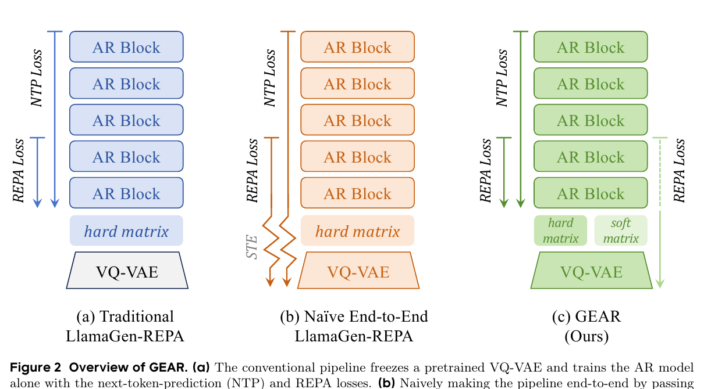
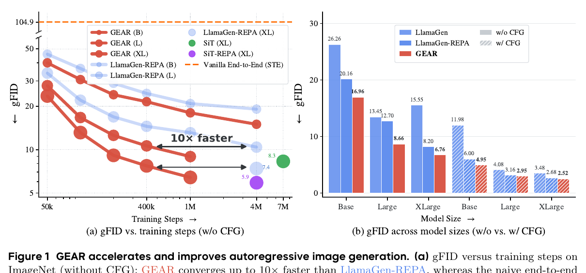
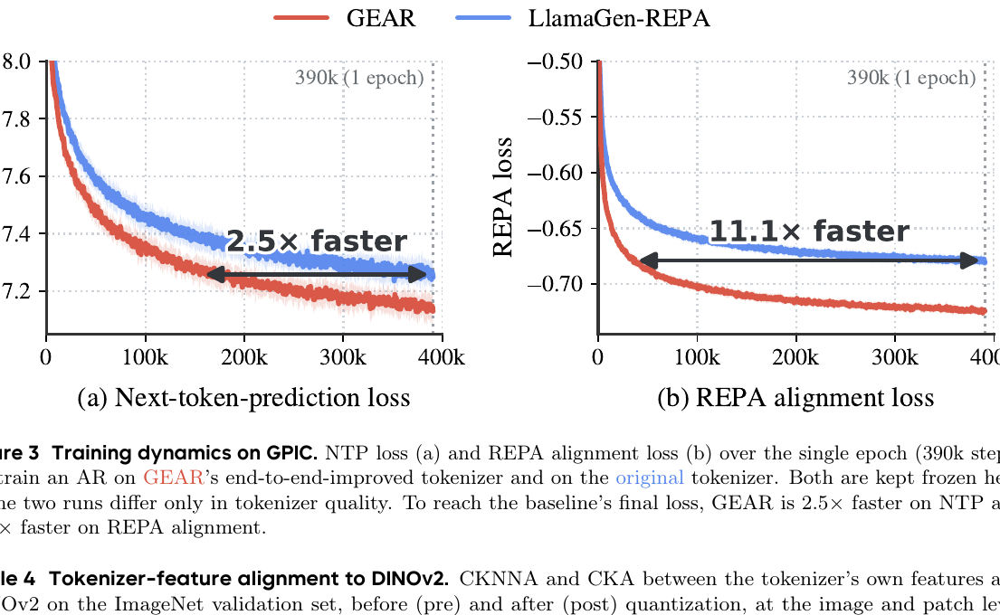
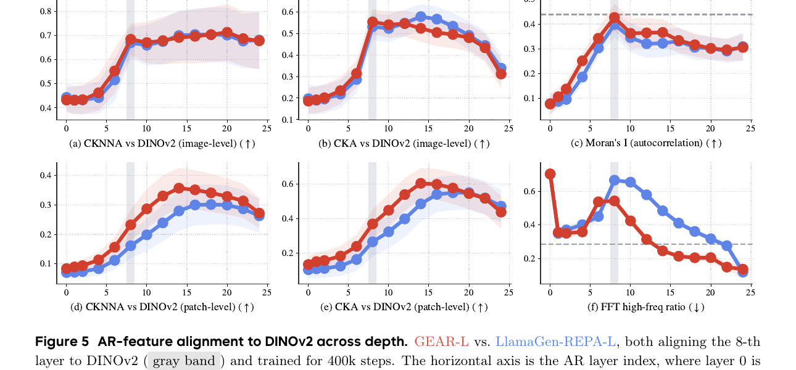

# AI Daily：GEAR——讓 AR hidden state 承擔語義，重新分工離散 tokenizer 與生成器

> **一句話摘要：** GEAR 不把離散視覺 tokenizer 強行改造成「語義 encoder」，而是用 hard/soft dual read-out 將 next-token prediction 與 representation alignment 的梯度分開，使 tokenizer 學習更容易被自回歸模型預測的離散分布，讓 AR generator 的 patch-level hidden states 承擔更多語義與空間對齊工作。[1] [2]

## 論文基本資訊

| 欄位 | 內容 |
|---|---|
| 論文 | **GEAR: Guided End-to-End AutoRegression for Image Synthesis** |
| 作者 | Bin Lin、Zheyuan Liu、Chenguo Lin、Sixiang Chen、Yunyang Ge、Yunlong Lin、Jianwei Zhang、Miles Yang、Zhao Zhong、Liefeng Bo、Li Yuan |
| 研究單位 | Peking University、Tencent Hunyuan；部分作者於 Tencent Hunyuan 實習 |
| 發表狀態 | **arXiv computer-vision 預印本 v1**，2026-06-30；截至本報告日期，原始論文頁未列正式會議或期刊收錄資訊 |
| 研究主題 | Visual autoregressive generation、VQ tokenizer、representation alignment、end-to-end training |
| 原文與程式碼 | [arXiv 摘要頁][1]、[arXiv HTML 全文][2]、[官方 GitHub repository][3]、[官方 project page][4] |
| 本庫排除查核 | 已以 arXiv ID、完整標題與主要名稱比對現有 AI Daily 索引，未發現重複文章，因此本篇為新增研究。 |

## 為什麼今天選 GEAR

離散視覺自回歸模型通常先訓練 VQ tokenizer，再把 tokenizer 凍結，最後訓練 AR generator。這個流程簡單而穩定，但 tokenizer 只知道如何重建影像，不知道 generator 是否容易預測它產生的 code indices。於是，生成器必須被動適應一套可能不適合 causal modeling 的離散表示。[2]

GEAR 的價值在於，它把問題從「tokenizer 是否足夠 semantic」改寫成「tokenizer 與 generator 應如何分工，以及不同學習訊號應沿哪條梯度路徑流動」。論文沒有讓 next-token prediction 梯度直接穿越離散 assignment，也沒有把所有 loss 透過 straight-through estimator（STE）硬塞回 tokenizer。相反地，它讓 inference 真正使用的 hard token 服務 AR 訓練，讓可微的 soft assignment 只承擔把 representation guidance 傳回 tokenizer 的任務。[2] [4]

這個設計也帶來一個反直覺觀察：GEAR 的 tokenizer 變得**較不像 DINOv2**，但 AR hidden states 在 patch level 變得更接近 DINOv2，並具有更強的局部空間一致性。換言之，語義與空間對齊的負擔不是必須全部放在 latent 或 tokenizer 上；在離散 AR 中，讓 generator 的中間表徵承擔這項工作可能更合適。[2] [4]

## 核心貢獻

### 1. 將 generator–tokenizer mismatch 具體化

標準 pipeline 中，VQ tokenizer 以重建品質為主要目標，AR generator 則以 next-token prediction（NTP）為主要目標。兩者各自合理，但 tokenizer 並未因應 AR 的因果預測需求。直接使用 STE 做 naive end-to-end training 時，NTP 的梯度可能推動 tokenizer 過度集中使用少數容易預測的 code，導致 codebook collapse；論文的 STE ablation 報告 gFID 約 104.9、rFID 約 59.7，生成和重建同時惡化。[2]

### 2. 以 hard/soft dual read-out 解耦梯度

GEAR 對同一個 codebook assignment 建立兩條讀出路徑。hard branch 使用 inference 時真正會餵給 AR 的 one-hot token；soft branch 使用溫度縮放的 assignment probability，保留對 tokenizer 的可微連接。這使模型可以在同一個訓練 loop 中共同更新 tokenizer 與 AR generator，但不讓不穩定的 NTP 梯度直接更新 tokenizer。[2] [3]

### 3. 發現 alignment burden 會從 tokenizer 轉移到 AR hidden state

在 GEAR 中，tokenizer 的 DINOv2-like 相似度下降，尤其是 patch-level CKA 與 CKNNA；相反地，AR 的 patch-level hidden states 更接近 DINOv2，在 Moran's $I$ 與 FFT high-frequency ratio 等空間統計上也展現更強的局部結構。這說明「更 semantic 的 tokenizer」不是離散 AR 的唯一解法，generator 自身的中間狀態也可以作為對齊介面。[2] [4]

### 4. 跨量化器、模型規模與文字到圖像設定驗證

GEAR 不只在 VQVAE 上測試，也延伸到 LFQ 與 IBQ。它在 ImageNet-1K class-conditional generation 和 GPIC text-to-image 上均報告改善，並公開 tokenizer、T2I checkpoint 及多項評估腳本，為後續研究提供了實際實驗入口。[3]

## 方法詳解

### 1. VQ tokenizer 與不可微 assignment

令輸入影像為 $x\in\mathbb R^{H\times W\times 3}$。encoder 產生空間 latent：

$$
Z=\mathcal E(x)=\{\mathbf z_i\}_{i=1}^{N},
\qquad \mathbf z_i\in\mathbb R^d.
$$

給定 codebook $\mathcal C=\{\mathbf c_k\}_{k=1}^{K}$，每個位置以最近鄰量化：

$$
A_{ik}=-\lVert \mathbf z_i-\mathbf c_k\rVert_2^2,
\qquad
q_i=\arg\max_k A_{ik},
\qquad
\hat{\mathbf z}_i=\mathbf c_{q_i}.
$$

在 GEAR 的 ImageNet 主設定中，tokenizer 採用 16 倍下採樣與 16,384-entry codebook。傳統 tokenizer 損失可概括為重建、感知、對抗、codebook entropy 與 commitment 項：

$$
\mathcal L_{\mathrm{VQ}}
=\mathcal L_{\mathrm{rec}}
+0.1\mathcal L_{\mathrm{LPIPS}}
+0.1\mathcal L_{\mathrm{GAN}}
+0.05\mathcal L_{\mathrm{ent}}
+0.25\mathcal L_{\mathrm{commit}}.
$$

由於 $\arg\max$ assignment 不可微，傳統 pipeline 通常先完成 tokenizer warm-up，再凍結 tokenizer，將離散 indices 交給 AR generator。[2]

### 2. AR generator 的 next-token prediction

將 token grid 依 raster order 展平成 $q_{1:N}$，並以 class label 或文字條件 $c$ 作為 prefix。AR 模型的 NTP loss 為

$$
\mathcal L_{\mathrm{NTP}}
=-\sum_{i=1}^{N}\log p_\theta(q_i\mid q_{<i},c).
$$

問題在於，$q_i$ 是離散 index；若直接以 STE 將 NTP 梯度近似傳回 encoder 與 codebook，NTP 會同時要求 tokenizer 保持重建資訊與產生容易預測的 code。這兩個壓力在 naive end-to-end training 中可能互相衝突。

### 3. Hard/soft dual read-out

GEAR 保留同一個 assignment matrix $A_i$，但建立兩種 embedding 讀出。令 AR 自己的 learnable embedding table 為 $E\in\mathbb R^{K\times d}$。

**Hard read-out** 直接使用 discrete token：

$$
\mathbf u_i^{\mathrm h}=E_{q_i},
\qquad q_i=\arg\max_k A_{ik}.
$$

這是 inference 時 AR 真正看到的表示，因此 hard branch 的 NTP loss 與 hard alignment loss 只更新 AR generator。

**Soft read-out** 則使用 temperature-$\tau$ 的 assignment distribution：

$$
\boldsymbol\pi_i
=\operatorname{softmax}(\mathbf A_i/\tau),
\qquad
\mathbf u_i^{\mathrm s}=\boldsymbol\pi_i E.
$$

當 $\tau$ 趨近於零時，soft assignment 逐漸接近 hard assignment；在有限溫度下，它仍保留對 encoder 與 codebook 的梯度。兩條輸入序列分別為

$$
S^{\mathrm h}=[e_c,\mathbf u_1^{\mathrm h},\ldots,\mathbf u_N^{\mathrm h}],
$$

$$
S^{\mathrm s}=[e_c,\mathbf u_1^{\mathrm s},\ldots,\mathbf u_N^{\mathrm s}].
$$

*圖 1．GEAR 的方法分工。hard branch 讓 AR 以真實離散 token 做 NTP；soft branch 只提供可微的 representation guidance 給 tokenizer。*

### 4. Representation alignment

GEAR 使用 frozen vision representation encoder $f$，並以 projection head $g_\phi$ 將 AR 第 $\ell$ 層的 hidden state 映射到同一個 feature space。token-wise cosine alignment loss 為

$$
\mathcal L_{\mathrm{align}}(H^{(\ell)})
=-\frac{1}{N}\sum_{i=1}^{N}
\frac{\left\langle g_\phi(h_i^{(\ell)}),f(x)_i\right\rangle}
{\left\|g_\phi(h_i^{(\ell)})\right\|_2\left\|f(x)_i\right\|_2}.
$$

hard branch 產生 $\mathcal L_{\mathrm{align}}^{\mathrm h}$，只用來更新 AR；soft branch 產生 $\mathcal L_{\mathrm{align}}^{\mathrm s}$，在凍結 AR backbone、AR embedding 與 projector 的條件下，把 alignment signal 傳回 tokenizer。兩組更新可以寫成

$$
\theta_{\mathrm{tok}}
\leftarrow\theta_{\mathrm{tok}}
-\eta\nabla_{\theta_{\mathrm{tok}}}
\left(\mathcal L_{\mathrm{VQ}}
+\lambda\mathcal L_{\mathrm{align}}^{\mathrm s}\right),
$$

$$
\theta_{\mathrm{AR}}
\leftarrow\theta_{\mathrm{AR}}
-\eta\nabla_{\theta_{\mathrm{AR}}}
\left(\mathcal L_{\mathrm{NTP}}
+\lambda\mathcal L_{\mathrm{align}}^{\mathrm h}\right).
$$

這裡的關鍵不是「兩個模組一起更新」本身，而是每一個 loss 被限制在適合它的梯度路徑上：tokenizer 接受 reconstruction 與 soft alignment，AR 接受 NTP 與 hard alignment。論文的預設設定為 guidance temperature $\tau=0.1$、alignment coefficient $\lambda=0.5$，alignment depth 為第 8 層。[2] [4]

## 實驗結果與性能指標

### ImageNet-1K：生成品質與收斂速度

ImageNet 主實驗使用 256×256 影像、300 epochs、CFG scale 1.5，並以 LlamaGen-REPA 作為 matched baseline。下表整理 gFID 與 IS；gFID 越低越好，IS 越高越好。[2] [4]

| 模型規模 | 參數量 | LlamaGen-REPA gFID | GEAR gFID | LlamaGen-REPA IS | GEAR IS |
|---|---:|---:|---:|---:|---:|
| B | 111M | 6.00 | **4.95** | 145.0 | **166.1** |
| L | 343M | 3.15 | **2.95** | 208.1 | **239.8** |
| XL | 775M | 2.68 | **2.52** | 232.2 | **262.9** |

在不使用 CFG 的設定中，B/L/XL 的 gFID 分別由 20.16/12.70/8.20 改善至 16.96/8.66/6.76。800 epochs 的 with-CFG 結果也顯示 L 規模由 2.92 降至 2.72，XL 規模由 2.57 降至 2.45。[2]

*圖 2．GEAR 在多個模型規模上改善 gFID。圖中的「10× faster」是達到相應品質的 training-step/convergence 比較，不應改寫成 GPU-hour、能源或端到端 wall-clock speedup。*

論文將 ImageNet gFID convergence 描述為最多約 10× faster relative to LlamaGen-REPA。這個倍數表示達到某一 loss 或品質水平所需的訓練步數，不是完整的硬體計時，也不是能源消耗比較。[2] [3] [4]

### GPIC text-to-image：tokenizer 改善帶來更快對齊

GPIC 實驗使用約 100M images、Qwen3-1.7B text encoder、LlamaGen-1B 與約 390k training steps。GEAR 與 LlamaGen-REPA 使用相同資料、AR 架構和訓練 recipe，主要差異是 frozen tokenizer 是否由 GEAR end-to-end tuning 得到。[2] [3]

以 DINOv2 feature space 的 Fréchet distance（FDD）衡量時，390k steps 的無 CFG FDD 由 127.9 降至 115.3；with CFG FDD 則由 228.9 降至 200.9。precision/recall 為 baseline 的 0.92/0.78 與 GEAR 的 0.92/0.80。[2] [3]

*圖 3．GEAR 達到 baseline final NTP loss 約 2.5× faster，達到 baseline final REPA alignment loss 約 11.1× faster。這兩個數字都是 convergence-step 比較。*

值得注意的是，2.5× 與 11.1× 並不等於相同倍數的 wall-clock 加速。論文與官方資料沒有提供足以支持 GPU-hour、能源或完整端到端 latency 倍數的對照，因此這些量不能由 convergence curve 推導。[2] [3] [4]

在 broader controlled T2I benchmark 中，GEAR 的 with-CFG 結果為 GenEval short 0.334 對 0.272、GenEval long 0.478 對 0.419、DPG-Bench 72.881 對 70.363、COCO CLIP Score 31.39 對 30.80，以及 COCO FID 25.74 對 27.99。這組 GPIC recipe 只訓練約一個 epoch，且論文指出 CFG 16–20 仍在持續改善，代表設定可能 underfit；因此不能把它包裝成完整 T2I foundation model 的全面 SOTA。[2]

### 重建品質與量化器泛化

GEAR 沒有以生成品質換取明顯的 reconstruction 崩潰。官方 README 報告，在 bicubic evaluation 下，VQVAE 的 rFID 由 1.724 改為 1.640，LFQ 由 2.421 改為 2.129，IBQ 由 1.973 改為 1.716。[3]

這些數字必須保留 interpolation protocol。官方資料指出 LFQ/IBQ 的原始 release 可能使用 bilinear，而 GEAR 的比較使用 bicubic；因此不同 release 的 rFID 不能在沒有註解的情況下直接橫向比較。[3]

### Representation target 與 AR 的局部結構

在 100k-step representation-target ablation 中，GEAR 對多種 target 都有改善。以 gFID 的 baseline→GEAR 變化表示：DINOv2 為 22.371→16.837，DINOv3 為 23.115→18.967，SigLIPv2 為 23.254→19.226，V-JEPA2.1 為 23.536→19.532。[2]

V-JEPA2.1 只是一個替代 representation target；GEAR 沒有使用 JEPA predictor/target encoder、時間預測、world-model objective 或 action-conditioned training。因此它與 JEPA 的關係是「soft representation guidance 可以接上 JEPA-style dense feature」，而不是本文已提出 JEPA 方法。[2]

*圖 4．GEAR 在 patch-level CKNNA、CKA、Moran's $I$ 與 FFT high-frequency ratio 上展現更強的局部結構；image-level 差異則相對有限。*

圖 4 的結果支持 GEAR 的核心解釋：AR hidden states 在 image level 可能與 baseline 接近，但在 patch level 更貼近 DINOv2，並呈現更強的 spatially coherent structure。這也是為什麼 GEAR 的改善不能只理解成「tokenizer 更 semantic」；真正被改造的是 tokenizer 的可預測離散分布，以及 generator 中間層的局部表徵。

### 關鍵消融

GEAR 的 STE ablation 直接展示了梯度路徑的重要性：naive STE joint training 的 gFID/rFID 為 104.932/59.723，而 GEAR 的對應結果為 10.630/1.640。這個差距支持「NTP 梯度不應直接更新 tokenizer」的設計判斷。[2]

在不同量化器上，VQVAE 的 gFID/rFID 由 14.719/1.724 改善至 10.630/1.640；LFQ 由 18.681/2.421 改善至 14.776/2.129；IBQ 由 20.246/1.973 改善至 12.972/1.716。這表示方法並不綁定單一 VQ implementation。[2]

## 與近期研究方向的關聯

### 與 VAR 與 visual AR 的關聯最直接

GEAR 直接處理 visual AR 的離散 tokenization、causal NTP 和 generator/tokenizer interface。它與只在 frozen generator 上加入 sampling refiner、logit correction 或 test-time editing 的方法不同：GEAR 的干預發生在訓練期，目標是讓 tokenizer 產生更適合 AR 建模的序列，同時維持 reconstruction。[2] [6]

這個觀點與早期 visual AR 工作的基本分工形成互補。LlamaGen 類方法把影像轉成離散 token 並以 causal transformer 生成；GEAR 則追問：若 token sequence 的統計結構本身不利於 causal prediction，是否應該讓 generator 的 alignment signal 反向塑造 tokenizer？[2] [6]

### 與 diffusion-side semantic latent learning 的對照

REPA-E、VA-VAE 與 MAETok 類方法傾向把 continuous VAE latent 本身推向更 semantic、更接近視覺基礎模型 representation 的方向。GEAR 則利用離散 AR 的特殊性，採取相反分工：tokenizer 優先保留可重建、可預測的離散結構，而 semantic alignment 更多由 AR hidden state 承擔。[2]

這不是說哪一條路線普遍正確。GEAR 自己仍受離散 tokenizer 的 reconstruction ceiling 限制；報告中的 rFID 1.64 與 gFID 2.52 仍落後 continuous-VAE REPA-E 所報的 rFID 0.28 與 gFID 1.12。[2] 這提示未來研究需要同時處理 discrete predictability、reconstruction fidelity 與 semantic alignment，而不是只優化其中一項。

### 對 Energy-based Transformer 的研究啟發

GEAR **不是** Energy-Based Transformer，也沒有 partition function、negative phase、score matching 或 energy-based reranking。它的 cosine alignment loss 也不能直接稱為 compatibility energy。[2]

不過，GEAR 提供一個適合接上 energy-based design 的 interface。可以定義 token-level compatibility energy，例如

$$
E_i(q_i,c)
=\alpha\,\ell_{\mathrm{NTP}}(q_i\mid q_{<i},c)
+\beta\,d\big(h_i^{(\ell)},f(x)_i\big)
+\gamma\,H(\pi_i),
$$

其中第一項衡量 AR 可預測性，第二項衡量 representation agreement，第三項衡量 assignment uncertainty。這個式子是研究構想，不是 GEAR 的原始方法。它可以進一步研究：是否能以 energy threshold 決定何時更新 tokenizer、何時選擇 soft route，或何時對特定尺度與 token 啟用額外 alignment。

### 對 JEPA 的研究啟發

GEAR 的 V-JEPA2.1 ablation 表明，representation guidance 不必固定使用 DINOv2；預測式表徵也能作為 target。這支持一個可驗證的後續方向：讓 JEPA-style predictive disagreement 估計某一 token 或 patch 的不確定性，再以此決定 alignment strength、token routing 或 AR layer 的介入位置。

但這種延伸仍需新的實驗。GEAR 沒有 temporal prediction、world model、action conditioning 或 JEPA target/predictor pair，因此不能把本文描述成 JEPA advancement。[2]

### training-free、attention modulation 與 zero-shot：必須保留界線

GEAR 是**需要訓練的 end-to-end alignment 方法**。它不是 training-free inference，也不是只在推理時修改 attention 或 logits。ImageNet tokenizer 被帶到 GPIC 的結果是跨任務的 tokenizer reuse 與 controlled transfer，不等於嚴格定義下的 zero-shot inference。[2] [3]

因此，若要把 GEAR 與 training-free attention modulation 結合，合理的實驗問題應是：先用 GEAR 學會更穩定的 token/hidden-state interface，再在推理期以 uncertainty 或 compatibility energy 調節特定 layer 的 attention。這個兩階段設計尚未由 GEAR 論文驗證。

## 限制與證據界線

第一，GEAR 仍是 arXiv v1 預印本，不能把官方 repository 或 project page 寫成獨立 replication，也不能暗示它已經有正式會議或期刊接受。[1] [3] [4]

第二，約 10×、2.5× 與 11.1× 都是 convergence-step 或 loss-level claims。論文沒有提供足以支持 GPU-hour、能源消耗或完整端到端 wall-clock speedup 的資料。[2] [3]

第三，GPIC 是受控、約一個 epoch 的設定。論文指出 CFG 16–20 仍在改善，因此結果主要用來隔離 tokenizer effect，不足以代表長時間訓練的大型 T2I foundation model 全面排名。[2]

第四，離散 reconstruction ceiling 仍存在，且結果會受 representation target、alignment depth、temperature 和 bicubic/bilinear interpolation protocol 影響。GEAR 改善了 generator–tokenizer interface，但沒有消除離散 codebook 的 fidelity bottleneck。[2] [3]

第五，官方 code、checkpoint 和 evaluator 提供了很好的再現入口，但 GenEval、DPG-Bench、WISE、ADM evaluator 等仍需要各自建立環境；「公開程式碼」不等於每個 benchmark 都能一鍵重跑。[3]

## 個人評價與可延伸研究問題

我認為 GEAR 最值得保留的不是「最多 10× convergence」這個 headline，而是它對**梯度路徑與表徵分工**的精確拆解。對離散生成模型而言，tokenizer 不一定要獨自承擔重建、語義與可預測性三項任務。只要 hard branch 保證 AR 看見真實 inference token，soft branch 就能提供一條較安全的 guidance channel，讓 generator 與 tokenizer 在同一個 loop 中共同演化而不互相破壞。

這個觀察可以轉化成幾個具體研究問題。第一，能否把 $\pi_i$ 的 entropy 與 AR predictive entropy 合併成 scale-wise energy，讓模型對困難 patch 啟用更強 alignment？第二，能否以 V-JEPA-style predictive disagreement 作為 uncertainty signal，動態選擇 alignment layer，而不是固定第 8 層？第三，tokenizer entropy 下降、patch-level CKA 上升與 gFID 改善之間，哪一個是因果中介，哪一個只是伴隨現象？第四，能否在不讓 NTP 梯度直接回傳 tokenizer 的前提下，加入 structure-aware codebook routing，改善離散 reconstruction ceiling？第五，GEAR 的 hard/soft interface 是否能與 VAR 的多尺度 token generation、Energy-Based Transformer 的 compatibility scoring，或 inference-time attention modulation 組成一個可控的 unified visual AR system？

這些問題都比直接宣稱「GEAR 是 JEPA、EBT 或 training-free 方法」更嚴謹，也更能保留論文真正提供的研究價值。

## 結論

GEAR 提出了一個清楚的離散 AR 訓練原則：**讓 hard token 保持 inference fidelity，讓 soft assignment 傳遞可微 guidance；讓 NTP 與 representation alignment 沿不同梯度路徑更新。** 在 ImageNet 與受控 GPIC 設定中，這個原則帶來更好的 gFID、IS、FDD、patch-level alignment，以及跨 VQVAE、LFQ、IBQ 的泛化。[2] [3] [4]

它不是 training-free，也不是 Energy-Based Transformer 或 JEPA，但它為這些方向提供了具體接口：token predictability、representation agreement、assignment uncertainty 和 generator hidden-state geometry 可以被放進同一個分析與控制框架。對想研究 VAR、JEPA、energy-based generation 或 attention control 的讀者而言，GEAR 的真正啟發是：**不要先假設語義必須存在於 tokenizer；先問清楚哪一個模組最適合承擔哪一種學習訊號。**

## References

[1]: https://arxiv.org/abs/2606.32039 "GEAR: Guided End-to-End AutoRegression for Image Synthesis — arXiv abstract and metadata"

[2]: https://arxiv.org/html/2606.32039v1 "GEAR: Guided End-to-End AutoRegression for Image Synthesis — arXiv HTML full text"

[3]: https://github.com/Tencent-Hunyuan/GEAR "Tencent-Hunyuan/GEAR — official implementation, checkpoints, and evaluation scripts"

[4]: https://linb203.github.io/gear "GEAR — official project page with method overview, results, and ablations"

[5]: https://huggingface.co/papers/2606.32039 "GEAR — Hugging Face paper page and project links"

[6]: https://arxiv.org/html/2406.06525v1 "LlamaGen: Autoregressive Model Beats Diffusion Models at Image Generation — arXiv HTML"

---

本文作者：**Manus AI**  
日期：**2026-09-18**
