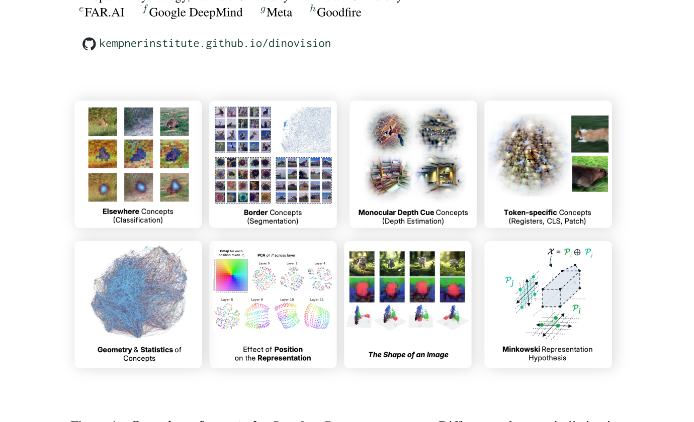
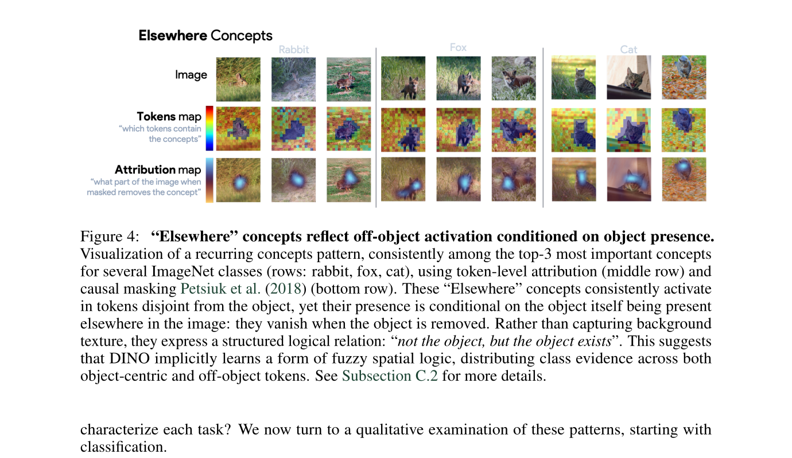
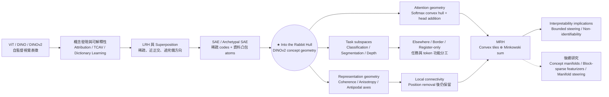
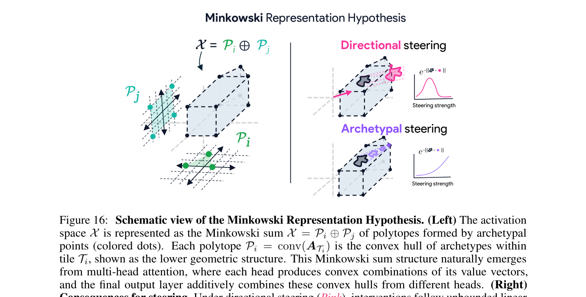
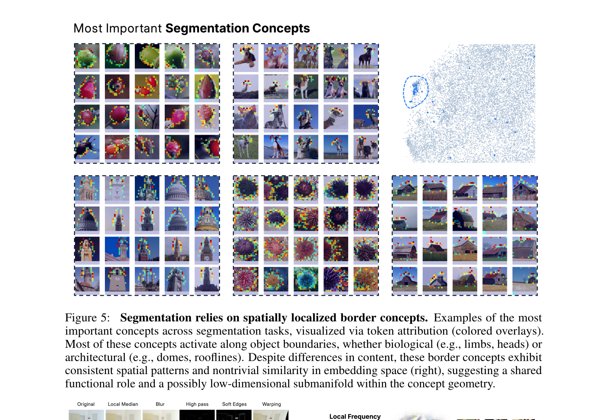
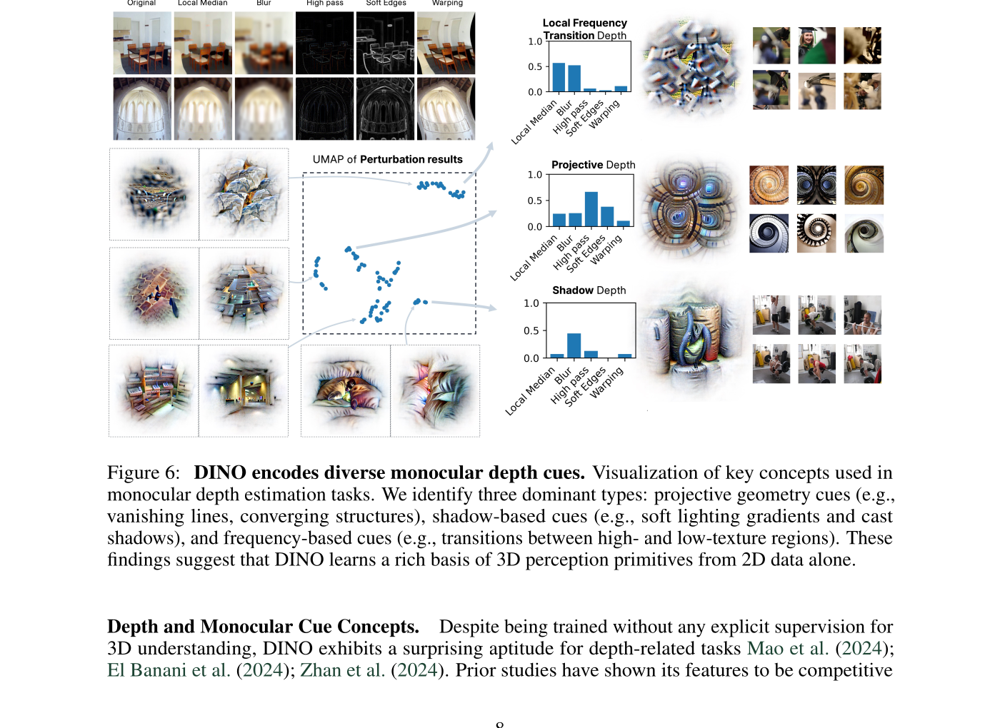
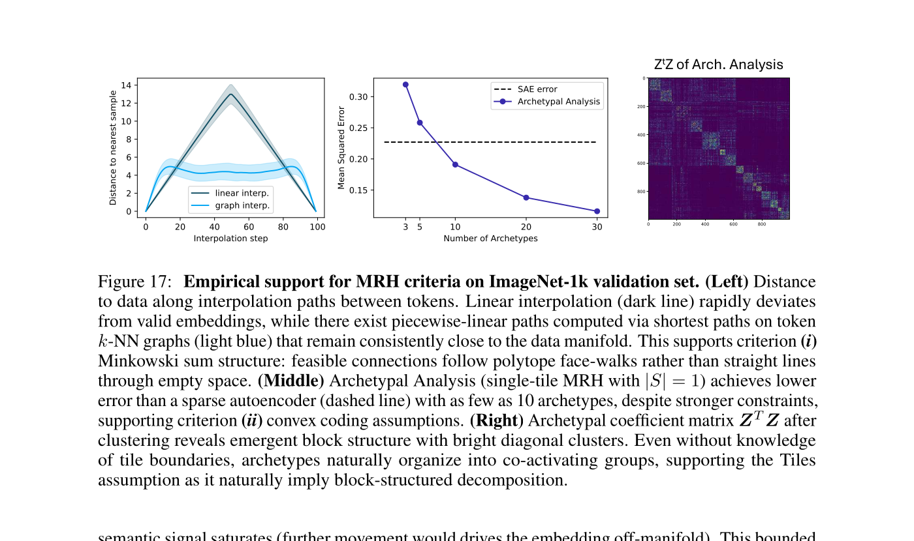

# AI Daily：Into the Rabbit Hull——DINO 的概念，為什麼可能不是一條線？

> **一句話結論：** 這篇 ICLR 2026 論文以 32,000 個視覺概念分析 DINOv2-B，指出其表徵同時包含任務特化的概念區域、少量稠密的位置訊號、分散式語義軸與局部連通幾何；作者因此提出 **Minkowski Representation Hypothesis（MRH）**，把概念從「可無限外推的線性方向」改寫成「少數 archetype tiles 的凸組合與 Minkowski 和」。這是具有數學動機的研究假說，不是已被因果實驗證明的普遍定理。

- **論文：** *Into the Rabbit Hull: From Task-Relevant Concepts in DINO to Minkowski Geometry*
- **作者：** Thomas Fel、Binxu Wang、Michael A. Lepori、Matthew Kowal、Andrew Lee、Randall Balestriero、Sonia Joseph、Ekdeep S. Lubana、Talia Konkle、Demba Ba、Martin Wattenberg
- **發表：** ICLR 2026 conference paper（Extended Version）[13] [14]；arXiv v3，2026-05-07
- **論文識別：** [arXiv:2510.08638][1]；[DOI: 10.48550/arXiv.2510.08638][2]
- **研究領域：** 視覺表徵學習、機制可解釋性、稀疏字典學習、概念幾何與 Transformer attention
- **本文資料截點：** 2026-09-22

## 1. 為什麼這篇論文重要？

DINOv2 是一個沒有使用人工標籤、卻能支援分類、語義分割、單目深度、追蹤與機器人感知的視覺表徵模型。問題是：**它到底把哪些視覺概念寫進了 token？不同任務取用的是同一組概念，還是不同的子空間？這些概念在表徵空間裡是獨立方向，還是有更豐富的幾何結構？** [3]

過去的 Linear Representation Hypothesis（LRH）把概念近似成過完備字典中的稀疏、近正交方向。這個假說很適合用 Sparse Autoencoder（SAE）操作化，但它暗示概念可以沿著一條方向被持續放大。本文的觀察顯示，DINOv2 的概念字典存在較高 coherence、各向異性、反極語義軸、少數稠密的位置特徵，以及移除位置資訊後仍保留的局部連通結構。因此作者認為，單純的「稀疏線性方向」可能只是第一階近似。

本文最有價值的地方，不是宣稱 LRH 錯了，而是提出一個更細緻的分析單位：**概念可以是有界的凸區域、地標或局部流形；一個 token 則由少數區域各自取凸組合後再相加而成。** 這個觀點把 SAE 的可解釋性問題，連接到 multi-head attention 的凸組合、Gärdenfors 的 conceptual spaces，以及 Minkowski geometry。

*圖 1。此圖為從論文 PDF Figure 1 擷取的局部內容；它不是完整頁面截圖。來源：[目標論文 PDF][4]。*

## 2. 論文的核心貢獻與創新點

### 2.1 以 32,000 個概念建立 DINOv2 的可分析字典

作者分析的是 **DINOv2-B with four register tokens**，而不是重新訓練一個新 backbone。每張影像包含 256 個 16×16 patch tokens、1 個 CLS token 與 4 個 register tokens，共 261 個 token；每個 token 的 embedding 維度是 768。作者使用約 140 萬張 ImageNet-1K 影像及其 augmentation，先以 128,000 個 k-means centroids 近似資料凸包，再學習 32,000 個 dictionary atoms，每個 token 最多使用 8 個 active codes。SAE reconstruction 的報告值為 `R^2 > 88%`。

這個設定讓「概念」不再等同於單一 neuron。它是一個從高維 DINOv2 activation 中抽出的、可被下游 task probe 使用的分散式字典成分。

### 2.2 證明不同任務會招募不同的概念區域

分類、分割與深度估計並不是平均使用整個字典。分類較廣泛地招募概念；分割主要集中於物體邊界；深度估計則呈現投影幾何、陰影／光照與局部頻率／紋理轉換三類主要 cue。這些結果不是新的 ImageNet accuracy、mIoU 或 depth RMSE，而是對 **下游任務如何讀取 representation** 的概念分析。

論文 Figure 2 的圖面標註 classification（ImageNet-1K）、segmentation（ADE20K）與 depth estimation（NYU Depth v2）。不過，本文可核對的主文並沒有把這些任務整理成一張標準 leaderboard，也沒有提供足以重算所有 benchmark 指標的完整設定，因此不能把這篇論文誤讀成提出了新的下游性能模型。

### 2.3 發現「Elsewhere」與 register-only 概念

分類中的 **Elsewhere concepts** 是本文最容易讓人印象深刻的結果之一。它們在物體以外的 token 上啟動，但當物體從影像中移除時也會消失。換句話說，它們不是一般背景 detector，而更像是「物體不在這個 token，但物體存在於其他位置」的條件式否定。這說明概念的 activation location 與它所依賴的 evidence location 可以分離。

*圖 2。Figure 4 的局部裁切。作者使用 token attribution 與 causal masking 比較 activation 與物體位置的差異。[4]*

另一個結果是 **register-only concepts**。作者報告只有一個 CLS-only concept，卻有數百個 register-only concepts。這些 register 概念與照明、motion blur、caustics、鏡頭效果、藝術風格與景深等全局或非局部場景因素有關。這支持 register token 可能承擔全局場景資訊，但仍不足以證明 register 的完整因果功能；需要更嚴格的 ablation 與 positional controls。

### 2.4 從線性字典幾何走向 MRH

作者觀察到訓練後的字典與理想化的 Grassmannian frame 不同。它具有較厚的 pairwise inner-product tails、較高 coherence、較快衰減的 singular-value spectrum，以及不是以單一 neuron 對齊的 distributed encoding。字典中還出現近似的 antipodal pairs，例如 white/black 與 left/right。這表示 cosine 接近 `-1` 時，可能代表同一語義軸的相反極性，而不是兩個無關概念。

在此基礎上，作者提出 MRH。它不是說概念是一條可以無限外推的向量，而是說一個 token 可能同時從「動物類別」「顏色」「紋理」「位置」與「深度」等不同 tile 各取一個凸組合，再把這些結果相加。

### 2.5 將 MRH 連結到 attention 與可解釋性干預

MRH 提供三個可檢驗的含意。第一，概念更像凸區域或 landmark，而不是無界方向。第二，沿一條方向做 steering 可能先靠近有效概念區域，繼續增加強度後反而離開資料流形；因此 steering 應考慮 bounded、landmark-aware 或 on-manifold 的路徑。第三，只觀察最後一層 activation，通常無法唯一恢復各個 Minkowski summand，因此 post-hoc interpretability 存在根本的 non-identifiability。

## 3. 整體研究領域心智圖

下圖把這篇論文放回視覺表徵、可解釋性、稀疏編碼與幾何表徵的整體版圖。**實線表示論文明確依賴或分析的關係；虛線表示本報告為讀者整理出的研究方向連接。**

### 3.1 這篇論文在心智圖中的位置

它位於五個節點的交界：DINOv2 的自監督視覺表徵、SAE 與 Archetypal SAE、下游任務概念使用、representation geometry，以及 attention 的凸組合機制。它的主要新意不是設計新的視覺 backbone，而是把這些觀察組織成一個可被後續實驗檢驗的幾何假說。

若用研究演進來看，脈絡可以濃縮為：

| 階段 | 研究問題 | 代表工作 | 本文的關係 |
|---|---|---|---|
| 視覺表徵 | 如何從無標籤影像學到可轉移特徵？ | ViT、DINO、DINOv2 [3] | 本文把 DINOv2 當成被解釋對象。 |
| 概念可解釋性 | 模型內部使用哪些概念？ | attribution、TCAV、concept discovery | 本文用 task-aligned probes 定位概念。 |
| 線性稀疏表徵 | 概念能否視為稀疏方向？ | LRH、superposition、SAE [5] [6] | 本文將 LRH 作為工作基線。 |
| 凸包字典 | 如何讓 vision SAE 更穩定、更接近資料？ | Archetypal SAE [7] | 本文沿用資料凸包約束。 |
| 幾何假說 | 概念是方向、區域還是流形？ | MRH | 本文提出 convex tiles 與 Minkowski sum。 |
| 後續延伸 | 如何讓幾何成為可訓練、可干預的模型？ | Concept manifolds、Manifold Steering、Block-Sparse Featurizers [8] [9] [10] | 這些工作把方向性假說推向 blocks、manifolds 與 intervention。 |

## 4. 技術方法：從 activation 到 Minkowski geometry

### 4.1 LRH 與穩定 SAE

LRH 的工作形式是

$$\mathbf a=\mathbf z\mathbf D, \qquad c\gg d, \qquad \mu(\mathbf D)=\max_{i\ne j}|\mathbf D_i\mathbf D_j^{\mathsf T}|\le\varepsilon, \qquad \|\mathbf D_i\|_2=1, \qquad |\operatorname{supp}(\mathbf z)|\le k\ll c.$$

其中 `\mathbf a` 是原始 activation，`\mathbf D` 是過完備字典，`\mathbf z` 是稀疏 code。這個假設把「概念」定義成字典中的方向，並用少量 active code 重建 activation。

本文實際使用的 stable SAE 可概括為

$$\min_{\mathbf Z,\mathbf D} \|\mathbf A-\mathbf Z\mathbf D\|_F^2 \quad\text{s.t.}\quad \mathbf Z\ge0, \quad \|\mathbf Z_i\|_0\le k, \quad \mathbf D_i\in\operatorname{conv}(\mathbf A).$$

`\mathbf D_i \in \operatorname{conv}(\mathbf A)` 是關鍵。它把 dictionary atoms 限制在資料凸包中，避免字典任意漂移到資料分布之外。實作上，作者以 `\mathbf D=\mathbf S\mathbf C` 參數化，其中 `\mathbf S` 是 row-stochastic，`\mathbf C` 是 128,000 個 k-means centroids。

### 4.2 用線性 probe 找出 task-aligned concepts

若 activation 可以近似寫成 `\mathbf A\approx\mathbf Z\mathbf D`，而線性 probe 為 `\mathbf Y=\mathbf A\mathbf W^{\mathsf T}`，則

$$\mathbf Y \approx \mathbf Z\mathbf D\mathbf W^{\mathsf T} =\mathbf Z\mathbf W', \qquad \mathbf W'=\mathbf D\mathbf W^{\mathsf T}.$$

作者以

$$\boldsymbol\phi=\mathbb E(\mathbf Z)\mathbf W'$$

作為概念與 task output 對齊的 importance。它回答的是「哪些字典 concept 對這個 task 的線性輸出有貢獻」，不是「哪個 concept 就是模型唯一真實的因果因素」。作者也把這個線性情況與 C-Deletion、C-Insertion、C-μFidelity 以及 gradient×input、zero-baseline Integrated Gradients 和 occlusion/RISE 類 attribution 連接起來。

### 4.3 MRH 的數學形式

令 archetype dictionary 為

$$\mathcal A=(\mathbf a_1,\ldots,\mathbf a_c)\in\mathbb R^{c\times d}.$$

把 archetypes 分成互斥 tiles `\{\mathcal T_i\}_{i=1}^{m}`，每個 tile 的凸包為

$$\mathcal P_i=\operatorname{conv}(\mathcal A_{\mathcal T_i}).$$

MRH 要求 activation space 可以用 Minkowski sum 表示：

$$\mathcal X=\bigoplus_{i=1}^{m}\mathcal P_i,$$

並且單一 activation 具有 block-convex coding：

$$\mathbf x=\sum_{i\in S}\mathbf z_i\mathcal A_{\mathcal T_i}, \qquad \mathbf z_i\in\Delta^{|\mathcal T_i|}, \qquad |S|\ll m,$$

其中

$$\Delta^q=\{\mathbf z\ge0:\mathbf 1^{\mathsf T}\mathbf z=1\}.$$

因此，一個 token 只啟用少數 tiles；每個 active tile 內部是 archetype 的凸組合；最後再把各 tile 的結果相加。這比單一方向的 LRH 多了一層「每個概念區域內可以連續變化」的結構。

### 4.4 為什麼 attention 會提供 MRH 的動機？

單一 attention head 的 output 可寫為

$$\mathbf y_h=\sum_j\alpha_{h,j}\mathbf v_{h,j}, \qquad \boldsymbol\alpha_h\in\Delta^{m_h}.$$

因為 softmax 權重非負且總和為 1，所以 `\mathbf y_h` 位於 value vectors 的 convex hull：

$$\mathbf y_h\in\operatorname{conv}(V_h).$$

若各 head 經 output projection 後相加，則

$$\mathbf y=\sum_{h=1}^{H}\mathbf W_O^{(h)}\mathbf y_h \in \bigoplus_{h=1}^{H} \mathbf W_O^{(h)}\operatorname{conv}(V_h).$$

這提供了 MRH 的架構層動機：**每個 head 產生一個凸組合，head outputs 的 addition 對應 Minkowski addition。** 但這個推導需要 query/key 的 reachability 條件；它並沒有證明真實 DINOv2 的每一個 head 已經對應到可唯一識別的語義 tile。

### 4.5 非可識別性：為什麼只看最後 activation 不夠？

若

$$\mathcal X=\bigoplus_i\mathcal P_i,$$

其 support function 滿足

$$h_{\mathcal X}(\mathbf u)=\sum_i h_{\mathcal P_i}(\mathbf u).$$

同一個 sublinear function 通常可以有多種 summand 分解，因此只觀察最後的 activation set，不能保證唯一恢復原本的 polytopes 或 concept factors。這是本文很重要的自我限制：**MRH 不只是提出一個新幾何，也指出 post-hoc concept decomposition 本身可能沒有唯一答案。** 作者因此建議結合中間層 activation、attention weights 與模型架構來做 structure-aware factorization。

*圖 3。Figure 16 的局部裁切。右側示意為何作者主張 archetypal steering 可能比無界 directional steering 更符合有界表徵區域。[4]*

## 5. 實驗結果與性能指標

### 5.1 實驗設定

| 項目 | 論文設定或結果 |
|---|---|
| 被分析模型 | DINOv2-B，4 個 register tokens |
| Token 組成 | 256 個 spatial patches + 1 個 CLS + 4 個 registers = 261 tokens |
| Token 維度 | `d=768` |
| SAE dictionary | `c=32,000` atoms；每 token 最多 `k=8` 個 active codes |
| 主要資料 | 約 1.4M 張 ImageNet-1K 影像與 augmentation |
| 凸包近似 | 128,000 個 k-means centroids |
| SAE 訓練 | single-layer encoder、BatchTopK、Adam、50 epochs |
| Reconstruction | `R^2 > 88%` |
| MRH 路徑實驗 | ImageNet-1K validation tokens；cosine distance；對稱化 kNN graph |
| 主要基線 | random/shuffled co-activation、Gaussian random vectors、Grassmannian frame、SAE、Archetypal Analysis |

### 5.2 任務概念結果

*圖 4。Figure 5 的局部裁切。不同內容中的重要分割概念仍沿著物體輪廓啟動，並在 concept space 形成較緊的區域。[4]*

分割的 top-50 concepts 多半位於物體輪廓或邊界，包含動物肢體、頭部、圓頂與屋脊等不同內容，但共享相近的空間功能。深度估計則不是一個單一「深度方向」，而是由三類視覺 cue 共同支撐：投影幾何、陰影／光照梯度，以及局部頻率或紋理轉換。

*圖 5。Figure 6 的局部裁切。作者以受控影像擾動觀察到 local-frequency/transition、projective 與 shadow depth 三組主要反應。[4]*

### 5.3 表徵幾何結果

作者報告 SAE dictionary 相較於 isotropic random vectors 與 Grassmannian frame，具有更高 coherence 與較厚的 inner-product tails。奇異值譜快速衰減，表示 32,000 個 atoms 的有效容量仍集中在較低維、具各向異性的結構上。Hoyer score 低於 neuron-aligned one-hot 的上限，支持 distributed encoding，而不是「一個 neuron 對應一個概念」。

概念共啟動矩陣 `G=\mathbf Z^{\mathsf T}\mathbf Z` 與字典幾何親和矩陣 `\mathbf D\mathbf D^{\mathsf T}` 的關聯為

$$r=0.28,\qquad R^2=0.08.$$

這是弱關聯。它表示「經常一起啟動」與「在幾何上接近」不是同一件事。論文描述其為統計上顯著，但主文沒有提供足以重算的 p-value、樣本數或信賴區間，所以本文只報告 `r` 與 `R^2`，不補寫顯著性門檻。

### 5.4 位置資訊與局部流形

跨層 linear decoder 顯示，早期層仍能精確解碼 token 的二維位置；深層的位置子空間逐步壓縮，最後約為 2D 的水平與垂直軸。可是把 position 子空間移除後，同一張影像中的 patch tokens 仍保持平滑、局部連通，且常與物體輪廓或語義區域對齊。因此作者認為，局部幾何不能只被解釋成 positional encoding 的副作用。

「約 2D」是趨勢描述，不是一張完整的逐層 rank/accuracy table。這個限制很重要，因為它防止我們把示意性的幾何壓縮誤寫成一個精確的模型定理。

### 5.5 Figure 17：MRH 的三個初步證據

*圖 6。Figure 17 的局部裁切。左：直線插值與 kNN graph piecewise-linear 路徑到資料的距離；中：Archetypal Analysis 與 SAE reconstruction error；右：archetype coefficient 的 block-like co-activation。[4]*

Figure 17 使用 ImageNet-1K validation tokens，包含三個觀察：

1. **路徑幾何：** token 之間的 straight-line interpolation 很快偏離有效 embedding，而沿 token kNN graph 的 piecewise-linear shortest path 維持較近的資料流形。作者把這解讀為 feasible connections 更像 polytope face-walk，而不是穿過空白空間的直線。
2. **凸組合重建：** Archetypal Analysis 是單一 tile、`|S|=1` 的 MRH 特例。圖中顯示約 10 個 archetypes 時，AA 的 error 已低於圖中的 SAE dashed baseline。正文與 caption 的措辭略有差異，且沒有提供完整原始曲線數字，因此不應寫成一個精確的改善百分比。
3. **區塊共啟動：** `\mathbf Z^{\mathsf T}\mathbf Z` 在 clustering 後出現明亮的對角區塊。即使不知道 tile boundaries，archetypes 仍自然形成 co-activating groups，提供 tiles 假說的初步支持。

作者在 Figure 17 的 caption 中明確寫出 **empirical support**，並在正文提醒這些是 compatible evidence、不是 proof。這是解讀這張圖時最不能省略的限定。

### 5.6 論文沒有報告什麼？

本文不是一篇以 SOTA 為目標的 supervised benchmark 論文。它沒有提供可直接比較的統一 ImageNet top-1、語義分割 mIoU、深度 RMSE/δ 或下游 leaderboard 表。因此以下說法都不正確：

> 「MRH 提升了 DINOv2 的分類、分割或深度性能。」

較準確的表述是：**MRH 用概念使用、字典幾何、位置解碼、局部路徑與凸組合重建，提出一個可能比單純 LRH 更符合 DINOv2 activation geometry 的解釋框架。**

## 6. 前作、引用與後續研究

### 6.1 直接前作

最直接的方法前作是 Fel 等人的 *Archetypal SAE: Adaptive and Stable Dictionary Learning for Concept Extraction in Large Vision Models*。該工作把字典 atoms 限制在資料凸包內，並討論字典的 plausibility 與 identifiability；本文把這個凸包穩定化策略帶到 DINOv2 的 32k concept analysis，再進一步提出 MRH。[7]

更廣泛的前作包括 DINOv2 的自監督視覺表徵、Elhage 等人的 superposition toy models、Park 等人對 LRH 幾何的形式化、SAE/dictionary learning、Gärdenfors 的 conceptual spaces，以及 Cutler and Breiman 的 Archetypal Analysis。這些前作提供的是方法與理論語言；它們不等於已驗證 DINOv2 遵循 MRH。

### 6.2 後續與相關工作

截至 2026-09-22，可以核驗到三個與本文研究方向高度相關的 2026 arXiv 延伸：

| 後續工作 | 延伸方向 | 與本文的關係 |
|---|---|---|
| *Do Sparse Autoencoders Capture Concept Manifolds?*（arXiv:2604.28119）[8] | 將 concept 從孤立方向推向 global/local manifolds，並討論 dilution regime。 | 延伸「概念具有內部幾何」的問題。 |
| *Manifold Steering Reveals the Shared Geometry of Neural Network Representation and Behavior*（arXiv:2605.05115）[9] | 比較線性 steering 與沿 activation/behavior manifold 的 steering。 | 把本文的幾何解讀推向干預與行為驗證。 |
| *Structuring Sparsity: Block-Sparse Featurizers Capture Visual Concept Manifolds*（arXiv:2606.25234）[10] | 用 block-sparse featurizers 表達少數低維 manifold 的加和，並在 DINOv3、InceptionV1、SDXL 實驗。 | 目前最接近 MRH 精神的 operational extension，但不是本文的正式續篇。 |

其中 *Structuring Sparsity* 明確把 representation 寫成少數低維 manifold 的 additive mixture，並提出 Vanilla、Grassmannian 與 Group Lasso 三種 block-sparse featurizers；其結果把「概念不是單一方向」從幾何觀察推向可訓練的 featurizer 設計。[10]

### 6.3 引用量與影響力的保守解讀

不同索引的 citation count 不一致。OpenAlex 在 2026-09-21 的 work record 顯示 `cited_by_count=4`，其中還包含同一研究的不同版本；Semantic Scholar 的一次 API snapshot 回報 26，但另一次查詢遇到 HTTP 429，且指定頁曾出現識別錯配。這些數字不能相加，也不應被寫成單一權威引用總數。[11] [12]

比較穩健的結論是：論文已進入一個正在形成的研究支線，引用與後續工作集中在 **concept manifolds、block-structured sparsity、manifold steering、DINO register/position bias 與 concept recovery benchmarks**。但「被引用」不等於「已驗證 MRH」。

## 7. 個人評價與研究意義

### 7.1 我認為最強的地方

第一，本文把可解釋性從視覺化 heatmap 推進到 **概念的可用性、空間位置、字典統計與表徵幾何** 的聯合分析。Elsewhere concepts 特別有說服力，因為它提醒我們「概念在哪裡啟動」不一定等於「概念依賴哪裡的證據」。

第二，MRH 並非只是一個漂亮的幾何比喻。它至少與兩個可檢查的機制連接：attention 的 softmax convex combination，以及 head outputs 的 addition。Figure 17 也給出路徑、凸重建與 block co-activation 三組相互獨立程度不同的觀察，因此研究問題具有可操作的下一步。

第三，作者主動把 non-identifiability 寫進理論含意。這使文章沒有把 SAE 或 MRH 包裝成「從 activation 讀出真實神經概念」的萬能工具，而是承認只看最後 activation 可能無法唯一反推出生成因素。

### 7.2 我認為最需要保留的疑問

第一，MRH 的實證仍然是 observational、model-specific、preliminary。直線路徑離開資料流形、AA 能夠重建 activation，以及係數矩陣出現區塊，都可能由其他表徵機制產生。要把 MRH 從工作假說提升為更強的理論，需要跨模型、跨資料分布、跨層以及 intervention-level 的測試。

第二，attention convex hull 並不自動等於 semantic tile。單頭 output 位於 value vectors 的 convex hull 是架構層的數學事實，但哪個 head 對應哪個概念 tile、query/key 是否能到達整個 hull、以及這些 tile 是否有穩定的語義身份，仍沒有被本文識別。

第三，本文對 segmentation 與 depth 的概念分析很有洞察，但不是完整下游 benchmark。讀者若想知道模型是否「更準」，需要另外查閱使用 DINOv2 的 segmentation/depth downstream papers，而不能從本篇 MRH analysis 推出性能提升。

### 7.3 對領域的意義

我對這篇論文的評價是：它比較像一個**研究議程的轉向點**，而不是一個已經封閉問題的最終答案。它提出一個有數學結構的問題：如果視覺概念具有內部幾何，那麼可解釋性工具的基本單位是否也應從單一 feature direction 改成 region、block 或 manifold？

這個問題會直接影響三類工作。對 mechanistic interpretability 而言，它要求研究者讀取中間層與 attention 結構，而不是只在最後 activation 上做 post-hoc dictionary learning。對 activation steering 而言，它提示無界線性外推可能離開有效表徵區域，應考慮 bounded 或 on-manifold intervention。對 foundation model 表徵分析而言，它提供一個把任務子空間、token roles 與幾何結構放在同一框架中的語言。

## 8. AI Daily 結語

如果把 LRH 想成「每個概念是一支箭頭」，MRH 的修正是：**很多視覺概念更像一片有邊界的地區；token 是同時位於幾個地區之間的組合。** 這個轉換並沒有證明 DINOv2 的內部世界必然是 Minkowski geometry，但它把幾個原本分散的現象——Elsewhere concepts、border concepts、register-only global features、antipodal axes、位置壓縮與局部連通——組織成了一個可以被反駁、被擴展、也能指導新工具設計的假說。

因此，本文最值得記住的不是「MRH 已取代 LRH」，而是下面這句話：

> **若概念是區域而不是方向，那麼解釋、搜尋與 steering 都應該尊重表徵空間的邊界。**

## References

[1]: https://arxiv.org/abs/2510.08638 "arXiv 摘要頁：Into the Rabbit Hull: From Task-Relevant Concepts in DINO to Minkowski Geometry"

[2]: https://doi.org/10.48550/arXiv.2510.08638 "DOI：arXiv:2510.08638"

[3]: https://arxiv.org/abs/2304.07193 "DINOv2: Learning Robust Visual Features without Supervision"

[4]: https://arxiv.org/pdf/2510.08638 "目標論文 PDF 全文與圖表來源"

[5]: https://arxiv.org/abs/2311.03658 "The Linear Representation Hypothesis and the Geometry of Large Language Models"

[6]: https://arxiv.org/abs/2502.12892 "Archetypal SAE: Adaptive and Stable Dictionary Learning for Concept Extraction in Large Vision Models"

[7]: https://icml.cc/virtual/2025/poster/46195 "ICML 2025 Archetypal SAE 官方 poster 頁"

[8]: https://arxiv.org/abs/2604.28119 "Do Sparse Autoencoders Capture Concept Manifolds?"

[9]: https://arxiv.org/abs/2605.05115 "Manifold Steering Reveals the Shared Geometry of Neural Network Representation and Behavior"

[10]: https://arxiv.org/html/2606.25234v1 "Structuring Sparsity: Block-Sparse Featurizers Capture Visual Concept Manifolds"

[11]: https://api.openalex.org/works/https://doi.org/10.48550/arXiv.2510.08638 "OpenAlex 作品記錄：arXiv:2510.08638"

[12]: https://api.semanticscholar.org/graph/v1/paper/ARXIV:2510.08638?fields=title,authors,abstract,year,venue,publicationDate,externalIds,citationCount,referenceCount,citations.paperId,citations.title,citations.authors,citations.year,citations.venue,citations.publicationDate "Semantic Scholar API record and citing-paper snapshot"

[13]: https://proceedings.iclr.cc/paper_files/paper/2026/hash/fa68d2dfd8eb6202e7902586197f7629-Abstract-Conference.html "ICLR 2026 官方 proceedings 論文頁"

[14]: https://iclr.cc/virtual/2026/poster/10007318 "ICLR 2026 官方 virtual poster 頁"

[15]: https://kempnerinstitute.harvard.edu/research/deeper-learning/into-the-rabbit-hull-part-ii/ "Harvard Kempner Institute：Into the Rabbit Hull Part II"

[16]: https://arxiv.org/html/2510.08638v3 "目標論文 arXiv v3 HTML 全文"
