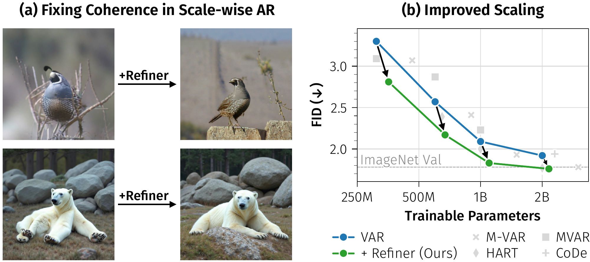
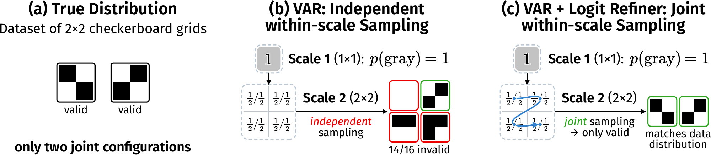
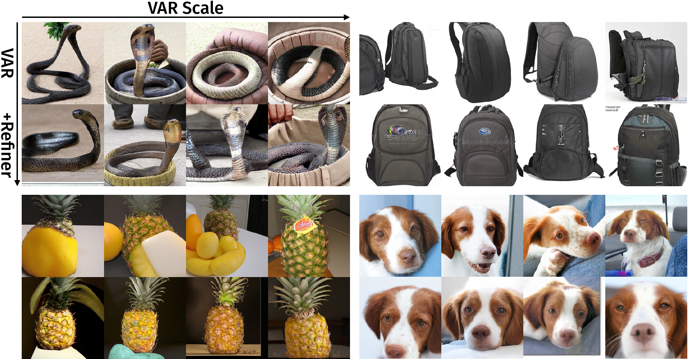
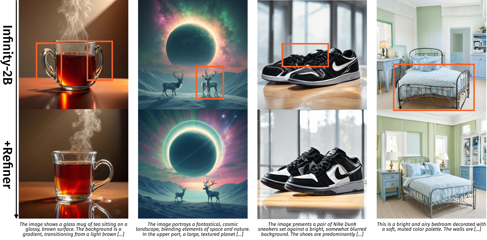
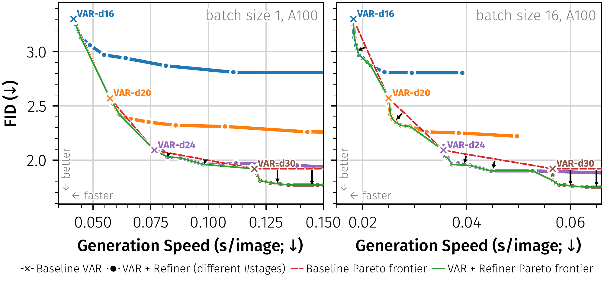

# AI Daily

## Logit Refiner：修正 Visual Autoregressive Model 的同尺度獨立採樣

**研究日期：2026-09-12**　　**作者：Manus AI**

> **一句話結論：** Logit Refiner 的核心洞見不是「VAR 需要更大的 backbone」，而是「VAR 的同尺度並行解碼把正確的 marginal 重新拼成錯誤的 joint sample」。作者在凍結的 VAR 特徵上加一個小型 causal Transformer，僅以同尺度內的順序採樣補回被丟失的空間依賴；在 ImageNet 256×256 上，1.1B 參數的 VAR-d24 + Refiner 以 FID 1.83 超越 2.0B 的原始 VAR-d30（FID 1.92），同時保留 scale-wise generation 的大部分效率優勢。[1] [2]

## 1. 論文基本資訊

| 欄位 | 內容 |
|---|---|
| 論文標題 | *Logit Refiner: Improving Visual Autoregressive Models via Intra-Scale Dependency Modeling* |
| 作者 | Meimingwei Li、Stefan Andreas Baumann、Felix Krause、Björn Ommer |
| 研究單位 | CompVis @ LMU Munich；Munich Center for Machine Learning（MCML） |
| 發表狀態 | arXiv:2609.11804v1；arXiv 頁面標示 **ECCV 2026** |
| 提交時間 | 2026-09-10 |
| 研究領域 | Visual Autoregressive Models、next-scale prediction、autoregressive image generation、text-to-image |
| 官方專案頁 | [compvis.github.io/logit-refiner](https://compvis.github.io/logit-refiner/) |
| 官方程式碼 | [CompVis/logit-refiner](https://github.com/CompVis/logit-refiner) |

### 為何選這篇

本篇是本次搜尋中最值得納入 AI Daily 的新論文。它直接落在使用者近期偏好的 **VAR-based generation**，又把常見的「再加深、再加寬、再訓練」問題，重新定位為生成規則本身的條件獨立假設。論文提交日期距今天僅兩天，且 repository 的既有索引已收錄 EBT、JEPA、attention modulation、training-free 與多篇 VAR 工作，但尚未收錄 arXiv:2609.11804，因此不會與既有文章重複。[1]

## 2. 背景：VAR 為什麼快，但為什麼會出現局部不一致

傳統 raster-scan autoregressive image model 逐一生成所有 token。這種做法能直接表達 joint distribution，卻需要對很長的 token sequence 反覆執行大型模型。VAR 將問題改寫成 coarse-to-fine 的 **next-scale prediction**：先預測低解析度尺度，再逐步預測更高解析度尺度，且同一尺度中的 token 平行產生。原始 VAR 論文將這個設計視為影像版的 next-token prediction，並在 ImageNet 256×256 報告明顯的品質、速度與 scaling 優勢。[3]

問題是，平行化不只減少計算，也改變了機率分解。令第 $k$ 個尺度的離散 token map 為

$$
\mathbf r_k=(r^{(k)}_1,\ldots,r^{(k)}_{L_k}),
\qquad L_k=h_kw_k,
$$

其中 $h_k\times w_k$ 是該尺度的空間解析度。VAR 先做跨尺度分解：

$$
p(\mathbf r_{1:K})=
\prod_{k=1}^{K}p_\theta(\mathbf r_k\mid\mathbf r_{<k}).
$$

在第 $k$ 個尺度，backbone $f_\theta$ 由前面尺度產生每個位置的 hidden state：

$$
\mathbf h^{(k)}=f_\theta(\mathbf r_{<k}).
$$

原始平行解碼接著以近似方式獨立抽樣：

$$
p_\theta(\mathbf r_k\mid\mathbf r_{<k})
\approx
\prod_{i=1}^{L_k}p_\theta\left(r^{(k)}_i\mid\mathbf h^{(k)}\right).
\tag{1}
$$

論文把式（1）稱為 **mean-field-style approximation**。它不是說 Transformer 沒有看見同尺度的其他位置；VAR backbone 的 bidirectional attention 仍然可以在平行 forward 中聚合空間資訊。真正丟失的是 forward 之後的 **joint sampling**：每個 token 已經有一個合理的 marginal distribution，但 sampling 時彼此不再互相條件化。

論文的 $2\times2$ checkerboard toy example 很清楚地說明這一點。若資料只允許兩種合法 checkerboard，模型可能學到每個位置都是 $50\%$ 黑、$50\%$ 白的正確 marginal；然而四個位置獨立抽樣會產生 $2^4=16$ 種 joint outcome，其中大多數不是合法 checkerboard。也就是說，**正確的逐 token 機率不保證正確的聯合樣本**。[1]

## 3. 核心貢獻與創新點

| 貢獻 | 技術意義 |
|---|---|
| 把 VAR 的局部不一致定位為 decoding-rule bottleneck | 論文主張問題不是單純容量不足，而是同尺度獨立抽樣遺漏了空間 joint distribution。即使 backbone 變大，這個 factorization 仍會存在。 |
| 提出 Logit Refiner | 在 frozen backbone hidden states 上加一個小型 causal Transformer，讓同尺度 token 以 raster order 順序抽樣。 |
| 只建模 residual dependency | backbone 已經提供跨位置的豐富表示，refiner 不需要重新理解整張圖，只需要學習 independent decoder 沒有表達的剩餘依賴。 |
| 以 identity initialization 連接原模型 | 訓練初期 refiner 等價於原始 VAR，降低突然改變 sampling distribution 的風險，並讓優化集中於 residual correction。 |
| 跨模型規模與任務驗證 | 在 310M–2B 的 VAR backbone、ImageNet class-conditional generation，以及 Infinity-2B text-to-image 上都觀察到改善。 |

## 4. 方法詳解

### 4.1 從 mean-field decoder 回到同尺度 joint distribution

Logit Refiner 用 $q_\phi$ 取代式（1）的同尺度獨立抽樣：

$$
q_\phi(\mathbf r_k\mid\mathbf r_{<k})
=
\prod_{i=1}^{L_k}
q_\phi\left(
 r^{(k)}_i
 \mid
 r^{(k)}_{<i},\mathbf h^{(k)}_{\le i},\mathbf r_{<k}
\right).
\tag{2}
$$

其中 $r^{(k)}_{<i}$ 是本尺度中已經抽出的 token，$\mathbf h^{(k)}_{\le i}$ 表示目前位置可使用的 backbone hidden states。把式（2）代回跨尺度分解後，整個模型變成

$$
 p(\mathbf r_{1:K})
 \approx
 \prod_{k=1}^{K}q_\phi(\mathbf r_k\mid\mathbf r_{<k}).
 \tag{3}
$$

這個設計保留了 VAR 的 **跨尺度平行化**，只在每一個尺度內對小型 refiner 執行 sequential sampling。它與從頭建立一個 fully token-wise autoregressive image model 不同：昂貴的 backbone 仍然每個尺度只 forward 一次。

### 4.2 Refiner 的輸入與 causal Transformer

對第 $k$ 個尺度的第 $i$ 個位置，refiner 將 frozen backbone hidden state 與前一個已抽出的 token embedding 結合：

$$
\mathbf c^{(k)}_i=
\begin{cases}
\mathbf z_{\mathrm{sos}}, & i=1,\\
\operatorname{emb}_\phi\left(r^{(k)}_{i-1}\right), & i>1,
\end{cases}
$$

$$
\mathbf z^{(k)}_i
=\mathbf W_{\mathrm{proj}}
\left[\mathbf h^{(k)}_i\Vert\mathbf c^{(k)}_i\right].
\tag{4}
$$

$\Vert$ 表示 concatenation，$\mathbf z_{\mathrm{sos}}$ 是 learned start-of-sequence vector，$\operatorname{emb}_\phi$ 是 token embedding。接著以 causal mask 通過少量 Transformer blocks：

$$
\widetilde{\mathbf h}^{(k)}_i
=\operatorname{TransformerBlocks}_\phi
\left(\mathbf z^{(k)}_{1:i}\right).
\tag{5}
$$

最後由 output head 產生 logits 並抽樣：

$$
\widetilde{\boldsymbol\ell}^{(k)}_i
=\operatorname{head}_\phi
\left(\widetilde{\mathbf h}^{(k)}_i\right),
\qquad
r^{(k)}_i\sim
\operatorname{Cat}\left(
\operatorname{softmax}(\widetilde{\boldsymbol\ell}^{(k)}_i)
\right).
\tag{6}
$$

論文預設 $d_r=2$ 個 refiner blocks，而 VAR backbone 深度是 $d\in[16,30]$。這個深度差距反映模型的 inductive bias：backbone 負責大部分視覺語義與空間理解，refiner 只負責補足 residual dependency。

作者以 raster-scan 作為同尺度的 token order，但 Appendix A.3 顯示 column-major、alternate、spiral-in 與 spiral-out 也都保留相近的改善。因此，效果不太像是單純依賴某一個特殊掃描順序，而是來自「抽樣時重新加入條件依賴」這件事本身。[1]

### 4.3 Teacher forcing、cross-entropy 與 identity initialization

訓練時使用 teacher forcing，以 ground-truth token 取代已抽出的 $r^{(k)}_{<i}$。因此雖然推理是 sequential，訓練仍可在所有位置與尺度上平行計算。Loss 為

$$
\mathcal L(\phi)
=
-\sum_{k=1}^{K}\sum_{i=1}^{L_k}
\log q_\phi\left(
 r^{(k)}_i
 \mid
 r^{(k)}_{<i},\mathbf h^{(k)}_{\le i},\mathbf r_{<k}
\right).
\tag{7}
$$

VAR backbone $f_\theta$ 全程 frozen，只優化 $\phi$。為了使 refiner 在訓練初始階段重現原始 VAR，作者採用三個 identity-oriented 初始化設計：複製 base output head 與 token embedding；令

$$
\mathbf W_{\mathrm{proj}}\leftarrow[\mathbf I\;\Vert\;\mathbf 0];
$$

並將 Transformer block 的 attention 與 feed-forward output projection 設為零。如此一來，refiner 起點等價於原始 VAR，而學習訊號主要負責把 independent distribution 修正為 joint distribution。這個初始化也使訓練初期的品質不會突然崩潰。[1]

### 4.4 計算成本：不是完全 training-free，也不是完全 token-wise AR

Logit Refiner 需要額外訓練，因此不能稱為完全 **training-free**。它是 **frozen-backbone post-training**：原始 backbone 不重訓，但仍需在其 hidden states 上訓練一個小型 refiner。推理時，同尺度內的 refiner 是 sequential，這確實增加 latency；不過 backbone 仍是一個尺度一次的平行 forward，且 refiner 使用 KV cache。

對 VAR-d16，訓練 frozen-backbone refiner 需要 66 H200-hours；從頭訓練整合模型則需 1,845 H200-hours。推理時只精煉早期尺度可以大幅降低成本：精煉至 $8\times8$ 或 $10\times10$ tokens，分別保留完整 FID 改善的 88% 與 99%，同時讓 refiner overhead 降低 84% 與 71%。[1] [2]

## 5. 實驗結果

### 5.1 受控消融：改善來自 joint modeling，而非容量

這組消融是論文最重要的證據之一。所有變體都從同一個 pretrained VAR-d16 出發，並比較額外訓練、同樣大小但 bidirectional 的 parallel refiner，以及真正使用 causal attention + autoregressive sampling 的版本。

| 變體 | 是否建模 joint dependency | 參數量 | ImageNet FID ↓ |
|---|---:|---:|---:|
| VAR-d16 baseline | 否 | 310M | 3.30 |
| 額外訓練 30 epochs | 否 | 310M | 3.12 |
| Parallel Refiner，bidirectional attention | 否 | 356M | 3.15 |
| **AR Refiner，causal + sequential sampling** | **是** | **356M** | **2.81** |

這個對照排除了兩個常見替代解釋：單純增加參數不夠，單純延長訓練也不夠。只有把同尺度的 joint sampling 恢復回來，才產生大幅改善。[1]

另一組設計消融顯示 $d_r=0$、也就是沒有額外 Transformer block、只靠 autoregressive context 與可訓練 head，FID 已從 3.30 降到 3.02；$d_r=2$ 時達到 2.81，而 $d_r=4$ 與 $d_r=8$ 沒有繼續改善。這支持「sampling factorization 是主效應，額外深度只是輔助」的解讀。

### 5.2 ImageNet 256×256 的主要結果

論文使用 50k generated samples，並依照 VAR 設定掃描 CFG 與 top-$k$。下表列出原始 VAR 與加上 Logit Refiner 的直接比較；FID 越低越好，Recall 越高通常表示生成分佈覆蓋更完整。

| Backbone | 原始參數 | 原始 FID | 加 Refiner 後參數 | 加 Refiner 後 FID | FID 改善 | Recall：原始 → Refiner |
|---|---:|---:|---:|---:|---:|---:|
| VAR-d16 | 310M | 3.30 | 356M | **2.81** | 0.49 | 0.51 → **0.56** |
| VAR-d20 | 600M | 2.57 | 671M | **2.17** | 0.40 | 0.56 → **0.60** |
| VAR-d24 | 1.0B | 2.09 | 1.1B | **1.83** | 0.26 | 0.57 → **0.63** |
| VAR-d30 | 2.0B | 1.92 | 2.2B | **1.76** | 0.16 | 0.58 → **0.62** |

值得注意的是，1.1B 的 VAR-d24 + Refiner 已經超越 2.0B 的原始 VAR-d30。這不是宣稱它超越所有 image generator；同一篇論文的 extended table 中，FlowAR 的 FID 是 1.65、MAR-H 是 1.55，因此更準確的結論是：**在相同 VAR backbone family 內，修正 decoding rule 比單純把 backbone 從 1.0B 放大到 2.0B 更有效率。** [1]

原始 VAR 在更大的模型上仍會出現「texture soup」、同類別物體互相融合，以及鄰近 patch 結構不一致等 failure modes。Refiner 的作用不是使每個 marginal 更尖銳，而是使同一尺度內抽出的 token 能彼此協調，因此會改善局部結構與多樣性。論文報告所有 backbone scale 的 Recall 都上升 0.04–0.06；FID 最佳化時的 IS 下降則主要與較低的 CFG 設定有關，而不是單純代表 sample quality 變差。[1]

### 5.3 文字到圖像：Infinity-2B

為了測試方法是否只適用於 class-conditional VAR，作者將 Logit Refiner 接到 Infinity-2B。Infinity 是 CVPR 2025 的 bitwise visual autoregressive model，以 bitwise token prediction、infinite-vocabulary classifier 與 bitwise self-correction 支援高解析度 text-to-image。[4]

作者在 FLUX-6M captions/images 上訓練 frozen Infinity-2B 的 refiner 100k steps，約需 640 H200-hours，並只在前期、最多到 $6\times6$ token stages 使用 refinement。HPSv3 的平均分數由 9.79 提升至 9.91；12 個 prompt subsets 中，Animals、Architecture、Arts、Characters、Design、Food、Natural Scenery、Plants、Products、Science、Transportation 等類別的逐項結果也由論文 Table 4 列出。[1] [2]

這個結果的意義不是 refiner 取代 Infinity 的 bitwise design，而是說 **mean-field bottleneck 可能是 scale-wise visual generation 的結構性問題**。即使 backbone 從離散 codebook VAR 變成 bitwise Infinity，同尺度內的獨立 sampling 仍可能遺失 joint dependency；因此 correction module 可以跨 backbone variant 轉移。[1] [4]

### 5.4 品質—效率折衷

推理時的核心 trade-off 是：精煉越多尺度，通常得到越完整的品質改善，但 sequential overhead 也越高。論文的 stage ablation 顯示早期尺度最重要，而早期尺度恰好 token 最少，因此「只在早期尺度使用 refiner」具有合理的成本結構。這使它不像一個必須把整個模型改造成 raster-scan AR 的昂貴方案，而更像一個可調整的 inference-time quality knob。[1] [2]

## 6. 相關研究與定位

| 研究 | 解決的問題 | 與 Logit Refiner 的關係 |
|---|---|---|
| VAR，NeurIPS 2024 | 以 coarse-to-fine next-scale prediction 取代完整 raster-scan AR | Logit Refiner 接受 VAR 的跨尺度 factorization，只修正同尺度 decoding。VAR 是生成效率的起點。[3] |
| Infinity，CVPR 2025 | 以 bitwise AR、infinite-vocabulary classifier 與 self-correction 做高解析度 text-to-image | Logit Refiner 可作為 Infinity 的 frozen-backbone add-on，顯示問題不只存在於原始 discrete VAR。[4] |
| Visual Self-Refinement，arXiv:2510.00993 | 生成完整序列後，以全序列 embedding 的 post-processing 進行共同優化 | 它偏向 global post-hoc refinement；Logit Refiner 在每一個尺度的生成迴圈中以 causal sampling 修正 local joint dependency。[5] |
| HMAR、M-VAR、MVAR、FastVAR、FlowAR 等 | 改變 backbone、token representation、masked AR 或 inference cost | 這些方法與 Logit Refiner 多數是 orthogonal。論文指出把 refiner 與其他 VAR 改良組合是後續方向，而不是本實驗已證實的結果。[1] |

### 與使用者偏好方向的連接

這篇論文並沒有宣稱自己是 Energy-Based Transformer、JEPA、training-free 或 attention modulation 方法，因此不應把這些標籤當作論文的實際貢獻。不過，它提供了一個很適合延伸的介面。

第一，refiner 的 categorical logits 可以被視為一個局部 compatibility score。未來可以將 token pair、region consistency 或 frequency consistency 寫成 energy term，讓抽樣近似求解

$$
\hat{\mathbf r}_k
=\arg\min_{\mathbf r_k}
\left[
E_{\mathrm{VAR}}(\mathbf r_k\mid\mathbf r_{<k})
+\lambda E_{\mathrm{spatial}}(\mathbf r_k)
\right],
$$

再比較它與單純 causal refiner 的品質—成本曲線。這是 **Energy-based steering 的研究構想**，不是本論文已做的實驗。

第二，JEPA 可以被接在 frozen hidden state 或 refiner hidden state 上，作為 predictive consistency critic：若相鄰尺度的 latent prediction 在加上新 token 後出現不一致，便把 disagreement 轉成 refiner 的額外校正訊號。這會把本篇的「局部 joint sampling」推向「跨尺度 latent prediction consistency」，但仍需明確區分 trained critic 與真正 training-free controller。

第三，Logit Refiner 的 early-scale result 暗示 attention modulation 不必平均施加到所有尺度。更合理的策略可能是以 uncertainty、attention entropy 或 token disagreement 決定在哪些 scale 啟用 modulation。這與 repository 已有的 training-free VAR acceleration / attention modulation 系列互補，但本篇方法本身仍需要訓練一個 refiner。

## 7. 個人評價與研究意義

### 評價一：它把「模型不夠大」改寫成「機率分解不完整」

我認為本篇最有價值的地方，是它用一個非常小的 $2\times2$ counterexample 拆穿了常見直覺：如果每個 token 的 prediction 都正確，那為什麼圖片仍會局部崩壞？答案是 marginal correctness 與 joint correctness 不是同一件事。這種問題診斷比再提出一個更大的 VAR backbone 更容易產生可轉移的研究方法論。

### 評價二：消融設計比單一 SOTA 數字更有說服力

FID 1.83 本身不是全領域最佳，但「額外訓練只到 3.12、同參數 parallel refiner 只到 3.15、causal AR refiner 到 2.81」這組控制實驗直接指向 joint modeling。它把 capacity、training duration 與 decoding rule 分開，因此讓論文的因果解釋比只報一個大模型結果更可信。[1]

### 評價三：它不是 training-free，但有實際 deployment 價值

Logit Refiner 需要額外訓練，且推理時有 sequential overhead，所以不能包裝成 zero-cost 或 training-free。它真正的優勢是只訓練小模組、保留既有 backbone、可選擇只修正 early scales，並把品質改善放在既有生成系統上。對已經投入大量成本訓練 VAR / Infinity 的團隊而言，這種 post-training adapter 比重訓 backbone 更容易落地。

### 最值得延伸的問題

我會優先研究 **non-autoregressive joint sampling**。Logit Refiner 已經證明 joint dependency 重要，但它選擇以 sequential causal Transformer 恢復依賴，因此仍受到同尺度 token 數量的限制。下一步可探索 masked parallel refinement、energy-based fixed-point update、diffusion-style denoising over token groups，或以 JEPA-like predictive disagreement 決定只重算不一致區域。若能在不恢復完整 sequential decoding 的前提下近似式（2），將可能同時取得 VAR 的速度與 joint sample 的一致性。

## 8. 限制與可重現性注意事項

| 注意事項 | 影響 |
|---|---|
| 論文在本次報告日期仍是 2026-09-10 的 arXiv v1 | 雖然 arXiv comments 標示 ECCV 2026，但 repository 應保留預印本版本與數字，不把所有結果誤寫成已正式出版的 final version。 |
| 需要訓練 refiner | 不能稱為完全 training-free 或 zero-shot training。Frozen backbone 只代表原模型不更新。 |
| 推理引入同尺度 sequential sampling | batch size 1 時 latency overhead 更明顯；應依部署情境選擇 early-scale refinement。 |
| FID、IS、precision、recall 的 trade-off 受 CFG/top-$k$ 影響 | 不應只拿 FID 或只拿 IS 判斷；論文對每個 backbone 個別掃描 CFG 與 top-$k$。 |
| Infinity 的 text-to-image 結果只用 600 個 HPSv3 prompts | HPSv3 結果是自動偏好分數，不能等同全面的人類評測或所有提示分佈的品質結論。 |
| 本篇尚未展示與所有 VAR 改良的組合結果 | 與 HART、MVAR、FlowAR、FastVAR 或 training-free acceleration 的聯合效果仍是待驗證問題。 |

## 9. 結論

Logit Refiner 的研究訊息可以濃縮成一句話：**scale-wise autoregression 的瓶頸可能不是 backbone 沒有理解空間關係，而是 sampling rule 在最後一步把這些關係丟掉了。** 透過一個約 10% 參數、兩層 causal Transformer 的 frozen-backbone add-on，作者在 310M–2B VAR backbone 上持續改善 FID 與 recall，並將改善轉移到 Infinity-2B text-to-image。[1] [2]

對 AI Daily 的研究脈絡而言，這篇工作特別值得與 Energy-Based Transformer 的 energy minimization、JEPA 的 predictive consistency、VAR 的 scale-wise factorization，以及 training-free attention modulation 放在同一張研究地圖上。它不直接完成這些方向，但明確指出一個可實驗化的接口：**在不重訓大型生成 backbone 的情況下，如何以更便宜的 joint-consistency controller 修正生成分佈。**

## References

[1]: https://arxiv.org/html/2609.11804v1 "Logit Refiner: Improving Visual Autoregressive Models via Intra-Scale Dependency Modeling"

[2]: https://compvis.github.io/logit-refiner/ "Logit Refiner official project page"

[3]: https://neurips.cc/virtual/2024/poster/94115 "Visual Autoregressive Modeling: Scalable Image Generation via Next-Scale Prediction"

[4]: https://openaccess.thecvf.com/content/CVPR2025/html/Han_Infinity_Scaling_Bitwise_AutoRegressive_Modeling_for_High-Resolution_Image_Synthesis_CVPR_2025_paper.html "Infinity: Scaling Bitwise AutoRegressive Modeling for High-Resolution Image Synthesis"

[5]: https://arxiv.org/html/2510.00993v1 "Visual Self-Refinement for Autoregressive Models"

[6]: https://github.com/CompVis/logit-refiner "Official Logit Refiner code repository"

---

**圖片說明：** 本報告使用官方 project page 的局部圖資放入 `asset/`；同時依照 repository 指定流程，使用 `/home/ubuntu/skills/pdf-image-extractor/` 從論文 PDF 提取原生圖片並檢查圖表內容，沒有使用整個瀏覽器畫面的截圖。
