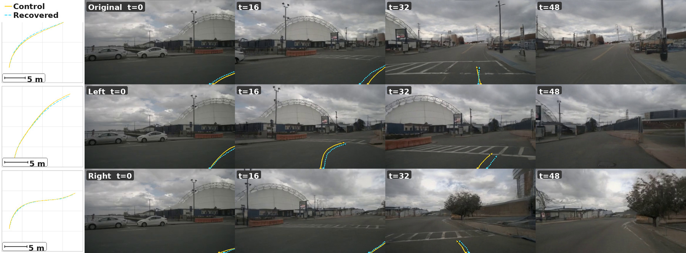

# AI Daily

> **研究日期：** 2026-09-04　　**整理：** Manus AI　　**主題：** Camera-Controlled Video Generation、Geometry-Aware Attention、Metric RoPE、Attention Modulation、World Models

## MeRoPE: Metric Rotary Position Embedding for Camera-Controlled Video Generation

## 一、論文基本資訊

| 欄位 | 內容 |
|---|---|
| 論文標題 | *MeRoPE: Metric Rotary Position Embedding for Camera-Controlled Video Generation* |
| 方法名稱 | **MeRoPE（Metric Rotary Position Embedding）** |
| 作者 | Zhijian Qiao、Xinjiang Wang、Jiajie Chen、Haoming Huang、Meng Li、Chih-Chung Chou、Jing Wang、Shaojie Shen |
| 研究單位 | The Hong Kong University of Science and Technology、Zhuoyu Technology |
| 發表狀態 | **arXiv:2609.01252v1，2026-09-01；目前頁面未標示正式會議接收** [1] |
| 評估 backbone | Wan2.2 TI2V-5B；PanShot 另以 Wan2.1-T2V-1.3B 做 matched-backbone 實驗 |
| 評估資料 | nuScenes driving benchmark、PanShot camera-diverse benchmark |
| 核心問題 | 如何在 Transformer attention 中同時保留真實世界的 metric translation、token-level ray geometry 與跨大位移的數值穩定性 |
| 主要結果 | nuScenes CamMC **2.32**、FID **19.82**、FVD **134.15**；PanShot 在 conditioning normalization 開啟時 TransErr **10.99**、CamMC **13.88** [1] |
| 專案頁面 | [MeRoPE project page][2] |
| 程式碼狀態 | 論文摘要表示 code will be made publicly available，本文撰寫時不將其視為已公開程式碼 [1] |

### 為什麼今天選它

今天先檢查 `KaiCobra/AI_Daily` 的既有 151 篇索引與最新的 FDS、ChebBooster、VISTA 等文章，再將 2026 年 9 月初的候選論文與 repo 去重。SolarWM 具有開放資料引擎、跨 backbone world model 與 hour-scale rollout；H3-World 則以少量 LoRA 把 MiniMax-H3 的語言理解轉成 world control；MeRoPE 的優勢在於它直接把一個常被當成工程細節的問題形式化：**當 camera translation 進入 attention 時，為何大 baseline 會讓 logit 和 feature norm 失控？**

| 候選 | 新穎性與研究價值 | 與本 repo 的重疊 | 最終判斷 |
|---|---|---|---|
| SolarWM | 1.43M clips、10 個資料集、四個 5B–33B backbone，從 5 秒訓練延伸至 minute-to-hour rollout | 與 V-RAE、LeVJEPA、Hydra-0、FreqForcing、TetherMem 的 world-model 主題較近 | 作為候選，不選主文 |
| H3-World | 8,000 gameplay samples、0.199% trainable parameters、latent-aligned textual action 與 temporal routing | 與既有互動式 world model 和 action-control 文章有部分重疊；主要結果偏短 horizon 與代表性案例 | 作為候選，不選主文 |
| **MeRoPE** | 形式化 metric-pose / factorization / norm-preservation 三難命題；以正交 rotation blocks 和 multi-frequency translation RoPE 解決；同時有 nuScenes、PanShot、消融與 FID/FVD | repo 尚未收錄 `MeRoPE` 或 arXiv:2609.01252 | **選入今日主文** |

一句話總結：**MeRoPE 把 camera control 從「把 pose 特徵加到 Transformer」改寫成「設計一個不會因物理位移尺度而爆炸的 pairwise attention operator」。** 它不是 training-free 方法，而是需要在 video DiT 上訓練相應 adapter；真正值得今日研究的是其 attention 幾何與穩定性原則，以及這些原則能否移植到 frozen backbone、VAR 或 JEPA controller。

## 二、研究背景：問題不只在於有沒有 camera condition

在 camera-controlled video generation 中，模型需要根據相機的旋轉、平移、內參與鏡頭畸變，產生符合指定視角軌跡的影片。早期方法通常把 camera pose 拼接到 feature，或透過額外 adapter、cross-attention、3D cache 及 rendering proxy 提供控制。CameraCtrl 將相機控制轉成可注入影片生成器的條件，Gen3C 則以 3D point-cloud cache 維持視角變化下的時序幾何一致性 [6] [7]。

MeRoPE 關注的是另一個更底層的介面：**pose condition 直接作用於 self-attention 的 query、key 和 value。** 這種設計不需要額外建立一個與 token 注意力平行的 camera branch，但也因此必須處理一個數值問題——如果 physical translation 以非正交的 homogeneous matrix 直接進入內積，camera baseline 越大，translation 項就越可能壓過內容相似度與旋轉幾何。

2026 年的 UCPE 將 6-DoF pose、intrinsics 與 lens distortion 統一成 Relative Ray Encoding，並以少於 1% trainable parameters 的 spatial attention adapter 注入預訓練 video DiT；這是 MeRoPE 最直接的比較脈絡 [3]。RayRoPE 則將沿 ray 的預測 3D 點與 query-frame projective coordinate 引入多視角 attention，並用期望位置編碼處理深度不確定性 [4]。MeRoPE 並不是否定這些工作，而是指出：即使 ray geometry 本身正確，**translation 的 scale stability** 仍需要單獨處理。

## 三、核心貢獻與創新點

### 3.1 將 camera geometry 寫成 pairwise attention operator

令 `a=(i,p)` 表示 camera `i` 的 patch `p`，`b=(j,q)` 表示 camera `j` 的 patch `q`。對應的 query、key、value 向量為 \(q_a,k_b,v_b\in\mathbb{R}^d\)。MeRoPE 把幾何條件寫成 pairwise transformation \(U_{ab}\)，因此 attention 為

$$
s_{ab}=\frac{q_a^\top U_{ab}k_b}{\sqrt d},
\qquad
\alpha_{ab}=\frac{\exp(s_{ab})}{\sum_{b'}\exp(s_{ab'})},
\qquad
y_a=\sum_b\alpha_{ab}U_{ab}v_b.
$$

這個寫法有一個重要含義：幾何資訊不只是額外 condition token，而是同時改變 **query-key similarity** 與 **value aggregation**。因此，設計 `U_ab` 時，既要讓 attention 看見相對相機幾何，也要避免 transformation 把 feature norm 或 logit 放大。

### 3.2 Homogeneous projective encoding 的尺度問題

相機 `i` 與 `j` 的相對 pose 可寫為

$$
R_{ij}=R_i^\top R_j,
\qquad
\Delta o_{j\mid i}=R_i^\top(o_j-o_i),
$$

其中 `R_i` 是 camera-to-world rotation，`o_i` 是 optical center。以 GTA 類 homogeneous operator 為例，將 3D feature 與 scalar coordinate 寫成 \([u_q;h_q]\) 和 \([u_k;h_k]\)，camera block 的內積為

$$
\begin{bmatrix}u_q\\h_q\end{bmatrix}^{\!\top}
\begin{bmatrix}R_{ij}&\Delta o_{j\mid i}\\0^\top&1\end{bmatrix}
\begin{bmatrix}u_k\\h_k\end{bmatrix}
=
 u_q^\top R_{ij}u_k
 +h_k u_q^\top\Delta o_{j\mid i}
 +h_qh_k.
$$

問題在第二項。當 \(\|o_j-o_i\|_2\) 變大時，未正規化的 \(u_q^\top\Delta o_{j\mid i}\) 會近似線性增長；它可能在 softmax 前主宰 logit，令模型錯把「距離很遠」當成強烈匹配。同一個非正交矩陣作用在 value 上，也會產生

$$
\left\|
\begin{bmatrix}R_{ij}u_v+h_v\Delta o_{j\mid i}\\h_v\end{bmatrix}
\right\|_2^2
=
\|R_{ij}u_v+h_v\Delta o_{j\mid i}\|_2^2+h_v^2,
$$

因此 value feature norm 同樣可能隨 baseline 無界增加 [1]。論文在訓練好的 baseline 上觀察到，當 forward-driving baseline 增大時，UCPE 對 distant early frames 分配的 temporal attention mass 上升，而 MeRoPE 避免了這種由 baseline 驅動的 shift [1]。

### 3.3 三難命題：metric fidelity、per-token factorization、norm preservation

作者把 camera encoding 的目標整理成三個性質。第一，**完整且與深度無關的 metric relative-pose dependence**，保留相對旋轉、平移方向和 physical scale；第二，**strict per-token factorization**，讓每個 token 的 query/key transformation 可以獨立計算；第三，**norm preservation**，使 encoding 不會因 baseline 增加而放大 feature 和 attention logit。

論文 Theorem 1 指出，在 continuous finite-dimensional 的 matrix-valued positional operator 中，這三者不能同時滿足：若 operator 同時是嚴格 per-token、具 unitary/orthogonal 性質，又要對完整 metric translation 敏感，translation 會被迫退化成無法表達一般 metric translation 的有限頻率表示 [1]。這不是宣稱所有 camera-control 方法都不可能成功，而是指出設計空間的結構性限制。

MeRoPE 的取捨很清楚：保留 **A：完整 metric pose** 和 **C：norm preservation**，放寬 **B：strict per-token factorization**，以 query-camera grouping 允許較局部、成組的相機操作。這個 trade-off 是全文最值得轉移到其他模型的概念。

### 3.4 Ray-local minimum rotation：先把每個 patch 放進自己的 3D frame

每個 patch 先透過 camera calibration 轉成 camera coordinate 中的 unit viewing ray \(d^c_{i,p}\in\mathbb{S}^2\)。相較只編碼整張影像的 camera pose，ray-local frame 讓不同 patch 對應到不同 viewing direction，因而可以處理 heterogeneous optics。

令 optical axis 為 \(e_z\)，定義

$$
 v_{i,p}=e_z\times d^c_{i,p},
 \qquad
 c_{i,p}=e_z^\top d^c_{i,p}.
$$

以 Rodrigues minimum-rotation 公式把 `e_z` 旋到該 ray：

$$
 A_{i,p}=I+[v_{i,p}]_\times
 +\frac{[v_{i,p}]_\times^2}{1+c_{i,p}}.
$$

這個 operator 屬於 \(SO(3)\)，所以不會改變向量 norm。兩個 ray 的相對方向被寫成

$$
 A_{i,p}^\top R_i^\top R_j A_{j,q},
$$

並重複放入多個 3D rotation blocks：

$$
 U^{\mathrm{rot}}_{ab}
 =\bigoplus_{k=1}^{m}
 \left(A_{i,p}^\top R_i^\top R_j A_{j,q}\right).
$$

直覺上，這一步把「不同 patch 的 ray 方向差異」轉為 feature space 中的旋轉，而不是以任意 magnitude 的加法偏置描述。論文也指出，該 MinRot frame 只在 ray 完全朝向 backward direction 時奇異，退化範圍比某些以 vertical angle 建構的 cross-product frame 更窄 [1]。

### 3.5 Metric translation RoPE：保留距離，但只改變 phase

MeRoPE 不把 \(\Delta o_{j\mid i}\) 直接放進 homogeneous block，而是把三個 translation coordinate 映射成多頻率 rotary phase。給定最小與最大 wavelength \(\lambda_{\min},\lambda_{\max}\)，建立 `K` 個 logarithmically spaced wavelengths：

$$
\lambda_k=\lambda_{\min}
\left(\frac{\lambda_{\max}}{\lambda_{\min}}\right)^{k/(K-1)},
\qquad
\omega_k=\frac{2\pi}{\lambda_k},
\quad k=0,\ldots,K-1.
$$

對每一個 Cartesian axis \(c\in\{x,y,z\}\)，以角度 \(\omega_k[\Delta o_{j\mid i}]_c\) 旋轉一個 2D feature subspace：

$$
\operatorname{Rot}(\theta)=
\begin{bmatrix}
\cos\theta&-\sin\theta\\
\sin\theta&\cos\theta
\end{bmatrix},
$$

$$
U^{\mathrm{trans}}_{ij}
=\bigoplus_{c\in\{x,y,z\}}
 \bigoplus_{k=0}^{K-1}
 \operatorname{Rot}\!\left(\omega_k[\Delta o_{j\mid i}]_c\right).
$$

因為每個 `Rot` 都是正交矩陣，translation 仍以 phase 形式保留 metric information，但不會像線性加法那樣把 feature magnitude 直接推大。這是 MeRoPE 與「先 normalize translation」方法的差別：後者通常犧牲 physical scale；MeRoPE 嘗試保留 scale，並把穩定性放在 operator 的正交性上。

### 3.6 Disparity-anchored spherical encoding：以 epipolar arc 提供對應候選

只知道相對 pose 和 ray direction，並不能保證模型知道兩個 token 是否來自同一個 static 3D point。因此 MeRoPE 另外建立 disparity anchors，但不直接預測唯一深度。

先將 key ray 方向轉到 query camera frame：

$$
 u_\infty=R_i^\top R_j d^c_{j,q}.
$$

對非零 baseline，令 epipole 方向為

$$
 e=\frac{\Delta o_{j\mid i}}{\|\Delta o_{j\mid i}\|_2},
$$

再以球面上的 great-circle arc 連接 `u_infty` 和 `e`。令

$$
 \hat t=\frac{e-(e^\top u_\infty)u_\infty}
 {\|e-(e^\top u_\infty)u_\infty\|_2},
 \qquad
 \beta_{\max}=\arccos(e^\top u_\infty).
$$

對 disparity fractions \(\rho_\ell\in[0,1]\) 取離散 anchor：

$$
 u_{i,\beta_\ell}
 =\cos(\rho_\ell\beta_{\max})u_\infty
 +\sin(\rho_\ell\beta_{\max})\hat t.
$$

每個 anchor 都透過 Rodrigues rotation 產生一個候選 frame，並以 query ray frame 和該候選 frame 的相對旋轉構成

$$
 U^{\mathrm{disp}}_{(i,p),(j,q)}
=\bigoplus_{\ell=1}^{L}
 \bigoplus_{k=1}^{n}
 \left(A_{i,p}^{\top}A_{i,\beta_\ell}\right).
$$

這些 anchors 是固定的 geometric knots，不是彼此互斥的 correspondence prediction。網路仍需依靠 visual content 判斷哪一個候選方向合理；這使它比固定 metric-depth anchor 更不依賴資料集尺度，也避免在沒有 depth estimator 時硬做 pixel-plane reprojection。

### 3.7 完整 operator 與實作分配

完整 MeRoPE operator 是四個 orthogonal sub-block 的 direct sum：

$$
U_{ab}
=U^{\mathrm{disp}}_{ab}
 \oplus U^{\mathrm{rot}}_{ab}
 \oplus U^{\mathrm{trans}}_{ij}
 \oplus U^{\mathrm{native}}.
$$

因此

$$
U_{ab}^{\top}U_{ab}=I,
$$

保證 operator 不改變 feature norm，也使 attention logit 不會因 physical translation baseline 本身而被無界放大。主實作的 attention head dimension 為 `d=128`，分配為

| 子區塊 | 維度 | 作用 |
|---|---:|---|
| Disparity | 36 | `L=6` 個 disparity fractions，每個配 `n=2` 個 3D triplets |
| Ray-local rotation | 36 | `m=12` 個 3D rotation triplets |
| Metric translation | 24 | 三個軸、`K=4` 個 logarithmic wavelengths，範圍約 `0.5–200 m` |
| Native RoPE | 32 | 保留 backbone 的 temporal 與 image-plane `(x,y)` RoPE |
| **總計** | **128** | identity padding 讓不同子區塊維持固定 head dimension |

這種 channel partition 有一個工程上的好處：研究者可以在固定 attention width 下做 component-level ablation，而不必把「增加模型容量」誤認成「幾何編碼更有效」。

## 四、實驗結果

### 4.1 nuScenes：大 baseline 下的 camera controllability

論文在 matched Wan2.2 TI2V-5B backbone 上比較沒有 camera PE、GTA、PRoPE、UCPE、RayNova、RayRoPE、URoPE、CameraCtrl-style baseline 與 MeRoPE。使用 128 個代表性 trajectories 做 pose evaluation；rotation error 由 VGGT-Ω 從生成影片估計，並以 512 個 nuScenes clips、20,480 個 predicted frames 計算 FID，以及 512 個生成影片計算 FVD [1]。

| 方法 | rot° ↓ | tr% ↓ | AUC@3 ↑ | AUC@10 ↑ | CamMC ↓ | FID ↓ | FVD ↓ |
|---|---:|---:|---:|---:|---:|---:|---:|
| No camera PE | 5.57 | 5.94 | 17.21 | 52.05 | 7.96 | 21.06 | 153.31 |
| UCPE | 1.39 | 2.95 | 41.21 | 78.38 | 2.45 | 20.20 | 136.40 |
| URoPE | 1.66 | **2.67** | **44.41** | **79.92** | 2.53 | 19.98 | 135.63 |
| **MeRoPE** | **1.37** | 2.84 | 42.11 | 79.47 | **2.32** | **19.82** | **134.15** |

> 表中指標取自 MeRoPE 原文 Table 2；CamMC 是作者用來聯合評估 rotation 與 translation trajectory 的主要指標 [1]。

相對 UCPE，MeRoPE 的 CamMC 從 2.45 降至 2.32，改善約 **5.3%**；相對無 camera PE，CamMC 下降約 **70.9%**。它同時取得最低的 rotation error、FID 和 FVD，但不應把這解讀為所有視覺品質指標都必然提升：這些是單一 matched protocol 下的 point estimates，且 pose 是由生成影片再經 VGGT-Ω 估計而來。更值得注意的是，URoPE 在 translation error 和 AUC 上較好，而 MeRoPE 的主要優勢集中在 joint CamMC、rotation error 以及整體 FID/FVD。

### 4.2 消融：三個 block 各自修補不同失真

| 變體 | Camera rotation | Metric translation | Disparity anchor | rot° ↓ | tr% ↓ | AUC@3 ↑ | AUC@10 ↑ | CamMC ↓ |
|---|:---:|:---:|:---:|---:|---:|---:|---:|---:|
| **MeRoPE** | ✓ | ✓ | ✓ | **1.37** | **2.84** | 42.11 | 79.47 | **2.32** |
| Rot. + trans. | ✓ | ✓ |  | 1.36 | 3.09 | 38.82 | 77.50 | 2.40 |
| Disparity + trans. |  | ✓ | ✓ | 1.66 | 2.88 | 40.60 | 78.82 | 2.56 |
| Disparity + rot. | ✓ |  | ✓ | 1.48 | 4.31 | **44.42** | **79.78** | 3.66 |
| Disparity only |  |  | ✓ | 1.59 | 4.01 | 43.19 | 79.53 | 3.56 |
| Rotation only | ✓ |  |  | 1.41 | 4.01 | 42.52 | 78.33 | 3.35 |
| Translation only |  | ✓ |  | 2.59 | 3.09 | 30.64 | 73.50 | 3.50 |

消融呈現相當乾淨的因果分工。移除 metric translation 後，translation error 和 CamMC 明顯惡化；只保留 disparity + rotation 甚至可以有較高 AUC，但 AUC 對 translation magnitude 不夠敏感，因此不能取代 metric translation。Ray-local rotation 主要改善方向與 rotation error；disparity anchors 則補足跨視角 tracking。完整模型不是單一「更大的 position embedding」，而是三種幾何訊號在固定 channel budget 下的互補組合 [1]。

### 4.3 PanShot：不同鏡頭與畸變下的 translation control

PanShot 包含 pinhole、wide-angle 和 fisheye optics。作者在相同 Wan2.1-T2V-1.3B backbone、相同 spatial attention adapter 和 10k training steps 下比較 272 個 test clips，並檢查 conditioning-pose near-depth normalization 開啟或關閉時的結果 [1]。

| Conditioning norm | 方法 | RotErr ↓ | TransErr ↓ | CamMC ↓ |
|---|---|---:|---:|---:|
| On | GTA | 5.14 | 19.85 | 22.59 |
| On | PRoPE | 5.10 | 20.38 | 23.02 |
| On | UCPE | 4.22 | 15.15 | 17.50 |
| On | **MeRoPE** | 4.57 | **10.99** | **13.88** |
| Off | GTA | 5.30 | 22.70 | 25.34 |
| Off | PRoPE | 5.11 | 23.04 | 25.58 |
| Off | UCPE | 4.40 | 17.91 | 20.13 |
| Off | **MeRoPE** | 4.82 | **12.66** | **15.56** |

在 conditioning normalization 開啟時，MeRoPE 的 TransErr 相對 UCPE 降低約 **27.5%**，CamMC 降低約 **20.7%**；關閉 normalization 後，兩者仍分別改善約 **29.3%** 與 **22.7%**。這支持作者的主要主張：MeRoPE 的穩定性不是完全依賴把 translation 先縮放到某個資料集範圍內，而是來自 operator 本身的 norm-preserving construction。

### 4.4 生成視覺結果

*圖：從 MeRoPE PDF 以 pdf-image-extractor 提取的 nuScenes camera-control qualitative figure。左側是 commanded / recovered bird’s-eye-view path，右側是 Original、Left、Right camera trajectories 在不同時間點的生成畫面；本圖只擷取論文圖像內容，未使用整頁螢幕截圖。原圖來自 MeRoPE 論文 [1]。*

圖像所呈現的重點不是單純「畫面看起來合理」，而是同一初始場景在不同 trajectory command 下，生成結果同時改變視角和路徑。這種 paired intervention 比單一 prompt 的 qualitative sample 更接近 controllability 評估：控制條件改變時，模型應該改變 camera trajectory，而不是只改變不可預期的外觀細節。

## 五、相關研究分析

### 5.1 從 GTA、PRoPE 到 UCPE：幾何條件逐步進入 attention

GTA 將多視角幾何直接作用於 Transformer attention，開啟了「讓 attention operator 看見相機關係」的路線 [5]。PRoPE 進一步以 cameras as relative positional encoding 的觀點，將相機與投影幾何放進相對位置表示 [8]。UCPE 則把 6-DoF pose、intrinsics 與 lens distortion 統一成 Relative Ray Encoding，並以 CVPR 2026 的正式工作驗證跨鏡頭 camera control [3]。

MeRoPE 的差異不是再增加一種 camera feature，而是針對既有 projective operator 的 **magnitude instability** 做理論拆解。它將 ray orientation、metric translation 和 disparity correspondence 分開，再以 orthogonal direct sum 組合。這種「先分解失真來源，再以不同幾何 block 對應修補」的方法，對其他 condition-modulated Transformer 也有參考價值。

### 5.2 與 RayRoPE、ViewRope 的差異：direction、point、metric translation

RayRoPE 使用沿 ray 的 predicted 3D point，並在 query frame 計算 projective coordinates，以支援 SE(3)-invariant multi-frequency similarity；其核心適用場景是 multi-view attention、novel-view synthesis 和 stereo depth [4]。ViewRope 則將 camera-ray direction 注入 video transformer self-attention，追求 geometry-aware video world model 的一致性 [9]。

MeRoPE 比較強調另一個維度：它不只要知道「ray 往哪裡看」，還要保留「camera 實際移動了幾公尺」。因此它把 translation 放進 wavelength-controlled phase，而不是預測一個沿 ray 的 depth point。這也帶來清楚的 trade-off：MeRoPE 需要 calibrated metric pose，並透過 query-camera grouping 增加局部 camera-attention 成本；RayRoPE 等方法則面對 depth prediction 或 projective ambiguity 的問題。

### 5.3 與 CameraCtrl、Gen3C 的差異：condition branch 對比 attention geometry

CameraCtrl 以可學習的 camera condition pathway 控制影片生成，Gen3C 則引入 3D cache 和 rendering-based temporal consistency [6] [7]。這些方法提供了強而直接的空間控制，但需要額外的 condition adapter、深度估計、點雲或 rendering pipeline。MeRoPE 的路線更接近「修改 attention geometry 本身」：相機條件在現有 self-attention 中透過 `U_ab` 作用於 Q/K/V，而不是新增一個與視覺 token 平行的訊息源。

兩種路線並非互斥。未來可以讓 MeRoPE 負責穩定而可泛化的 relative-pose encoding，再讓 3D cache 或 depth renderer 提供 scene-specific correspondence。這會把「相機移動的幾何先驗」和「當前場景的可見性證據」分成兩個模組，較容易做診斷與消融。

## 六、對 Energy-based Transformer、JEPA、VAR 與 training-free 的啟發

### 6.1 Energy-based Transformer：將 norm stability 變成可學的 energy constraint

MeRoPE 本身不是 energy-based model；它沒有學習 scalar energy，也沒有使用 Langevin dynamics。它做的是更底層的 hard geometric constraint：

$$
U_{ab}^{\top}U_{ab}=I.
$$

但這個約束可以被轉成 Energy-based Transformer 的研究介面。對任意 pairwise attention，可定義幾何可靠度能量

$$
E_{\mathrm{geom}}(a,b)
=\left\|U_{ab}^{\top}U_{ab}-I\right\|_F^2
 +\eta\,\Phi\!\left(\|\Delta o_{j\mid i}\|_2,\,\|q_a^\top U_{ab}k_b\|\right),
$$

其中第一項懲罰 operator 偏離正交性，第二項可懲罰 logit 對 baseline 的異常敏感度。研究問題是：能否讓 Transformer 學習一個 soft energy controller，在不強迫所有 block 完全正交的情況下，對高風險 geometry pair 降低 attention mass？這會把 MeRoPE 的 hard constraint 推向可校準的 energy-guided attention。

### 6.2 JEPA：以 predictive consistency 判斷 disparity anchor

MeRoPE 的 disparity anchors 只提供球面 epipolar arc 上的固定幾何候選，真正的 correspondence 仍由 visual content 決定。JEPA 可以在這裡扮演 predictive critic：對每一個 anchor `u_{i,\beta_\ell}`，計算其對 latent state 的預測一致性

$$
E_{\mathrm{JEPA}}(\ell)
=\left\|
 z_{\mathrm{pred}}(x_i,\,u_{i,\beta_\ell})
 -\operatorname{sg}\!\left(z_{\mathrm{target}}(x_j)\right)
\right\|_2^2.
$$

推理時可將 anchor reliability 轉成 attention bias：

$$
 s'_{ab}
 =s_{ab}-\gamma E_{\mathrm{JEPA}}(\ell),
$$

或把低能量 anchor 的 value aggregation 提高。這是一個**研究構想**，不是 MeRoPE 原文結果；它的價值在於將 geometry-only candidate knots 與 latent predictive consistency 結合，讓模型不必為每個 token 直接估計完整 depth distribution。

### 6.3 VAR：把 metric phase 變成 scale-wise causal geometry

VAR 以 coarse-to-fine、next-scale prediction 生成視覺 token。MeRoPE 的 direct-sum block 可以自然改寫成 scale-dependent operator：

$$
U_{ab}^{(s)}
=U_{\mathrm{native}}^{(s)}
\oplus U_{\mathrm{trans}}^{(s)}
\oplus U_{\mathrm{disp}}^{(s)},
$$

其中 coarse scale 使用較低頻的 translation wavelengths，先確定 global camera motion；fine scale 再增加 disparity anchors 和 ray-local rotation，補回局部 correspondence 與細節。這個設計可以避免在 VAR 的早期 coarse token 上過早注入高頻幾何，並與 repo 已整理的 VISTA、SynVAR、EditMod 等 scale-wise attention intervention 形成互補。

一個可驗證的 baseline 是：在 frozen VAR backbone 上比較固定 global translation phase、scale-wise multi-frequency phase，以及 scale-wise phase + JEPA anchor critic；評估不只看 GenEval 或 FID，也看由生成影像估計的 camera trajectory consistency、long-horizon view drift 和 attention entropy。

### 6.4 Training-free / zero-shot：要嚴格區分 encoder 可計算與模型已學會

MeRoPE 的 `U_ab` 是由 pose、intrinsics 和 ray geometry 計算的，且其 rotation blocks 不需要額外的 learned embedding table；但完整方法仍需在 video DiT 上訓練以學會如何使用這些 geometry-modulated Q/K/V。因此不能把 MeRoPE 稱為 training-free，也不能直接宣稱它對未訓練的新 backbone 是 zero-shot。

然而，它提出一個很有價值的 training-free 研究假設：如果已有 video generator 的 native RoPE 足以承載某種 relative geometry，能否在 inference time 只替換或疊加一個 norm-preserving phase operator，並透過少量 calibration trajectory 找到 stable wavelength range？這種 frozen-backbone 實驗應該明確區分三種設定：完全不更新參數的 post-hoc operator、只訓練 attention adapter 的 parameter-efficient transfer，以及完整 end-to-end camera-control training。只有這樣，才能避免把「可計算的幾何條件」誤報成「模型無需學習即可理解幾何」。

## 七、我的評價與研究意義

我認為 MeRoPE 最有價值的地方，不是它在某一張表上把 CamMC 從 2.45 推到 2.32，而是它把 camera-conditioned attention 的失敗模式拆成三個可以各自測試的問題：**內容匹配是否受到 baseline 放大、feature norm 是否被非正交 translation 污染、跨視角 correspondence 是否缺乏幾何候選。** 這使得後續研究不必再用一個總體分數猜測「相機編碼到底有沒有用」。

它也提供一個適合研究者思考的抽象：**把 physical quantity 保留在 phase，而不是 magnitude。** 這個觀念可延伸到時間差、機器人位移、optical flow、latent action 或 token timestamp。只要條件訊號的物理尺度可能跨越很大範圍，就應該問：是否能以 unitary/orthogonal action 表示它，令模型保留相對關係而不讓條件幅度壓過內容訊號？

但本文仍有幾項限制。第一，MeRoPE 是 2026-09-01 的 arXiv 預印本，尚未在論文頁面標示正式會議接收，且 code 尚待公開。第二，主要結果集中於 camera-controlled video generation，對一般 image generation、VAR、JEPA 或 training-free inference 的直接證據仍不存在。第三，pose 由 VGGT-Ω 從生成影片反推出來，CamMC、RotErr 與 TransErr 因而同時依賴生成品質和 evaluator 的幾何估計能力。第四，query-camera grouping 帶來額外局部 camera-attention 成本；當 token 數、鏡頭數或影片時間長度增大時，該成本是否仍符合部署需求，需要更完整的 latency 與 memory profile。

整體而言，MeRoPE 適合作為今天的「底層機制型」論文：它不靠更大的模型或更多 sampling steps，而是重新檢查 condition 如何進入 Transformer 的幾何。對正在研究 Energy-based Transformer、JEPA predictive critic、VAR scale-wise control 或 training-free attention modulation 的人，最值得帶走的不是一個固定的 RoPE 配置，而是以下研究準則：**先量測條件造成的 logit/norm 漂移，再決定要用 hard orthogonality、soft energy penalty、predictive critic 或 scale-wise intervention 來修正。**

## 八、結論

MeRoPE 提出一個用於 camera-controlled video generation 的 norm-preserving metric rotary positional encoding。它以 ray-local MinRot 表示 token-level orientation，以 multi-frequency phase 表示 raw metric translation，再以 disparity-anchored spherical rotations 補足 epipolar correspondence 候選，最後將四個 block 以 orthogonal direct sum 組成 pairwise attention operator。這個設計保留 metric pose information，同時避免 homogeneous projective translation 造成的 attention logit 和 value norm 爆炸。

在 nuScenes 上，MeRoPE 取得最低 CamMC **2.32**、rotation error **1.37°**、FID **19.82** 與 FVD **134.15**；在跨鏡頭的 PanShot 上，它主要以 translation control 勝出，conditioning normalization 開啟時 TransErr **10.99**、CamMC **13.88**。對後續研究而言，最直接的延伸是將其 phase-based geometry 與 JEPA predictive consistency、Energy-based reliability、VAR scale-wise control，以及 frozen-backbone training-free calibration 結合。

## References

[1]: https://arxiv.org/html/2609.01252v1 "MeRoPE: Metric Rotary Position Embedding for Camera-Controlled Video Generation"
[2]: https://qiaozhijian.github.io/merope "MeRoPE project page"
[3]: https://openaccess.thecvf.com/content/CVPR2026/html/Zhang_Unified_Camera_Positional_Encoding_for_Controlled_Video_Generation_CVPR_2026_paper.html "Unified Camera Positional Encoding for Controlled Video Generation, CVPR 2026"
[4]: https://arxiv.org/html/2601.15275v1 "RayRoPE: Projective Ray Positional Encoding for Multi-view Attention"
[5]: https://openreview.net/forum?id=uJVHygNeSZ "GTA: A Geometry-Aware Attention Mechanism for Multi-view Transformers"
[6]: https://hehao13.github.io/projects-CameraCtrl/ "CameraCtrl: Enabling Camera Control for Video Diffusion Models"
[7]: https://research.nvidia.com/labs/toronto-ai/GEN3C/ "GEN3C: 3D-Informed World-Consistent Video Generation"
[8]: https://arxiv.org/abs/2507.10496 "Cameras as Relative Positional Encoding, NeurIPS 2025"
[9]: https://arxiv.org/html/2602.07854v3 "Geometry-Aware Rotary Position Embedding for Consistent Video World Model"
