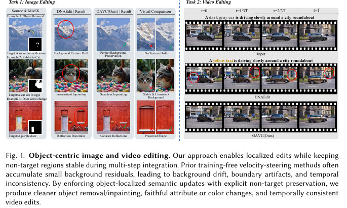
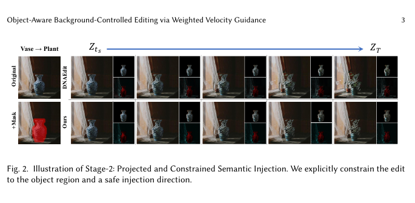

# AI Daily

## 2026-09-11 — OAVC：把「在哪裡改」與「如何改」拆開的免訓練 Flow Editing

> **今日一句話**：OAVC（Object-Aware Velocity Control）指出，免訓練 flow editing 的背景漂移不是單一步驟的錯誤，而是小幅、非目標 velocity residual 在多步 ODE integration 中累積的結果；因此它把物件 support 當成 solver-level 的「where」，再以 source-flow-orthogonal projection、boundary ring 與 confidence gate 定義「how」，讓語義殘差只在目標物件內以受控方向注入。[1]

## 一、選文結論與基本資料

本次先排除 `KaiCobra/AI_Daily` 已有的 Causal-JEPA、PredErase、GATO-Vid、VISTA、Semantic Steering、FDS、SparsePR 等相關條目，再從最新 arXiv 與正式會議來源中核查候選。OAVC 是未重複項目中最直接貼合 **training-free、zero-shot support、flow matching、velocity/attention modulation** 的研究。它的價值不在於提出新的生成 backbone，而在於把「局部編輯為何會污染背景」寫成可分析的離散動力學問題，並把 object support 與 residual transformation 分離成兩個可以單獨研究的控制介面。[1]

需要先界定三件容易混淆的事。第一，OAVC 是 **training-free inference controller**：它不更新預訓練模型參數，也不需要為每張輸入圖像做 optimization；但它仍然要額外計算 source/target velocity、建立 support、維護 reference trajectory，因此不是零成本。第二，OAVC 的預設物件 support 由 SAM3 以 concept prompt 取得，這個 support provider 可以是 zero-shot，但整個編輯流程不應簡化成「完全 text-only zero-shot」。第三，論文的 DAVIS 影片實驗使用每幀 ground-truth instance mask，因此影片結果應被解讀為 sampling-trajectory stability 的受控測試，而不是沒有任何外部物件先驗的端到端影片編輯。[1] [6]

| 項目 | 內容 |
|---|---|
| 論文標題 | *Object-Aware Background-Controlled Editing via Weighted Velocity Guidance* |
| 方法名稱 | Object-Aware Velocity Control（OAVC） |
| 作者 | Wuji Wang、Yue Wu、Chenhao Yi、Shuhui Wang |
| 研究單位 | Carnegie Mellon University；Institute of Computing Technology, Chinese Academy of Sciences；University of Chinese Academy of Sciences |
| 發表狀態 | **arXiv:2609.06288v1，2026-09-05 提交；cs.CV 預印本，未列正式會議或期刊錄用資訊** [1] |
| 研究領域 | Training-free image/video editing、rectified flow、velocity control、object-aware localization |
| 主要 backbone | FLUX、Stable Diffusion 3.5；另將 Stage-2 控制原則轉移到 FlowEdit [1] [3] |
| 主要資料集 | PIE-Bench、DAVIS；另以 GEdit-Bench 做兩個定性泛化案例 [1] [7] |
| 主要 support | 預設 SAM3 zero-shot concept segmentation；也支援 attention-derived、user-provided、soft 或 brush-refined support [1] [6] |
| 程式與權重 | 本次核查到論文與 arXiv HTML；未找到作者在論文頁面列出的正式 code/project release，報告不把「可重現」當成已確認事實。 |

### 最值得記住的數字

| 設定 | 結構距離 ↓ | 背景 PSNR ↑ | 背景 LPIPS ↓ | 背景 MSE ↓ | SSIM ↑ |
|---|---:|---:|---:|---:|---:|
| DNAEdit–FLUX | 18.87 | 24.99 dB | 95.06 | 50.45 | 85.71 |
| **OAVC–FLUX** | **4.07** | **33.30 dB** | **23.70** | **8.75** | **94.38** |
| DNAEdit–SD3.5 | 14.19 | 26.66 dB | 74.57 | 32.76 | 88.63 |
| **OAVC–SD3.5** | **4.11** | **32.64 dB** | **24.40** | **9.61** | **93.00** |

論文依 PIE-Bench/DNAEdit 慣例將 Structure Distance、LPIPS、MSE 與 SSIM 分別乘上 $10^3$、$10^3$、$10^4$ 與 $10^2$ 以便閱讀，PSNR 則以 dB 報告。因此表中的 LPIPS、MSE、SSIM 不是未縮放的原始值，不能直接與未採用相同 scaling 的外部表格比較。[1]

在 DAVIS 四段影片、前 41 幀與固定 mask protocol 中，OAVC 的 BG-PSNR 為 **27.53 dB**，相對 UniEdit-Flow 的 22.87 dB 高 4.66 dB；BG-L1 為 0.0284，相對 0.0467 降低 39.2%；temporal-window BG-PSNR 為 29.65 dB，相對 27.97 dB 高 1.68 dB。[1] 這些數字支持「背景漂移與幀間抖動同時下降」的主張，但不等於已經在 text-only、無 ground-truth mask 的影片設定中完成驗證。

## 二、問題背景：Flow Editing 的錯誤會沿著軌跡累積

### 2.1 Flow matching 把生成變成 velocity-field integration

Flow Matching（FM）以直接回歸條件機率路徑的 vector field 來訓練 continuous normalizing flow，而不是在訓練時反覆模擬完整 ODE；rectified flow 可以視為其中一類接近線性 transport 的路徑設計。[5] 對一個帶文字條件 $\psi$ 的預訓練生成模型，OAVC 使用 velocity field：

$$
 v_\theta(Z,\psi),
$$

其中 $Z$ 是 latent state。離散 solver 在第 $t$ 步以 step size $\Delta_t$ 更新：

$$
 Z_{t+1}=Z_t+\Delta_t\,\hat v_t.
$$

一般的 training-free editor 會把某個控制訊號 $u_t$ 加到模型 velocity：

$$
 \hat v_t=v_\theta(Z_t,\psi)+u_t.
$$

這個寫法看起來只增加了一個小 residual，但將整條 trajectory 展開後，控制項會變成：

$$
 Z_T=Z_0+\sum_{t=0}^{T-1}\Delta_t v_\theta(Z_t,\psi)
 +\sum_{t=0}^{T-1}\Delta_t u_t.
$$

若背景區域 $\Omega_{\mathrm{bg}}$ 在許多 step 都收到很小但非零的 residual，則累積背景變化為：

$$
 \Delta Z_{\mathrm{bg}}
 =\left.\sum_{t=0}^{T-1}\Delta_t u_t\right|_{\Omega_{\mathrm{bg}}}.
$$

OAVC 的核心診斷是：**局部編輯的失敗不只來自 residual 太大，也來自 residual 的 support 錯了，以及 residual 的方向與 source transport 過度重合。** 因此單純縮小 guidance scale，或在最後一步把背景貼回去，都不能等價取代 trajectory-level control。[1]

### 2.2 從 global steering 到 object-aware control

DNAEdit 是 OAVC 的主要基線。DNAEdit 以 Direct Noise Alignment 修正 flow inversion 的累積誤差，並以 Mobile Velocity Guidance（MVG）在生成時平衡背景保真與目標可編輯性。[2] FlowEdit 則直接建立 source distribution 到 target distribution 的 ODE path，主張 inversion-free、optimization-free 與 model-agnostic。[3] UniEdit-Flow 以 predictor-corrector 提高 flow inversion 的重建，再用 region-aware correction 和 velocity difference 建立 editing mask。[4]

這些方法都說明了 flow trajectory 可以在 inference time 被操控，但 OAVC 認為仍有一個尚未被明確拆出的問題：**「目標語義應該作用在哪裡」與「語義方向應該如何改寫」不是同一個問題。** OAVC 將前者交給 spatial support $W_t$，將後者交給 constrained operator $\Gamma_t$，形成：

$$
 u_t=W_t\odot \Gamma_t(\Delta v_t;\mathcal R_t).
$$

其中 $\mathcal R_t$ 是 Stage-1 建立的 reference interface，包含 source-consistent trajectory、cached offset 與 source velocity。這個分解是本文最有研究價值的 abstraction。[1]

*圖 1。論文 Figure 1 的聚焦擷取。左側比較物件替換、inpainting 與屬性變更；右側比較影片在連續 solver steps 中的編輯結果。OAVC 的視覺重點是將 prompt-induced change 限定在 object support，同時降低背景漂移與 temporal inconsistency。[1]*

## 三、核心貢獻與創新點

| 貢獻 | 論文做法 | 研究意義 |
|---|---|---|
| **Where/how factorization** | 以 $W_t$ 決定 residual 可以在哪裡累積，以 $\Gamma_t$ 決定 residual 如何被投影、平滑與縮放 | 將 spatial localization 與 dynamical injection 變成兩個可獨立消融的控制軸 |
| **Background-anchored reference interface** | Stage-1 先在 source prompt 下建立 source-consistent reference，並快取 $\Delta x_t^{\mathrm{safe}}$ | 讓 source/target velocity 在較一致的 proxy state 上比較，降低後續 residual 的 state mismatch |
| **Object-localized safe injection** | Stage-2 只在 object support 注入 target semantics，背景直接保留 source velocity | 把 preserve-background 的要求放進 solver field，而不是最後才做 latent overwrite |
| **Flow-orthogonal projection** | 移除 residual 沿 source velocity 的平行分量 | 抑制可能代表 transport/structural motion 的 drift-inducing direction |
| **Boundary-aware weighting** | 以 foreground interior 與 boundary ring 形成 $W_t^{\mathrm{edit}}$、$W_t^{\mathrm{ref}}$ | 將不確定的邊界從硬切 mask 改成有衰減的 transition support |
| **Support-source agnostic** | 除 SAM3 外，也測試 attention-derived support，並允許 user/brush refinement | 顯示主要貢獻是 velocity controller，而不是特定 segmentation model |

## 四、技術方法詳解

### 4.1 Rectified-flow proxy 與 source velocity

OAVC 沿用 DNAEdit 的 noise-space alignment 設定。給定目前 latent $Z_{t+1}$ 和輔助 noise state $S_{t+1}$，先形成可評估 source model 的 proxy：

$$
 Z_t^*
 =\frac{\sigma_t}{\sigma_{t+1}}Z_{t+1}
 +\left(1-\frac{\sigma_t}{\sigma_{t+1}}\right)S_{t+1}.
$$

source prompt 下的 velocity 為：

$$
 v_t^{\mathrm{src}}=v_\theta(Z_t^*,\psi_{\mathrm{src}}).
$$

OAVC 同時計算 linear transport velocity：

$$
 v_t^{\mathrm{lin}}
 =\frac{S_{t+1}-Z_{t+1}}{\sigma_{t+1}},
$$

並得到 DNA-style residual：

$$
 \Delta v_t^{\mathrm{DNA}}
 =v_t^{\mathrm{lin}}-v_t^{\mathrm{src}}.
$$

這個 residual 不是最後要注入目標語義的 residual，而是 Stage-1 用來建立 source reference interface 的 alignment correction。這個區分很重要：OAVC 並沒有把 source reconstruction 與 target editing 混成一次無約束的 prompt difference。[1] [2]

### 4.2 Support construction：從 pixel mask 到 latent weight map

給定一個 object-centric support $M$，OAVC 先把它縮放至 latent resolution。若使用 binary support，則可以 threshold；若使用 soft support，則可直接保留 $[0,1]$ 權重。論文使用 latent-grid dilation 建立三個區域：

$$
 M_{\mathrm{fg}}=\mathcal D_{r_{\mathrm{fg}}}(M),
$$

$$
 M_{\mathrm{bd}}=\mathcal D_{r_{\mathrm{bd}}}(M_{\mathrm{fg}}),
$$

$$
 M_{\mathrm{ring}}
 =\operatorname{clip}(M_{\mathrm{bd}}-M_{\mathrm{fg}},0,1),
 \qquad
 M_{\mathrm{bg}}=1-M_{\mathrm{fg}}.
$$

$M_{\mathrm{fg}}$ 是主要可編輯 interior，$M_{\mathrm{ring}}$ 是邊界 transition band，$M_{\mathrm{bg}}$ 是非目標區域。最後使用：

$$
 W_t^{\mathrm{edit}}=M_{\mathrm{fg}},
$$

$$
 W_t^{\mathrm{ref}}
 =M_{\mathrm{fg}}+\beta(\sigma_t)M_{\mathrm{ring}},
$$

其中 boundary coupling 隨 noise level 衰減：

$$
 \beta(\sigma_t)
 =\beta_{\max}
 \left(\frac{\sigma_t}{\sigma_{t_s}}\right)^\gamma.
$$

直觀上，較早且較 noisy 的 step 邊界不穩定，reference anchor 可以使用較寬的 ring；後期細節形成後，ring 權重下降以避免背景 leakage。這不是在最後把 mask 外的像素硬貼回 source，而是把 support 轉成每一步 velocity update 的 spatial weight。[1]

### 4.3 Stage-1：建立 background-anchored reference interface

Stage-1 不做目標語義編輯，目的是先得到穩定的 source-side trajectory。第一步先在 foreground 減弱 DNA alignment force：

$$
 \Delta v_t^{(1)}
 =\left(1-\lambda_{\mathrm{fg}}M_{\mathrm{fg}}\right)
 \odot \Delta v_t^{\mathrm{DNA}}.
$$

$\lambda_{\mathrm{fg}}$ 越大，foreground 的 source anchoring 越弱，後續 target semantic injection 的自由度越高。接著在 background 分離 residual 與 source flow：

$$
 r_t=M_{\mathrm{bg}}\odot \Delta v_t^{(1)},
 \qquad
 b_t=M_{\mathrm{bg}}\odot v_t^{\mathrm{src}}.
$$

OAVC 使用 flow-orthogonal projection：

$$
 \Pi_\perp(a;b)
 =a-\frac{\langle a,b\rangle}
 {\langle b,b\rangle+\epsilon}b.
$$

Stage-1 不一定完全移除 background residual，而是以 $\rho_{\mathrm{bg}}$ 做 soft projection：

$$
 \widetilde r_t
 =(1-\rho_{\mathrm{bg}})r_t
 +\rho_{\mathrm{bg}}\Pi_\perp(r_t;b_t).
$$

因此 $\rho_{\mathrm{bg}}=0$ 保留 DNA-style residual，$\rho_{\mathrm{bg}}=1$ 完全移除其沿 source flow 的平行分量。最後：

$$
 \Delta v_t^{\mathrm{safe}}
 =M_{\mathrm{fg}}\odot \Delta v_t^{(1)}+\widetilde r_t.
$$

使用它更新 noise state 與 proxy state：

$$
 S_t=S_{t+1}+\sigma_{t+1}\Delta v_t^{\mathrm{safe}},
$$

$$
 Z_t=Z_t^*+(\sigma_{t+1}-\sigma_t)\Delta v_t^{\mathrm{safe}}.
$$

並快取：

$$
 \Delta x_t^{\mathrm{safe}}=Z_t-Z_t^*.
$$

這組 $\mathcal R_t=\{Z_t,\Delta x_t^{\mathrm{safe}},v_t^{\mathrm{src}}\}$ 就是 Stage-2 的 reference interface。論文附錄將 foreground weakening 解釋為 diagonal Tikhonov shrinkage 的一階近似：精確形式是 $\frac{1}{1+\lambda_{\mathrm{fg}}M_{\mathrm{fg}}}\odot\Delta v_t^{\mathrm{DNA}}$，而主文使用的 $1-\lambda_{\mathrm{fg}}M_{\mathrm{fg}}$ 在小 $\lambda$ 下是一階展開。這個推導讓超參數具有可解釋的「foreground freedom」意義，而不只是經驗 knob。[1]

### 4.4 Stage-2：offset-aligned target evaluation

Stage-2 從 Stage-1 的 reference state 開始。對目前 edited latent $Z_t^{\mathrm{edit}}$，使用快取 offset 建立 target proxy：

$$
 Z_t^{*,\mathrm{edit}}
 =Z_t^{\mathrm{edit}}+\Delta x_t^{\mathrm{safe}}.
$$

在 target prompt 下計算：

$$
 v_t^{\mathrm{tgt}}
 =v_\theta(Z_t^{*,\mathrm{edit}},\psi_{\mathrm{tgt}}),
 \qquad
 \Delta v_t=v_t^{\mathrm{tgt}}-v_t^{\mathrm{src}}.
$$

offset alignment 的作用，是避免 source velocity 在一個 state、target velocity 在另一個 state 上比較。若 $v_\theta(\cdot,\psi)$ 在局部是 Lipschitz，則論文給出：

$$
 \left\|
 \Delta v_t(Z_t^{\mathrm{edit}}+\Delta x_t^{\mathrm{safe}})
 -\Delta v_t(Z_t^{\mathrm{edit}})
 \right\|
 \leq
 (L_{\mathrm{tgt},t}+L_{\mathrm{src},t})
 \left\|\Delta x_t^{\mathrm{safe}}\right\|.
$$

所以 Stage-1 對 spurious offset 的抑制，會直接改善 Stage-2 semantic difference 的穩定度；這是一個把「先做好 source trajectory」與「再做 target editing」連接起來的局部 stability argument。[1]

### 4.5 Safe semantic injection：投影、reference anchor 與最終 field

先對 target residual 做 source-flow-orthogonal projection：

$$
 \Delta v_t^\perp
 =\Pi_\perp(\Delta v_t;v_t^{\mathrm{src}}).
$$

論文指出，這是下列 constrained least-squares problem 的唯一最小解：

$$
 \min_u\left\|u-\Delta v_t\right\|_2^2
 \quad\text{s.t.}\quad
 \langle u,v_t^{\mathrm{src}}\rangle=0.
$$

reference anchor 只在 $W_t^{\mathrm{ref}}$ 支持的 foreground/ring 內累積：

$$
 Z_{t+1}^{\mathrm{ref}}
 =Z_t^{\mathrm{ref}}
 +(\sigma_{t+1}-\sigma_t)
 \left(W_t^{\mathrm{ref}}
 \odot\Gamma_t^{\mathrm{ref}}(\Delta v_t;\mathcal R_t)
 \right).
$$

再用 moving reference 建立 foreground editing velocity：

$$
 v_t^{\mathrm{ref}}
 =\frac{Z_t^{\mathrm{edit}}-Z_{t+1}^{\mathrm{ref}}}
 {1-\sigma_t},
$$

$$
 v_t^{\mathrm{fg}}
 =\eta v_t^{\mathrm{tgt}}
 +(1-\eta)v_t^{\mathrm{ref}}.
$$

最後，OAVC 對已經 reference-guided blend 過的 field 再做一次 projection，因為 $v_t^{\mathrm{fg}}-v_t^{\mathrm{src}}$ 不保證仍然正交：

$$
 v_t^{\mathrm{edit}}
 =v_t^{\mathrm{src}}
 +W_t^{\mathrm{edit}}\odot
 \left(
 g_t\,
 \Pi_\perp
 \left(v_t^{\mathrm{fg}}-v_t^{\mathrm{src}};
 v_t^{\mathrm{src}}
 \right)
 \right).
$$

再以 Euler step 更新：

$$
 Z_{t+1}^{\mathrm{edit}}
 =Z_t^{\mathrm{edit}}
 +(\sigma_{t+1}-\sigma_t)v_t^{\mathrm{edit}}.
$$

在 background 上 $W_t^{\mathrm{edit}}=0$，所以 integrated velocity 直接退化為 source velocity；在 object region 內，才允許 gated、flow-orthogonal target residual 進入。這個 property 是 OAVC 與 final latent hard blend 的根本差異：hard blend 只在結果生成後覆寫背景，OAVC 從每一步 solver field 就阻止背景 residual 累積。[1]

*圖 2。論文 Figure 2 的聚焦擷取。對 vase→plant 的編輯，OAVC 在 $Z_{t_s}$ 到 $Z_T$ 的過程中將目標語義限制在 mask 區域，並以安全方向注入；這張圖直觀呈現了「where」與「how」同時作用於 trajectory。[1]*

### 4.6 Boundary high-pass 與 confidence gate

OAVC 在 boundary ring 上使用輕量 high-pass operator。對 spatial latent：

$$
 \operatorname{HP}_{\mathrm{sp}}(x)
 =x-\operatorname{AvgPool}_k(x),
$$

對 FLUX 的 packed token latent，則使用 token mean：

$$
 \operatorname{HP}_{\mathrm{tok}}(x)
 =x-\operatorname{Mean}_{\mathrm{tokens}}(x).
$$

這個操作只在 ring 上套用，目標是抑制邊界附近緩慢、低頻的 drift，避免 halo 或 contour wobble，而不是把整個 latent 做高通濾波。接著以 residual RMS 與 exponential moving average 建立 confidence gate：

$$
 m_t=\sqrt{\operatorname{Mean}(x_t^2)},
$$

$$
 \bar m_t=\rho\bar m_{t-1}+(1-\rho)m_t,
 \qquad
 r_t=\frac{m_t}{\bar m_t+\epsilon},
$$

$$
 g_t=\sigma\left(\frac{\kappa-r_t}{\tau}\right).
$$

當目前 residual magnitude 相對歷史 EMA 異常大時，$g_t$ 會降低注入強度。這是對 inference-time outlier 的保守控制，並不是一個額外訓練出的 reward model。[1]

## 五、實驗結果與性能指標

### 5.1 PIE-Bench 主結果

PIE-Bench 包含 object replacement、attribute edit 與 material change 的 image-edit tuples。論文以同一 PIE annotation 評估所有方法；SAM3 只負責 OAVC 的 generation support，並不是評分 mask。Structure Distance 與 CLIP 使用全部 700 個 examples，background metrics 使用 556 個有效 background。[1]

| 方法 | Backbone | Structure ↓ | PSNR ↑ | LPIPS ↓ | MSE ↓ | SSIM ↑ | CLIP whole ↑ | CLIP edit ↑ |
|---|---|---:|---:|---:|---:|---:|---:|---:|
| DNAEdit | FLUX | 18.87 | 24.99 | 95.06 | 50.45 | 85.71 | 25.79 | 22.87 |
| UniEdit | FLUX | 10.14 | 29.54 | 63.55 | 24.72 | 90.42 | 25.80 | 22.33 |
| FlowEdit | FLUX | 27.82 | 21.96 | 112.19 | 94.99 | 83.08 | 25.25 | 22.58 |
| **OAVC** | **FLUX** | **4.07** | **33.30** | **23.70** | **8.75** | **94.38** | 23.70 | 21.08 |
| DNAEdit | SD3.5 | 14.19 | 26.66 | 74.57 | 32.76 | 88.63 | 25.63 | 22.71 |
| FlowEdit | SD3 | 27.12 | 22.22 | 104.12 | 85.96 | 93.22 | 26.53 | 23.57 |
| **OAVC** | **SD3.5** | **4.11** | **32.64** | **24.40** | **9.61** | **93.00** | 24.21 | 21.51 |

OAVC 在兩個主要 backbone 都顯著改善 structure/background metrics，但 CLIP whole 與 CLIP edit 不一定最高。這不是單純「模型變弱」的證據。Global CLIP 會獎勵 target semantics 出現在整張圖；如果 target semantics 泄漏到本來不應改動的 background，CLIP whole 可能上升。OAVC 的目標是提高 foreground target gain、降低 background target gain，因此它刻意把「整張圖的文字相似度」與「局部編輯正確性」分開。[1]

論文進一步定義 foreground/background semantic gain。DNAEdit 的 background target gain 為 0.0108，OAVC 降至 0.0008；相對應的 leakage ratio 約由 **57.5% 降至 6.3%**。foreground gain 也由 0.0189 降至 0.0130，說明 OAVC 不是完全抑制 target semantic，而是更大幅度地抑制原本會落到 background 的部分。[1]

### 5.2 DAVIS 影片穩定性

DAVIS 沒有文字編輯指令，因此論文採用 mask-conditioned video editing，對四段影片的前 41 幀使用 ground-truth instance masks，並在 solver steps 之間 cache support。這個設計隔離了 segmentation noise，專門測試每幀 flow editing 與 temporal background stability。[1]

| 方法 | BG-PSNR ↑ | BG-L1 ↓ | TW-BG-PSNR ↑ | TW-BG-L1 ↓ |
|---|---:|---:|---:|---:|
| DNAEdit | 19.85 | 0.0692 | 26.56 | 0.0281 |
| UniEdit-Flow | 22.87 | 0.0467 | 27.97 | 0.0227 |
| **OAVC** | **27.53** | **0.0284** | **29.65** | **0.0212** |

BG metrics 比較 edited frame 與 source frame 在 non-target region 的差異。TW-BG metrics 則以 source-video optical flow 將前一幀 warp 到當前幀，再在 valid background intersection 上計算誤差。因此 OAVC 的改善同時涵蓋「背景離 source 多遠」與「背景是否在時間上抖動」。[1]

### 5.3 消融：support 解決 where，projection/gate 解決 how

在 SD3.5 的 PIE-Bench ablation 中，DNAEdit global 的 Structure Distance 是 14.19。只使用 Stage-1 的 Anchor-DNA 後為 14.68，表示單獨改善 source reference 對結構 preservation 的幫助有限；加入 Stage-2 mask、ring 與 projection 後下降至 4.11，主要 gains 來自 trajectory-level localized injection。[1]

| 設定 | Structure ↓ | PSNR ↑ | LPIPS ↓ | MSE ↓ | SSIM ↑ |
|---|---:|---:|---:|---:|---:|
| DNAEdit global | 14.19 | 26.66 | 74.57 | 32.76 | 88.63 |
| Stage-1 only | 14.68 | 26.28 | 77.75 | 35.44 | 88.42 |
| Stage-2，mask + ring + projection，無 gate | 6.60 | 31.74 | 27.65 | 11.95 | 92.61 |
| Stage-2，mask only | 5.27 | 32.27 | 25.78 | 10.48 | 92.99 |
| Stage-2，mask + ring + gate，無 projection | 6.06 | 32.15 | 26.82 | 10.70 | 92.70 |
| **Full OAVC** | **4.11** | **32.64** | **24.40** | **9.61** | **93.00** |

在相同 support 下，full OAVC 相對 mask-only gating 將 Structure Distance 再降低 22.0%，相對 final latent hard blend 降低 34.6%，而背景 LPIPS/MSE 與 hard blend 相差 0.6% 以內。[1] 這個 controlled comparison 很重要：它把「有 mask」的收益與「如何在 trajectory 中使用 mask」的收益分開了。

### 5.4 Support corruption 與 support-source robustness

對固定 100 個 PIE-Bench examples，論文對 SAM3 prior 做 latent-grid erosion/dilation。Erode-2 讓 6% supports 變成 empty，Erode-4 讓 13% 變成 empty，反映 under-segmentation 會造成 incomplete edit。相反地，Dilate-4 將 support area 擴大到原始的 2.236 倍，BG LPIPS 由 23.15 增至 28.88，BG MSE 由 8.08 增至 10.38，表示 over-segmentation 會重新引入 background drift。[1]

| Input prior | IoU vs. original | Area ratio | Empty | Structure ↓ | BG LPIPS ↓ | BG MSE ↓ | CLIP edit ↑ |
|---|---:|---:|---:|---:|---:|---:|---:|
| Erode 4 | 0.397 | 0.397× | 13% | 2.07 | 19.53 | 6.35 | 20.65 |
| Erode 2 | 0.593 | 0.593× | 6% | 2.84 | 20.10 | 6.55 | 21.29 |
| Original | 1.000 | 1.000× | 0% | 4.21 | 23.15 | 8.08 | 21.47 |
| Dilate 2 | 0.712 | 1.581× | 0% | 4.67 | 26.04 | 9.34 | 21.36 |
| Dilate 4 | 0.594 | 2.236× | 0% | 4.93 | 28.88 | 10.38 | 21.42 |

這組結果帶來一個值得注意的診斷：Erode-2 和 Dilate-4 的 IoU 幾乎一樣，分別為 0.593 與 0.594，但前者主要造成 edit coverage 不足，後者主要造成 background leakage。換句話說，IoU 一個數字不足以描述 support quality；**under-segmentation 與 over-segmentation 對 solver dynamics 的錯誤方向不同。**[1]

論文也用 attention-derived support 取代 SAM3。FLUX late double-attention block 的 edited-concept response 經 head average、normalize、threshold 後，再使用同樣 dilation/ring construction。結果為：

| Support source | Structure ↓ | PSNR ↑ | LPIPS ↓ | MSE ↓ | SSIM ↑ |
|---|---:|---:|---:|---:|---:|
| DNAEdit global | 18.87 | 24.99 | 95.06 | 50.45 | 85.71 |
| Attention-derived support | 4.58 | 30.55 | 35.74 | 16.41 | 92.53 |
| SAM3 support | **4.07** | **33.30** | **23.70** | **8.75** | **94.38** |

這個實驗直接連結到 attention modulation：OAVC 不是改寫 attention logits，而是把 attention response 轉成 support prior，再在 velocity field 上做控制。Attention-derived support 明顯優於 global steering，但邊界精度仍落後 SAM3。[1]

### 5.5 FlowEdit transfer、human evaluation 與效率

把 OAVC Stage-2 套到 FlowEdit-FLUX 後，Structure Distance 從 27.82 降至 9.32，PSNR 從 21.96 dB 升至 30.77 dB；但套到 FlowEdit-SD3 時，Structure Distance 從 27.12 惡化至 35.72，雖然 PSNR 從 22.22 dB 升至 27.65 dB、MSE 從 85.96 降至 21.57。這表示 where/how controller 有跨 pipeline 的可轉移性，但 Stage-1 reference interface 仍依賴 backbone 與 base editor 的相容性。[1]

在 100 個 PIE-Bench examples 的 blind human study 中，OAVC 在 94 個有決定性結果的 background-preservation comparisons 中勝出 74 次，比例為 78.7%，exact binomial $p<10^{-7}$。但 edit-realization 的 65 個 decisive outcomes 中，OAVC/DNAEdit/final blend 的偏好票數為 15/22/28，統計檢定沒有在 0.05 水準顯著。OAVC 的 absolute Yes-or-Partially rate 為 79.5%，DNAEdit 為 80.0%，代表它較保守，但沒有證據顯示它普遍破壞任務完成度。[1]

| Backbone / method | 時間（s/image）↓ | Peak memory（MiB）↓ |
|---|---:|---:|
| SD3.5 / DNAEdit | 3.08 | 19,459 |
| SD3.5 / OAVC | 3.12 | 23,139 |
| FLUX / DNAEdit | 9.01 | 35,839 |
| FLUX / OAVC | 9.85 | 39,571 |

OAVC 的額外成本來自 reference-anchor maintenance、spatial weighting、ring high-pass 與 confidence gating。論文報告 SD3.5 的時間約增加 1.3%、peak memory 約增加 18.9%；FLUX 的時間約增加 9.3%、memory 約增加 10.4%。SAM3 mask 是每張圖或每段影片只算一次並 cache，因此表中 overhead 主要是 controller，而不是重複 segmentation。[1]

## 六、相關研究脈絡

| 研究 | 核心想法 | 與 OAVC 的關係 |
|---|---|---|
| **Flow Matching，ICLR 2023** | 直接回歸條件 probability path 的 vector field，使用 ODE solver 生成 | 提供 OAVC 操作 velocity field 與 integration trajectory 的數學基礎 [5] |
| **DNAEdit，NeurIPS 2025** | Direct Noise Alignment 修正 RF inversion 誤差，MVG 平衡背景保真與 editability | OAVC 的 Stage-1 reference interface 與主要 baseline；OAVC 進一步加入 object-level where/how control [2] |
| **FlowEdit，ICCV 2025 Best Student Paper** | 以 source/target velocity 建立 inversion-free、optimization-free、model-agnostic 的直接 ODE path | OAVC 可轉移到 FlowEdit，且將 global flow steering 改成 object-localized constrained injection [3] |
| **UniEdit-Flow，ICLR 2026** | Predictor-corrector inversion、delayed-injection adaptation、velocity-derived regional guidance | 與 OAVC 同屬 flow editing 的 training/tuning-free 路徑；UniEdit 以 correction mask 調整流程，OAVC 明確對 integrated velocity 做 support gating [4] |
| **FlowDirector，arXiv 2025** | Inversion-free video flow、attention-guided masking 與 differential averaging guidance | 是影片方向的近鄰工作；FlowDirector 以 attention-guided mask 調制 ODE velocity，OAVC 則更聚焦 object support、source-orthogonal projection 與 background anchor [8] |
| **SAM3，arXiv v2** | 以 concept prompt、image exemplar 或組合提示偵測、分割與追蹤物件 | 是 OAVC 預設 support provider；SAM3 的 segmentation 能力不等於 OAVC 的 velocity-control 貢獻 [6] |
| **GEditBench v2，arXiv 2026** | 1,200 個 real-world queries、23 類任務與 human-aligned visual-consistency evaluation | OAVC 只在 GEdit-Bench 做兩個定性案例，不能把它寫成完整 benchmark quantitative validation [7] |

從研究演化看，這條線大致經過三個階段。第一階段是 diffusion/flow inversion 與 prompt-to-prompt attention control；第二階段是 FlowEdit、DNAEdit、UniEdit-Flow 等 model-agnostic 或 inversion-free trajectory control；第三階段才開始問 **residual 在什麼空間位置、以什麼幾何方向、在什麼 timestep 被積分**。OAVC 的位置在第三階段：它不再把「更強的 target prompt」當作唯一控制手段，而是把 solver field 本身變成可約束的介面。[1] [2] [3] [4]

## 七、對使用者關注方向的研究啟發

### 7.1 Energy-Based Transformer：把 safe injection 寫成 compatibility energy

OAVC 本身不是 Energy-Based Transformer。它沒有訓練 scalar energy，也沒有透過 energy minimization 產生 target image；它使用的是 closed-form projection、support gating 與 fixed confidence rule。因此不能把 OAVC 稱為 energy-based method。

但它提供一個很直接的 energy interface。可把每一步候選 residual $u_t$ 的可靠性寫成：

$$
 E_{\mathrm{safe}}(u_t)
 =\left\|(1-W_t)\odot u_t\right\|_2^2
 +\lambda_{\parallel}
 \left\|
 \operatorname{Proj}_{v_t^{\mathrm{src}}}(u_t)
 \right\|_2^2
 +\lambda_{\mathrm{ring}}E_{\mathrm{boundary}}(u_t).
$$

第一項懲罰 background injection，第二項懲罰與 source transport 平行的 drift direction，第三項懲罰 boundary instability。未來可以讓 Energy-Based Transformer 對多個 candidate velocity residual 評分，再以 gradient-free reranking 或少量 Langevin/gradient steps 選擇低能量 candidate。這是**從 OAVC 推導出的研究構想，不是原文已實現結果**。

### 7.2 JEPA：把 reference trajectory 變成 predictive-consistency critic

OAVC 的 source reference interface $\mathcal R_t$ 只依賴 source flow 與 cached offset，沒有學習一個預測式 latent critic。若接上 JEPA，可以讓 target residual 產生的下一步 latent 與 frozen predictive target 做一致性比較：

$$
 E_{\mathrm{pred}}(u_t)
 =\left\|
 q_\phi(Z_{t+1}^{\mathrm{edit}},c_{t+1})
 -\operatorname{sg}(z_{t+1}^{\mathrm{target}})
 \right\|_2^2.
$$

其中 $q_\phi$ 是 predictor，$z_{t+1}^{\mathrm{target}}$ 是 stop-gradient target representation。若 $E_{\mathrm{pred}}$ 高，代表這次局部 velocity injection 雖然符合文字 residual，卻破壞了可預測的 scene dynamics。這可以把 OAVC 的「safe direction」從 source-flow geometry 擴展成 **source preservation + predictive consistency** 的雙重約束，尤其適合影片編輯與長時間 rollout。

### 7.3 VAR：把 object support 改寫成 scale-wise token support

OAVC 目前操作 latent spatial support，主要服務 diffusion/flow solver。若移植到 Visual Autoregressive Model（VAR），可以把 $W_t$ 改成每個 scale、每個 token 的 support：

$$
 u_{s,i}
 =W_{s,i}\odot
 \Gamma_s(\Delta p_{s,i}),
$$

其中 $s$ 是 next-scale generation level，$i$ 是該 scale 的 token。coarse scale 的 support 可以較寬，用來允許物件的幾何重排；fine scale 則收窄至 object interior 與 boundary ring，避免背景 token 被 target attribute 污染。這會把 OAVC 的 continuous-time where/how factorization，轉成 VAR 的 **scale-wise where/how factorization**，可與既有 training-free VAR attention steering 對照。

### 7.4 Training-free、attention modulation 與 zero-shot 的精確界線

OAVC 對 training-free 的定義相對清楚：不更新 backbone、不做 per-image optimization；但它不是無額外計算。它對 attention modulation 的關係也很精確：論文沒有修改 attention logits，而是用 attention response 產生 support。Attention-derived support 在 Structure Distance 4.58、PSNR 30.55 dB 上仍明顯優於 DNAEdit global，但落後 SAM3 support，說明「attention 可以提供 where prior」，卻不一定具有 segmentation-level boundary quality。[1]

至於 zero-shot，只有 support acquisition 可以由 SAM3 的 concept prompt 完成。PIE-Bench 仍需要 source/target prompt、編輯 backbone 與 controller；DAVIS 影片結果更使用 ground-truth masks。更嚴格的後續 protocol 應該同時測試：不給 ground-truth mask、用同一個自動 support provider、跨影片長度、跨 object category，以及 support error 造成的 editability/preservation Pareto curve。

## 八、個人評價與意義

我認為 OAVC 最有價值的地方不是「加入一個 mask」，而是把 localized editing 的研究問題改寫成：**一個 residual 應該在何處作用，以及它應該以什麼幾何方向進入 transport field？** 這使得 support localization、reference alignment、directional projection、boundary treatment 與 confidence gating 都能被單獨消融，而不是把所有改善歸因於一個模糊的 attention map。

它的實驗證據也有相對完整的層次。PIE-Bench 的兩個 flow backbones 支持主要 preservation claim；same-support baseline 證明 full OAVC 不只是因為取得了比較好的 mask；support corruption 量化了 under-segmentation 與 over-segmentation 的不同失敗模式；FlowEdit transfer 則測試了 controller 是否依賴單一 base pipeline；human study 顯示 background preference 顯著，但 edit preference 並沒有同樣顯著。這些設計讓結論比單純展示幾張「看起來比較乾淨」的圖片可靠。[1]

但 OAVC 仍有三個重要限制。第一，support quality 是硬約束：support 太小會造成 incomplete edit，support 太大會重新污染 background；而且論文的 GEdit-Bench 只報告兩個定性案例，不能取代完整 benchmark。第二，flow-orthogonal projection 可能移除一部分與 source flow 同方向、但其實對大型幾何變形有用的 target component；作者自己也指出 fixed foreground relaxation 可能對 aggressive shape change 過於保守。第三，影片實驗的 ground-truth mask 讓 temporal consistency 的結論仍偏向「在已知 object support 下的 trajectory stability」，尚未完全回答自動 support drift、物件遮擋與多物件交互的問題。[1]

如果要把這篇論文轉成下一個研究題目，我會優先做 **Energy-JEPA OAVC**：用 support energy 保障 background locality，用 JEPA predictive energy 保障跨幀 latent consistency，再讓一個 frozen 或輕量 Energy-Based Transformer 對 candidate residual 做 test-time reranking。第二個方向是 **Scale-OAVC for VAR**，將 $W_t$ 變成 scale-wise token support，研究 coarse layout editability 與 fine background preservation 的 Pareto frontier。第三個方向是 **support uncertainty calibration**：不再只用 binary mask，而是以 segmentation confidence、attention entropy 或 predictive disagreement 共同決定 $g_t$，讓 controller 在不確定的邊界自動採取保守注入。

總結而言，OAVC 不是新的生成模型，也不是已完成的通用 zero-shot editing system；它是一個清楚、可移植、可被 falsify 的 **inference-time velocity-control abstraction**。對目前關注 Energy-based Transformer、JEPA、VAR、attention modulation 的研究者來說，它最值得帶走的概念是：**把「局部性」從視覺 mask 的屬性提升為 solver dynamics 的屬性，並把 residual 的位置與方向分開建模。**

## References

[1]: https://arxiv.org/html/2609.06288v1 "Object-Aware Background-Controlled Editing via Weighted Velocity Guidance"
[2]: https://proceedings.neurips.cc/paper_files/paper/2025/file/b44ae90136013a8d0e2d24f6015b6097-Paper-Conference.pdf "DNAEdit: Direct Noise Alignment for Text-Guided Rectified Flow Editing"
[3]: https://matankleiner.github.io/flowedit/ "FlowEdit: Inversion-Free Text-Based Editing Using Pre-Trained Flow Models"
[4]: https://uniedit-flow.github.io/ "UniEdit-Flow: Unleashing Inversion and Editing in the Era of Flow Models"
[5]: https://iclr.cc/virtual/2023/poster/11309 "Flow Matching for Generative Modeling"
[6]: https://arxiv.org/abs/2511.16719 "SAM 3: Segment Anything with Concepts"
[7]: https://arxiv.org/abs/2603.28547 "GEditBench v2: A Human-Aligned Benchmark for General Image Editing"
[8]: https://flowdirector-edit.github.io/ "FlowDirector: Training-Free Flow Steering for Precise Text-to-Video Editing"
