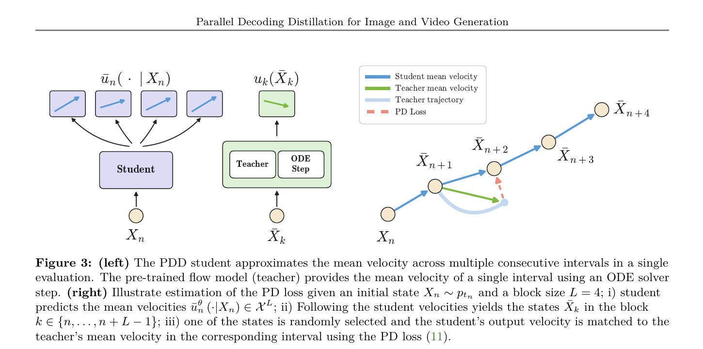
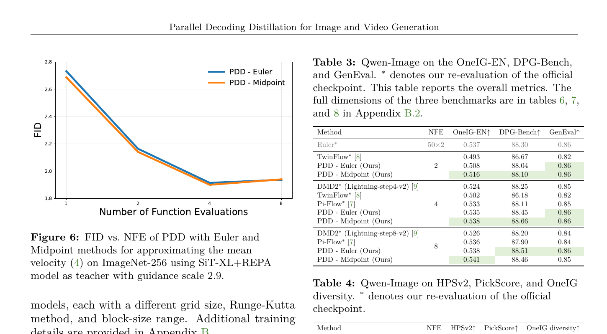
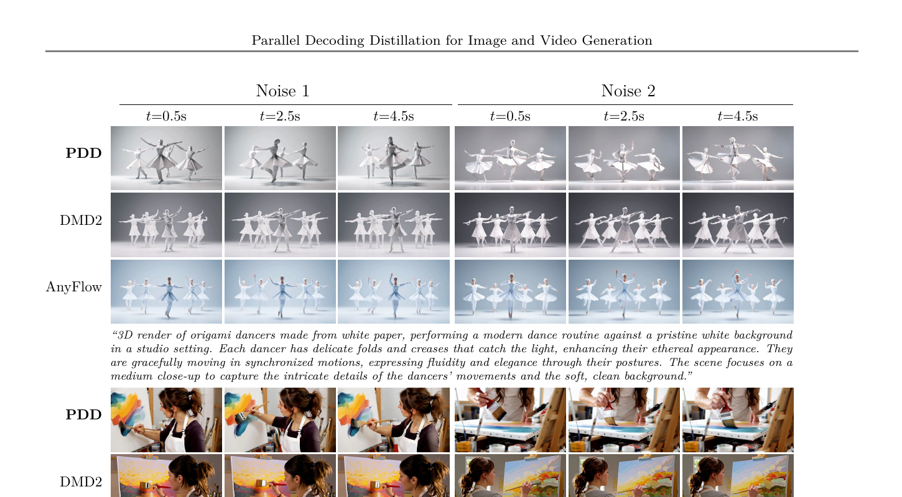

# AI Daily

## Parallel Decoding Distillation：不要把多步生成壓成一個黑盒，而是一次預測多個平均速度

> **一句話摘要：** Parallel Decoding Distillation（PDD）把 diffusion／flow matching 的少步生成重新表述為「在一次 forward 中並行預測多個連續時間區間的平均速度」。它以 on-policy 的均方誤差直接對齊 teacher 的 ODE solver step，不需要 VSD、GAN、JVP 或 finite-difference derivative regression，並透過可融合的多個線性 head 支援不同 NFE。作者在 Qwen-Image、Wan2.1 與 LTX-2.3 上報告 2–8 NFE 的結果；最值得注意的不是單一 FID，而是 PDD 在大模型影片生成中比 DMD2 更能保留 motion 與 sample diversity。[1] [2]

## 一、論文基本資訊

| 欄位 | 內容 |
|---|---|
| 論文標題 | **Parallel Decoding Distillation for Fast Image and Video Generation** |
| 作者 | Neta Shaul、Chao Liu、Arash Vahdat、Julius Berner |
| 研究單位 | NVIDIA；Weizmann Institute of Science；作者標示 Arash Vahdat 與 Julius Berner 為共同指導。[1] |
| 發表狀態 | arXiv:2607.26004v1，2026-07-28 提交；目前是 arXiv 預印本，未標示正式會議或期刊。[1] |
| 研究領域 | Flow matching、diffusion distillation、few-step image/video generation、ODE solver、on-policy learning |
| 主要模型與任務 | SiT-XL+REPA/ImageNet-256、Qwen-Image text-to-image、Wan2.1 1.3B/14B text-to-video、LTX-2.3 22B text-to-video/audio |
| 官方資源 | [arXiv paper](https://arxiv.org/abs/2607.26004)；[NVIDIA Research project page](https://research.nvidia.com/labs/genair/pdd/) |
| 本次去重結果 | 已掃描 `KaiCobra/AI_Daily` 的 README、INDEX、報告標題、arXiv identifier 與專案名稱；未發現 `Parallel Decoding Distillation`、`2607.26004` 或 `PDD` 的既有文章。 |

## 二、為什麼今天選這篇

PDD 不是單純把 sampling step 數字從 50 降到 4。它處理的是少步蒸餾裡一個常被混在一起的問題：**模型究竟要學一個大的 endpoint jump，還是要學一條可以在不同步數下繼續積分的局部動力學？** DMD2 等 distribution-based 方法可以把生成品質推得很高，但 VSD、GAN 與 alternating optimization 容易造成 mode collapse；在影片裡，這通常表現為動作變少、不同 noise seed 產生的內容過於相似。[1] [5]

PDD 的答案是保留 teacher trajectory 的結構，但不要求 student 每次 forward 只模仿一個瞬時 velocity。它令 student 同時輸出一個 block 內多個 interval 的平均速度，然後在生成階段用加權後的 fused linear layer 一次跨過整個 block。這個設計同時連接了三個值得追蹤的方向：**flow matching 的連續動力學、training-time 的 on-policy predictive learning，以及 inference-time 的可變 NFE 控制**。[4]

對本 repository 的主題而言，PDD 也提供一個有用的對照。它本身不是 training-free，也不是 JEPA 或 VAR；它需要從既有 teacher 蒸餾 student。然而它提出的「一次預測多個未來 latent transition」很適合啟發 JEPA 式 predictive representation、Energy-based block selection，以及把 VAR 的 next-scale decoding 改成可驗證的平行 transition prediction。

## 三、問題背景：為什麼 diffusion／flow 的推理仍然昂貴

Flow matching 將來源分布與資料分布之間的轉換寫成一個速度場。對狀態 $X_t$，連續動力學可以寫成

$$
\frac{dX_t}{dt}=v_t(X_t),\qquad X_0\sim p_0.
$$

這類模型的生成不是一次完成，而是使用 ODE solver 將 $t\in[0,1]$ 切成許多小區間。Flow Matching 的重要性在於，它可以直接回歸固定 probability path 上的 vector field，而且 diffusion path 是其中一個特例。[4] 但對大型 DiT 而言，每個 solver step 都要重新執行整個 backbone。若 teacher 需要數十到數百次 network evaluation，影片的時間 token 與空間 token 會把延遲進一步放大。

少步蒸餾大致分成兩條路徑。**Trajectory-based distillation** 讓 student 追蹤 teacher 的 sampling path；**distribution-based distillation** 則只要求 student 的邊際分布接近 teacher。後者通常更容易在圖像品質上取得強結果，但在影片裡可能犧牲運動與多樣性。DMD2 取消了原始 DMD 的昂貴 regression loss，並加入 two-time-scale update 與 GAN loss；它也處理多步 inference 的 train–test mismatch，因此能以極少步數產生高品質圖像，但其分布匹配目標仍可能造成 mode collapse。[5]

PDD 選擇 trajectory-based 路徑，卻避免傳統 progressive distillation 將多個 teacher step 合併成一個不透明的大跳躍。它要學的是一個**可分解、可變 block size 的局部平均速度表示**。

## 四、PDD 的技術方法

### 4.1 從瞬時速度改成 interval mean velocity

將時間離散為

$$
0=t_0<t_1<\cdots<t_N=1,
$$

並令 $X_n:=X_{t_n}$。第 $n$ 個 interval 的平均速度定義為

$$
 u_n(X_n)=\frac{1}{t_{n+1}-t_n}
 \int_{t_n}^{t_{n+1}}v_t(X_t)\,dt.
$$

因此，一個數值 solver step 可以寫成

$$
X_{n+1}=X_n+(t_{n+1}-t_n)u_n(X_n).
$$

實作上，作者以 Euler 或 Midpoint Runge–Kutta step 近似 $u_n$。Euler 使用 $v_{t_n}(X_n)$；Midpoint 先用一次 Euler 預估中點，再在 $t_{\mathrm{mid}}$ 評估 teacher。這個近似讓 teacher target 只需要一到兩次 evaluation，而不需要對整條 trajectory 做昂貴的高階積分。

### 4.2 Parallel decoder：一次 forward 輸出一個 block

從時間格點中取一段長度為 $L$ 的 block：

$$
\{n,n+1,\ldots,n+L-1\}.
$$

PDD student 由同一個起始狀態 $X_n$ 輸出 $L$ 個 mean velocity：

$$
\bar u_n^\theta(k\mid X_n)\approx u_k(X_k),
\qquad k=n,\ldots,n+L-1.
$$

訓練時，student 將這些輸出依序 rollout：

$$
\bar X_{k+1}=\bar X_k+(t_{k+1}-t_k)\bar u_n^\theta(k\mid X_n),
\qquad \bar X_n=X_n.
$$

重要細節是：所有 $ar u_n^\theta(k\mid X_n)$ 都由一次 student evaluation 產生，但第 $k$ 個輸出會作用在 rollout 後的 $ar X_k$ 上。這使模型可以同時學習 block 內的局部 trajectory，而不是只學一個從 $X_n$ 直接跳到 $X_{n+L}$ 的 endpoint map。

### 4.3 On-policy PD loss

訓練時，作者先從 interpolant process 或 data-free sampling 得到 $X_n$，再使用 student 的平行輸出得到 $ar X_k$。從 block 中隨機取一個 index $k$，以 teacher 在該 student state 上的 ODE step 估計 $u_k(\operatorname{sg}(\bar X_k))$。PDD 的核心損失為

$$
\mathcal L_{\mathrm{PD}}(\theta)
=\mathbb E_{n,k,X_n}
\left[
\left\|
\bar u_n^\theta(k\mid X_n)
-u_k\!\left(\operatorname{sg}(\bar X_k)\right)
\right\|_2^2
\right].
$$

其中 $\operatorname{sg}(\cdot)$ 是 stop-gradient。這個 stop-gradient 讓 student 可以使用自己的 rollout 產生 on-policy state，卻不必把所有 rollout graph 保留在記憶體中。Proposition 1 的核心意義是：在 loss 可實現且 teacher mean velocity 估計無誤差的理想情況下，$\mathcal L_{\mathrm{PD}}$ 的 global minimizer 會滿足平行解碼條件，因而沿著 block 逐步重建 teacher trajectory。

PDD 的一個關鍵取捨是，它**不回歸 mean velocity 的時間導數**。因此它不需要 JVP，也不需要 finite-difference approximation 來估計 derivative。這讓 loss 在大模型與 FSDP 環境中更直接；代價則是 teacher solver approximation 與 student on-policy rollout 的誤差仍會影響訓練。

### 4.4 Variable NFE 與 layer fusion

Teacher 的最後一層可寫成

$$
 v_t(x)=W H_t(x).
$$

Student 保留相同 backbone $H_{t_n}^\theta$，但為離散 grid 中每個 interval 學習一個輸出矩陣 $W_k^\theta$：

$$
\bar u_n^\theta(k\mid x_n)=W_k^\theta H_{t_n}^\theta(x_n).
$$

生成時，block 的總更新為

$$
\bar X_{n+L}
=\bar X_n+
\sum_{k=n}^{n+L-1}(t_{k+1}-t_k)
\bar u_n^\theta(k\mid \bar X_n).
$$

因為所有輸出共享同一個 hidden representation，可以將多個 linear head 融合成

$$
W_{n:n+L}^\theta
=\sum_{k=n}^{n+L-1}
\Delta_k W_k^\theta,
\qquad
\Delta_k=\frac{t_{k+1}-t_k}{t_{n+L}-t_n}.
$$

推理時，每個 block 只需保留一個 fused linear layer。若整體 grid 有 $N$ 個 interval，block size 為 $L$，理想化的 network evaluation 數量約為 $N/L$。訓練時讓 $L$ 在一個範圍內變動，便能在同一個 student 上提供 2、4、8 等不同 NFE；這是 PDD 相對固定步數蒸餾的一個實用優勢。

## 五、實驗結果與性能指標

### 5.1 ImageNet-256：可變 NFE 確實能運作，但不是所有設定都勝過更強 baseline

在 SiT-XL+REPA teacher 上，PDD 在 1 NFE 的 FID 為 **2.73（Euler）** 與 **2.69（Midpoint）**，優於同一比較中的 $\pi$-Flow **2.85**，但低於 FreeFlow 的 **1.45**。因此較準確的結論是：PDD 以較簡單的 objective 取得有競爭力的 single-step 結果，同時保留多 NFE 推理能力；它不是在每一個 ImageNet 指標上都達到最佳。[1] [6]

在 NFE=1、2、4、8 的曲線中，PDD 的 FID 大致隨 NFE 增加而改善，支持共享 student 跨不同 block size 工作。不過作者也觀察到某些 8-NFE 設定會出現輕微 FID 回升，且 guidance scale 會改變這個 trade-off。這提醒我們，**可變 NFE 不等於單調的品質保證**。

### 5.2 Qwen-Image：少步品質接近 teacher，且多樣性明顯優於 DMD2

Qwen-Image 的整體結果如下；數字是作者在 OneIG-EN、DPG-Bench 與 GenEval 上報告的 overall metrics。[1]

| 方法 | NFE | OneIG-EN ↑ | DPG-Bench ↑ | GenEval ↑ | OneIG diversity ↑ |
|---|---:|---:|---:|---:|---:|
| DMD2 Lightning-step4-v2 | 4 | 0.524 | 88.25 | 0.85 | 0.095 |
| $\pi$-Flow | 4 | 0.533 | 88.11 | 0.85 | 0.182 |
| PDD–Euler | 4 | 0.535 | **88.45** | **0.86** | **0.192** |
| PDD–Midpoint | 4 | **0.538** | **88.66** | **0.86** | 0.174 |
| DMD2 Lightning-step8-v2 | 8 | 0.526 | 88.20 | 0.84 | 0.109 |
| PDD–Euler | 8 | 0.538 | **88.51** | **0.86** | **0.198** |
| PDD–Midpoint | 8 | **0.541** | 88.46 | **0.85** | 0.181 |

PDD–Midpoint 在 NFE=4 與 NFE=8 的 OneIG overall 分別為 **0.538** 與 **0.541**。PDD–Euler 的 diversity 分別為 **0.192** 與 **0.198**，明顯高於 DMD2 的 **0.095** 與 **0.109**。這支持作者的主要論點：trajectory-aligned supervision 可以在維持語義與畫質的同時，少犧牲一部分生成多樣性。另一方面，Midpoint 並非每個 diversity 指標都最佳，因此不能把「二階 solver」簡化成全面優於 Euler。

### 5.3 Wan2.1：影片品質與 motion/diversity 的平衡

在 Wan2.1 1.3B、4 NFE 設定中，PDD–Midpoint 的 VBench overall 為 **84.94**，quality 為 **86.45**，semantic 為 **78.91**；DMD2 的 overall 為 **84.69**，AnyFlow 為 **84.45**。在 Wan2.1 14B 的 4 NFE short checkpoint 中，PDD–Midpoint 的 overall 為 **84.92**，quality **85.71**，semantic **81.77**；8 NFE 時 overall 為 **84.96**，quality **85.83**，semantic **81.44**。AnyFlow 在部分 overall 與高 NFE 指標上仍然更高，因此 PDD 的優勢不是每一個 VBench 欄位都領先。[1] [7]

較有研究價值的是 diversity proxy。14B、4 NFE 時，PDD-short 的 V-JEPA 2 cosine/L2 為 **0.0791/21.27**，VideoMAE V2 cosine/L2 為 **0.01247/2.027**；DMD2 對應為 **0.0568/17.67** 與 **0.00945/1.710**。較大的 pairwise distance 代表不同 seed 的影片表徵差異較大，但它也不等同於人類偏好的「更有創意」。這些結果比較支持「PDD 較不容易 collapse」而不是直接證明「PDD 生成的每支影片都更好」。

### 5.4 LTX-2.3：22B、720p、10 秒影片與 audio

作者將 PDD 套用到 **22B LTX-2.3**，在 720p、10 秒 text-to-video/audio 任務上以 **8 NFE** 產生結果，並與官方 distilled LTX-2.3 比較。由於 audio 與 video latent 分開計算 PD loss，這個實驗顯示方法不只適合小型圖像模型，也能把同一個平行解碼概念延伸到多模態影片。作者報告 PDD 在訓練約 **250 iterations** 後即可達到與官方 distilled model 相當或更好的 qualitative 表現；但這仍是作者的 benchmark claim，應等待公開 checkpoint 與獨立 reproduction。[1] [3]

## 六、相關研究與差異

### Flow Matching：PDD 的連續動力學基礎

Flow Matching 直接學習 probability path 的 vector field，讓生成可以交給 ODE solver；PDD 則在這個 vector field 上再學習離散 interval 的 mean velocity。兩者的差別是 supervision level：Flow Matching 學 $v_t$，PDD 蒸餾的是 solver interval 的 $u_n$。這也是為什麼 PDD 能直接把 solver grid 與 NFE block size 納入模型設計。[4]

### DMD2：distribution matching 的高品質路徑

DMD2 以 distribution matching、two-time-scale update 與 GAN loss 改善 DMD，並處理 multi-step 的 input mismatch。它的優勢是可以在圖像上取得很強的一步結果；它的風險是 distribution-level objective 對影片 motion 與 seed diversity 的約束較弱。PDD 不使用 VSD 或 adversarial loss，而是以 teacher trajectory 的局部 ODE step 作 supervision。因此兩者不是只有「誰的 FID 較小」的比較，而是**分布對齊與動力學對齊**的不同 inductive bias。[5]

### $\pi$-Flow：policy head 與 PDD 的平行輸出

$\pi$-Flow 將 student output layer 改成 network-free policy，使一次 network evaluation 可以在後續 substeps 產生動態 flow velocity；它在 ImageNet-256 報告 1-NFE FID 2.85，也強調 quality–diversity trade-off 的改善。[6] PDD 與其相似之處是都把額外的 integration 能力放到 head／policy 中，而不是重跑 backbone；主要差異是 PDD 直接預測固定 grid 的多個 mean velocity，並以 fused linear layer 支援不同 block size，而 $\pi$-Flow 的 policy 形式與 NFE 設計不同。

### AnyFlow：flow-map 的任意步數影片蒸餾

AnyFlow 將 endpoint consistency map 擴展為任意時間對 $(t,r)$ 之間的 flow-map transition $z_t\to z_r$，並以 flow-map backward simulation 做 on-policy distillation。它的設計目標是讓品質隨著測試時增加 NFE 而繼續改善，支援 bidirectional 與 causal video diffusion。[7] [8]

PDD 與 AnyFlow 都關心 variable NFE 與 trajectory fidelity，但形式不同：AnyFlow 學任意時間對的 transition operator；PDD 固定一個時間 grid，將每一個 block 內的多個 solver interval 平行輸出。可以把 PDD 視為更簡潔的離散化設計，也可以把 AnyFlow 視為更一般的連續時間 flow-map 設計。前者較容易初始化自既有 teacher 的最後 linear layer；後者對任意 step budget 與 downstream continuation 更有理論彈性。

## 七、我的評價與可延伸想法

### 7.1 最強的洞見：把「少步生成」拆成表示問題與計算問題

許多蒸餾方法把少步生成看成要學一個更強的 predictor。PDD 則更精確地拆成兩層：shared backbone 負責從目前 state 讀取可供多步使用的 representation；多個 linear head 負責把 representation 投影成不同 interval 的 velocity。這讓模型的計算節省來自 **backbone reuse**，而不是只來自降低 loss 或縮短 sampler。

### 7.2 與 Energy-based Transformer 的連接

PDD 的 $\mathcal L_{\mathrm{PD}}$ 可被視為一個局部 compatibility energy：student prediction 與 teacher interval transition 不一致時，energy 上升。下一步可以讓每一個 block 都維護一個 uncertainty-aware energy，例如

$$
E_n(L)=\left\|\hat u_{n:n+L}-u^{\mathrm{teacher}}_{n:n+L}\right\|^2
+\lambda\,\mathrm{Var}(\hat u_{n:n+L}).
$$

推理時不必固定使用 $L=4$ 或 $L=8$，而是先用 cheap verifier 估計 $E_n(L)$，在高 energy 的區域縮短 block，在平滑區域延長 block。這會把 PDD 從「可變 NFE」推向真正的 **energy-guided adaptive NFE**。這是延伸想法，不是 PDD 原文已驗證的模組。

### 7.3 與 JEPA 的連接

JEPA 的核心是預測 latent，而不是重建所有 observation detail。PDD 也在預測未來 interval 的 latent velocity，而不是把整條 denoising trajectory 展開成多次完整 forward。因此可以研究一個 **JEPA-PDD hybrid**：先以 JEPA-style target encoder 形成 block-level latent target，再以 PDD 的 interval head 預測多個 latent transition；若 predictive disagreement 偏高，則自動增加 NFE。這可能把影片的 motion consistency 變成 block-level predictive error，而不只依賴 frame-wise perceptual metric。

### 7.4 與 VAR 與 training-free inference 的連接

VAR 的 next-scale prediction 具有天然的離散階段結構。PDD 的 block 可以對應 VAR 的多個 scale transition：shared transformer hidden state 只計算一次，scale-specific heads 同時預測後續幾個 scale 的 token update。若再加入一個 frozen verifier 或 attention-energy controller，便可能在不重新訓練主模型的情況下，於 inference time 選擇要展開的 scale block。需要強調的是，這會是「使用已蒸餾 student 的 training-free inference」，不是 PDD 本身的 training-free training。

## 八、限制與應謹慎解讀的地方

第一，PDD 仍然需要 teacher、蒸餾訓練與大量模型工程，因此不能歸類為 training-free 或 zero-shot。第二，PDD 的 variable NFE 是在訓練時指定的 grid 與 block-size range 上學到的；它不等同於對任意連續 NFE 都有保證。第三，作者的大型 Qwen、Wan 與 LTX 實驗多採 data-free training，論文也將 data-dependent settings 列為 future work。[1]

第四，PDD 的品質–多樣性 trade-off 仍然存在，只是相對 DMD2 有較好的平衡。Qwen-Image 的結果顯示 Euler 與 Midpoint 在 diversity、OneIG、DPG-Bench 之間各有取捨；Wan2.1 的 AnyFlow 也在部分 VBench overall 指標領先。第五，V-JEPA 2、VideoMAE V2 與 OneIG diversity 是有用的 proxy，但不能取代人類對 motion realism、temporal causality 或 prompt fidelity 的評估。最後，所有性能數字目前主要是作者報告，應在公開 checkpoint、完整 code 與獨立 benchmark protocol 可用後再下更強的結論。

## 九、結論

PDD 最值得記住的不是「4–8 NFE」這個結果，而是它把少步生成的基本單位從 **one giant denoising jump** 改成 **one shared representation plus multiple local mean-velocity predictions**。這個改寫同時帶來三個優點：訓練 loss 直觀，不需要 derivative regression；推理時 backbone 可以重用；同一個 student 能在一組 block size 中調整 NFE。

對後續研究而言，最有潛力的方向是讓 block size 不再固定，而由 energy、predictive disagreement 或 attention stability 決定。若這個 controller 能在 image、video 與 VAR 三種生成范式中共用，便可能形成一個真正跨模型的 adaptive compute interface：容易的區域大步前進，困難的區域保留更多 solver evaluations。

## References

[1]: https://arxiv.org/abs/2607.26004 "Parallel Decoding Distillation for Fast Image and Video Generation"

[2]: https://arxiv.org/html/2607.26004v1 "Parallel Decoding Distillation HTML full text"

[3]: https://research.nvidia.com/labs/genair/pdd/ "FastGen-PDD: NVIDIA Research project page"

[4]: https://arxiv.org/abs/2210.02747 "Flow Matching for Generative Modeling"

[5]: https://arxiv.org/abs/2405.14867 "Improved Distribution Matching Distillation for Fast Image Generation"

[6]: https://arxiv.org/abs/2510.14974 "Pi-Flow: Policy-based Few-step Generation via Imitation Distillation"

[7]: https://nvlabs.github.io/AnyFlow/ "AnyFlow: Any-Step Video Diffusion Model with On-Policy Flow Map Distillation"

[8]: https://arxiv.org/html/2605.13724v1 "AnyFlow arXiv HTML full text"
