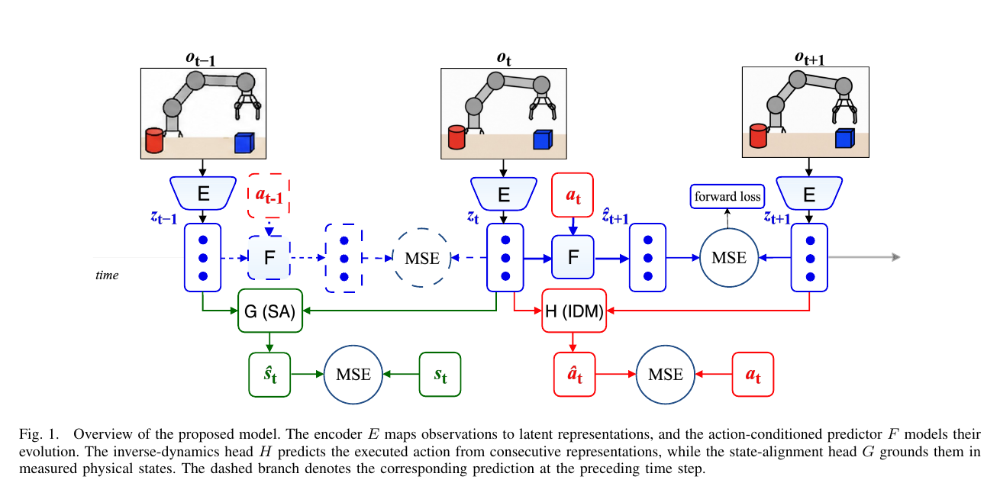
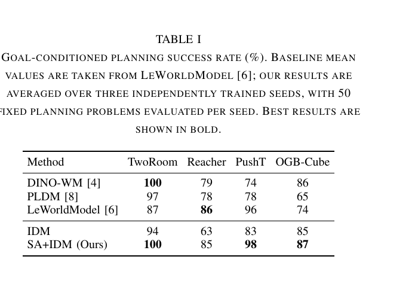
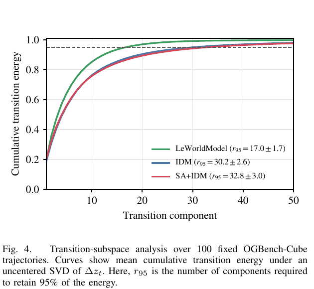

# AI Daily

## 2026-09-06 — Toward Physically Grounded JEPA World Models for Goal-Conditioned Robotic Planning

> **今日一句話**：JEPA 的 latent prediction 只告訴模型「下一個表徵應該像什麼」，但不保證這個表徵真的保留控制所需的物理自由度；本論文以 **Inverse Dynamics（IDM）+ State Alignment（SA）** 把 latent transition 同時錨定到「產生它的動作」與「對應的物理狀態」，並以 transition-subspace analysis 指出：**更直、更平滑的 latent trajectory，不一定代表更可規劃的世界模型**。[1]

## 一、論文基本資料

| 項目 | 內容 |
|---|---|
| 論文標題 | *Toward Physically Grounded JEPA World Models for Goal-Conditioned Robotic Planning* |
| 作者 | Muyuan Liu、Yue Huang、Zheng Liang、Xiang Gao；前兩位 equal contribution |
| 研究單位 | GENISOM AI，Beijing, China |
| 發表狀態 | arXiv:2609.03565v1，2026-09-03；預印本，論文頁面未標示已被頂會接收 |
| 研究領域 | Action-conditioned JEPA、visual world model、offline model-based planning、robotic control |
| Backbone | ViT-Tiny/14 encoder；192 維 latent；6-layer causal Transformer predictor |
| 評估任務 | TwoRoom、Reacher、PushT、OGBench-Cube |
| 核心結果 | SA+IDM 在 TwoRoom、PushT、OGBench-Cube 分別達 100%、98%、87%；相對 IDM-only 四項任務均提升 |

本次選文先從 2026 年 9 月初的 arXiv computer vision／robotics 新投稿與 Hugging Face Trending 交叉檢索，再與 `KaiCobra/AI_Daily` 的既有 153 篇索引和 `.existing_reports_inventory.txt` 比對。Hugging Face 當日可見 trending 清單主要集中在 agent、LLM 與多模態系統，沒有比本論文更直接符合 JEPA 與 physical grounding 偏好的圖像生成研究；因此本次選擇這篇尚未收錄的最新 JEPA world-model 預印本，而不是重複 repository 已有的 LeJEPA、EBT、JEPA-Guided-Diffusion 或多篇 VAR／training-free 報告。[6] [7]

需要先說明的是：這不是一篇圖像生成 SOTA 論文，而是一篇關於**可控制 latent representation** 的基礎研究。它對使用者關注的 Energy-based Transformer、VAR、attention modulation 和 zero-shot 的價值，不在於直接刷新 FID，而在於提出一個可測量的問題：一個 latent dynamics model 應該保留哪些變化，才能讓後續規劃、條件生成或推理真正可靠？

## 二、為什麼這篇值得讀

許多 visual world model 以 pixel reconstruction 或 observation prediction 為主要目標，因此必須處理紋理、光照、感測噪聲等未必與控制相關的變化。JEPA 則把預測放在 representation space：模型不重建未來像素，而是預測下一個觀測的 latent embedding。這讓規劃可以直接在 latent space 進行，卻也留下 representation collapse 與「latent 只對預測方便、卻不一定對物理控制有用」的風險。[1] [3]

本論文的關鍵切入點，是把兩種 supervision 分開看待。**Inverse dynamics** 要求相鄰 latent 能恢復產生該 transition 的 action，主要保證 latent transition 含有可控、可辨識的動作資訊；**State alignment** 則要求相鄰 latent pair 能預測對應的 physical state，將 representation 綁回實際 configuration 與 motion。這個區分比單純再加一個 regularizer 更有意義：它把「latent 不 collapse」與「latent 對控制有用」拆成可診斷的兩個問題。

## 三、核心貢獻與創新點

| 貢獻 | 論文做法 | 研究意義 |
|---|---|---|
| 物理狀態對齊 | 以相鄰 latent pair 通過 state-alignment head 預測 measured physical state | 讓 latent transition 不只攜帶 action signal，也反映 configuration 與 velocity-related information |
| IDM 與 SA 的互補 | `IDM` 預測執行動作；`SA` 對齊物理狀態；兩者和 latent prediction 聯合訓練 | 把 anti-collapse、action sensitivity、physical grounding 分成可消融的訓練訊號 |
| 對 latent 幾何的重新診斷 | 同時報告 temporal straightening 與 transition-subspace effective dimension | 顯示高 straightening 可能只是 variation 被壓到低維、甚至伴隨較弱 planning |
| 部署時不依賴 state label | physical state 只在 training 提供 supervision；推理時只使用 encoder 與 predictor | 讓 state alignment 成為 training-only privileged signal，而不是部署時必備感測器 |

論文最有啟發性的不是「SA+IDM 在表格上多了幾個百分點」，而是它提醒我們不要把單一 representation metric 當成 world-model quality 的代理。若只看平均 temporal straightening，LeWorldModel 的分數最高；但它的 transition energy 集中在更低維的子空間，反而在 OGBench-Cube 上輸給 state-aligned model。[1] [3]

## 四、技術方法詳解

### 4.1 資料與基本 JEPA dynamics

離線資料集由多條帶有影像觀測、物理狀態與 action chunk 的 trajectory 組成：

$$
\tau = (o_0,s_0,a_0,o_1,s_1,\ldots,a_{T-1},o_T,s_T),
$$

其中 $o_t$ 是視覺觀測、$s_t$ 是對應的 measured physical state，而 $a_t$ 是從 $o_t$ 到 $o_{t+1}$ 期間執行的一段低階動作。Encoder $E$ 將觀測映射到 latent：

$$
z_t = E(o_t),
$$

action-conditioned predictor $F$ 則預測下一個 latent：

$$
\hat z_{t+1}=F(z_t,a_t).
$$

最基本的 JEPA prediction loss 是 predicted embedding 與直接編碼的下一觀測 embedding 之間的平方誤差：

$$
\mathcal{L}_{\mathrm{pred}}
=\mathbb{E}_{(o_t,a_t,o_{t+1})\sim\mathcal{D}}
\left[\left\|\hat z_{t+1}-z_{t+1}\right\|_2^2\right].
$$

這個目標不需要重建 $o_{t+1}$ 的像素，但單獨使用時有一個明顯的退化解：若所有觀測都被映射到同一個向量，prediction error 也可能很小。因此，論文接著加入兩個不同功能的 auxiliary objective。[1]

### 4.2 Inverse Dynamics：讓 latent transition 含有 action information

Inverse-dynamics head $H$ 以兩個 consecutive latent 預測中間執行的動作：

$$
\mathcal{L}_{\mathrm{idm}}
=\mathbb{E}_{(o_t,a_t,o_{t+1})\sim\mathcal{D}}
\left[\left\|H(z_t,z_{t+1})-a_t\right\|_2^2\right].
$$

如果 $z_t$ 與 $z_{t+1}$ 完全 collapse，$H$ 只能輸出一個 constant-action predictor；要把 error 壓到 constant baseline 以下，encoder 就必須讓不同 action 所造成的 transition 在 representation space 中可區分。因此，IDM 同時扮演 anti-collapse 與 action-sensitive representation 的角色。

這個想法和 Sensorimotor World Models 的方向一致：後者主張 inverse dynamics 是一個以 task-grounded action 取代純分佈 regularizer 的 anti-collapse mechanism，能保留可控制的自由度並忽略 uncontrollable distractors。[5] 本論文的不同之處，是再往前加入 physical state alignment，使 action relevance 不等於全部的 physical grounding。

### 4.3 State Alignment：把 latent pair 錨定至物理 configuration

論文以 state-alignment head $G$ 從相鄰 latent pair 預測當前 physical state：

$$
\mathcal{L}_{\mathrm{sa}}
=\mathbb{E}_{(o_{t-1},o_t,s_t)\sim\mathcal{D}}
\left[\left\|G(z_{t-1},z_t)-s_t\right\|_2^2\right].
$$

使用 pair 而非單一 $z_t$ 很重要，因為相鄰表徵不只包含瞬時 configuration，也提供估計 motion 或 velocity 的時間上下文。完整訓練目標為：

$$
\mathcal{L}_{\mathrm{total}}
=\mathcal{L}_{\mathrm{pred}}
+\alpha\mathcal{L}_{\mathrm{sa}}
+\beta\mathcal{L}_{\mathrm{idm}}.
$$

作者在 PushT validation split 上從 $\{0.01,0.1,1.0\}$ 選擇 tied weights $\alpha=\beta=1.0$，並將同一設定用於四個任務。[1]

值得注意的是，physical measurements 是 **training-only supervision**。部署時，模型只保留 $E$ 與 $F$，不需要讀取 $s_t$；給定目前觀測 $o_t$ 與 goal image $o_g$，分別得到 $z_t$ 與 $z_g$，再在 latent dynamics 上規劃。

### 4.4 Latent-space CEM planning

對候選 action sequence $\mathbf{a}_{t:t+K-1}$ 進行遞迴 rollout，得到 terminal predicted latent $\hat z_{t+K}(\mathbf{a})$，並以 goal latent distance 作為規劃目標：

$$
\mathbf{a}^{*}_{t:t+K-1}
=\arg\min_{\mathbf{a}_{t:t+K-1}}
\left\|\hat z_{t+K}(\mathbf{a})-z_g\right\|_2^2.
$$

作者使用 Cross-Entropy Method（CEM）反覆抽樣 action sequences、保留 elite candidates，再更新 sampling distribution；執行一小段規劃動作後重新觀測並重規劃。這是一種 model-predictive control 風格的 closed-loop latent planning，而不是一次預測完整軌跡。[1]

*圖 1。論文架構的局部裁切。藍色分支是 latent prediction，紅色分支以 $H$ 做 inverse dynamics，綠色分支以 $G$ 做 state alignment；圖中虛線表示 preceding-time-step 的對應 prediction。[1]*

## 五、實驗結果與性能指標

### 5.1 Goal-conditioned planning success

作者沿用 LeWorldModel 的四任務與 evaluation protocol：每個 variant 在 50 個固定 start–goal problems 上評估，goal 位於 25 個 environment steps 之後，interaction budget 是 50 steps；作者自己的結果以三個 independent seeds 平均，baseline 則採用 LeWorldModel 報告的 mean values。[1] [3]

| 方法 | TwoRoom | Reacher | PushT | OGB-Cube |
|---|---:|---:|---:|---:|
| DINO-WM | 100 | 79 | 74 | 86 |
| PLDM | 97 | 78 | 78 | 65 |
| LeWorldModel | 87 | **86** | 96 | 74 |
| IDM-only | 94 | 63 | 83 | 85 |
| **SA+IDM（Ours）** | **100** | 85 | **98** | **87** |

*圖 2。Table I 的局部裁切；SA+IDM 在 IDM-only 之上分別提升 TwoRoom +6、Reacher +22、PushT +15、OGBench-Cube +2 個百分點。[1]*

結果有兩個層次。第一，完整 SA+IDM 在 TwoRoom、PushT、OGBench-Cube 取得表中最高成功率，在 Reacher 則以 85% 接近 LeWorldModel 的 86%。第二，對照 IDM-only，加入 SA 後四項任務全部改善，支持作者「action alignment 與 physical state alignment 互補」的主張。這裡的提升不能解讀為跨環境 zero-shot generalization；它是在固定 offline benchmark 與固定 start–goal protocol 下的 planning success。

### 5.2 Straightening 與 transition dimension 的反直覺結果

對一條 latent trajectory $z^{(i)}_{1:T_i}$，令

$$
\Delta z^{(i)}_t=z^{(i)}_{t+1}-z^{(i)}_t,
$$

temporal straightening score 定義為連續 displacement 的 cosine alignment 平均值：

$$
S_{\mathrm{straight}}^{(i)}
=\frac{1}{T_i-2}
\sum_{t=1}^{T_i-2}
\frac{\langle\Delta z^{(i)}_t,\Delta z^{(i)}_{t+1}\rangle}
{\|\Delta z^{(i)}_t\|_2\,\|\Delta z^{(i)}_{t+1}\|_2}.
$$

在 OGBench-Cube 的 100 條固定 trajectory 上，LeWorldModel 的平均 straightening 最高，為 $0.69\pm0.025$；IDM 為 $0.62\pm0.029$；SA+IDM 反而較低，為 $0.55\pm0.034$。如果只把「越直越好」當作 representation quality，會錯誤地預測 LeWorldModel 應該最好。

作者因此把每條 trajectory 的 displacement matrix $\Delta z$ 做 uncentered SVD，定義 $r_{95}$ 為保留 95% transition energy 所需的 singular components 數量。平均結果為：LeWorldModel $r_{95}=17.0\pm1.7$、IDM $30.2\pm2.6$、SA+IDM $32.8\pm3.0$。[1]

*圖 3。Figure 4 的局部裁切。LeWorldModel 的 cumulative transition energy 更快飽和，表示 temporal variation 集中在較低維子空間；SA+IDM 雖較不 straight，但保留了較寬的 transition basis。[1]*

我的解讀是：**straightening 衡量的是局部方向一致性，$r_{95}$ 衡量的是整條 trajectory 的變化容量**。若 latent trajectory 被壓在幾條近乎共線的方向上，平均 cosine 可能很高，但遇到真正需要轉彎、旋轉或改變接觸關係的 task 時，representation 可能缺乏足夠的 transition degrees of freedom。SA 的 physical supervision 讓「曲率」成為有意義的物理變化，而不只是 noise。

## 六、相關研究脈絡

| 研究 | Representation／訓練方式 | 規劃或下游定位 | 與本論文的差異 |
|---|---|---|---|
| DINO-WM，ICML 2025 | 凍結 DINOv2 spatial patch features，預測 future features | offline data 上以 goal feature 作 test-time zero-shot planning | 依靠大型預訓練視覺 encoder；本論文從 pixels end-to-end 學習，並加入 physical state alignment [2] |
| LeWorldModel，arXiv 2026 | next-embedding prediction + SIGReg isotropic-Gaussian regularization | latent CEM/MPC planning | 主要約束 embedding distribution；本論文直接約束 action 與 physical transition [3] |
| LeJEPA，arXiv 2025 | 以 SIGReg 讓 latent 接近 isotropic Gaussian，並給出 probing 幾何理論 | 通用 self-supervised representation | 著重跨下游任務的 representation geometry；本論文著重 robotics control geometry [4] |
| Sensorimotor World Models，arXiv 2026 | 以 inverse dynamics 作為 action-grounded anti-collapse regularizer | compact latent planning、保留 controllable degrees of freedom | 本論文保留 IDM，但再用 SA 把 latent pair 對齊物理 configuration／motion [5] |
| PLDM／Delta-JEPA | latent prediction 配合 variance/covariance、temporal 或 action-sensitive auxiliary objectives | offline world-model planning | 本論文的主張更聚焦於 measured state 的 pair-based grounding，而不是只要求 latent 可預測或可恢復 action [1] |

DINO-WM 的重要性在於它把「goal image」直接當作 latent target，並在沒有 expert demonstrations、reward model 或 pre-learned inverse model 的情況下進行 test-time planning。[2] 但這裡的 zero-shot 應精確理解為**對新的 goal、maze configuration 或 object shape 做規劃**，不是不需要任何 offline data，也不是完全不做 test-time optimization。入選論文的設定同樣是 offline data + CEM planning，因此不能把 SA+IDM 宣稱成一般意義的 zero-shot visual control。

LeJEPA 則提供另一個正交視角：它認為在固定總變異下，isotropic Gaussian 對 linear／nonlinear probing 的 worst-case bias–variance trade-off 有理論優勢，SIGReg 因而成為分佈層面的 collapse prevention。[4] 本論文的 transition-subspace 結果說明，**跨樣本的 embedding distribution regularity 並不等於沿 trajectory 的 transition diversity**；兩者應該同時測量。

## 七、對 EBT、VAR、training-free 與 zero-shot 的研究啟發

### 7.1 Energy-Based Transformer：把 latent planning cost 改寫成可校準的 transition energy

可以將本論文的三項 loss 重新視為一個 action-conditioned transition energy：

$$
E_{\mathrm{phys}}(z_{t-1},z_t,a_t,s_t)
=\lambda_p\|F(z_{t-1},a_{t-1})-z_t\|_2^2
+\lambda_a\|H(z_{t-1},z_t)-a_t\|_2^2
+\lambda_s\|G(z_{t-1},z_t)-s_t\|_2^2.
$$

部署時不必把它當作 supervised loss，而可以把 $E_{\mathrm{phys}}$ 當成 CEM candidate ranking、trajectory rejection 或 uncertainty gate。對 Energy-Based Transformer 而言，這比單純把下一 token／下一 latent 的 prediction error 當 energy 更有物理解釋：低能量不只代表「像 training data」，還代表「transition 可由 action 解釋，且符合物理狀態」。真正值得驗證的問題是：energy 是否具有跨 task、跨 horizon 的 calibration，而不只是對 training-policy distribution 過擬合。

### 7.2 JEPA × VAR：在 next-scale latent 中加入 physical transition basis

VAR 的 coarse-to-fine generation 把影像分解成不同 scale 的 visual tokens；JEPA world model 則把時間 transition 放在 latent space。可以設計 scale-conditioned predictor：

$$
\hat z^{(\ell+1)}_t
=F_\ell\left(z^{(\leq\ell)}_t, a_t\right),
$$

並在每個 scale 同時加入 action-prediction 與 state-alignment constraint。粗尺度負責 object identity／layout 的長程幾何，細尺度負責 contact、texture 或局部 motion。這樣的模型有機會把 VAR 的 next-scale uncertainty 與 JEPA 的 physical predictive state 接起來：不是只問「下一個 token 最可能是什麼」，而是問「哪些 token transition 仍然落在可行的 physical manifold 上」。

### 7.3 Training-free attention modulation：用 transition disagreement 決定介入位置

現有 training-free attention modulation 通常在 denoising step、cross-attention map 或 VAR scale 上以 heuristic 強度介入。這篇論文提供一個更具結構性的訊號：對候選 transition 計算 IDM prediction disagreement、SA prediction disagreement 或其 local energy，讓介入強度隨不確定性調整。例如，在某一個 VAR scale 或 diffusion timestep 中，若多個 attention-modulated candidates 的 predicted state energy 差距很大，才增加 guidance；若 energy 已穩定，則停止介入。這可能比固定每一層加同樣幅度的 attention bias 更接近 model-predictive control。

### 7.4 Zero-shot 的嚴格 protocol

這篇論文也提醒我們把 zero-shot 拆成至少四種設定：新的 goal image、新的 object／layout、新的 environment dynamics，以及完全沒有相關 offline trajectory。SA+IDM 目前只在固定 benchmark、固定 offline data 與 CEM planning 中驗證，不能直接外推到後兩種最強的 zero-shot。下一個有說服力的實驗應該是：訓練資料只包含部分物理 regime，測試時換 object mass、friction、camera viewpoint 或 action scale，再比較 IDM、SA、SIGReg 與 energy-based planner 的 transfer。

## 八、限制與批判性評估

首先，這是一篇 arXiv 預印本，機構是 GENISOM AI Beijing，尚未在頁面上標示 ICCV、CVPR、ICML、NeurIPS 等頂會接收；因此結果應視為值得追蹤的 early signal，而非已完成同行評審的定論。[1]

其次，實驗規模仍然有限。每個 task 使用 50 個固定 start–goal problems，作者自己的數字平均三個 seeds，但 baseline mean 取自先前 LeWorldModel 報告；這讓跨論文比較可能受到 implementation、seed 與 evaluation protocol 差異影響。尤其是 Reacher 上 LeWorldModel 86% 略高於 SA+IDM 85%，因此不應把 SA 宣稱為所有任務全面勝出。

第三，state alignment 使用完整 physical state 作為 training supervision。這是合理的 privileged training signal，但它也帶來資料取得成本與 domain dependency：真實機器人可能沒有完整、低噪聲、可同步的 state measurement。若 state label 不完整，應測試 noisy state、partial state、learned proprioception 或由 vision foundation model 提供的 pseudo-state。

第四，offline world model 仍受 behavior-policy coverage 限制。CEM 可以在 latent space 找到低距離 action sequence，但不代表該 sequence 在資料支持範圍內；若 rollout 超出 training distribution，latent prediction error 可能快速累積。將 $E_{\mathrm{phys}}$ 作為 out-of-distribution transition detector，是比單純增加 planning horizon 更重要的下一步。

最後，論文提出會在 acceptance 後釋出 code 與 evaluation configurations；在目前預印本版本中，重現性仍受官方實作、資料與環境設定是否公開所限制。[1]

## 九、我的評價與研究意義

我認為這篇工作的價值不在於它提出一個非常複雜的 architecture，而在於它把 JEPA world model 的成功條件拆成了三個可以分開測試的層次：**prediction accuracy、action identifiability、physical-state grounding**。這種拆分有助於避免 representation learning 中常見的「一個總 loss 下降，所以 latent 一定更好」的錯誤推論。

最值得帶走的反直覺結果是：**低 straightening 可能是好事，高 straightening 可能是危險的假象**。若下游任務需要多個方向的物理變化，latent dynamics 應該保留足夠的 transition basis，而不是被壓成一條看似漂亮的低維曲線。這對圖像生成同樣成立：一個看似平滑的 denoising 或 next-scale trajectory，可能只是把可變化的 semantic／layout degrees of freedom 壓掉了。

因此，若要把這篇工作延伸到使用者關注的生成模型，我會優先做一個 **Energy-Gated JEPA-VAR** 原型：在 frozen 或 lightly-tuned VAR backbone 上，從 coarse-scale visual tokens 建立 action／edit-condition sensitive predictor，再以 state-like structural probes 和 transition energy 於 inference time rerank candidate tokens。與固定 attention modulation 相比，這個 controller 應該只在 transition disagreement 高的 scale 介入，並以 zero-shot transfer protocol 測試它是否真的改善 composition、identity preservation 與 layout consistency，而不是只在單一 benchmark 上提高分數。

## References

[1]: https://arxiv.org/html/2609.03565v1 "Toward Physically Grounded JEPA World Models for Goal-Conditioned Robotic Planning"
[2]: https://proceedings.mlr.press/v267/zhou25t.html "DINO-WM: World Models on Pre-trained Visual Features enable Zero-shot Planning"
[3]: https://arxiv.org/html/2603.19312v1 "LeWorldModel: Stable End-to-End Joint-Embedding Predictive Architecture from Pixels"
[4]: https://arxiv.org/html/2511.08544v1 "LeJEPA: Provable and Scalable Self-Supervised Learning Without the Heuristics"
[5]: https://arxiv.org/html/2606.20104v1 "Sensorimotor World Models: Perception for Action via Inverse Dynamics"
[6]: https://arxiv.org/list/cs.CV/current "arXiv Computer Vision and Pattern Recognition current submissions"
[7]: https://huggingface.co/papers/trending "Hugging Face Trending Papers"
