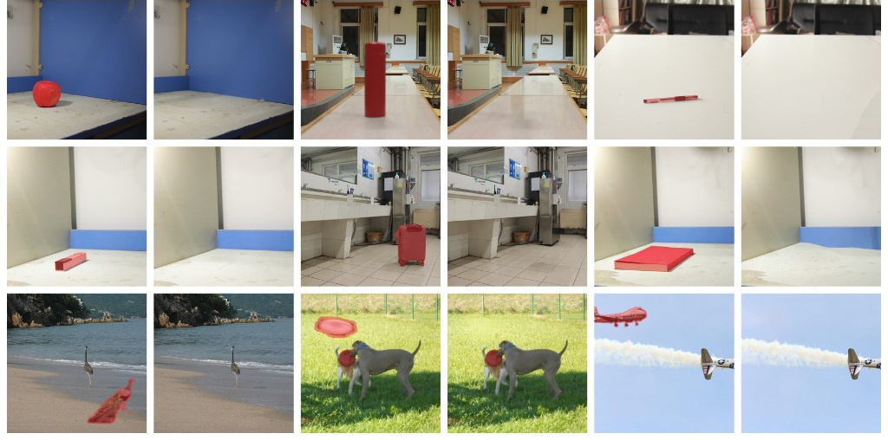
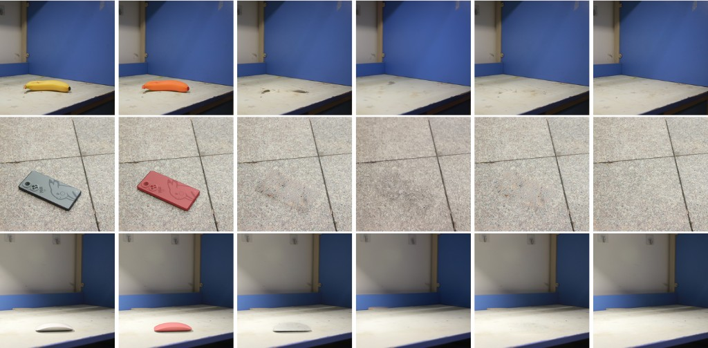

# AI Daily

## PredErase——以 I-JEPA 預測先驗與 Flow-Matching Latent Guidance 實現免訓練物體及其陰影移除

> **一句話摘要：** PredErase 將影像移除拆成「**哪些位置可以被改寫**」與「**遮罩內應該生成什麼結構**」兩個問題：前者以 contact-band 擴張可編輯區域，後者以 frozen I-JEPA 從可見上下文預測遮罩內的 latent target，再透過稀疏、投影約束的 latent gradient steps 引導 frozen FLUX.2。整個流程不更新權重、不需要 paired clean plates，且把 JEPA 從表徵學習器轉化為可直接介入生成軌跡的結構先驗。[1]

## 一、論文基本資訊

| 欄位 | 內容 |
|---|---|
| 論文標題 | **PredErase: Training-Free Object-and-Effect Removal with Predictive Latent Guidance** |
| 作者 | Waikit Xiu、Qiang Lu、Junbiao Chen、Xiying Li |
| 研究單位 | The University of Hong Kong；Sun Yat-sen University |
| 發表狀態 | arXiv:2609.00956v1，2026-09-01；目前是 arXiv preprint，尚未標示已錄用的頂會版本。[1] |
| 研究領域 | Training-free image editing、object removal、flow-matching image generation、I-JEPA、latent guidance |
| 主要 backbone | Frozen FLUX.2-klein-4B + frozen I-JEPA ViT-H/14-1K |
| 程式碼 | [PredErase GitHub repository][7] |
| 本次去重結果 | 已檢查 `KaiCobra/AI_Daily`，未發現 `PredErase` 或 `Predictive Latent Guidance`，因此不是既有文章的重複收錄。[8] |

## 二、為什麼今天選這篇

近期 repository 已經涵蓋多篇 JEPA、VAR、Energy-Based Model、training-free diffusion 與 attention modulation 研究，因此今天不再選擇僅僅把既有方法換一個 backbone 的工作，而是挑選一篇將幾個方向真正接起來的論文。PredErase 一方面使用 I-JEPA 的 masked-token prediction 作為遮罩內容的上下文先驗，另一方面使用 flow-matching Fill model 作為影像編輯器，最後再以 projected latent update 將表示空間的訊息送回生成軌跡。這個「**predictive representation → energy/guidance → constrained generation**」鏈條，對 JEPA、zero-shot editing、attention/latent modulation 和 energy-based inference 都具有直接啟發性。[1]

更重要的是，論文並沒有把物體移除簡化成只在使用者 mask 內做 inpainting。物體的 cast shadow、contact shading 或支撐面上的顏色殘留通常落在原始 instance mask 外，因此「遮罩內看起來填好了」不代表整張圖真的完成了移除。PredErase 的核心貢獻，正是把**編輯支援範圍**和**洞內結構先驗**分開處理，讓模型既能改寫必要的外部殘留，又不必讓 I-JEPA 去負責像素級紋理合成。[1]

## 三、問題背景與相關研究脈絡

傳統 object removal 多採用 mask-and-inpaint：把物體遮住，再讓模型從未遮罩區域推測洞內內容。這種設計在局部紋理上有效，但有兩個結構性問題。第一，若模型只能修改 $M_{\mathrm{obj}}$，它無法處理位於 mask 外的陰影與接觸光照；第二，單純使用 CLIP 或 DINO 類的語義／感知能量，通常只能判斷「結果像不像沒有該物體」，卻沒有直接學過「被遮住的位置應該由什麼結構取代」。PredErase 將這兩個問題分別交給可編輯區域設計和 I-JEPA 預測先驗處理。[1]

I-JEPA 的原始想法是在不重建像素的情況下，從 context block 預測同一張圖中 target block 的表示；它的學習問題本身就是「由可見上下文推測被遮蔽區域的語義表示」。這使它比一般 CLIP/DINO 特徵更接近影像移除所需要的 hole prior。[2] Flow Matching 則以向量場回歸固定條件機率路徑，使模型可以從 noise 或其他 source distribution 走向資料分布；FLUX.2 的 Fill backbone 正好提供了適合被推理時介入的 flow-matching latent trajectory。[3]

| 研究路線 | 代表方法 | 對 PredErase 的啟示與差異 |
|---|---|---|
| 掩碼式物體移除 | SmartEraser，CVPR 2025 | SmartEraser 以 Masked-Region Guidance 保留被遮罩區域作為移除線索，並依靠 paired synthetic removal data 進行訓練；PredErase 則凍結模型、沒有 paired removal training。[5] |
| Training-free removal | CLIPAway，NeurIPS 2024 | CLIPAway 透過 CLIP embeddings 聚焦背景並抑制前景；PredErase 改用 I-JEPA 的 context-conditioned hole prediction，直接回答洞內結構問題。[4] |
| Predictive representation | I-JEPA，ICCV 2023 | I-JEPA 提供 masked-region representation prediction；PredErase 將其作為 frozen inference-time prior，而不是重新訓練新的移除模型。[2] |
| Flow-based generation | Flow Matching，ICLR 2023 | Flow Matching 提供可微的生成軌跡；PredErase 在少數時間步對這條軌跡作測量式、投影式修正。[3] |
| JEPA + flow matching | Flow-JEPA，arXiv 2026-08-29 | Flow-JEPA 將 flow matching 用於 JEPA world model 的未來 latent trajectory；PredErase 則把相似的「表示預測 + flow trajectory」思想帶到 image editing。[6] |

## 四、PredErase 的核心方法

### 4.1 將「what」與「where」拆開

給定 RGB 影像 $I$ 與 instance-only mask $M_{\mathrm{obj}}$，PredErase 不直接把同一個 mask 同時交給所有模組，而是建立兩條分工不同的分支。I-JEPA 分支只需要知道原物體被遮住後，洞內在表示空間中應該長什麼樣子；FLUX.2 分支則需要知道哪些像素附近可以被重新生成，才能清除物體外溢出的 shadow/contact residual。

首先，作者以固定灰色填入物體區域，建立給 I-JEPA 的可見輸入：

$$
I_{\mathrm{vis}} = I \odot (1-M_{\mathrm{obj}}) + \mathbf{g}\odot M_{\mathrm{obj}},
\qquad \mathbf{g}=(0.5,0.5,0.5).
$$

在 I-JEPA 中，$I_{\mathrm{vis}}$ 的可見 patch 送入 frozen encoder，predictor 再針對被遮罩的 patch 集合產生 target：

$$
\mathbf{E}_{\mathrm{target}}
=
\psi_{\mathrm{JEPA}}\left(
\phi_{\mathrm{JEPA}}(I_{\mathrm{vis}}),
\mathcal{I}_{\mathrm{vis}},
\mathcal{I}_{\mathrm{mask}}
\right).
$$

這個 target 並非像素答案，而是由 context 預測出的 patch-level representation。它讓 I-JEPA 負責**洞內結構與語義一致性**，把具體的色彩、紋理與光照合成留給 FLUX.2。[1][2]

### 4.2 Contact-band：讓 Fill 有機會改掉陰影

如果只設定 $M=M_{\mathrm{obj}}$，原本在物體外部的接觸陰影仍然屬於不可修改的 conditioning evidence。PredErase 因而從 instance mask 的最低接觸邊界 $\mathcal{C}$ 出發，建立一個沿支撐面法向與切向展開的陰影候選區：

$$
M_{\mathrm{shadow}}
=
\left\{
 c+a n+b\tau \,\middle|\,
 c\in\mathcal{C},\ a\in[0,\sigma],\ |b|\leq\delta_x
\right\}\cap\Omega.
$$

其中 $n$ 是影像平面上的接觸法向，$\tau$ 是切向；對直立、接觸地面的影像，作者使用 $n=(0,1)$ 與 $\tau=(1,0)$。陰影範圍隨物體大小縮放：

$$
(\sigma,\delta_x)
=
\left(
\max(6,0.5h_{\mathrm{obj}}),
\max(8,0.35w_{\mathrm{obj}})
\right).
$$

最後，使用 dilation 得到給 FLUX.2 的實際可編輯支援：

$$
M_{\mathrm{flux}}
=
\operatorname{Dilate}
\left(M_{\mathrm{obj}}\cup M_{\mathrm{shadow}}; r=4\right),
\qquad M_{\mathrm{flux}}\supseteq M_{\mathrm{obj}}.
$$

這是一個很有用的設計分解：**I-JEPA 的 target 仍只由原始物體 mask 定義，而 Fill 的可編輯區域則擴大到可能含有物體效應的支撐面。**

*圖 1：由 PredErase 論文 PDF 擷取的 Figure 1 素材。圖中可觀察到移除對象之外，支撐面與附近場景也需要一起恢復；圖片僅保留論文圖像本身，未使用整頁截圖。[1]*

### 4.3 以 I-JEPA 表示能量引導 FLUX.2

在 flow-matching Fill trajectory 的某個時間步，先由 FLUX.2 產生原生 latent state $\mathbf{z}^{\mathrm{pin}}$，解碼得到預覽影像 $\hat I_t$。再以 I-JEPA encoder 取得當前完成結果在遮罩 patch 上的表示 $\mathbf{u}_i$，並與預先快取的 target $\mathbf{v}_i=\mathbf{E}_{\mathrm{target},i}$ 比較：

$$
\mathbf{u}_i=\phi_{\mathrm{JEPA}}(\hat I_t)_i,
\qquad
\mathbf{v}_i=\mathbf{E}_{\mathrm{target},i}.
$$

對遮罩 patch 的 alignment loss 定義為：

$$
\mathcal{L}_{\mathrm{align}}
=
\frac{1}{|\mathcal{I}_{\mathrm{mask}}|}
\sum_{i\in\mathcal{I}_{\mathrm{mask}}}
\left\|\mathbf{u}_i-\mathbf{v}_i\right\|_2^2.
$$

把這個 loss 對 Fill latent 反向傳播，可得到

$$
G=\nabla_{\mathbf{z}}\mathcal{L}_{\mathrm{align}}(\mathbf{z}^{\mathrm{pin}}).
$$

原始的 gradient proposal 為

$$
\widetilde{\mathbf{z}}
=
\mathbf{z}^{\mathrm{pin}}-\eta G,
\qquad \eta=0.45.
$$

但作者不允許這個更新任意修改可見場景，而是把它投影到由 $M_{\mathrm{flux}}$ 打包而成的 latent support $P$：

$$
\mathbf{z}^{+}
=
P\odot\widetilde{\mathbf{z}}
+(1-P)\odot\mathbf{z}^{\mathrm{pin}}.
$$

因此 $P=0$ 的 latent coordinates 會被鎖回原生 Fill state；只有 $P=1$ 的區域可以接受 I-JEPA guidance。作者只在 $T=14$ 個 flow steps 中的 $t\in\{4,2\}$ 兩個晚期步驟執行 guidance，避免在早期噪聲太大時過度約束模型，也減少額外計算。[1]

### 4.4 推理流程

| 步驟 | 操作 | 作用 |
|---:|---|---|
| 1 | 對 $M_{\mathrm{obj}}$ 做 gray fill，取得 $I_{\mathrm{vis}}$ | 隔離原物體外觀，建立 I-JEPA 的 context |
| 2 | 以 frozen I-JEPA 預測並快取 $\mathbf{E}_{\mathrm{target}}$ | 定義洞內可預期的結構先驗 |
| 3 | 建立 $M_{\mathrm{shadow}}$ 與 $M_{\mathrm{flux}}$ | 讓 Fill 可以改寫接觸陰影與局部殘留 |
| 4 | 對 $I\odot(1-M_{\mathrm{flux}})$ 做 source prefill | 將不可編輯內容固定在初始場景中 |
| 5 | 執行 frozen FLUX.2 flow-matching Fill steps | 產生原生移除結果 |
| 6 | 在 $t=4,2$ 解碼預覽、計算 $\mathcal{L}_{\mathrm{align}}$、更新並投影 latent | 把 I-JEPA 的洞內結構先驗送回生成軌跡 |
| 7 | Decode $\mathbf{z}_0$ | 得到物體與局部效應一併移除的結果 |

## 五、實驗設計與結果

作者在三個 benchmark 上評估，並採取 full-image metrics，使 mask 外的 shadow/contact residual 不會被局部裁切掩蓋。RemovalBench 包含 69 組、$1024\times1024$ 的真實物體—clean-plate pairs；RORD-Val 是較大的 clean-plate validation split；DEFACTO-Val 則在 SmartEraser protocol 下評估合成移除案例。[1]

### 5.1 RemovalBench 與 RORD-Val

下表列出 native FLUX.2、PredErase 與 supervised OmniEraser 的主要比較。FID、CMMD、LPIPS 越低越好；PSNR 與 Aesthetic Score 越高越好。PredErase 的強項是相對 native FLUX.2 大幅改善整體一致性，但 supervised OmniEraser 在部分外觀指標上仍然更強。[1]

| 方法 | RemovalBench FID ↓ | CMMD ↓ | LPIPS ↓ | PSNR ↑ | RORD-Val FID ↓ | CMMD ↓ | LPIPS ↓ | PSNR ↑ |
|---|---:|---:|---:|---:|---:|---:|---:|---:|
| FLUX.2 native | 113.92 | 0.496 | 0.184 | 22.70 | 149.02 | 0.644 | 0.168 | 18.49 |
| PredErase (FLUX.2) | **52.69** | **0.108** | 0.175 | **24.36** | **55.59** | 0.305 | **0.114** | **23.45** |
| OmniEraser，supervised reference | **39.52** | 0.208 | **0.133** | 21.11 | 43.71 | **0.153** | 0.166 | 22.13 |

在 RemovalBench 上，PredErase 將 native FLUX.2 的 CMMD 從 $0.496$ 降至 $0.108$，PSNR 從 $22.70$ dB 提升至 $24.36$ dB；但 OmniEraser 的 FID 與 LPIPS 分別為 $39.52$ 與 $0.133$，仍優於 PredErase。RORD-Val 上，PredErase 將 FID 從 $149.02$ 降至 $55.59$，並取得表中最佳 LPIPS 與 PSNR。這表示 I-JEPA guidance 對「是否仍殘留物體身份或支撐面污染」特別有幫助，但尚未全面取代有 paired data 的專用 removal model。[1]

### 5.2 DEFACTO-Val

| 方法 | CMMD ↓ | ReMOVE ↑ | LPIPS ↓ | SSIM ↑ | PSNR ↑ |
|---|---:|---:|---:|---:|---:|
| FLUX.2 native | 0.359 | 0.766 | 0.537 | 0.525 | 23.42 |
| PredErase (FLUX.2) | 0.166 | **0.943** | **0.253** | 0.649 | **29.57** |
| SmartEraser，supervised reference | **0.106** | 0.939 | 0.257 | **0.734** | 25.36 |

在 DEFACTO-Val 上，PredErase 在 ReMOVE、LPIPS 與 PSNR 上優於表列方法，也全面改善 native FLUX.2；SmartEraser 則在 CMMD 與 SSIM 上仍較強。這個結果再次支持較精確的結論：PredErase 是一個**有效的免訓練 frozen-Fill enhancement**，而不是在所有 appearance metrics 上擊敗 supervised remover 的全能替代方案。[1]

*圖 2：由論文 PDF 擷取的多方法定性比較素材，呈現物體、接觸陰影與支撐面殘留的差異。[1]*

### 5.3 推理成本

在單張 NVIDIA A100 40 GB 上，Full PredErase 約需 $5.3$–$6.3$ 秒／張，而同一測試協定下的 native FLUX.2 約為 $3.0$ 秒／張，約是 $1.8$–$2.1\times$ 的延遲。這個額外成本主要來自 late-step preview decode、I-JEPA encoder forward，以及穿過 decoder 與 I-JEPA 的 gradient computation；因此它雖然 training-free，卻不是 computation-free。[1]

## 六、消融與因果解讀

| 變體 | FID ↓ | CMMD ↓ | LPIPS ↓ | PSNR ↑ | Aesthetic Score ↑ |
|---|---:|---:|---:|---:|---:|
| Pure FLUX.2 | 113.92 | 0.496 | 0.184 | 22.70 | 4.62 |
| 移除 shadow-aware prompt | 77.21 | 0.380 | 0.181 | 23.20 | 4.65 |
| 移除 source prefill | 80.82 | 0.328 | 0.179 | 23.30 | 4.69 |
| 移除 JEPA alignment | 59.30 | 0.292 | 0.177 | 23.81 | 4.70 |
| **Full PredErase** | **52.69** | **0.108** | **0.175** | **24.36** | **4.74** |

這個消融很有說服力，因為它沒有只比較「有無整個方法」，而是把 expanded support、source prefill、shadow-aware prompt 與 JEPA alignment 分開。移除 JEPA 後仍有一定改善，說明「讓 Fill 看見較大可編輯區域」本身已經重要；但 CMMD 從 $0.292$ 進一步下降到 $0.108$，說明 I-JEPA 的 context-conditioned hole prior 確實提供了額外訊息，而不是單純的 mask engineering。[1]

Guidance prior swap 也支持這個解讀：在其他條件固定時，CLIP patch 的 FID/CMMD 為 $107.60/0.150$，DINOv2 patch 為 $110.00/0.148$，I-JEPA 則為 $52.69/0.108$。作者同時提醒，這是相同 operating point 下的比較，並非對每個 backbone 都完整重新調參；因此不能把數字解讀成所有情況下 I-JEPA 都必然優於 CLIP 或 DINOv2，但它清楚支持「**預測式洞內先驗比泛化感知能量更貼合 object removal 的目標**」這個方向。[1]

## 七、個人評價與研究意義

我認為 PredErase 最值得學習的地方不是某個特定 dilation 係數，而是它把 training-free editing 重新表述成**受約束的生成軌跡最佳化**。若將

$$
E(\mathbf{z})=\mathcal{L}_{\mathrm{align}}\bigl(\operatorname{Decode}(\mathbf{z})\bigr)
$$

視為由 I-JEPA 定義的能量，那麼 Eq. (9)–(10) 就是一個在可編輯子空間上的 projected energy descent。這使 PredErase 和 Energy-Based Transformer、attention modulation、zero-shot guidance 產生自然連接：未來未必需要直接修改 attention map，也可以透過一個具有任務語義的 predictive energy，對 latent trajectory 做局部、可解釋、受 support 約束的調制。

| 評估面向 | 判斷 |
|---|---|
| 新穎性 | 高。I-JEPA 原本是自監督表徵學習架構，PredErase 將 masked prediction 轉成 frozen inference-time editing prior，且與 contact-band support factorization 結合。 |
| 方法清晰度 | 高。`what` 由 I-JEPA target 定義，`where` 由 $M_{\mathrm{flux}}$ 定義，Fill 負責 appearance，模組責任分工明確。 |
| 實驗可信度 | 中高。包含 native backbone、training-free baseline、supervised reference、模組消融與 prior swap；但 RemovalBench 只有 69 組真實 pair，仍需要更多跨場景驗證。 |
| 實用性 | 中高。無需重新訓練，程式碼公開，但依賴 FLUX.2 與 I-JEPA，且延遲約增加至 native 的 1.8–2.1 倍。 |
| 限制 | contact-band 假設直立且接觸地面；大面積遮罩、飄離陰影、反射、水面反射與全域光照不在方法覆蓋範圍內；外觀品質仍受 frozen Fill bias 影響。[1] |

## 八、可以激發後續研究的方向

第一，可以把手工 contact-band 改成**依賴關係驅動的 support prediction**。作者自己也指出，當陰影與接觸輪廓分離時，固定幾何 band 就不夠了。可以比較 I-JEPA、Fill score 或 cross-attention residual 在未遮罩 patch 上的變化，建立一個 dependency map，再將其轉成 differentiable support 或 soft mask。這會把目前的 binary $P$ 擴展成具有不確定性的 $P\in[0,1]^d$。

第二，可以研究**多尺度 JEPA guidance**。PredErase 目前在 $t=4,2$ 進行兩次稀疏修正；若 I-JEPA 或 V-JEPA 能提供 coarse-to-fine 的 target hierarchy，就可以讓早期步驟只約束場景結構，中期約束物體邊界，晚期再約束材質與接觸光照。這可能比單一固定的 $\mathcal{L}_{\mathrm{align}}$ 更適合高解析影像與影片。

第三，可以把 projected latent update 改寫成**energy-based sampler 或 attention modulation**。一個可能的形式是

$$
\mathbf{z}_{t-1}
\leftarrow
\mathbf{z}_{t-1}^{\mathrm{FM}}
-
\eta_t P\odot\nabla_{\mathbf{z}}
\left[
\mathcal{L}_{\mathrm{JEPA}}
+\lambda\mathcal{L}_{\mathrm{support}}
+\gamma\mathcal{L}_{\mathrm{identity}}
\right],
$$

再把 $P$ 或其 soft uncertainty map 注入 cross-attention logits、AdaLN scale 或 Q/K modulation。這樣可以直接連結 repository 中既有的 attention modulation 工作，同時保留 PredErase 的「不可編輯區域鎖定」保證。

第四，可以將 I-JEPA 的單張影像 target 擴展為 V-JEPA 或 video JEPA，形成**zero-shot video object-and-effect removal**。影片中的殘留不只有陰影，還包含物體移動造成的 temporal footprint、反射和背景延續；若 target prediction 能跨 frame 建模，則 guidance 可以同時約束空間一致性與時間一致性。

第五，可以利用多次 I-JEPA prediction 的 variance 作為**uncertainty-aware guidance**。當可見上下文不足或 mask 佔據大部分影像時，hole target 本身可能不確定；此時不應強迫 Fill 精確貼合單一 target，而應按 predictive uncertainty 自動減小 guidance strength，避免把 JEPA 的不確定性誤當成確定答案。

## 九、結論

PredErase 的價值在於，它示範了如何把一個表徵學習模型轉化成生成模型的推理控制器，而不需要改變任何模型權重。透過 `M_flux` 解決「哪些地方可改」、透過 I-JEPA 解決「洞內應該是什麼」、再以 projected latent gradient 將兩者接回 FLUX.2，論文把 object-and-effect removal 從單純的 mask inpainting 提升為一個可分析的 constrained trajectory steering 問題。它目前仍受幾何假設、資料規模與推理成本限制，但對 **JEPA-guided generation、training-free latent optimization、energy-based guidance、zero-shot editing 以及 attention modulation** 都提供了一個非常具體且可延伸的研究起點。

## References

[1]: https://arxiv.org/abs/2609.00956 "PredErase: Training-Free Object-and-Effect Removal with Predictive Latent Guidance"

[2]: https://arxiv.org/abs/2301.08243 "Self-Supervised Learning from Images with a Joint-Embedding Predictive Architecture"

[3]: https://arxiv.org/abs/2210.02747 "Flow Matching for Generative Modeling"

[4]: https://proceedings.neurips.cc/paper_files/paper/2024/hash/1f6f0b6eec8a4ff0f6baa707ff91a442-Abstract-Conference.html "CLIPAway: Harmonizing focused embeddings for removing objects via diffusion models"

[5]: https://openaccess.thecvf.com/content/CVPR2025/html/Jiang_SmartEraser_Remove_Anything_from_Images_using_Masked-Region_Guidance_CVPR_2025_paper.html "SmartEraser: Remove Anything from Images using Masked-Region Guidance"

[6]: https://arxiv.org/html/2608.29029v1 "Flow-JEPA: Flow Matching for Robust Latent Dynamics in JEPA World Models"

[7]: https://github.com/xiuwk0820/PredErase "PredErase official code repository"

[8]: https://github.com/KaiCobra/AI_Daily "KaiCobra/AI_Daily repository"
