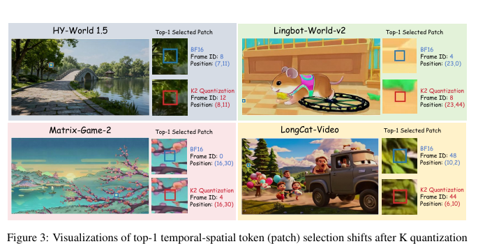
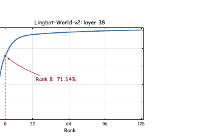

# AI Daily

## QuantWM——KV Cache 壓縮其實是 Attention-Energy Fidelity 問題

> **一句話摘要：** QuantWM 發現，影片／世界模型的 2-bit KV cache 不能只最小化 Key 的元素級重建誤差；真正需要保護的是歷史 Query 所定義的 $QK^{\top}$ logit 與 temporal–spatial token 排序。它以嚴格 causal、training-free 的 QSAC 選擇較不易破壞敏感方向的 Key centroid，再用 PSAC 在低維 Query 主子空間補回剩餘誤差。作者在五個自回歸影片／世界模型上報告最高 **6.20× KV cache 壓縮**，同時降低 token-selection shift 與 frame-level 畫質退化；但結果目前仍限於 causal video/world-model pipeline，不應直接外推至一般 LLM、bidirectional video diffusion 或所有 bitwidth。[1]

## 一、論文基本資訊

| 欄位 | 內容 |
|---|---|
| 論文標題 | **QuantWM: Temporally Consistent 2-Bit KV Cache Quantization for World Models and Video Generation** |
| 作者 | Jiaqi Zhao、Xiaobin Hu、Bo Yin、Junpeng Jiang、Miao Zhang、Shuicheng Yan |
| 研究單位 | Harbin Institute of Technology (Shenzhen)；National University of Singapore |
| 發表狀態 | arXiv:2609.26425v2，2026-09-23 更新；論文首頁標示 **Preprint. Under Review**，目前沒有正式會議或期刊資訊。[1] |
| 研究領域 | Autoregressive video generation、world models、KV-cache compression、training-free inference、attention/logit preservation |
| 主要模型 | Causal-Forcing、LingBot-World-v2、HY-World 1.5、Matrix-Game-2、LongCat-Video |
| 程式碼與權重 | 本次核對的 arXiv 頁面與官方 project page 沒有提供可驗證的 GitHub implementation 或 weights 連結；因此本文將性能數字標記為作者報告，而不是獨立重現結果。[1] [6] |
| 本次去重結果 | 已檢查 `KaiCobra/AI_Daily` 的 README、INDEX 與既有報告路徑，未發現 `QuantWM`、`2609.26425`、`QSAC` 或 `PSAC` 的既有文章。[7] |

## 二、為什麼今天選這篇

這篇論文與近期關注的 **training-free、attention modulation、autoregressive video 與 Energy-based Transformer** 有直接交集。它沒有把「壓縮率」當作唯一目標，而是追問一個更有研究價值的問題：**如果 Key 的平均 MSE 很小，為什麼生成影片仍會閃爍？** QuantWM 的答案是，Key 不只是被送入 value aggregation 的資料；它先決定 Query 會把注意力放到哪一個歷史 frame、哪一個 spatial patch。只要小誤差改變 logit 的相對排序，就可能把模型導向不同的視覺記憶。[1]

這個選題也能補上 repository 既有文章的另一個角度。既有工作多討論 attention map 如何被 guidance、sparse routing 或 semantic condition 改寫；QuantWM 則從低位元壓縮出發，提出一種更底層的 **attention-energy fidelity** 觀點：量化器應該優先保存 Query 真正在意的 Key 誤差方向，而不是盲目追求全空間的平均重建誤差。這個視角很適合延伸到 energy-based routing、JEPA predictive uncertainty、VAR 的 scale-wise memory，以及 zero-shot 的 inference-time intervention。

## 三、問題背景與相關研究脈絡

在 causal 或 autoregressive 影片生成中，模型以 chunk 為單位逐步產生影片。每個新 chunk 都需要讀取歷史 Key/Value，因此系統會把歷史表示保存在 KV cache。若影片解析度、時間長度或 latent token 數增加，KV cache 會線性成長；QuantWM 在 93-frame、480p 設定中引用 LingBot-World-v2 超過 21 GiB 的 cache 需求，說明記憶體容量本身會限制可保留的歷史。[1]

早期的影片 KV cache 壓縮方法 **Quant VideoGen (QVG)** 利用影片 token 的空間與時間冗餘，先以 k-means 將相似 token 分群，再以 centroid subtraction 把 residual 的動態範圍縮小，最後進行 progressive residual quantization。QVG 在影片模型上報告最高約 7× 壓縮與低於 4% 的端到端延遲增加，但它的 centroid assignment 主要以 token 距離為依據，沒有直接衡量 residual 量化後對 attention logit 的影響。[2]

LLM 領域的 **KIVI** 則指出 Key 與 Value 的統計結構不同：Key 常出現 channel-wise outlier，Value 則更接近 token-wise 的可量化形式。因此 KIVI 使用 Key per-channel、Value per-token 的 2-bit quantization，並保留一小段 recent window 的 full-precision cache。它說明「K 與 V 不應使用完全相同的量化規則」，但其主要證據來自語言模型，不會直接回答影片模型中 temporal–spatial token 是否被改選。[3]

**SQuat** 更直接以未來 Query 的 inner product 作為 Key cache 的保真目標。它先建立 task-relevant query subspace，再讓 Key quantization residual 盡量與該 subspace 正交；這與 QuantWM 有相同的核心直覺，即 Key 的價值取決於它和 Query 的互動，而不是獨立的 reconstruction error。不過 SQuat 主要在 LLM 的 reasoning 與 long-context benchmark 驗證，QuantWM 則把相似思路改成嚴格 causal 的歷史 Query statistics，並加入影片 KV cache 的 centroid–residual 量化流程。[4]

同期的 **Quantized Keys Steal Attention** 從另一個層次解釋 INT2 退化。該工作認為 Key quantization 的近似零均值 score noise 進入 softmax 後會因指數函數的凸性形成 Jensen bias，使 cached-token attention mass 系統性偏大。QuantWM 主要處理 softmax 前的 $QK^{\top}$ 擾動與 token ranking shift；兩者可以視為互補：前者修正 softmax 的統計偏差，後者減少 Key residual 在敏感 Query 方向造成的 logit 偏移。[5]

## 四、QuantWM 的核心方法

### 4.1 先把「Key MSE 小」與「生成品質好」拆開

令 $\mathbf Q$、$\mathbf K$ 分別為當前 Query 與歷史 Key。標準 attention logits 為

$$
\mathbf L=\frac{\mathbf Q\mathbf K^{\top}}{\sqrt d}.
$$

量化後的 Key 為 $\widehat{\mathbf K}$，則 logit 擾動為

$$
\Delta\mathbf L
=
\frac{\mathbf Q(\mathbf K-\widehat{\mathbf K})^{\top}}{\sqrt d}.
$$

這個式子說明，Key 誤差不是單獨存在的。它會先與 Query 做內積，再透過 softmax 影響 token 的相對權重。即使 $\lVert\mathbf K-\widehat{\mathbf K}\rVert$ 很小，只要誤差落在目前 Query 的高能量方向，便可能改變 top-1 temporal–spatial token。QuantWM 的 Table 1 顯示，在 HY-World 1.5 的 last layer，Key MSE 為 $0.0090$，Value MSE 為 $0.2939$，但 K-only output MSE 卻為 $0.5884$，遠高於 V-only 的 $0.1679$。這正是「元素級 MSE 不是 attention fidelity 代理量」的直接證據。[1]

量化的基本形式仍是 affine quantization：

$$
X_q=\operatorname{clip}\left(\left\lfloor\frac{X}{s}\right\rceil+z, q_{\min},q_{\max}\right),
\qquad
\widehat X=s(X_q-z),
$$

其中 $s$ 是 scale，$z$ 是 zero-point。QuantWM 沿用 QVG 的 centroid–residual 表示。對每個 Key token $\mathbf k_i$，先分配 centroid $\boldsymbol\mu_{z_i}$，再寫成

$$
\mathbf r_i=\mathbf k_i-\boldsymbol\mu_{z_i},
\qquad
\widehat{\mathbf k}_i
=\boldsymbol\mu_{z_i}+\mathcal Q_b(\mathbf r_i).
$$

centroid 保留 BF16，residual 使用 INT2 儲存。QuantWM 的創新不是重新發明這個資料格式，而是改寫「選哪一個 centroid」與「如何補回最敏感誤差」的準則。[1] [2]

### 4.2 QSAC：用歷史 Query 敏感度選 centroid

對 causal generation 而言，量化當前 cache chunk 時不能偷看未來 Query。QuantWM 因而只維護先前 generation steps 觀測到的 Query 二階統計。對 attention head $h$，令

$$
\mathbf M_h^{t-1}
=
\frac{1}{N_{<t}}
\sum_{\tau<t}\sum_i
\mathbf q_{\tau,i,h}\mathbf q_{\tau,i,h}^{\top}.
$$

若 Key error 為 $\mathbf e=\mathbf k-\widehat{\mathbf k}$，則忽略 $1/d$ 常數後，歷史 Query 對 squared logit error 的期望為

$$
\mathbb E_{\mathbf q}\left[(\mathbf q^{\top}\mathbf e)^2\right]
=
\mathbf e^{\top}\mathbf M_h^{t-1}\mathbf e.
$$

完整矩陣會增加 centroid assignment 成本，因此 QSAC 使用 diagonal approximation：

$$
\mathbf e^{\top}\mathbf M_h^{t-1}\mathbf e
\approx
\sum_c [\mathbf M_h^{t-1}]_{cc}e_c^2.
$$

把每個 channel 的敏感度正規化為

$$
w_{h,c}
=
\frac{[\mathbf M_h^{t-1}]_{cc}}
{\frac1d\sum_{c'}[\mathbf M_h^{t-1}]_{c'c'}}.
$$

較大的 $w_{h,c}$ 表示歷史 Query 更常在該 channel 具有較高能量。QSAC 先用加權距離選出少數候選 centroid：

$$
d_Q(\mathbf k_i,\boldsymbol\mu_j)
=
\sum_c w_{h,c}(k_{i,c}-\mu_{j,c})^2.
$$

對候選 $\boldsymbol\mu_j$，令 residual 為 $\mathbf r_{ij}=\mathbf k_i-\boldsymbol\mu_j$。若 quantization group $\mathcal G_g$ 的動態範圍為

$$
R_g(\mathbf r_{ij})
=
\max_{c\in\mathcal G_g}r_{ij,c}
-
\min_{c\in\mathcal G_g}r_{ij,c},
$$

則 uniform $b$-bit quantization 的誤差近似為

$$
\mathbb E[e_c^2]
\approx
\frac{R_g(\mathbf r_{ij})^2}
{12(2^b-1)^2}.
$$

QSAC 把 Query 敏感度與 residual range 合併成 centroid score：

$$
S(\mathbf k_i,\boldsymbol\mu_j)
=
\sum_g
\left(\sum_{c\in\mathcal G_g}w_{h,c}\right)
R_g(\mathbf r_{ij})^2,
$$

並選擇

$$
z_i=\arg\min_{j\in\mathcal C_i}S(\mathbf k_i,\boldsymbol\mu_j).
$$

因此 QSAC 不再問「哪個 centroid 讓 Key 的普通距離最小」，而是問「哪個 centroid 讓 INT2 residual 在歷史 Query 最敏感的方向上最不容易造成 logit 擾動」。這個改寫也是 QuantWM 最接近 energy-based reasoning 的部分：$S$ 可以被理解成一個近似的 attention-perturbation energy。[1]

### 4.3 PSAC：只補回 Query 主子空間中的 Key error

QSAC 仍然受限於 INT2 的表示容量。令 QSAC 反量化後的 Key 為 $\widehat{\mathbf K}_0$，剩餘誤差為

$$
\mathbf E=\mathbf K-\widehat{\mathbf K}_0.
$$

其歷史 Query 期望 logit 擾動可寫成

$$
\mathcal D(\mathbf E)
=
\mathbb E_{\mathbf Q}\left[\lVert\mathbf Q\mathbf E^{\top}\rVert_F^2\right]
=
\operatorname{Tr}\left(
\mathbf E\mathbf M_h^{t-1}\mathbf E^{\top}
\right).
$$

若直接儲存完整 $\mathbf E$，補償成本會抵消量化節省的記憶體。QuantWM 因此對 Query moment matrix 做特徵分解：

$$
\mathbf M_h^{t-1}
=
\mathbf U_h\mathbf\Lambda_h\mathbf U_h^{\top},
\qquad
\lambda_1\geq\lambda_2\geq\cdots\geq\lambda_d.
$$

保留最大的 $r$ 個 eigenvectors 組成 $\mathbf U_r$，並只儲存剩餘 Key error 在這些方向上的投影：

$$
\mathbf C=\mathbf E\mathbf U_r.
$$

推理時以低秩形式補回：

$$
\widehat{\mathbf K}
=
\widehat{\mathbf K}_0+\mathbf C\mathbf U_r^{\top},
$$

等價地，attention logit 可寫成

$$
\mathbf Q\widehat{\mathbf K}^{\top}
=
\mathbf Q\widehat{\mathbf K}_0^{\top}
+
\mathbf Q\mathbf U_r\mathbf C^{\top}.
$$

實作使用 $r=8$；$\mathbf U_r$ 以 BF16 儲存，$\mathbf C$ 量化為 INT8。Figure 4 顯示在 LingBot-World-v2 的一個 layer 中，前 8 個方向涵蓋約 71.14% 的 cumulative Query energy。這不是把所有 Key error 都補回，而是只保留最可能改變 attention ranking 的低維方向。[1]

*圖 1：同一 Query 在 BF16 與 K2 quantization 下可能選到不同的 frame 或 spatial patch。這張圖支持 QuantWM 將 token-selection fidelity 作為量化目標，而不只看 Key reconstruction error。[1]*

*圖 2：Query energy 集中在低維主子空間，為 PSAC 的低秩 compensation 提供經驗依據；論文圖中 rank 8 標示為 71.14%。[1]*

### 4.4 嚴格 causal 的推理流程

QuantWM 的 causal 約束可以整理成以下順序：

1. 當前 cache chunk 建構完成後才進行一次量化，不重複量化同一 chunk。
2. 第一個 chunk 沒有歷史 Query，QSAC 使用 uniform channel sensitivity，PSAC 暫停。
3. 當前 chunk 完成後，才把它的 Query 納入歷史 statistics，供後續 chunk 使用。
4. 實作使用 256 個 centroids、group size 64、BF16 centroids、INT2 residual；PSAC 使用 top-8 Query eigenvectors，並以客製 Triton kernel fuse unpacking、centroid gather、Key reconstruction 與 compensation。[1]

這個設計使 QuantWM 不需要 calibration dataset、額外 training stage 或未來資訊。可是它也帶來一個值得注意的 trade-off：**冷啟動 chunk 沒有完整 subspace compensation**，而歷史 Query statistics 的品質會隨 generation 進程改變。換句話說，QuantWM 不是一個對所有時間點固定不變的壓縮器，而是一個 state-dependent、history-dependent 的 inference controller。

## 五、實驗設計與主要結果

作者在五個 open-source causal/autoregressive video 或 world models 上評估，主實驗使用 480p 與 720p、每段 93 frames。量化基線包括 QVG 與 KIVI；指標分成較直接反映逐 frame distortion 的 PSNR、SSIM、LPIPS，以及 VBench 的 Subject、Background、Aesthetic、Image 與 Average。[1]

### 5.1 480p frame-level quality 與 VBench

下表整理論文 480p Table 3 的主要 frame-level 結果。PSNR、SSIM 越高越好，LPIPS 越低越好；`Ours` 即 QuantWM。[1]

| 模型 | 方法 | PSNR ↑ | SSIM ↑ | LPIPS ↓ | VBench Avg. ↑ |
|---|---|---:|---:|---:|---:|
| Matrix-Game-2 | QVG | 17.749 | 0.5651 | 0.2851 | 0.7662 |
| Matrix-Game-2 | QuantWM | **20.615** | **0.7212** | **0.1443** | **0.7836** |
| LingBot-v2 | QVG | 14.414 | 0.5726 | 0.2779 | 0.7707 |
| LingBot-v2 | QuantWM | **16.138** | **0.6688** | **0.1893** | **0.7732** |
| HY-World 1.5 | QVG | 16.118 | 0.6559 | 0.2114 | 0.8127 |
| HY-World 1.5 | QuantWM | **18.449** | **0.7661** | **0.1082** | **0.8173** |
| LongCat-Video | QVG | 20.683 | 0.8556 | 0.0784 | 0.8122 |
| LongCat-Video | QuantWM | **25.508** | **0.9286** | **0.0332** | **0.8130** |
| Causal-Forcing | QVG | 14.887 | 0.6773 | 0.2185 | 0.8008 |
| Causal-Forcing | QuantWM | **16.283** | **0.7464** | **0.1554** | **0.8042** |

QuantWM 在五個模型的 frame-level metrics 都優於 QVG。最顯著的例子是 LongCat-Video：PSNR 由 $20.683$ 提升至 $25.508$，LPIPS 由 $0.0784$ 降至 $0.0332$。VBench 平均分則只反映較小幅度的差異，支持作者對「傳統 video benchmark 可能漏掉 temporal flickering」的提醒。這也是為什麼本文同時報告 frame-level distortion 與 token-shift，而不能只看 VBench。[1]

### 5.2 Attention token-selection shift

作者以 BF16 的 top-1 temporal–spatial patch selection 作參考，計算量化後的 shift ratio：

| 方法 | Matrix-Game-2 | LingBot-v2 | HY-World 1.5 | LongCat-Video | Causal-Forcing |
|---|---:|---:|---:|---:|---:|
| QVG | 53.88% | 54.91% | 61.36% | 50.34% | 37.28% |
| QuantWM | **10.19%** | **16.00%** | **13.92%** | **22.25%** | **14.20%** |

QVG 在 HY-World 1.5 的 shift ratio 達 61.36%，QuantWM 降至 13.92%。這個結果比單純的 output PSNR 更接近論文提出的機制假說：QSAC 與 PSAC 的價值是減少 Query 被導向錯誤歷史 patch 的機率，而不只是讓量化後 tensor 的數值平均更接近 BF16。[1]

### 5.3 QSAC 與 PSAC 消融

HY-World 1.5 的消融如下。沒有 QSAC、PSAC 時即 QVG-style baseline；PSAC 對 token shift 的改善比 QSAC 更直接，而兩者合併取得最佳 overall result。[1]

| QSAC | PSAC | PSNR ↑ | SSIM ↑ | LPIPS ↓ | Token Shift ↓ |
|---|---|---:|---:|---:|---:|
| × | × | 16.118 | 0.6559 | 0.2114 | 61.37% |
| ✓ | × | 17.990 | 0.7423 | 0.1285 | 38.17% |
| × | ✓ | 17.849 | 0.7358 | 0.1312 | 22.90% |
| ✓ | ✓ | **18.449** | **0.7661** | **0.1082** | **13.92%** |

這個消融支持一個清楚的因果分工。QSAC 主要在「選 centroid」階段降低敏感 channel 的 residual range；PSAC 則在「讀取 cache」階段直接補回 Query 主子空間中的 Key error。前者改變 cache representation，後者改變 attention execution，兩者並不是重複的 heuristic。

### 5.4 720p 與 1-minute long-horizon

在 720p、93-frame 實驗中，QuantWM 仍然在五個模型的 frame-level quality 上優於 QVG。例如 Matrix-Game-2 的 PSNR/LPIPS 由 QVG 的 $17.721/0.3047$ 改善至 $20.568/0.1651$；LongCat-Video 則由 $20.988/0.1098$ 改善至 $25.127/0.0503$。這表示方法增益不只存在於較低解析度的設定。[1]

作者也測試 1-minute long-horizon generation，重點觀察 VBench Average：

| 模型 | QVG | QuantWM | 提升 |
|---|---:|---:|---:|
| Matrix-Game-2 | 0.6417 | 0.6796 | +0.0379 |
| LingBot-v2 | 0.8063 | 0.8168 | +0.0105 |
| HY-World 1.5 | 0.5949 | 0.6627 | +0.0678 |
| LongCat-Video | 0.7680 | 0.7784 | +0.0104 |
| Causal-Forcing | 0.6576 | 0.6744 | +0.0168 |

長影片結果符合 QuantWM 的設計目標：在多個 generation step 中，量化誤差可能累積成更大的 trajectory deviation，因此保護 attention token selection 應該比只追求單 chunk 的 MSE 更重要。不過這些仍是作者在五個模型上的 VBench 結果，尚不足以證明所有長影片或所有 rollout policy 都能獲得相同收益。[1]

### 5.5 記憶體與延遲

QuantWM 在 93-frame generation 中最高達 **6.20×** KV cache compression；LongCat-Video 的 cache 由 21.709 GiB 降至 3.625 GiB。端到端 latency 的結果則不是單調改善：LingBot-World-v2 為 193.56→204.09 秒，增加 5.44%；HY-World 1.5 為 112.17→118.75 秒，增加 5.87%；LongCat-Video 則由 255.35 降至 209.94 秒，降低 17.78%。[1]

因此，「limited overhead」應該理解成這三個測試案例中的有限影響，而不是對任意硬體、cache placement 或 pipeline 都成立的固定上界。LongCat-Video 的加速與 host–GPU offloading 和壓縮後資料搬移減少有關；量化方法本身仍需要 centroid lookup、INT2 unpacking、PSAC compensation 與 custom kernel。[1]

## 六、限制、可重現性與應如何解讀

第一，QuantWM 的驗證範圍是五個 open-source causal/autoregressive video 或 world models，主要是 INT2 KV cache。結果不應直接外推到一般 LLM、bidirectional video diffusion、不同 bitwidth 或沒有 causal cache 的模型。[1]

第二，QSAC 使用 diagonal Query second-moment approximation，而不是完整的 $\mathbf M_h$。作者提供的 full-matrix 對照並沒有帶來一致品質收益，卻增加成本；這表示 diagonal approximation 是有效的工程折衷，但不是理論上已證明的全域最優解。[1]

第三，方法需要歷史 Query statistics。第一個 chunk 只能使用 uniform sensitivity，並停用 PSAC；$r$ 與候選 centroid 數 $M$ 也會影響額外 storage 與 assignment cost。作者在兩個模型上展示了這些超參數的消融，但尚未證明 $r=8$、$M=4$ 或 256 centroids 對所有模型都普遍最佳。[1]

第四，論文用 PSNR、SSIM、LPIPS、VBench 與 token-shift ratio 評估視覺一致性，但沒有提供大規模人類主觀評分、跨 seed 的統計信賴區間，亦沒有完整分析所有 layer/head 的 sensitivity。VBench 可能漏掉低 bit cache 造成的 temporal flicker，因此不能用「VBench 接近 BF16」推論人眼觀看完全無差異。[1]

第五，v2 metadata 顯示 arXiv 在 2026-09-23 更新；本次方法與主要表格核讀以 v2 HTML/PDF 為主，部分局部圖表擷取自 v2 PDF。論文目前標示 Under Review，且本次未找到可驗證的官方 GitHub code/weights。讀者若要重現，還需要正確的五個 backbone、MovieGen prompt suite、客製 Triton kernel、A800 環境與各模型原生 KV cache convention。[1] [6]

## 七、個人評價與研究意義

我認為 QuantWM 最值得保留的研究命題不是「2-bit 能不能壓到 6.20×」，而是：**對一個會被 Query 讀取的記憶體，representation fidelity 應該以 interaction energy 衡量，而不是以孤立的 reconstruction MSE 衡量。** 這個命題可以寫成更一般的形式。若量化誤差為 $\mathbf E$，則一個 Query distribution $p(\mathbf q)$ 所看見的誤差能量可以定義為

$$
\mathcal E_{\mathrm{attn}}(\mathbf E)
=
\mathbb E_{\mathbf q\sim p(\mathbf q)}
\left[
\left(\mathbf q^{\top}\mathbf E\right)^2
\right].
$$

QuantWM 以歷史 Query 的二階矩近似這個 energy，再用低秩 eigen-subspace 做 compensation。這使它同時具備三個值得延伸的特性：它是 inference-time、training-free；它對 attention logits 進行明確干預；它保留了一個可解釋的 state-dependent error objective。

| 評估面向 | 判斷 |
|---|---|
| 新穎性 | 高。QVG 已把 centroid–residual 帶入影片 KV cache；QuantWM 的新意在於把 Query sensitivity、residual range 與 low-rank attention compensation 串成同一個 causal pipeline。[1] [2] |
| 方法清晰度 | 高。QSAC 在 cache 寫入時選 centroid，PSAC 在 attention 讀取時補回主子空間；兩個模組的責任分工明確。 |
| 實驗可信度 | 中高。包含五個模型、QVG/KIVI baseline、480p/720p、長影片、token-shift、消融與 latency；但仍缺少獨立 reproduction、人評與更多模型家族。[1] |
| 實用性 | 中高。training-free 且不改 backbone，但需要 custom kernel、歷史 Query statistics、額外補償資料，以及對各模型 cache convention 的工程整合。 |
| 主要風險 | 「6.20×」是 cache memory compression，不是整個模型或端到端系統的 6.20× 加速；LongCat 的 latency 降低也不應被當作普遍保證。 |

## 八、可以激發後續研究的方向

### 8.1 Energy-based KV routing

把 QSAC score 正式視為 compatibility energy，並將其從 centroid assignment 擴展到 token retention。對每個歷史 token $i$，可以定義

$$
E_i
=
\operatorname{Tr}
\left(
\mathbf e_i\mathbf M_h\mathbf e_i^{\top}
\right)
+
\lambda\,\operatorname{Cost}(i),
$$

再讓 cache 在固定 memory budget 下保留最低 energy 的 token。這會把「均勻壓縮所有 token」改寫成 query-conditioned memory allocation，也能和 sparse attention 或 KV eviction 結合。

### 8.2 以 JEPA predictive disagreement 預測未來 Query energy

QuantWM 只使用已觀察的歷史 Query。如果 frozen V-JEPA、MotionJEPA 或其他 world-model encoder 能預測下一個 chunk 的 latent state，就可以讓 predictor 估計未來 Query distribution 的不確定性。令 $\widehat{\mathbf M}_{t+1}$ 為預測的 Query moment，令 $U_{t+1}$ 為 predictive disagreement，則可使用

$$
\widetilde{\mathbf M}_{t+1}
=
\widehat{\mathbf M}_{t+1}
+
\beta U_{t+1}
$$

作為 QSAC 的敏感度矩陣。高 disagreement 時不要盲目使用低秩 compensation，而應增加保留 bitwidth、擴大 recent window 或回退到 BF16。這會把 JEPA 從 representation learner 轉成 cache policy 的 predictive critic。

### 8.3 VAR 的 scale-wise KV cache fidelity

Visual Autoregressive Models 不一定以影片 chunk 的時間順序生成，而是可能以 coarse-to-fine scale 產生視覺 token。QuantWM 的 Query subspace 可以改成每一個 scale $s$ 維護一組 $\mathbf M_h^{(s)}$，並讓 QSAC/PSAC 的 rank $r_s$ 隨尺度變化：粗尺度優先保存 layout-bearing directions，細尺度則優先保存 texture-bearing directions。這可能比單一全局 $r=8$ 更符合 VAR 的 token semantics。

### 8.4 Training-free 與 zero-shot 的嚴格 protocol

QuantWM 是 training-free，但它不是 zero-cost，也不等於對新模型完全 zero-shot。它仍需要已部署 backbone 的 Query statistics、centroid construction、custom kernel 與特定 cache convention。後續工作應分開報告：是否更新 backbone、是否需要 calibration data、是否需要每個模型調參、是否需要每個 prompt 或 seed 重估 statistics，以及額外 forward、memory 與 wall-clock cost。這樣才能避免把「不訓練」誤寫成「不需要任何模型特定適配」。

### 8.5 和 Jensen-bias correction 組成兩層 attention stabilizer

QuantWM 修正 pre-softmax 的 Key perturbation；Quantized Keys Steal Attention 則修正 softmax 後的 cached-token mass inflation。[5] 一個有趣的組合是先以 QSAC/PSAC 降低

$$
\Delta L=Q(K-\widehat K)^{\top}/\sqrt d,
$$

再以 score-level bias correction 估計剩餘量化 noise 的 Jensen gap。這可以形成一個兩層 controller：第一層保護 token ranking，第二層保護 cached/current attention mass。實驗上應特別檢驗兩者是否互補，或其中一層已吸收另一層的改善。

## 九、結論

QuantWM 將 video/world-model KV cache compression 從「把 tensor 壓得更像原 tensor」推進到「保留模型會用來選記憶的 attention geometry」。QSAC 用歷史 Query statistics 對 centroid assignment 加權，PSAC 再以 low-rank Query subspace 補回最敏感的 Key residual。五個模型、720p 與 1-minute 結果支持這條機制鏈：QuantWM 同時降低 frame-level distortion、token-selection shift 與長 horizon 的 VBench 退化，並最高壓縮 6.20× cache memory。[1]

對研究者而言，這篇論文最可延伸的地方是它把 **training-free attention modulation** 寫成一個具有統計解釋的 inference objective。下一步不一定是再做一個更複雜的量化器，而可能是讓 JEPA 預測未來的 Query energy，讓 VAR 依 scale 分配記憶體，或讓 energy-based controller 在品質不確定時自動選擇壓縮率與 attention routing。QuantWM 目前尚未證明這些方向，但它提供了足夠清楚的數學介面，讓它們可以被實驗驗證。

## References

[1]: https://arxiv.org/abs/2609.26425 "QuantWM: Temporally Consistent 2-Bit KV Cache Quantization for World Models and Video Generation"
[2]: https://arxiv.org/abs/2602.02958 "Quant VideoGen: A Training-Free KV Cache Quantization Framework for Autoregressive Video Generation"
[3]: https://arxiv.org/abs/2402.02750 "KIVI: A Tuning-Free Asymmetric 2bit Quantization for KV Cache"
[4]: https://arxiv.org/abs/2503.24358 "SQuat: Subspace-orthogonal KV Cache Quantization"
[5]: https://arxiv.org/abs/2605.26266 "Quantized Keys Steal Attention: Bias Correction for KV-Cache Compression in Video Diffusion"
[6]: https://quantwm-project.github.io/QuantWM/ "QuantWM project page"
[7]: https://github.com/KaiCobra/AI_Daily "KaiCobra/AI_Daily repository"
