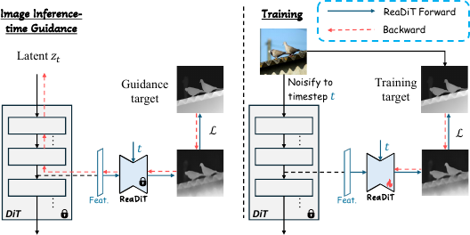
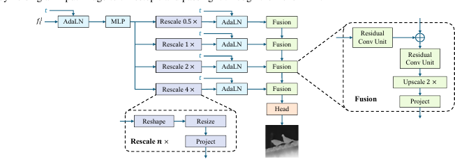
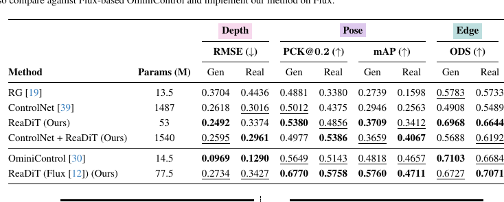
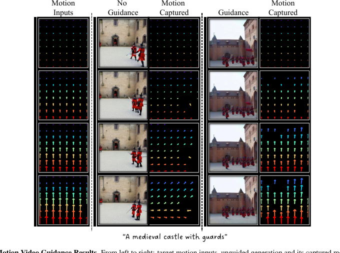

# AI Daily

## ReaDiT Guidance: Control for Image and Video Generation using Diffusion Transformer Features

**日期：2026-09-08**  
**今日精選：ReaDiT Guidance — Control for Image and Video Generation using Diffusion Transformer Features**  
**作者：Jay Mahajan、Chang Liu、Rauf Makharov、Viraj Shah、Alexander Schwing、Svetlana Lazebnik；University of Illinois Urbana-Champaign，Alexander Schwing 目前任職於 Google**  
**來源：arXiv:2609.04649v1，2026-09-04 提交；目前尚未標示同行評審會議或期刊** [1] [2]

> **一句話結論：** ReaDiT 把預訓練 Diffusion Transformer 的單一中間 block 當成空間感知器，以一個約 53M 參數的 readout 讀出 depth、pose、edge 或 optical flow，再在推理時只更新 latent、不修改基礎 DiT，統一實現影像空間控制、影片空間控制與鏡頭／運動控制。

## 1. 為什麼今天選這篇

本次先以 2026-09-02 至 2026-09-08 的 arXiv 新提交論文為主，並交叉檢查論文全文、官方頁面與使用者提供的 `KaiCobra/AI_Daily` 既有索引。現有儲存庫在本次整理前已有 155 篇解析；我以 arXiv ID 與標題雙重比對，排除了已收錄的 Energy-Based Transformer、JEPA、VAR、training-free 與 attention-modulation 工作。

候選論文的研究方向與取捨如下。ReaDiT 最適合今日主題，因為它同時命中 **DiT 內部特徵、training-free 推理控制、attention／feature modulation、影像生成與影片生成**。它不是單一 benchmark 的小幅改善，而是把 image control、video spatial control 和 camera/motion control 放到同一個 latent-control 介面中。

| 候選方向 | 論文 | 與今日主題的關聯 | 未選為主文的原因 |
|---|---|---|---|
| DiT 內部特徵與推理控制 | **ReaDiT Guidance** [1] | 單一 DiT block、latent-gradient guidance、影像與影片統一 | 今日最平衡的選擇 |
| DiT 低秩壓縮 | Importance-Aware Low-Rank Distillation of Diffusion Transformers [9] | training-free 壓縮、重要性感知 rank allocation | 主要實驗集中於 FLUX，部分版本仍需蒸餾訓練 |
| JEPA 表徵 | Spectral-Target Physical Latent Structuring for JEPA-Style World Models [8] | 直接處理 physical representation laziness | 實驗以 simulator 和 ground-truth 幾何監督為主 |
| 開放式生成系統 | LLaDA-Image [10] | 6B DiT、統一生圖／編輯、few-step distillation | 更偏完整訓練 recipe，與今日指定的 attention／training-free 方向較間接 |
| 參考圖局部控制 | RefDiT [11] | attribute token、region consistency、Adobe 研究背景 | 需要每個參考圖進行 LoRA 訓練，且 benchmark 較為策展式 |

因此，ReaDiT 的價值不只在於「控制結果更好」，而在於它提出一個值得延伸的研究問題：**預訓練 DiT 內部已經隱含了多少可被讀出的幾何與運動資訊？如果把這些資訊變成可微的推理時能量，能否以更低成本控制生成？**

## 2. 論文基本資訊

| 項目 | 內容 |
|---|---|
| 論文標題 | ReaDiT Guidance: Control for Image and Video Generation using Diffusion Transformer Features |
| 作者與機構 | Jay Mahajan、Chang Liu、Rauf Makharov、Viraj Shah、Alexander Schwing、Svetlana Lazebnik；University of Illinois Urbana-Champaign；Alexander Schwing 目前任職於 Google |
| 發表狀態 | arXiv cs.CV preprint，v1 於 2026-09-04 提交；尚未在 arXiv metadata 中標示正式會議 |
| 基礎生成模型 | SD3-Medium、FLUX.1-dev、CogVideoX |
| 控制任務 | 影像 depth、pose、edge；影片 depth、pose、edge 與 optical-flow motion |
| 主要訓練資料 | 約 16K PascalVOC 影像；DepthAnythingV2、OpenPose、HED 產生標籤；motion 使用 DAVIS 與 CoTracker3 |
| 推理核心 | 凍結 DiT 與 ReaDiT readout，只以 latent gradient refinement 配合原本 flow-matching step |
| 主要硬體 | 論文表示訓練與 guidance 可在單張 NVIDIA A40 執行 |

## 3. 核心貢獻與創新點

### 3.1 從 U-Net 多層讀出轉向 DiT 單層讀出

先前的 Readout Guidance（RG）將凍結 diffusion model 的中間特徵讀出成 depth、pose 或 edge，再用推理時 latent 更新進行控制，但它主要為 U-Net 設計。[3] U-Net 的不同 up-block 具有天然的多尺度差異；DiT 則在固定 token 維度與空間解析度上逐層處理，內部 block 的表徵反而高度相似。

ReaDiT 的關鍵觀察是：**對 DiT 而言，多個 block 不一定比單一 block 更有用。** 論文以 PCA 與線性映射分析不同 block，報告不同 DiT block 間的平均線性 $R^2$ 約為 $0.7$。在 depth prediction 實驗中，單一 block 訓練出的 readout 甚至穩定優於串接最後十個 block。作者將原因歸於冗餘輸入帶來的 multicollinearity，使 readout 參數更敏感，反而降低泛化。

這個觀察將「更多層、更多 feature」的直覺改成更可檢驗的假設：**控制模組的最佳輸入可能是資訊最穩定、冗餘最少的單一表徵層。**

### 3.2 一個 readout 架構覆蓋多種控制訊號

ReaDiT 的 readout 不為 depth、pose、edge 和 motion 另設完全不同的主幹。它以相同的 time-conditioned multi-resolution decoder 處理 DiT feature，只有監督 target 和最後的 task-specific head 不同。這讓控制訊號的替換變成「換一個讀出目標」，而非重新設計整個 adapter。

### 3.3 推理時不改模型權重，只改 latent

ControlNet 等 feed-forward adapter 會把條件直接注入生成網路；ReaDiT 則讓原本的 DiT 看到同樣的輸入格式，並把 target matching 轉成 latent optimization。基礎 DiT 在 inference 時保持凍結，readout 也保持凍結，只有當前 latent $z_t$ 被更新。這個設計是它能同時覆蓋 image 和 video 的原因之一，也是它與 training-free attention modulation 的重要交集。

不過必須精確使用術語：ReaDiT **不是端到端完全免訓練**。每種控制任務仍需用標註或 pseudo-label 訓練一個 readout；它的 training-free 性質是指「使用者在推理時不需微調基礎生成模型」，而不是沒有任何任務訓練。

## 4. 技術方法：從 DiT feature 到 latent guidance

### 4.1 問題設定

令凍結的 DiT 生成器為 $D$。在 denoising 或 flow-matching 時間 $t$，從第 $l$ 個 Transformer block 取出中間特徵：

$$
f_t^l = D(z_t,t)\big|_{\text{block}=l},\qquad f_t^l\in\mathbb{R}^{N\times D}.
$$

其中 $N$ 是 token 數，$D$ 是 token channel 維度。ReaDiT 學習一個 readout $g_\theta$，把 feature 和 timestep 轉成控制預測：

$$
\hat y = g_\theta(f_t^l,t).
$$

論文實際採用 $|L|=1$，也就是只使用一個 DiT block，而不是把一組 block features 串接起來。[2]

### 4.2 Time-conditioned multi-resolution readout

*圖 1。左側顯示 ReaDiT 在推理時讀取凍結 DiT 的中間 feature，並以 guidance loss 更新 latent；右側顯示將輸入影像加噪至 timestep $t$ 後，訓練 readout 預測任務 target。圖片由論文 PDF 的 Figure 1 局部裁切。*

ReaDiT 的第一個模組是 encoder。因為 DiT feature 的分佈會隨 timestep 改變，作者先用 timestep-conditioned AdaLN 進行調制：

$$
\operatorname{AdaLN}(f_t^l,t)=\gamma(t)\odot \operatorname{Norm}(f_t^l)+\beta(t).
$$

接著用線性投影把 channel 維度由 $D$ 壓到 $D'$，再把 token 序列 reshape 為空間網格 $h\times w\times D'$。這裡的 AdaLN 不只是條件注入，也用來抑制 DiT block 中可能出現的 extreme outlier activations。[2]

*圖 2。輸入先經 AdaLN 與 MLP，再分成 $0.5\times$、$1\times$、$2\times$、$4\times$ 四個 rescale branch，最後由 fusion blocks 和 task head 輸出空間圖。圖片由論文 PDF 的 Figure 2 局部裁切。*

四個 rescale branch 產生多尺度特徵：

$$
\{r_i\}_{i=1}^{4},\qquad r_i\in\mathbb{R}^{h_i\times w_i\times D''},
$$

其中 $h_i,w_i$ 對應 $0.5\times$、$1\times$、$2\times$ 和 $4\times$ 空間尺度。每個 branch 再接受一次 timestep-conditioned AdaLN。fusion blocks 從粗到細逐級上採樣，並以 residual connection 合併相鄰尺度，最後交給 task-specific convolution head。

這個結構有兩個值得注意的設計。第一，它不是把 DiT feature 當成一般 token classifier，而是重新建立可解碼的空間多尺度 representation。第二，timestep conditioning 在 encoder 和 fusion 階段都出現，讓同一個 readout 能處理從高噪聲到低噪聲的 feature 分佈變化。

### 4.3 Readout 訓練目標

給定輸入影像 $x$，先把 VAE latent $z_0$ 加噪至 $z_t$，再通過凍結 DiT 取得 $f_t^l(x)$。控制 target $y(x)$ 由 task-specific model 產生。通用訓練目標為：

$$
\min_\theta\;\mathbb{E}_{x,t}
\left[\mathcal{L}\left(g_\theta(f_t^l(x),t),y(x)\right)\right].
$$

論文不是直接對 $t$ 做線性均勻取樣，而是採用 log-uniform：

$$
\log t\sim\mathcal{U}(\log t_{\min},\log t_{\max}).
$$

這會相對增加低噪聲區域的樣本量，同時保留其他 timestep 的資訊。作者認為只看低噪聲或過度取樣高噪聲都會造成不平衡。

對 depth、pose 和 edge 等 dense spatial prediction，損失是 MSE：

$$
\mathcal{L}_{\text{dense}}=\left\|g_\theta(f_t^l,t)-y\right\|_2^2.
$$

對 optical flow，ReaDiT 先把兩個 frame 的 readout 輸出視為 point descriptors $d_a,d_b$。其相似度矩陣為：

$$
S_{ij}=\frac{d_{a,i}\cdot d_{b,j}}
{\|d_{a,i}\|_2\,\|d_{b,j}\|_2}.
$$

對 $S$ 做帶溫度的 row-wise softmax 得到 $P$，再用座標網格 $G_j$ 的期望位置估計 correspondence：

$$
\hat p_i=\sum_{j=1}^{N}P_{ij}G_j,
\qquad
\hat y_i=\hat p_i-p_{s,i}.
$$

flow readout 使用 L1 loss：

$$
\mathcal{L}_{\text{flow}}=\left\|\hat y-y\right\|_1.
$$

### 4.4 將 guidance loss 視為推理時能量

在每個 flow-matching denoising step，ReaDiT 先由當前 latent 預測控制圖，再更新 latent。若把控制誤差定義為：

$$
E_y(z_t;t)=\mathcal{L}\left(g_\theta\left(D(z_t,t)\big|_{\text{block}=l},t\right),y\right),
$$

那麼 ReaDiT 的 refinement 就可寫成：

$$
z_t^{(i+1)}=z_t^{(i)}-\eta_t\nabla_{z_t}E_y(z_t^{(i)};t),
\qquad i=0,\ldots,M-1.
$$

完成 $M$ 次 latent refinement 後，才使用原本的生成器執行 flow step：

$$
 z_{t-1}=\operatorname{Step}\left(D(z_t^{(M)},t),t,z_t^{(M)}\right).
$$

這個表述很適合與使用者關注的 Energy-based Transformer 對接，但必須區分兩者：ReaDiT 的 $E_y$ 是由 task loss 臨時構成的 **推理時控制能量**，不是論文中另行訓練的 global energy-based model。它沒有學習一個明確的 scalar energy landscape 來取代 DiT，而是把既有 DiT feature 經過 readout 後的 target mismatch 轉成局部 latent gradient。

### 4.5 影片延伸

對影片 spatial guidance，ReaDiT 以每個 latent frame 的 prediction 和 target map 計算總損失。若影片模型在時間維度以 $s$ 倍下採樣，則第 $k$ 個 latent frame 對應輸出影片中的第 $k\cdot s$ 個 target frame。

對 motion guidance，第一幀與第 $k$ 幀的 descriptors 產生相對 optical flow：

$$
\hat y_k=\hat p_k-p_1.
$$

推理時以 flow L1 loss 讓生成影片追蹤指定的 camera pan、zoom 或 reference motion。這個設計沒有重新訓練一個大型 video adapter，而是把同樣的 readout-and-latent-optimization 介面沿時間維度展開。

## 5. 實驗設定與結果

### 5.1 實驗設定

ReaDiT 在 SD3-Medium 和 FLUX.1-dev 上做影像實驗，在 CogVideoX 上做影片實驗，解析度為 512。影像 readout 使用約 16K PascalVOC 圖片，depth、pose、edge 標籤分別由 DepthAnythingV2、OpenPose 和 HED 產生；optical flow 使用 DAVIS 影片和 CoTracker3 point tracks。論文報告訓練與 guidance 都可在單張 NVIDIA A40 上進行。

作者從 SD3-Medium 的 block 12、FLUX.1-dev 的 joint block 18 和 CogVideoX 的 block 15 取單一 feature。readout 的訓練只需少量 epoch：SD3 的 depth/pose/edge 使用 batch size 8、learning rate $10^{-5}$、2 epochs；FLUX 使用 batch size 4、learning rate $5\times10^{-5}$、2 epochs；CogVideoX 的 depth、pose、edge 分別使用 3、3、2 epochs，motion 使用 2 epochs。[2]

### 5.2 影像控制：少於 ControlNet 一個數量級以上的參數

*圖 3。Table 2 的局部裁切。Depth 的 RMSE 越低越好；pose 的 PCK@0.2、mAP 和 edge 的 ODS 越高越好。*

| 方法 | 參數量 | Depth RMSE Gen / Real | Pose PCK@0.2 Gen / Real | Pose mAP Gen / Real | Edge ODS Gen / Real |
|---|---:|---:|---:|---:|---:|
| RG | 13.5M | 0.3704 / 0.4436 | 0.4881 / 0.3380 | 0.2739 / 0.1598 | 0.5783 / 0.5733 |
| ControlNet | 1,487M | 0.2618 / **0.3016** | 0.5012 / 0.4375 | 0.2946 / 0.2563 | 0.4908 / 0.5489 |
| **ReaDiT** | **53M** | **0.2492** / 0.3374 | **0.5380** / 0.4856 | **0.3709** / **0.3412** | **0.6968** / **0.6644** |
| ControlNet + ReaDiT | 1,540M | 0.2595 / 0.2961 | 0.4977 / **0.5386** | 0.3659 / **0.4067** | 0.5688 / 0.6192 |

在 SD3-Medium 上，ReaDiT 以約 53M 參數顯著小於 ControlNet 的約 1,487M。它相對 RG 在所有影像控制任務和兩種 target 來源上都有改善。相對 ControlNet，ReaDiT 在生成影像 target 的 depth RMSE、pose PCK、pose mAP 與 edge ODS 都較好；在 real-image target 上，ControlNet 的 depth RMSE 較低，但 ReaDiT 在 pose mAP 和 edge ODS 較高，pose PCK 則由組合模型取得最佳結果。因此更準確的結論是 **53M 的 ReaDiT 達到有競爭力的控制精度，而不是在每一項指標都勝過 1,487M 的 ControlNet**。

Flux 版本的 ReaDiT 參數量為 77.5M，與 OminiControl 的 14.5M 結果使用同一套 evaluation suite，但兩者仍需考慮各自的控制架構與模型差異，不能把數字直接解讀成普遍優劣。

### 5.3 影片空間控制與 motion 控制

影片 spatial guidance 在 CogVideoX 上相對 RG 的結果如下：

| 方法 | 參數量 | Depth RMSE | Pose PCK@0.2 | Pose mAP | Edge ODS |
|---|---:|---:|---:|---:|---:|
| RG | 13.5M | 0.4610 | 0.1892 | 0.0496 | 0.5304 |
| **ReaDiT** | **53M** | **0.4225** | **0.3651** | **0.1555** | **0.6101** |

ReaDiT 在四個影片 spatial 指標均優於 RG。值得注意的是，影片 spatial readout 主要依照單幀協議訓練，但推理時仍能產生具有時間一致性的結果；這代表 pretrained video DiT 的時空 feature 已包含可被 readout 的空間結構，但不等於 readout 已學到完整的 temporal dynamics。

*圖 4。影片 motion guidance 的局部裁切。左側是 motion input，中間是未控制生成及其 captured motion，右側是 guidance 後生成及其 captured motion。*

motion EPE 的比較如下，數值越低越好：

| 方法 | 參數量 | Motion EPE |
|---|---:|---:|
| ImageConductor | 417M | 30.304 |
| Tora | 1,100M | **16.100** |
| DiTFlow | 0M | **18.576** |
| ReaDiT | 53M | 29.644 |

ReaDiT 略優於 ImageConductor，但落後專門的 motion-control 方法 Tora 和 training-free 的 DiTFlow。因此它在 motion 上的主張是 **統一性、低額外參數與可組合性**，而不是全面的 motion SOTA。這個 trade-off 很重要：同一套 readout 能覆蓋 depth、pose、edge 和 motion，但沒有針對快速動態設計 temporal upsampling 或專門 motion module。

### 5.4 Dual guidance：深度與姿態的多目標控制

ReaDiT 可以同時反傳 depth loss 和 pose loss。當兩個 target 來自同一張來源圖像時，depth + pose 的結果為 depth RMSE Gen/Real $0.3232/0.3534$、pose PCK@0.2 $0.5773/0.3589$、pose mAP $0.6712/0.5017$。相對單一 pose guidance，雙重 guidance 通常提升 pose adherence，同時維持相近的 depth accuracy。

作者也掃描 depth／pose guidance 的權重比例。結果顯示兩個 loss 之間存在可解釋的 Pareto trade-off：提高一方權重會提升該任務、但削弱另一任務；接近平衡的比例具有較佳總體表現。這個結果提示未來可以把多控制訊號的組合改寫成 constrained optimization 或 multi-objective energy projection，而不是固定手工調參。

### 5.5 是否破壞文字對齊與多樣性

論文以 CLIP-T 檢查文字對齊，以 pairwise LPIPS 檢查同一 prompt 下的生成多樣性。在 generated control maps 上，無 guidance 與 guided 的 CLIP-T / LPIPS 分別為 $36.14/0.594$ 和 $35.68/0.592$；在 real control maps 上分別為 $32.32/0.647$ 和 $32.18/0.644$。[2]

這些數字相當接近，支持「ReaDiT 主要改變控制的 spatial attribute，而沒有大幅犧牲文字對齊或多樣性」的主張。不過這是論文選定的 prompts、seeds 和 target 設定下的平均結果，不應推廣成任何強度的 guidance 都完全不改變生成分佈。

## 6. 與相關研究的關係

### 6.1 與 DiT 的關係：生成器同時也是可讀出的表徵網路

DiT 將 latent image patch 化後交給 Transformer，並以更高的 forward-pass compute 取得更好的生成品質與 scaling 行為。[4] ReaDiT 的新角度不是增加一個更大的 conditional branch，而是重新使用 DiT 已學到的中間 representation。這使生成器同時扮演兩個角色：一方面輸出 flow velocity，另一方面提供能被 readout 的 spatial feature。

### 6.2 與 Readout Guidance 的關係：從 U-Net recipe 到 DiT recipe

Readout Guidance 的核心是 frozen diffusion features、lightweight readout 和 inference-time latent gradient。[3] ReaDiT 延續這個思想，但針對 DiT token feature 的單尺度、跨 block 冗餘與 timestep outlier 重新設計 AdaLN、多尺度 rescale 和 fusion。換句話說，它不是單純把 RG 的 decoder 接到 DiT，而是提出「DiT features 應該如何被讀出」的架構假設。

### 6.3 與 ControlNet 的關係：不把條件放進生成器

ControlNet 凍結大型 diffusion backbone，再以額外分支學習 depth、pose、edge 等 spatial condition；其代表性設計是 zero-initialized convolution，並可以用小至 50K 的資料集訓練。[5] ReaDiT 的差異是 condition 不進入 DiT forward，而是在每一個 denoising step 透過 readout loss 反傳到 latent。這就是論文所稱的 implicit model conditioning。

這個差異帶來清楚的交換：ReaDiT 的參數與 task adapter 較小，且不同控制任務可以在 latent 空間中組合；代價是需要重複 forward/backward 的 inference-time optimization，速度明顯慢於一次前向的 feed-forward adapter。

### 6.4 與 Tora、DiTFlow 的關係：統一控制 vs 專用 motion 控制

Tora 以 trajectory extractor、spatio-temporal DiT 和 motion-guidance fuser 共同建構影片 motion control，能在不同時間長度與解析度下追蹤複雜軌跡。[6] DiTFlow 則分析 DiT 的 cross-frame attention，抽取 Attention Motion Flow，再以 training-free latent 與 positional-embedding optimization 進行 zero-shot motion transfer。[7]

ReaDiT 在 motion EPE 上不如這些專用方法，但它不只處理 motion。它將 depth、pose、edge 和 optical flow 放進同一個 readout/guidance interface，因而更適合研究「一個 generative backbone 如何支援多種可組合控制」的問題。

## 7. 個人評價：對 Energy-based、JEPA、VAR 與 attention modulation 的啟發

### 7.1 最值得保留的抽象：task loss 可以成為 inference-time energy

ReaDiT 最有啟發性的地方不是 53M 參數本身，而是將控制流程拆成兩層：凍結 generator 提供 representation 和 base dynamics；輕量 readout 將 representation 映射為可測量的 target；最後以 target mismatch 形成 latent energy。這個結構可以抽象為：

$$
E(z_t;y)=\mathcal{L}(r(D(z_t,t)),y),
\qquad
z_t\leftarrow z_t-\eta\nabla_{z_t}E.
$$

若未來把 $r$ 換成一個 calibrated energy head，或把多個 readout 的 energy 以 uncertainty-aware weighting 組合，便可更接近 Energy-based Transformer 的 inference-time reasoning。當前 ReaDiT 的 energy 是局部、任務特定且沒有全域正規化，這正是後續研究可以補強的地方。

### 7.2 與 JEPA 的交會：從單幀空間 readout 到預測式時序 critic

ReaDiT 讀出的是當前 latent 對應的 spatial target；JEPA 則更自然地描述「未來 latent 是否符合預測的 representation」。一個直接的延伸是，在影片 guidance 中增加 JEPA consistency energy：

$$
E_{\text{joint}}=\lambda_s E_{\text{spatial}}+
\lambda_m E_{\text{motion}}+
\lambda_j\left\|P_\phi(z_{t,k},a_k)-\operatorname{sg}(z_{t,k+1})\right\|_2^2.
$$

這可以用來抑制 ReaDiT 已知的 fast-motion failure，因為單純 optical-flow matching 可能追蹤局部位移，卻未必保證長期 representation transition 合理。這裡的 JEPA 不是論文已完成的模組，而是根據 ReaDiT 的 latent-control 介面提出的可驗證方向。

### 7.3 與 VAR 的交會：把連續 latent refinement 改成 scale-wise token control

ReaDiT 本身是 flow-based DiT，而不是 visual autoregressive model。若將其思想搬到 VAR，控制對象可以從連續 $z_t$ 改成第 $s$ 個 scale 的 token logits 或 hidden states：

$$
E_s=\mathcal{L}\left(r_s(h_{\le s}),y_s\right),
\qquad
h_s\leftarrow h_s-\eta_s\nabla_{h_s}E_s.
$$

這會產生一個 scale-wise readout guidance：早期 coarse scale 控制構圖與物件位置，後期 fine scale 控制邊緣、紋理與局部姿態。它與現有 VAR 的 training-free attention modulation 相比，優勢是可以直接利用 scale-conditioned hidden state；風險是 autoregressive cache、離散 token sampling 和 gradient path 會使控制更加不穩定。

### 7.4 與 attention modulation 的差異：ReaDiT 修改 latent，不直接修改 logit

attention modulation 通常在 attention logit、KV 或 token routing 上施加 bias；ReaDiT 則保留 attention 計算，透過 readout loss 的梯度修改輸入 latent。兩者可以組合成雙層 controller：attention modulation 先改變資訊路由，ReaDiT energy 再在 latent space 做全局幾何修正。

一個需要驗證的問題是：若只對特定 attention head 或 layer 做局部 modulation，是否能減少 ReaDiT 每個 denoising step 的 refinement 次數？如果可以，便可能把「慢但穩定的 latent optimization」蒸餾成「快但可控的 attention intervention」。

### 7.5 關於 zero-shot 的精確判斷

ReaDiT 能在 inference 時接受新的 depth、pose、edge 或 motion target，也不需要針對每個使用者重新微調基礎 DiT；在這個意義下，它具有 zero-shot target control 的味道。然而，readout 本身使用 PascalVOC、DepthAnythingV2、OpenPose、HED 和 DAVIS 訓練，因此不能稱為完全 zero-shot control。更精確的表述是：**frozen-backbone、inference-time training-free、task-specific readout control**。

## 8. 局限與可重現性檢查

第一，推理成本是最明顯的限制。論文報告單張 guided image 約需 1 分鐘，而 unguided 約 30 秒；16-frame guided video 約需 10 分鐘，而 unguided 約 1.5 分鐘，均以單張 A40 計算。[2] 這不是小幅 overhead，而是將每個 denoising step 變成多次 latent-gradient refinement。

第二，motion control 仍落後專用方法。ReaDiT 的 EPE 為 29.644，遠高於 Tora 的 16.100 和 DiTFlow 的 18.576。作者將差距主要歸因於缺少 temporal upsampling；對快速動態、長影片和遮擋，單幀訓練的 readout 可能不足。

第三，每種控制訊號都需要 readout 訓練與 task labels。depth、pose、edge 使用 off-the-shelf 模型產生 pseudo-label，這使方法的品質依賴標籤模型，也使「小資料」不等於「低成本」。如果換成新的控制訊號，仍需重新設計 target、loss 和資料管線。

第四，與 ControlNet 的比較雖然有參數量和同資料集的公平意圖，但不同 backbone、不同 control implementation 和不同 inference cost 仍會影響結果。論文也明確指出影片 ControlNet 因計算成本無法訓練，因此影片比較主要是與 RG，而不是與完整 ControlNet 對照。

第五，截至本次核驗，arXiv 官方記錄提供論文與 project URL，但未看到可直接核驗的官方 code/checkpoint release。這不影響論文方法的理解，但會限制獨立重現，尤其是 block selection、guidance loss normalization、AdamW schedule 與影片 temporal alignment 的細節。

## 9. 最終判斷

ReaDiT 值得收錄到 AI Daily，因為它把一個常被分開討論的問題——「生成模型的中間表徵是否已具備可控制的空間語義」——轉成可測量、可訓練、可在推理時反傳的介面。它的核心結果不是全面擊敗 ControlNet、Tora 或 DiTFlow，而是以較小的 readout 將同一套控制機制跨越 image、video、spatial 和 motion 任務。

我對這篇論文的評價是 **方法概念清楚、研究接口很強、實驗證據足夠支持主要主張，但 inference cost 和 motion quality 仍是產品化瓶頸**。若要沿著使用者關注的方向繼續研究，最值得優先做的是三件事：其一，把 task loss readout 正規化成可校準的 energy controller；其二，以 JEPA predictive consistency 補強影片長期與快速運動；其三，將 latent refinement 蒸餾成 scale-aware attention modulation 或 VAR 的 coarse-to-fine token control。

## References

[1]: https://arxiv.org/abs/2609.04649 "ReaDiT Guidance: Control for Image and Video Generation using Diffusion Transformer Features"
[2]: https://arxiv.org/html/2609.04649v1 "ReaDiT Guidance full text and supplementary material"
[3]: https://arxiv.org/abs/2312.02150 "Readout Guidance: Learning Control from Diffusion Features"
[4]: https://arxiv.org/abs/2212.09748 "Scalable Diffusion Models with Transformers"
[5]: https://arxiv.org/abs/2302.05543 "Adding Conditional Control to Text-to-Image Diffusion Models"
[6]: https://arxiv.org/abs/2407.21705 "Tora: Trajectory-oriented Diffusion Transformer for Video Generation"
[7]: https://arxiv.org/abs/2412.07776 "Video Motion Transfer with Diffusion Transformers"
[8]: https://arxiv.org/abs/2609.04264 "Spectral-Target Physical Latent Structuring for JEPA-Style World Models"
[9]: https://arxiv.org/abs/2609.04646 "Importance-Aware Low-Rank Distillation of Diffusion Transformers"
[10]: https://arxiv.org/abs/2609.03796 "LLaDA-Image: Building Strong Image Generators with Fully Open Training Recipes"
[11]: https://arxiv.org/abs/2609.04976 "RefDiT: Local Attribute Guidance in Reference-Based Image Generation"
