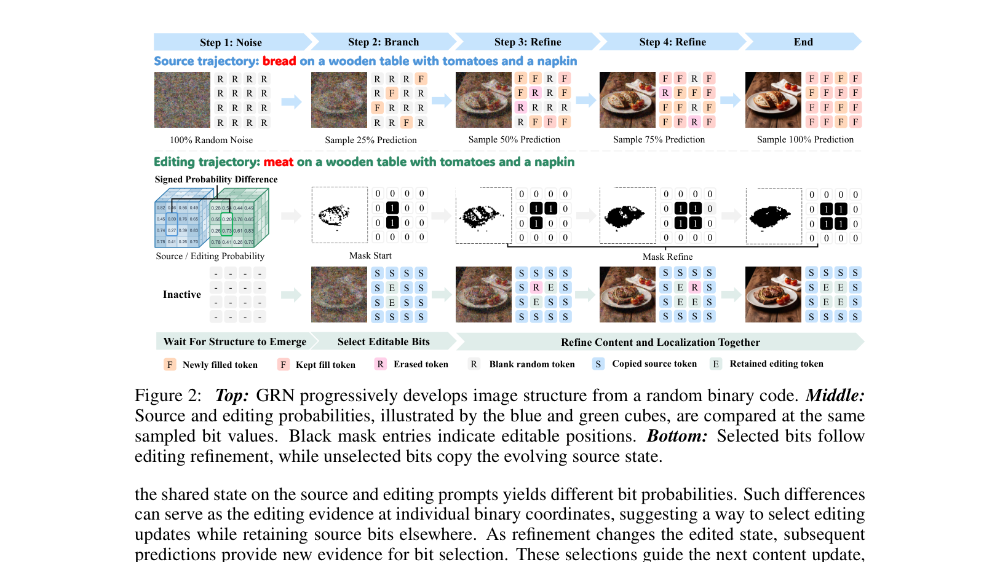
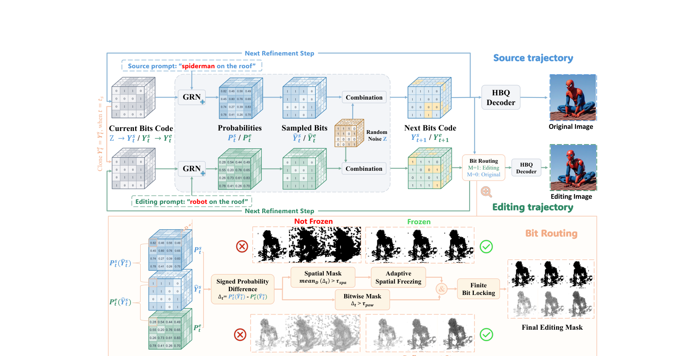
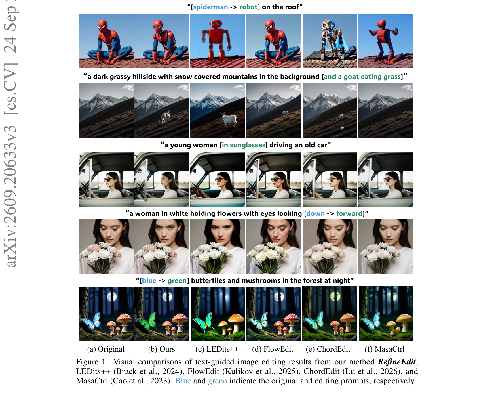
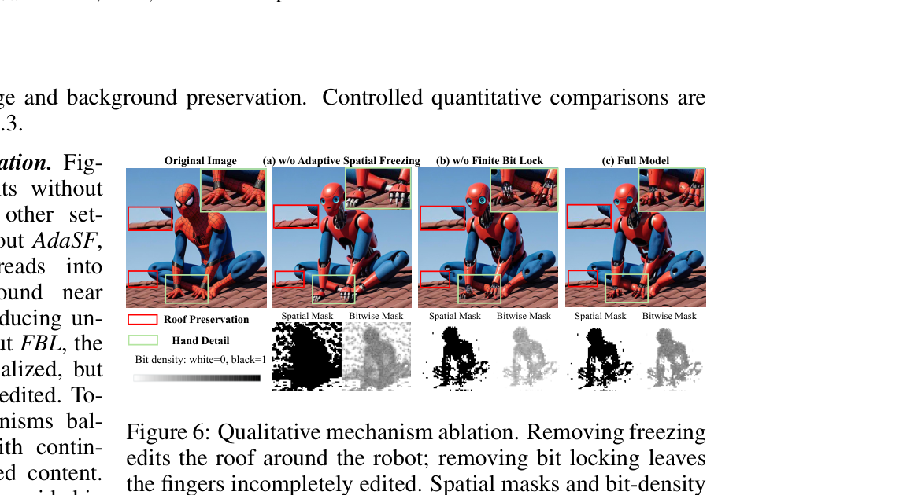

# AI Daily

## RefineEdit：讓 Generative Refinement Network 在生成過程中自己找出可編輯區域

> **一句話結論：** RefineEdit 把 GRN 的全局 binary refinement trajectory 直接變成 training-free prompt-to-prompt editor：從中途的 source state 分支出 editing branch，比較兩個 prompt 對相同 source-sampled bit 的機率差，透過 source-anchored bit routing 決定哪些位置與哪些 bit 可以改，再用 adaptive spatial freezing 和 finite bit locking 穩定 mask。它在 PIE-Bench 的九類編輯中，同時取得最佳的背景保留指標與 CLIP alignment，但目前只能編輯「由 GRN 內部從 source prompt 生成的影像」，不是任意真實照片的通用 editor。[1] [2] [3]

## 論文基本資訊

| 欄位 | 內容 |
|---|---|
| 論文 | **Refinement Is Inherently Editable: Training-Free Prompt-to-Prompt Image Editing with Generative Refinement Network** |
| 方法名稱 | **RefineEdit** |
| 作者 | Yulong Chen、Ziqian Zhang、Haoyu Zhang、Ao He、Yaxing Wang、Senmao Li、Kai Wang |
| 研究單位 | City University of Hong Kong（Dongguan / Hong Kong）、Mohamed bin Zayed University of Artificial Intelligence、Jilin University |
| 發表狀態 | arXiv:2609.20633v3，2026-09-24；目前查到的是 arXiv preprint，未標示已錄取的頂會名稱。[1] |
| 研究主題 | Training-free image editing、prompt-to-prompt、Generative Refinement Network、binary code routing、mask-free editing |
| Backbone | 預訓練 GRN-2B text-to-image model、HBQ tokenizer、UMT5-XXL text encoder；所有網路權重固定。[2] |
| 評估 | PIE-Bench 九類編輯、EditEval v2；1024×1024 生成，與基線對齊至 512×512 評估。[2] |
| 官方程式碼 | [mura1n/RefineEdit][3] |
| 本庫去重 | 已用標題、方法名與 arXiv ID `2609.20633` 搜尋 `AI_Daily` 現有文章與索引，未發現重複，因此本篇新增。 |

### 為什麼選這篇

這篇工作很適合目前想追的 **training-free、VAR-like generation、attention/modulation 與 zero-shot editing** 方向。它不是在 diffusion latent 上另外訓練一個 segmentation module，而是利用 GRN 逐步由 random binary code 生成影像時，自然存在的兩條 refinement trajectory：一條使用 source prompt，一條使用 editing prompt。作者的核心命題是：如果影像結構還在逐步形成，編輯定位與內容生成就不必先後分離；生成過程本身可以持續提供「哪裡需要改」的證據。[1] [2]

需要先精確界定 **training-free** 的意思：RefineEdit 不需要 edit-specific training、額外 adapter、外部 editing mask 或 attention control；但它仍然依賴預訓練 GRN-2B、HBQ、UMT5-XXL 與 GPU 推理。官方 repository 也明確說明，它不是直接編輯任意 real image，而是先由 source prompt 在 GRN 內部產生 source trajectory。[3]

## 研究背景：從 diffusion inversion 到 global binary refinement

多數 training-free image editing 方法是在固定的 diffusion / flow backbone 上做 inversion、attention control、feature injection 或局部 blending。這些方法常遇到一個兩難：mask 太窄時改不完整，mask 太寬時又會破壞背景；若先把圖片反演到 noise，再修改 prompt，還可能需要額外的 inversion cost。

RefineEdit 選擇的基礎模型是 Generative Refinement Network（GRN）。GRN 使用 Hierarchical Binary Quantization（HBQ）把影像表示成 binary latent，並從一個隨機 binary code 開始，以多次 global refinement 逐步把結構「畫」出來。GRN 論文主張 HBQ 接近無損、binary refinement 能以 complexity-aware 的方式逐步修正圖像；其 ImageNet 結果報告 reconstruction rFID 0.56、class-conditional generation gFID 1.81。[4]

在 RefineEdit 的設定中，GRN-2B 產生 1024×1024 影像；HBQ code 有 $64\times64$ 個 spatial positions，每個位置含 256 個 binary bits，來自 64 個 latent channels 與 4 個 quantization rounds。兩個 branch 共用初始 random binary code，總 refinement steps 為 50，最後才 decode 為影像。[2]

*圖 1．上方是 source trajectory，中間是 source 與 editing probabilities 的差異，下方是 selected bits 走 editing refinement、未選 bit 複製 evolving source state。來源：[2]*

## 核心貢獻

### 1. 將 refinement trajectory 視為 editable，而非只把它當成生成器

GRN 每個 refinement step 都會重新預測所有 binary coordinates；座標不是一次決定後永久固定。這種「全局、可重訪、逐步形成」的生成方式，與 causal AR editor 的固定 token order 不同，也讓編輯證據可以隨著當前 image state 更新。RefineEdit 的論文主張：**refinement is inherently editable**，即內容生成與 edit localization 可以在同一條 trajectory 中共同演化。[1] [2]

### 2. 用 aligned signed probability difference 找 editing evidence

在 switch step，editing branch 從 source branch 的中間狀態開始；兩條 branch 使用各自 prompt、相同 random code 與相同 refinement schedule。對 source branch 當下 sample 出的 bit，直接比較 source prompt 與 editing prompt 下的 probability，而不是只比較兩張最終圖片的像素或 feature 差。

### 3. Source-anchored bit routing

被判定為可編輯的 bit 接受 editing proposal；其餘 bit 不會固定在原始 source，而是複製同一步的 evolving source state。因此背景可以繼續跟著 source refinement 成熟，前景則在允許的 coordinates 上接受 target prompt 的更新。

### 4. AdaSF 與 FBL 解決 mask 膨脹和 edit 中斷

- **Adaptive Spatial Freezing（AdaSF）：** 如果 switch step 的初始 editing response 足夠強，將 spatial mask 凍結，避免後續語義擴散到屋頂或背景。
- **Finite Bit Locking（FBL）：** bit 只要在最近 $K$ 個 steps 曾被選中，就暫時保留 editing permission，避免 probability 短暫波動導致手指、物件邊界等區域半途停止 refinement。

這兩個模組不是外部 segmentation 或 attention controller，而是直接操作 GRN 的 binary code routing。[2]

## 方法詳解

### 1. GRN 的 binary refinement

令 $Y_t\in\{0,1\}^{N\times D}$ 為第 $t$ 個 refinement state，$N$ 是 spatial positions、$D$ 是每個位置的 bit 維度；$Z$ 是初始化後固定重用的 random binary code，$c$ 是 prompt。凍結的 GRN Transformer $G_\theta$ 同時對所有 coordinates 輸出兩類 logits：

$$
P_t=\operatorname{softmax}\left(G_\theta(Y_t,c,t)\right),
\qquad
\widehat{Y}_t\sim\operatorname{Cat}(P_t).
\tag{1}
$$

每個 binary coordinate 都從 $\{0,1\}$ 的 categorical distribution 取樣。GRN 不會永久鎖定所有已預測的 bit，而是使用 selection mask $S_t$ 混合新預測與固定 random code：

$$
Y_{t+1}=S_t\odot\widehat{Y}_t+(1-S_t)\odot Z,
$$

其中

$$
S_{t,n,d}\sim\operatorname{Bernoulli}(\lambda_{t+1}).
\tag{2}
$$

$\lambda_{t+1}$ 會隨 refinement 進度增加，讓影像從 random bits 逐步走向完整結構。RefineEdit 的 fixed setting 使用 cosine prediction-retention schedule，最大 retention ratio 0.95，50 steps、CFG 3.0、temperature 1.1；source / editing random seeds 預設為 42 / 43。[2] [3]

### 2. Source branch 與 editing branch

先在 source prompt $c^s$ 下跑到 switch step $t_s$，得到 source state $Y^s_{t_s}$。editing branch 不從新的 random code 開始，而是直接繼承：

$$
Y^e_{t_s}=Y^s_{t_s}.
\tag{3}
$$

從 $t_s$ 開始，兩個 branch 各自以 $c^s$ 與 $c^e$ 繼續 GRN refinement。這個 initialization 讓低頻結構、布局與已出現的 source content 先被保留，再讓 target prompt 逐步作用在可編輯的 coordinates 上。

### 3. Signed probability difference

令 $\widehat y^s_{t,n,d}$ 是 source branch 在 coordinate $(n,d)$ 採樣得到的 bit。source 與 editing branch 對同一個 source-sampled bit 的 signed difference 定義為：

$$
\Delta_{t,n,d}
=
P^s_t\left(n,d,\widehat y^s_{t,n,d}\right)
-
P^e_t\left(n,d,\widehat y^s_{t,n,d}\right).
\tag{4}
$$

若 $\Delta_{t,n,d}>0$，表示 editing prompt 對這個 source bit 的支持較弱；因此該 coordinate 有理由允許離開 source state。這是一個相對便宜的 edit evidence：它不需要訓練 mask predictor，也不需要拿 final images 做 image difference。

### 4. Spatial mask 與 bitwise mask

先在每個 spatial position 對 $D$ 個 bits 平均：

$$
q_{t,n}=\frac{1}{D}\sum_{d=1}^{D}\Delta_{t,n,d}.
\tag{5}
$$

用兩個 threshold 將「是否改這個位置」與「位置內哪些 bit 可改」拆開：

$$
 a_{t,n}=\mathbf 1[q_{t,n}>\tau_{\mathrm{spa}}],
$$

$$
 m_{t,n,d}
=a_{t,n}\,\mathbf 1[\Delta_{t,n,d}>\tau_{\mathrm{pow}}].
\tag{6}
$$

$a_t$ 是 spatial mask；$m_t$ 是 bitwise editing permission。$\tau_{\mathrm{spa}}$ 越高，選中的空間越少；$\tau_{\mathrm{pow}}$ 越高，已選位置內真正可變的 bits 越少。

### 5. Source-anchored bit routing

標準 GRN 會分別產生 source next state $Y^s_{t+1}$ 與 editing proposal $\widetilde Y^e_{t+1}$。RefineEdit 不讓整個 editing proposal 無條件覆蓋，而是：

$$
Y^e_{t+1}
=m_t\odot\widetilde Y^e_{t+1}
+(1-m_t)\odot Y^s_{t+1}.
\tag{7}
$$

這個式子是整個方法的核心：

- $m_{t,n,d}=1$：該 bit 接受 editing branch 的新結果。
- $m_{t,n,d}=0$：該 bit 複製同一步 source branch 的 evolving state。
- 被複製的不是固定 source image bit，而是 $Y^s_{t+1}$，所以背景仍可隨 source trajectory 繼續 refinement。

在最後一步，方法 route source / editing sampled predictions 後才 decode HBQ code，不把仍含 random labels 的 intermediate state 直接解碼。[2]

*圖 2．方法總覽。RefineEdit 不使用外部 mask，而是從兩個 aligned GRN branches 的 bit probabilities 建立 routing mask。來源：[2]*

### 6. Adaptive Spatial Freezing（AdaSF）

如果每個 step 都重新更新 $a_t$，editing prompt 的影響可能擴展到無關背景。AdaSF 只在 switch step 評估一次初始 response。令

$$
\Omega=\{n\mid a_{t_s,n}=1\},
$$

$$
 r=
\frac{\sum_{n\in\Omega}(q_{t_s,n}-\tau_{\mathrm{spa}})}
{\max(1,|\Omega|)}.
\tag{8}
$$

當 $r\ge\tau_{\mathrm{frz}}$ 時，對所有 $t\ge t_s$ 固定 spatial mask：

$$
 a_t=a_{t_s},
$$

否則繼續依照式（6）動態更新。論文預設 $\tau_{\mathrm{frz}}=2\tau_{\mathrm{spa}}$。[2]

注意 AdaSF 只凍結 spatial selection，不會凍結所有 bit 的值；bitwise selection 仍可以隨 probability 改變。這個區分使它能限制 mask expansion，又不會把 refinement 變成硬性的 inpainting mask。

### 7. Finite Bit Locking（FBL）

即使 spatial mask 穩定，某個 bit 也可能因為一個 step 的 probability fluctuation 暫時低於 $\tau_{\mathrm{pow}}$，造成正在生成的物件被截斷。FBL 保留最近 $K$ 個 steps 中曾經通過 bitwise test 的 permission：

$$
 m_{t,n,d}
=
\max_{\max(t_s,t-K+1)\le j\le t}
\left\{
 a_{j,n}\mathbf 1[\Delta_{j,n,d}>\tau_{\mathrm{pow}}]
\right\}.
\tag{9}
$$

其中 max 是 logical OR；$K=1$ 就退化成沒有 temporal carry-over 的 instantaneous mask。官方程式碼預設 `bit-lock-steps=4`。[3]

FBL 鎖定的是「editing permission」，不是 binary value：被保留的 bit 仍然會接受後續 GRN prediction 與 random refinement；只有連續 $K$ 個 steps 都不再通過條件，才會失去 editing permission。

## 實驗設計

### PIE-Bench

論文在 PIE-Bench 的九類 prompt-to-prompt editing 上評估：object replacement、object addition、object removal、content modification、pose modification、color modification、material modification、background modification、style transfer。每個 source prompt 先由 GRN 生成 source image，再讓所有方法以對應 editing prompt 編輯同一張 source image，維持共同起點。[2]

因為 GRN 與部分 diffusion / flow baseline 的輸出解析度不同，基線在此設定會產生 512×512 圖像；GRN source 與 RefineEdit output 也 resize 到 512×512 後再比較。Grounded-SAM 取得 foreground/reference masks，區域評估使用共同的 reference mask，與 RefineEdit 自己動態產生的 mask 分開。[2]

主要指標：

- **Structure Distance**：source 與 edited image 的深層結構差異，越低越好。
- **PSNR**：未編輯區域的像素保留，
  $$\operatorname{PSNR}=10\log_{10}\frac{MAX^2}{\operatorname{MSE}};$$
  越高越好。
- **LPIPS**：未編輯區域的 perceptual distance，越低越好。
- **MSE**：未編輯區域的平均平方誤差，越低越好。
- **SSIM**：結構相似度，越高越好。
- **CLIP Whole / Edited**：整張圖片與 designated editing region 對 editing prompt 的 semantic alignment，越高越好。[2]

## 實驗結果

### PIE-Bench 九類平均結果

| 方法 | Backbone | Structure Distance ↓ | PSNR ↑ | LPIPS ↓ | MSE ↓ | SSIM ↑ | CLIP Whole ↑ | CLIP Edited ↑ |
|---|---|---:|---:|---:|---:|---:|---:|---:|
| FlowEdit | FLUX.1-dev | **0.0162** | 25.03 | 0.062 | 0.0046 | 0.902 | 24.85 | 21.95 |
| PnP-DirectInv | SD 1.5 | 0.0229 | 23.37 | 0.081 | 0.0064 | 0.852 | 25.57 | 22.77 |
| LEDits++ | SD 1.5 | 0.0414 | 20.59 | 0.100 | 0.0120 | 0.820 | 26.22 | 23.29 |
| **RefineEdit** | **GRN** | 0.0266 | **30.36** | **0.032** | **0.0045** | **0.950** | **26.59** | **23.44** |

RefineEdit 在四個 background-preservation 指標（PSNR、LPIPS、MSE、SSIM）與兩個 CLIP 指標都取得最佳值；相對 FlowEdit，PSNR 提高 **5.33 dB**，edited-region CLIP 也比 LEDits++ 高 **0.15**。不過 Structure Distance 仍由 FlowEdit 的 0.0162 最佳，因此更精確的結論是：RefineEdit 在「保留未編輯內容 + 讓目標 edit 成功」的多指標平衡上最強，而不是在所有結構距離指標都第一。[2]

*圖 3．RefineEdit 以 robot 取代 spiderman、加入 goat、移除 sunglasses、修改 gaze 與改變 butterfly 顏色時，保留 source layout 的視覺對照。來源：[2]*

### Runtime

在單張 NVIDIA A100、1024×1024 editing、重複 10 次且排除 I/O 的測試中：

| 方法 | Paradigm | Resolution | 平均時間 |
|---|---|---:|---:|
| PnP | Diffusion | 1K | 79.70 s |
| PnP-DirectInv | Diffusion | 1K | 79.65 s |
| RF-Inversion | Flow | 1K | 32.05 s |
| FlowEdit | Flow | 1K | 27.15 s |
| **RefineEdit** | **GRN** | **1K** | **26.77 s** |

RefineEdit 約比 PnP / PnP-DirectInv 快 3 倍，與 FlowEdit 接近。這個速度比較需保留條件：不同 baseline 的 backbone、取樣流程與實作不同；它不是在完全相同 network architecture 下的純演算法 overhead 比較。[2]

### AdaSF / FBL 機制消融

在 object-replacement subset 上，完整模型與移除單一機制的數字如下：

| 變體 | Structure Distance ↓ | PSNR ↑ | LPIPS ↓ | SSIM ↑ | CLIP Whole ↑ | CLIP Edited ↑ |
|---|---:|---:|---:|---:|---:|---:|
| Full model | 0.028 | 30.04 | 0.044 | 0.932 | 26.48 | 23.17 |
| w/o Finite Bit Locking | 0.028 | **31.04** | **0.041** | **0.938** | 26.34 | 23.01 |
| w/o Adaptive Spatial Freezing | 0.033 | 28.76 | 0.050 | 0.920 | **26.59** | **23.44** |

這個結果揭示兩個模組在不同目標上的 trade-off：

- 移除 **FBL** 後背景保留變好，但兩個 CLIP 分數下降，表示沒有 temporal permission carry-over 時，語義編輯比較容易不完整。
- 移除 **AdaSF** 後 CLIP 變好，但 background preservation 與 structure consistency 變差，表示 mask 更容易擴張到無關區域。
- 完整模型不是每個單一指標都極值，而是在「改得到」和「不要亂改」之間取得平衡。[2]

*圖 4．左至右為原圖、w/o AdaSF、w/o FBL 與完整模型，並附 spatial mask 與 bit-density mask。來源：[2]*

### Switch step 與 threshold 的影響

論文的 controlled comparison 顯示 $t_s$、$\tau_{\mathrm{spa}}$、$\tau_{\mathrm{pow}}$ 不是單純越大越好：

- 太早 switch：target semantics 尚未有清楚 source layout 可依附，容易污染背景。
- 太晚 switch：source structure 更成熟、較難改，而且剩餘 refinement steps 變少，造成 target transformation 不完整。
- 增加 $\tau_{\mathrm{spa}}$：選中的空間減少，background preservation 變好，但 edit coverage 可能不足。
- 增加 $\tau_{\mathrm{pow}}$：每個位置可改的 bits 變少，保留 source 變好，但 CLIP alignment 下降。

在論文的代表性設定中，$t_s=18$ 是 edit strength 與 preservation 的折衷；官方 code 也以 switch step 18、$\tau_{\mathrm{spa}}=0.018$、$\tau_{\mathrm{pow}}=0.16$、FBL 4 steps、AdaSF multiplier 2.0 作為可執行的起始設定，但 README 同時提醒不同 edit category 需要明確調參，這不是對所有 prompt 的 universal optimum。[2] [3]

### EditEval v2 跨資料集檢驗

論文另外使用 EditEval v2 的 150 組 source/editing prompt pairs、七類編輯，直接套用 PIE-Bench 的 category-specific settings，不重新調參。RefineEdit 取得最佳的 PSNR、LPIPS、SSIM，並得到第二高的 whole-image 與 edited-region CLIP；LEDits++ 的 CLIP 較高，但背景保留的四項指標顯著較差。[2]

這個結果支持超參數設定具有一定 transferability，但要注意 EditEval v2 也採用「GRN 生成 source image，再由各方法編輯」的 generation-to-editing protocol，並非真實照片 benchmark 的直接結果。[2]

## 與相關研究的關係

### 與 GRN：從生成器變成編輯器

GRN 建立的是一種 global refinement generator：所有 binary coordinates 都會被反覆預測，從 random code 逐步形成圖像；RefineEdit 不改 GRN weights、tokenizer 或 refinement schedule，而是在中途複製 source state，加入一條 prompt-conditioned branch，再以 bit routing 控制兩條 trajectory 的合併。[4]

因此 RefineEdit 的重要性不只是「把 GRN 拿來做 editing」，而是指出 GRN 的生成機制本身提供了三個 editor 所需條件：

1. **Intermediate source state**：可以在 structure 已形成但仍可修改的中間點分支。
2. **Global revisiting**：座標會在後續 steps 被重新預測，不受固定 raster order 綁死。
3. **Per-bit probabilities**：可以在比特層級比較 prompt evidence，而不是只能用像素 mask。

### 與 AREdit：相同的 probability-difference 直覺，不同的 generator geometry

較早的 AREdit 也針對 Infinity / VAR-like model 做 training-free image editing：先 cache image 的 bit labels、probability distributions 與部分 attention maps，再於 target prompt 下比較 cached probability 與新 probability，使用 probability difference 建立 fine-grained mask。[5]

RefineEdit 與 AREdit 的共同點是：都把 **prompt-induced probability change** 當成 edit evidence，也都避免額外訓練。然而兩者的 generation geometry 不同：

- AREdit 從已有 image 的 encoded / cached token trajectory 出發，具有 cache randomness 與 optional attention control；它更接近對既有 AR image 的後續編輯。
- RefineEdit 從 GRN 的中途 random-to-image refinement state 出發，兩個 branch 每一步同步演化，並以 source-anchored routing、AdaSF、FBL 處理 editing region 與 binary code 的時間穩定性。

因此，RefineEdit 應被描述為 **GRN-specific 的 training-free global refinement editor**，而不是宣稱 probability-difference mask 是第一次出現。

### 與 diffusion / flow editors：quality trade-off 而不是全面取代

PIE-Bench 的比較包含 Prompt-to-Prompt、MasaCtrl、Pix2Pix-Zero、PnP、PnP-DirectInv、LEDits++、ChordEdit、FlowEdit 與 RF-Inversion。[2] RefineEdit 的結果優勢集中在背景保留與 CLIP alignment；FlowEdit 仍然有更低的 Structure Distance，說明不同 generative paradigm 的強項不同。

RefineEdit 的研究價值在於提供一個不需 inversion / external mask 的另一條路線，但目前不能據此推論 GRN 會全面勝過 diffusion 或 flow editors。尤其這個比較的 source image 是 GRN 生成的，與真實照片編輯的分佈不同。

## 對 Energy-based Transformer、JEPA、attention modulation、zero-shot 的啟發

### 這篇論文不是什麼

- **不是 Energy-Based Transformer：** $\Delta$ 是兩個 categorical probability 對同一 bit 的 signed difference，不是已正規化的 global energy，也沒有 partition function 或 MCMC / Langevin sampling。
- **不是 JEPA：** 它沒有 predictor-target embedding loss；它直接使用 frozen GRN 的 binary probabilities 與 evolving states。
- **不是完全 zero-shot：** 它不需要 editing training，但必須使用 GRN-2B、HBQ、UMT5-XXL 的預訓練權重與 prompt-generated source trajectory。
- **不是任意 real-image editing：** 官方 code 明確限制 source image 由 source prompt 在 GRN 內部生成；這是目前最重要的產品邊界。[3]

### 可以延伸的研究方向

**1. 將 probability difference 轉成 energy routing。** RefineEdit 的

$$
\Delta_{t,n,d}=P^s_t(\widehat y)-P^e_t(\widehat y)
$$

可以改寫為 log-probability margin：

$$
E_{t,n,d}
=-\log P^e_t(n,d,\widehat y^s_{t,n,d})
+\log P^s_t(n,d,\widehat y^s_{t,n,d}).
$$

這個 $E$ 可作為 energy-like edit pressure，但不能直接叫作 global energy。下一步可以加入 spatial smoothness、object boundary consistency 或 background energy：

$$
E_{\mathrm{total}}
=\sum_{n,d}E_{t,n,d}m_{t,n,d}
+\lambda E_{\mathrm{boundary}}(m_t)
+\mu E_{\mathrm{background}}(1-m_t).
$$

研究問題是：energy regularization 能否在不訓練 mask network 的情況下，降低 AdaSF 的 hard-freeze 依賴？

**2. 用 JEPA-style predictive uncertainty 決定 switch step。** 目前 $t_s$ 是超參數；太早會污染背景，太晚會讓內容難改。可以建立一個 frozen 或輕量 predictive head，估計當前 state 對下一步 hidden / binary structure 的 prediction error：

$$
U_t=\left\|
\operatorname{sg}(h_{t+1})-\widehat h_{t+1}
\right\|_2^2.
$$

當 source structure 的不確定性下降、target/source probability margin 同時上升時，動態決定 switch。這會把「何時分支」從手工 step 18 變成 state-aware scheduling。

**3. 以 attention disagreement 取代單一 spatial mean。** 目前 spatial score 是對 $D$ bits 做平均：

$$
q_{t,n}=D^{-1}\sum_d\Delta_{t,n,d}.
$$

如果再加入 GRN 不同 attention heads / layers 對 coordinate $n$ 的 disagreement，可能更容易區分「prompt 改變真正指向的物件」與「只是 global style 變化」。但這會背離論文刻意不使用 external attention control 的簡潔性，也可能增加記憶體與實作成本。

**4. 從 binary mask 到 adaptive compute。** RefineEdit 已經用 $m_t$ 決定哪些 bits 可以改；下一步可讓 mask 也決定哪些 positions 需要更多 refinement iterations，形成 position-wise adaptive compute：

$$
T_{n}=T_{\min}+
\alpha\,\operatorname{clip}
\left(
\sum_t |\Delta_{t,n}|,
0,1
\right).
$$

這會把 editing permission、uncertainty 與 inference budget 統一。與單純輸出一個 mask 相比，更接近 training-free 的 adaptive visual computation。

**5. 真正的 arbitrary-image editing。** 目前最大的缺口不是再加一個 threshold，而是把任意輸入圖片 $I$ 映射到可與 GRN refinement 對齊的 $Y_0\ldots Y_T$ trajectory。可研究：HBQ inversion、partial code initialization、source image reconstruction error 與 trajectory confidence；若 inversion 產生的 binary code 不在 GRN 的自然 refinement manifold 上，RefineEdit 的 probability difference 可能失去可靠意義。

## 限制與證據界線

1. **無法直接編輯任意真實影像。** 官方 repository 明確表示 source trajectory 是內部由 source prompt 生成，並非 arbitrary real-image editor。[3]

2. **需要重型推理環境。** README 以 A100 80GB 作為適合的參考配置，依賴 BF16、GRN weights、HBQ checkpoint、UMT5 encoder；低記憶體 GPU 與 CPU inference 不在支援範圍內。[3]

3. **PIE-Bench 的 source image 不是原始自然照片。** 論文先用 GRN 由 source prompt 生成 source，再讓所有方法編輯它；這確保 common source reference，但也使結果不能直接等同真實照片編輯能力。[2]

4. **背景與編輯區域的評估依賴 reference mask。** Grounded-SAM masks 是共同評估工具，與 RefineEdit 動態 mask 分開；因此表格中的 background metrics 是在指定未編輯區域計算，並非完全無 mask 的實際 user perception。[2]

5. **方法有多個 category-specific thresholds。** $t_s$、$\tau_{\mathrm{spa}}$、$\tau_{\mathrm{pow}}$ 影響 edit strength、背景保留與 CLIP alignment；雖然 EditEval v2 不重新調參仍有不錯結果，但不能宣稱單一 default 對所有 prompt 都最佳。[2] [3]

6. **比較不是全然公平的同模型 ablation。** Diffusion、flow 與 GRN backbone、解析度、sampling schedule 都不同；26.77 秒的 runtime 是工程上的有意義指標，但不是只歸因於 RefineEdit routing 的純計算量。[2]

7. **FBL / AdaSF 仍是硬 threshold heuristic。** 它們可以解決 mask expansion 與 editing interruption，但 threshold 可能需要依 prompt 類別調整；是否能被 calibration、energy model 或 uncertainty controller 取代，是後續研究問題。

## 個人評價與研究意義

我的評分是 **8.5/10**。

我認為 RefineEdit 最有價值的地方不是「GRN 也可以做 image editing」，而是它把 edit localization 從一個外部模組，移到生成器內部的 **probability evolution**。這提供了一個很乾淨的因果直覺：當 target prompt 開始降低某個 source bit 的支持時，這個 bit 可能是可改的位置；當這個 evidence 短暫消失時，FBL 又避免內容剛開始形成就被中斷。

它的工程形式也相對簡潔：兩條 frozen branches、一次 signed difference、兩個 threshold、source-anchored routing，沒有 edit training、沒有外部 mask、沒有必須保存整套 attention maps。PIE-Bench 表格裡，它以 30.36 PSNR、0.032 LPIPS、0.0045 MSE、0.950 SSIM、26.59 whole CLIP、23.44 edited CLIP，展示了「少改背景」與「仍然完成 edit」可以同時達成。[2]

但我不會把它描述成已解決的 zero-shot image editing。第一，它不接受任意 real image；第二，它依賴 GRN-2B 的 domain與生成 trajectory；第三，與 diffusion / flow 的結果是在 GRN-generated source 上比較。最準確的定位是：**一篇把 global binary refinement 轉成 training-free prompt-to-prompt editor，並用 source-anchored bit routing 建立可解釋 editing permission 的方法論工作。**

## 結論

RefineEdit 將 GRN 的生成過程拆成兩條共享起點的 trajectories：source branch 保留原有內容，editing branch 追隨新 prompt。透過同一 source-sampled bit 在兩個 branch 下的 signed probability difference，方法同時建立 spatial mask 與 bitwise mask；未選 bit 複製 evolving source state，選中 bit 才採用 editing proposal。AdaSF 抑制 spatial mask 擴張，FBL 維持最近 steps 的 editing permission。

在 PIE-Bench 九類編輯上，RefineEdit 的強項是背景保留與 prompt alignment：PSNR 30.36、LPIPS 0.032、MSE 0.0045、SSIM 0.950、whole-image CLIP 26.59、edited-region CLIP 23.44；但 Structure Distance 仍以 FlowEdit 的 0.0162 最佳。A100 上 1024×1024 平均 26.77 秒，約是 PnP 類方法的三分之一。[2]

對你關注的研究方向，最值得帶走的抽象是：**不要把 editing mask 當成一次性 segmentation；把它看成由 model probability、uncertainty 與 refinement state 持續更新的 routing policy。** 這條思路可以自然延伸到 energy-based routing、JEPA-style switch scheduling、attention disagreement、training-free adaptive compute，以及最後真正支援 arbitrary real-image 的 trajectory inversion。

## References

[1]: https://arxiv.org/abs/2609.20633 "Refinement Is Inherently Editable: Training-Free Prompt-to-Prompt Image Editing with Generative Refinement Network — arXiv metadata and abstract"

[2]: https://arxiv.org/html/2609.20633 "Refinement Is Inherently Editable — full HTML paper with equations, tables, ablations, and appendix"

[3]: https://github.com/mura1n/RefineEdit "mura1n/RefineEdit — official implementation and inference limitations"

[4]: https://arxiv.org/abs/2604.13030 "Generative Refinement Networks — GRN background paper"

[5]: https://arxiv.org/html/2503.23897v1 "AREdit — training-free VAR/Infinity image editing with cached randomness and probability-difference masks"

---

本文作者：**Manus AI**
日期：**2026-09-27**
