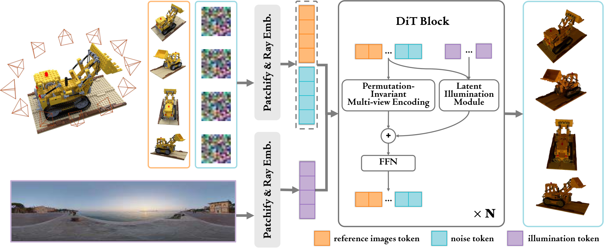
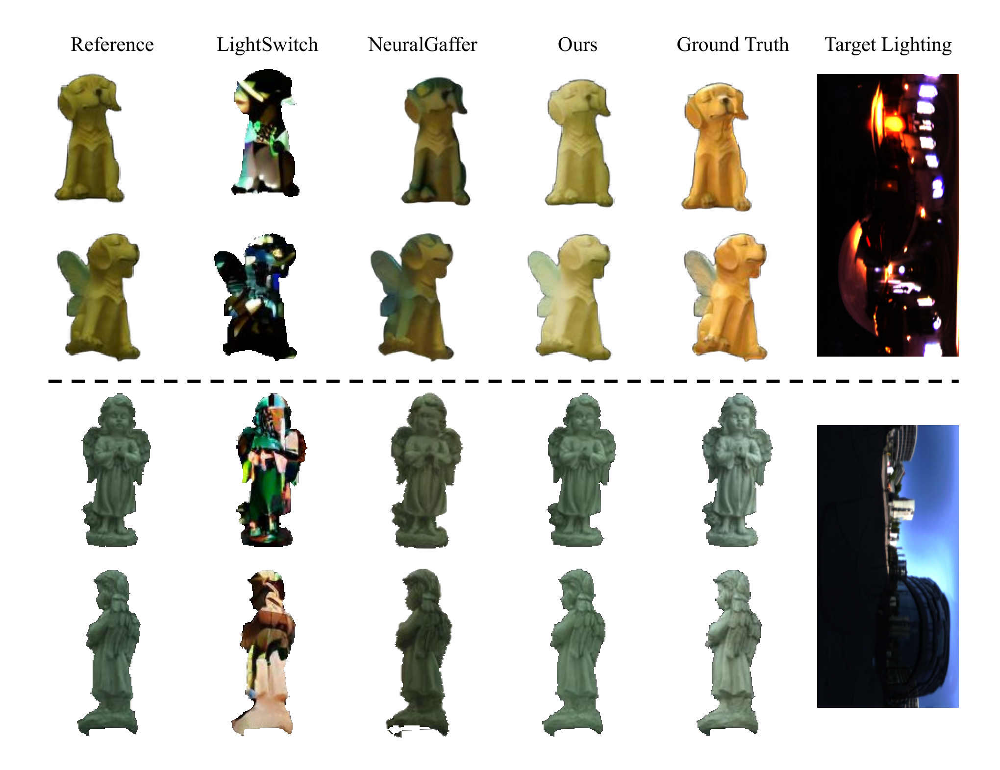
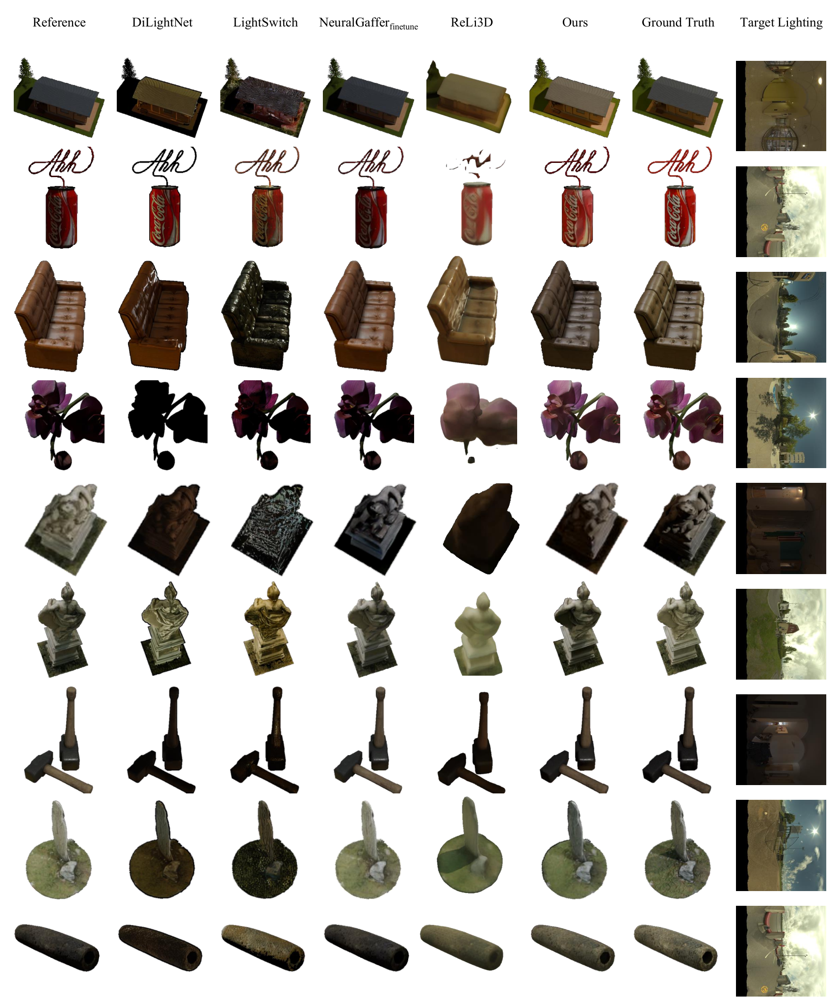
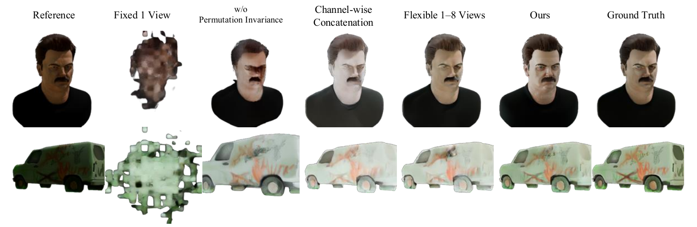

# AI Daily

## RelightFormer：以生成式 Transformer 直接完成多視角物件重新打光

**日期：2026-09-09**
**今日精選：RelightFormer: Feed-forward Generative Transformer for Multiview Object Relighting**
**作者：Hejun Wang、Jinxi Li、Junwei Jiang、Shiwei Mao、Hu Cheng、Shouwang Huang、Bo Yang；Shenzhen Research Institute、The Hong Kong Polytechnic University** [1] [2]
**來源：arXiv:2609.07414v1，2026-09-07 提交；SIGGRAPH Asia 2026 Conference Papers，2026-12-01 至 2026-12-04，DOI 10.1145/3829340.3842292。研究團隊官網於 2026-07-20 宣布已獲接收。** [2] [3]

> **一句話結論：** RelightFormer 把多視角影像、相機幾何與 HDR 環境光送入一個以 Wan2.1 為基礎的 flow-matching Diffusion Transformer，透過幾何感知 self-attention、照明 cross-attention 與相機配置決定的 permutation-invariant positional encoding，直接生成一致的重新打光結果，而不需要顯式估計 geometry、BRDF 或 intrinsic image。

## 1. 為什麼今天選這篇

本次先以 2026-09-04 至 2026-09-09 的 arXiv 新提交論文為主，再交叉檢查 Hugging Face Daily Papers、官方研究頁、論文 HTML 與使用者提供的 `KaiCobra/AI_Daily` 儲存庫。候選論文逐一以 arXiv ID、標題和既有 Markdown 索引比對，排除已收錄的工作。最後在 VoT、CineCrew、MovieGrid、Flow3D-OPD、RelightFormer 與 UniMate 六篇候選中選出 RelightFormer。

RelightFormer 最值得今日研讀的原因，不是它單純把某個 relighting benchmark 提高幾個點，而是它把使用者關注的幾個方向接到同一個模型內：**生成式 Transformer、attention modulation、幾何條件化、flow matching 與 zero-shot/OOD 評估**。它也把「環境光如何影響每個 image token」寫成一個可分析的 cross-attention 介面，因此很適合延伸到 energy-based controller、JEPA predictive critic、VAR 式多尺度條件化與 training-free inference。

需要先畫清楚範圍：RelightFormer **不是** Energy-Based Transformer，也**不是** JEPA 或 VAR。它是一個在 Wan2.1 latent video foundation model 上 fine-tune 的生成式 Transformer。論文的主要價值在於把幾何和光照條件化做成結構化 attention，而不是提出新的能量模型、聯合嵌入學習或視覺自回歸目標。

## 2. 論文基本資訊

| 項目 | 內容 |
|---|---|
| 論文標題 | RelightFormer: Feed-forward Generative Transformer for Multiview Object Relighting |
| 作者與機構 | Hejun Wang、Jinxi Li、Junwei Jiang、Shiwei Mao、Hu Cheng、Shouwang Huang、Bo Yang；Shenzhen Research Institute、The Hong Kong Polytechnic University [1] |
| 發表狀態 | arXiv v1 於 2026-09-07 提交；arXiv HTML 標示 SIGGRAPH Asia 2026 Conference Papers；研究團隊官網宣稱 2026-07-20 已接收 [2] [3] |
| 基礎生成模型 | Wan2.1 的 VAE 與 Diffusion Transformer；模型採 rectified flow matching [2] [10] |
| 任務 | 單視角、16-to-16 多視角、32-to-32 密集多視角、TensoIR OOD、OLATverse 真實物件與 Stanford-ORB novel-view relighting |
| 資料集 | Laval Objaverse Dataset（LOD）：90,545 個物件、39,008 個獨特環境光條件 [2] [4] |
| 訓練設定 | 256×256、80K steps、4 張 NVIDIA H200、global batch size 128、初始 learning rate $10^{-4}$、cosine decay [2] |
| 主要輸出 | 重新打光後的影像；輸入視角數在訓練時隨機取 1–16，測試時可處理任意數量的視角 |
| 開源狀態 | arXiv 表示 code/data available；GitHub 目前明確寫著 **Code is coming soon**，LOD 渲染資料可下載，但原始 Laval HDR map 受 EULA 限制 [1] [4] |

## 3. 背景：為什麼重新打光需要幾何與照明的共同建模

重新打光的目標是改變物件的光照外觀，同時保持其 geometry、material、identity 與視角一致性。傳統 inverse rendering 會從影像反推幾何、反射率與環境光，再以物理 renderer 在新光照下合成影像。這條路徑具有物理可解釋性，但 inverse problem 本身不適定，而且通常需要逐場景 optimization。RelightFormer 選擇另一條路徑：直接學習由影像和目標環境光到重新打光結果的生成映射，不顯式拆解 intrinsic properties。[2]

先前的 Neural Gaffer 將這個問題表述為單張影像的 diffusion relighting，使用約 90K Objaverse 物件、約 30K 環境光條件與約 1,840 萬張 512×512 合成影像，顯示大型生成先驗可以在不估計 BRDF 的情況下完成泛化。[5] LightSwitch 進一步處理任意數量的多視角影像，並加入 material guidance，但其基礎設計仍把多視角與照明資訊以較直接的方式注入 diffusion 模型。[6]

RelightFormer 的核心判斷是：多視角影像不是有時間順序的 video frames，而是 unordered set。若直接沿用 video model 的 frame-indexed positional encoding，模型可能把「輸入順序」誤當成「物理順序」。同時，環境 map 的每個 token 表示的是從球面方向來的 incident lighting，而 image token 表示的是某個相機像素位置的 surface appearance。這兩種 token 不應只做 channel-wise concatenation，而應讓每個影像位置以 query 主動選取相關的入射光方向。

## 4. 核心貢獻與創新點

### 4.1 用 latent illumination cross-attention 取代直接拼接

模型把環境光先轉為 latent illumination tokens，再以 cross-attention 將其注入 reference image tokens 與 noisy target tokens。這與單純將 illumination feature 沿 channel 維度拼接不同。後者隱含假設環境 map 的像素座標能直接對齊影像 patch；但環境 map 是球面方向域，影像 patch 是相機投影域，兩者沒有天然的一對一像素對齊。[2]

### 4.2 把 video DiT 的順序偏置改成多視角的 permutation invariance

模型以 PRoPE（Projective Relative Positional Encoding）替換 Wan2.1 原本的 frame-indexed RoPE。PRoPE 的位置資訊來自 camera projection matrix 與 patch coordinates，而不是輸入序列中的第 1、2、3 個 frame。這使得同一組視角在重新排列後，attention 仍依賴相同的物理相對關係。[2] [7]

### 4.3 用大規模 LOD 將 synthetic visual prior 擴展到多視角 relighting

LOD 使用 90,545 個 Objaverse 物件與 Laval Indoor/Outdoor HDR database 的環境光。每個物件採樣 16 個環境 map，並為每個物件—光照組合渲染 16 個訓練視角、200 個 validation/test 視角。資料切分同時隔離 object、illumination condition 與 camera pose，以減少資料洩漏。[2]

### 4.4 以 zero-shot/OOD 評估檢查是否真的學到光照先驗

論文不只在自己的 synthetic LOD 上評估，也在未見過的 TensoIR、真實物件 OLATverse 與 Stanford-ORB 上測試。需要注意的是，「zero-shot novel-view」這個說法不能套用到原始模型的所有結果：Stanford-ORB 的 novel-view 主要使用額外 20K steps 的 RelightFormer-Post，或先以 3DGS 重建新視角，再使用原始 relighting 模型。[2]

## 5. 技術方法：從 flow matching 到幾何—照明 attention

### 5.1 問題設定與 rectified flow

令參考影像集合為

$$
\mathcal{I}^{L_0}=\{I_i^{L_0}\}_{i=1}^{N},
$$

其中每張影像有相機 intrinsics $K_i$ 與 extrinsics $T_i$，原始照明 $L_0$ 未知。給定目標環境 map $L$，模型要產生

$$
\{I_i^{L}\}_{i=1}^{N}=F_\theta\left(\mathcal{I}^{L_0},\{K_i,T_i\}_{i=1}^{N},L\right).
$$

RelightFormer 沿用 latent flow matching。對目標影像的 clean latent $z_0$ 與標準高斯雜訊 $\epsilon\sim\mathcal{N}(0,I)$，論文定義直線插值

$$
 z_t=(1-t)z_0+t\epsilon,
 \qquad t\in[0,1].
$$

DiT 學習速度場 $v_\theta(z_t,t,c)$，並在生成時解常微分方程

$$
\frac{dz_t}{dt}=v_\theta(z_t,t,c),
$$

其中 $c$ 包含 reference views、camera rays 與 target illumination。由 Eq. (1) 可知這條路徑的解析速度為 $\partial_t z_t=\epsilon-z_0$；因此標準 flow-matching 訓練可理解為讓模型速度逼近此方向。這裡的 MSE 形式是從論文的直線路徑推得的通用訓練解釋，HTML 正文沒有另外列出一個獨立的 loss equation，因此不應把它誤寫成作者額外提出的 loss。

### 5.2 HDR environment map 的雙重 tone mapping

HDR map 的數值範圍可非常大。RelightFormer 同時保留低亮度細節與全域能量範圍，建立 LDR 與 logarithmic 兩種表示：

$$
L^{\mathrm{ldr}}=\frac{L}{1+L}\left(1+\frac{L}{M_{\mathrm{ldr}}^2}\right),
$$

$$
L^{\mathrm{log}}=\frac{\log(1+L)}{\log(1+M_{\mathrm{log}})},
\qquad M_{\mathrm{ldr}}=16,\quad M_{\mathrm{log}}=10{,}000.
$$

兩種 map 都經由 Wan2.1 VAE 編碼。LDR 表示有助於保留低強度區域的反射細節；log 表示則保留較寬的原始照明動態範圍。這個設計與 Neural Gaffer 的 HDR/LDR 雙重條件化有概念上的延續，但 RelightFormer 將它放入多視角、ray-aware 的 DiT 流程中。[2] [5]

### 5.3 Plücker rays：把相機和環境光都寫成射線

對 perspective image 的像素 homogeneous coordinate $u$，相機 ray 以方向 $d$ 和 moment $m$ 表示：

$$
 d=R^{\top}K^{-1}u,
 \qquad
 m=c\times d,
 \qquad
 c=-R^{\top}t.
$$

因此 Plücker representation 為

$$
 r=(d,m)^{\top}\in\mathbb{R}^{6}.
$$

對 equirectangular environment map，每個像素代表從無限遠射向場景原點的 incident ray。參考點可取為原點，因此 $m=0$，environment ray 可簡化為

$$
 r^{L}=(d,0_{1\times 3})^{\top},
 \qquad d\in\mathbb{S}^{2}.
$$

論文以一個 shallow Conv2D RaysEmbedding network 將 6D ray map 映射到 1536 維 Transformer feature。該網路使用三層 convolution、Sine activation 和最後的 max pooling，並與整個模型端到端共同優化。[2]

### 5.4 Token 化與 DiT block

參考影像、noisy target latent 與照明 latent 分別加上 ray embedding 後 patchify。reference token 與 noise token 沿序列維度串接：

$$
 x_t^{\mathrm{image}}=[x^{\mathrm{ref}},x_t^{\mathrm{noise}}].
$$

illumination tokens 另形成 $x^{\mathrm{illum}}$。每個 Transformer block 對 image tokens 使用兩條平行路徑：

$$
 x_{t,\ell}^{\mathrm{cond}}
 =
 \underbrace{\operatorname{GTA}(x_{t,\ell}^{\mathrm{image}})}_{\text{geometry-aware multi-view self-attention}}
 +
 \underbrace{\operatorname{CrossAttn}(x_{t,\ell}^{\mathrm{image}};x^{\mathrm{illum}})}_{\text{latent illumination attention}}.
$$

兩條路徑的輸出相加後送入 FFN。最後丟棄 reference token，只保留更新後的 noise token 來預測 flow velocity。

### 5.5 照明 cross-attention 與 rendering equation 的對應

物理 rendering equation 可寫成

$$
L_o(\omega_o)=\int_{\Omega} f(\omega_i,\omega_o)L_i(\omega_i)(\omega_i\cdot n)\,d\omega_i,
$$

其中 $f$ 是 BSDF，$L_i$ 是 incident illumination，$n$ 是表面法向量。cross-attention 對每個 image query $q_i$ 聚合 illumination key/value：

$$
 o_i=\sum_j
 \operatorname{softmax}_j\left(\frac{q_i k_j^{\top}}{\sqrt d}\right)v_j.
$$

RelightFormer 的直覺是，attention weight 可以學習近似「某個 image location 應該從哪些 incident directions 取多少訊息」。論文把這個對應描述為 attention 權重隱式近似 $f(\omega_i,\omega_o)(\omega_i\cdot n)$。這是一個有用的結構類比，而不是物理正確性的證明；模型仍是資料驅動的生成器，沒有顯式保證 energy conservation 或 reciprocity。

### 5.6 GTA 與 PRoPE：讓 attention 感知相機幾何

一般 self-attention 為

$$
\operatorname{Attn}(Q,K,V)=
\operatorname{softmax}\left(\frac{QK^{\top}}{\sqrt d}\right)V.
$$

GTA 以每個 token 的幾何轉換矩陣 $D_i$ 變換 Q、K、V：

$$
\operatorname{GTA}(Q,K,V)
 =D\,\operatorname{Attn}(D^{\top}Q,D^{-1}K,D^{-1}V).
$$

這使 value aggregation 也受到相對幾何影響，而不是只在 attention logit 加一個 scalar bias。[2] [8]

PRoPE 將 $D_i$ 拆成 projective 與 local patch rotation 兩個部分：

$$
D_i=
\begin{bmatrix}
D_i^{\mathrm{Proj}}&0\\
0&D_i^{\mathrm{RoPE}}
\end{bmatrix},
$$

$$
D_i^{\mathrm{Proj}}=I_{d/8}\otimes\widetilde{P}_i,
$$

$$
D_i^{\mathrm{RoPE}}=
\begin{bmatrix}
\operatorname{RoPE}_{d/4}(x_i)&0\\
0&\operatorname{RoPE}_{d/4}(y_i)
\end{bmatrix}.
$$

其中 $\widetilde{P}_i$ 是 normalized camera projection matrix，$(x_i,y_i)$ 是 patch coordinate。兩個 token 的 attention interaction 因而依賴相對 projective relationship $\widetilde{P}_{i_1}\widetilde{P}_{i_2}^{-1}$，而不是它們在序列中的 index。PRoPE 的重要性在於它同時保留 global-frame invariance、camera intrinsics、camera extrinsics 與 local patch position。[7]

## 6. 實驗結果與性能指標

以下數字均為論文 v1 的作者報告。除非特別標註，評估都以 foreground mask 排除背景；sPSNR 會先以 least-squares scalar 對齊 predicted foreground 的 dynamic range，再計算 PSNR。因此 sPSNR 與 PSNR 不應直接解讀為相同的 radiometric 指標。[2]

### 6.1 LOD 上的單視角與多視角 relighting

| 輸入視角 | sPSNR ↑ | PSNR ↑ | SSIM ↑ | LPIPS ↓ |
|---:|---:|---:|---:|---:|
| 1 view | 23.80 | 21.16 | 0.894 | 0.112 |
| 16 views | 24.83 | 22.62 | 0.905 | 0.084 |
| 32 views | 25.07 | 22.83 | 0.906 | 0.080 |

RelightFormer 在 1、16、32 視角均優於表中的 DiLightNet、Neural Gaffer、Neural Gaffer finetuned、LightSwitch 與 Reli3D。從 1 view 增加到 32 views，sPSNR 提升 1.27，PSNR 提升 1.67，SSIM 提升 0.012，LPIPS 下降 0.032。這個單調改善支持模型確實利用了跨視角 correspondence，而不是只把每張影像獨立處理。

需要保留比較的公平性限制：對原本只接受單張影像的 DiLightNet 與 Neural Gaffer，作者在多視角任務中逐視角獨立處理，再將輸出聚合。因此 RelightFormer 的優勢部分反映了「真正 joint multi-view processing」與「逐張處理」之間的架構差異。[2]

### 6.2 真實物件 OLATverse zero-shot

OLATverse 是 CVPR 2026 的大型真實物件資料集，包含超過 900 萬張影像、765 個物件、35 台 DSLR 相機與 331 個可獨立控制的光源。[9] RelightFormer 沒有在該資料集重新訓練，而是在 42 個物件上評估環境光與 rotating point-light relighting。

| 方法 | Environment-map：sPSNR / PSNR / SSIM / LPIPS | Rotating point-light：sPSNR / PSNR / SSIM / LPIPS |
|---|---|---|
| DiLightNet | 15.06 / 16.32 / 0.748 / 0.298 | 30.59 / 22.83 / 0.718 / 0.396 |
| Neural Gaffer | 18.56 / 15.98 / 0.958 / 0.048 | 21.05 / 19.28 / 0.900 / 0.122 |
| LightSwitch | 12.22 / 9.88 / 0.917 / 0.144 | 21.93 / 15.58 / 0.886 / 0.236 |
| **RelightFormer** | **20.48 / 17.23 / 0.964 / 0.047** | **31.16 / 29.39 / 0.826 / 0.209** |

在 environment-map relighting 上，RelightFormer 的 sPSNR、PSNR、SSIM 與 LPIPS 都是表中最佳或並列最佳。對 rotating point-light，RelightFormer 的 PSNR 29.39 與 sPSNR 31.16 最佳，但 Neural Gaffer 的 SSIM 0.900 與 LPIPS 0.122 更好。這表示 RelightFormer 的整體 radiometric fidelity 很強，但在集中光源造成的 view-dependent specular highlights 上仍有 perceptual detail trade-off。

### 6.3 TensoIR OOD

在沒有使用訓練環境 map 的 TensoIR OOD protocol 中，RelightFormer 的 16-view 結果為 sPSNR 19.74、PSNR 17.64、SSIM 0.904、LPIPS 0.100。這四項中 sPSNR、PSNR、SSIM 優於 Neural Gaffer、LightSwitch 與 Reli3D；LPIPS 仍略高於 Neural Gaffer finetuned 的 0.090。[2]

### 6.4 Stanford-ORB：要區分原始模型與 novel-view post-training

原始 RelightFormer 主要解決 input-view relighting。為了測試 unseen camera viewpoints，作者額外以 20K steps、learning rate $10^{-4}$ 做 dense 16-view supervision，得到 RelightFormer-Post。

| 方法 | 類型 | 時間 | PSNR-H ↑ | PSNR-L ↑ | SSIM ↑ | LPIPS ↓ |
|---|---|---:|---:|---:|---:|---:|
| Reli3D | Feed-forward | 約 2 分鐘 | 20.26 | 25.13 | 0.943 | 0.077 |
| **RelightFormer-Post** | Feed-forward | 約 2 分鐘 | **20.99** | **26.84** | **0.952** | **0.061** |
| 3DGS + RelightFormer | 先重建再 relight | 約 10 分鐘 | 23.25 | 30.12 | 0.967 | 0.038 |
| Neural-PBIR | Optimization | 約 1 小時 | 26.01 | 33.26 | 0.979 | 0.023 |

這個結果的正確解讀是：RelightFormer-Post 在相近的約 2 分鐘時間內，和 Reli3D 相比具有競爭力；3DGS 路徑提高品質但增加成本；逐場景 optimization 方法仍有最高品質，代價是約 1–20 小時。不能把 RelightFormer-Post 寫成完全 training-free 的 novel-view 方法。

### 6.5 消融實驗

所有消融模型是在 2,989 個物件子集上訓練至收斂，再於完整 held-out test set 評估，主要觀察 32-view setting。因此消融結果適合比較設計趨勢，但不應與完整資料訓練結果直接等同。[2]

| 變體 | sPSNR ↑ | PSNR ↑ | SSIM ↑ | LPIPS ↓ |
|---|---:|---:|---:|---:|
| Channel-wise concatenation | 23.27 | 20.10 | 0.882 | 0.121 |
| Fixed single view | 16.07 | 14.87 | 0.768 | 0.315 |
| Flexible 1–8 views | 22.91 | 20.17 | 0.882 | 0.121 |
| w/o permutation invariance | 17.53 | 15.98 | 0.797 | 0.269 |
| **RelightFormer** | **23.51** | **20.95** | **0.892** | **0.111** |

最具資訊量的對照是：固定單視角訓練顯著弱於 flexible view sampling；移除 permutation invariance 使 32-view 結果大幅下降；channel-wise concatenation 也比專用 illumination cross-attention 差。這三組消融分別支持「需要視角數量泛化」、「不能將 set 當作 sequence」和「球面光照需要 query-dependent injection」三個設計假設。

## 7. 相關研究與研究脈絡

| 研究 | 核心問題 | 與 RelightFormer 的關係 |
|---|---|---|
| Neural Gaffer，NeurIPS 2024 | 單張影像、任意物件、HDR environment map 的 diffusion relighting | RelightFormer 延續「不做顯式 intrinsic decomposition」的生成式路徑，但把輸入擴展為 joint multi-view set，並改用 video DiT 與幾何 attention [5] |
| LightSwitch，ICCV 2025 | 多視角、material-guided diffusion relighting | LightSwitch 已處理任意數量 views；RelightFormer 的差異在於專用照明 cross-attention、ray embedding 與 PRoPE [6] |
| GTA，arXiv / ICLR 2024 相關工作 | 在 multi-view Transformer attention 中注入幾何轉換 | RelightFormer 使用 GTA 形式，使 Q/K/V 的 value aggregation 也受到相對 camera geometry 影響 [8] |
| PRoPE，2025 | 以完整 camera frustum 的 projective relationship 建立 relative positional encoding | RelightFormer 將 PRoPE 放入 Wan2.1 的多視角 DiT，以消除 frame-indexed sequential bias [7] |
| Wan，2025 | 大規模開放式 video foundation model | 提供 RelightFormer 的 VAE、latent video representation 與 flow-matching DiT 基礎 [10] |
| OLATverse，CVPR 2026 | 以真實物件、35 台相機與 331 個光源建立大規模受控照明資料集 | RelightFormer 將其作為 zero-shot real-world evaluation，而非訓練資料 [9] |

這條脈絡顯示，RelightFormer 的新意不是完全脫離既有 relighting，而是把三個介面合在一起：Neural Gaffer 的 generative prior、LightSwitch 的 multi-view setting，以及 GTA/PRoPE 的 geometry-aware attention。它的關鍵科學問題因而變成：**對於一個不顯式估計 3D geometry 的模型，物理相機關係和 ray-conditioned attention 能否在 latent space 中形成足夠穩定的 3D-aware prior？**

## 8. 與使用者關注方向的連結與可延伸想法

### 8.1 Energy-based Transformer：把照明一致性變成可學的 energy

RelightFormer 的 cross-attention 本身不是 energy model，但它已經提供一個天然的 energy interface。可令第 $\ell$ 層的 illumination attention output 為 $a_\ell$，並以 reference/target 多視角一致性建立 scalar energy：

$$
E_{\mathrm{illum}}(z_t)=
\sum_{\ell\in\mathcal{L}}
\left\|
\Pi_{\mathrm{view}}(a_\ell)-
\operatorname{Warp}_{K,T}(a_\ell)
\right\|_2^2.
$$

推理時可用 $-\nabla_{z_t}E_{\mathrm{illum}}$ 修正 flow trajectory，或以 energy head 重新排序候選 illumination routing。這會把 RelightFormer 的「attention 權重像 rendering integral」從直覺類比推進成可測量的 reliability controller。關鍵實驗應比較：只用 flow velocity、只用 pixel loss、只用 attention energy，以及三者的組合。

### 8.2 JEPA：以 view permutation 和 target illumination 做 predictive consistency

可以在不改變 pixel generator 的前提下，加入一個 frozen 或 EMA teacher，預測同一物件在不同視角、不同 illumination 下的 latent state。令 teacher state 為 $s^{\mathrm{teacher}}_{i,L}$，student 由 reference set 和 target light 預測 $s^{\mathrm{pred}}_{i,L}$，則可加入

$$
\mathcal{L}_{\mathrm{JEPA}}=
\mathbb{E}_{\pi,\,L'}
\left[
\left\|
\operatorname{sg}\left(s^{\mathrm{teacher}}_{\pi(i),L'}\right)-
 s^{\mathrm{pred}}_{i,L'}
\right\|_2^2
\right].
$$

其中 $\pi$ 是 input-view permutation。此目標不要求重建每個 pixel，而是要求模型在視角順序變化和照明變化下保持可預測的 object-centric state。這正好補上 RelightFormer 目前主要依靠生成 loss、但沒有明確 predictive latent geometry 的缺口。

### 8.3 VAR / scale-wise generation：從單一照明 token 到多尺度 incident-light prefix

RelightFormer 目前以 latent video DiT 一次性處理 patched tokens。若把 environment map 壓成 coarse-to-fine token pyramid，可在 coarse scale 先決定全域 light direction、shadow topology 與 object-level exposure，再於 fine scale 注入高頻 specular detail。對 VAR 而言，這可寫成

$$
 p(x^{(s)}\mid x^{(<s)},L^{(\leq s)},\mathcal{I}),
$$

其中 $s$ 是空間或 illumination scale。研究問題是：coarse illumination token 是否能像 VAR 的 next-scale prefix 一樣，降低早期 cross-view inconsistency；以及 fine-scale attention 是否應只讀取局部 incident-light bands，而不是完整環境 map。

### 8.4 Training-free attention modulation：不重新訓練 backbone 的 light steering

RelightFormer 的 GitHub 尚未釋出完整 code，這使直接重現目前的 fine-tuning recipe 仍有門檻。但從方法介面看，可以研究 inference-time modulation：對 illumination cross-attention logits 加入一個由 target direction mask 產生的 bias

$$
A'_{ij}=A_{ij}+\lambda_t B_{ij}^{\mathrm{light}},
$$

其中 $B_{ij}^{\mathrm{light}}$ 依照 image ray、environment ray 和 desired light direction 的夾角建立。若只更新 $A'$ 而凍結 Wan2.1 權重，便能測試「training-free directional relighting」是否可行。這個方向應以 identity preservation、multi-view consistency 和 highlight fidelity 三者同時評估，避免只增加亮度卻破壞 material。

### 8.5 Zero-shot 的正確 protocol

本論文提醒一個常被混用的術語：feed-forward 不等於 inference-only，zero-shot 不等於完全沒有任何 post-training。嚴格 protocol 應分成三層：第一，原始 RelightFormer 在未見 object、lighting 與 camera pose 上的 LOD test；第二，在 TensoIR/OLATverse 上不更新權重的 OOD transfer；第三，RelightFormer-Post 或 3DGS pipeline 的 novel-view extension。未來比較 training-free、JEPA 或 energy controller 時，應分別報告這三層，而不能將 post-trained novel-view 結果與原始模型的 zero-shot 結果混成一個數字。

## 9. 個人評價與意義

我給 RelightFormer **4.5 / 5**。它的優點是架構敘事非常完整：ray embedding 處理幾何，PRoPE 處理 unordered camera set，GTA 聚合跨視角特徵，illumination cross-attention 處理光照，flow matching 負責生成。這些模組各自對應一個明確的 failure mode，並且在 ablation 中有可觀察的性能差異。LOD 的規模和 OLATverse 的真實測試，也讓它比只在一個 synthetic benchmark 上報告分數更有說服力。

它的主要限制同樣清楚。第一，模型是 data-driven plausible relighting，不是物理 renderer；attention weight 與 BSDF factor 的對應是結構類比，不是可驗證的物理分解。第二，LOD 大而 synthetic，zero-shot real-world evaluation 只有 42 個 OLATverse 物件，且 furry、glossy、translucent 標籤部分由作者補註。第三，novel-view 結果依賴額外 post-training 或 3DGS，不能宣稱原始模型完全 training-free。第四，GitHub 的 README 一方面列出 dataset download script，另一方面仍寫著 code coming soon；因此在完整 code、checkpoint、training config 與原始 HDR map 可用前，重現性仍有限。[4]

整體而言，RelightFormer 的最大意義是把「重新打光」從 image-to-image effect 提升成一個可研究的 **geometry-conditioned generative interface**。它提供了一個很好的實驗平台，用來測試 attention modulation 是否真的能承載物理結構、JEPA 是否能讓視角和照明變化下的 latent 更可預測、以及 energy-based controller 能否在不重訓 backbone 的情況下修正生成軌跡。

## 10. 圖像素材與閱讀說明

本報告只放入論文中與方法和結果直接相關的局部圖像，沒有擷取整個瀏覽器畫面。方法架構圖顯示 reference views、noise tokens、illumination tokens 如何進入 PRoPE multi-view encoding 與 latent illumination module；OLATverse 圖顯示真實物件上的 qualitative comparison；single-view 圖顯示多種物件上的視覺比較；ablation 圖顯示 fixed one-view、無 permutation invariance、channel-wise concatenation 與完整模型的差異。[2]

*圖 1。RelightFormer 的方法概觀。圖片取自論文 HTML 的 Figure 2 圖像資產，僅保留方法內容。[2]*

*圖 2。Reference、LightSwitch、Neural Gaffer、RelightFormer、Ground Truth 與 target lighting 的比較。RelightFormer 在圖示案例中較能保持物件身份與光照方向。[2]*

*圖 3。多種物件的單視角 relighting qualitative comparison。[2]*

*圖 4。移除 permutation invariance、改用 channel-wise concatenation、固定單視角訓練和完整模型的 qualitative comparison。[2]*

論文 PDF 端點在本次執行環境對 `2609.07414` 的版本化與未版本化路徑均回傳 HTTP 404，因此無法以 `/home/ubuntu/skills/pdf-image-extractor` 對可下載 PDF 執行擷取。上述圖片改由可存取的 arXiv HTML 論文圖像資產下載到 `asset/RelightFormer/`，仍只擷取指定的 paper figures，並在本報告中標明來源。

## References

[1]: https://arxiv.org/abs/2609.07414 "RelightFormer: Feed-forward Generative Transformer for Multiview Object Relighting — arXiv abstract and metadata"

[2]: https://arxiv.org/html/2609.07414v1 "RelightFormer: Feed-forward Generative Transformer for Multiview Object Relighting — full HTML paper"

[3]: https://vlar-group.github.io/ "vLAR Group — official research group news and publication status"

[4]: https://github.com/vLAR-group/RelightFormer "vLAR-group/RelightFormer — official code and dataset repository"

[5]: https://arxiv.org/html/2406.07520v3 "Neural Gaffer: Relighting Any Object via Diffusion"

[6]: https://arxiv.org/abs/2508.06494 "LightSwitch: Multi-view Relighting with Material-guided Diffusion"

[7]: https://arxiv.org/html/2507.10496v1 "Cameras as Relative Positional Encoding"

[8]: https://arxiv.org/abs/2310.10375 "GTA: A Geometry-Aware Attention Mechanism for Multi-View Transformers"

[9]: https://vcai.mpi-inf.mpg.de/projects/OLATverse/ "OLATverse: A Large-scale Real-world Object Dataset with Precise Lighting Control"

[10]: https://arxiv.org/abs/2503.20314 "Wan: Open and Advanced Large-Scale Video Generative Models"

[11]: https://doi.org/10.1145/3829340.3842292 "SIGGRAPH Asia 2026 Conference Papers DOI metadata for RelightFormer"
