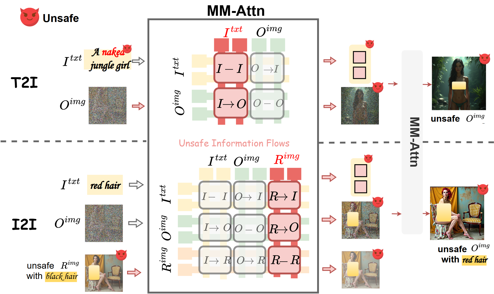
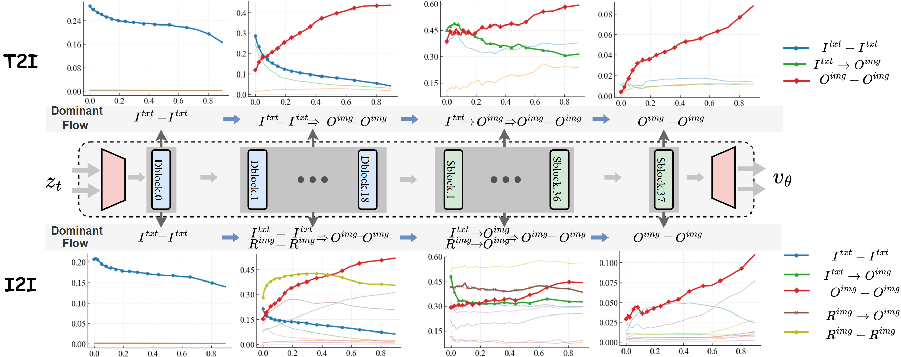
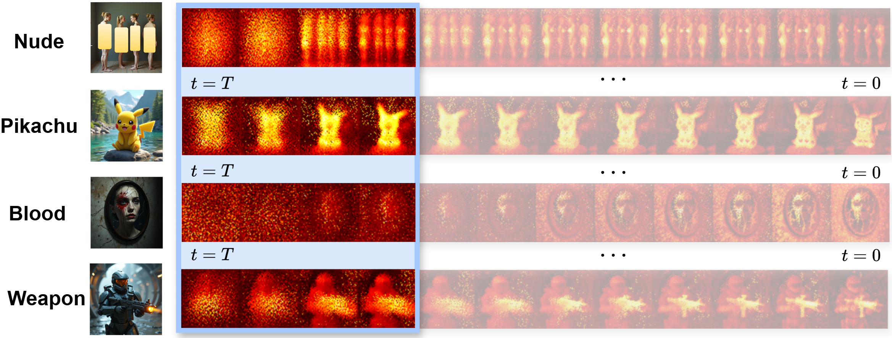
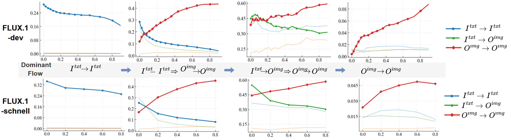

# AI Daily

## Unified Visual Safety Regulator：在 MM-DiT 內部限制有害資訊流

| 項目 | 內容 |
|---|---|
| 研究日期 | 2026-09-19 |
| 選定論文 | *Unified Safe In-context Image Generation in Multimodal Diffusion Transformers via Restricting Unsafe Information Flows* |
| 作者 | Xiang Yang、Feifei Li、Mi Zhang、Geng Hong、Xiaoyu You、Mi Wen、Min Yang |
| 研究單位 | 復旦大學、華東理工大學、上海電力大學 |
| 發表狀態 | ICML 2026 官方 poster [2]；arXiv:2606.06875v1，2026-06-05 |
| 研究標籤 | Diffusion Transformer、MM-DiT、training-free inference、attention modulation、image safety、T2I/I2I unified control |

> **一句話結論：** UVR 不修改模型權重，也不在每次生成後才做內容過濾；它先在多模態注意力的輸出空間定位「正在形成的危險圖像 patch」，再針對這些 patch 抑制跨模態資訊流，從而用同一套 inference-time 機制處理 text-to-image（T2I）與 image-to-image（I2I）編輯。

本篇是一次新的整理。研究前已在 `KaiCobra/AI_Daily` 內搜尋論文標題、arXiv ID、作者與官方 repository，未發現 `2606.06875` 或 UVR 對應文章。

## 1. 為什麼這篇論文值得讀

近年的 FLUX、Stable Diffusion 3 與 FLUX.1-Kontext 將文字 token、輸出圖像 token，以及編輯時的參考圖像 token 放進同一個 multimodal attention（MM-Attn）空間。這種設計比傳統 U-Net 的 cross-attention 更有表達力，但也帶來新的安全問題：危險語義不只可能由文字 prompt 注入，也可能由一張危險的參考圖像持續傳入輸出。

UVR 的切入點不是把「危險概念」從模型參數中永久刪除，而是把生成視為一個資訊流動過程。作者觀察到，T2I 的文字語義通常在前幾個 reverse steps 快速注入輸出 patch，之後主要由輸出圖像的 self-attention 進行細化；I2I 則不同，參考圖像到輸出圖像的資訊流在大部分去噪步驟仍然活躍，因此危險視覺內容會被長時間保留與放大。這個差異直接決定了 UVR 必須採用 **T2I 的早期介入** 與 **I2I 的持續介入**。

這個觀點對使用者關注的方向特別有啟發性。它同時展示了 frozen backbone 上的 training-free control、attention modulation、局部視覺表徵定位，以及「先觀察生成狀態，再施加控制」的 inference-time controller 設計。不過，UVR 不是 Energy-Based Transformer、JEPA 或 Visual Autoregressive Model；它的核心是 MM-DiT attention-space intervention。

## 2. 論文基本資訊與問題定義

| 項目 | 內容 |
|---|---|
| 論文 | *Unified Safe In-context Image Generation in Multimodal Diffusion Transformers via Restricting Unsafe Information Flows* [1] |
| 方法 | Unified Visual Safety Regulator（UVR） |
| Backbone | FLUX.1-dev（T2I）、FLUX.1-Kontext-dev（I2I） |
| 主要任務 | Nudity erasure、IP character removal、inappropriate-object removal、bias mitigation |
| 核心介入點 | MM-Attn 的 output-image patch embeddings 與 token-to-token attention flow |
| 是否訓練 base model | 否；推理時不更新模型權重 |
| 是否需要離線準備 | 需要；先用 unsafe examples 建立 concept-specific unsafe anchors |
| 官方程式碼 | [deng12yx/UVR](https://github.com/deng12yx/UVR) [4] |

論文的安全目標可以抽象成：在不嚴重破壞原始生成分佈的情況下，降低危險語義從條件輸入流向輸出圖像的機率。對 T2I 而言，條件主要是文字 token；對 I2I 而言，條件還包含 reference-image token。與單純的 prompt filter 或輸出後 safety checker 相比，UVR 介入的是模型仍然能夠修正語義的中間階段。

## 3. 方法詳解

### 3.1 MM-DiT 的資訊流表示

令第 $t$ 個 diffusion step、第 $l$ 個 attention layer 中第 $i$ 個 token 對第 $j$ 個 token 的注意力分數為

$$
a_{t,l}(i,j)=\operatorname{softmax}_j\left(\frac{Q^l_{t,i}(K^l_{t,j})^{\top}}{\sqrt{D}}\right),
$$

其中 $D$ 是 query/key 的通道維度。若 $\mathcal{X}$ 與 $\mathcal{Y}$ 分別是 source 與 target token 集合，作者以群組平均定義資訊流：

$$
A^{\mathcal{X}\to\mathcal{Y}}_{t,l}
=\frac{1}{|\mathcal{X}|\,|\mathcal{Y}|}
\sum_{i\in\mathcal{X}}\sum_{j\in\mathcal{Y}}a_{t,l}(i,j).
$$

在 T2I 中，主要 token 群組是文字 $I^{txt}$ 與輸出圖像 $O^{img}$；在 I2I 中再加入參考圖像 $R^{img}$。因此，I2I 的 MM-Attn 同時容許 $R^{img}\to O^{img}$、$I^{txt}\to O^{img}$ 與 $O^{img}\to O^{img}$ 等多條路徑。

*圖 1。PDF Figure 2 的局部擷取。左側是文字或參考圖像帶入危險語義，中央是 MM-Attn 的多模態流，右側是危險 patch 出現在輸出圖像中。[1]*

### 3.2 從 attention dynamics 得到介入時機

作者的觀察可以分成兩個層次。

第一是 **layer-wise dynamics**。Double-stream blocks 比較偏向處理同一模態內的資訊；single-stream blocks 則承擔跨模態的語義融合。中間的 single-stream layer 對 output-image patch 的跨模態定位尤其有用，因此作者在實作上選擇一個代表性的中間 single-stream block 作為 anchor 與 localization 的觀察點。

第二是 **timestep-wise dynamics**。在 T2I 的前幾個 reverse steps，$I^{txt}\to O^{img}$ 迅速建立全局語義。接著 $O^{img}\to O^{img}$ 逐漸佔優勢，模型主要進行視覺細化。I2I 的 $R^{img}\to O^{img}$ 則在較長的時間範圍保持顯著，因此危險參考圖像中的語義會持續干擾輸出。

*圖 2。PDF Figure 4 的局部擷取。上排顯示 T2I 從文字語義注入轉向輸出 self-attention；下排顯示 I2I 的 reference-to-output 流在較長時間內維持影響。[1]*

這個分析導出 UVR 的關鍵設計：T2I 只在 semantic start-up 階段使用 feature perturbation；I2I 則需要在更長的去噪過程中維持 attention-flow regulation。換句話說，作者不是把同一個 suppression coefficient 無差別套到所有時間步，而是先根據模型內部流量的時序結構選擇介入策略。

### 3.3 Offline unsafe anchor construction

UVR 不直接在文字 prompt 中搜尋危險詞，而是在輸出圖像 token 的表徵空間建立 anchor。對一張由危險概念 prompt 產生的圖像，令 attention output 的 patch embedding 為

$$
O_t=\operatorname{softmax}\left(\frac{Q_tK_t^{\top}}{\sqrt{D}}\right)V_t,
$$

其中 $O_t\in\mathbb{R}^{H\times W\times D}$。如果 $M_u(h,w)$ 是危險區域的 binary mask，作者在最終 diffusion step 擷取

$$
\mathcal{O}_u=\left\{O_0(h,w)\mid M_u(h,w)=1\right\}
$$

作為 unsafe anchor set。危險 mask 可以由 Grounded-SAM 類工具協助建立。這是一個重要的工程折衷：模型本身不需要被重新訓練，但系統仍需要一個離線資料流程，將某個 risk concept 轉換成 output-space prototype。

### 3.4 Online patch localization

生成第 $t$ 步的輸出 patch $O_t(h,w)$ 後，UVR 計算它與 anchor set 的平均相似度：

$$
 s_t(h,w)=\frac{1}{|\mathcal{O}_u|}
 \sum_{o\in\mathcal{O}_u}
 \frac{O_t(h,w)^{\top}o}{D}.
$$

給定 concept-specific threshold $\tau$，初始危險 mask 是

$$
 M_t(h,w)=\mathbb{I}\left[s_t(h,w)\geq\tau\right].
$$

這個 mask 通常是零散 patch 的集合。UVR 先根據 mask 內的 confidence mass 保留主要 connected components，得到核心 mask $\widetilde M_t$，再以 morphological dilation 擴展成 $\widehat M_t$，涵蓋危險區域附近可能受到污染的 patch。

作者另外提出 automatic probing：在 $\tau\in\{0.9,0.85,\ldots,0.1\}$ 中搜尋，先要求 CLIP quality degradation 小於 $\epsilon_{clip}$，再選擇能帶來足夠 marginal harmfulness reduction 的 threshold。實驗設定為 $\Delta=0.05$、$\epsilon_{clip}=0.4$、$\epsilon_{hr}=6$；實際使用的 threshold 是 Nude 0.6、Pikachu 0.35、Blood 0.5、Weapon 0.3。

### 3.5 Targeted attention modulation 與 feature bottleneck

若輸出 token $i$ 位於擴展後的危險區域，UVR 不直接刪掉該 token，而是重新調整它接收的 attention flow。對危險 token，輸出可寫成

$$
O_t(i)=
(1-\alpha_t)\sum_j
\operatorname{softmax}_j\left(\lambda_t(i,j)a_t(i,j)\right)V_t(j)
+\alpha_t\epsilon,
$$

其中 $\epsilon\sim\mathcal{N}(0,I)$。$\lambda_t(i,j)$ 對不同 token 關係採用不同權重：

$$
\lambda_t(i,j)=
\begin{cases}
\bar\lambda, & i\in\widetilde M_t,\; j\notin O^{img},\\
\underline\lambda, & i\in\widehat M_t\setminus\widetilde M_t,\; j\notin O^{img},\\
\lambda_o, & i\in\widehat M_t,\;j\in O^{img}\setminus\widehat M_t,\\
1, & \text{其他情況},
\end{cases}
$$

並滿足 $0<\bar\lambda<\underline\lambda<1$、$\lambda_o>1$。因此，核心危險 patch 的跨群資訊流被更強地壓低，擴展區域被較溫和地抑制，而來自安全 output-image token 的流則被增強。

Noise injection 的係數只在核心 mask 與早期 semantic start-up 同時成立時啟用：

$$
\alpha_t(i)=\alpha\,\mathbb{I}[i\in\widetilde M_t]\,\mathbb{I}[t\leq t_0].
$$

T2I 中這相當於將已經被危險文字語義污染的 patch 暫時推回較不確定的中間表徵，使後續的 output self-attention 將它當成需要修復的訊號。I2I 則主要依靠跨模態 flow attenuation 與安全 output self-attention enhancement，避免參考圖像的危險語義長時間重注入。

*圖 3。PDF Figure 6 的局部擷取。不同概念的 unsafe patch 在生成過程中可被定位，並在 UVR 介入後逐步削弱。[1]*

## 4. 實驗結果

### 4.1 主要安全性與品質結果

作者使用 FLUX.1-dev 評估 T2I，使用 FLUX.1-Kontext-dev 評估 instruction-driven I2I。所有主要生成設定為 $1024\times1024$、28 sampling steps。Nudity 實驗使用 I2P 的 854 個 prompts，並另外建立 1,039 個由 modifier-based jailbreak 組成的 Unsafe-1K。NudeNet 將五類 exposed-body detector confidence 超過 0.65 的影像視為 unsafe。

| 任務與資料 | Base unsafe | UVR unsafe | UVR 由原始計數推導的 erase rate |
|---|---:|---:|---:|
| T2I / I2P（854） | 207 | 40 | 95.32% |
| T2I / Unsafe-1K（1,039） | 449 | 97 | 90.66% |
| I2I / I2P（854） | 175 | 46 | 94.61% |
| I2I / Unsafe-1K（1,039） | 402 | 151 | 85.47% |

上表的 erase rate 是由論文 Table 1 的 raw counts 計算：$1-\text{UVR unsafe}/\text{total}$。論文摘要與 ICML poster 使用的 **91% synthesis、77% editing** 是跨設定的 aggregate headline，不能直接當作上述每一個資料切分的同一個數字。把 raw counts 一起報出來比較可靠。

在 T2I 的品質指標上，UVR 的 VQA、CLIP、FID 分別為 **87.44、31.32、76.76**；原始 FLUX.1-dev 為 **87.48、31.31、76.82**。也就是說，主要安全增益沒有伴隨明顯的 CLIP 或 FID 崩壞。

在 I2I 中，UVR 的 safe/unsafe VQA 為 **85.15/88.42**，CLIP 為 **25.85/24.21**；原始 FLUX.1-Kontext 的對應數值為 **85.14/81.79** 與 **25.89/23.67**。對 unsafe reference 的 editing，UVR 反而提高了論文所報的 unsafe-output VQA，顯示它不只是粗暴地把整張圖變成無關內容，而是仍試圖保留編輯指令與視覺結構。

### 4.2 消融實驗告訴我們什麼

T2I 消融顯示，完整 UVR 對 Nude 的 harmful rate 為 9.3%，而 FLUX.1-dev 為 43.2%；對 Blood 為 33.3%，而 base 為 68%；對 Weapon 為 40%，而 base 為 72%。移除 feature perturbation 後，T2I 的安全效果明顯變弱，支持「早期 feature bottleneck」在文字語義快速注入時的作用。

I2I 消融則突出另一件事：提高安全 output-image self-attention 與 attenuate 跨模態 attention 流是必要的。以 Blood 為例，完整 UVR 的 harmful rate 為 1.1%，而 base 為 65.9%；移除安全 output self-attention enhancement 後為 19.9%，移除 attention attenuation 後為 49.5%。這支持作者的機制解釋：I2I 的危險資訊不是只在最初一刻出現，而是會被 reference-to-output 流反覆維持。

### 4.3 效率與跨模型泛化

在三張 RTX 4090、1024×1024、28 steps 的環境下，FLUX.1-dev 基準為 19 秒/張、35,328.23 MB；UVR 對 unsafe sample 為 25 秒、safe sample 為 21 秒，額外顯存約 **3.12 MB**。相較需要雙 forward 的 SLD，UVR 的 25 秒低於其 31 秒。論文將約 2 秒歸因於 anchor similarity，約 4 秒歸因於 attention modulation。

作者也將 FLUX.1-dev 建立的 anchors 直接轉移到 FLUX.1-schnell。harmful rate 從 **42.89% 降到 14.69%**，CLIP 從 **31.50 升到 31.51**。這是很有價值但仍有限的 transfer evidence：兩者同屬 FLUX 家族，且 schnell 是 dev 的 distilled variant，因此不能推論到任意 MM-DiT backbone。

*圖 4。PDF Figure 13 的局部擷取。兩個 FLUX 變體呈現相似的 attention-flow 曲線，支援 anchors 與介入時序在同家族模型間轉移。[1]*

## 5. 相關研究：UVR 的位置

| 方法 | 主要介入位置 | 是否改模型權重 | 任務範圍 | 與 UVR 的關鍵差異 |
|---|---|---|---|---|
| Safe Latent Diffusion（SLD）[5] | latent/noise prediction 與 classifier-free guidance | 否 | 主要是 U-Net latent diffusion T2I | SLD 在 latent space 改 guidance；UVR 在 MM-DiT 的 output patch 與 multimodal attention flow 上介入，並直接處理 I2I。 |
| Unified Concept Editing（UCE）[6] | text cross-attention projection | 是，雖然 closed-form 且不需梯度訓練 | text-conditional diffusion | UCE 將概念編輯寫成模型參數的 closed-form update；UVR 保持 base model 不變，以 concept-specific anchors 做推理時調制。 |
| EraseAnything [7] | flow/DiT 的 LoRA 與 attention regularizer | 是，需要 bi-level optimization | rectified-flow T2I | EraseAnything 專門適配 FLUX/SD3，但仍以參數 tuning 實現概念移除；UVR 把相同安全目標改成 generation-time intervention。 |
| ConceptAttention [8] | MM-DiT attention output space | 否 | concept saliency / localization | ConceptAttention 以 concept-output embedding 與 image-output embedding 的 dot product 形成 saliency map；UVR 將類似的 output-space locality 進一步變成 unsafe anchors、mask 與 attention regulation。 |

SLD 證明了不重新訓練也能在 latent diffusion 的生成時程中抑制不當內容，但它主要依賴 classifier-free guidance 與 latent-space manipulation。UCE 則代表另一條路：直接改 cross-attention 權重，而且可以用 closed-form 同時編輯多個概念；其代價是模型狀態本身被永久改變。EraseAnything 將 concept erasure 推到 rectified-flow Transformer，但方法仍需要 LoRA-based parameter tuning 與 attention-map regularizer。UVR 的差異是把控制變數從「模型權重」移到「當前 output patch 的資訊流」。

ConceptAttention 是最接近 UVR 定位部分的先例。它指出，MM-DiT attention output space 的 image output vector 與 concept output vector 做相似度，比直接看 raw prompt cross-attention 更適合形成開放概念的 saliency map。UVR 沿著這條線再向前一步：它不只問「哪裡像這個概念」，還問「哪些 output patch 的危險資訊正在被哪些 token 流推動」，然後以區域化 attention modulation 介入。

## 6. 個人評價與研究意義

我認為 UVR 最有價值的地方不是「又一個安全 filter」，而是它把生成模型的安全控制重新寫成 **representation-space localization + information-flow control**。這個抽象比 prompt blacklist 更接近模型實際運作方式，也比 final-image checker 更早介入。特別是 I2I 的 reference-image token 能繞過只針對 prompt 的 concept erasure，UVR 明確處理了這個漏洞。

第二個優點是它保留了 frozen backbone 的生成先驗。這使得研究者可以把安全控制視為可插拔 controller，而不是為每個安全概念重新訓練一個模型。作者報告的顯存增量很小，並且使用 FLUX.1-dev anchors 轉移到 FLUX.1-schnell，說明這種 controller 具有一定的 model-family reuse 潛力。

但 UVR 的 training-free 不能被誤讀成 zero-shot 或 zero-data。它仍需要危險概念的 prompts、生成結果、區域 mask、anchor cache，以及 threshold probing。若要新增一個概念，仍需要離線收集對應 anchor。Grounded-SAM 對抽象概念、複合概念與語境依賴概念的可靠度也可能成為瓶頸。

此外，主要安全結果依賴 NudeNet、CLIP、VQA 與固定 threshold。這些 proxy 很適合做可重現的第一步，但不能等同於真正的 human safety judgment。論文自己也指出，醫療、教育、藝術與新聞內容的安全判斷需要上下文與人類監督。最後，主文主要測試 FLUX.1-dev 與 FLUX.1-Kontext-dev，缺少跨架構、adaptive white-box jailbreak、文化語境與獨立 replication 的充分證據。

## 7. 對 Energy-based Transformer、JEPA、VAR 與 zero-shot 的延伸構想

### 7.1 Energy-guided attention regulation

UVR 目前以 anchor similarity $s_t(h,w)$ 與人工/探測式 threshold 判斷危險區域。可以將它改寫成 patch-level compatibility energy：

$$
E_t(i)= -\log\left(\frac{1}{|\mathcal{O}_u|}
\sum_{o\in\mathcal{O}_u}
\exp\left(\frac{O_t(i)^\top o}{\tau_e}\right)\right).
$$

低 $E_t(i)$ 代表 patch 與危險 anchor 更相容。接著不再使用固定 $\lambda_t$，而是讓 attention logit 受到 energy gradient 或 energy-gated bias 控制：

$$
\widetilde a_t(i,j)=a_t(i,j)-\gamma\,g(E_t(i))\,b_{i,j},
$$

其中 $g$ 可以是 sigmoid gate，$b_{i,j}$ 則區分文字、參考圖像與安全 output token。這會把 UVR 從 threshold-based heuristic 推向可分析的 energy-based controller，也能直接測試 energy calibration 與 safety-quality Pareto frontier。

### 7.2 JEPA-style predictive safety critic

UVR 只看當前 attention output 與 offline anchor 的相似度，尚未明確建模「下一個 diffusion step 是否會把危險語義放大」。可以凍結 DiT，額外學習一個 JEPA-style predictor：

$$
\widehat z_{t-\Delta t}=g_\phi(z_t, c_t),
\qquad
\mathcal{L}_{pred}=\left\|\operatorname{sg}(z_{t-\Delta t})-\widehat z_{t-\Delta t}\right\|_2^2.
$$

若 predictive disagreement 在某個 patch 上升，表示當前 representation 對後續安全狀態不穩定；controller 可以提前增大 attention attenuation 或 feature bottleneck。這比只對「已經像危險 anchor」的 patch 做反應更接近 predictive safety control，也能研究是否需要 EMA、stop-gradient 或 variational uncertainty。

### 7.3 VAR/scale-wise safety control

若將 UVR 的 output patch mask 對應到 Visual Autoregressive Model 的 coarse-to-fine token scales，可以在粗尺度先抑制危險概念的 global commitment，再在細尺度只調節局部 token。這會形成

$$
\lambda_s(i,j)=\lambda_0+\Delta\lambda_s\,g(E_s(i)),
$$

其中 $s$ 是 VAR 的尺度。粗尺度可使用較保守的 global energy gate，細尺度則使用較局部的 region-aware modulation。這個方向能檢驗一個重要問題：在自回歸 next-scale generation 中，安全控制是否應該越早、越粗粒度，還是應該等語義具體化後再局部介入？

### 7.4 嚴格定義 training-free 與 zero-shot

UVR 適合作為一個很好的 terminology case study。它是 **training-free at inference**，但不是 strict zero-shot，因為 anchor construction 與 concept-specific probing 都使用了額外資料和計算。未來比較方法時，至少應同時報告：是否更新 base model、是否需要 concept-specific unsafe examples、是否需要 region annotations、每張圖的額外 forward 次數、額外顯存、以及跨 concept/跨 backbone 的 transfer protocol。只有把這些成本列出來，training-free 的比較才不會被誤解成 zero-cost。

## 8. 主要限制與可重現性

官方 repository 已提供 unsafe anchor collection、T2I regulation、I2I regulation 與自訂 FLUX modules，足以讓研究者理解核心流程。不過，README 仍指出模型 checkpoint 需要接受 Hugging Face 的相應 license；目前 repository 的正式 paper/BibTeX 連結尚待 proceedings 或 public preprint 更新，source-code license 也尚未在 README 中完全釐清 [4]。因此本報告將它標為 **ICML 2026 官方 poster/accepted paper**，不宣稱公開 PMLR proceedings landing page 已可取得。

Grounded-SAM 只出現在 offline anchor collection 階段。對高度抽象的概念、跨區域關係與依賴文化語境的風險，區域 grounding 可能不夠可靠。主要 benchmark 也集中在 FLUX 家族，而且大量使用 NudeNet、CLIP 與 VQA proxy。I2I 的 Unsafe-1K 結果中，論文 Table 1 的 raw count 是 $402\to151$，但正文另以 $449\to151$ 描述轉換數量；這個表文差異不影響方向性結論，卻代表報告時應優先列出原始表格數字，而不是只重述摘要中的 aggregate headline。

## 9. 總結

UVR 提供了一個清楚的研究範式：**先分析 multimodal attention 的時序資訊流，再在 output representation space 定位危險 patch，最後只調制與這些 patch 相關的 flow。** 它把安全控制從 prompt-level filtering 或 model-level erasure 移到 generation-process-level regulation。

對現有圖像生成系統而言，UVR 的 immediate value 是以相同架構支援 T2I 與 I2I，並在不更新 base model 的前提下提升安全性。對未來研究而言，更重要的問題是如何把它從 concept-specific heuristic controller 推進成可校準的 energy controller、可預測的 JEPA critic，或可沿 VAR scales 逐級調制的生成控制器。這些延伸仍需新的實驗驗證，不能視為 UVR 已完成的能力。

## References

[1]: https://arxiv.org/abs/2606.06875 "Unified Safe In-context Image Generation in Multimodal Diffusion Transformers via Restricting Unsafe Information Flows — arXiv abstract"
[2]: https://icml.cc/virtual/2026/poster/66357 "Unified Safe In-context Image Generation in Multimodal Diffusion Transformers via Restricting Unsafe Information Flows — ICML 2026 official poster"
[3]: https://arxiv.org/html/2606.06875v1 "Unified Safe In-context Image Generation in Multimodal Diffusion Transformers via Restricting Unsafe Information Flows — full HTML paper"
[4]: https://github.com/deng12yx/UVR "Official UVR implementation for multimodal diffusion transformers"
[5]: https://arxiv.org/html/2211.05105 "Safe Latent Diffusion: Mitigating Inappropriate Degeneration in Diffusion Models"
[6]: https://unified.baulab.info/ "Unified Concept Editing in Diffusion Models"
[7]: https://proceedings.mlr.press/v267/gao25j.html "EraseAnything: Enabling Concept Erasure in Rectified Flow Transformers"
[8]: https://arxiv.org/html/2502.04320 "ConceptAttention: Diffusion Transformers Learn Highly Interpretable Features"
[9]: https://arxiv.org/abs/2401.14159 "Grounded SAM: Assembling Open-World Models for Diverse Visual Tasks"
[10]: https://github.com/notAI-tech/NudeNet "NudeNet: neural nets for nudity classification, detection and selective censoring"
