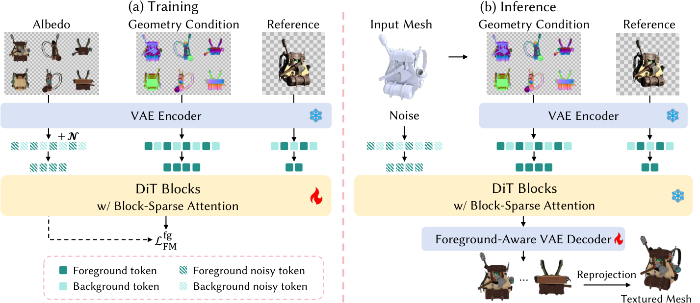
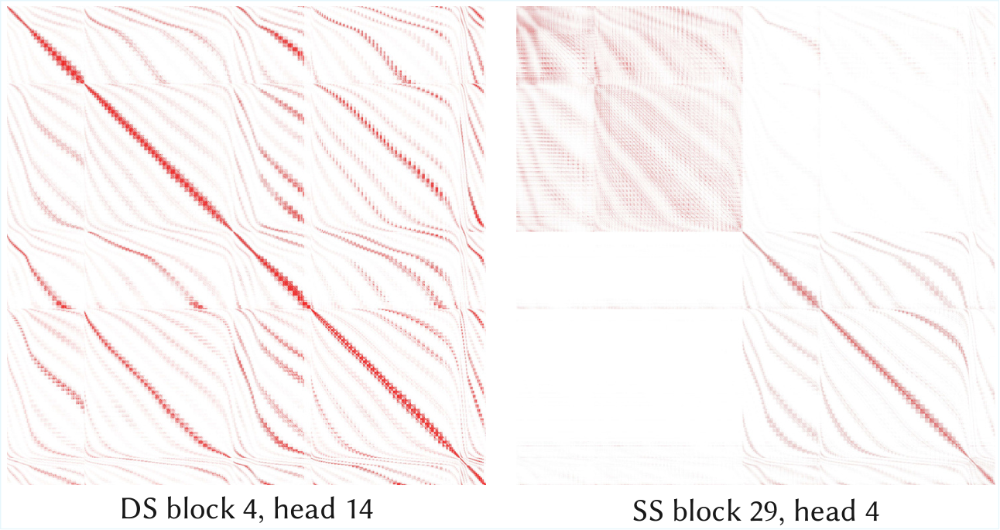

# AI Daily

> **今日結論：** UltraTex 的價值不在於提出新的能量模型、JEPA 或 Visual Autoregressive Model，而在於把高解析多視角 diffusion 的計算瓶頸拆成三個可處理的問題：背景 token 冗餘、前景 attention 冗餘，以及前景-only denoising 造成的 VAE 解碼分布偏移。它用 **Background Token Dropping（BTD）→ Block-Sparse Attention（BSA）→ Foreground-Aware VAE Decoding（FAVD）** 將 2K 六視角生成推到可訓練、可推理的系統。這篇工作最值得借鑑的研究問題是：**哪些空間 token 根本不應進入模型，哪些 token interaction 可以用不確定性或能量分數選擇，以及如何讓 decoder 適應稀疏推理後的非標準 latent。**

## 論文基本資訊

| 欄位 | 內容 |
|---|---|
| 論文 | **UltraTex: Unleashing 2K Multi-View Diffusion for 3D Texturing** |
| 作者 | Yibo Zhang、Ze Yuan、Nan Cao、Li Zhang、Yan-Pei Cao、Yuan-Chen Guo、Rui Ma |
| 機構 | Jilin University、Shanghai Innovation Institute、The University of Hong Kong、Tongji University、Fudan University、VAST |
| 發表狀態 | **SIGGRAPH Asia 2026 Conference Paper**，收錄於 Conference Proceedings；不是 ACM Transactions on Graphics Journal track。[3] |
| 預印本 | arXiv:2609.23169，v1 於 2026-09-19 提交 |
| DOI | 10.1145/3829340.3842299 |
| 官方頁面 | [UltraTex project page][2] |
| 研究領域 | 高解析多視角 diffusion、Diffusion Transformer、block-sparse attention、3D texturing |

UltraTex 以一張參考圖、六個視角的幾何法線條件，以及輸入 3D mesh 為條件，生成六張 2048×2048 的 geometry-aligned texture views，再把它們重投影回 3D mesh。論文指出，在 VAE 8×下採樣與 DiT 2×2 patchification 後，每張 2K 圖像有 16,384 個 latent tokens；六張 target、六張 condition 和一張 reference 合計為 **212,992 tokens**。這個序列長度使一般的全注意力 MM-DiT 難以直接訓練與推理。[1]

本次先排除 repo 中已發布的文章，再比較 2026-09-17 至 2026-09-21 的五篇新候選。UltraTex 最終勝出，原因是它同時具備完整 PDF、官方專案頁、可核對的實驗表格、正式會議 track 與 DOI。需要先說清楚的是，UltraTex **不是** Energy-Based Transformer、JEPA、VAR、training-free 或 zero-shot 方法；它是以 FLUX 為基礎、經過任務資料訓練的高解析 diffusion 系統。這個負面判定很重要，因為它能避免把「稀疏 attention」錯誤地等同於「免訓練 attention modulation」。

## 核心貢獻：把 2K 多視角生成的瓶頸分層處理

### 1. 以幾何 mask 消除背景 token

物件中心的多視角畫布通常包含大量無效背景。論文的例子中，某些六視角 layout 的有效前景只佔 **7.9%** 或 **24.9%** 的像素。若所有背景仍被 token 化，DiT 每一層都會對不需要生成紋理的區域執行相同計算。

BTD 直接從渲染 alpha channel 建立 binary foreground mask，將 mask 下採樣到 latent token grid，再稍微膨脹以保留邊界。背景 token 在進入 MM-DiT 前被移除，留下的 token 保留原本的 RoPE position index。因此，序列雖然不再連續，模型仍可用絕對空間位置理解每個 token 所屬的畫布與視角。[1]

*圖 1。BTD 先縮短序列，BSA 再減少剩餘前景 token 的 interaction；推理時以 FAVD 取代含噪背景，最後重投影成 textured mesh。[1]*

### 2. 在前景序列上使用 Block-Sparse Attention

刪除背景後，前景 token 之間仍不需要全部互相注意。UltraTex 先以較低解析度的 full-attention 模型觀察注意力圖，發現 double-stream 與 single-stream block 都呈現稀疏 pattern。BSA 將 token 分成 query blocks 與 key/value blocks，先用 block mean pooling 估計粗粒度相關性，再對每個 query block 只保留分數最高的 key blocks。

這個設計的重點是：**Top-K 只用於決定要計算哪些 block pair；被選中的 block 內仍使用原始 token 做精確 attention。** 因此它不是把每個 block 壓成一個 token，而是以低成本的 block score 避免大量不必要的 token-level matrix multiplication。

*圖 2。論文展示的 DS block 4/head 14 與 SS block 29/head 4 注意力圖，顯示保留的前景序列仍存在大量可跳過的 interaction。[1]*

### 3. 用 Foreground-Aware VAE Decoding 修復稀疏推理的分布偏移

BTD 在推理時只更新前景位置。背景 latent 從初始 Gaussian noise 開始，直到採樣結束都沒有被 denoise。如果將「乾淨前景 + 純噪聲背景」直接交給原始 VAE decoder，噪聲會透過 decoder 的局部與跨區域運算污染前景，導致紋理品質下降。

FAVD 分成兩步。第一步以純黑 RGB image 經 frozen VAE encoder 得到合法的 background latent，將它替換到 composite latent 的背景位置。第二步凍結 encoder，只微調 decoder，並將 reconstruction loss 限制在 foreground pixels。這是一個很一般化的設計模式：**不要為了修復 decoder 而重新 denoise 背景，而是把無效背景替換成 decoder 熟悉的 in-distribution latent。**

## 技術方法與數學細節

### 3.1 Flow Matching 基線

令 $z_{\mathrm{tgt}}$ 表示多視角 target albedo 的 latent，$z_{\mathrm{ref}}$ 表示參考圖 latent，$z_{\mathrm{cond}}$ 表示幾何條件 latent。論文採用從 data 到 Gaussian noise 的 flow-matching path：

$$
z_{\mathrm{tgt}}^{(t)}=(1-t)z_{\mathrm{tgt}}+t\varepsilon,
\qquad \varepsilon\sim\mathcal{N}(0,I),
\qquad t\in[0,1].
$$

對應的目標 velocity 是 $\varepsilon-z_{\mathrm{tgt}}$，標準損失為

$$
\mathcal{L}_{\mathrm{FM}}(\theta)=
\mathbb{E}_{t,z_{\mathrm{tgt}},\varepsilon}
\left[
\left\|
\hat v_{\theta}(z_{\mathrm{tgt}}^{(t)},z_{\mathrm{ref}},z_{\mathrm{cond}},t)
-(\varepsilon-z_{\mathrm{tgt}})
\right\|_2^2
\right].
$$

BTD 將 mask 套用到 noisy target、幾何 condition 與 reference。令 $\mathcal{M}_{\mathrm{fg}}$ 為保留的 foreground positions，$\operatorname{Gather}_{\mathcal{M}_{\mathrm{fg}}}$ 將 dense grid 取出成 compact sequence，則訓練只監督前景：

$$
\mathcal{L}_{\mathrm{FM}}^{\mathrm{fg}}(\theta)=
\mathbb{E}
\left[
\left\|
\hat v_{\theta}^{\mathrm{fg}}
-
\operatorname{Gather}_{\mathcal{M}_{\mathrm{fg}}}
(\varepsilon-z_{\mathrm{tgt}})
\right\|_2^2
\right].
$$

推理時只對 $i\in\mathcal{M}_{\mathrm{fg}}$ 做 Euler update：

$$
z_i^{(t_{\mathrm{prev}})}=
 z_i^{(t_{\mathrm{curr}})}+
 (t_{\mathrm{prev}}-t_{\mathrm{curr}})\hat v_{\theta,i}.
$$

背景位置不更新，因此仍是 Gaussian noise，這正是後續 FAVD 必須處理的原因。

### 3.2 BSA 的 Top-K block routing

若 $Q,K,V\in\mathbb{R}^{N\times d}$，全注意力為

$$
S=\frac{QK^\top}{\sqrt d},
\qquad P=\operatorname{Softmax}(S),
\qquad O=PV,
$$

其主要計算成本與 $O(N^2d)$ 成正比。UltraTex 將 $Q$ 分成 $N_q$ 個 query blocks，將 $K,V$ 分成 $N_k$ 個 key/value blocks。對每個 block 做 token-dimension 的 mean pooling：

$$
S_c=\operatorname{pool}(Q)\operatorname{pool}(K)^\top.
$$

給定 retention ratio $\rho$，每個 query block $i$ 只保留 $K_\rho=\lfloor\rho N_k\rfloor$ 個最高分 key blocks：

$$
M_c[i,j]=
\begin{cases}
1, & j\in\operatorname{TopK}(S_c[i,:],K_\rho),\\
0, & \text{otherwise}.
\end{cases}
$$

最後在被選中的集合 $\mathcal{S}_i=\{j\mid M_c[i,j]=1\}$ 上，以原始 token 計算：

$$
O_i=
\operatorname{Softmax}\left(
\frac{Q_iK_{\mathcal{S}_i}^{\top}}{\sqrt d}
\right)V_{\mathcal{S}_i}.
$$

因此，BSA 的近似只發生在 **選擇 support**，不是在已選 support 內用 pooled token 取代原始 attention。最終模型採用 $\rho=0.2$；$\rho$ 越小越快，但過低時會刪除重要的紋理 interaction。

### 3.3 FAVD 的 composite latent

令 $z_0^{\mathrm{fg}}$ 是前景 denoising 完成後的 latent，令 $z^{\mathrm{bg}}$ 是由純黑 RGB image 經 VAE encoder 得到的合法背景 latent。Composite latent 為

$$
z_i^{\mathrm{mix}}=
\begin{cases}
 z_{0,i}^{\mathrm{fg}}, & i\in\mathcal{M}_{\mathrm{fg}},\\
 z_i^{\mathrm{bg}}, & \text{otherwise}.
\end{cases}
$$

令 $\mathcal{D}$ 為 decoder、$\mathcal{M}_{\mathrm{fg}}^{\mathrm{px}}$ 為 full-resolution foreground mask，decoder fine-tuning 使用

$$
\mathcal{L}_{\mathrm{dec}}=
\frac{1}{|\mathcal{M}_{\mathrm{fg}}^{\mathrm{px}}|}
\sum_{i\in\mathcal{M}_{\mathrm{fg}}^{\mathrm{px}}}
\left\|
\mathcal{D}(z^{\mathrm{mix}})_i-x_i^{\mathrm{gt}}
\right\|_2^2.
$$

這個 loss 沒有要求背景本身還原成 ground truth。它只要求 decoder 在「合法背景 latent + denoised foreground latent」的輸入分布下，保持前景紋理的重建品質。

## 訓練資料與實作設定

UltraTex 建立 G-buffer TexVerse。官方頁面列出的公開資料總量為 **351,847 個 BSDF assets**，但論文訓練實際使用約 **268,365 個過濾後 assets**；兩個數字是公開總量與訓練子集，不應相加或互換。資料包含 multi-view G-buffer、reference image、albedo、shading normal 與多種 lighting，最高可到 4096×4096。[2]

模型以 FLUX 的 MM-DiT 初始化，使用 rank-64 LoRA。訓練分三階段，在 64 張 H200 上進行：第一階段為 512×512 full attention、22K steps；第二階段為 1024×1024 full attention，從 22K 延續到 70K；第三階段為 2048×2048，切換到 $\rho=0.2$ 的 BSA，從 70K 延續到 97K。作者另外使用 DeepSpeed ZeRO-2、gradient checkpoint，以及依有效 foreground token 數量分桶，以減少長序列造成的 GPU imbalance。[1]

FAVD decoder 使用 albedo supervision 微調 3,000 steps，batch size 為 64，learning rate 為 $10^{-5}$。因此，UltraTex 的完整方法是**訓練式**的；它不是把一個現成 FLUX 變成完全 inference-only 的 zero-shot 方法。

## 實驗結果

UltraTex 在 TexVerse 的 100 個 training-unseen objects 上評估。每個 mesh 以統一 rendering pipeline 從 32 個 viewpoints 比較，分成 Unshaded、Shaded 與 Relighting 三個 track。FID、CLIP-FID、CMMD、LPIPS 越低越好；CLIP-I 越高越好。Step1X-3D 與 UniTEX 的 texture 帶有 baked-in lighting，因此作者在 Unshaded track 不列出它們的 albedo 指標。[1]

### Unshaded：比較 lighting-free albedo

| 方法 | FID↓ | CLIP-FID↓ | CMMD↓ | CLIP-I↑ | LPIPS↓ |
|---|---:|---:|---:|---:|---:|
| Hunyuan3D 2.1 | 153.48 | 18.995 | 1.150 | 0.908 | 0.136 |
| LumiTex | 147.31 | 18.251 | 1.223 | 0.914 | 0.138 |
| **UltraTex** | **125.13** | **15.180** | **0.810** | **0.929** | **0.082** |

UltraTex 在這個 track 的五項指標都優於兩個可公平比較的 PBR baseline。這是很強的結果，但它比較的是特定的 100-object protocol，不應直接外推成所有 3D assets 或所有材質類型都會有相同幅度的提升。

### Shaded 與 Relighting：多數指標較佳，但不是所有指標都勝出

| Track | 方法 | FID↓ | CLIP-FID↓ | CMMD↓ | CLIP-I↑ | LPIPS↓ |
|---|---|---:|---:|---:|---:|---:|
| Shaded | LumiTex | 110.6 | 12.265 | **0.351** | 0.939 | 0.107 |
| Shaded | **UltraTex** | **97.6** | **12.239** | 0.368 | **0.941** | **0.064** |
| Relighting | LumiTex | 114.5 | 11.982 | **0.316** | 0.941 | 0.105 |
| Relighting | **UltraTex** | **96.4** | **11.583** | 0.333 | **0.944** | **0.062** |

UltraTex 在 Shaded 與 Relighting 的 FID、CLIP-FID、CLIP-I、LPIPS 較佳，但 CMMD 略差於 LumiTex。最準確的說法是「在多數指標上表現最佳」，不能寫成「所有指標全面超越」。

### FAVD 消融

| 解碼設定 | PSNR↑ | SSIM↑ | LPIPS↓ |
|---|---:|---:|---:|
| FLUX VAE，完整圖像 | 47.65 | 0.9937 | 0.0023 |
| FLUX VAE，噪聲背景 | 29.66 | 0.9555 | 0.0263 |
| FAVD，未微調 decoder | 37.81 | 0.9818 | 0.0084 |
| **FAVD，微調 decoder** | **50.26** | **0.9956** | **0.0038** |

這組消融支持論文的分布偏移分析：直接把 noisy background 餵給 VAE 會傷害前景；替換成合法 background latent 已能改善品質，decoder 的 foreground-restricted fine-tuning 進一步修復色偏與重建誤差。[1]

### 效率結果

在單張 H200、2048 resolution 的測試中，BTD 與 BSA 的組合在資料常見的 foreground ratio 範圍內，報告 **20.6×–91.1× training speedup** 與 **22.3×–74.6× end-to-end inference speedup**。BTD 在背景比例很高時主導加速；BSA 在前景比例較高、背景較少時提供額外的補充。這些倍率依賴 foreground ratio、$\rho$、H200 硬體、Flash-Attention baseline 與 kernel implementation，不能解讀為所有 GPU 都固定獲得相同的加速。

## 相關研究與定位

### UniTEX：從 UV mapping 走向 3D functional space

UniTEX 將 texture 表示成不依賴 mesh topology 的 Texture Functions，並以 Large Texturing Model 與 LoRA-adapted DiT 生成高品質多視角 texture。[5] UltraTex 將 UniTEX 作為比較 baseline，但問題不同：UniTEX 的主要焦點是 3D functional-space representation 與 texture integrity；UltraTex 的主要焦點是如何讓 multi-view diffusion 在 2K resolution 下可計算。兩者可以組合成一個有趣方向：用 UltraTex 的 BTD/BSA 生成高解析 observation，再由 UniTEX 類的 continuous texture function 進行 topology-robust fusion。

### MVPaint：同步生成、3D inpainting 與 UV refinement

MVPaint 將多視角生成同步化，以避免每個 view 各自 diffusion 造成的不一致，再用 spatial-aware 3D inpainting 補足未觀測區域，最後以 UV refinement 修復 seam。[6] UltraTex 沒有採用完整的 UV refinement pipeline，而是利用幾何條件、六視角 layout 與 foreground-only generation 直接將計算集中在可見表面。兩者的共同問題是跨 view consistency；差別是 MVPaint 主要處理「如何同步與補全」，UltraTex 主要處理「如何在更高解析度下縮短序列與 attention」。

### SyncMVD：在去噪過程中分享跨視角內容

SyncMVD 的核心觀察是，多視角 diffusion 若不同步，生成結果容易出現 texture inconsistency；因此它在每個 denoising step 分享有 overlap 的 latent content，使不同 views 更早達成共識。[7] UltraTex 沿用了 multi-view diffusion 的共同序列思路，但將研究重點轉向計算稀疏性。未來可將兩者結合：先以 BTD/BSA 篩選需要計算的 foreground support，再只在幾何重疊區域做 synchronized latent exchange。

### Paint3D：coarse-to-fine 的 2K lighting-free texture

Paint3D 以 depth-aware 2D diffusion 先建立 coarse texture，再用 UV Inpainting 與 UVHD diffusion 補洞、去除 illumination artifacts，得到高解析 lighting-free texture。[8] UltraTex 的差異是把高解析多視角生成器本身擴到 2K，並以 FAVD 解決稀疏 latent 的 decoder artifact，而不是在 UV 空間事後修補全部問題。這說明 3D texturing 至少有兩條互補路線：**在生成後修復 UV/texture，或在生成器內部直接管理幾何條件與計算 support。**

## 與近期關注方向的對接：可延伸的研究問題

UltraTex 並不直接驗證下列方向，但它提供了一個很清楚的實驗平台。以下構想是基於論文方法的研究延伸，不是論文原始 claim。

| 方向 | UltraTex 的現況 | 可激發的研究問題 |
|---|---|---|
| Energy-Based Transformer | BSA 使用 pooled $QK$ score 做 hard Top-K，沒有 scalar energy 或 energy-based objective。 | 將 block compatibility 寫成 $E_{ij}=-\operatorname{pool}(Q_i)\operatorname{pool}(K_j)^\top$，以 energy margin 或 calibration 決定 support；比較 hard Top-K、soft energy bias 與 adaptive $\rho$ 是否能在相同品質下減少 token interaction。 |
| JEPA | UltraTex 沒有 target/predictor latent loss，也沒有 masked future representation prediction。 | 以 frozen 或 jointly trained JEPA encoder 預測被刪除背景附近的 surface latent，只有在 predicted uncertainty 高時恢復更多 token；這會把 BTD 從固定幾何剪枝變成 representation-aware token allocation。 |
| VAR / visual autoregression | UltraTex 不是 next-token 或 next-scale AR；它使用 flow-matching DiT。 | 將多視角 texture 先做 coarse-to-fine scale decomposition，再讓每個 scale 預測下一個 foreground support；可比較 VAR 的 scale-wise commitment 與 BTD 的 geometry-known support 哪一種更適合高解析 texture。 |
| Training-free | BSA 需要在訓練流程中適配，FAVD 也需要 decoder fine-tuning。 | 在 frozen FLUX 上只以 attention map、RoPE index 與 geometry mask 建立 inference-only sparse route，嚴格比較「預訓練模型 + routing」與「BTD/BSA fine-tuning」的品質、記憶體與速度。 |
| Zero-shot | UltraTex 使用 G-buffer TexVerse 訓練，不能稱為 zero-shot。 | 對未見的 mesh topology、view count、材質類型與 4K input 建立 zero-shot protocol，分開測量 geometry-mask transfer、texture fidelity、background sensitivity 與 VAE decoder shift。 |
| Attention modulation | BSA 是 trainable sparse routing，不是 inference-time logit modulation。 | 用 energy/JEPA uncertainty 產生連續 bias $B_{ij}$，令 $P=\operatorname{Softmax}((QK^\top/\sqrt d)+\beta B)$；比較硬刪除與軟調制在邊界、細長物件與 repetitive pattern 上的 trade-off。 |

我認為最值得先做的實驗是 **Energy-Gated BSA + JEPA support predictor**：先讓一個輕量 predictor 預測每個 foreground block 的 texture-relevant latent，再用 compatibility energy 與 prediction uncertainty 聯合決定 $\rho_i$。當 block 的 predicted latent 不確定時恢復更多 key blocks；當 energy margin 很大時使用更稀疏的 routing。這會把 UltraTex 的固定 $\rho=0.2$ 推向 state-dependent、可解釋的計算配置。

## 個人評價與研究意義

UltraTex 最強的部分是它把「高解析生成很慢」轉成可診斷的系統問題，而不是只宣稱增加硬體或縮小模型。BTD、BSA 與 FAVD 分別處理 sequence、attention、decoder 三個層級，三者也形成清楚的因果鏈：若只刪 token，必須處理非連續序列；若只做 sparse attention，仍會浪費背景計算；若只做 foreground-only denoising，則 decoder 會看到異常 latent distribution。這種分層設計很適合被移植到影片、全景圖、視覺自回歸或 world-model memory。

它的理論新穎性則應保守評估。Token dropping、block-sparse attention、flow matching 與 VAE fine-tuning 都不是全新的基本原語；論文的貢獻更像是把它們以 object-centric geometry mask 組合成一個能支援 2K 六視角 texture generation 的完整系統。它的實驗證據也有邊界：測試集只有 100 個未見物件，速度數字在 H200 與特定 baseline 上量測，且 Shaded/Relighting 的 CMMD 並未勝過 LumiTex。另一方面，能把 sequence 從 212,992 tokens 的量級壓到可訓練，仍是很有實用價值的系統成果。

## 重要限制

1. **重複紋理仍可能失敗。** 論文以 repetitive texture 作為代表 failure case。當多個區域外觀相似時，局部 sparse interaction 可能缺乏足夠的全局 disambiguation。
2. **能力受 FLUX 與 VAE 限制。** VAE latent compression 可能抹平高頻細節；4K 或 8K 已超出現有 FLUX 主要適配範圍，未來可能需要原生高解析 DiT–VAE foundation model。
3. **依賴幾何 mask 與固定六視角 protocol。** BTD 不是任意輸入都能直接使用的通用 token pruner；它依賴 alpha/geometry foreground mask、固定 layout 與可重投影的 3D mesh。
4. **速度倍率不是硬體無關常數。** 結果依 foreground ratio、H200、Flash-Attention implementation、block kernel 與 retention ratio 而變。報告中的 20.6×–91.1× 與 22.3×–74.6× 應被視為論文 protocol 下的區間。
5. **與使用者偏好的方向仍有距離。** UltraTex 沒有 EBT energy objective、JEPA predictive loss、VAR next-scale factorization，也沒有 training-free 或 strict zero-shot evaluation。它適合當作計算稀疏性的橋接工作，而不是上述方向的直接代表。

## 最後 takeaway

UltraTex 給出的核心設計原則可以濃縮成一句話：

> **先用幾何先驗刪除不會產生答案的 token，再用內容相關性選擇真正需要交互的 token，最後讓 decoder 看見它熟悉的 latent 分布。**

對下一步研究而言，最有潛力的不是直接複製 BTD 或 BSA，而是讓 support selection 具備可學習的不確定性與能量解釋：幾何 mask 決定「可能在哪裡」，JEPA 預測決定「是否值得保留」，Energy-Based compatibility 決定「誰應該互相注意」，而 VAR 或 flow solver 決定「何時以何種解析度提交細節」。

## References

[1]: https://arxiv.org/html/2609.23169v1 "UltraTex: Unleashing 2K Multi-View Diffusion for 3D Texturing"
[2]: https://yiboz2001.github.io/UltraTex "UltraTex official project page"
[3]: https://asia.siggraph.org/2026/submissions/technical-papers/ "SIGGRAPH Asia 2026 Technical Papers: Journal and Conference tracks"
[4]: https://huggingface.co/papers/2609.23169 "Hugging Face Papers: UltraTex"
[5]: https://arxiv.org/abs/2505.23253 "UniTEX: Universal High Fidelity Generative Texturing for 3D Shapes"
[6]: https://arxiv.org/abs/2411.02336 "MVPaint: Synchronized Multi-View Diffusion for 3D Texturing"
[7]: https://arxiv.org/abs/2311.12891 "Text2Tex: Text-driven Texture Synthesis via Diffusion Models"
[8]: https://arxiv.org/abs/2312.13913 "Paint3D: Paint Anything 3D with Lighting-Less Texture"
[9]: https://arxiv.org/abs/2609.23169 "UltraTex arXiv metadata and PDF"
[10]: https://doi.org/10.1145/3829340.3842299 "UltraTex in SIGGRAPH Asia 2026 Conference Papers"

*報告撰寫日期：2026-09-23。本文中的實驗數值與方法公式均以論文原文為準；研究延伸段落屬於個人分析，已與原始論文 claim 分開標示。*
