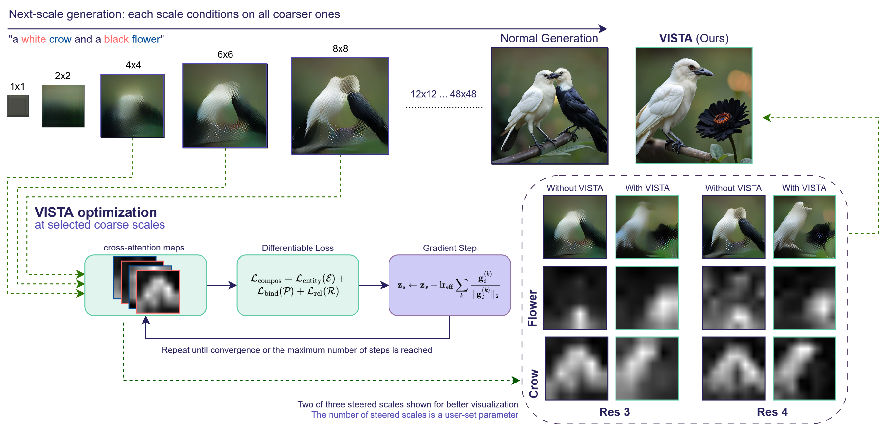

# AI Daily

**日期：2026-09-01**  
**今日主題：Visual Autoregressive Generation、Training-Free Test-Time Alignment、Cross-Attention Modulation**  
**作者：Manus AI**

## VISTA: Test-Time Compositional Alignment for Visual Autoregressive Generation

今日精選 **VISTA（Visual Autoregressive Semantic Test-time Alignment）**。論文由 Hossein Shahabadi、Niki Sepasian 與 Mahdieh Soleymani Baghshah 撰寫，來自 **Sharif University of Technology**，於 2026-08-23 以 arXiv 預印本公開（arXiv:2608.22521v1）。[1] 這篇工作不是重新訓練一個更大的生成器，而是直接處理 Visual Autoregressive（VAR）模型最令人困擾的問題之一：圖片看起來逼真，卻無法穩定遵守文字中的屬性綁定、物件位置與前後遮擋關係。

> **一句話摘要：** VISTA 把 diffusion 時代的「以 cross-attention 作為可微控制介面」移植到 stateful、離散、coarse-to-fine 的 next-scale VAR 生成流程中；它不更新模型權重，但在推理時以梯度優化中間表示，讓凍結的 Infinity 生成器自己產生更符合組合性約束的圖像。

## 為什麼今天選它

本次先檢查 Hugging Face Papers Trending、近期 arXiv 視覺生成與 JEPA 研究，再與 `KaiCobra/AI_Daily` 既有文章比對。repository 的 README 已更新至 2026-08-31，且已收錄多篇 training-free、VAR、JEPA、energy-based 與 attention modulation 工作，因此本日排除了同標題、同 arXiv ID 或研究問題高度重疊的文章。VISTA 尚未出現在 repository，並且直接命中「VAR-based、training-free、attention modulation、zero-shot inference」四個偏好方向。

| 候選 | 判斷 | 主要原因 |
|---|---|---|
| **VISTA** | **入選** | 首個針對 next-scale VAR 的 gradient-based test-time compositional alignment；無需額外訓練、參數更新、reward model 或候選搜尋，且在 T2I-CompBench 與 GenEval 均有完整結果。[1] |
| Conditional Dynamical Systems for Image Generation | 保留為後續候選 | 以 Lyapunov energy 與 energy tilting 直接建構 CIFAR-10 生成動力系統，energy-based 方向很新，但目前是硬體導向 proof-of-concept，與 VAR/attention modulation 的直接連結較弱。[7] |
| JEPA-x | 放入延伸研究 | 以 privileged physical trajectory 在訓練階段約束 latent dynamics，部署時移除物理分支；非常適合激發 world-model 與 predictive critic 想法，但不是圖像生成主題。[6] |
| Self-OPD | 排除本日 | flow-matching 的 teacher-free on-policy distillation 很新，但與 repository 已有的 DiffusionOPSD 在 on-policy self-distillation 問題上過於接近。 |

VISTA 的價值不只在於數字上升，而在於它指出 **VAR 的推理狀態可以成為可控介面**。如果 coarse scale 決定場景布局，後續 fine scales 主要負責局部細節，那麼「先在粗尺度修正語義，再讓生成自然延續」可能比在最後階段修補像素更有效。這為 Energy-based controller、JEPA predictive critic 及 scale-wise attention intervention 提供了很清楚的實驗入口。

## 研究背景：VAR 為什麼需要 test-time alignment

傳統 autoregressive image generation 以 raster-scan 的方式逐 token 生成；VAR 則把圖像生成改寫成由低解析度到高解析度的 **next-scale prediction**。令第 $s$ 個尺度的離散 token map 為 $r_s$，文字或類別條件為 $c$，其生成分解為

\[
p(r_1,\ldots,r_S\mid c)=\prod_{s=1}^{S}p(r_s\mid r_1,\ldots,r_{s-1},c).
\]

這個 coarse-to-fine 設計使 Transformer 可以先決定全局結構，再逐步補上細節。原始 VAR 論文在 ImageNet 256×256 報告 FID 由 18.65 降至 1.73、IS 由 80.4 提升至 350.2，並展示約 20× 的推理速度提升與 zero-shot inpainting、outpainting、editing 能力。[2] 其後的 Infinity 以 bitwise token prediction、infinite-vocabulary tokenizer 與 bitwise self-correction 將 VAR 推進到文字生圖；官方摘要報告 GenEval 0.62→0.73、ImageReward 0.87→0.96，1024×1024 生成時間約 0.8 秒。[3]

然而，**視覺逼真度不等於組合性理解**。例如「一隻白色的烏鴉與一朵黑色的花」要求模型同時滿足兩個物件的身份、顏色和互相分離；模型可能生成兩隻鳥、把黑色套到錯誤物件，或讓兩個 cross-attention map 塌縮在同一區域。VISTA 的主張是，這些錯誤不必然需要重新訓練 backbone；模型自身的 cross-attention 已經包含「文字 token 影響哪些空間位置」的可微訊號，只是 VAR 的 stateful multi-scale sampling 讓 diffusion 中的直接移植失效。

## 核心貢獻

第一，VISTA 建立了第一個針對 **next-scale VAR** 的 gradient-based test-time alignment 框架。它凍結 Infinity-2B 或 Infinity-8B 的 Transformer，只優化某個尺度輸入的連續表示 $z_s$；模型參數、訓練資料、額外 reward model 和候選軌跡搜尋都不需要改動。[1]

第二，論文找出 VAR 中四個不同於 diffusion 的推理難點，並分別給出機制：cross-attention 需要重新建立可微梯度路徑；額外 forward 不能污染後續尺度使用的 cache；全局 gradient 會在大型 token map 上被稀釋；多個 loss 的數值尺度不能直接相加。VISTA 以 differentiable attention capture、cache restore、per-token normalization、gradient-direction aggregation 與 adaptive step budget 解決這些問題。

第三，作者把組合性控制整理成一個可插拔的 objective space。本文實際啟用 attribute binding、2D planar relation 與 depth ordering，並示範可以只替換 loss，而不必修改通用的推理優化機制。這個介面對後續的數量關係、非空間關係或自訂能量函數都具有擴展性。

## 技術方法詳解

### 1. 在 cross-attention 上重新建立梯度路徑

Infinity 的正常生成流程會使用 frozen、cached 的 cross-attention，預設不保留可以對中間表示反向傳播的路徑。VISTA 在選定的尺度重新計算 attention，讓 query 取自正在優化的 $z_s$，而 key 固定為文字條件 $c$ 的投影，並以 stop-gradient 避免更新文字條件：

\[
q=W_qz_s,\qquad k=\operatorname{sg}(W_kc),
\]

\[
A^{(s)}=\operatorname{softmax}\left(\frac{qk^{\top}}{\sqrt d}\right).
\]

將多個 attention heads 與 layers 平均後，得到每一尺度的 attention map $A^{(s)}\in\mathbb{R}^{L_s\times L_k}$。其中第 $t$ 個文字 token 對應的 column，描述該 token 在當前空間 token map 上的注意力分布。因此，若 prompt parser 判斷「red」應該綁定「car」，便可把這個語言約束轉成對兩個 attention map 的可微損失。

### 2. Cache-safe 的中間表示優化

Diffusion 通常反覆更新同一個固定解析度的連續 latent；VAR 則在每一個尺度產生新的 $z_s$，並把 self-attention cache 傳給所有後續尺度。若 VISTA 直接對同一尺度做多次 forward，優化用的 forward 會覆蓋後續生成真正需要的 cache，導致生成路徑被意外改寫。

VISTA 的做法是：在優化階段重建該尺度的可微計算，保存並恢復優化前的 cache；只有在梯度更新完成後，才以被修正的 $\tilde z_s$ 執行真正的 sampling。這讓「多次 backward」不會改變未介入的生成狀態，而後續尺度仍然只讀取正確的 steered state。

### 3. Per-token normalized gradient

若把整個 $z_s$ 的 gradient 當成一個向量做 normalization，尺度越大、空間 token 越多，每個元素分到的更新量就越小，最後不足以改變離散 token sampling。VISTA 對每一個 token $i$ 分別正規化：

\[
g_i=\nabla_{z_{s,i}}\mathcal{L},\qquad
\hat g_i=\frac{g_i}{\lVert g_i\rVert_2+\varepsilon}.
\]

為了讓同一個 base learning rate 能跨尺度工作，作者再以當前表示的 RMS 與 channel dimension $C$ 調整有效步長：

\[
\operatorname{lr}_{\mathrm{eff}}
=\operatorname{lr}_{\mathrm{base}}\cdot\operatorname{RMS}(z_s)\cdot C.
\]

單一步更新為

\[
\tilde z_{s,i}=z_{s,i}-\operatorname{lr}_{\mathrm{eff}}\hat g_i.
\]

這個設計很值得注意：VISTA 不是單純增加 gradient magnitude，而是處理 **VAR token map 的幾何尺度變化**，使 intervention 在粗尺度仍有足夠的局部作用力。

### 4. 多目標 gradient aggregation 與 adaptive budget

若同時優化 binding、2D relation 和 depth loss，直接把 loss scalar 相加會使數值較大的目標支配其他目標。VISTA 改為在 token 層級整合活躍目標的方向。令第 $k$ 個目標在 token $i$ 上的 gradient 為 $g_i^{(k)}$，只有超過 threshold $\tau_k$ 的目標才參與當前更新：

\[
g_i=\sum_{k:\lVert g_i^{(k)}\rVert_2\geq\tau_k}
\frac{g_i^{(k)}}{\lVert g_i^{(k)}\rVert_2+\varepsilon}.
\]

VISTA 不在每一個尺度使用固定的最大步數。它先根據初始 gradient 與 threshold 的相對嚴重程度計算

\[
s_k=\operatorname{clip}\left(
\frac{\log(g_0^{(k)}/\tau_k)}{\log(N_{\max}+1)},0,1\right),
\]

再令

\[
N_{\mathrm{eff}}=\max\left(1,\left\lceil N_{\max}\max_k s_k\right\rceil\right).
\]

因此，已經接近滿足約束的尺度只使用少量計算，嚴重違反 prompt 的尺度才消耗較多 steps。作者還觀察到 coarse scales 比 fine scales 更適合介入：4×4、6×6、8×8 的 layout 修正會被後續尺度繼承，而 1×1、2×2 沒有足夠的空間位置形成有意義的 attention distribution。

### 5. 組合性目標

將 prompt parser 解析出的 entity set、attribute–noun pair set 與 relation triple set 分別記為 $\mathcal{E}$、$\mathcal{P}$ 與 $\mathcal{R}$。VISTA 的通用組合性損失為

\[
\mathcal{L}_{\mathrm{compos}}
=\mathcal{L}_{\mathrm{entity}}(\mathcal{E})
+\mathcal{L}_{\mathrm{bind}}(\mathcal{P})
+\mathcal{L}_{\mathrm{rel}}(\mathcal{R}),
\]

\[
\mathcal{L}_{\mathrm{rel}}
=\mathcal{L}_{2D}+\mathcal{L}_{\mathrm{depth}}+\mathcal{L}_{ns}.
\]

對一組文字 token $T$，其空間 attention map 定義為

\[
m_T^{(s)}=\frac{1}{|T|}\sum_{t\in T}A^{(s)}_{:,t}.
\]

在實驗設定中，$\mathcal{L}_{\mathrm{bind}}$ 採用 multi-positive contrastive binding objective，讓 attribute map 靠近它所修飾的 noun map，同時遠離其他 object map；$\mathcal{L}_{2D}$ 以 probability-of-superiority 的形式處理 left/right、above/below 等平面關係。

Depth ordering 比較特別。cross-attention 本身是影像平面上的分布，沒有直接的 viewing-axis channel，因此 VISTA 不宣稱從 attention 直接讀出真正深度，而是利用遮擋的幾何 footprint。若 $B$ 位於 $A$ 後方，且兩者重疊，$B$ 朝向 $A$ 的邊界會被 $A$ 的輪廓包住。論文以兩項損失實作：先用 attention-weighted centroid/spread 避免兩個物件塌縮，再以 boundary-containment loss 讓 $B$ 的朝向邊界點落在 $A$ 的 attention density 內：

\[
\mathcal{L}_{\mathrm{depth}}
=\lambda_{\mathrm{sep}}\mathcal{L}_{\mathrm{sep}}
+\lambda_{\mathrm{bc}}\mathcal{L}_{\mathrm{bc}},
\]

\[
\mathcal{L}_{\mathrm{bc}}
=\frac{1}{V}\sum_{v=1}^{V}
\left[\delta-d_A(\tilde x_v)\right]_+.
\]

這個設計不需要外部 depth estimator、bounding-box layout 或 latent volumetric rendering，卻能透過平面 attention 的 occlusion signature 間接施加前後關係。

*圖 1。論文 Figure 1 的局部提取版本：VISTA 在粗尺度讀取 cross-attention、計算組合性損失並進行 normalized gradient update；右側顯示 without/with VISTA 時 flower 與 crow 的 attention map 分離。圖像由論文 PDF 依 `pdf-image-extractor` 分類提取。*

## 實驗結果

作者在 **Infinity-2B** 與 **Infinity-8B** 上使用預設 13-scale schedule，於 T2I-CompBench 與 GenEval 評估。所有結果平均四個 random seeds；Infinity 的比較均啟用 ScaleKV cache compression。預設 VISTA 設定在 4×4、6×6、8×8 三個粗尺度使用 $\mathcal{L}_{\mathrm{bind}}+\mathcal{L}_{2D}+\mathcal{L}_{\mathrm{depth}}$，最大五步；numeracy 與 non-spatial relation 沒有啟用 objective，因此保持 baseline，不納入 targeted average。[1]

### T2I-CompBench

下表重現論文 Table 1 的主要數值。`Avg.6` 是六個 targeted categories 的平均，`Avg.8` 則包含全部八類；表中 2D、3D 分別代表平面與深度/遮擋相關的空間關係。

| 模型 | Color | Texture | Shape | 2D | 3D | Complex | Avg.6 | Avg.8 |
|---|---:|---:|---:|---:|---:|---:|---:|---:|
| Infinity-2B | 0.749 | 0.632 | 0.475 | 0.234 | 0.405 | 0.384 | 0.480 | 0.470 |
| Infinity-2B + TTS-VAR | 0.773 | 0.690 | 0.543 | 0.269 | 0.424 | 0.391 | 0.515 | 0.500 |
| **Infinity-2B + VISTA** | **0.832** | **0.750** | **0.574** | **0.442** | **0.452** | **0.398** | **0.575** | **0.541** |
| Infinity-8B | 0.827 | 0.753 | 0.604 | 0.365 | 0.414 | 0.397 | 0.560 | 0.536 |
| **Infinity-8B + VISTA** | **0.858** | **0.798** | **0.658** | **0.415** | **0.424** | **0.403** | **0.593** | **0.560** |

在 Infinity-2B 上，targeted average 由 0.480 升至 0.575，作者報告相對提升 **19.5%**；Infinity-8B 則由 0.560 升至 0.593，相對提升 **5.9%**。最醒目的單項是 2D spatial：2B 從 0.234 升到 0.442，相對提升 **84.2%**。Color、Texture、Shape 約提升 12–20%，3D spatial 提升 11.3%，Complex 只提升 4.2%，符合複雜 prompt 同時包含多種約束、但目前 objective 尚未聯合建模的限制。

VISTA 也呈現一個有啟發性的 scaling 結果：2B + VISTA 的 targeted average 0.575 超過原始 Infinity-8B 的 0.560；在 Color、2D Spatial、3D Spatial 與 Complex 四個 targeted categories 也超越 8B baseline。這不代表 2B 永遠勝過 8B，而是說相當一部分 compositional gap 可以在推理時以中間表示修正，而不必支付更大 backbone 的訓練與推理成本。

### GenEval

| 模型 | Color | Attribute | Position | Single | Two | Count | Overall |
|---|---:|---:|---:|---:|---:|---:|---:|
| Infinity-2B | 0.827 | 0.560 | 0.250 | 0.994 | 0.808 | 0.591 | 0.672 |
| **Infinity-2B + VISTA** | 0.809 | **0.645** | **0.745** | 0.994 | 0.808 | 0.591 | **0.765** |
| Infinity-8B | 0.886 | 0.765 | 0.578 | 1.000 | 0.937 | 0.778 | 0.824 |
| **Infinity-8B + VISTA** | **0.907** | **0.788** | **0.825** | 1.000 | 0.937 | 0.778 | **0.873** |

GenEval 的 Position 是最強證據：2B 從 0.250 上升至 0.745，相對提升 **198%**；8B 從 0.578 上升至 0.825，相對提升 42.7%。2B overall 由 0.672 升至 0.765，8B overall 由 0.824 升至 0.873。值得保留的反例是 2B 的 Color 從 0.827 降至 0.809；作者指出 GenEval 的 color metric 偏向 single-object attribution，而 T2I-CompBench 的 color binding 則有提升。這提醒我們不能把「attention 變得更符合某一種組合性 loss」直接等同於所有 benchmark 都會上升。

### 與搜尋式 test-time scaling 的比較

最接近的 VAR 既有方法 TTS-VAR 以多條候選 trajectory 做 clustering、resampling 與 reward selection；VISTA 則直接修改單一路徑的中間表示。論文在相同設定下報告 TTS-VAR 的 targeted average 相對提升約 7.3%，VISTA 約提升 **19.8%**。兩者差異可用一句話概括：**selection 只能選到 backbone 已經偶爾生成的好軌跡，steering 則試圖把原本幾乎不會出現的正確配置拉進來。** TTS-VAR 仍然在 numeracy 這種 VISTA 沒有啟用的類別上有幫助，說明兩種方法不是互斥，而是可以做 coarse-scale steering + candidate search 的組合。

### 品質—成本 trade-off

VISTA 不是免費的 inference trick。論文在 Infinity-2B 上量測不同 intervention scale 的成本：

| Steered scales | Targeted Avg. 2B | ImageReward | Aesthetic | 每張時間 |
|---:|---:|---:|---:|---:|
| 0 | 0.480 | 1.025 | 5.734 | 3.09 s |
| 1 | 0.546 | 1.234 | 5.683 | 4.58 s |
| 2 | 0.567 | 1.234 | 5.615 | 5.28 s |
| **3（預設）** | **0.575** | **1.230** | 5.609 | **5.96 s** |
| 4 | 0.579 | 1.204 | 5.608 | 13.13 s |

三個粗尺度已經接近飽和；第四個尺度只帶來很小的 compositional gain，卻使時間從 5.96 秒跳到 13.13 秒。600 組 paired prompts 的 fidelity 評估中，作者報告 CLIPScore 約提升 1.1%，ImageReward 在前三個尺度維持改善，但 LAION aesthetic score 下降約 1.3–2.2%。因此，VISTA 的合理定位不是「不增加成本」，而是用可調整的梯度步數和介入尺度，換取更高的組合性準確度。

## 相關研究分析

### 從 VAR 到 Infinity：生成狀態的控制介面

原始 VAR 以 next-scale factorization 奠定 coarse-to-fine AR 生成範式，並展示速度、縮放律與 zero-shot 泛化。[2] Infinity 則把 tokenization 從有限 codebook 推向 bitwise infinite vocabulary，改善高解析度文字生圖品質與速度。[3] VISTA 的真正新增之處不在於再提出一個 tokenizer，而是把這些模型已存在的中間 state、cross-attention map 與 cache dependency 轉化為可控的 inference interface。

這個差異也解釋了 VISTA 為什麼不能直接複製 diffusion 的 Attend-and-Excite。Diffusion 在固定解析度 latent 上反覆 denoise；VAR 每一個 scale 的 representation 是重新產生、只被消費一次，而且後續尺度會讀取前面尺度的 state。VISTA 因而必須處理 cache restore 和 per-token gradient normalization，並把 intervention 放在 layout 尚未被細節鎖死的 coarse scales。

### 與 TTS-VAR、ScalingAR 的差異

TTS-VAR 將推理時 scaling 視為 trajectory search，從 backbone 已經可以採樣出的多條路徑中選擇較好的路徑。[4] ScalingAR 則使用 confidence/entropy 等訊號對 autoregressive generation 做 test-time scaling。[5] 這些方法的共同優點是保持 generator 本身不變、可用於一般品質提升；共同限制是當正確組合在候選空間中幾乎不存在時，selection 沒有可選的對象。

VISTA 的 gradient steering 具有更強的介入能力，但也有更高的計算風險與更窄的實驗覆蓋。它在 prompt parser 能辨識的 attribute、2D relation、depth relation 上表現突出，卻尚未處理 non-spatial relation、numeracy，也只在 Infinity 一個 VAR family 上驗證。最合理的研究方向不是宣稱 VISTA 取代 TTS-VAR，而是測試「coarse-scale VISTA steering + TTS-VAR candidate selection」是否能同時處理系統性與隨機性錯誤。

### 與使用者偏好的 Energy-based、JEPA 方向連接

VISTA 的 objective 目前是人工指定的 attention loss，而非 learned energy function。可以把每一個 prompt constraint 寫成 energy：

\[
E_{\mathrm{comp}}(z_s;c)
=\mathcal{L}_{\mathrm{bind}}
+\mathcal{L}_{2D}
+\mathcal{L}_{\mathrm{depth}}.
\]

則 VISTA 的更新可視為在每個 scale 做短程 energy descent：

\[
z_{s,i}\leftarrow z_{s,i}
-\eta_s\frac{\nabla_{z_{s,i}}E_{\mathrm{comp}}}{\lVert\nabla_{z_{s,i}}E_{\mathrm{comp}}\rVert_2+\varepsilon}.
\]

這裡的 energy 尚未是生成分佈的完整 negative-energy model，而是 **constraint energy**。下一步可以讓 energy 由一個 frozen JEPA critic 或 small cross-attention scorer 學習，將「符合 prompt 的未來 latent 是否穩定」納入 controller。JEPA-x 的結果顯示，單純讓 physical state 可被 latent 解碼，並不一定提高 forecastability；真正有用的是以 cross-predictive objective 約束 transition dynamics。[6] 對 VAR 而言，對應問題是：某個 coarse-scale intervention 雖然暫時降低 attention loss，是否會讓後續 fine-scale rollout 變得不穩定？可以用 JEPA-style predictive disagreement 來懲罰會破壞後續尺度的 intervention。

另一條路線是把 scale-wise VAR state 看成一個 latent trajectory：

\[
\mathcal{L}_{\mathrm{total}}
=E_{\mathrm{composition}}(z_s;c)
+\lambda E_{\mathrm{predictive}}(z_s,z_{s+1})
+\mu E_{\mathrm{fidelity}}(z_s).
\]

其中第一項要求 prompt 組合性，第二項要求修改後的 representation 仍然能被後續尺度預測，第三項限制過度偏離 frozen backbone 的原始 manifold。這樣可以把 VISTA 從「每個尺度獨立修正 attention」推進為 **energy-based, predictive, scale-consistent control**。

## 個人評價與研究意義

我認為 VISTA 最重要的貢獻不是 2D spatial score 從 0.234 變成 0.442，而是把一個常被視為不可控的 VAR 內部狀態，拆成三個可以研究的介面：**cross-attention 作為可觀測訊號、cache 作為生成記憶、coarse scale 作為可介入時間點**。這個拆解有助於未來比較「修改 attention logits」、「修改 $z_s$」、「修改 cache value」和「修改 token sampling distribution」的效果，而不必把所有 inference-time control 混在同一個 prompt engineering 名稱下。

但 VISTA 也應該被精確描述為 **training-free、parameter-free 的 test-time optimization**，而不是 zero-cost 或完全 gradient-free。它每張圖需要額外 forward/backward，預設時間約從 3.09 秒增至 5.96 秒；而且 threshold 與 learning rate 是依 backbone 以小規模人工探索設定，尚未證明可直接跨模型轉移。實驗只涵蓋 Infinity-2B/8B，同一個 model family，不能直接推論到所有 VAR、diffusion 或 autoregressive video model。

研究上最值得追的三個問題如下。第一，能否用 learned energy 或 JEPA predictive critic 取代手寫的 binding/spatial objective，並在不犧牲可解釋性的前提下泛化到 numeracy 與 non-spatial relation？第二，能否把 per-token gradient normalization 改成由 attention entropy、representation spectrum 或 uncertainty 決定的 adaptive modulation？第三，能否把 VISTA 與 TTS-VAR 結合，讓 steering 處理「候選中幾乎不存在」的系統性錯誤，再由 search 處理 stochastic failure？

## 限制與閱讀提醒

VISTA 的主要限制必須和結果一起閱讀。它只在 Infinity 這一個 VAR family 上驗證；目前只實例化 attribute binding、planar relation 與 depth ordering；numeracy、non-spatial relation 被明確關閉，因此其對應 benchmark 欄位維持 baseline。Complex prompts 的改善較小，因為多個約束仍以相對獨立的 objective 處理。其 prompt parser 對 templated prompts 有良好覆蓋，但對自然長句的系統性評估仍不足。[1]

此外，VISTA 與 baseline 的 Infinity 設定使用 ScaleKV cache compression，而 prior-system rows 的 cache 設定不同；作者有提供 uncompressed 對照，指出差異小於 VISTA 增益，但跨論文比較仍然應避免把所有表格數字視為完全同條件。最後，ImageReward、CLIPScore 與 LAION aesthetic 對「更符合 prompt」與「更接近原始生成分布」的偏好不完全一致，這正是 inference-time steering 需要同時報告 compositionality、fidelity 與 latency 的原因。

## 結論

VISTA 展示了一條清楚的方向：**VAR 不必只能被動地採樣；它可以在 coarse-to-fine state transition 中被觀測、被修正、再被後續尺度繼承。** 對今天的研究而言，這比單一 benchmark 的提升更值得記住。當 VISTA 的 cross-attention constraint energy 再與 JEPA-style predictive stability、Energy-based trajectory scoring 或 uncertainty-aware scale selection 結合時，可能形成一個新的 inference-time controller family：不重新訓練大模型，而是在其內部表示和生成狀態上做可解釋、可驗證、可組合的局部介入。

## References

[1]: https://arxiv.org/html/2608.22521 "VISTA: Test-Time Compositional Alignment for Visual Autoregressive Generation"
[2]: https://arxiv.org/abs/2404.02905 "Visual Autoregressive Modeling: Scalable Image Generation via Next-Scale Prediction"
[3]: https://arxiv.org/abs/2412.04431 "Infinity: Scaling Bitwise AutoRegressive Modeling for High-Resolution Image Synthesis"
[4]: https://arxiv.org/abs/2507.18537 "TTS-VAR: A Test-Time Scaling Framework for Visual Auto-Regressive Generation"
[5]: https://arxiv.org/abs/2509.26376 "Go with Your Gut: Scaling Confidence for Autoregressive Image Generation"
[6]: https://arxiv.org/html/2608.24044 "JEPA-x: Cross-Predictive Physics Grounding for Forecastable Latent Dynamics"
[7]: https://arxiv.org/html/2608.14961 "Conditional Dynamical Systems for Image Generation"
[8]: https://huggingface.co/papers/trending "Hugging Face Daily Papers Trending"
