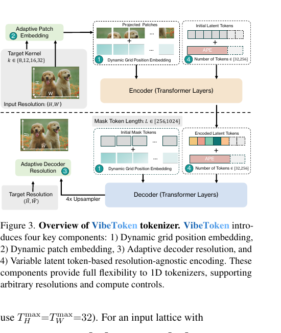
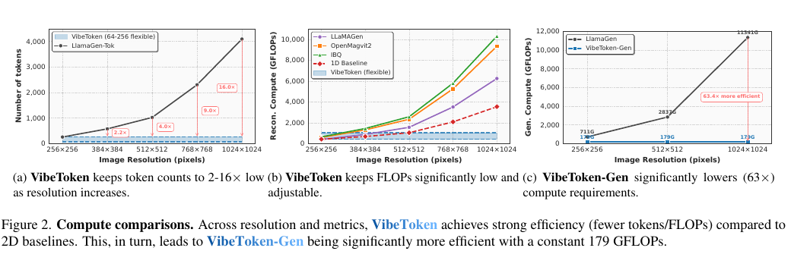

# AI Daily

## VibeToken：把解析度與 AR token budget 解耦的動態解析度視覺自回歸

> **一句話摘要：** VibeToken 的核心不是再設計一個更大的 Visual Autoregressive（VAR）模型，而是先把影像解析度從離散 token 數量中拆出去。它以 resolution-agnostic 的 1D Transformer tokenizer 將影像編碼成可控制的 32–256 個 token，再讓 VibeToken-Gen 用固定的 64-token AR 序列生成不同解析度與長寬比的影像；這使 1024×1024 生成的 AR 主幹計算量維持在約 179 GFLOPs，而不再隨 2D token grid 的面積急遽增長。[1] [2] [3]

## 論文基本資訊

| 欄位 | 內容 |
|---|---|
| 論文 | **VibeToken: Scaling 1D Image Tokenizers and Autoregressive Models for Dynamic Resolution Generations** |
| 作者 | Maitreya Patel、Jingtao Li、Weiming Zhuang、Yezhou Yang、Lingjuan Lv |
| 研究單位 | Sony AI、Arizona State University；Sony AI 官方頁另註明部分作者的共同機構與作者流動資訊。 |
| 發表狀態 | **CVPR 2026**；CVPR 官方頁列為正式 poster，並提供 paper、slides、poster 與 project page。arXiv 版本為 2026-04-27 提交的 v1。[3] [4] |
| 研究主題 | 1D image tokenization、autoregressive image generation、dynamic resolution、variable-length latent、native super-resolution |
| 主要模型 | VibeToken tokenizer；VibeToken-Gen class-conditioned AR generator |
| 論文來源 | [arXiv 摘要頁][1]、[arXiv HTML 全文][2]、[CVPR 2026 官方 poster][3]、[CVF OpenAccess 論文頁][4] |
| 程式碼與訓練文件 | [官方 GitHub repository][5]、[官方 TRAIN.md][6] |
| 本庫排重查核 | 以 arXiv ID `2604.24885`、完整標題與主要名稱比對現有 167 篇 AI Daily；未發現同一篇文章。repo 已有 VAR、VAR-Scaling、UniTok、VPG、SparVAR 等鄰近主題，但沒有 VibeToken 的 exact duplicate。[11] |

## 為什麼今天選 VibeToken

本次候選包含 training-free Flow Matching、低秩注意力、長程 3D memory、dynamic-resolution AR 與單步 DiT dense prediction 等工作。最後選擇 VibeToken，是因為它同時具備正式 CVPR venue、Sony AI 與 Arizona State University 的可信研究背景、可公開取得的 code/checkpoint，以及一個與使用者偏好的 **VAR／AR scaling** 直接相交但尚未在 repo 出現的問題設定。它不是另一篇僅修正 sampling 或 attention logit 的方法，而是把生成模型最上游的 tokenizer 重新設計，使 AR generator 的序列長度不再等同於影像的像素面積。[3] [5] [7]

這個選題也必須保留邊界。VibeToken **不是** Energy-Based Transformer、JEPA、training-free inference、zero-shot attention modulation 或 diffusion/flow-matching sampler。它需要訓練 tokenizer 與 AR generator，主要實驗是 ImageNet-1K 的 class-conditional generation。因此，本文值得閱讀的原因是它對 visual AR 的解析度擴展提出直接且可重現的工程—建模解法，而不是它已經覆蓋使用者偏好的所有方向。[2] [5] [6]

## 1. 問題：為什麼解析度會讓 visual AR 變得昂貴

令影像為 $v\in\mathbb{R}^{3\times H\times W}$，視覺 tokenizer 將它轉成離散 token 序列 $x_{1:T}$。標準 AR 模型依照鏈式法則分解機率：

$$
p(x_{1:T})=\prod_{t=1}^{T}p_{\theta}(x_t\mid x_{<t}).
$$

如果 token 數量會隨解析度變化，模型還需要用 EOS token 表示可變長度序列：

$$
p(x_{1:T},\langle\mathrm{eos}\rangle)=\prod_{t=1}^{T+1}p_{\theta}(x_t\mid x_{<t}),
\qquad x_{T+1}=\langle\mathrm{eos}\rangle.
$$

對典型 stride-$f$ 的 2D VQ tokenizer，token 數為

$$
T=\frac{H}{f}\cdot\frac{W}{f}.
$$

當 $f=16$ 時，256×256 影像有 $T=256$ 個 token；1024×1024 影像則有 $T=4096$ 個 token。訓練時每層 self-attention 的時間與記憶體是 $\mathcal{O}(T^2)$。推理時若使用 KV cache，每次新增 token 的邊際成本約為 $\mathcal{O}(T)$，總 attention 成本仍約為 $\mathcal{O}(T^2)$；沒有 cache 時更接近 $\mathcal{O}(T^3)$。因此，從 256 提升到 4096 個 token，不只是序列長度增加 16 倍，也會把 attention 的二次項放大約 256 倍。[2]

VibeToken 的問題定義是：**能否把影像輸入與輸出解析度交給 tokenizer 處理，而讓 AR generator 只看到一個短且可控的 latent sequence？** 如果答案是肯定的，generator 的計算量就主要由 latent length $L$ 與 Transformer depth 決定，而不是由 $H\times W$ 直接決定。[2] [7]

## 2. VibeToken tokenizer 的核心設計

VibeToken 從 1D tokenizer 的基本結構出發。固定 patch size $k$ 後，影像會被切成

$$
N=\frac{HW}{k^2}
$$

個 patch。將每個 patch 投影到 $d$ 維，再加上 $L$ 個 learned latent tokens，經 Transformer encoder 得到

$$
x^{\mathrm{enc}}=\mathcal{E}_{\theta}(x_0)\in\mathbb{R}^{(N+L)\times d},
\qquad h=x^{\mathrm{enc}}_{N+1:N+L}\in\mathbb{R}^{L\times d}.
$$

只有 $L$ 個 latent 會被量化為離散表示。給定 codebook $C=[c_1,\ldots,c_m]$，nearest-vector quantizer 可寫成

$$
z=Q(h)\in[m]^L.
$$

decoder 將量化後的 latent 與 masked output tokens 串接，再只在 masked pixel positions 進行重建。這個結構的重點是：空間 patch 數 $N$ 可以隨輸入解析度改變，但下游 AR 模型真正生成的時間序列長度是 $L$。[2]

*圖 1．VibeToken 的 encoder 與 decoder 共享四個設計接口。輸入解析度可以改變 patch lattice；latent token 數量可以在 32–256 之間控制；decoder 則以 target resolution 產生輸出。圖中保留論文原始標籤，未把完整論文頁面當作截圖。*

### 2.1 Dynamic grid positional embedding

不同解析度會產生不同數量的 patch，因此固定 grid 的 absolute positional embedding 很容易遇到外推問題。VibeToken 學習一個最大大小為 $32\times32$ 的 grid：

$$
G\in\mathbb{R}^{d\times T_H^{\max}\times T_W^{\max}},
\qquad T_H^{\max}=T_W^{\max}=32.
$$

對實際輸入 lattice，令

$$
T_H=\left\lceil\frac{H}{k_h}\right\rceil,
\qquad
T_W=\left\lceil\frac{W}{k_w}\right\rceil.
$$

模型以 differentiable resize 將 $G$ 轉成實際大小：

$$
\widehat{G}=\operatorname{resize}(G;T_H,T_W)
\in\mathbb{R}^{d\times T_H\times T_W},
$$

再 flatten 後加到 projected patches。這個設計保留 2D spatial inductive bias，卻不需要為每一個解析度重新學一組 positional table。論文的小型消融中，dynamic grid embedding 在相近品質下比 learnable axial RoPE 少約 33% FLOPs；這個數字屬於 tokenizer ablation，不應解讀成整個生成系統的 33% 加速。[2]

### 2.2 Adaptive patch embedding

固定 patch size 會在計算量與細節之間做一次性取捨。VibeToken 允許 $k\in\{8,12,16,32\}$，並從一個最大 kernel 透過 weight resizing 得到其他大小。令最大 patch kernel 為 $W_{k_{\max}}$，則

$$
W_k=W_{k_{\max}}R_{k\leftarrow k_{\max}},
\qquad
 e_{\mathrm{patch}}(p_k)=W_kp_k+b.
$$

這裡只有 $W_{k_{\max}}$ 與 $b$ 需要學習，其他 $W_k$ 在執行時由 resize operator 產生。相較為每一個 patch size 各自配置一組投影矩陣，這種做法讓不同 patch size 共享參數與特徵空間；但當 $k$ 太大且 channel capacity 不足時，細節仍可能流失，因此論文把 $k_{\max}$ 設為 32。[2]

### 2.3 Adaptive decoder resolution 與 dynamic length

decoder 不直接假設固定輸出 patch size，而是先以固定的 4× intermediate resolution 解碼，再接一個可調整的 2D CNN downscaler，得到目標 $(\widehat H,\widehat W)$。因此，輸入解析度與輸出解析度可以不同，模型也自然支援 native super-resolution。[2]

訓練期間，encoder 與 decoder 同時使用均勻抽樣的 latent length $L\in[32,256]$。模型不把較短序列 padding 到最大長度，也不只在訓練完成後丟掉尾端 token；它直接讓 encoder 產生目標長度 $L$，decoder 也只消費這 $L$ 個 latent。這是 VibeToken 可以在推理時以 token 數換取重建品質與計算量的關鍵。[2] [6]

## 3. VibeToken-Gen：讓 AR generator 感知目標解析度

VibeToken-Gen 是接近 LlamaGen-style 的 class-conditioned AR generator。它沒有重新發明整個 AR backbone，而是把 tokenizer 換成 VibeToken-MVQ，並加入目標解析度與長寬比條件。給定 class label $y$ 與目標尺寸 $(H,W)$，條件向量寫成

$$
c=\operatorname{emb}(y)+\operatorname{MLP}\left(\frac{(H,W)}{\beta}\right),
\qquad \beta=1536.
$$

這個條件是必要的，因為單靠解析度無關的 latent token 仍可能把正方形影像拉伸到垂直或水平構圖。解析度條件讓 generator 知道要生成什麼形狀，而 tokenizer decoder 負責把短 latent sequence 轉成指定尺寸。[2]

模型每個時間 token 需要預測 8 個 MVQ sub-codes。VibeToken-Gen 以輕量 residual Transformer head 處理這 8 個 codebooks，同時採用 Query–Key LayerNorm 穩定訓練。論文指出 AR 訓練使用 fp32，因為 bfloat16 在其設定下不穩定；這是品質與硬體效率解讀時不能略過的實作細節。[2] [5]

VibeToken-Gen 最終選擇 $L=64$ 作為生成設定。這一點與 tokenizer 重建的最佳 token length 不同：重建常在 128–256 tokens 仍有增益，但 ImageNet class-conditional generation 在消融中 64 tokens 已經最好。後續 token 主要補充高頻細節，對 reconstruction 的幫助比對 class-conditional synthesis 更明顯。[2]

## 4. 計算複雜度與效率解讀

*圖 2．解析度提升時，VibeToken 將 tokenizer token count 與 generator 計算量維持在可控範圍。論文圖中標出的 179G 是 VibeToken-Gen 在固定 latent length 下的每次 forward-step generator FLOPs，不是把整張圖的所有 decoding steps 只算成 179G。*

論文 Figure 2 的核心對照是：2D tokenizer 的 token 數與 FLOPs 隨像素面積上升，而 VibeToken 將 token 數限制在 32–256。以 1024×1024 為例，傳統 2D 路徑可能需要數千個 token；VibeToken 可用 64–256 個 token，等效壓縮比例約為 64×–128×。tokenizer 本身的最高 FLOPs 約為 1.04T，並且在不同解析度下近似維持固定；generator 則以 64-token VibeToken-Gen-XXL 每次 forward step 約 179G FLOPs。[2]

這裡最容易被誤讀的是「constant 179G」。AR 仍然需要逐 token 解碼，所以總生成成本仍受到 64 個 decoding steps、每層 Transformer、KV cache、sampling 與 VAE decode 的影響。更準確的說法是：**VibeToken 把解析度依賴從 AR 主幹的序列長度中移除，但沒有讓 AR 變成單次 forward 就完成整張影像。**[2]

在 1024×1024 端到端計時中，論文正文 Table K 報告 VibeToken-Gen-XXL 約 0.46 秒／張，NiT diffusion baseline 約 1.08 秒／張；LlamaGen／XXL 的理論計時約 32.79 秒／張。這些 latency 排除了部分前後處理差異，且不同模型的 kernel、硬體與 decoder 路徑不必然完全一致，因此應視為論文設定下的效率比較，而不是跨硬體的能源或成本證明。[2] [5]

## 5. 實驗結果

### 5.1 Tokenizer reconstruction

VibeToken-SL 與 VibeToken-LL 都在 ImageNet-1K 上訓練，混合 256×256 到 512×512 的影像與多種長寬比。主設定使用 8×H100、600k iterations、batch size 64、peak learning rate $10^{-4}$、cosine decay，並以 8 個 codebooks、每個 codebook 4096 entries 的 MVQ 組成 effective vocabulary 32768。[2] [6]

| 模型 | 256² rFID↓ | 512² rFID↓ | 1024² rFID↓ | Arbitrary-resolution stress rFID↓ |
|---|---:|---:|---:|---:|
| VibeToken-SL | 0.43 | 0.55 | 2.45 | 4.21 |
| VibeToken-LL | **0.40** | **0.51** | **2.40** | **3.60** |

VibeToken-LL 在 256² 與 512² 的 reconstruction 品質與 1D/2D tokenizer 具有競爭力，並在 1024² 與非正方形 stress test 維持可用品質。相較於 UniTok 在 256² 的 0.33 rFID，VibeToken-LL 並非每一個固定解析度都取得最低 rFID；它交換的是 **arbitrary resolution、arbitrary aspect ratio 與動態 token length**。這個 trade-off 比宣稱全面 SOTA 更準確。[2]

在 native super-resolution 實驗中，VibeToken-LL 將 256² 上採樣到 1024² 的 4× SR 報告 PSNR 24.11、SSIM 0.805、LPIPS 0.310；512² 到 1024² 的 2× SR 報告 PSNR 24.98、SSIM 0.838、LPIPS 0.261。SDXL upscaler 在 4× 設定的 PSNR 為 29.10、SSIM 0.721、LPIPS 0.361。這表示 VibeToken 在該資料與 protocol 下的結構與感知指標具有優勢，但不是所有 pixelwise 指標都更高；它也不需要另訓一個 high-resolution upsampler。[2]

### 5.2 AR generation

VibeToken-Gen 在 ImageNet-1K 上進行 class-conditional generation，使用 64、128、256 token 設定的混合解析度訓練。VibeToken-Gen-XXL 約 1.5B 參數，VibeToken-Gen-B 約 87M 參數。論文 Table 3 的主要結果如下；gFID 越低越好。[2]

| 模型 | 256² gFID | 512² gFID | 1024² gFID | 多長寬比平均 gFID（高解析度） |
|---|---:|---:|---:|---:|
| VibeToken-Gen-B | 7.62 | 7.62 | 7.36 | 8.99 |
| VibeToken-Gen-XXL | **3.62** | **3.69** | **3.54** | **5.53** |
| NiT-XL | 2.27 | 1.80 | 5.87 | 6.05 |
| EDM2-L | 70.19 | 1.92 | 64.32 | 23.23 |

表中 1024² 的比較應小心讀。VibeToken-Gen-XXL 在正文 Table 3/5 的 1024² gFID 是 **3.54**，而摘要、CVPR 官方 poster、CVF OpenAccess 頁面與 GitHub README 使用 **3.94**。目前公開來源沒有清楚解釋 3.94 與 3.54 是版本、checkpoint、CFG 或 evaluation protocol 的差異，因此本報告並列兩者，並把正文表格的 3.54 視為「paper-body number」，把 3.94 視為「官方摘要與展示頁 number」，不把它們拼成單一無矛盾結果。[1] [3] [4] [5]

### 5.3 消融：短序列對生成比對重建更重要

在 GPT-B、ImageNet 256²、100 epochs、batch size 256 的消融中，64/128/256 tokens 的 with-CFG gFID 分別為 8.42、9.02、9.81。相反地，tokenizer reconstruction 在增加到 128 或 256 tokens 時通常仍會改善。這說明「保存更多高頻細節」與「讓 class-conditioned AR 容易學習」不是同一個最佳化目標。[2]

同一個消融也比較了 generalist 與 fixed-resolution training。VibeToken-Gen-B 在 64 tokens、非 generalist 設定為 8.42 gFID，改成 resolution-generalist training 後為 9.37；但 generalist 模型換來了跨解析度能力。與固定解析度 LlamaGen 的 576 tokens、7.15 gFID 比較時，VibeToken-Gen 不是在單一 256² benchmark 取得絕對最佳品質，而是以 64 tokens 提供更大的解析度覆蓋範圍。[2]

## 6. 與相關研究的關係

### TiTok：從固定 1D 壓縮到解析度無關的動態 tokenizer

TiTok 的核心洞見是把 2D image grid 改成 compact 1D latent sequence；它展示 256×256 影像可以用 32 tokens 表示，並在 512×512 取得相對 diffusion 的競爭品質。[10] VibeToken 延續這條路線，但把問題從「1D token 是否更短」推進到「同一個 1D tokenizer 是否能在不同輸入解析度、輸出解析度、aspect ratio 與 latent length 之間泛化」。因此，VibeToken 新增 dynamic grid、adaptive patch、adaptive decoder 與 joint resolution/length training，而不是只把 TiTok 的固定 token count 做得更小。[2] [10]

### FlexTok：可變 token length 與 VibeToken 的差異

FlexTok 也將影像 resample 成 variable-length、ordered 1D token sequence，並以 nested dropout 與 rectified-flow decoder 讓 1–256 tokens 都能重建；Apple 官方頁還報告其在 8–128 tokens 的 ImageNet generation 具有低於 2 的 FID。[8] VibeToken 與 FlexTok 的共同點是把 token count 變成可控軸；差異在於 VibeToken 將 **輸入／輸出解析度泛化** 當成第一級設計目標，使用 dynamic patch 與 adaptive decoder，並把 tokenizer 直接接到一個 resolution-conditioned AR generator。這使 VibeToken 更貼近「動態解析度 visual AR」的生產計算問題，而 FlexTok 更強調 token sequence 的可變長度與 coarse-to-fine vocabulary。[2] [8]

### LlamaGen：VibeToken 改的是 tokenizer–generator interface

LlamaGen 證明 vanilla next-token prediction 可以在 visual generation 中達到有競爭力的結果，並提供多個 downsample ratio、不同規模的 AR generator 與 ImageNet checkpoint。[9] VibeToken-Gen 保留 LlamaGen-style AR stack 的基本思想，但用 VibeToken 的短 latent sequence 取代會隨解析度增加的 2D token grid，並加入 $(H,W)$ 條件。換句話說，VibeToken 的主要貢獻不是提出另一個與 LlamaGen 完全不同的 causal decoder，而是改造 **tokenizer → discrete sequence → AR generator** 的接口，使 generator 的時間長度與輸出畫布大小解耦。[2] [5] [9]

### 與 VAR、training-free 與 attention modulation 的邊界

VibeToken-Gen 的 generator 是 LlamaGen-style sequence AR，不是以 next-scale factorization 為核心的 Visual Autoregressive Model。它沒有提出 scale-wise latent hierarchy，也沒有在 frozen VAR 上做 test-time correction。因此，它與 repo 已有的 VAR、VAR-Scaling、SparVAR、VPG、training-free attention modulation 等文章是研究鄰近而非重複；VibeToken 的新增角度是 **resolution-agnostic tokenizer 與 AR scaling**。[2] [11]

VibeToken 也不是 training-free 或 zero-shot 方法。tokenizer 使用 ImageNet-1K 訓練，generator 也需要在多解析度與多長寬比上訓練；1024² 是從最高 512² 訓練範圍外推的 resolution generalization，而不是沒有訓練的模型直接適配任何資料域。這個區分很重要：**resolution-agnostic 不等於 zero-shot；native super-resolution 不等於不需要 task training。**[2] [5] [6]

## 7. 對使用者偏好方向的研究啟發

以下構想是基於 VibeToken 的介面提出的後續研究問題，**不是 VibeToken 論文已驗證的方法**。

### 7.1 Energy-based token budget controller

VibeToken 目前讓使用者手動選 $L\in\{32,64,128,256\}$。可以為每個 latent 或每個 decoder block 定義一個 compatibility energy：

$$
E(L)=\alpha\,\mathcal{L}_{\mathrm{rec}}(L)
+\beta\,\mathcal{L}_{\mathrm{sem}}(L)
+\gamma\,\mathrm{Cost}(L),
$$

其中 $\mathcal{L}_{\mathrm{rec}}$ 衡量重建誤差，$\mathcal{L}_{\mathrm{sem}}$ 可衡量 frozen vision encoder 的語義一致性，$\mathrm{Cost}(L)$ 則代表 AR decoding 與 VAE decode 成本。推理時可以選擇滿足 $E(L+\Delta L)-E(L)<\tau$ 的最小 token budget，讓簡單影像使用 32 或 64 tokens，細節密集影像才增加到 128 或 256。這會把 VibeToken 的 manual compute knob 轉成樣本依賴的 energy-based allocation。

### 7.2 JEPA-style resolution consistency

VibeToken 的 dynamic grid 主要處理位置與形狀泛化，並沒有預測式表徵學習。可以引入一個 frozen 或 jointly trained JEPA target encoder，對同一張影像的不同 $(H,W,L)$ view 產生 target representation $s^+$，再讓 VibeToken latent predictor 估計

$$
\widehat{s}^{+}=g_{\theta}(z_{L},H,W),
\qquad
\mathcal{L}_{\mathrm{JEPA}}=d\!\left(\widehat{s}^{+},\operatorname{sg}(s^{+})\right).
$$

這個方向可以檢驗：若 latent 數量變少，JEPA predictive consistency 是否比 pixel reconstruction 更能預測 class-conditional generation 的 gFID；也可以用 predictive disagreement 決定何時從 64 tokens 增加到 128 tokens。這會把「reconstruction 最佳 L」與「generation 最佳 L」的差距變成可量化的 representation question。

### 7.3 Training-free 與 attention modulation 的推理介面

一個較保守的 inference-only 方向，是凍結 VibeToken 與 VibeToken-Gen，只在 generation 時根據 target aspect ratio、token entropy 或 accumulated AR uncertainty 調整 latent sampling、dynamic grid gain 或特定 attention head 的 gate。這不是論文已提出的功能，也不應直接稱為 zero-shot；必須設計嚴格 protocol，比較同一 checkpoint 在不再訓練的情況下，是否能以 attention modulation 降低 extreme aspect-ratio artifacts，同時維持 gFID 與 latency。

這個方向的價值在於它把 repo 既有的 training-free attention modulation 研究，接到 VibeToken 的 resolution-conditioned latent space；但若 modulation 依賴在新資料上重新學參數，就不再是純 training-free。實驗報告必須把 frozen-backbone inference、per-image optimization 與額外 adapter training 分開。[11]

## 8. 限制、可重現性與證據界線

第一，主要生成實驗是 ImageNet-1K class-conditional generation。論文自己把 text-to-image、open-vocabulary 與 video 列為未來工作，因此不能把結果外推成通用文字到圖像 foundation model。[2] [5]

第二，模型在 256²–512² 的混合設定上訓練，卻在 1024² 進行測試。這正是它要展示的 resolution generalization，但也代表 1024² 的品質與 artifact 不能被解讀成「已在高解析度充分訓練」。論文指出 randomized cropping 可能造成部分 crop 或 truncation artifacts；generalist model 在固定 256²/512² 上也可能落後 specialist。[2]

第三，公開資料存在版本或 protocol 差異。摘要、CVPR poster、CVF page 與 README 的 1024² gFID 為 3.94；正文 Table 3/5 與 GitHub checkpoint 表為 3.54。TRAIN.md 的示例設定使用 400k max steps，但論文文字提到最多 650k；README 的 checkpoint 表也混合 3.76、4.12 等不同 tokenizer token-length evaluation。這些差異不一定代表方法錯誤，但重現時需要固定 checkpoint、token length、CFG、resolution 與評估程式，不能只複製摘要數字。[2] [5] [6]

第四，論文沒有提供 GPU-hours、完整 training wall-clock、電費、碳排或每張影像的能源消耗。179 GFLOPs 是 generator 每次 forward-step 的計算量，0.46 秒是特定推理設定下的端到端數字；兩者都不足以直接支持 energy efficiency claim。尤其 AR 仍有多步 token decoding、VAE decode、memory bandwidth 與 kernel overhead，實際功耗必須另測。[2] [5]

## 9. 個人評價與研究意義

我認為 VibeToken 最有價值的地方，是它把 visual AR 的瓶頸定位在 **tokenizer 的解析度耦合**，而不是只在 generator 上堆更多參數。這個定位使方法的四個部件彼此有明確因果關係：dynamic grid 保留 spatial bias，adaptive patch 改善輸入 lattice 的彈性，adaptive decoder 處理輸出畫布，dynamic-length training 則讓 $L$ 成為真正可控的計算旋鈕。VibeToken-Gen 再以 resolution condition 修正生成器對畫布形狀的認知，形成一條完整的 tokenizer–generator interface。[2] [7]

它的第二個價值是把「品質」與「計算」拆成兩個不同的 token-budget 問題。128–256 tokens 可能比較適合 reconstruction，64 tokens 卻對 class-conditional generation 更有效；這暗示 AR latent 不必保存所有 pixel-level detail，因為 generator 的任務可能只需要一個較短、較容易建模的 semantic-discrete interface。這個觀察值得與 GEAR 類的 tokenizer–generator 分工、JEPA predictive representation，以及 Energy-based token allocation 共同研究，但不能把 VibeToken 自己描述成其中任何一種方法。[2] [11]

它的限制也很清楚：正式 CVPR venue 與公開 code 增加了可信度，但實驗仍集中在 ImageNet class-conditional、沒有直接 text-to-image/zero-shot 證據，且公開摘要與正文的 1024² gFID 存在未解釋差異。因此，我會把 VibeToken 評為一篇**高研究啟發、方法接口清晰、但需要嚴格重現 protocol 的 visual AR scaling 論文**。對使用者目前偏好的方向而言，最值得延伸的問題不是再宣稱它是 training-free 或 energy-based，而是研究：能否由 energy 或 JEPA predictive disagreement 自動決定 latent length，並以 inference-time attention modulation 修正 extreme aspect-ratio 的失真。[2] [5] [6]

## References

[1]: https://arxiv.org/abs/2604.24885 "VibeToken arXiv abstract and metadata"
[2]: https://arxiv.org/html/2604.24885 "VibeToken full paper in arXiv HTML"
[3]: https://cvpr.thecvf.com/virtual/2026/poster/37635 "CVPR 2026 official VibeToken poster page"
[4]: https://openaccess.thecvf.com/content/CVPR2026/html/Patel_VibeToken_Scaling_1D_Image_Tokenizers_and_Autoregressive_Models_for_Dynamic_CVPR_2026_paper.html "CVF OpenAccess VibeToken paper page"
[5]: https://github.com/SonyResearch/VibeToken "SonyResearch VibeToken official repository"
[6]: https://raw.githubusercontent.com/SonyResearch/VibeToken/main/TRAIN.md "VibeToken official training instructions"
[7]: https://ai.sony/blog/cvpr-2026-sony-ais-latest-in-computer-vision-research "Sony AI CVPR 2026 research overview"
[8]: https://machinelearning.apple.com/research/flex-tok-resampling "Apple Machine Learning FlexTok research page"
[9]: https://github.com/FoundationVision/LlamaGen "FoundationVision LlamaGen official repository"
[10]: https://yucornetto.github.io/projects/titok.html "TiTok official project page"
[11]: https://github.com/KaiCobra/AI_Daily "KaiCobra AI_Daily repository and existing article index"
