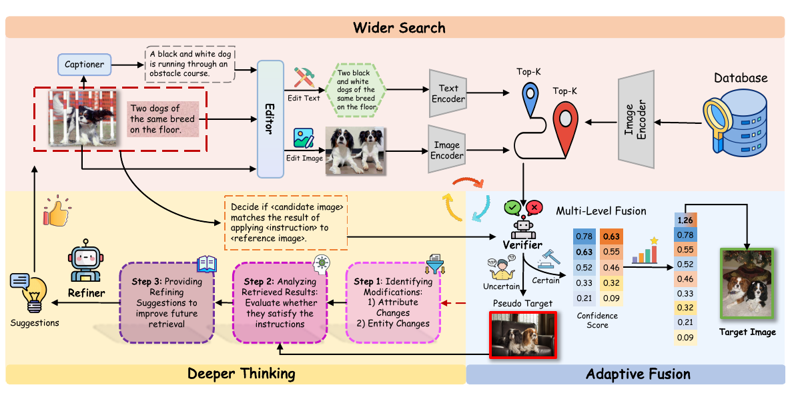
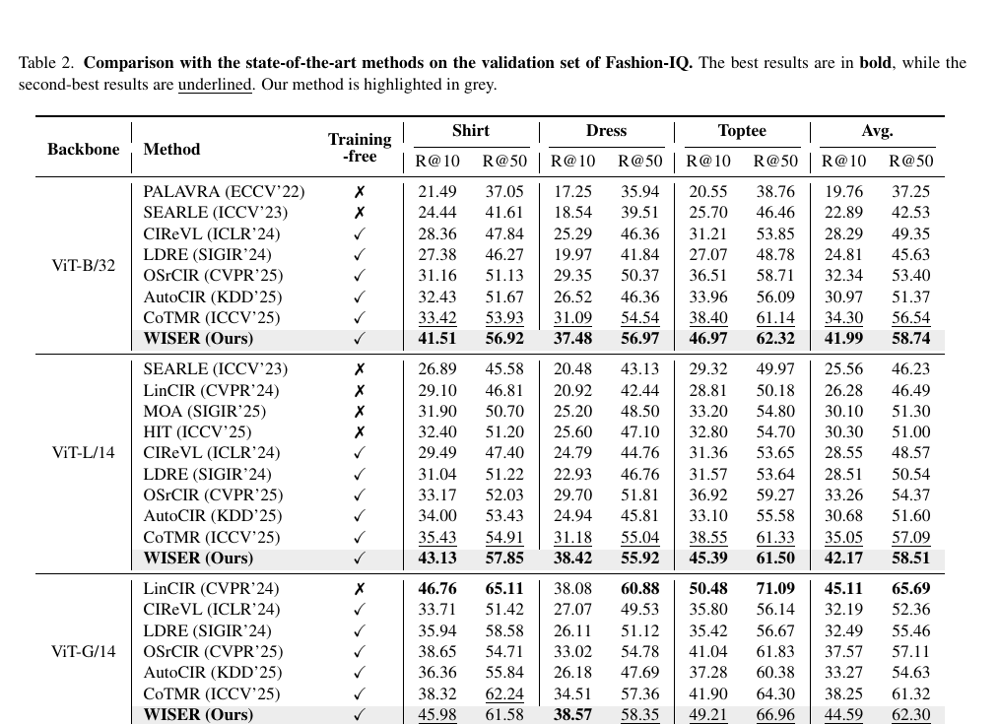
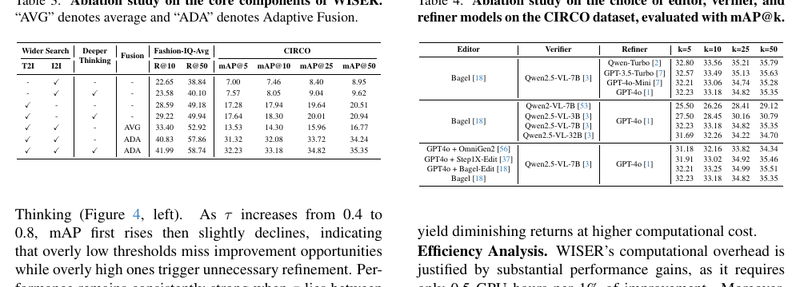

# AI Daily — WISER：把零樣本圖像檢索改寫成「搜尋、驗證、反思」閉環

## 2026-09-17｜WISER: Wider Search, Deeper Thinking, and Adaptive Fusion for Training-Free Zero-Shot Composed Image Retrieval

> **今日一句話**：WISER 沒有替 Zero-Shot Composed Image Retrieval（ZS-CIR）再訓練一個融合器，而是同時啟動文字到圖像（T2I）與圖像到圖像（I2I）兩條互補路徑，再用 VLM verifier 的信心分數判斷「該融合，還是該重新思考」；這使 training-free 不再只是一次性的 prompt engineering，而成為一個可校準、可反思的 inference-time decision loop。[1] [2]

## 1. 論文基本資訊

| 欄位 | 內容 |
|---|---|
| 論文標題 | *WISER: Wider Search, Deeper Thinking, and Adaptive Fusion for Training-Free Zero-Shot Composed Image Retrieval* |
| 作者 | Tianyue Wang、Leigang Qu、Tianyu Yang、Xiangzhao Hao、Yifan Xu、Haiyun Guo、Jinqiao Wang |
| 研究單位 | 中國科學院自動化研究所 Foundation Model Research Center；中國科學院大學；National University of Singapore；中央民族大學；武漢人工智慧研究院；廣東省智慧財產權與大數據重點實驗室等 |
| 發表狀態 | **CVPR 2026**；論文與作者資訊可由 CVF Open Access 版本核對。[1] |
| arXiv | [2602.23029](https://arxiv.org/abs/2602.23029) |
| 程式碼 | [Physicsmile/WISER](https://github.com/Physicsmile/WISER)；作者在專案頁標示論文已獲 CVPR 2026 接收，並提供資料與執行說明。[3] |
| 任務 | Training-free Zero-Shot Composed Image Retrieval（ZS-CIR） |
| 評估資料集 | CIRCO、CIRR、Fashion-IQ |
| 本庫去重 | `KaiCobra/AI_Daily` 中未找到 WISER 標題或 arXiv `2602.23029` 對應正文；因此本篇不是既有 EBT、JEPA 或 VAR 文章的重複整理。 |

WISER 不是一篇新的圖像生成 backbone，也不是直接追求 FID 的 text-to-image 模型。它研究的是更容易被忽略、但很接近實際產品的問題：使用者給一張參考圖片，再給一句修改指令，例如「保留這件衣服，但把領子改成連帽」，系統應該從大型圖片庫中找出最符合這個組合條件的目標圖片。這項任務同時要求保留視覺細節與理解語義變更，因此單一路徑通常會在其中一邊失分。[1]

## 2. 為什麼值得讀：問題不只是「多加一個模型」

ZS-CIR 的困難在於，參考圖像與修改文字對目標圖片的約束並不對稱。T2I 路徑把參考圖像先描述成文字，再讓文字模型產生目標描述，因此擅長抽象的語義修改，卻可能遺失品種、紋理、姿勢或局部外觀。I2I 路徑直接編輯參考圖像，因此比較能保留視覺細節，但遇到「新增物體」「改變多個關係」或含糊的組合指令時，圖像編輯器未必能正確完成語義變更。[1]

WISER 的核心觀點是：**T2I 與 I2I 不應在系統前端被固定加權平均，而應被視為兩個有不同失敗模式的搜尋專家。** 因此模型需要先擴大搜尋空間，再估計每個候選的可信度。若某一路徑不確定，系統不應勉強融合低品質候選，而是分析錯失了哪個修改，重新產生更精確的文字或圖像查詢。[1]

*圖 1。由論文 Figure 2 裁切而來。上方是雙路徑搜尋，中間是 VLM 驗證與多層融合，下方是對不確定結果進行結構化反思與重試。[1]*

## 3. 方法：從雙路徑搜尋到反思式重排

### 3.1 問題定義

給定參考圖像 $I_{\mathrm{ref}}$、修改文字 $T_{\mathrm{mod}}$ 與候選資料庫 $\mathcal{D}$，ZS-CIR 要找出最符合「對 $I_{\mathrm{ref}}$ 執行 $T_{\mathrm{mod}}$」結果的圖片。WISER 使用一個可替換的 editor $\mathcal{F}$ 產生文字查詢與圖像查詢，然後以 CLIP 類模型計算候選相似度。[1]

### 3.2 Wider Search：平行啟動 T2I 與 I2I

第一條路徑先以 captioner 將參考圖片轉成描述 $C_{\mathrm{ref}}$，再由 textual editor 將描述與修改文字合併：

$$
C_{\mathrm{edit}} = \mathcal{F}_{\mathrm{txt}}(C_{\mathrm{ref}}, T_{\mathrm{mod}}).
$$

這條 T2I 路徑的優勢是可以把複雜修改重寫成比較完整的目標描述。第二條路徑直接以 image editor 修改參考圖片：

$$
I_{\mathrm{edit}} = \mathcal{F}_{\mathrm{img}}(I_{\mathrm{ref}}, T_{\mathrm{mod}}).
$$

這條 I2I 路徑保留了參考圖像中的紋理、風格與局部外觀。接著，WISER 分別用文字 encoder 與圖像 encoder 在資料庫中取出各自的 top-$K$ 候選：

$$
\mathcal{R}_p = \{I_p^1, I_p^2, \ldots, I_p^K\}, \quad p\in\{\mathrm{T2I},\mathrm{I2I}\}.
$$

兩路候選先取聯集：

$$
\mathcal{R}_{\mathrm{union}} = \mathcal{R}_{\mathrm{T2I}} \cup \mathcal{R}_{\mathrm{I2I}}.
$$

論文實驗中 $K=50$。因此這一步的目的不是立即決定答案，而是讓語義型候選與視覺型候選共同進入下一階段。[1]

### 3.3 Adaptive Fusion：讓 verifier 決定「哪條路比較可靠」

對每個候選 $I_p^k$，WISER 建立三元組 $(I_{\mathrm{ref}},T_{\mathrm{mod}},I_p^k)$，交給 VLM verifier 回答：「候選圖像是否符合把這條指令套用到參考圖像後的結果？」令 verifier 對 `yes` 與 `no` 的 logits 分別為 $\ell_{p,k}^{(\mathrm{yes})}$ 與 $\ell_{p,k}^{(\mathrm{no})}$，則候選信心定義為二分類 softmax：

$$
 c_p^k =
 \frac{\exp(\ell_{p,k}^{(\mathrm{yes})})}
 {\exp(\ell_{p,k}^{(\mathrm{yes})})+\exp(\ell_{p,k}^{(\mathrm{no})})}.
$$

這個分數不是 CLIP 相似度的另一種寫法。它嘗試直接測量「候選是否完成修改意圖」，因此在語義變更與視覺保留之間增加了一個任務層級的判斷介面。[1]

WISER 在 branch level 先找每條路徑最可靠的 pseudo-target：

$$
 I_p^* = \arg\max_k c_p^k, \qquad r_p = \max_k c_p^k.
$$

若

$$
\min(r_{\mathrm{T2I}},r_{\mathrm{I2I}})<\tau,
$$

就將不可靠的路徑交給 Deeper Thinking，而不是直接參與融合。實驗預設 $\tau=0.7$。對於兩條路徑都足夠可靠的查詢，WISER 在 candidate level 加總兩路證據：

$$
 c_{\mathrm{fused}}^k = c_{\mathrm{T2I}}^k+c_{\mathrm{I2I}}^k.
$$

最後以字典序排序

$$
\Psi(I^k)=\left(-c_{\mathrm{fused}}^k,
-\max(c_{\mathrm{T2I}}^k,c_{\mathrm{I2I}}^k),
-c_{\mathrm{T2I}}^k\right),
$$

先看總信心，再以單一路徑最高信心與 T2I 信心打破平手。這個設計的直覺是：若修改偏語義，T2I 可能較強；若修改重視外觀細節，I2I 可能較強；若候選同時得到兩路支持，則融合分數會提高。[1]

### 3.4 Deeper Thinking：對失敗原因做結構化反思

若某一路徑的 $r_p$ 低於門檻，WISER 使用 LLM-based refiner 執行三步分析。第一步把指令拆成 **attribute changes** 與 **entity additions/deletions**。第二步取得 pseudo-target 的 caption，逐項檢查它是否真的滿足這些修改。第三步只針對未滿足的項目提出修正建議：T2I 得到更精確的文字補充，I2I 得到更具體的視覺編輯指引。這些建議會與原始修改文字重新串接，再送回 editor 產生下一輪 $C_{\mathrm{edit}}$ 或 $I_{\mathrm{edit}}$。[1]

論文預設 refinement 一輪。這使 WISER 的 inference graph 不是固定深度，而是由 verifier 信心決定是否增加計算。換句話說，它把「test-time reasoning」具體化為一個可觸發的搜尋控制器，而不是籠統地宣稱模型會思考。

### 3.5 實際組件與 training-free 的正確解讀

作者的實作使用 BAGEL 作為 editor、Qwen2.5-VL-7B 作為 verifier、GPT-4o 作為 refiner、BLIP-2 作為 captioner，並以 OpenCLIP 的 ViT-B/32、ViT-L/14 與 ViT-G/14 作為檢索 backbone；實驗在單張 NVIDIA H20 上執行。[1] [3]

因此，本文的 **training-free** 是指不使用 ZS-CIR 的人工 annotated triplets 進行任務特定訓練，不是指沒有預訓練模型、沒有外部推理成本或不需要 GPU。一次查詢可能包含兩個編輯器分支、最多 $2K$ 候選的 verifier 判斷，以及低信心時額外的 refiner 與再檢索。作者報告 WISER 約需每取得 1% 改善消耗 0.5 GPU-hours，這是作者的效率分析，應與任務特定訓練成本分開理解。[1]

## 4. 實驗結果：增益主要來自決策策略，而不是單一更大的模型

WISER 在 CIRCO、CIRR 與 Fashion-IQ 上評估。CIRCO 有 123,403 張資料庫圖片與 800 個測試查詢，因為每個查詢可以有多個正確答案，所以使用 mAP@K。CIRR 報告 Recall@K 與 subset recall。Fashion-IQ 則以 Dress、Shirt、Toptee 三個類別測量 R@10 與 R@50。[1]

### 4.1 主要 benchmark 數字

| 資料集與設定 | WISER | 對照 | 觀察 |
|---|---:|---:|---|
| CIRCO, ViT-B/32, mAP@5 | **32.23** | CoTMR 22.23 | 相對提升約 **44.98%** |
| CIRR, ViT-B/32, Recall@1 | **49.45** | CoTMR 31.50 | 相對提升約 **56.98%** |
| CIRR, ViT-G/14, Recall@1 | **49.54** | CoTMR 36.36 | 更大 backbone 仍保有明顯優勢 |
| Fashion-IQ, ViT-B/32, 平均 R@10 / R@50 | **41.99 / 58.74** | CoTMR 34.30 / 56.54 | 三類別平均均提升 |
| Fashion-IQ, ViT-L/14, 平均 R@10 / R@50 | **42.17 / 58.51** | CoTMR 35.05 / 57.09 | training-free 且高於多數 training-free baseline |
| Fashion-IQ, ViT-G/14, 平均 R@10 / R@50 | **44.59 / 62.30** | CoTMR 38.25 / 61.32 | 大 backbone 下仍具泛化性 |

表中最重要的不是單一最高數字，而是 WISER 在多個 CLIP backbone、不同資料集與不同修改類型上都維持增益。CIRCO 的多目標特性考驗候選池擴大與排序；CIRR 的自然場景與模糊修改考驗 verifier；Fashion-IQ 的細粒度服裝屬性則考驗 I2I 對視覺細節的保留。[1]

*圖 2。論文 Table 2 的裁切版本。WISER 在 ViT-B/32、ViT-L/14 與 ViT-G/14 的三個服裝類別上均列出有競爭力的 R@10 與 R@50 結果。[1]*

### 4.2 消融：固定融合可能比單一路徑更差

論文的核心消融揭示一個值得注意的結果：單獨使用 T2I 或 I2I 都有限；直接以固定權重平均兩路分數，甚至可能降低 CIRCO 的結果。以 ViT-B/32 為例，Fashion-IQ 平均 R@10/R@50 從 T2I-only 的 28.59/49.18，提升到固定 AVG 的 33.40/52.92；但 CIRCO mAP@5 卻從 17.28 降到 13.53。換成 Adaptive Fusion 後，Fashion-IQ 達到 40.83/57.86，CIRCO mAP@5 達到 31.32；再加入 Deeper Thinking，完整系統達到 41.99/58.74 與 32.23。[1]

這個對照支持了 WISER 的真正論點：**兩個分支的價值不是「平均後變大」，而是要先知道每個候選為什麼可信，再決定如何整合。** 另一個消融顯示 Deeper Thinking 在第一輪通常帶來主要增益，後續輪次收益變小；因此作者使用一輪 refinement 作為效率與品質的折衷。[1]

*圖 3。論文 Table 3 的裁切版本，顯示 T2I、I2I、固定 AVG、Adaptive Fusion 與 Deeper Thinking 的逐步差異。[1]*

### 4.3 超參數與模組可替換性

信心門檻 $\tau$ 在 0.4 到 0.8 間變化時，mAP 先上升後略降；論文指出 0.5–0.7 通常是穩健區間。門檻太低會錯過需要修正的結果，太高則會觸發太多額外 refinement。作者也比較不同 editor、verifier 與 refiner，觀察到 refiner 對具體 LLM 的敏感度相對低，verifier 隨模型規模增加通常改善，但 32B 版本可能因 overthinking 略有退化。[1]

這種 plug-and-play 性質對研究很重要。WISER 並沒有把整個系統綁死在某個單一生成器上，而是把 editor、verifier、refiner 與 retrieval backbone 分成可替換模組。不過，模組可替換也代表不同模型的校準、提示格式與成本可能改變結果，不能直接把一個組件的數字外推到所有組合。

## 5. 相關研究脈絡

| 研究 | 主要想法 | 與 WISER 的差異 |
|---|---|---|
| **CIReVL，ICLR 2024** | 用 captioner 描述參考圖，再由 LLM 產生目標 caption，最後以 CLIP 做文字檢索；完全依靠現成模型，具有人可讀的中間狀態。[5] | WISER 保留這條 T2I 思路，但新增 I2I 路徑、候選級 verifier 與不確定時的 refinement。 |
| **IP-CIR，CVPR 2025** | 用 LLM 推理布局，再以可控制圖像生成器產生 imagined retrieval proxy，補足文字描述遺失的屬性與空間資訊。[7] | IP-CIR 主要提供一張想像代理圖；WISER 把文字代理與圖像代理並行檢索，並以 verifier 動態排序。 |
| **CoTMR，ICCV 2025** | 以 LVLM 做統一理解，使用 CIRCoT 與 image-scale/object-scale multi-scale reasoning，再用多粒度分數做檢索。[6] | WISER 採用更模組化的 editor–verifier–refiner 閉環；CoTMR 強調單一 LVLM 的多尺度推理，WISER 強調分支互補與不確定性決策。 |
| **傳統 supervised CIR** | 以 annotated image–text–target triplets 訓練任務模型。 | WISER 不使用這類任務特定 triplet，但仍依賴大型預訓練 VLM、LLM 與圖像編輯器。 |

從研究演化看，ZS-CIR 正從「把多模態查詢翻成一句文字」逐步走向「生成代理、檢查候選、修正查詢」。CIReVL 解決了文字中介的可讀性與 training-free 問題；IP-CIR 把生成模型引入圖像側；CoTMR 把 reasoning 拆成全局與物件尺度；WISER 則把多路結果的衝突顯式化，新增 branch-level uncertainty 與 candidate-level intent fusion。[5] [6] [7]

## 6. 與你關注方向的連接：可延伸的研究問題

### 6.1 Energy-Based Transformer：把 verifier 分數變成可校準的 compatibility energy

WISER 的 $c_p^k$ 是由 `yes/no` logits 轉出的信心，但它仍然是一個外部 verifier 的局部判斷。可以把它改寫為候選相容性能量：

$$
E_\theta(I_{\mathrm{ref}},T_{\mathrm{mod}},I_k)
= -\log c_k
$$

或使用兩個答案的 logit margin：

$$
E_\theta = -\left(\ell^{(\mathrm{yes})}-\ell^{(\mathrm{no})}\right).
$$

接著，不只在候選間排序，也可以在 editor 產生的 latent、caption 或 attention state 上做 energy-aware search。這會把 WISER 從「VLM 判斷後重排」推向「學習一個可泛化的 compatibility landscape」。與 EBT 的連接點不是把 WISER 誤稱為 energy model，而是把它的 uncertainty gate 視為一個可以被 energy calibration、margin learning 或 gradient-based refinement 取代的介面。

### 6.2 JEPA：用 predictive consistency 檢查「修改後是否仍保留必要狀態」

Verifier 目前回答的是整體二元問題，沒有明確分離「保留了什麼」與「改變了什麼」。可以加入 JEPA-style predictive critic：先將參考圖像、修改指令與候選圖像映射到 latent states，然後預測修改後的 target state $\hat z_{\mathrm{target}}$，以預測一致性作為第三種證據：

$$
E_{\mathrm{JEPA}} =
\left\|P(z_{\mathrm{ref}},T_{\mathrm{mod}})-z_k\right\|_2^2.
$$

最終可以使用

$$
S_k = \alpha c_{\mathrm{T2I}}^k + \beta c_{\mathrm{I2I}}^k
-\gamma E_{\mathrm{JEPA}}
$$

來區分「看起來符合指令」與「仍然保留參考圖像中應保留的身份、結構或物理狀態」。這對長影片、主體身份與組合關係尤其有價值。

### 6.3 VAR：把一次性 top-K 檢索改成 scale-wise candidate generation

WISER 的 T2I 與 I2I 都是先產生完整代理，再一次性檢索。對 VAR 而言，可以在 coarse scale 先決定物件與空間關係，再在 fine scale 補上材質與局部屬性。每個尺度都可以產生候選集合 $\mathcal{R}^{(s)}$，並使用跨尺度一致性做重排：

$$
S(I)=\sum_s w_s S_s(I) - \lambda \sum_s d\left(z^{(s)},z^{(s+1)}\right).
$$

這會把 WISER 的 Wider Search 從「兩個 modality branch」推進到「多個 generation scale branch」，並使 Deeper Thinking 可以只重跑失敗的尺度，而不是整張圖片全部生成。

### 6.4 Attention modulation：將 refinement suggestion 蒸餾成 inference-only control

WISER 的 refiner 以文字方式提出「增加狗的品種描述」或「把旗幟放在籃子上」等建議。下一步可以將這些建議轉成 cross-attention logit bias、region prior 或 token routing，而不必每次都重新呼叫完整 editor：

$$
A'_{ij}=A_{ij}+\lambda\,b_{ij}(T_{\mathrm{missing}},I_{\mathrm{ref}}).
$$

若 verifier 判定是屬性缺失，調制文字 token 與相關 image token；若判定是空間關係缺失，調制 region-aware self-attention。這樣可保留 WISER 的 uncertainty gate，同時降低 Deeper Thinking 的外部模型成本。

### 6.5 Zero-shot 評估：training-free 不能只報一個分數

WISER 提供了一個值得延伸的 evaluation protocol。未來報告應同時列出：無 annotated triplet 的任務設定、每次查詢的 editor/verifier/refiner 次數、實際候選數、平均 refinement rate、GPU 時間、外部 API 成本，以及跨 editor/verifier replacement 的穩定性。否則「zero-shot」很容易被誤解成「零額外計算」或「不依賴任何外部模型」。

## 7. 個人評價與研究意義

我認為 WISER 最有價值的地方不是「把兩個 top-K 清單相加」，而是把 **不確定性變成系統控制信號**。過去的 training-free 方法常把 LLM 或 diffusion editor 當成一次性前處理器；WISER 則問了一個更接近工程與認知系統的問題：當候選不可信時，系統能否說明失敗原因，並只針對缺失的修改再做一次搜尋？這個介面很適合與 EBT 的 energy verification、JEPA 的 predictive disagreement、VAR 的 coarse-to-fine decoding，以及 attention modulation 的 inference-time steering 對接。

不過，WISER 的強項也帶來三個需要警惕的地方。第一，verifier 的 calibration 直接影響 branch gate；若 yes/no logits 沒有跨查詢校準，$\tau=0.7$ 不一定能泛化到另一個 VLM。第二，refiner 可能把原本正確的候選過度修改，造成 semantic drift；論文觀察到多輪 refinement 的收益遞減，正是這個風險的訊號。第三，完整系統的推理成本由外部模型串接而成，training-free 的優勢可能被多次 VLM/editor 呼叫抵消。

因此，下一個值得做的版本不應只是換更大的 verifier，而應學習一個**可校準、可分解、可早停的 reliability controller**：它同時看語義完成度、視覺保留度、JEPA latent consistency 與跨尺度一致性，並決定使用 T2I、I2I、局部 attention modulation，還是重新執行某一個 generation scale。這會把 WISER 從一個強大的 zero-shot retrieval pipeline，推進為可與生成模型內部狀態互動的 inference-time reasoning framework。

## 8. 主要限制與可重現性注意事項

論文的 benchmark 結果依賴 BAGEL、Qwen2.5-VL、GPT-4o、BLIP-2 與 OpenCLIP 的具體組合。不同模型版本、prompt template 或服務端設定可能改變結果，因此不能只依照相對提升數字宣稱方法在所有資料庫都有效。[1] [3]

WISER 的 verifier 以二元 `yes/no` 形式評估候選，這種形式簡潔但不一定能精確區分多個修改同時出錯的情況。Refiner 雖然能分析 attribute 與 entity 變更，仍可能受到 captioner 遺失細節、LLM 誤解指令或 image editor 生成偏差的影響。[1]

最後，CIRCO、CIRR 與 Fashion-IQ 都是圖像檢索 benchmark，不等同於開放世界的通用圖像編輯或生成。WISER 的結果證明了「檢索時動態融合與驗證」有效，但尚未證明同一套 energy、JEPA 或 attention controller 能直接提升圖像生成品質；這些是合理的研究延伸，而不是本文已完成的實驗。

## References

[1]: https://openaccess.thecvf.com/content/CVPR2026/html/Wang_WISER_Wider_Search_Deeper_Thinking_and_Adaptive_Fusion_for_Training-Free_CVPR_2026_paper.html "WISER: Wider Search, Deeper Thinking, and Adaptive Fusion for Training-Free Zero-Shot Composed Image Retrieval — CVPR 2026 Open Access"
[2]: https://arxiv.org/abs/2602.23029 "WISER: Wider Search, Deeper Thinking, and Adaptive Fusion for Training-Free Zero-Shot Composed Image Retrieval — arXiv abstract"
[3]: https://github.com/Physicsmile/WISER "Official WISER code and dataset repository"
[4]: https://openaccess.thecvf.com/content/CVPR2026/papers/Wang_WISER_Wider_Search_Deeper_Thinking_and_Adaptive_Fusion_for_Training-Free_CVPR_2026_paper.pdf "WISER CVPR 2026 paper PDF"
[5]: https://arxiv.org/html/2310.09291 "Vision-by-Language for Training-Free Compositional Image Retrieval — CIReVL"
[6]: https://arxiv.org/html/2502.20826v1 "CoTMR: Chain-of-Thought Multi-Scale Reasoning for Training-Free Zero-Shot Composed Image Retrieval"
[7]: https://arxiv.org/html/2411.16752 "Improving Composed Image Retrieval with an Imagined Proxy — IP-CIR"
