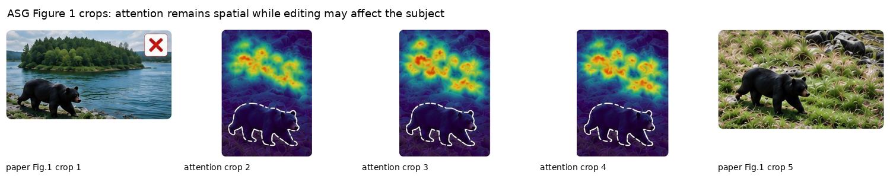
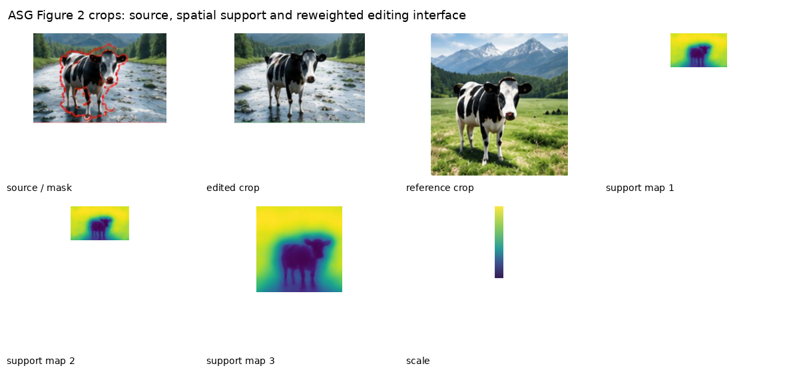
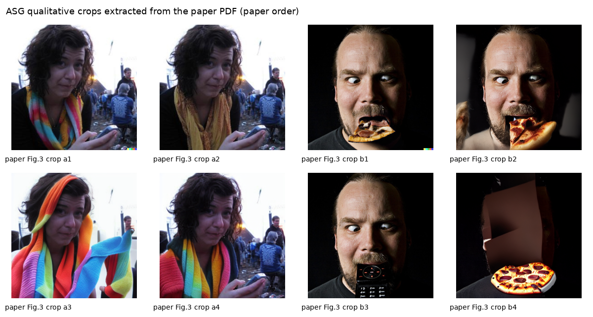

# AI Daily

## 2026-10-07｜Attention-Scoped Guidance：把雙 CFG 的全域權重改成空間化，讓免訓練圖像編輯更少誤傷背景

> **一句話結論：** Attention-Scoped Guidance（ASG）不是重新訓練一個 editor，而是把 instruction-guided image editing 中原本固定的雙 classifier-free guidance（dual CFG）權重改成每個 latent 位置不同的函數：instruction attention 支援高的地方保留編輯並加強 source-image anchor，支援低的地方壓低 text-edit direction。它不需要外部 mask、額外網路 forward 或參數更新，直接命中 **training-free、attention modulation、zero-shot local editing**；但它仍是 2026-09-28 的 arXiv 預印本，且目前只驗證在具有分離 text/image CFG 分支的 instruction editor 上，不能直接宣稱已適用於一般 DiT、VAR 或 Energy-Based Transformer。

## 論文基本資訊

| 欄位 | 資訊 |
|---|---|
| 論文標題 | *Attention-Scoped Guidance: Training-Free Spatial Control for Image Editing* |
| 作者 | Zeyan Li、Wei Zhou、Hadi Amirpour、Minghao Zou、Panqi Yang、Jianfeng Xu（corresponding author）[1] [2] |
| 研究單位 | arXiv HTML 與 abstract metadata 沒有列出作者 affiliation；本報告不從姓名或搜尋摘要臆測研究機構 [1] [2] |
| 發表狀態 | arXiv cs.CV 預印本，v1 於 2026-09-28 發表；截至 2026-10-07 尚未在論文頁面核到 CVPR、ICCV、AAAI、ICML、NeurIPS 或其他正式 venue 收錄資訊 [1] |
| 主題 | instruction-guided image editing、diffusion models、dual CFG、training-free spatial control、attention modulation |
| 論文頁面 | [arXiv abstract][1]；[HTML 全文][2]；[v1 PDF][3] |
| Repo 去重 | 已讀取 `KaiCobra/AI_Daily` 的 `README.md`、`INDEX.md`、`papers/` 與素材索引；`2609.37492`、ASG、完整標題均未出現。本 repo 已有 ZONE、S-CFG 相關背景與多篇 training-free/attention modulation 文章，但沒有這篇新預印本。 |

本次選擇不是因為它已經取得頂會等級，而是因為它在目前搜尋到的新候選中，和你指定的方向重疊最高：**沒有 training、直接調整 attention/CFG、由模型內部訊號產生零樣本 spatial support，並且有完整的數學規則、分支消融與 dose-matched control。** 論文的 venue 信號較弱，這一點應與方法本身的創新性分開評估。

## 為什麼這篇值得讀？

instruction-guided image editing 的核心矛盾是：使用者只想改動指令提到的物件或屬性，但 diffusion editor 的 denoising update 會把整張圖當成一個全域場。結果可能是背景改對了，人物身份卻變了；或顏色改對了，物件位置、臉部與未指定區域也一起被重繪。[2]

ASG 指出一個很乾淨的介面問題：在 dual CFG 中，text-edit direction 與 image-anchor direction 本來就分開存在，但官方 sampler 只用兩個全域 scalar。換句話說，模型已經計算了可以支援局部性的 cross-attention，卻沒有把這個 spatial signal 接到兩個 direction 的權重分配上。

這個 observation 和幾條既有路線有清楚關係：ZONE 用 InstructPix2Pix 推出編輯區域，再用現成 segmentation model 與 FFT edge smoothing 做局部編輯；Focus on Your Instruction（FoI）由 cross-attention 萃取 region，並加入 cross-attention modulation 與 mask-guided disentangled sampling；S-CFG 則在 text-to-image generation 中把 CFG scale 依 semantic region 空間化。[4] [5] [6] ASG 的差別是：它不先建立外部 binary mask，也不重新分割整張 latent，而是在 instruction editor 已有的 **dual-CFG recombination** 位置，讓同一個 soft support 同時控制「要改多少」和「要保留多少」。

*圖 1。由 ASG v1 PDF 以 `/pdf-image-extractor` skill 擷取後整理的 Figure 1 聚焦素材。左、右為論文中的 qualitative crops，中間為 instruction-attention crops；重點不是整頁排版，而是注意力在 denoising 過程中仍保留空間結構 [2] [3]。*

## 核心貢獻與創新點

### 1. 不改 backbone，只改 dual-CFG 的 spatial allocation

ASG 是 sampler wrapper。它不更新 editor 權重、不使用 benchmark mask、不增加額外 denoising network evaluation，也不需要 test-time optimization。它重新利用 editor 已經產生的 instruction cross-attention，將兩個原本全域的 CFG scalar 變成每個位置的 $G_t(x)$ 與 $G_i(x)$。[2]

這種設計的優點是介面很小：若另一個 instruction editor 也有「unconditioned、image-conditioned、text/instruction-conditioned」三條 prediction branch，就有機會直接搬移。限制也同樣清楚：對只有單一 text CFG branch 的一般 text-to-image diffusion，不能直接套用同一個 dual-CFG 公式。

### 2. 用 instruction attention 建立 soft support，而不是外部 mask

論文在 latent resolution 的一半讀取 cross-attention，對 head 與 layer 平均，再對 instruction 中的 non-special tokens 加總。支援量在前十個 denoising steps 累積，之後凍結，因為作者假設早期 step 更接近 layout/locality 決策，後期主要處理 texture。

*圖 2。由 ASG v1 PDF 的 Figure 2 子圖以 `/pdf-image-extractor` skill 擷取並整理。這些聚焦圖示呈現 source/edited/reference 與 attention-derived support 的關係；不是整頁截圖 [2] [3]。*

### 3. 以 dose-matched control 證明「放置位置」本身有貢獻

ASG 不只比較 output，而是把 spatial map 攤平成每張圖的 scalar mean，讓總 guidance dose 大致相同。如果只剩下整體強度，這個 control 應該接近 ASG；實驗卻顯示 PIE-Bench++ 上最多損失約 $0.73$ CLIP。這支持真正有效的因素是 **哪裡減少 text-edit pressure、哪裡加強 image anchoring**，不是單純把 guidance 調大或調小。[2]

## 技術方法與數學細節

### 1. 原始 InstructPix2Pix 式 dual CFG

在第 $s$ 個 denoising step，editor 評估三個 noise prediction：

- $oldsymbol\epsilon_u(x)$：unconditioned prediction；
- $oldsymbol\epsilon_i(x)$：image-conditioned prediction，負責把結果拉回 source image；
- $oldsymbol\epsilon_t(x)$：instruction-conditioned prediction，負責加入文字指令要求的內容。

原始組合為：

$$
\boldsymbol\epsilon_s(x)
=
\boldsymbol\epsilon_u(x)
+c_t\left[\boldsymbol\epsilon_t(x)-\boldsymbol\epsilon_i(x)\right]
+c_i\left[\boldsymbol\epsilon_i(x)-\boldsymbol\epsilon_u(x)\right],
$$

其中官方設定為 $c_t=7.5$、$c_i=1.5$。令兩個 residual direction 為：

$$
\mathbf d_t(x)=\boldsymbol\epsilon_t(x)-\boldsymbol\epsilon_i(x),
\qquad
\mathbf d_i(x)=\boldsymbol\epsilon_i(x)-\boldsymbol\epsilon_u(x).
$$

因此原始 sampler 在每個空間位置使用同一對 scalar：

$$
\boldsymbol\epsilon_s(x)=\boldsymbol\epsilon_u(x)+7.5\,\mathbf d_t(x)+1.5\,\mathbf d_i(x).
$$

ASG 的問題定義就是：同一組 $(7.5,1.5)$ 不應該在「指令提到的區域」與「完全不相關的背景」使用一樣的比例。

### 2. Attention-derived support

令 $A_s^k(x)$ 表示位置 $x$ 對 instruction token $k$ 的 cross-attention，令 $\mathcal I$ 是去掉特殊 token 後的 instruction token 集合。ASG 將前幾步的 attention 累積成：

$$
 a_s(x)
 =
 \sum_{j=0}^{\min(s,10)-1}
 \sum_{k\in\mathcal I} A_j^k(x),
 \qquad a_0(x)=0.
$$

接著做 per-image min–max normalization：

$$
 \bar a(x)
 =
 \frac{a(x)-\min_x a(x)}
 {\max_x a(x)-\min_x a(x)+\varepsilon},
 \qquad \varepsilon=10^{-6}.
$$

再用 sigmoid 把它變成 soft support：

$$
 M(x)=\sigma\left(10[\bar a(x)-0.5]\right).
$$

$M(x)$ 不是 binary mask，而是連續值。當 attention response 位於 transition zone 時，text guidance 和 image anchoring 會平滑交接，減少硬邊界造成的 seam。

作者另外計算 peak-to-mean ratio：

$$
 r_{\mathrm{pm}}
 =
 \frac{\max_x a(x)}
 {\lvert\Omega\rvert^{-1}\sum_{x\in\Omega}a(x)+\varepsilon},
$$

其中 $\Omega$ 是 attention map 的 spatial domain。若 $r_{\mathrm{pm}}<1.5$，代表 attention 太 diffuse，沒有可靠的 locality signal，ASG 直接 bypass，回到原始 $G_t(x)=7.5$、$G_i(x)=1.5$。這個 bypass 很重要：方法不是強迫每張圖都接受一個可能錯誤的 attention mask。[2]

### 3. 將兩個 CFG scalar 變成 spatial gates

ASG 對 text-edit direction 使用：

$$
 G_t(x)=g_{\mathrm{lo}}+(7.5-g_{\mathrm{lo}})M(x),
$$

預設 $g_{\mathrm{lo}}=0$。因此，當 $M(x)$ 很低時，text-edit direction 幾乎被關掉；當 $M(x)$ 高時，恢復接近原本的 $7.5$。

對 image-anchor direction 使用：

$$
 G_i(x)=1.5+(g_{\mathrm{hi}}-1.5)M(x),
$$

預設選擇 $g_{\mathrm{hi}}=3.0$。因此，instruction support 高的地方會更強地拉回 source image；support 低的地方保留原本的 $1.5$ anchor。

最後重組 noise prediction：

$$
\boldsymbol\epsilon_s^{\mathrm{AS}}(x)
=
\boldsymbol\epsilon_u(x)
+G_t(x)\mathbf d_t(x)
+G_i(x)\mathbf d_i(x).
$$

把它和原始 sampler 相減，可以直接看出 ASG 做了什麼：

$$
\Delta\boldsymbol\epsilon_s(x)
=
-7.5[1-M(x)]\mathbf d_t(x)
+(g_{\mathrm{hi}}-1.5)M(x)\mathbf d_i(x).
$$

這個式子是全文最值得帶走的地方：

- $M(x)\approx0$：取消大部分 instruction edit pressure，只保留基本 image anchor；
- $M(x)\approx1$：保留原始 text edit，並可提高 image anchor；
- $0<M(x)<1$：在兩者之間連續插值，不需硬切 mask。

當 $M\equiv1$ 且 $g_{\mathrm{hi}}=1.5$ 時，$\boldsymbol\epsilon_s^{\mathrm{AS}}=\boldsymbol\epsilon_s$，因此原始 sampler 是 ASG 的一個退化情況，而不是完全不同的生成路徑。

### 4. 演算法流程

依論文 Algorithm 1，可以把一次 ASG edit 壓縮成以下流程：

1. 將 support map $a(x)$ 初始化為零。
2. 從第 $s=0$ 到 $49$ 逐步 denoise。
3. 當 support 尚未形成，或 $r_{\mathrm{pm}}<1.5$，使用原始 $(7.5,1.5)$。
4. 否則依 $M(x)$ 計算 $G_t(x)$ 和 $G_i(x)$。
5. 重用同一個 step 的 $\boldsymbol\epsilon_u$、$\boldsymbol\epsilon_i$、$\boldsymbol\epsilon_t$，以 spatial gates 組合。
6. 前十步持續累積 instruction attention；第十步後固定 support。
7. 用重組後的 prediction 更新 latent，完成原本的 50-step edit。

這也是為什麼作者可以報告 observed latency 仍是單張 A100-SXM4 約 1.9 秒：ASG 重用 editor 原本的三條 prediction 與 attention，不增加額外 network evaluation。[2]

## 實驗設定與性能指標

作者使用兩個公開 benchmark 的完整 public split：

- **MagicBrush：** independent 與 iterative 兩種 protocol 各有 1,053 個 turn-level examples；另使用 528 個 development turns 做 mechanism test。MagicBrush 本身是 NeurIPS 2023 的 manually annotated dataset，包含超過 10K 組 source image、instruction、target image triplets，並涵蓋 single-turn、multi-turn、mask-provided 與 mask-free editing。[2] [7]
- **PIE-Bench++：** 700 張原始 PIE-Bench image，使用修訂過的 prompt 與 annotation。它保留 edit region 與 background region，因此可以分開看語意改動與未編輯背景是否被破壞。[2]

主要指標為：

- MagicBrush-I/T：CLIP-I 越高越好、L1 越低越好；
- PIE-Bench++：CLIP-W、CLIP-E 衡量整體與編輯相關的語意品質，PSNR-BG 衡量背景保留；
- catastrophic turn：相對 source no-op reference 的 CLIP-I gap 低於 $-0.10$ 的案例。[2]

## 實驗結果

### 1. 完整 benchmark：ASG 偏向 preservation end

下表是論文對七個 released editor 的比較；ASG 的優勢集中在 source preservation，而非所有 semantic edit score 都第一。[2]

| 方法 | MagicBrush-I CLIP-I | MagicBrush-I L1 | MagicBrush-T CLIP-I | MagicBrush-T L1 | PIE CLIP-W | PIE CLIP-E | PIE PSNR-BG |
|---|---:|---:|---:|---:|---:|---:|---:|
| InstructPix2Pix | 0.8509 | 0.1135 | 0.8099 | 0.1491 | 24.001 | 23.457 | 80.656 |
| MagicBrush-IP2P | 0.9177 | 0.0741 | 0.8849 | 0.1042 | 23.612 | 22.985 | 81.388 |
| InstructDiffusion | 0.9228 | 0.0706 | 0.8912 | 0.0995 | 23.903 | 23.155 | 81.591 |
| DIM | 0.9256 | 0.0698 | **0.8981** | 0.0973 | **26.745** | **25.933** | 81.023 |
| Kontinuous Kontext | 0.9099 | 0.0814 | 0.8724 | 0.1150 | 25.511 | 24.718 | 81.220 |
| **Attention-Scoped Guidance** | **0.9296** | **0.0624** | 0.8961 | **0.0901** | 23.568 | 22.858 | **82.173** |

ASG 在 MagicBrush 四個 metric 中贏三個：independent protocol 的 CLIP-I/L1，以及 iterative protocol 的 L1；iterative CLIP-I 則由 DIM 以 0.8981 勝過 ASG 的 0.8961。PIE-Bench++ 的 background PSNR 以 82.173 最高，但 DIM 與 Kontinuous Kontext 的 semantic CLIP 分數更高。[2]

相對於已經針對 MagicBrush fine-tune 的 MagicBrush-IP2P，ASG 只靠 sampling 就帶來：

- MagicBrush-I：CLIP-I $+0.0119$、L1 $-0.0117$；
- MagicBrush-T：CLIP-I $+0.0112$、L1 $-0.0141$；
- PIE-Bench++ 相對最佳 background baseline InstructDiffusion：PSNR-BG $+0.582$ dB。

這是一個合理但要保守解讀的結果：ASG 明顯改善「不要亂改」的能力，卻不代表它在所有需要大幅 semantic change 的情境都最好。

*圖 3。由 ASG v1 PDF Figure 3 的必要子圖擷取並整理；圖像以 paper order 呈現，用來觀察同一 seed 下不同 edit/anchor 行為，不是整頁 screenshot [2] [3]。*

### 2. Branch ablation：text gating 是主要來源，image anchor 負責收尾

在 528-turn MagicBrush development split 上，作者拆開兩個 branch：

| 設定 | CLIP-I | L1 | Catastrophic |
|---|---:|---:|---:|
| Base：uniform CFG | 0.8625 | 0.1104 | 152 |
| Base：text gating only | 0.9303 | 0.0653 | 12 |
| Incumbent：uniform CFG | 0.9217 | 0.0725 | — |
| Incumbent：image anchor only | 0.9274 | 0.0680 | — |
| Incumbent：text gating only | 0.9346 | 0.0615 | 13 |
| **Incumbent：full ASG，$g_{\mathrm{hi}}=3.0$** | **0.9380** | **0.0586** | **8** |

這個消融說明：

1. **text gating 是主要增益來源。** 在 support 低的背景區域減少 text-edit residual，直接抑制誤傷。
2. **image anchor 是第二層保護。** 單獨使用它已有幫助，但疊在 text gating 上能把 CLIP-I 從 0.9346 推到 0.9380，並將 catastrophic tail 從 13 降到 8。
3. **兩個 direction 的角色不能混為一談。** text direction 主要回答「要改什麼」，image direction 主要回答「哪些 source identity/structure 要保留」。

### 3. Anchor dose：$g_{\mathrm{hi}}=3.0$ 是品質與刪除能力的折衷

| $g_{\mathrm{hi}}$ | CLIP-I | L1 | 新增 catastrophic |
|---:|---:|---:|---:|
| 1.50 | 0.9346 | 0.0615 | 0 |
| 2.25 | 0.9367 | 0.0598 | 0 |
| **3.00** | **0.9380** | **0.0586** | **0** |
| 4.50 | 0.9350 | 0.0592 | 3 |

當 $g_{\mathrm{hi}}$ 從 1.5 提高到 3.0，保留能力提升；提高到 4.5 後反而下降，且三個新增 catastrophic turns 都是 removal edits。直覺上，過強的 source anchor 會抵抗使用者明確要求的刪除。這個結果提醒我們：**preservation controller 不是越強越好，應依 edit type 或 uncertainty 調節。** [2]

### 4. Spatial placement control：不是把 dose 調高就夠了

在 PIE-Bench++ 上，作者比較 ASG 與兩個 non-spatial control：

- **Fixed guidance：** 把兩個 gate 攤成一組固定的強 guidance；相對 ASG，CLIP-W $-0.273$、CLIP-E $-0.326$，PSNR-BG 只增加 0.27 dB，表示它很可能靠 under-editing 換 preservation。
- **Per-image mean：** 以每張圖的 spatial map mean 取代整張 map，保留大致相同 dose 但移除 placement；CLIP-W 損失 $0.726$、CLIP-E 損失 $0.727$，PSNR-BG 只變動 0.06 dB。

第二個 control 特別有說服力：在總量相近時，只有「在哪些位置施加 text/image guidance」不同，品質就有明顯差異。這把 ASG 從一般 strength tuning 中分離出來。[2]

## 相關研究與差異

### ZONE：外部 region extraction 的 zero-shot local editing

ZONE 是 CVPR 2024 論文，先用 InstructPix2Pix 將自然語言 instruction 轉成具體 editing region，再用 off-the-shelf segmentation model 的 Region-IoU scheme 做 image layer extraction，最後以 FFT edge smoother 處理 layer 與背景的接縫。[4]

ZONE 與 ASG 都是 zero-shot/training-free local editing，但介面不同：ZONE 先顯式建立 region/layer，再做局部合成；ASG 不引入外部 detector 或 segmentation model，而是使用 editor 已有的 instruction cross-attention，直接在 denoising residual 組合層做 soft allocation。ZONE 的 region 可能更容易解釋，ASG 則更輕量且更接近原本 sampling trajectory。

### FoI：attention modulation 加 disentangled sampling

FoI 同樣是 CVPR 2024，從 IP2P 的 cross-attention 找到 implicit grounding，接著做 mask extraction、cross-attention modulation 與 mask-guided disentangle sampling，特別針對 fine-grained 與 multi-instruction editing。[6]

ASG 的新位置不在「第一次發現 attention 有 spatial semantics」，而在 **dual-CFG combine 時同時調整兩個 direction**。FoI 主要控制 attention 與 sampling isolation；ASG 把 edit pressure 與 source anchoring 視為兩個不同角色，用同一個 $M(x)$ 分別給予不同 gate。這提供更直接的 ablation：可以單獨移除 text gate、單獨移除 image gate，觀察兩種 failure 是否不同。

### S-CFG：text-to-image 的 semantic-region CFG

S-CFG 指出 global CFG scale 造成不同 semantic unit 的 spatial inconsistency，利用 denoising U-Net 的 cross-attention 與 self-attention 建立 semantic regions，再為不同區域設定 adaptive CFG scale，例如其 region-wise scale 形式可寫成：

$$
\gamma_{t,i}
=
\gamma
\frac{\lVert m_{t,b}\odot\eta_t\rVert}
{\lVert m_{t,i}\odot\eta_t\rVert}
\frac{\lVert m_{t,i}\rVert}
{\lVert m_{t,b}\rVert},
$$

其中 $\eta_t$ 是 conditional/unconditional prediction 的差異，$m_{t,i}$ 是 semantic region mask。[5]

兩篇論文的共同點是「global CFG 不是 spatially uniform 的好假設」。差別是 S-CFG 主要服務 text-to-image、要對不同 semantic region 做均衡；ASG 服務 instruction-guided editing、要在 edit region 與 source-preservation region 之間分配兩個不同方向。因此 ASG 的 anchor branch 是它最重要的額外結構。

### Kontinuous Kontext：可控 edit strength，但需要訓練

Kontinuous Kontext 是 CVPR 2026 論文，透過輕量 projector 將 scalar edit strength 與 instruction 映射到模型 modulation space，讓使用者可從 no change 連續調到 full edit；它需要用合成的 image-edit-instruction-strength quadruplets 訓練 projector。[8]

它回答的是「同一個 edit 應該有多強」；ASG 回答的是「同一個 edit 在哪裡應該強、在哪裡應該弱」。前者是 global/condition-level strength control，後者是 inference-time spatial allocation。若把兩者結合，可能得到一個 global dose $\alpha$ 加上 local support $M(x)$ 的 two-axis controller，但這會失去 ASG 目前最簡單的 frozen-wrapper 優勢。

### MagicBrush：評估 locality trade-off 的重要資料集

MagicBrush 的價值不只是資料量，而是它提供 source、instruction、target 的人工配對，並涵蓋 single-turn、multi-turn、mask-provided 與 mask-free editing。官方 NeurIPS 2023 頁面指出它包含超過 10K 組 manually annotated triplets，並用人類評估揭示現有 baseline 與真實編輯需求之間的落差。[7]

ASG 在 MagicBrush 上的結果應讀成 preservation-oriented trade-off，而不是單純的 semantic edit ranking。這也解釋了為什麼作者同時報 PIE-Bench++ background PSNR，以及為什麼 DIM/Kontinuous Kontext 在 PIE 的 semantic CLIP 高於 ASG。

## 個人評價與研究意義

我給 ASG **8.7/10**：不是因為 venue 等級高，而是因為它用很少的改動把一個常見 failure mode 寫成可驗證的 sampler-level hypothesis。

### 最值得帶走的 insight

ASG 把 local editing 拆成兩個方向，而不是把「局部性」當成一個單一 mask：

1. **Edit direction：** instruction 要求的內容，應只在 support 高的地方施加。
2. **Anchor direction：** source identity/structure，應在 support 高的地方保護，並在 transition zone 平滑過渡。

因此它不是單純的 attention mask，也不是單純把 CFG scale 乘一個 heatmap；它是對 dual residual 的 **direction-aware spatial allocation**。

### 我認為它做得好的地方

- **問題—介面對齊。** 方法直接改雙 CFG combination，而不是額外堆一個 segmentation branch。
- **有 fallback。** $r_{\mathrm{pm}}<1.5$ 時 bypass，避免 diffuse attention 被誤當成 region mask。
- **消融具有因果味道。** text-only、image-only、full ASG、dose sweep、per-image mean control 都對應不同假設。
- **承認 trade-off。** ASG 在 preservation 指標很強，但 semantic CLIP 不一定最好；$g_{\mathrm{hi}}=4.5$ 對 removal edit 反而有害。
- **計算介面乾淨。** 不需要額外 network evaluation，且 observed latency 保持約 1.9 秒；這對 training-free wrapper 很重要。[2]

### 不能過度解讀的地方

- **不是頂會已接收工作。** 截至本報告日仍是 arXiv v1 預印本，作者 affiliation 也沒有出現在官方 HTML metadata 中。
- **適用範圍受 dual-CFG 限制。** 它依賴獨立的 image/text/unconditioned predictions；不能直接移植到所有 text-to-image、DiT 或 VAR backbone。
- **attention support 仍是 heuristic。** 前十步、peak-to-mean threshold 1.5、sigmoid scale 10 與 $g_{\mathrm{hi}}$ 是 development split 選出的設定，跨 editor 是否仍然合理需要更多實驗。
- **training-free 不等於 zero-cost。** 每個 denoising step 仍要計算原 editor 的三條 prediction、attention 與 sampler update；「不增加 network evaluation」不代表沒有 memory 或 implementation overhead。
- **aggregate CLIP 可能獎勵 no-op。** 開發集有 217/528（41.1%）個 target 的 source no-op CLIP-I 已超過 0.97；作者有在其餘 311 turns 上報比較，但未來研究仍應更重視 edit success 與 preservation 的 Pareto frontier。[2]
- **尚未驗證更強的現代 editor。** 目前主要證據來自 IP2P 系列與 released editors，不足以證明 ASG 對 FLUX、SD3、MMDiT 或 autoregressive image generator 仍然有效。

## 可以激發後續研究的方向

以下構想都是基於 ASG 的延伸，不是原論文已完成的結果。

### 1. Energy-Gated ASG：讓 spatial gate 由 compatibility energy 決定

ASG 已有兩個 residual direction，但沒有顯式 energy。可以把每個位置的 edit/anchor 相容性寫成：

$$
E(x)
=
\lambda_t E_t(x)+\lambda_i E_i(x)+\lambda_b E_{\mathrm{boundary}}(x),
$$

其中 $E_t$ 衡量 instruction token 與該位置的 semantic mismatch，$E_i$ 衡量 source identity/structure 被破壞的程度，$E_{\mathrm{boundary}}$ 則懲罰相鄰位置 gate 差異過大。再以 energy 取代固定 sigmoid：

$$
M_E(x)=\sigma\left(-\frac{E(x)-\tau}{T}\right).
$$

這會把 ASG 從「attention-derived heuristic」推向 energy-based inference controller。實驗上應比較固定 $M$、energy-only、attention+energy，以及是否能在不增加 denoiser forward 的情況下改善 removal edit 的 over-anchoring。

### 2. JEPA predictive support：預測哪些位置下一步會被誤傷

ASG 目前由當前 instruction attention 估計 support，屬於 retrospective spatial evidence。可加入 frozen JEPA-style predictor，令每個位置的 latent state 為 $z_s(x)$，預測下一步或下一段 denoising state：

$$
\hat z_{s+1}(x)=P_\psi\big(z_{\le s}(x),\,\text{instruction}\big),
$$

再用 predictive disagreement：

$$
U_s(x)=\left\lVert z_{s+1}(x)-\hat z_{s+1}(x)\right\rVert_2^2
$$

調整 $G_i(x)$。如果 $U_s(x)$ 在 instruction support 低的地方升高，可以提前增加 anchor；若只是姿勢或光照改變而預測 uncertainty 沒有升高，則不要把 source anchor 加得太強。這個方向可以測試 JEPA 是否比 attention concentration 更早發現 identity drift。

### 3. VAR × ASG：把 spatial support 改成 scale-wise token guidance

對 visual autoregressive model，沒有 diffusion noise prediction 的 $\epsilon_t$ 與 $\epsilon_i$，但可以在每個 scale 的 logits 上建立「edit-on／source-anchor-on」對照。令第 $r$ 個 scale 的 logits 為 $\ell_r^+$ 與 $\ell_r^-$，可做：

$$
\ell_{r,\mathrm{out}}(j)
=
\ell_r^+(j)
+\gamma_r M_r(j)\left(\ell_r^+(j)-\ell_r^-(j)\right),
$$

其中 $M_r(j)$ 由 instruction-to-token attention 或 cross-scale support 產生。coarse scale 可以保留較大的 layout freedom，fine scale 再對 subject texture 使用較強 anchor。這會直接測試 ASG 的核心想法能否從 diffusion residual transfer 到 VAR next-scale logits。

### 4. Learn-free multi-instruction routing

對含有多個 edit instruction 的情況，不應把所有 non-special token attention 直接相加。可以對每個 instruction $q$ 建立 $M_q(x)$，再使用：

$$
G_t(x)=\sum_q w_q(x)G_{t,q}(x),
\qquad
\sum_q w_q(x)=1.
$$

若不同 instruction 的 support overlap，額外加入 conflict score，避免「把帽子變紅」和「刪除帽子」兩個 instruction 同時對同一區域施加互相矛盾的 residual。這會把 ASG 與 FoI 的 multi-instruction locality 接起來，但仍維持不訓練的 sampler 形式。

### 5. Strict zero-shot evaluation protocol

若要把這類方法與 EBT、JEPA、VAR 的新想法公平比較，建議建立一個嚴格 protocol：

- frozen backbone，不做 subject/image-specific optimization；
- 不使用 benchmark ground-truth mask；
- 分開報告 attention extraction、memory、latency 與任何外部 encoder 成本；
- 對 local add、recolor、replace、remove、global edit 分層；
- 同時報 edit success、background PSNR、CLIP semantic、identity similarity、catastrophic tail；
- 每個方法都要有 no-op、uniform guidance、spatial guidance、dose-matched mean control；
- 對 diffuse attention 允許 abstain，並報告 coverage–quality curve。

這樣才能分辨 gain 是來自真正的 spatial allocation，還是只把模型調得更保守。

## 結論

ASG 最重要的研究價值，不是提出另一個 attention heatmap，而是把 instruction editing 的 local control 寫成一個非常小、非常清楚的 sampling interface：

1. 用前十步 instruction attention 建立 soft support；
2. 在 support 低的地方降低 text-edit direction；
3. 在 support 高的地方提高 source-image anchor；
4. 以 peak-to-mean bypass 保留原始 sampler 的 fallback；
5. 用 dose-matched spatial control 證明「位置」本身有貢獻。

因此它很適合當作你想激發新想法的基礎模組：可以把 $M(x)$ 改成 Energy-Based compatibility map，把它改成 JEPA predictive uncertainty，或把 diffusion residual guidance 改寫成 VAR scale-wise logit modulation。原論文本身仍不是 EBT、JEPA 或 VAR，也不是已被頂會認可的工作；更精確的判斷是：**它是一個近期、低改動、可消融、直接命中 training-free attention control 的 arXiv 方法，值得作為下一步研究設計的 sampler-level building block。**

## References

[1]: https://arxiv.org/abs/2609.37492 "Attention-Scoped Guidance: Training-Free Spatial Control for Image Editing — arXiv abstract and version metadata"

[2]: https://arxiv.org/html/2609.37492v1 "Attention-Scoped Guidance: Training-Free Spatial Control for Image Editing — full HTML paper"

[3]: https://arxiv.org/pdf/2609.37492 "Attention-Scoped Guidance: Training-Free Spatial Control for Image Editing — v1 PDF used for local figure extraction"

[4]: https://cvpr.thecvf.com/virtual/2024/poster/29478 "ZONE: Zero-Shot Instruction-Guided Local Editing — CVPR 2024 official poster page"

[5]: https://arxiv.org/html/2404.05384 "Rethinking the Spatial Inconsistency in Classifier-Free Diffusion Guidance — S-CFG full paper"

[6]: https://cvpr.thecvf.com/virtual/2024/poster/31831 "Focus on Your Instruction: Fine-grained and Multi-instruction Image Editing by Attention Modulation — CVPR 2024 official poster page"

[7]: https://proceedings.neurips.cc/paper_files/paper/2023/hash/64008fa30cba9b4d1ab1bd3bd3d57d61-Abstract-Datasets_and_Benchmarks.html "MagicBrush: A Manually Annotated Dataset for Instruction-Guided Image Editing — NeurIPS 2023 official proceedings page"

[8]: https://cvpr.thecvf.com/virtual/2026/poster/39138 "Kontinuous Kontext: Continuous Strength Control for Instruction-based Image Editing — CVPR 2026 official poster page"
