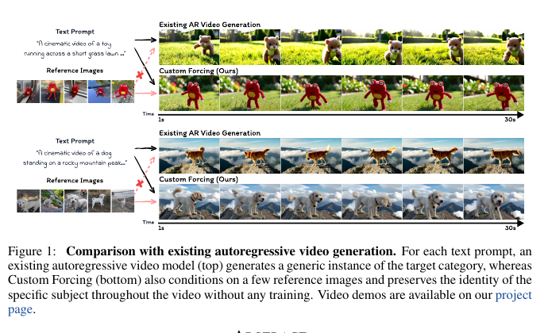
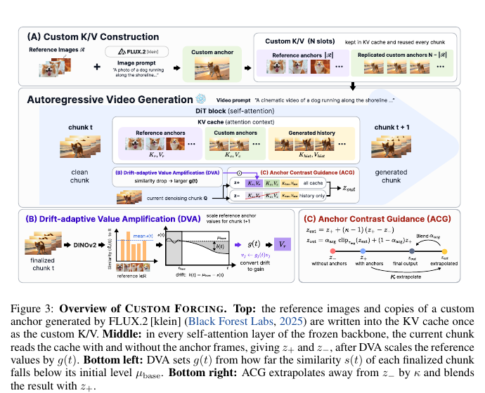
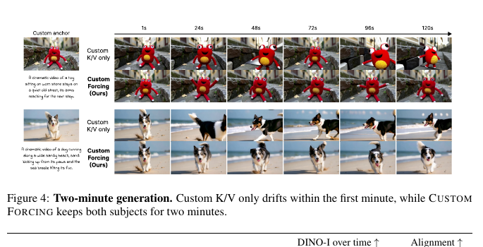
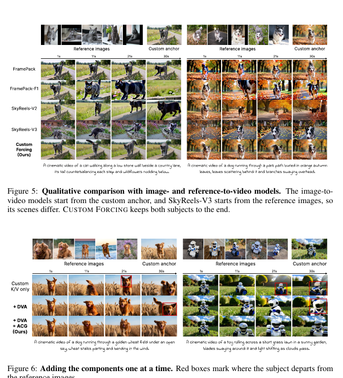
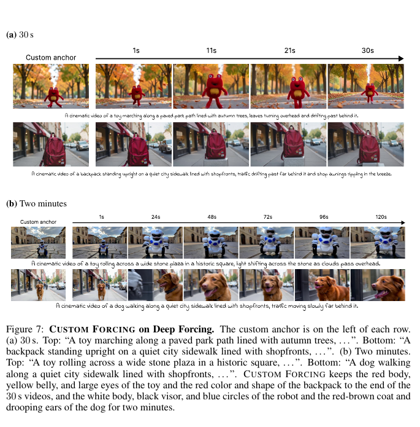
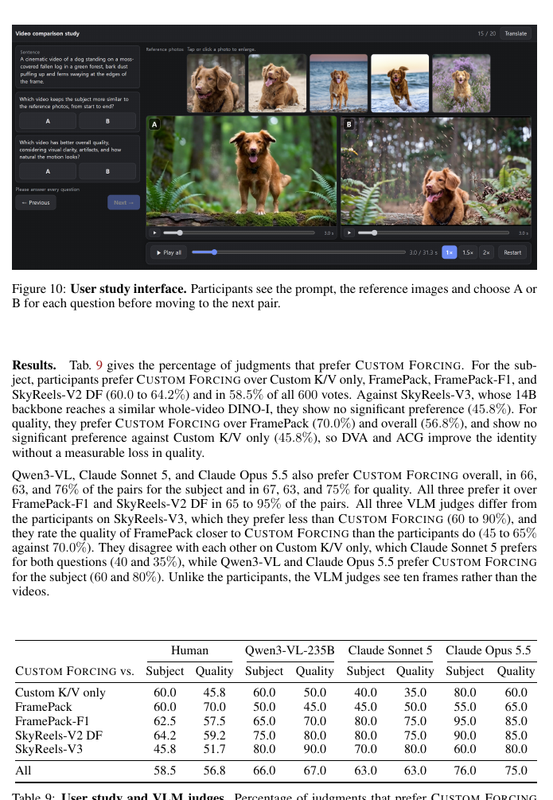
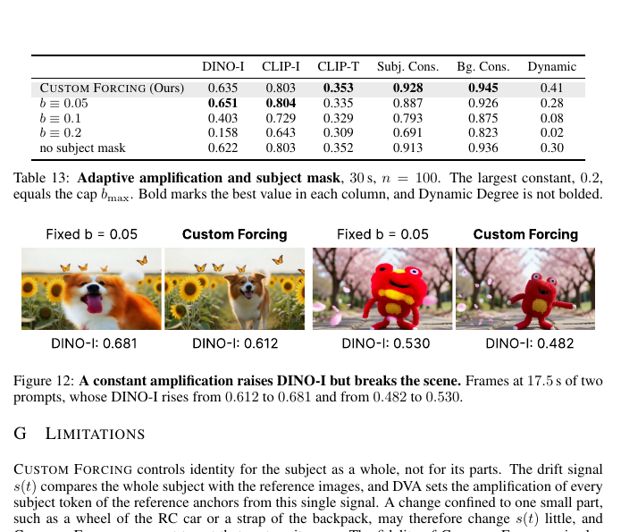

# AI Daily

## 2026-10-06｜Custom Forcing：把主體身份寫進自回歸影片的 Persistent KV Cache

> **一句話結論：** Custom Forcing 的核心不是再訓練一個 subject adapter，而是把五張使用者參考圖與一張場景化 custom anchor 寫進 frozen autoregressive video model 的 persistent attention sink，再用 **drift-adaptive value amplification（DVA）** 和 **anchor contrast guidance（ACG）** 讓模型在身份漂移時加強正確的 reference read、並沿著「有 anchor／無 anchor」的 self-attention 差異離開 generic class prior。它直接命中 **training-free、zero-shot-style subject customization、autoregressive video、KV/attention modulation** 四個方向；但它不是 Energy-Based Transformer、JEPA 或 canonical VAR，且外部依賴 FLUX.2、SAM、DINOv2，不能把「frozen backbone」誤讀成完全 data-free 或零成本。

## 論文基本資訊

| 欄位 | 資訊 |
|---|---|
| 論文標題 | *Custom Forcing: Training-Free Subject Customization for Autoregressive Video Generation* |
| 作者 | Yunseung Ok、Hyunsoo Kim、Minseo Kim、Suhyun Kim [1] [3] |
| 研究單位 | Kyung Hee University；The University of Texas at Austin [1] [3] |
| 發表狀態 | arXiv cs.CV 預印本；v1 於 2026-10-02 發表，v2 於 2026-10-05 更新；截至本報告日，官方 metadata 沒有會議或期刊收錄欄位 [1] [5] |
| 領域 | autoregressive video generation、streaming KV cache、training-free customization、attention modulation、subject identity preservation |
| 論文頁面 | [arXiv abstract][1]；[HTML 全文][2]；[v1 PDF][3] |
| 官方頁面 | [Custom Forcing project page][4] |
| Repo 去重 | 已讀取 `KaiCobra/AI_Daily` 的 `README.md`、`INDEX.md` 與 `papers/`；`2610.02914`、Custom Forcing、完整標題與同篇版本均未出現，因此是新文章。 |

本次候選評估以 2026-10-02 至 2026-10-05 的最新 arXiv cs.CV 工作為主，並比較了 flow matching world model、spectral diffusion guidance、solver-aware caching、T2I reward composition、LoGo、composition diagnostics 等方向。Custom Forcing 最值得優先閱讀的理由，是它不是只說「可以用 reference 控制影片」，而是把問題拆成兩個可測量的失敗機制：**reference influence 太弱會造成 identity drift；prompt 會把模型拉回 generic class prior。** DVA 和 ACG 分別對應這兩個問題，而且都可以直接插入 frozen 自回歸模型的 cache/attention path [2]。

## 為什麼這篇值得讀？

長影片的 subject customization 有一個容易被短影片 benchmark 蓋掉的問題：影片一開始像 reference，不代表一分鐘後仍是同一個 subject。因果式 streaming generator 每完成一個 chunk 就把它寫入 cache，下一個 chunk 只能讀已完成的歷史；一旦 subject appearance 在某次 chunk 產生小偏差，後續生成會把這個偏差當成新歷史，identity error 會逐步累積。

Custom Forcing 把這個問題重新表述成 **persistent memory 讀取控制**。既然模型本來就會反覆讀取 attention sink，就不必另外建立 retrieval branch、subject LoRA 或 bidirectional conditioning network；只要把 reference-based frames 放進 persistent sink，再控制它們被讀取的強度和方向即可。

*圖 1。由 v1 PDF 以 `/pdf-image-extractor` skill 取得並裁切的論文 Figure 1。上排是 prompt-only 的 generic subject，下排是 Custom Forcing 以 unseen reference images 保持指定主體；圖像只擷取論文必要區域，不是整頁截圖 [3]。*

這種設計也很適合用來激發後續想法：它把「生成」和「驗證／修正」放在同一個 frozen backbone 裡，但沒有真的引入 energy function 或 JEPA predictor。因此，DVA 的 drift signal、ACG 的 anchor contrast 和 cache 的長程記憶，正好提供了把 EBT、JEPA、VAR 與 training-free inference 接起來的實驗接口。

## 核心貢獻與創新點

### 1. Custom K/V：用 reference 與 custom anchor 取代原始 attention sink

模型是 causal chunk-wise autoregressive video generator。可以用下式表示其條件分解：

$$
p_\theta(x\mid y)=\prod_t p_\theta\left(x^t\mid x^{<t},y\right),
$$

其中 $x^t$ 是第 $t$ 個影片 chunk，$y$ 是文字 prompt。每個 DiT block 都保留一個有界 cache：

$$
\mathcal C_t=\mathcal S\cup\mathcal W_t,
$$

$\mathcal S$ 是長時間保留的 attention sink，$\mathcal W_t$ 則是最近歷史窗口。一般模型把最早生成的 frames 放進 $\mathcal S$；Custom Forcing 改成在第一個 chunk 生成前，把 subject reference 寫進這個 persistent 部分，所以每一個未來 chunk 都能透過普通 self-attention 看到它 [2]。

實作上，每個案例使用：

- **5 張 reference images：** 保留 subject 的外觀身份；
- **1 張 custom anchor：** 由 frozen FLUX.2 [klein] 4B 依 reference 與場景 prompt 生成，讓影片從正確場景開始；
- **4 份 custom-anchor copies：** 置於五張 reference 後，形成總共 $N=9$ 個 persistent custom K/V frames；
- **不新增 retrieval branch：** 這些 frames 直接走原模型的 attention cache；
- **不更新 backbone 權重：** 沒有 subject-specific LoRA、per-subject optimization 或額外 conditioning network [2] [4]。

custom anchor 與 reference anchor 的分工很重要：reference images 主要回答「這個 subject 長什麼樣」，custom anchor 回答「影片一開始要把 subject 放在什麼場景、姿勢與構圖」。更多 custom-anchor copies 會提高 opening scene 穩定性，但可能限制 motion；更多 reference anchors 可能恢復動作，卻降低場景固定程度 [2]。

*圖 2。由 v1 PDF Figure 3 裁切的必要方法圖。上方是 custom K/V 建構，中間是每個 DiT self-attention layer 同時讀取 anchors 與 generated history，下方分別是 DVA 的 drift feedback 和 ACG 的 anchor contrast [2] [3]。*

### 2. DVA：身份漂移越大，reference value 才讀得越強

固定地把 reference value 放大，確實能拉住 subject，但會讓 subject 變大、姿勢變硬，甚至降低 motion。因此 DVA 不使用固定 injection strength，而是先從已完成 chunk 測量 identity drift，再把 drift 轉成下一個 chunk 的 value amplification。

令 $\phi$ 是 frozen DINOv2-B 的 $\ell_2$-normalized CLS embedding，$c_i$ 是第 $i$ 張 reference image，已完成 chunk $x^t$ 解碼後得到 $F'$ 張 pixel frames。對每張 reference 的相似度為：

$$
\bar S_i(t)=\frac{1}{F'}\sum_{f=1}^{F'}
\left\langle\phi\left(x_f(t)\right),\phi(c_i)\right\rangle,
\qquad i\in\mathcal R.
$$

只對真正的 reference anchors 計算，不把 custom anchor 納入，因為影片一開始就是從 custom anchor 開始。整體 subject similarity 為：

$$
 s(t)=\frac{1}{|\mathcal R|}\sum_{i\in\mathcal R}\bar S_i(t).
$$

不同 subject 和 prompt 的 absolute DINO-I 不同，所以論文不直接用固定 threshold，而是使用同一支影片前 $t_{\mathrm{base}}$ 個 chunks 的平均作為 baseline：

$$
\mu_{\mathrm{base}}=\frac{1}{t_{\mathrm{base}}}
\sum_{t=1}^{t_{\mathrm{base}}}s(t).
$$

之後把低於初始水準的部分視為 drift：

$$
 b(t)=\min\!\left(\max\left(0,\mu_{\mathrm{base}}-s(t)\right),b_{\max}\right).
$$

若 $s(t)$ 沒有下降，$b(t)=0$；若身份開始偏離，$b(t)$ 才增加，而且最多被 $b_{\max}$ 截斷。這是 **per-video relative feedback**，比把所有 subject 使用同一個絕對 DINO threshold 更合理 [2]。

DVA 接著用 SAM 為每張 reference 估計 subject mask。令 $w_j\in[0,1]$ 是 latent token $j$ 中屬於 subject 的像素比例；低於 $\tau_{\mathrm{subj}}$ 的 token 被視為背景並移出 attention。對 reference $i$ 中的 subject token 集合 $\mathcal T(i)$，target gain 為：

$$
\widetilde g_j(t)=
\frac{\alpha_{\mathrm{inj}}b(t)}{|\mathcal R|}
\cdot
\frac{n_iw_j}{\sum_{j'\in\mathcal T(i)}w_{j'}},
\qquad n_i=|\mathcal T(i)|.
$$

這個式子有兩個作用：第一項把總 amplification budget 平均分給每張 reference；第二項把同一張 reference 內的 budget 偏向 subject-dominant tokens，而不是背景。為了避免 chunk-to-chunk 的突變，DVA 用 EMA 平滑：

$$
 g_j(t)=\lambda g_j(t-1)+(1-\lambda)\widetilde g_j(t).
$$

注意：DVA 不改 cached key，也不重新寫入 value；它只在下一個 chunk 的 attention 計算前，將 selected reference values 讀成 $g_j(t)\mathbf v_j$。論文設定使用 $\alpha_{\mathrm{inj}}=300$、$b_{\max}=0.2$、$t_{\mathrm{base}}=3$、$\lambda=0.95$，且 DVA 的更新在 chunk $t$ finalized 後影響 chunk $t+1$ [2]。

### 3. ACG：用 anchor-on／anchor-off 的差異抵抗 generic class prior

DVA 只回答「reference 要讀多大聲」，卻沒有回答「目前的生成到底偏向哪一個方向」。文字 prompt 通常只寫 category，例如「a dog running along a shoreline」，因此模型仍可能偏向 generic dog。ACG 以同一個 query 做兩次 self-attention read：

$$
 z_+=\operatorname{Attn}\left(\mathbf q;
 \mathcal J_{\mathcal A}\cup\mathcal J_{\mathrm{gen}}\right),
 \qquad
 z_-=\operatorname{Attn}\left(\mathbf q;
 \mathcal J_{\mathrm{gen}}\right),
$$

$\mathcal J_{\mathcal A}$ 是 anchor tokens，$\mathcal J_{\mathrm{gen}}$ 是 generated history 與 current denoising chunk。$z_+$ 是普通的含 anchor attention output，$z_-$ 則是暫時遮掉 anchors 後的 anchor-free output。

由於兩組 token 不重疊，$z_+$ 可以寫成 anchor 分量與 anchor-free 分量的 convex combination：

$$
 z_+=m z_{\mathcal A}+(1-m)z_-,
 \qquad
 m=\frac{M_{\mathcal A}}
 {M_{\mathcal A}+M_{\mathrm{gen}}}\in[0,1].
$$

因此 $z_+-z_-$ 指向 anchors 對目前 query 的實際貢獻，而且它是 query-dependent：已經在讀 subject 的 query，差異會自然更大；不相關 query 則不會被固定強度硬推。

ACG 沿這個方向做 extrapolation：

$$
 z_{\mathrm{ext}}=z_++(\kappa-1)(z_+-z_-).
$$

為避免 extrapolated feature 爆掉，論文以相對於 $z_+$ 的 $\ell_1$ norm 做 clipping，再和原本 $z_+$ 混合：

$$
 z_{\mathrm{out}}=
 \alpha_{\mathrm{acg}}\operatorname{clip}_{\tau_{\mathrm{acg}}}
 (z_{\mathrm{ext}})
 +(1-\alpha_{\mathrm{acg}})z_+.
$$

若 clipping 沒有啟動，則可得到更直觀的形式：

$$
 z_{\mathrm{out}}=m'z_{\mathcal A}+(1-m')z_-,
 \qquad
 m'=\left(1+\alpha_{\mathrm{acg}}(\kappa-1)\right)m.
$$

也就是說，ACG 不是直接替所有 query 指定固定 anchor weight，而是放大原本已經存在的 anchor attention share。論文設定 $\kappa=4$、$\alpha_{\mathrm{acg}}=0.25$、$\tau_{\mathrm{acg}}=2.5$，ACG 套用到每個 DiT block、每個 denoising step 的 self-attention；text cross-attention 不變，也不需要額外 network forward [2]。

這個設計和兩類方法不同：它不是 RefDrop 那種固定比例 mixing，也不是 NAG 的 positive／negative prompt cross-attention contrast；它的 negative branch 來自同一 cache 的 **anchor masking**。ACG 在前幾個 chunks 之後以 linear warm-up 開始，避免模型還沒建立穩定場景時就過度介入。

## 實驗設定與性能指標

論文把 Custom Forcing 套到 Rolling Forcing，一個以 Wan2.1-T2V-1.3B 為 backbone 的 streaming autoregressive video diffusion model，完全不做 subject-specific fine-tuning。資料使用 10 個 DreamBooth subjects，包含 6 種動物與 4 種物件；每個 subject 有 10 個只寫 category、不寫 instance name 的 prompts，共 100 個案例，每個案例產生 30 秒和 2 分鐘影片 [2] [4]。

主要設定如下：

- 解析度 $832\times480$、16 fps；
- 每個 chunk 產生 3 個 latent frames；
- 5 張 reference images + 4 份 custom-anchor copies；
- custom anchor 由 frozen FLUX.2 [klein] 4B 生成；
- 每 8 frames 取樣計算 metrics；
- DINO-I 衡量 subject identity similarity；
- CLIP-I、CLIP-T 衡量 reference similarity 與 prompt alignment；
- VBench Subject Consistency、Background Consistency、Dynamic Degree 衡量影片品質與 motion；
- 主體 drift 以第一、中間、最後 window 的 DINO-I 分開報告 [2]。

這裡應特別注意：DINO-I 不只是結果指標，也被 DVA 當成線上 drift sensor。作者以 ConvNeXt-B 取代 DINOv2-B 做交叉檢查，分數變化最多 0.003，降低了「方法只是和自己的 metric 共用 encoder」的疑慮，但仍不能完全消除 perceptual metric bias [2]。

## 實驗結果

### 1. 30 秒與 2 分鐘主結果：DVA+ACG 能壓住長程漂移

| 方法 | 長度 | DINO-I all | first | middle | last | Dynamic Degree |
|---|---:|---:|---:|---:|---:|---:|
| Custom K/V only | 30 s | 0.541 | 0.579 | 0.506 | 0.475 | 0.41 |
| **Custom Forcing** | **30 s** | **0.635** | **0.619** | **0.626** | **0.616** | **0.41** |
| Custom K/V only | 2 min | 0.501 | 0.583 | 0.450 | 0.415 | 0.47 |
| **Custom Forcing** | **2 min** | **0.623** | **0.622** | **0.602** | **0.578** | **0.45** |

30 秒中，Custom K/V only 從 first 的 0.579 降至 last 的 0.475；加上 DVA+ACG 後，first 到 last 仍維持 0.619→0.616。2 分鐘中，固定 anchor 由 0.583 降到 0.415；完整方法仍有 0.622→0.578。Dynamic Degree 在同一個長度下接近或高於 fixed-anchor baseline，支持 identity 增益不是單純把 subject 凍住 [2] [4]。

*圖 3。由 v1 PDF Figure 4 裁切。Custom K/V only 在第一分鐘內逐漸漂移；Custom Forcing 在 120 秒仍維持 toy 與 dog 的外觀。這是局部圖表裁切，不是完整頁面截圖 [3]。*

### 2. 與 image-to-video / reference-to-video baseline 比較

| 方法 | Backbone | 相對時間/幀 | causal | DINO-I all | first | middle | last |
|---|---|---:|:---:|---:|---:|---:|---:|
| FramePack | HunyuanVideo 13B | 9.4× | 否 | 0.625 | 0.616 | 0.620 | 0.623 |
| FramePack-F1 | HunyuanVideo 13B | 9.5× | 是 | 0.477 | 0.534 | 0.418 | 0.392 |
| SkyReels-V2 DF | Wan2.1 1.3B | 11.5× | 是 | 0.449 | 0.552 | 0.393 | 0.307 |
| SkyReels-V3 | Wan2.1 14B | 28.5× | 是 | **0.641** | **0.693** | 0.620 | 0.564 |
| **Custom Forcing** | **Wan2.1 1.3B** | **1.0×** | **是** | **0.635** | 0.619 | **0.626** | **0.616** |

Custom Forcing 用 1.3B backbone，在 whole-video DINO-I 0.635 接近 14B SkyReels-V3 的 0.641，且 last window 0.616 高於 SkyReels-V3 的 0.564。相對時間是單張 H100 上每幀生成時間，Custom Forcing 是基準 1.0×，其他方法為 9.4–28.5×；這是 paper protocol 下的速度—品質比較，不是跨硬體、跨實作的普遍 wall-clock 保證 [2]。

它也不是所有 baseline 都「輸」：FramePack 的 whole-video DINO-I 0.625 且不下降，但 FramePack 是 non-causal、固定影片長度，不能直接和可開放式 streaming 的方法視為相同 deployment setting。這是為什麼表格要同時標出 causal、long-video 與 time，而不能只排序 DINO-I。

### 3. 消融：DVA 負責停止 drift，ACG 再把身份拉回來

| 設定 | DVA | ACG | first | middle | last |
|---|:---:|:---:|---:|---:|---:|
| Custom K/V only | ✗ | ✗ | 0.579 | 0.506 | 0.475 |
| + DVA | ✓ | ✗ | 0.600 | 0.598 | 0.598 |
| **+ DVA + ACG** | **✓** | **✓** | **0.619** | **0.626** | **0.616** |

這個消融提供了清楚的功能分工：

- **只加 DVA：** first→last 幾乎持平，說明 drift-adaptive reference strength 能阻止長程身份衰退；
- **再加 ACG：** 三個時間區間都再提升約 0.02–0.03，表示 generic class prior 需要另一個 directional correction；
- **ACG 不是只提高分數：** qualitative figure 顯示 DVA alone 仍可能改變 toy 的臉和肩膀，ACG 才讓 subject 更接近 reference [2]。

*圖 4。由 v1 PDF Figure 6 裁切。紅框標示 subject 從 reference 漂移的位置；加入 DVA 後 drift 延後，加入 ACG 後在 30 秒仍更接近 reference [3]。*

### 4. 跨 AR backbone 的 Deep Forcing transfer

為了確認方法不是只對 Rolling Forcing 的特定 implementation 有效，作者在 Deep Forcing 上做 transfer：

- 30 秒：Custom K/V only 的 DINO-I 從 0.556 提升到完整方法的 0.641；
- 2 分鐘：由 0.518 提升到 0.620；
- 額外 overhead 約 1.30×（30 秒）與 1.26×（2 分鐘）；
- 30 秒 Dynamic Degree 約 0.87，2 分鐘約 0.86，沒有因 identity control 而完全停止 motion [2]。

*圖 5。由 v1 PDF Figure 7 與 Table 5 裁切。Custom Forcing 對另一個帶有 attention sink 的 autoregressive video model 仍能維持主體外觀；但這仍是兩種 AR pipeline 的 transfer，不代表已驗證所有 VAR 或 visual AR 架構 [3]。*

### 5. per-subject statistics 與 user study

作者在 100 個 prompt cases 上做 subject-level bootstrap：last-window 的平均增益為 **+0.142**，subject-level bootstrap 95% CI 為 **[0.093, 0.189]**，100 個 prompts 中有 88 個為正。以 ConvNeXt 作為 drift sensor 時結果變化最多 0.003，支持 gain 不完全來自 DINOv2 與 DINO-I 共用 encoder [2]。

人類研究有 30 位 participants、20 個 prompts、600 次 pairwise votes：

- 對所有方法合併，subject similarity 偏好 Custom Forcing 為 **58.5%**；
- overall quality 偏好為 **56.8%**；
- 相對 Custom K/V only 的 quality preference 是 **45.8%**，沒有顯著優勢；
- 相對 14B SkyReels-V3 的 subject preference 是 **45.8%**，也沒有顯著差異；
- 三個 VLM judges 對完整方法的 overall preference 約 **63–76%**，但它們只看 10 個 sampled frames，不是完整影片 [2]。

*圖 6。由 v1 PDF Figure 10 與 Table 9 裁切。這張圖保留了研究介面與主要比例，並明確顯示人類對 fixed Custom K/V 的 quality preference 並不顯著；不能只引用 VLM 的較高偏好 [3]。*

### 6. 推理成本

在一張 H100 上，完整 Custom Forcing 相對 Custom K/V only：

- 30 秒 rollout 約 **1.13×**；
- 2 分鐘 rollout 約 **1.11×**；
- ACG 單獨額外增加約 **4%**；
- 多數 overhead 來自 finalized chunk decode、DINOv2 drift measurement 與 SAM subject-token preprocessing [2]。

因此「training-free」只代表不做 subject-specific parameter training，不代表沒有額外 model calls、decode、segmentation 或 feature-extraction 成本。

## 相關研究與差異

### 1. 與 streaming autoregressive cache 的關係

Custom Forcing 依賴的是現有 streaming AR video model 的 attention sink：cache 中一部分 token 會跨越整段 rollout 保留，另一部分 recent history 會被 evict。以往 sink 主要保存模型最早生成的內容或作為 temporal continuity memory；Custom Forcing 則把 external subject identity 放進 sink，讓「誰」不必完全依賴「上一段影片目前長什麼樣」來決定 [2]。

這是它與一般 image-to-video 或 reference-to-video pipeline 的根本差別。後兩者常把 reference 交給一個非 causal、全影片 jointly process 的 conditioning route，或把 custom anchor 當成第一幀；Custom Forcing 把 identity memory 直接放進 causal generator 已存在的 KV interface，因此可以持續生成 open-ended video。

### 2. 與 training-free、zero-shot 的關係

它符合較嚴格的 **frozen-backbone training-free customization** 定義：沒有 subject-specific optimization、沒有 LoRA、沒有額外 subject-conditioning network。五張 unseen reference images 加上一張 inference-time custom anchor 即可對新的 subject 生成影片 [2] [4]。

但它不是 dependency-free，也不應直接寫成完全 zero-shot：

- custom anchor 依賴 frozen FLUX.2 [klein] 4B；
- subject mask 依賴 SAM；
- drift sensor 依賴 DINOv2-B；
- reference、anchor 數量與 $\alpha_{\mathrm{inj}}$、$\kappa$ 是由作者選定的 pipeline-specific configuration；
- backbone 必須本來就支援 persistent KV cache 和 causal chunk generation。

比較精確的說法是：**不做 subject-specific training 的 inference-time subject customization**。若要宣稱 strict zero-shot，還需要 matched protocol：同一 frozen backbone、固定 reference budget、不使用外部 anchor generator 的版本，並且把 latency、外部模型與 preprocessing 一起計算。

### 3. 與 attention modulation 的關係

這篇工作與 attention modulation 的連結是直接且機制層級的：

- DVA 改變 selected reference tokens 的 value read strength；
- ACG 在每個 self-attention layer 內做 anchor-on／anchor-off 的 paired read；
- ACG 只改 self-attention output，text cross-attention 保持不變；
- intervention 不需要額外 denoiser forward。

它不是把所有 attention logits 加上一個固定 bias，而是利用現有 query 對 anchor 的 attention share 來決定介入量。這個 query-dependent property 是最值得轉移到其他視覺生成模型的地方：可控制性不應只看「哪一層最容易觀測」，還應量測「該層的 intervention 是否真的能改變下游輸出」。

### 4. 與 Energy-Based Transformer 的關係

Custom Forcing 本身沒有 energy function、EBT training、score matching 或 energy-gradient sampling。DVA 的 $b(t)$ 是 feedback control signal，ACG 的 $z_+-z_-$ 是 attention contrast，兩者都不是論文定義的 energy。

不過，可以把它們轉成後續 energy hypothesis。令 $s(t)$ 是 subject identity similarity，先定義 identity violation：

$$
E_{\mathrm{id}}(t)=1-s(t).
$$

再加入 motion 與 prompt alignment 的懲罰，可寫成：

$$
E_t=\lambda_{\mathrm{id}}E_{\mathrm{id}}(t)
+\lambda_{\mathrm{motion}}E_{\mathrm{motion}}(t)
+\lambda_{\mathrm{text}}E_{\mathrm{text}}(t).
$$

DVA 的 gain 可以視為對 $E_{\mathrm{id}}$ 的 state-dependent step size，ACG 的 anchor-free／anchor-on 差值則可視為一個近似的 local direction。這會產生一個可驗證問題：用同一個 frozen generator，energy-gated controller 是否能在不增加 denoiser calls 的情況下，比固定 $\alpha_{\mathrm{inj}}$ 更好地平衡 identity、motion 與 prompt alignment？這是研究延伸，不是 Custom Forcing 的已驗證結果。

### 5. 與 JEPA 的關係

DINOv2 只是 frozen perceptual drift sensor，不是 JEPA。它沒有 target encoder、predictor、masked latent prediction 或 JEPA loss。

一個自然的後續是把 DINO similarity 改成 predictive identity state。令 $z_t$ 是 subject-level JEPA embedding，讓 predictor 預測下一個 chunk 的身份狀態：

$$
\hat z_{t+1}=P_\psi(z_{\le t},y),
\qquad
U_t=\left\|z_{t+1}-\hat z_{t+1}\right\|_2^2.
$$

如果 $U_t$ 在 appearance 真的開始退化前就上升，便可以用 predictive disagreement 先觸發 DVA 或 ACG；若只是畫面構圖改變而 subject identity 沒變，則不應過度放大 reference。這能直接比較 DINO 的 retrospective similarity 和 JEPA 的 predictive drift detection：哪一種 signal 有更早的 trigger、更少的 false positive，以及更好的 long-horizon identity–motion trade-off？

### 6. 與 VAR / visual AR 的關係

本文的 backbone 是 causal autoregressive video diffusion，而不是 image VAR 的 next-scale discrete token model；它沒有在 VAR、Infinity、LlamaGen 或其他 visual AR image generator 上做實驗。

但 cache intervention 可以遷移到 visual AR：

- 將 reference tokens 與 custom anchor 寫進 visual token prefix 或 persistent KV cache；
- 以每個 scale 的 token-level identity score 取代影片 chunk 的 $s(t)$；
- 在 coarse scale 使用較弱 anchor read，讓 layout 保持自由；在 fine scale 使用 per-region DVA，修正 subject texture/identity；
- 用 anchor-on／anchor-off logit difference 取代 self-attention 的 $z_+-z_-$，再做 token probability extrapolation；
- 以 token KL、identity score、scale-wise error accumulation 和 generation latency 同時評估。

這個延伸要特別檢查：離散 tokenization 是否會把 subject identity 分散到不同 codebook token；以及放大 prefix value 是否會造成 early-scale layout lock-in。不能由 Custom Forcing 直接推論 image VAR 一定有效。

## 個人評價與研究意義

我給 Custom Forcing **9.1/10**。

### 我認為最值得帶走的 insight

這篇工作把「長影片身份漂移」從一個模糊的 consistency 問題，拆成兩個可控制的量：

1. **identity signal 的幅度問題：** reference 仍在 cache，但模型沒有一直用它，所以需要 DVA 隨 drift 調整 value strength；
2. **identity signal 的方向問題：** prompt 會把 subject 推向 generic class prior，所以需要 ACG 用 anchor-on／anchor-off difference 提供反方向。

這種「幅度控制 + 方向控制」的拆解，比單純把 reference 加大、把 negative prompt 寫得更強，或把所有 attention layer 一起 modulation 更容易做消融，也更容易移植到 EBT、JEPA 或 VAR。

### 強項

1. **方法介面很乾淨。** 不改 backbone、不訓練 subject adapter，只改 persistent KV content、selected values 和 self-attention output。
2. **與 causal streaming 設定真正對齊。** 每個 chunk finalized 後才用它計算 drift，DVA 影響下一個 chunk；不是偷偷使用 future frames。
3. **數學細節可重現。** $b(t)$、subject mask、EMA gain、$z_+$／$z_-$、ACG extrapolation 和 norm clipping 都明確定義。
4. **消融有因果分工。** Custom K/V only、+DVA、+ACG 三步實驗清楚說明每個模組的功能。
5. **不只報單一短影片。** 30 秒、2 分鐘、Deep Forcing transfer、per-subject bootstrap 和 human/VLM study 讓長程 claim 比只展示 qualitative sample 更可信。
6. **與使用者想探索的方向重疊高。** 它是少數同時直接命中 AR、training-free、attention modulation 和 subject-level zero-shot-style control 的新工作。

### 不能過度解讀的地方

- **小型受控 benchmark。** 只有 10 個 subjects、100 個 category-only prompts、單一 subject per video，最長 2 分鐘；不涵蓋多主體、人物、密集互動、超長 horizon 或其他 domain。
- **DINO-I 同時是 metric 與 default sensor。** ConvNeXt 替換只改變最多 0.003 是好事，但不等於已排除所有 perceptual-metric bias。
- **固定 anchor baseline 不是最強可能的 reference controller。** Custom K/V only 只做固定強度讀取；它的 drift 下降很明顯，但不代表所有其他 training-free customization baseline 都同樣失敗。
- **Table 2 不完全同質。** Custom Forcing 是 1.3B causal open-ended model；SkyReels-V3 是 14B、其他方法的 sequence length、causality、backbone 與 frame protocol 不同。9.4–28.5× 應讀成 paper protocol 下的比較，不是 universal speedup。
- **完整方法仍有額外推理成本。** finalized-chunk decoding、DINOv2、SAM 與 FLUX.2 anchor construction 都是實際 dependency；training-free 不等於 training-free + zero-cost。
- **只改 read，不增加 representation capacity。** frozen backbone 本來就無法生成的 appearance，不能靠 KV/value modulation 憑空補出來。
- **目前不是 EBT、JEPA 或 VAR。** 這些連結是後續研究設計，不是論文已做的 benchmark 或理論結果。
- **目前仍是 arXiv preprint。** 截至 2026-10-06 沒有官方 conference acceptance；v2 PDF 在本次核查環境回傳 500，所以版本證據採 v2 HTML/API，圖表則使用可下載的 v1 PDF [1] [2] [3] [5]。

*圖 7。由 v1 PDF Figure 12 裁切。固定 $b=0.05$ 雖能提高 DINO-I，卻可能破壞場景與構圖；這正是 DVA 必須依 drift 動態調整、而不是全程固定放大的原因 [3]。*

## 可以激發後續研究的方向

以下都是由 Custom Forcing 啟發的研究問題，不是原論文已完成的結果。

### 1. Energy-Gated Custom Forcing

建立一個不需要額外訓練的 composite energy：

$$
E_t=\lambda_{\mathrm{id}}(1-s(t))
+\lambda_{\mathrm{motion}}\,D_{\mathrm{motion}}(t)
+\lambda_{\mathrm{prompt}}\,D_{\mathrm{text}}(t).
$$

用 $E_t$ 決定 DVA gain、ACG strength 或是否 abstain：identity energy 高時增加 reference read；motion energy 高時降低 amplification；兩者都高時只對 subject token 做局部修正。實驗應比較固定 $\alpha_{\mathrm{inj}}$、DVA、energy-gated DVA，以及 identity / motion / CLIP-T / wall-clock 的 Pareto frontier。

### 2. JEPA predictive drift sensor

用 frozen JEPA predictor 產生下一個 chunk 的 subject state，將：

$$
U_t=\|z_{t+1}-\hat z_{t+1}\|_2^2
$$

與 DINO similarity drop 同時輸入 controller。可以測試：

- JEPA residual 是否比 DINO-I 更早預測 identity drift；
- predictor uncertainty 是否能區分「subject 變了」與「場景／姿態只是改變」；
- 多 predictor head disagreement 是否能決定何時增加 denoising steps 或重新讀取 anchor；
- JEPA signal 是否能改善 unseen category、multi-subject 和長於 2 分鐘的 transfer。

### 3. VAR × Persistent Identity Memory

對 visual VAR 建立 scale-wise identity memory：coarse scale 儲存 scene-level anchor，fine scale 儲存 subject-region anchor。令第 $s$ 個尺度的 logits 為 $\ell^{(s)}$，可用 anchor-on／anchor-off difference 做：

$$
\ell^{(s)}_{\mathrm{out}}
=\ell^{(s)}_+
+\gamma_s\left(\ell^{(s)}_+-\ell^{(s)}_-\right).
$$

$\gamma_s$ 由 scale-wise identity drift、token uncertainty 或 energy 決定。這可以回答：身份控制應該發生在 coarse layout、fine texture，還是兩者不同的 attention head？

### 4. Multi-subject local DVA

目前 DVA 只用一個 global $s(t)$ 控制整體 subject。對多主體影片，可以改成每個 instance 的：

$$
 b_i(t)=\operatorname{clip}
 \left(\mu_{i,\mathrm{base}}-s_i(t),0,b_{i,\max}\right),
$$

並使用 per-instance SAM mask、per-instance DINO 或 JEPA state。需要嚴格測試：修正 subject A 是否干擾 subject B、背景與 camera motion；以及一個 subject 的 attention amplification 是否會搶走另一個 subject 的 cache bandwidth。

### 5. Strict zero-shot protocol

建立一個比「不 fine-tune」更嚴格的 protocol：

- reference images 不進行任何 subject-specific optimization；
- anchor 不使用外部 image generator，或將其成本單獨報告；
- 同一 frozen backbone、同一 reference budget、同一 video length；
- 報告 no-control、fixed K/V、DVA、ACG、DVA+ACG；
- 報告 DINO-I、CLIP-T、Dynamic Degree、memory、extra decode、SAM/DINO/anchor latency；
- 增加多人、長 horizon、未見 domain 與 scene switch。

這樣才可以真正分辨方法的 gain 來自 attention control，還是來自更好的 custom anchor、較有利的 baseline 或額外外部模型。

### 6. Attention intervention 的可觀測性—可控性分離

Custom Forcing 暗示一個更一般的研究原則：**最容易觀測的 layer，不一定是最容易修正輸出的 layer。** 可以對每一層／每一 head 做兩個 score：

$$
\mathrm{Obs}(l)=\operatorname{MI}(A_l,\text{identity drift}),
\qquad
\mathrm{Ctrl}(l)=\Delta\text{DINO-I}
\text{ after intervention at }l.
$$

然後比較 `Obs` 與 `Ctrl` 的排序是否一致。這可把 Custom Forcing 的 self-attention contrast 延伸到 training-free diffusion、VAR token logits、JEPA predictor interface 與 EBT energy routing。

## 結論

Custom Forcing 把 streaming autoregressive video 的 subject customization 從「加入一個 reference condition」推進成一個 **persistent memory + feedback control + attention contrast** 的介面：

1. 用 reference images 與 custom anchor 取代原始 attention sink 的內容；
2. 用 DINOv2 + SAM 測量 identity drift，並只對 reference subject tokens 做 adaptive value amplification；
3. 用 anchor-on／anchor-off self-attention difference 做 ACG，抵抗 prompt 對 generic class prior 的偏好；
4. 在不更新 backbone 的情況下，把 1.3B causal model 的 2 分鐘 subject identity 從 fixed-anchor 的 0.415 last-window DINO-I 拉回 0.578，同時保留接近的 Dynamic Degree [2]。

它最重要的研究價值，不是宣稱已經解決所有 long-video identity consistency，而是提供一個非常清楚的實驗接口：**身份 drift 可以被線上測量，reference influence 可以被局部放大，generic prior 可以用 paired attention read 差分抵抗。** 對 Energy-Based Transformer、JEPA、VAR 和 training-free attention modulation 而言，這是一個可以直接改寫成 energy、predictive disagreement、scale-wise logit control 或 multi-subject local routing 的起點。

但應保留三個邊界：它仍是 arXiv 預印本；實驗只有 10 個單一 subject、100 prompts、最長 2 分鐘；完整方法依賴 FLUX.2、SAM、DINOv2 等 frozen 外部元件。更精確的結論是：**Custom Forcing 在受控的 causal AR video setting 中，示範了以 inference-time KV/attention modulation 穩定 subject identity 的可行路線；它不是 EBT、JEPA、VAR，也不是沒有任何計算成本的 strict zero-shot。**

## References

[1]: https://arxiv.org/abs/2610.02914v2 "Custom Forcing: Training-Free Subject Customization for Autoregressive Video Generation — arXiv abstract and version metadata"

[2]: https://arxiv.org/html/2610.02914v2 "Custom Forcing: Training-Free Subject Customization for Autoregressive Video Generation — full HTML paper"

[3]: https://arxiv.org/pdf/2610.02914v1 "Custom Forcing: Training-Free Subject Customization for Autoregressive Video Generation — v1 PDF used for local figure extraction"

[4]: https://gustn9609.github.io/custom-forcing/ "Official Custom Forcing project page with method summary and qualitative results"

[5]: https://export.arxiv.org/api/query?id_list=2610.02914 "arXiv API record for Custom Forcing version dates and metadata"
