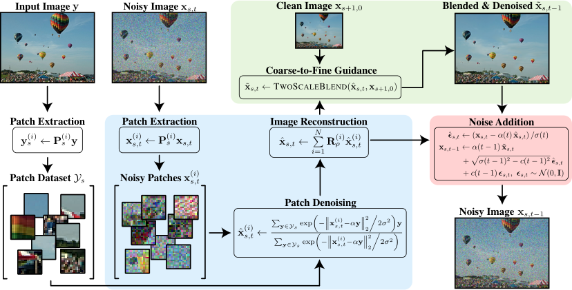
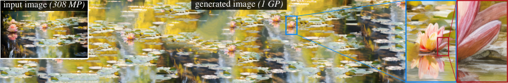

# AI Daily

## Efficient and Training-Free Single-Image Diffusion Models

> **今日選文**：CVPR 2026 Highlight；把單張參考圖像中的 patch 分布直接變成可計算的 diffusion prior，不需要為每張圖訓練 GAN 或 diffusion network。

### 基本資訊

- **論文標題**：Efficient and Training-Free Single-Image Diffusion Models
- **作者**：Haojun Qiu、Kiriakos N. Kutulakos、David B. Lindell
- **研究單位**：University of Toronto、Vector Institute
- **發表會議**：CVPR 2026；官方頁面標示為 **Highlight**，論文頁碼 36157–36167。[1] [2]
- **論文連結**：[arXiv:2606.04299](https://arxiv.org/abs/2606.04299)
- **專案頁面**：[efficient-SID](https://haojunqiu.github.io/efficient-SID/)
- **關鍵詞**：single-image generation、patch prior、closed-form denoiser、training-free、coarse-to-fine diffusion、latent diffusion、approximate nearest neighbors

### 為什麼今天選它？

今天的候選包含 Energy-Based Transformer、JEPA world model、Visual Autoregressive 與 training-free generation 等方向。Energy-Based Transformers are Scalable Learners and Thinkers 雖然非常符合偏好，但 `arXiv:2507.02092` 已經在本儲存庫的 2026-05 與 2026-07 文章中出現，因此排除重複。H-JEPA 是另一個值得追蹤的 JEPA 候選，但它主要研究長時域機器人規劃，不如本篇直接切入圖像生成。

本篇同時滿足三個條件：它是頂會論文、直接處理圖像生成，而且把「training-free」做成可分析的數學結構，而不是只把訓練步驟減少。它最值得讀的地方，是把 diffusion denoiser 重新解釋成有限 patch 資料集上的 **kernel regression／soft retrieval／attention**，並用 coarse-to-fine sampling 解決單一尺度只能保存局部紋理、不能保存全局布局的問題。[1] [2]

## 一句話摘要

給定一張參考圖像，先在多個尺度收集重疊 patches；每個 noisy patch 都用對所有 clean patches 的高斯相似度加權平均來去噪；再把去噪 patches 拼回圖像，並從粗尺度向細尺度逐步加入結構與細節。因為 patch 資料集有限且每個 patch 維度小，這個 denoiser 可以直接閉式計算，不需要針對輸入圖像更新神經網路參數。

*圖 1。論文 Figure 2 的聚焦方法圖；可把整個方法讀成「patch extraction → kernel denoising → image reconstruction → coarse-to-fine blending → noise update」。[1]*

## 核心貢獻與創新點

### 1. 用單張圖像的 patch dataset 取代神經網路 prior

一張圖像並不是一筆資料，而是包含了從局部紋理到較大結構的數千甚至數百萬個 patch。論文令這些 patch 組成有限資料集

$$\mathcal{Y}=\{\mathbf{y}^{(1)},\ldots,\mathbf{y}^{(Y)}\}.$$

與在整張圖像空間學習一個高維 score network 不同，作者只在低維 patch 空間對這個有限經驗分布做推論。這讓 closed-form denoiser 變得可計算，也把模型的內容來源限制在輸入圖像所提供的 patch 統計之內。[1] [3]

### 2. Closed-form denoiser：diffusion 的最小均方誤差估計

Diffusion forward process 將 clean signal \(\mathbf{y}\) 加上 noise：

$$\mathbf{x}_t=\alpha(t)\mathbf{y}+\sigma(t)\boldsymbol{\epsilon}, \qquad \boldsymbol{\epsilon}\sim\mathcal{N}(\mathbf{0},\mathbf{I}),$$

其中論文使用的邊界條件是

$$\alpha(0)=\sigma(T)=1, \qquad \alpha(T)=\sigma(0)=0.$$

對 noisy patch \(\mathbf{x}_t\)，論文的 closed-form denoiser 是

$$D(\mathbf{x}_t,\mathcal{Y},t) = \frac{ \displaystyle\sum_{\mathbf{y}\in\mathcal{Y}} \exp\left(-\frac{\|\mathbf{x}_t-\alpha(t)\mathbf{y}\|_2^2}{2\sigma(t)^2}\right)\mathbf{y} }{ \displaystyle\sum_{\mathbf{y}\in\mathcal{Y}} \exp\left(-\frac{\|\mathbf{x}_t-\alpha(t)\mathbf{y}\|_2^2}{2\sigma(t)^2}\right) }. \tag{1}$$

令

$$w_j(\mathbf{x}_t,t) =\operatorname{softmax}_j\left( -\frac{\|\mathbf{x}_t-\alpha(t)\mathbf{y}^{(j)}\|_2^2}{2\sigma(t)^2} \right),$$

則式 (1) 可寫成

$$D(\mathbf{x}_t,\mathcal{Y},t) =\sum_{j=1}^{Y}w_j(\mathbf{x}_t,t)\mathbf{y}^{(j)}. \tag{2}$$

因此它不是一般意義上的 nearest-neighbor copy，而是對所有候選 patch 做 temperature 由 \(\sigma(t)^2\) 控制的 soft retrieval。當 noise 很大時，權重較平滑，模型會融合較多 patch；當 noise 變小時，權重會集中到與 noisy patch 最相似的候選。

從機率角度看，這等價於以每個 clean patch 為中心、共變異數為 \(\sigma^2\mathbf{I}\) 的 empirical Gaussian mixture 之 posterior mean。當 \(\sigma\to0\) 時，它趨近於 empirical patch prior 的精確估計；在有限 patch 空間中，這個 posterior mean 也是 noisy observation 下的 MMSE estimator。[1] [5]

### 3. Patch-level denoising 與 image reconstruction

令 \(\mathbf{P}^{(i)}\) 抽取第 \(i\) 個 patch，\(\mathbf{R}^{(i)}_\rho\) 將去噪後 patch 放回圖像。每個 timestep 先計算

$$\mathbf{x}^{(i)}_t=\mathbf{P}^{(i)}\mathbf{x}_t, \qquad \hat{\mathbf{x}}^{(i)}_t=D(\mathbf{x}^{(i)}_t,\mathcal{Y},t),$$

再用加權重建得到整張圖像：

$$\hat{\mathbf{x}}_t =\sum_{i=1}^{N}\mathbf{R}^{(i)}_\rho\hat{\mathbf{x}}^{(i)}_t. \tag{3}$$

\(\rho\) 控制每個 patch 從中心向外的 Gaussian blending 寬度。這一步很重要：如果只是逐 patch 做 nearest-neighbor replacement，patch 邊界與全局一致性會很脆弱；重疊 patch 的加權重建則把 local evidence 組合成整張 image estimate。

### 4. Reverse diffusion 與 coarse-to-fine guidance

先由 denoiser 得到 clean estimate \(\hat{\mathbf{x}}_t\)，再估計 noise：

$$\hat{\boldsymbol{\epsilon}}_t =\frac{\mathbf{x}_t-\alpha(t)\hat{\mathbf{x}}_t}{\sigma(t)}.$$

之後以論文的 stochastic reverse update 產生 \(\mathbf{x}_{t-1}\)：

$$\mathbf{x}_{t-1} =\alpha(t-1)\hat{\mathbf{x}}_t +\sqrt{\sigma(t-1)^2-c(t-1)^2}\,\hat{\boldsymbol{\epsilon}}_t +c(t-1)\boldsymbol{\epsilon}_t,$$

其中 \(\boldsymbol{\epsilon}_t\sim\mathcal{N}(\mathbf{0},\mathbf{I})\)，而 \(\eta(t)=c(t)/\sigma(t)\in[0,1]\) 控制採樣隨機性。

單一尺度的 sampling 能保存 patch 紋理，但不保證生成結果保有參考圖像的全局布局。作者因此建立影像金字塔 \(\{\mathbf{x}_{s,t}\}_{s=0}^{S}\)，先生成最粗尺度，再逐步向細尺度推進。對於細尺度 \(s<S\)，將當前尺度的高頻資訊與已完成的粗尺度結果融合：

$$\tilde{\mathbf{x}}_{s,t} =\hat{\mathbf{x}}_{s,t} -\operatorname{Blur}(\hat{\mathbf{x}}_{s,t}) +\operatorname{Upsample}(\mathbf{x}_{s+1,0}). \tag{4}$$

式 (4) 的直覺是：目前尺度提供細節，較粗尺度提供低頻布局。這是類似 Laplacian pyramid 的 two-scale blend，但被放進每一個 reverse diffusion timestep 中。[1]

### 5. 把 denoiser 改寫成 attention，讓 training-free 也能有效率

式 (1) 的 kernel weight 可以展開為

$$-\frac{\|\mathbf{x}_t-\alpha\mathbf{y}\|_2^2}{2\sigma^2} =\frac{\alpha}{\sigma^2}\mathbf{x}_t^{\top}\mathbf{y} -\frac{\|\mathbf{x}_t\|_2^2}{2\sigma^2} -\frac{\alpha^2\|\mathbf{y}\|_2^2}{2\sigma^2}.$$

對固定 query 而言，第二項是共同常數；若把 query、key、value 做適當縮放，patch denoising 就能表成 scaled dot-product attention。作者因此直接使用 fused attention kernel，而不是另外寫一個專用的 quadratic kernel。這是本篇最能連接你近期關注的 **attention modulation** 與 **Energy-based Transformer** 的地方：模型表面上是 diffusion denoiser，計算核心卻是以距離定義 logit 的 attention。

三個加速來源如下：

1. **Fused attention**：將 exact patch denoising 映射到 FlashAttention 類 kernel。
2. **Latent diffusion**：使用 FLUX VAE 將空間尺寸每邊壓縮 8 倍，使 patch 數量約少 64 倍；在 quadratic denoiser 下，每步 FLOPs 約可少至原來的 \(1/4096\)。
3. **Approximate nearest neighbors（ANN）**：先將 patches 分群，只探測距離較近的 cluster，把每步成本從 \(O(N^2)\) 降到約 \(O(N^{3/2})\)。

## 實驗結果

### Unconditional single-image generation

作者在 15 張輸入圖像上各生成 50 個樣本，報告 SIFID、NIQE、NIMA、MUSIQ，以及 pixel／LPIPS diversity。以預設的 \(T=10,\eta=0\) 為例，方法得到：[1]

- **SIFID**：\(0.29\pm0.39\)；SinDDM 為 \(0.48\pm0.62\)，但 GPNN 與 GPDM 分別為 \(0.06\pm0.11\) 與 \(0.015\pm0.01\)。作者指出後兩者經常產生幾乎等同輸入圖像的近重複樣本，因此低 SIFID 不代表更好的多樣性。
- **No-reference quality**：NIQE \(8.08\pm3.23\)、NIMA \(4.53\pm0.45\)、MUSIQ \(55.41\pm11.05\)。
- **多樣性**：pixel diversity \(0.15\pm0.04\)、LPIPS diversity \(0.49\pm0.07\)，均高於 SinDDM 的 \(0.11\pm0.03\) 與 \(0.41\pm0.07\)。
- **訓練時間**：0；對照的 SinDDM、SinFusion、SinDiffusion 在表中分別需要約 10.0、3.2、5.4 小時（TITAN RTX）。
- **速度與品質折衷**：使用 ANN、\(k=5\) 後，SIFID 為 \(0.38\pm0.52\)，LPIPS diversity 為 \(0.50\pm0.08\)，A6000 平均推理時間由 3.09 秒降到 0.88 秒。

\(T=40,\eta=1\) 可將 SIFID 改善到 \(0.21\pm0.29\)，但 inference time 上升到 A6000 的 12.57 秒，且 diversity 降低。這顯示 diffusion steps 與 stochasticity 並不是免費的品質旋鈕。

*圖 2。論文 Figure 5 的聚焦結果圖；輸入 308 MP，輸出尺寸為 \(14336\times70080\)，作者報告在 NVIDIA RTX A6000 PRO 上以 \(T=20,\eta=1,k=5\) 需要 13.9 分鐘。[1]*

### Resolution scaling

Table 2 顯示三個加速手段的疊加效果。以 \(1024^2\) 為例，naive implementation 需要 733.75 秒；加 fused attention 後為 401.79 秒；改到 latent space 後為 0.65 秒；再加 ANN 為 1.30 秒。對 \(8192^2\) 影像，latent-only 為 523.97 秒，latent + ANN 降到 69.39 秒。作者因此報告在 16 MP 尺度上相對 naive implementation 可超過 \(1000\times\) 加速。[1]

這裡要分清楚兩種速度敘述：

- **「megapixel in one second」** 是專案與摘要中的 headline，代表配合選定的解析度、latent、kernel 與 ANN 設定的展示結果。[2] [3]
- **Table 2 的逐解析度數字** 是較可重現的硬體與設定對照；例如 \(1024^2\) 的完整 latent + ANN 組合為 1.30 秒，並非所有 megapixel 設定都低於 1 秒。

### Applications

本篇不是只能做 unconditional texture synthesis，而是把 closed-form prior 放進可控制的 diffusion loop：

- **Image retargeting**：先把輸入圖像降到最粗尺度，改成目標 aspect ratio，再由 coarse-to-fine sampling 補回細節，避免直接 resize 造成物體變形。
- **Image symmetrization 與 tileable generation**：在每個 timestep 對 denoised image 加入水平／垂直翻轉或 circular shift 的一致性約束，生成可對稱或無縫拼接的結果。
- **Structural analogy**：用一張圖像的 style／patch distribution 與另一張圖像的 coarse structure 組合，讓 style prior 仍然來自輸入圖像，而不是大型網路的網路級先驗。
- **Text-guided stylization**：透過 CLIP 影像—文字相似度做 guidance。論文的更新可概念化為
  $$\hat{\mathbf{x}}_{t,\mathrm{CLIP}} = \gamma\nabla_{\hat{\mathbf{x}}_t}\mathcal{L}_{\mathrm{CLIP}} +\lambda\hat{\mathbf{x}}_t +(1-\lambda)\hat{\mathbf{x}}_{t+1,\mathrm{CLIP}},$$
  其中 momentum 項降低 CLIP 操作被下一步 denoising 覆蓋的程度。[1]

## 相關研究脈絡

### 從 single-image GAN 到 single-image diffusion

SinGAN、InGAN 等方法早期以單張圖像學習多尺度 patch statistics，但需要針對每張輸入圖像訓練生成器，而且 GAN 對 text guidance 與多種 constraints 不自然。SinDDM、SinFusion 與 SinDiffusion 將這個問題改寫成 diffusion learning，改善品質與 diversity，但仍需每張圖像花費數小時做 optimization。[4]

本篇的差異不是單純把訓練器換小，而是直接把「單張圖像的有限 patch empirical distribution」拿來計算 denoiser；因此它更接近從 learned prior 轉向 **analytic prior + iterative inference**。

### 從 patch nearest neighbor 到可微的 soft patch retrieval

GPNN 展示了 patch nearest-neighbor 方法可以在不訓練 GAN 的情況下完成單圖生成與操控。[6] 本篇保留 patch-based modeling 的可追溯性與低資料需求，但用高斯權重的 soft average 取代硬 nearest neighbor，再接上 diffusion reverse process。這使它能自然加入 stochasticity、latent diffusion、CLIP guidance、symmetry constraint 與 retargeting。

### Closed-form diffusion 與本篇的可計算條件

Closed-Form Diffusion Models 已指出，在有限資料集上可以直接從經驗分布建立不需要訓練的 score-based generator。[5] 本篇的關鍵工程與建模選擇是把資料單位縮小到 **單張圖像的低維 patch**，並透過多尺度與重疊重建恢復全局影像結構。這避開了整張自然影像資料集的高維求和，也降低直接在大型資料集上 closed-form estimator 退化成 memorization 的風險。

PaDIS 則使用 patch-based diffusion prior 來解決 CT、deblurring 與 super-resolution 等 inverse problems，代表 patch prior 不只可做生成，也可以作為資料稀缺下的恢復先驗。[7] 本篇把同樣的 patch 可計算性推進到單圖生成與高解析度 synthesis。

NIFTY 是同期很接近的方向：它也以 non-local patch matching 與 flow matching 做 training-free exemplar-based texture synthesis，但重點更偏 texture synthesis；本篇則明確處理 global layout、text-guided stylization、retargeting 與 gigapixel generation。[8]

## 與你近期關注方向的連接

### 1. Energy-based Transformer：從解析 compatibility energy 到可學習 residual energy

把每個 patch 候選的負距離寫成 energy：

$$E_t(\mathbf{x}_t,\mathbf{y}) =\frac{\|\mathbf{x}_t-\alpha_t\mathbf{y}\|_2^2}{2\sigma_t^2}.$$

本篇的 denoiser 其實是在這個 energy landscape 上做 soft minimum：低 energy 的 patch 取得較高權重。與 EBT 不同的是，這個 energy 不是透過 Transformer 學出來的，也沒有對 candidate image 做 gradient-based energy minimization；它是由 patch geometry 直接決定的。[9]

可以延伸出一個很具體的研究問題：保留解析 patch energy 作為穩定 prior，再學一個小型 residual

$$E_{\theta}(\mathbf{x}_t,\mathbf{y}) =E_{\mathrm{patch}}(\mathbf{x}_t,\mathbf{y}) +\lambda E_{\theta}^{\mathrm{semantic}}(\mathbf{x}_t,\mathbf{y},c),$$

其中 \(c\) 可以是文字、JEPA latent 或 layout condition。這種 hybrid EBT 可能比從零學 energy 更容易穩定，也更能解釋「模型正在驗證什麼」。

### 2. JEPA：讓 patch prior 從像素相似度走向預測相似度

本篇的相似度主要是 pixel-space Gaussian distance。若參考圖像存在光照、局部變形或風格變化，pixel distance 可能把真正相同的語義 patch 視為不相似。可以加入 frozen 或 jointly trained JEPA encoder \(f\)，把 energy 改為

$$E_{\mathrm{hybrid}} =\beta_t\frac{\|\mathbf{x}_t-\alpha_t\mathbf{y}\|_2^2}{2\sigma_t^2} +(1-\beta_t)\frac{\|f(\mathbf{x}_t)-f(\mathbf{y})\|_2^2}{2\tau^2}.$$

在低 noise、需要細節時提高 pixel term；在高 noise、需要結構時提高 JEPA term。另一條路是用 JEPA predictive disagreement 估計候選 patch 的不確定性，動態決定每個 patch 要看多少 ANN clusters 或要跑多少 denoising steps。[10]

### 3. VAR：把 coarse-to-fine pyramid 變成 learned next-scale prediction

本篇的 coarse-to-fine guidance 使用 blur、upsample 與 high-pass blend；VAR 則把影像生成直接寫成 next-scale prediction。兩者共享一個重要設計：先決定低頻／粗粒度結構，再逐步補細節。[11]

一個值得測試的 hybrid 是

$$p(\mathbf{x}_{0:S}) =\prod_{s=0}^{S}p_{\theta} \left(\mathbf{x}_s\mid\mathbf{x}_{s+1},\mathcal{Y}_s\right),$$

其中 \(\mathcal{Y}_s\) 是第 \(s\) 個尺度的 patch prior，而 \(p_\theta\) 由 VAR-style next-scale predictor 參數化。這樣可以把本篇的 training-free patch constraint 與 VAR 的 learned global planning 結合，減少目前 blur-based blend 對 heuristic 的依賴。

### 4. Training-free、attention modulation 與 zero-shot 的嚴格定義

本篇的 **training-free** 是指不針對每張 reference image 更新生成網路參數；它不代表整個 pipeline 完全不使用預訓練模型。latent 版本依賴預訓練 VAE，text-guided stylization 依賴 CLIP，且輸入本身仍然提供了大量 patch data。

它也不是一般意義上的 open-vocabulary zero-shot text-to-image。更精確的說法是：對一張未見過的參考圖像，無需 per-image optimization，就能執行 single-image generation、retargeting、symmetrization 與 style transfer。這個區分很重要，否則很容易把「免訓練的 reference-conditioned generation」誤寫成「無條件的 zero-shot foundation model」。

此外，本篇沒有把 attention 作為一個學習到的 semantic modulation policy；attention 主要是 denoiser 的精確計算重寫與加速介面。若要對接你關注的 attention modulation，可以直接對 kernel logit 加上 spatial、scale 或 uncertainty bias：

$$\ell_{ij} =-\frac{\|\mathbf{x}^{(i)}_t-\alpha_t\mathbf{y}^{(j)}\|_2^2}{2\sigma_t^2} +b_{ij}^{\mathrm{layout}} +b_{ij}^{\mathrm{JEPA}} +b_{ij}^{\mathrm{energy}}.$$

這能在不改動 backbone 的情況下，把 training-free 控制寫成可分析的 logit-space intervention。

## 限制與需要小心解讀的地方

1. **它是 reference-specific prior，不是通用生成模型。** 如果輸入圖像沒有某種物體、材質或語義，模型不會像網路規模的 text-to-image model 一樣憑空補出可靠的新概念。
2. **全局一致性仍依賴 coarse-to-fine heuristic。** 式 (4) 的 blur、upsample、patch size、\(\rho\)、尺度數與 diffusion steps 都會影響結果；這些不是由一個 end-to-end learned controller 自動決定。
3. **精確 denoiser 的成本仍是 quadratic。** FlashAttention、latent VAE 與 ANN 使它可用，但 ANN 將 SIFID 從 \(0.29\) 變成 \(0.38\)，說明速度與 fidelity 存在實際 trade-off。
4. **評估偏重單圖生成特定指標。** SIFID 很適合衡量與輸入圖像 patch distribution 的距離，但如果只看 SIFID，GPNN／GPDM 的近重複樣本可能看起來過度優秀，所以必須同時看 pixel diversity、LPIPS diversity 與人工檢查。
5. **預訓練依賴仍存在。** 只要使用 latent diffusion 或 CLIP guidance，pipeline 就不再是完全由單張圖像與基本運算構成；作者的核心 denoiser 是 training-free，但整個應用系統仍可能依賴外部 VAE／vision-language encoder。
6. **高解析度結果不代表所有場景都能即時生成。** 1 GP 的 13.9 分鐘展示很有說服力，但它使用特定硬體、\(T=20\)、ANN 與 latent 設定；不能直接外推到一般 GPU 或任意輸入尺寸。

## 個人評價與研究意義

我給這篇論文 **4.5 / 5**。它的價值不在於「單張圖也能生成」這個任務本身，而在於它把一個通常需要內部學習的 generative prior，重新拆成可驗證的三層：**patch-level empirical distribution、diffusion-time posterior mean、coarse-to-fine global assembly**。

這讓 training-free generation 不再只是工程 trick，而是一個能與 classical non-local means、kernel regression、attention、flow schedule 與 diffusion score 串起來的分析對象。特別值得記住的是：式 (1) 看起來像 denoising，但展開後就是以 negative squared distance 定義的 attention logits；這提供了一個很自然的語言，把「patch prior、energy、attention modulation」放進同一個框架。

對你目前的研究方向，我認為最值得追的是 **解析 prior + 可學習 verifier 的 hybrid**：低階 patch energy 保持 provenance 與穩定性；JEPA latent 負責跨光照與語義不變性；VAR next-scale predictor 負責全局布局；最後由 EBT-style energy 或 predictive disagreement 決定哪些 patch、哪些尺度值得增加 compute。這比單純再加一個 guidance scale 更可能形成新的模型介面。

## References

[1]: https://arxiv.org/abs/2606.04299 "Efficient and Training-Free Single-Image Diffusion Models"
[2]: https://cvpr.thecvf.com/virtual/2026/poster/38208 "CVPR 2026 official page — Efficient and Training-Free Single-Image Diffusion Models"
[3]: https://haojunqiu.github.io/efficient-SID/ "efficient-SID project page"
[4]: https://arxiv.org/abs/2211.16582 "SinDDM: A Single Image Denoising Diffusion Model"
[5]: https://arxiv.org/abs/2310.12395 "Closed-Form Diffusion Models"
[6]: https://arxiv.org/abs/2103.15545 "Drop the GAN: In Defense of Patches Nearest Neighbors as Single Image Generative Models"
[7]: https://neurips.cc/virtual/2024/poster/95843 "Learning Image Priors Through Patch-Based Diffusion Models for Solving Inverse Problems"
[8]: https://arxiv.org/abs/2509.22318 "NIFTY: A non-local image flow matching for texture synthesis"
[9]: https://arxiv.org/abs/2507.02092 "Energy-Based Transformers are Scalable Learners and Thinkers"
[10]: https://arxiv.org/abs/2301.08243 "Self-Supervised Learning from Images with a Joint-Embedding Predictive Architecture"
[11]: https://arxiv.org/abs/2404.02905 "Scalable Image Generation via Next-Scale Prediction"
