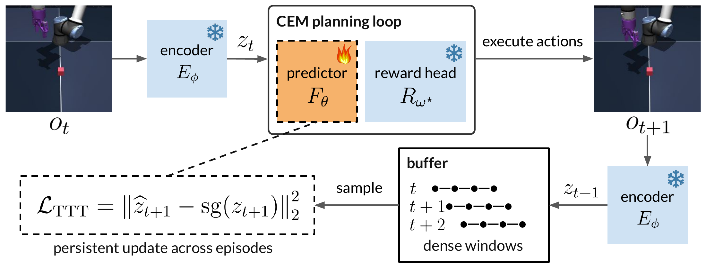
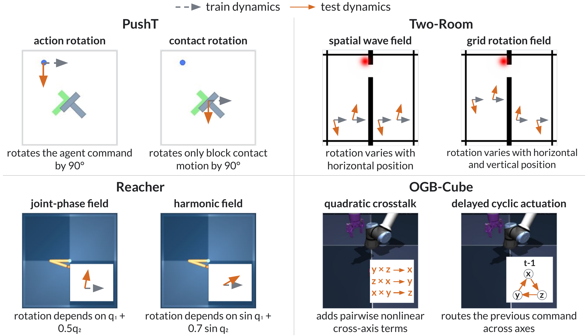
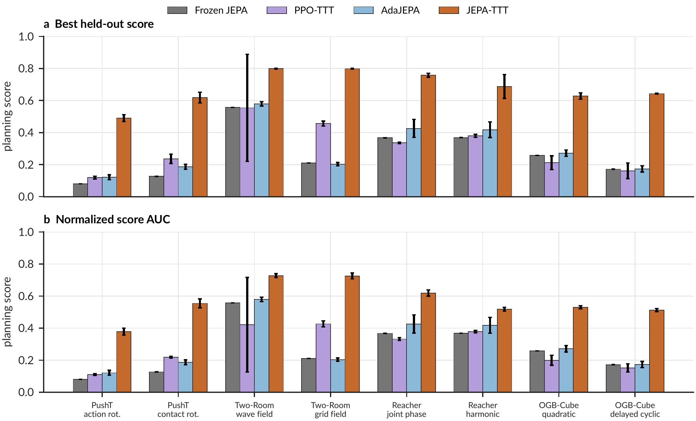
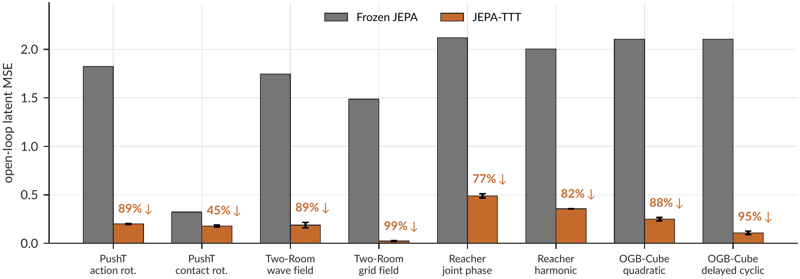

# AI Daily

## 2026-10-08｜JEPA-TTT：讓 Latent World Model 在部署期間持續適應 Dynamics Shift

> **一句話結論：** JEPA-TTT 不重新訓練整個世界模型，也不修改視覺 encoder 或 reward head；它只用部署時觀察到的 `(action, next observation)`，更新 latent dynamics predictor，並把 predictor、optimizer state 與 replay buffer 跨 episode 保留下來。這讓一個在訓練動力學上學到的 action-conditioned JEPA，在測試動力學改變後逐步恢復規劃能力。它很適合用來思考 **JEPA、test-time training、predictive world model 與 adaptive planning** 的交集，但必須注意：它不是嚴格意義上的 training-free 或 zero-shot inference，而是部署期間的 online self-supervised adaptation。

## 論文基本資訊

| 欄位 | 資訊 |
|---|---|
| 論文標題 | *JEPA-TTT: Persistent Test-Time Training of Latent World Models for Planning under Dynamics Shifts* |
| 作者 | Zheyuan Zhang、Suyu Ye、Nakul Agarwal、Hossein Nourkhiz Mahjoub、Ehsan Moradi Pari、Daniel Khashabi、Tianmin Shu、Vaishnav Tadiparthi [1] [3] |
| 研究單位 | Honda Research Institute USA、Johns Hopkins University [1] [3] |
| 發表狀態 | arXiv v1，2026-09-30；論文與作者專案頁標示為 **World Models in Physical AI Workshop @ NeurIPS 2026**。該 workshop 官方頁明確說 accepted work 是 **non-archival**，並由 OpenReview 管理，因此不能寫成 NeurIPS 2026 主會議論文 [1] [3] [4] |
| 主題 | JEPA、latent world model、test-time training、model predictive control、dynamics shift、dense replay |
| 論文連結 | [arXiv abstract][1]、[arXiv HTML 全文][2]、[官方 project page][3] |
| Repo 去重 | 已在新增前檢查 `KaiCobra/AI_Daily` 的 `README.md`、`INDEX.md` 與既有文章；`arXiv:2610.00722` 及完整標題均未出現。 |

## 為什麼值得讀？

世界模型的規劃依賴一個很強的假設：模型在訓練時看到的 transition dynamics，部署時仍然成立。如果訓練時某個 action 會把物體往右推，部署時它卻因為 actuator、接觸反應或控制延遲而把物體往別的方向推，那麼 planner 即使使用正確的任務分數，也會因為預測錯誤而把候選 action 排錯。

JEPA-TTT 把問題切得很乾淨。它只改變 transition dynamics，保留 state/action space、observation mapping、task score、initial-state distribution 與 episode horizon。如此一來，若性能恢復，就比較能把功勞歸因於 **dynamics predictor 的適應**，而不是模型換了表示、reward 或任務目標 [2]。

這個切法也讓它和使用者關注的幾條路線產生直接連結：JEPA 提供可預測的 latent space；test-time training 提供部署期間的適應機制；CEM/MPC 把 latent prediction 轉成實際 action selection；dense replay 則決定 online data 如何被重新組織。論文的主要價值不是提出更大的 backbone，而是把「世界模型如何在環境變了之後繼續學」變成一個可測量的 predictor-level problem。

*圖 1。論文方法總覽。圖中藍色部分是固定的 visual encoder 與 reward head，橘色 predictor 才在 test time 更新；這是官方 project page 的聚焦 figure，不是整個網頁截圖 [3]。*

## 核心貢獻與創新點

### 1. 只適應 dynamics predictor，固定 representation 與 task objective

模型以視覺 encoder $E_\phi$ 把 observation 轉成 latent：

$$
z_k = E_\phi(x_k).
$$

latent dynamics predictor $F_\theta$ 根據前 $C$ 個 latent states 與 action blocks，預測下一個 latent：

$$
\widehat{z}_{k+1}
=F_\theta\left(z_{k-C+1:k}, b_{k-C+1:k}\right).
$$

可更新的部分包含 action encoder、autoregressive predictor 與 prediction projection；visual encoder、latent projector、reward head 與 decoder 都保持固定。論文附錄中的共同設定是 224×224 RGB 輸入、ViT-Tiny encoder、192 維 latent、6 層 Transformer predictor、16 個 attention heads，以及 2048 維 MLP [2]。

因為 test time 不使用 online reward，也不提供 goal image，作者在 offline training 後先用 observation–score pairs 訓練 reward head：

$$
\omega^*
=\arg\min_{\omega}
\mathbb{E}_{(o,y)\sim\mathcal{D}^{r}_{\mathrm{train}}}
\left[
\left(R_\omega(E_\phi(o))-y\right)^2
\right].
$$

$E_\phi$ 與 $R_{\omega^*}$ 在部署期間都不變。這個設計把兩種學習分開：reward head 負責「什麼狀態是好狀態」，predictor 負責「執行 action 之後會到哪裡」。因此規劃能力的恢復必須來自更準確的 dynamics prediction，而不是偷偷調整任務目標 [2]。

### 2. 以 CEM/MPC 將 latent prediction 變成規劃

每次 replanning 時，Cross-Entropy Method（CEM）產生多組候選 action-block sequence。對候選序列

$$
\mathbf{b}=(b_k,\ldots,b_{k+H-1}),
$$

predictor 在 latent space 中 autoregressively rollout，固定 reward head 再計算 discounted predicted return：

$$
\widehat{J}_k(\mathbf{b})
=\sum_{h=1}^{H}\gamma^h
R_{\omega^*}\left(
\widehat{z}_{k+h}(\mathbf{b},\theta_k)
\right).
$$

CEM 只執行最佳 sequence 的第一個 action block，觀察下一個結果後重新規劃。實驗採 256 個 candidates、6 次 CEM iteration、32 個 elites、5 個 world-model blocks 的 planning horizon，每次執行 1 個由 5 個 raw actions 組成的 block，discount 為 0.99 [2]。

這個 loop 的關鍵是：**同一個 frozen reward head，在不同 predictor 下可以對同一批候選計畫產生不同排序。** 例如 Figure 3 中，Frozen JEPA 認為 Plan A 比 Plan B 好；但實際 ground-truth rollout 是 B 比 A 好。JEPA-TTT 讓 predictor 適應後，重新恢復正確排序 [2]。

### 3. 用 frozen encoder 的 latent target 做 self-supervised TTT

在部署過程中，agent 儲存 observation 與已執行的 actions。對一個包含 $C+1$ 個 encoded observations 的 window $w$，frozen encoder 產生目標 latent $(z_{w,0},\ldots,z_{w,C})$。predictor 從歷史 context 與 executed actions rollout，並最小化：

$$
\mathcal{L}_{\mathrm{TTT}}(\theta,\mathcal{B})
=\frac{1}{|\mathcal{B}|Cd_z}
\sum_{w\in\mathcal{B}}
\sum_{j=0}^{C-1}
\left\|
\widehat{z}_{w,j+1}(\theta)
-\operatorname{sg}(z_{w,j+1})
\right\|_2^2.
$$

其中 $\operatorname{sg}(\cdot)$ 是 stop-gradient。因為 encoder 固定，target representation 不會在 online update 中漂移；更新只作用在 $\theta$。當一個完整 minibatch 可用時，每個 replanning step 至多執行一次 AdamW update [2]。

### 4. Persistent state 與 dense replay 是方法的核心

JEPA-TTT 不只把資料存進 buffer；它明確把三種 state 都跨 episode 保存：predictor parameters $\theta$、optimizer state $\nu$，以及 replay buffer $Q$。若 episode $e$ 結束時的狀態是 $(\theta_{e,T_e},\nu_{e,T_e},Q_{e,T_e})$，下一個 episode 從同一狀態開始：

$$
(\theta_{e+1,0},\nu_{e+1,0},Q_{e+1,0})
=
(\theta_{e,T_e},\nu_{e,T_e},Q_{e,T_e}).
$$

Dense replay 則在每一個 environment step 都建立一個新的 prediction window，而不是只在 action-block boundary 建立。若每個 action block 含 $K$ 個 raw actions，dense construction 大約涵蓋 $K$ 種 temporal offsets；之後從所有累積 windows 中 uniform sample minibatch。這裡有三個可分離因素：

1. 額外 update 數量：sparse stream 與 compute-matched sparse stream 的差異。
2. temporal coverage：compute-matched sparse stream 與 dense stream 的差異。
3. replay：dense stream 與 dense replay 的差異；兩者看到相同的 dense window set，但後者從歷史 buffer 重新抽樣。

這個拆解很重要，因為「online adaptation 有效」和「哪些 data organization 讓 adaptation 有效」是兩個不同問題。論文的消融顯示，dense temporal coverage 帶來主要提升，replay 再提供小幅的額外收益 [2]。

*圖 2。PushT、Two-Room、Reacher 與 OGBench-Cube 的 test-time dynamics shift。這些是聚焦的原始 figure asset；並非整頁 paper screenshot [3]。*

## 實驗設計

論文使用四個 continuous-control environments，每個環境設計兩種固定且持續的 dynamics shift：

| 環境 | 兩種 test-time dynamics shift |
|---|---|
| PushT | 將 agent action 旋轉 90°；或只將 block contact-induced motion 旋轉 90° |
| Two-Room | 以 spatial wave field 旋轉 action；或以二維 grid field 旋轉 action |
| Reacher | 以 joint-phase field 或 harmonic field 旋轉 motor command |
| OGBench-Cube | 加入 nonlinear cross-axis coupling；或將 command 延遲一個 step 並循環路由到不同軸 |

每個 task 先在 training dynamics 下收集 3,000 個完整 episodes，訓練一個 LeWorldModel。LeWorldModel 是論文採用的 action-conditioned JEPA 預訓練基座；原始工作主張以 next-embedding prediction 加 Gaussian latent regularization，從 raw pixels 端到端學習 latent world model [5]。

每個 deployment 在單一固定 shift 下進行 500 episodes。模型在 episode 0、50、100，直到 500 評估一次，每次使用同一批 100 個 held-out episodes；每種 shift 使用 3 個 deployment runs。held-out evaluation trajectories 不會進入 adaptation buffer，因此評估不會直接污染 test-time training [2]。

作者比較四種方法：

- **Frozen JEPA：** 與 JEPA-TTT 使用同一個 pretrained world model、reward head 與 CEM，但完全不更新。
- **PPO-TTT：** 允許 PPO 在部署期間更新，但使用 oracle online environment rewards，因此是對 JEPA-TTT 不利／有利混合的參照：它有更多 supervision，卻不是同一類 planner。
- **AdaJEPA：** concurrent work，在 MPC loop 內從 observed transition 做 test-time adaptation；作者將它改成無 goal-image 的對照，並使用相同 frozen reward head 與 CEM [6]。
- **JEPA-TTT：** predictor、optimizer state 與 buffer 跨 episode 持續保存，且採 dense replay。

## 實驗結果與性能指標

*圖 3。Best held-out score 與 normalized planning-score AUC。圖表只保留方法結果本身，未截取整個瀏覽器畫面 [3]。*

### 1. 八個 shift 全部改善

主結果的 aggregate 指標如下：

| 方法 | Best held-out score | Mean AUC | Test-time online reward |
|---|---:|---:|---|
| Frozen JEPA | 0.267 | 0.267 | No |
| PPO-TTT | 0.307 | 0.279 | Yes，oracle |
| AdaJEPA | 0.297 | 0.297 | No |
| **JEPA-TTT** | **0.678** | **0.571** | **No** |

相對 Frozen JEPA，JEPA-TTT 的 best score 提升 **153%**，normalized AUC 提升 **113%**。這兩個 aggregate numbers 都是八個 shift 的平均，不是某一個環境的單點最佳結果。更重要的是，JEPA-TTT 在八個 shift 的兩種 planning metric 都勝過 Frozen JEPA、PPO-TTT 與 AdaJEPA [2] [3]。

Best score 是 episode 50 到 500 的評估中，三個 deployment runs 平均值的最大值；Mean AUC 是 episode 0 到 500 的 held-out planning-score 曲線做 trapezoidal integration，再除以 500 並對 runs 平均。前者看「最終能到達的最好狀態」，後者看「整段 adaptation 過程是否都有效」。

### 2. Latent prediction error 平均下降 83%

作者在固定的 test-dynamics trajectories 上，讓 Frozen JEPA 與 adapted predictor 看到完全相同的 observed context 與 future actions，接著不再提供中途 observations，autoregressively 預測五個 latent blocks。這是對 dynamics prediction 的直接比較，而非用 planner 的 reward 間接推論。

JEPA-TTT 在八個 shift 都降低五-block latent MSE，平均下降 **83%**；Figure 7 顯示不同 shift 的 relative reduction 約為 45% 到 99% [2] [3]。這個結果支持「規劃變好是因為 predictor 變準」的機制假說，但不能直接等同於 pixel-level reconstruction 變好，因為論文的主要模型是 latent world model。

*圖 4。不同 shift 下 frozen 與 adapted predictor 的 latent prediction error。這是 paper 的局部結果 figure；不同 task 的 latent magnitude 不應直接互相比較 [3]。*

### 3. Dense replay 與 persistence 的消融

四種 update rule 的 aggregate 結果是：

| Update rule | Mean best | Mean AUC |
|---|---:|---:|
| Sparse stream | 0.497 | 0.368 |
| Compute-matched sparse stream | 0.625 | 0.495 |
| Dense stream | 0.671 | 0.548 |
| **Dense replay** | **0.678** | **0.571** |

這個表格給出的訊息比單純的「replay 有效」更細緻。compute-matched sparse stream 比 sparse stream 好，表示增加 optimization budget 有幫助；dense stream 再比 compute-matched sparse 好，表示 temporal coverage 有幫助；dense replay 最後將 AUC 從 0.548 推到 0.571，表示從歷史 dense windows 重新抽樣仍有小幅收益 [2]。

更大的效應來自跨 episode persistence。在 matched control 中，若 predictor 與 optimizer state 每個 episode reset，mean best/AUC 是 0.289/0.273；若保留 adaptation state，則變成 0.729/0.637。這個對照幾乎直接回答論文標題中的 **Persistent**：adaptation 的價值不是只在單一 episode 內做一次局部修正，而是讓不同 episode 的經驗累積成可用的 dynamics memory [2]。

作者也做了 no-shift control。在 training dynamics 沒有改變時，continued training 的四-task average best score 為 0.691，Frozen JEPA 為 0.679；Mean AUC 則為 0.676，Frozen JEPA 為 0.679。改善小且不一致，說明方法的主要效益來自 dynamics shift，而不是無條件地繼續更新就會變好 [2]。

## 與相關研究的關係

### LeWorldModel：JEPA-TTT 的 pretrained base

LeWorldModel 以 next-embedding prediction 與 Gaussian latent regularization，嘗試從 raw pixels 端到端穩定訓練 JEPA world model，並把 latent space 用於 control 與物理結構 probing [5]。JEPA-TTT 不重新發明這個 pretraining objective，而是把問題往後推一步：**如果 LeWorldModel 已經訓練好，部署時 dynamics 改變，能否只調整 predictor？**

因此 JEPA-TTT 的新意不在更強的 representation learning loss，而在 deployment-time model adaptation protocol。它也保留 encoder，使 adaptation 的 target space 穩定，避免 predictor 與 target 一起漂移。

### AdaJEPA：最直接的 concurrent work

AdaJEPA 同樣在 MPC closed loop 內使用 observed transition 作為 self-supervised adaptation signal，並且只需要很少的 gradient steps [6]。JEPA-TTT 的差異有三個：第一，JEPA-TTT 將 predictor、optimizer state 與 buffer 跨 episode 保留；第二，它使用 dense replay 覆蓋 action block 內的 temporal offsets；第三，它在無 goal image、無 online reward 的條件下，以 frozen reward head 排序候選 plans。

所以兩者不是「誰完全取代誰」，而是可被視為兩個軸：AdaJEPA 強調 MPC 內即時 recalibration，JEPA-TTT 強調跨 episode 的 persistent memory 與 data organization。後續若要公平比較，應該在同一個 persistent／reset、goal／no-goal、reward／no-reward protocol 下分離各因素。

### DINO-WM：從 frozen visual features 到 JEPA latent predictor

DINO-WM 用 frozen DINOv2 spatial patch features 學 visual dynamics，並把 goal feature 當成 prediction target，實現無 expert demonstration、無 reward model 的 test-time action-sequence optimization [7]。它代表一條「不重建 pixel，直接在強 visual representation 上預測未來」的路線。

JEPA-TTT 的差異是：它研究的不是 task-agnostic goal-feature planning，而是已經具備 action-conditioned latent world model 後，如何面對 transition distribution shift。它固定 reward head，讓研究焦點落在 predictor 是否能重新學到新的 action consequences。

### V-JEPA 2 / V-JEPA 2-AC：JEPA 走向 physical planning

V-JEPA 2 先用大規模 video/image data 學習 video representation，再以少量 robot video post-train action-conditioned world model，展示 image-goal planning 與跨實驗室 zero-shot robot deployment [8]。JEPA-TTT 不具備同樣的 web-scale pretraining 或真實機器人驗證；它的問題更窄，但也更容易隔離與測量：固定 representation 和 reward，只觀察 deployment-time predictor adaptation。

## 個人評價與研究意義

### 我認為最有價值的地方

第一，論文將「世界模型在 shift 下失效」從模糊的 robustness claim 變成明確的 causal intervention：只改 $P(s'\mid s,a)$，不改 task objective 與 observation interface。這讓結果更容易解讀。

第二，persistent predictor、optimizer state 與 replay buffer 的聯合保存是比「加一個 online gradient step」更重要的設計。persistence matched control 的巨大差距，說明 test-time learning 的記憶形式本身就是方法的一部分。

第三，作者沒有把 training-time score 偷帶進 test-time update。reward head offline fit 完成後保持固定，TTT 只從 observation/action transition 學習。這對物理環境很重要，因為部署時常常只能得到 sensor observation，不能直接取得乾淨的 reward label。

### 必須保留的限制

這不是 strict zero-shot。部署前雖然不使用 target dynamics 的 offline training set，但 deployment 期間仍會累積 transition、更新 predictor，並使用 optimizer state。因此更準確的稱呼是 **online self-supervised test-time adaptation**，而不是 training-free inference。

它也只測試單次、固定不變的 dynamics shift。visual observation mapping、task score、action interface 與 episode horizon 都不變，所以不能直接宣稱能處理 camera shift、new object appearance、reward shift 或 action-space change。作者也沒有測試多次 dynamics change、回到 training dynamics 後的 retention、forward/backward transfer 或 catastrophic forgetting [2]。

此外，實驗是在四個受控 continuous-control environment 中完成，尚未展示真實機器人部署。三個 deployment runs 共享同一個 pretrained world model，主要反映 deployment/adaptation variability，而不是多個獨立 pretraining seed 的完整不確定性。最後，在我檢視的論文 HTML 與官方 project page 中沒有找到可直接下載的公開 code/checkpoint 連結；因此目前較容易做 protocol-level reproduction，較難做完整 training-level reproduction [2] [3]。

### 可以激發的研究方向

1. **Energy-based JEPA–MPC：** 在 frozen reward head 之外，學一個 compatibility energy $E_\psi(z_t,a_t,z_{t+1})$，用它衡量 observed transition 與 predictor rollout 的一致性。energy 可用於 replay priority、uncertainty-aware CEM ranking，或判斷何時應該增加 test-time update；但要避免 energy model 改變 task objective，最乾淨的做法是把它當作 dynamics-consistency verifier，而不是 reward replacement。

2. **JEPA predictive disagreement 作為 adaptive compute：** 用多個 predictor heads、不同 replay subsets 或 temporal contexts 估計 disagreement。當 disagreement 高時增加 CEM candidates、rollout horizon 或 TTT updates；當 disagreement 低時維持少量 compute。這把「persistent learning」連到 inference-time adaptive compute，但需要測試 controller 是否會被自己的 uncertainty feedback loop 放大。

3. **VAR-style scale-wise world model：** 將目前單一 latent transition predictor 改成 coarse-to-fine latent scales。低頻 scale 先預測 scene-level dynamics，高頻 scale 再補 contact、速度或局部物件變化；dense replay 可以在不同 scale 使用不同 update frequency。這可能把 VAR 的 scale-wise factorization 與 JEPA 的 predictive latent space 接起來，但必須用 action-conditioned causal ablation 證明多尺度不是單純增加參數。

4. **Training-free controller 與 TTT 的清楚分界：** training-free attention modulation 可以用來調整 CEM proposal、latent context weighting 或 replay sampling，而不更新模型權重；JEPA-TTT 則負責真正的 predictor adaptation。將兩者放在同一 protocol 中，比較「只調推理路由」、「只更新 predictor」與「兩者結合」，可以更清楚回答何時需要學習、何時只需要 modulation。

5. **Strict zero-shot robustness protocol：** 建立四層 shift：只變 dynamics、只變 visual observation、只變 reward、同時變 dynamics+visual。對每層分別限制可用資訊，並報告 pre-deployment zero-shot、online self-supervised adaptation、以及 adaptation 後 retention。這會比把所有結果統稱 zero-shot 更能反映方法真正的泛化邊界。

## 最終判斷

JEPA-TTT 值得收錄在 AI Daily，因為它將 JEPA 從「預測式表徵／世界模型」往「部署期間持續校準的 latent dynamics」推進，而且用 persistent state、dense replay、planning score 與 open-loop latent MSE 把機制拆開測量。它不是 Energy-Based Transformer、VAR 或 training-free 方法本身；但對這些方向提供了一個很有用的接口：**用 predictive disagreement 或 energy consistency 來決定何時更新、更新哪個 latent scale，以及如何把 adaptation cost 放進 planning budget。**

## References

[1]: https://arxiv.org/abs/2610.00722 "JEPA-TTT: Persistent Test-Time Training of Latent World Models for Planning under Dynamics Shifts — arXiv abstract and metadata"
[2]: https://arxiv.org/html/2610.00722v1 "JEPA-TTT: Persistent Test-Time Training of Latent World Models for Planning under Dynamics Shifts — full HTML paper"
[3]: https://jepa-ttt.github.io/ "JEPA-TTT official project page"
[4]: https://www.worldmodels-physicalai.com/ "World Models in Physical AI — NeurIPS 2026 Workshop"
[5]: https://arxiv.org/abs/2603.19312 "LeWorldModel: Learning World Models with Joint-Embedding Predictive Architectures"
[6]: https://arxiv.org/abs/2606.32026 "AdaJEPA: Adaptive Latent World Models for Test-Time Planning"
[7]: https://arxiv.org/abs/2411.04983 "DINO-WM: World Models from Visual Features for Task-Agnostic Planning"
[8]: https://arxiv.org/abs/2506.09985 "V-JEPA 2: Self-Supervised Video Models Enable Understanding, Prediction and Planning in the Physical World"
