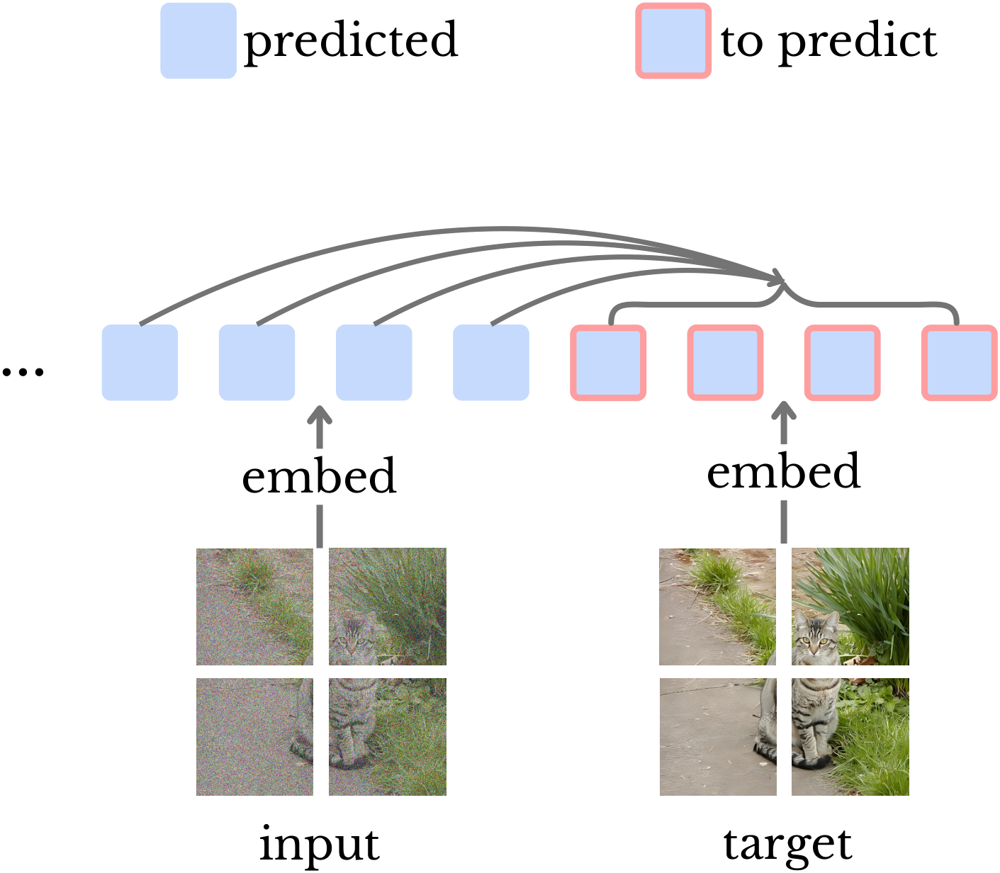
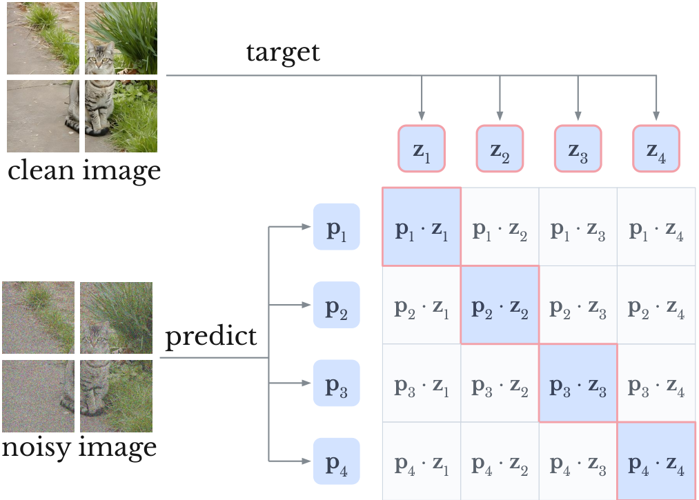
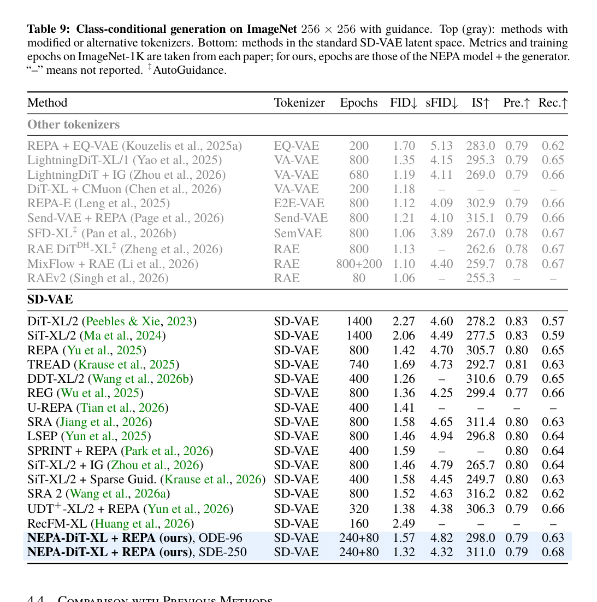
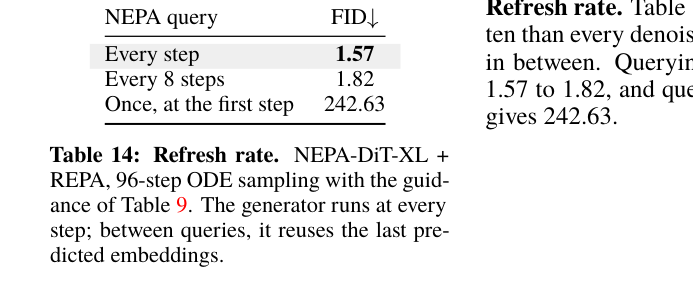

# AI Daily: Embedding Prediction Helps Image Generation

## 2026-10-03｜讓 DiT 的條件在每個去噪步驟重新預測

> **核心判斷：** 這篇工作的真正新意，不只是把一個視覺 encoder 接到 DiT 前面，而是把「條件」改造成會隨目前 noisy state 更新的預測式介面。NEPA 模型從類別條件與當前 noisy image 預測 clean-image embeddings，DiT 再用這些 embeddings 生成下一個狀態。這讓條件不再是 sampling 開始前固定算好的一個向量。

## 論文基本資訊

- **標題：** *Embedding Prediction Helps Image Generation*
- **作者：** Sihan Xu、Ji Xie、Zilin Wang、Hui Shen、Stella X. Yu
- **研究單位：** University of Michigan、Carnegie Mellon University；作者與機構資訊以論文首頁與 arXiv metadata 為準。[3] [12]
- **發表狀態：** arXiv v1 預印本，2026-10-01 提交；arXiv metadata 只列 project page，沒有可核驗的會議或期刊錄用資訊，因此截至 2026-10-03 不應寫成已發表或已錄用論文。[3]
- **論文連結：** [arXiv abstract](https://arxiv.org/abs/2610.02203)；[HTML 全文](https://arxiv.org/html/2610.02203v1)；[官方 project page](https://sihanxu.me/nepa-dit)
- **研究方向：** 預測式視覺表徵、JEPA-like representation prediction、Diffusion Transformer、Flow Matching、dynamic conditioning
- **本庫去重：** 已核對 `INDEX.md`、arXiv ID、完整標題與方法名稱；`2610.02203`、NEPA-DiT 與 ECG/MEP 均未出現在既有 AI Daily，故不是重複文章。

## 為什麼值得讀

一般 DiT 對 class label 或 text prompt 做一次 embedding，之後在整條 denoising trajectory 中重複使用同一份條件。這種介面把「條件的語義」與「目前影像狀態」分開了：noise 很大時，模型只能靠固定條件猜；接近 clean image 時，條件仍沒有直接讀取當前 sample 的機會。

NEPA-DiT 把這個介面改成閉環。NEPA 每個 denoising step 都讀取當前 $x_t$，預測 clean image 的 patch embeddings，再把預測結果送進 generator。這個想法與 JEPA 的「預測 latent representation」有明確親緣關係，但它不是標準 I-JEPA：I-JEPA 從 context block 預測 target block representation，目標是學習語義表徵；本篇則把預測出的 embedding 直接當作生成器的條件，並且讓輸入中的 noisy image 隨 sampling 更新。[2] [8]

*圖 1。論文方法總覽的局部資產；藍色表示已知或輸入 embedding，紅框表示需要預測的 clean-image embedding。[2]*

## 核心貢獻

### 1. Multi-Embedding Prediction：一次預測整張 clean image 的 embeddings

原始 NEPA 將 next-token prediction 改成 next-embedding prediction：模型讀取一段連續 embeddings，直接預測下一個 embedding，而不是預測離散 token 或 RGB pixel。[7]

本篇觀察到，生成器需要的是整組 clean-image patch embeddings。如果仍然一次只預測一個 embedding，模型會把本來應該共同決定的 patch 拆成長序列。因此作者提出 **Multi-Embedding Prediction（MEP）**，讓同一個 context 一次預測接下來的 $K$ 個 embedding：

$$
\mathbf{p}_{n+1:n+K}=h_\theta(\mathbf{z}_{\le n}),
\qquad
\mathcal{L}_{\mathrm{MEP}}
=\frac{1}{K}\sum_{k=1}^{K}
\mathcal{D}(\mathbf{z}_{n+k},\mathbf{p}_{n+k}).
$$

當 $K=1$ 時，MEP 就退化為原始 NEPA。對圖像生成而言，作者令 $K=N$，也就是一次預測整張 clean image 的 $N$ 個 patch embeddings。[2]

### 2. 把生成過程寫成「condition → noisy image → clean image」

令 frozen SD-VAE encoder 將 256×256 圖像映射到 $32\times32\times4$ 的 latent。給定 clean latent $\mathbf{x}_0$、Gaussian noise $\boldsymbol{\epsilon}$ 與 noise level $t$，flow matching 使用

$$
\mathbf{x}_t=(1-t)\mathbf{x}_0+t\boldsymbol{\epsilon},
\qquad
\mathbf{v}_t=\boldsymbol{\epsilon}-\mathbf{x}_0.
$$

NEPA 的輸入序列不是一般的空間 patch 順序，而是：

$$
[c,\langle\mathrm{boi}\rangle,
\underbrace{\mathbf{z}_t}_{\text{noisy image patches}},
\underbrace{\mathbf{z}_0}_{\text{clean image patches to predict}}].
$$

因此，clean image embeddings 被視為 noisy image 之後「下一段」應該出現的 embedding。對第 $i$ 個 noisy patch 的輸出，對應第 $i$ 個 clean patch 的預測：

$$
\mathbf{p}=h_\theta([c,\langle\mathrm{boi}\rangle],\mathbf{z}_t),
\qquad
\mathcal{L}_{\mathrm{MEP}}=\mathcal{D}(\mathbf{z}_0,\mathbf{p}).
$$

這個排列方式很重要：它不是要求模型自回歸地先預測左上角，再逐 patch 生成，而是讓每個 clean patch 都使用完整 noisy image context。

### 3. InfoNCE 保留 patch-level identity，而非把 embedding 平均化

作者比較 cosine similarity、MSE 與 InfoNCE。最終使用 predicted embeddings 作 query、clean embeddings 作 key，正樣本位於對角線，其餘同一張圖的 patch 作 negatives：

$$
\mathcal{D}(\mathbf{z}_0,\mathbf{p})
=-\frac{1}{N}\sum_{i=1}^{N}
\log
\frac{\exp(\mathbf{p}_i^\top\mathbf{z}_{0,i})}
{\sum_{j=1}^{N}\exp(\mathbf{p}_i^\top\mathbf{z}_{0,j})}.
$$

直觀上，MSE 只要求 $\mathbf{p}_i$ 接近自己的 target；InfoNCE 額外要求它不要與同一張圖的其他 patch 混淆。作者的解釋是，這保留了對生成有用的局部差異，而不是只留下分類需要的平滑、全局語義。[2]

*圖 2。論文中的局部配對示意圖；對角線是 positives。[2]*

### 4. Embedding Conditioned Generation：每一步重新計算條件

第二階段固定 NEPA，只訓練 DiT generator。每一步先做

$$
\mathbf{p}_t
=h_\theta([c,\langle\mathrm{boi}\rangle],f(\mathbf{x}_t)),
$$

再將 $\mathbf{p}_t$ 傳給 generator。generator 使用 SD3 風格的 MM-DiT joint attention：predicted embeddings 與 noisy latent tokens 先走分離權重，再透過 joint attention 交換資訊，接著進入 single-stream blocks。generator 不再另外接 class embedding；timestep 則透過 adaLN 注入。[2]

其 flow-matching 目標為

$$
\mathcal{L}_{\mathrm{ECG}}
=\mathbb{E}_{\mathbf{x}_0,\boldsymbol{\epsilon},t,c}
\left[
 w(t)\left\|
 \mathbf{v}_t-G_\phi(\mathbf{x}_t,t,\mathbf{p}_t)
 \right\|^2
\right].
$$

這與普通 flow matching 的差別不在 vector-field target，而在 condition 從固定的 $c$ 變成依 $x_t$ 動態更新的 $\mathbf{p}_t$。因此 ECG 更像「condition-side feedback」：denoiser 仍預測 velocity，但另一個 predictor 同時估計 clean-image representation。

### 5. Cache prefix、但不能 cache noisy-image 部分

condition tokens 與 `<boi>` 組成不會 attend 到 image tokens 的 causal prefix，因此 NEPA 的 prefix KV cache 只需計算一次。每一步變動的是 noisy image tokens，所以它們必須重新 encode。[2]

Classifier-free guidance 也移到 predicted embedding space 的介面上。訓練時以 0.1 機率將 condition 替換為 learned null token；推理時分別得到 conditional 與 unconditional predicted embeddings，再對 generator velocity 做

$$
\hat{\mathbf{v}}_{\mathrm{cfg}}
=\hat{\mathbf{v}}_{\mathrm{uncond}}
+s\left(
\hat{\mathbf{v}}_{\mathrm{cond}}
-\hat{\mathbf{v}}_{\mathrm{uncond}}
\right).
$$

## 實驗結果

### 實驗設定

- Dataset：class-conditional ImageNet-1K，256×256。
- Latent：frozen SD-VAE，$32\times32\times4$。
- NEPA：B/L/XL 三種規模；主結果使用 NEPA-XL，patch size 4，即 64 個 predicted embeddings。
- Generator：DiT-B/L/XL；主結果使用 DiT-XL，generator patch size 2。
- 訓練：NEPA 先以 MEP 訓練 240 epochs，再固定 NEPA，generator 以 flow matching 訓練 400K iterations，也就是 80 epochs；batch size 256。[2]
- 評估：FID-50K；除非另有說明，消融與 scaling 用 64-step ODE、無 CFG。[2]

### 消融：預測目標的設計確實影響生成

在 B-scale、NEPA-B、patch size 2 的條件下：

| MEP 設計 | FID ↓ | ImageNet top-1 ↑ |
|---|---:|---:|
| Cosine similarity | 37.82 | 83.1% |
| MSE | 35.23 | 82.6% |
| **InfoNCE** | **31.36** | 81.7% |

這是一個值得注意的 trade-off：較好的分類 accuracy 不代表較好的生成 FID。InfoNCE 的 patch discrimination 可能犧牲一部分分類所需的平滑語義，卻保留了 generator 使用的局部結構。[2]

其他關鍵消融如下：

- **Target normalization：** raw target 的 FID 為 31.36；將 target normalize 後升到 34.76。
- **Timestep input：** 將 $t$ 額外餵給 NEPA，FID 由 31.36 變 31.40，幾乎沒有幫助；作者推測 noisy patches 本身已經帶有 noise-level 資訊。
- **Patch size：** patch 2/4/8 對應 256/64/16 tokens，FID 為 31.36/31.00/33.20。因此 patch size 4 同時給出略佳品質與四分之一 token 數量。
- **Generator condition：** 固定 class embedding 的 FID 為 36.39；class token 加 noisy patches 為 37.21；同計算預算下，MEP-trained frozen NEPA 的 predicted embeddings 為 25.04，優於 end-to-end extra network 的 29.52 與 pretrained flow model features 的 30.86。[2]

### Scaling：NEPA 與 generator 都值得變大

在 9 組 NEPA-B/L/XL × DiT-B/L/XL 配對中，FID 隨兩個軸都單調下降：

| NEPA \ DiT | DiT-B | DiT-L | DiT-XL |
|---|---:|---:|---:|
| NEPA-B | 31.00 | 17.69 | 16.54 |
| NEPA-L | 27.46 | 14.35 | 13.74 |
| **NEPA-XL** | **25.04** | **12.86** | **11.27** |

以每個 row 共用同一個 NEPA 的設定來看，NEPA 不只是額外的 preprocessor；它本身的 capacity 會成為 generator 的條件品質瓶頸。[2]

### 主結果：FID 1.32，但必須把條件寫完整

在 standard SD-VAE latent space 的比較中，最終模型是 **NEPA-DiT-XL + REPA**。REPA 是另一個 representation-alignment regularizer，將 noisy diffusion hidden states 對齊到 pretrained visual encoder 的 clean image representations；原始 REPA 工作也報告了顯著的訓練效率提升。[9]

| 設定 | Epochs | FID ↓ | sFID ↓ | IS ↑ | Precision ↑ | Recall ↑ |
|---|---:|---:|---:|---:|---:|---:|
| NEPA-DiT-XL + REPA，ODE-96 | 240 + 80 | 1.57 | 4.82 | 298.0 | 0.79 | 0.63 |
| **NEPA-DiT-XL + REPA，SDE-250** | **240 + 80** | **1.32** | **4.32** | **311.0** | **0.79** | **0.68** |
| REPA baseline | 800 | 1.42 | 4.70 | 305.7 | 0.80 | 0.65 |
| SiT-XL/2 baseline | 1400 | 2.06 | 4.49 | 277.5 | 0.83 | 0.59 |

因此應該精確地說：**在 ImageNet-1K 256×256、SD-VAE、SDE-250、interval guidance scale 3.6 且只作用於 $t\in[0.4,1]$ 的設定下，NEPA-DiT-XL + REPA 得到 FID 1.32。** 這不是裸 NEPA/ECG 單獨達成的數字，也不是所有 sampler 或 guidance 設定下的數字。[2]

*圖 3。只裁取論文 Table 9，不包含整頁 PDF；數字以論文表格為準。[2]*

### 成本與 refresh rate：動態條件有價格

論文自報 NEPA 每 step 約 92 GFLOPs，generator 約 309 GFLOPs。96-step ODE 下，每張圖約 62 TFLOPs，低於 SiT-XL/2 + REPA 使用 250-step SDE 的約 91 TFLOPs；但 NEPA-DiT 同時訓練並執行兩個網路，不能把這個比較簡化成「免費的 dynamic conditioning」。[2]

更直接的反事實實驗是 refresh rate：

- 每一步 query NEPA：FID 1.57。
- 每 8 步 query 一次並重用預測：FID 1.82。
- 只在第一步 query，後面全部重用：FID 242.63。

最後一項幾乎崩潰，因為後續所有 denoising steps 都依賴由純 noise 預測出的 embedding。這支持作者的核心論點：**條件不是只要算一次就好，而是要跟著 $x_t$ 變化。**[2]

*圖 4。只裁取論文 Table 14 的表格與說明區域；每一步更新的必要性由 1.57、1.82 與 242.63 三個數字呈現。[2]*

## 相關研究脈絡

### NEPA：從 representation learning 走向 representation interface

原始 NEPA 的問題是「能不能像 language model 預測下一個 token 一樣，預測下一個連續視覺 embedding？」它用 causal masking 與 next-embedding prediction 取代 pixel reconstruction、discrete token prediction 與額外 contrastive objective。[7]

本篇的轉折是把 NEPA 從 representation learner 變成 **generation-time interface**。原始 NEPA 只需預測 representation；NEPA-DiT 則要求 representation prediction 的輸出能夠被 DiT 消費，並且每一步重新輸出一份與當前 noisy state 對齊的 condition。

### JEPA / I-JEPA：相同的預測思想，不同的使用位置

I-JEPA 從 context block 預測 target block 的 representation，並以大而有語義的 target 與資訊充分的 context 建立非生成式視覺表徵學習。[8] NEPA-DiT 與它共享「在 embedding space 預測比直接重建 pixel 更適合抽取高階結構」的直覺，但本篇的預測目標被放在生成迴路中：預測結果不是只供 downstream classifier 使用，而是直接作為 DiT cross/joint attention 的 condition。

因此本篇比較準確的定位是 **JEPA-like predictive representation conditioning**，而不是標準 JEPA。它目前也沒有 action-conditioned world model、masked target encoder/teacher encoder 或 world-model planning protocol。

### REPA：對齊生成器內部表徵，而 ECG 改變條件介面

REPA 的主張是 diffusion/flow transformer 的內部 representation 是生成品質與訓練效率瓶頸，因此用 pretrained visual encoder 的 clean representation 對齊 noisy hidden states。[9]

兩者互補：

- **REPA：** generator 內部 hidden states 應該靠近什麼 representation？
- **ECG：** generator 在當前 noisy state 下應該使用哪一份 condition？

但這也造成歸因問題。論文的最佳 FID 1.32 同時包含 ECG/MEP 與 REPA；如果要證明 dynamic predictive condition 本身的獨立價值，後續工作應固定 REPA 開關，完整報告 `ECG only`、`REPA only` 與 `ECG + REPA`。

### DiT 與 Flow Matching：生成骨架沒有被重新發明

DiT 將 latent diffusion 的 denoiser 改為操作 latent patches 的 Transformer，並以 model FLOPs 與規模展示可擴展性。[10] 本篇仍採 latent patch generator，只改動 condition path。Flow Matching 則以固定 conditional probability path 的 vector-field regression 訓練 continuous normalizing flow；本篇使用的 $\mathbf{x}_t=(1-t)\mathbf{x}_0+t\boldsymbol{\epsilon}$ 與 velocity regression 延續這條路線。[11]

所以這篇論文的主要研究問題不是「新的 sampler」或「新的 backbone」，而是：**predictive representation 是否可以成為可更新的 generation condition？**

## 我的評價與研究意義

我給這篇論文 **8.7/10**，理由如下：

1. **問題切得準。** 固定 condition 是 diffusion/flow generation 中很穩定、卻常被默認的介面；作者把它明確提出來，並用 refresh-rate ablation 證明不是概念包裝。
2. **方法邏輯完整。** NEPA → MEP → ECG 三者是同一條設計鏈，不是將幾個獨立技巧堆在一起。
3. **消融有辨識力。** InfoNCE、patch size、generator condition、NEPA/DiT scaling、query rate 都對應到方法中可疑的關鍵選擇。
4. **結果很強但不能過度解讀。** FID 1.32 需要 REPA、SDE-250 與 interval guidance；實驗只在 class-conditional ImageNet 256×256，尚未證明文字條件、更高解析度或跨資料集泛化。
5. **實作仍未完全可重現。** 官方 GitHub 已提供 inference code 與權重，但 README 明確寫著 training code coming soon；完整訓練流程、成本與資料 pipeline 尚不能由公開 repo 獨立重建。[5] [6]

更深一層的意義是：生成模型的 condition 可能不應被視為一個 static prompt embedding，而可以被視為一個由當前 state、任務條件與預測目標共同決定的 latent controller。這個觀點與使用者關注的 Energy-based Transformer、JEPA、VAR、attention modulation 和 zero-shot inference 有直接接點，但 **本篇本身不是 Energy-Based Transformer、不是 VAR、不是 training-free，也不是 zero-shot 方法**。

## 可延伸的研究想法

### 1. Energy-Gated ECG：用 compatibility energy 決定 condition 強度

把 predicted embedding $\mathbf{p}_t$ 與 noisy latent $\mathbf{x}_t$ 的相容性寫成 energy：

$$
E_t=E_\psi(\mathbf{x}_t,\mathbf{p}_t,c).
$$

除了讓 DiT 使用 $\mathbf{p}_t$，再用 $E_t$ 決定 condition injection strength $\alpha_t$：

$$
\tilde{\mathbf{p}}_t
=\alpha_t\mathbf{p}_t+(1-\alpha_t)\mathbf{p}_{t-1},
\qquad
\alpha_t=\sigma(-\gamma E_t).
$$

低相容性時回退到上一個較穩定 condition，高相容性時才強注入。這可以把「每一步都 query」從固定規則改成 state-dependent routing，並直接測試 Energy-based Transformer 是否能成為 dynamic condition controller。

### 2. JEPA predictive uncertainty：用 disagreement 觸發 refresh

MEP 的 InfoNCE logits 本身提供一個簡單 uncertainty proxy，例如

$$
H_t=-\frac{1}{N}\sum_i\sum_j q_{ij}^{(t)}\log q_{ij}^{(t)},
\qquad
q_{ij}^{(t)}=\operatorname{softmax}_j(\mathbf{p}_{t,i}^{\top}\mathbf{z}_{0,j}).
$$

若 $H_t$ 很低，代表 predicted patch identity 清楚，可能可以重用 condition；若 $H_t$ 很高，才重新 query。這是一個比「每 8 步固定更新」更合理的 adaptive compute protocol，也能測試 quality–latency frontier。

### 3. VAR/scale-wise MEP：把 clean-image prediction 改成 next-scale prediction

VAR 將圖像生成分解成由粗到細的 scale sequence。本篇則在同一個 denoising state 上一次預測整張 clean-image embeddings。兩者可以結合：令 $\mathbf{z}^{(s)}$ 表示第 $s$ 個 scale，使用

$$
\mathbf{p}^{(s+1:s+K)}
=h_\theta(\text{condition},\mathbf{z}^{(\le s)})
$$

預測多個未來尺度，再以 scale-specific attention modulation 將不確定性高的細節尺度延後。這可能比直接把 MEP 套到 patch sequence 更適合 visual AR，因為尺度本身已帶有結構—紋理分工。

### 4. Training-free ECG：只用 frozen predictor 做 inference-time modulation

原論文需訓練 NEPA 與 generator 配對。下一個問題是：能否固定既有 DiT，只將預測 embedding 轉成 inference-time attention bias？例如在第 $l$ 層加入

$$
A^{(l)}_t
\leftarrow
A^{(l)}_t
+\lambda_t
\,Q_tK(\mathbf{p}_t)^\top,
$$

並以 self-consistency 或 energy score 找到不破壞原模型分佈的 $\lambda_t$。若可行，便能把 ECG 的核心想法推向真正的 training-free attention modulation；但必須與「frozen backbone + learned controller」清楚區分，不能把額外訓練藏在方法名稱裡。

### 5. Text-to-image 與 zero-shot condition extension

作者已指出，NEPA 可以先讀完整 prompt，再讀 noisy image，最後預測 clean-image embeddings。[2] 這帶來一個可驗證的 zero-shot 問題：同一個 predictive condition model 是否能跨 prompt length、組合物件與未見概念工作？最低限度應比較：固定 text encoder、text + noisy image joint encoder、NEPA-style prompt-to-image embedding prediction，以及 MEP + CFG。評估不能只用 CLIP；還應加入 compositional binding、attribute binding、長 prompt 與 negative prompt robustness。

## 限制與查核提醒

- 目前只有 **class-conditional ImageNet-1K 256×256**；文字條件、更高解析度、跨資料集與影片尚未驗證。
- 最佳 FID 1.32 是 **NEPA-DiT-XL + REPA** 的組合結果，不能當成 ECG/MEP 單獨成績。
- 「約三分之一 REPA training compute」是論文自報的總 FLOPs 比較，涉及不同 epoch、網路數量與訓練設定；不等同於普遍 wall-clock、能源或 GPU 成本優勢。[2]
- NEPA 每一步都要跑第二個 network。即使 prefix KV 可 cache，noisy-image tokens 仍需更新；dynamic condition 的品質收益與額外 inference cost 必須一起報告。
- 公開 GitHub 目前提供推理程式與模型使用方式，訓練程式尚未釋出。[5]
- HF model card 的 full-range CFG 建議約 1.4–1.5，論文最佳 Table 9 設定則是 interval guidance scale 3.6、$t\in[0.4,1]$；兩者是不同 inference protocol，不應混寫。[2] [6]

## 結論

NEPA-DiT 的價值在於重新設計生成模型的 condition interface：固定 class/text embedding 被替換成由當前 noisy state 預測的 clean-image representation。MEP 解決整張圖的 embedding prediction，InfoNCE 保留 patch-level identity，ECG 則把預測結果送入 MM-DiT joint attention。實驗顯示每一步更新 condition 確實重要；但強結果依賴 REPA 與特定 sampler/guidance 設定，研究仍停留在 ImageNet class-conditional preprint。

對後續研究而言，最值得追的不是再把 FID 往下壓，而是把 $\mathbf{p}_t$ 變成一個可估計不確定性、可由 energy gate 控制、可依 VAR scale 路由，並能在 text-to-image 或 training-free setting 中驗證的 **predictive generation controller**。

## References

[1]: https://arxiv.org/abs/2610.02203 "Embedding Prediction Helps Image Generation — arXiv abstract"
[2]: https://arxiv.org/html/2610.02203v1 "Embedding Prediction Helps Image Generation — arXiv HTML full text"
[3]: https://export.arxiv.org/api/query?id_list=2610.02203 "arXiv API metadata for 2610.02203"
[4]: https://sihanxu.me/nepa-dit "NEPA-DiT official project page"
[5]: https://github.com/SihanXU/nepa-dit "Official PyTorch implementation for NEPA-DiT"
[6]: https://huggingface.co/SixAILab/nepa-dit-xl-400k "NEPA-DiT-XL-400K model card"
[7]: https://arxiv.org/abs/2512.16922 "Next-Embedding Predictive Autoregression — NEPA"
[8]: https://arxiv.org/abs/2301.08243 "Self-Supervised Learning from Images with a Joint-Embedding Predictive Architecture — I-JEPA"
[9]: https://arxiv.org/abs/2410.06940 "Training Diffusion Transformers Is Easier Than You Think — REPA"
[10]: https://arxiv.org/abs/2212.09748 "Scalable Diffusion Models with Transformers — DiT"
[11]: https://arxiv.org/abs/2210.02747 "Flow Matching for Generative Modeling"
[12]: https://arxiv.org/pdf/2610.02203v1 "Embedding Prediction Helps Image Generation — arXiv PDF v1"
