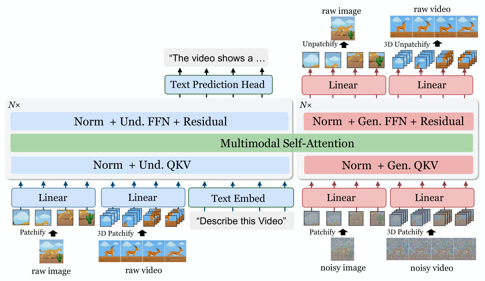
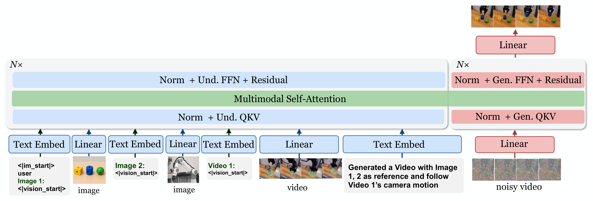

# AI Daily

**日期：2026-10-04**  
**今日主題：Encoder-Free Multimodal Modeling、Pixel-Space Flow Matching、Mixture-of-Transformers、Image/Video Generation**  
**作者：Manus AI**

## PixelUMM：把理解與生成放進同一條 raw-pixel backbone

今日精選 **PixelUMM: Encoder-Free Unified Image and Video Understanding and Generation**。論文由 Cong Wei、Xuanchi Ren、Bryan Chu、Weiming Ren、Huan Ling、Jiahui Huang、Laura Leal-Taixé、Sanja Fidler、Wenhu Chen、Zian Wang 與 Jay Zhangjie Wu 撰寫，作者來自 **NVIDIA** 與 **University of Waterloo**，於 2026-09-29 以 arXiv 預印本公開，尚未標示頂會收錄。[1] [2]

這篇工作值得選入今天的 AI Daily，有三個原因。第一，它直接命中近期的圖像生成主線：不用 VAE、不用離散 visual tokenizer，讓 Transformer 直接在 pixel space 做 image/video generation。第二，它不是只做 text-to-image，而是讓同一個 decoder-only backbone 同時支援 image understanding、video understanding、text-to-image 與 text-to-video。第三，它把 autoregressive text prediction 與 pixel-space flow matching 放進同一個 Mixture-of-Transformers（MoT）架構，對「理解和生成是否真的能共用表示」提出了很具體的工程答案。[1] [3]

本次也檢查了 repository 既有文章與 Hugging Face Trending。Energy-Based Transformers 雖然高度符合近期偏好的 EBT、System 2 與 zero-shot 泛化方向，但 `KaiCobra/AI_Daily` 已經有 2026-05 與 2026-07 的 EBT 文章，因此排除重複；PixelUMM 則尚未收錄，且更新、更貼近 image/video generation。[4] [5]

> **一句話摘要：** PixelUMM 用「乾淨 pixel 作為理解條件、加噪 pixel 作為生成目標、共享 multimodal self-attention、分開 expert-specific QKV/FFN」取代傳統的 ViT + VAE 雙視覺介面，將統一多模態模型推向直接在 raw pixels 上做 image/video flow matching。

## 核心貢獻

### 1. 用單一 raw-pixel 介面取代 ViT + VAE 雙流

傳統統一多模態模型常把理解和生成拆給不同的視覺表示：ViT 提供語義特徵，VAE 提供適合重建與生成的 latent。BAGEL 就是典型例子；它以 ViT 處理 understanding，以 VAE latent 支援 generation。這種設計有能力，但同一張條件圖像通常要攜帶兩套 visual tokens，會增加 context length、attention memory 與資料管線複雜度。[6]

PixelUMM 的取捨很直接：圖像和影片都只從 raw pixels 出發。圖像切成 $16\times16$ patches，影片切成 $4\times16\times16$ tubelets；理解和生成各自使用一個線性輸入投影，再把結果送進同一個 multimodal Transformer。這樣模型沒有 pretrained vision encoder、VAE 或離散 visual tokenizer。[1]

### 2. 以 Mixture-of-Transformers 共享注意力、分離任務專家

PixelUMM 以 Qwen3-8B decoder-only Transformer 初始化。每個 block 有兩條 expert route：

- **Understanding expert（Und.）**：處理文字 token 與 clean visual tokens，負責文字預測及視覺理解。
- **Generation expert（Gen.）**：處理 noisy image/video tokens，負責像素生成。
- **Shared multimodal self-attention**：兩條 route 不各自建立獨立的 attention，而是讓所有 token 在共同的 self-attention 中互動。

因此，它不是完全參數共享，也不是兩個模型簡單串接。每個 expert 有自己的 normalization、QKV/output projection 與 FFN，但 text、clean pixels 和 noisy pixels 仍可在同一個 attention graph 中交換資訊。[1] [3]

### 3. 將 JiT 式 clean-pixel prediction 延伸到影片

JiT 的重要觀察是：圖像生成不一定需要先壓進 latent space，也可以在 pixel patches 上預測 clean image，再以 velocity loss 訓練。[7] PixelUMM 沿用這個方向，但把二維 patch interface 擴展成影片的三維 tubelet interface，並讓同一套概念支援 image-to-video 與 video editing。

## 技術方法詳解

### 1. Image patch 與 video tubelet

令圖像與影片分別為

$$
\mathbf{x}^{\mathrm{img}}\in\mathbb{R}^{H\times W\times 3},
\qquad
\mathbf{x}^{\mathrm{video}}\in\mathbb{R}^{F\times H\times W\times 3}.
$$

圖像先以 $16\times16$ 的不重疊 patchify 轉成序列：

$$
\mathbf{x}^{\mathrm{img}}
\xrightarrow{\operatorname{Patchify}_{16\times16}}
\mathbb{R}^{N_{\mathrm{img}}\times(16\cdot16\cdot3)}
\xrightarrow{W_{\mathrm{img}}}
\mathbb{R}^{N_{\mathrm{img}}\times d}.
$$

影片則沿時間、身高、寬度一起切成 $4\times16\times16$ tubelets：

$$
\mathbf{x}^{\mathrm{video}}
\xrightarrow{\operatorname{Patchify}_{4\times16\times16}}
\mathbb{R}^{N_{\mathrm{video}}\times(4\cdot16\cdot16\cdot3)}
\xrightarrow{W_{\mathrm{video}}}
\mathbb{R}^{N_{\mathrm{video}}\times d}.
$$

理解和生成不共用輸入投影。乾淨圖像／影片走 $W_{\mathrm{img}}^{\mathrm{und}}$ 或 $W_{\mathrm{video}}^{\mathrm{und}}$；加噪的生成目標走 $W_{\mathrm{img}}^{\mathrm{gen}}$ 或 $W_{\mathrm{video}}^{\mathrm{gen}}$。輸出端則以 RMSNorm 加線性投影反向還原成 $16\times16\times3$ 或 $4\times16\times16\times3$ 的 pixels。[1]

### 2. 為什麼可以不輸入 timestep embedding

PixelUMM 不像一般 DiT 那樣額外輸入 timestep embedding，也不使用 timestep-conditioned AdaLN。它讓 denoising network 直接從 noisy pixels 推斷當前 corruption level；timestep 仍會用於建立訓練 target 和控制 sampling，但不必成為 backbone 的獨立條件 token。[1]

這個設計減少了條件介面的種類，但也把一部分難題交給模型：在不同 noise level 下，模型必須從輸入本身判斷自己位於 flow trajectory 的哪個位置。這種做法和 JiT 對「直接預測 clean data」的立場一致，但 PixelUMM 把它搬到多任務、跨影像與影片的 unified setting。[7]

### 3. Unified multimodal sequence 與 attention mask

四種任務都被序列化成 ChatML：

- **I2T**：clean image patches → assistant text。
- **V2T**：clean video tubelets 或 sparse frame patches → assistant text。
- **T2I**：text prompt → noisy image patches。
- **T2V**：text prompt → noisy video tubelets。

文字 token 內部採 causal attention；單張圖像的 visual block 內部可雙向注意。稀疏影片則形成依時間排序的 visual islands：後面的 frame 可以看前面的 frame，但前面的 frame 不可看未來。生成時，noisy target 可以看見整個 prompt 與自己的完整 target block，但前面的 clean condition 不會反向讀取生成 target。這讓 image-to-video 和 video editing 可以共用同一個條件介面，同時避免 information leakage。[1]

*圖 1。論文 Figure 5 的 PDF 局部提取版本：PixelUMM 以 clean image/video token 做 understanding context，以 noisy image/video token 做 generation target；不同 visual block 使用不同的 bidirectional/causal 可見性。圖像依 `/pdf-image-extractor` skill 從論文 PDF 提取。*

### 4. Pixel-space flow matching objective

對一個 clean image patch 或 video tubelet $\mathbf{x}$，PixelUMM 以 noise $\boldsymbol{\epsilon}\sim\mathcal{N}(\mathbf{0},\mathbf{I})$ 建立 noisy input：

$$
\mathbf{z}_t=(1-t)\mathbf{x}+t\boldsymbol{\epsilon},
\qquad t\in[0,1].
$$

當 $t$ 增大時，輸入由 clean pixels 逐漸走向 noise。模型輸出 clean-pixel prediction $\hat{\mathbf{x}}_\theta$，再把它轉成預測 velocity：

$$
\mathbf{v}_\theta
=\frac{\mathbf{z}_t-\hat{\mathbf{x}}_\theta}{\bar t},
\qquad
\mathbf{v}^{\star}
=\frac{\mathbf{z}_t-\mathbf{x}}{\bar t},
\qquad
\bar t=\max(t,0.05).
$$

PixelUMM 使用 velocity-space 的平方誤差，而不是直接把 pixel MSE 當作唯一訓練訊號：

$$
\mathcal{L}_{\mathrm{img}}
=\mathbb{E}\left[\|\mathbf{v}_\theta-\mathbf{v}^{\star}\|_2^2\right],
\qquad
\mathcal{L}_{\mathrm{vid}}
=\mathbb{E}\left[\|\mathbf{v}_\theta-\mathbf{v}^{\star}\|_2^2\right].
$$

最後把文字與兩種視覺生成 loss 組合：

$$
\mathcal{L}
=\lambda_{\mathrm{CE}}\mathcal{L}_{\mathrm{CE}}
+\lambda_{\mathrm{img}}\mathcal{L}_{\mathrm{img}}
+\lambda_{\mathrm{vid}}\mathcal{L}_{\mathrm{vid}}.
$$

文字 loss 只對 assistant tokens 計算，並以 response length 做平方根正規化。這個 objective 的關鍵不是把圖像離散化成 AR token，而是保留 continuous pixels，讓文字使用 autoregressive CE、影像使用 flow-matching velocity loss。[1]

*圖 2。論文 Figure 18 的 PDF 局部提取版本：clean visual condition 走 understanding expert，noisy target 走 generation expert，兩者透過 shared multimodal self-attention 互動。圖像依 `/pdf-image-extractor` skill 從論文 PDF 提取。*

### 5. 分階段訓練

PixelUMM 不在一開始就把所有任務混在一起，而是逐步加入生成、理解、影片與更高解析度：

1. **Joint Stage 1：150K steps**，文字任務、image understanding、T2I，圖像解析度 $256^2$。
2. **Gen Stage 1：200K steps**，T2I 與 T2V，解析度 $256^2$。
3. **Und Stage 1：100K steps**，文字任務與 native-resolution image understanding。
4. **Und Stage 2：20K steps**，加入 $224^2$ video understanding。
5. **Und Stage 3：15K steps**，將 video understanding 提升到 $448^2$。
6. **Joint Stage 2：20K steps**，把所有任務重新合併；T2I/T2V 到 $512^2$，video understanding 到 $448^2$。[1]

總訓練流程約 505K steps。正式 benchmark 使用 Joint Stage 2 後的 8B MoT 模型。官方程式碼同時釋出 inference、evaluation 與四任務 toy training；預設 checkpoint 是 `S8-F22-R05`，但完整 toy training 需要約七張至少 48 GiB 的 GPU，不能把「開源」誤解成一般消費級 GPU 可直接重訓。[4]

## 實驗結果

### 1. Image generation

PixelUMM 的 image generation benchmark 使用 GenEval 與 DPG-Bench。論文同時列出原始設定與使用 prompt rewriter 的 GenEval 版本，兩者不應混成同一個數字：

- **原始 PixelUMM（8B MoT）**：GenEval overall **0.77**；DPG-Bench overall **85.74**。
- **PixelUMM†（GenEval 使用 LLM prompt rewriter）**：GenEval overall **0.83**。

在 GenEval 的細項中，原始 PixelUMM 的 1-object、2-object、count、color、position、color attribute 分數為 `0.99 / 0.95 / 0.65 / 0.84 / 0.55 / 0.64`。這說明它具備可用的文字對齊能力，但離專用 T2I 模型仍有差距；例如表中的 Qwen-Image、Seedream 3.0 與 Z-Image-Turbo 在部分組合性欄位更強。[1]

這個結果很重要，因為 PixelUMM 的主要賣點不是單項 T2I SOTA，而是「不另外維護一套 latent generator，也能讓同一個 multimodal model 產生圖像」。因此合理的比較單位不是只看 GenEval，而是同時看理解、生成、影片和條件編輯的總能力。

### 2. Video generation

在 VBench Part 1，PixelUMM† 的主要分數包括：Quality Score **84.10**、Semantic Score **79.80**、Subject Consistency **95.05**、Background Consistency **97.15**、Temporal Flicker **99.45**、Motion Smoothness **98.70**、Dynamic Degree **64.44**、Aesthetic Quality **61.58**、Imaging Quality **67.63** 與 Object Class **95.57**。[1]

在 VBench Part 2，PixelUMM† 的 Multi-Objects、Human Action、Spatial Relation 三項分數為 `76.75 / 97.40 / 84.26`，表中 **Total Score 為 83.24**。注意論文說 PixelUMM 與 UniVideo 使用 VBench GPT-enhanced prompts；這些數字應理解成官方 benchmark protocol 下的結果，而不是完全不帶 prompt enhancement 的 zero-shot 結果。[1]

### 3. Image 與 video understanding

在 image understanding 的 LMMS-Eval 21 tasks 上，PixelUMM 的代表性結果為 MMMU **41.67**、ChartQA **82.96**、TextVQA **78.76**、OCRBench **78.00**、CountBench **94.30**、BLINK **53.46**。在 video understanding 的 sparse mode、最多 96 frames 設定下，MVBench 為 **70.53**、Video-MME（無字幕）為 **57.33**、LongVideoBench 為 **59.61**、LVBench 為 **40.41**。[1]

作者很謹慎地指出，各模型的訓練資料不同，所以這些表格可以支持「PixelUMM 表現具競爭力」，不能直接證明哪個架構收斂更快或一定更優。這個限制值得保留，因為統一多模態模型的 benchmark 往往同時混入資料規模、prompt template、評估 protocol 與外部 prompt rewriting 差異。[1]

### 4. Patch size、decoder 與 scaling 消融

**Image patch size。** 在相同 sequence-length budget 下，$32\times32$ patch 每一步可以處理四倍多的圖像，但 $16\times16$ 的 T2I training MSE 在後期較低。這表示更強的 spatial compression 雖然節省 token，卻讓 pixel generation 更難學。[1] [3]

**Video tubelet。** 作者比較 $p32/t4$、$p32/t2$、$p16/t4$ 與 $p32/t1$。較不激進的 spatiotemporal compression 通常有較低 T2V loss，$p32/t1$ 的 loss 最低；正式模型仍採 $p16/t4$，以貼近 Wan2.2 等影片 VAE 常見的壓縮慣例。[1] [3]

**Patch artifact。** 線性 pixel head 在高 CFG、低紋理區域容易產生對齊到 16-pixel patch 或 4-frame tubelet 邊界的細微亮度階梯。三個 convolutional alternatives 可以抑制這類 artifact，但成本不一：在 $96\times176\times320$ clip 上，linear head 為 **133 GFLOPs、12.6M parameters**；Wan-style upsample-conv 為 **2,274 GFLOPs、18.3M**；temporal-first PixelShuffle 為 **1,279 GFLOPs、52.9M**；spatial-first PixelShuffle 為 **747 GFLOPs、15.1M**。PixelShuffle 在 artifact suppression 與 loss 之間較平衡，但正式 checkpoint 和 benchmark 仍使用 linear head。[1] [3]

**Model scaling。** 1.7B 與 8B 使用相同 recipe、global batch size 256 時，8B 約在 14K steps 達到 MSE 0.060，1.7B 約需 40K；CE 0.50 則約為 10K 對 31K。作者將此解讀為約三倍的 training-step convergence，但不是三倍 wall-clock 或能源效率。[1]

**GPU scaling。** 在同一個 1.7B 模型上，8 GPU 增到 128 GPU 後，CE=1.0 約由 17.5K steps 降至 2K，約少 9 倍；MSE=0.065 則由約 23K 降至 17K，只有約 1.3 倍改善。文字 loss 對分散式 compute 的 scaling 比 pixel generation 更敏感。[1]

## 相關研究分析

### BAGEL：雙視覺介面 vs. PixelUMM：單一 raw-pixel 介面

BAGEL 採 integrated Transformer，但視覺輸入仍分成兩種：ViT token 負責理解、VAE token 負責生成與細節保留。PixelUMM 把這個 interface simplification 推到極致：clean pixels 同時是 understanding context，noisy pixels 同時是 generation state。[6]

兩者的差異不是「有沒有 Transformer」，而是 **visual representation 的 bottleneck 放在哪裡**。BAGEL 以兩套 representation 換取成熟的理解與生成能力；PixelUMM 以 raw-pixel interface 降低 token duplication，但必須自己處理 pixel-space 的高維度、patch artifact、影片 tubelet compression 與較昂貴的生成學習。[1] [6]

### JiT 與 PixelDiT：pixel-space generation 的兩條路

JiT 用簡單的 ViT patchify 在 raw pixels 上進行 clean-image prediction，再以 velocity loss 進行 flow-like sampling；PixelUMM 直接沿用其核心思想，並把 patch-level image generation 擴展成 video tubelet generation。[7]

PixelDiT 則以 dual-level DiT 同時保留 patch-level global semantics 與 pixel-level texture refinement，目標是把 pixel-space image generation 做到更高品質；它在 ImageNet 256/512 報告 1.61/1.81 FID，並在 text-to-image 上報告 GenEval 0.74。[8] PixelUMM 的差異在於它不是單純更強的 image generator，而是把 pixel-space flow 和 text/video understanding 一起放進 unified backbone。

### 與 VAR 的距離

PixelUMM **不是 VAR**。VAR 的典型作法是把圖像離散成多尺度 token map，並分解為由粗到細的 next-scale prediction：

$$
 p(r_1,\ldots,r_S\mid c)
 =\prod_{s=1}^{S}p(r_s\mid r_{<s},c).
$$

PixelUMM 則把視覺生成目標留在 continuous noisy pixels，使用 flow-matching velocity loss；它沒有 discrete codebook、next-scale token logits 或 coarse-to-fine visual AR factorization。[1] [9]

不過兩者可以互補：VAR 的 coarse scale 適合先決定布局，PixelUMM 的 pixel flow 適合處理連續細節。這正是後續可研究的 hybrid interface：先用 VAR-like coarse semantic scaffold，再交給 PixelUMM-style pixel flow 完成細化。

### 與 EBT、JEPA、training-free attention modulation 的關係

PixelUMM 本身不是 Energy-Based Transformer、JEPA、training-free method，也沒有宣稱 zero-shot 泛化到未訓練的 generation domain。它的 generation branch 仍需大量多階段訓練，正式 checkpoint 是以訓練後的 8B MoT 模型做 benchmark。[1] [4]

但它提供了一個很適合接上這些方向的介面：

1. **Energy-based verifier**：在每一個 flow step 讀取 prompt、clean condition 與 noisy target，學一個 compatibility energy，做 adaptive step allocation、early stopping 或 best-of-$N$ trajectory selection。
2. **JEPA predictive critic**：對 video tubelet 的中間狀態做未來 latent prediction，讓生成器不只降低 pixel velocity error，也降低長時間 rollout 的 predictive disagreement。
3. **VAR-style coarse-to-fine controller**：在 PixelUMM 的 $p=32$ 與 $p=16$ 介面上建立 coarse semantic stage，先修正布局，再讓細粒度 pixel flow 接手。
4. **Training-free attention modulation**：凍結模型，在 inference 時只調整 generation route 的 Q/K logits、expert gate 或 visual block mask，測試 image-to-video、reference editing 與 multi-object binding 是否能以中間 attention intervention 改善。
5. **Zero-shot protocol**：嚴格區分「未更新 backbone 權重的 inference-time steering」與「使用外部 prompt rewriter、reference encoder 或任務 readout」。PixelUMM 的 VBench† 和 GenEval† 已顯示 prompt enhancement 會影響數字，因此後續研究應同時報告原始 prompt 與 enhanced prompt 結果。

## 個人評價與研究意義

我認為 PixelUMM 最有價值的地方，不是它在某一個 GenEval 欄位打敗了所有專用 T2I 模型，而是它把一個長期存在的系統設計問題變成了可量化的 trade-off：**統一模型到底需要幾套 visual representation？**

PixelUMM 的回答是：可以先嘗試一套 raw-pixel interface，但不要強迫所有參數完全共享。理解和生成各自擁有 expert-specific projection、normalization 與 FFN，只有 multimodal self-attention 共享。這個答案比「一個 Transformer 什麼都做」更務實，也比「理解模型 + 生成模型外接」更接近真正的 unified pretraining。

最值得延伸的研究問題是 **representation sharing 是否應該依生成狀態動態決定**。目前 PixelUMM 的 route 是 hard routing：clean visual token 去 understanding expert，noisy target 去 generation expert。未來可以令 route 由 uncertainty 或 energy 決定：當 noisy state 還很不確定時，增加 understanding expert 對 prompt、reference image 或前序 video frames 的讀取；當場景布局已穩定時，切換更多 compute 給 generation expert。

可以把這個想法寫成一個簡化的 energy-gated flow：

$$
\mathcal{L}_{\mathrm{total}}
=\mathcal{L}_{\mathrm{flow}}
+\lambda_E E_\phi(\mathbf{z}_t,c)
+\lambda_J D_{\mathrm{JEPA}}(h_t,h_{t+\Delta})
+\lambda_A\mathcal{L}_{\mathrm{attention}}.
$$

其中 $E_\phi$ 衡量 condition 與當前 noisy target 的 compatibility，$D_{\mathrm{JEPA}}$ 衡量中間狀態對未來影片 latent 的預測不一致，$\mathcal{L}_{\mathrm{attention}}$ 則限制 training-free modulation 不要破壞原始 visual block 的穩定性。這種設計能把 EBT 的 energy verification、JEPA 的 predictive representation、VAR 的多尺度結構與 attention modulation 放進同一個實驗框架，而不必立刻重新訓練一個全新的 foundation model。

### 必須保留的限制

- **不是 pure unified parameters**：理解與生成仍是兩條 expert route，shared 的主要部分是 multimodal attention。[1]
- **不是 training-free**：模型需要 505K steps 的多階段訓練；官方 toy training 仍需要大型 GPU。[1] [4]
- **生成品質仍有 pixel-space 典型問題**：多人或多動物容易 merge/split，手部與細小肢體容易失真，物理互動可能不合理。[3]
- **linear head 有 patch/tubelet artifacts**：更好的 convolutional head 雖可改善，但會增加 GFLOPs 和參數，且需要額外訓練。[1] [3]
- **benchmark 不足以證明架構絕對優勢**：不同模型的資料、prompt、評估流程不完全相同，且部分結果使用 GPT-enhanced prompts。[1]
- **尚未展示長影片與更大 pixel token 的可擴展性**：作者提出未來測試 $p=64$ 與 $\tau=8$，但壓縮程度升高可能進一步傷害 generation loss。[1]

## 結論

PixelUMM 把近期三條趨勢接在一起：pixel-space generation、unified multimodal modeling 和 flow matching。它的工程核心很清楚：**clean pixels 是理解條件，noisy pixels 是生成狀態，MoT expert 分工處理任務差異，shared self-attention 維持跨模態互動。**

如果只把它看成「不用 VAE 的另一個 T2I 模型」，會低估它的研究價值。更有啟發性的讀法是：PixelUMM 正在提供一個可插拔的 raw-pixel state interface，未來可在這個 state 上加 energy verifier、JEPA predictive critic、VAR coarse scaffold 或 training-free attention modulation。對想研究 EBT、JEPA、VAR 與 zero-shot inference 的人而言，這篇論文的價值在於它把這些方向放到了同一個可操作的 image/video unified backbone 上。

## References

[1]: https://arxiv.org/html/2609.38597v1 "PixelUMM: Encoder-Free Unified Image and Video Understanding and Generation"
[2]: https://arxiv.org/abs/2609.38597 "PixelUMM arXiv abstract and submission history"
[3]: https://nv-tlabs.github.io/PixelUMM/ "PixelUMM official project page"
[4]: https://github.com/nv-tlabs/PixelUMM "PixelUMM official code repository"
[5]: https://huggingface.co/papers/trending "Hugging Face Trending Papers"
[6]: https://arxiv.org/html/2505.14683v3 "Emerging Properties in Unified Multimodal Pretraining (BAGEL)"
[7]: https://arxiv.org/html/2511.13720v1 "Back to Basics: Let Denoising Generative Models Denoise (JiT)"
[8]: https://arxiv.org/abs/2511.20645 "PixelDiT: Pixel Diffusion Transformers for Image Generation"
[9]: https://arxiv.org/abs/2404.02905 "Visual Autoregressive Modeling: Scalable Image Generation via Next-Scale Prediction"
