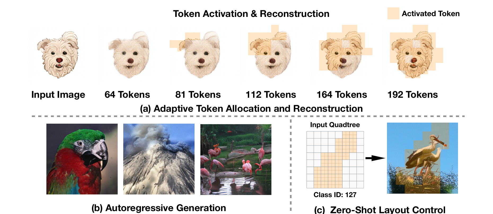
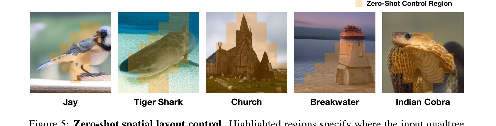

# AI Daily

## 2026-10-09｜QuadTok：讓空間複雜度決定 Visual AR 的 token budget

> **一句話結論：** QuadTok 把固定的 2D visual token grid 改成 content-adaptive quadtree：平坦區域保留 coarse token，細節密集區域才展開 child tokens，再以 Kinship Causal Attention 維持 parent–child–sibling 的空間關係。這個表示同時保留 2D spatial binding 與 1D autoregressive sequence flexibility；在 ImageNet 256² 上平均只用 230 tokens，tokenizer 的 rFID/PSNR 為 1.46/20.37，947M generator 的 gFID 為 2.08，並且能在 frozen ImageNet 模型上以預先指定的 quadtree topology 做零樣本空間控制。[1] [2]

## 論文基本資訊

| 欄位 | 資訊 |
|---|---|
| 論文標題 | *QuadTok: Quadtree Visual Tokenizer for Autoregressive Image Generation* |
| 作者 | Yucheng Mao、Zeyuan Chen、Xiaojun Shan、Xiang Zhang、Divyansh Srivastava、Bingnan Li、Zhuowen Tu；前兩位作者 equal contribution。[1] |
| 研究單位 | University of California, San Diego。[1] |
| 發表狀態 | **arXiv v1 預印本**，2026-10-07 提交，分類為 cs.CV；目前沒有在來源中看到已接收的 ICCV、CVPR、ICML、NeurIPS 或其他正式 venue。[1] |
| 研究主題 | Quadtree visual tokenization、content-adaptive representation、autoregressive image generation、spatially controlled generation、zero-shot layout control |
| 主要模型 | QuadTok tokenizer；QuadTok-B/L/XL/XXL decoder-only autoregressive generator |
| 程式碼 | [官方 QuadTok repository][3]；目前公開的是 tokenizer training、reconstruction evaluation 與 pretokenization，**不包含 image-generation models**。[3] |
| 本庫排重查核 | 已比對 `README.md`、`INDEX.md`、既有文章標題、arXiv ID 與 `QuadTok` 名稱；未發現 `2610.10497` 或同一篇論文。repo 已有 VibeToken、GEAR、Logit Refiner、SJD-SV、VAR 與多篇 JEPA/training-free 工作，但沒有 QuadTok 的 exact duplicate。 |

## 為什麼今天選 QuadTok

今天的候選包括新的 JEPA world model、diffusion transformer quantization、geometry-conditioned next-scale generation，以及 visual autoregressive tokenization。最後選擇 QuadTok，是因為它直接命中目前最值得追蹤的 **VAR/Visual AR scaling** 問題：如果每個影像區域都使用同樣解析度，token budget 會浪費在平坦背景；但如果把影像壓成沒有位置對應的 1D sequence，又會失去 spatial binding。[2]

QuadTok 的研究問題很具體：能不能讓 token 數量與區域的 reconstruction benefit 對齊，同時讓 coarse-to-fine 空間因果性可以直接餵給 autoregressive generator？它不是只改 sampler，也不是只在 frozen backbone 上加一個 guidance，而是重新設計 **image → visual tokens → AR generator** 的介面。這使它很適合和 repo 既有的 VAR、training-free attention modulation、JEPA predictive representation 與 energy-based routing 研究串起來。

但它的 claim 必須精確限定。QuadTok 是需要訓練 tokenizer 與 generator 的方法，不是 training-free。它的「zero-shot」有兩層意思：ImageNet-trained tokenizer 直接轉到 COCO 的重建測試，以及 frozen ImageNet generator 在既有 ImageNet classes 內接受預先指定 topology 的空間控制；它不是任意文字到圖像模型，也不是完全自動從 prompt 產生 tree 的 end-to-end zero-shot text-to-image 系統。[1] [2] [3] [5]

*圖 1．QuadTok 先以 64 個 coarse tokens 建立全局結構，再只在需要的位置啟用更細 token；同一個 quadtree topology 也可以作為生成器的空間控制介面。素材來自 QuadTok 原始 PDF Figure 1，經聚焦裁切。*

## 核心貢獻與創新點

### 1. Quadtree 把 spatial correspondence 與 variable-length sequence 放在一起

固定 grid 的問題不是 token 本身太多，而是它假設所有位置需要相同的表示解析度。QuadTok 對每張圖建立一棵 quadtree：根部或 coarse level 先覆蓋大區域，只有視覺複雜度高的 parent 才展開成四個 child。每個 node 都同時帶有 tree level 與 spatial index，所以 token 數可以變動，token 與影像區域的對應仍然清楚。[2]

這和純 1D tokenizer 的差別在於，QuadTok 不是只讓 sequence 變短，而是讓「哪個位置變細」成為 representation 的一部分。它的兩層預設配置從 8×8 coarse grid 開始，每個展開的 coarse region 增加四個 fine tokens；因此 token 數可落在 64–320。官方 tokenizer release 使用 16,384-entry、8-dimensional codebook；論文的 ImageNet operating point 平均是 230 tokens。[2] [3]

### 2. Region-Wise Complexity Guidance：用 reconstruction benefit 決定展開哪裡

QuadTok 不直接用固定 edge、梯度或 caption score 判斷區域是否複雜，而是測量「把這個 region 展開，重建誤差實際降低多少」。先建立一棵 probing tree，再建立 complementary tree，使每個 region 一次以 collapsed、一次以 expanded 狀態出現。兩次重建都產生 spatial LPIPS error map；對 region $r$，其 reconstruction benefit 定義為

$$
 b_r=\operatorname{AvgPool}_r\left(E_r^{\mathrm{collapsed}}-E_r^{\mathrm{expanded}}\right).
$$

若 $b_r>\tau$，就把該 region 展開成四個 child；論文的預設使用 LPIPS 與 $\tau=0.05$。[2] [3]

這個設計有一個重要含義：token allocation 的目標不是抽象地追求「看起來複雜」，而是追求「細化後真的能改善該區域的 reconstruction」。在消融中，Guided tree 平均 230 tokens、rFID 1.46、PSNR 20.37；Random tree 用 253 tokens 卻只有 rFID 1.601、PSNR 19.40；Full tree 用 320 tokens，rFID 1.50、PSNR 20.39。也就是說，適當地把 token 放在值得細化的位置，比單純增加 token 更有效。[2]

### 3. Kinship Causal Attention：限制 token 只讀取合法的階層關係

quadtree 被 flatten 成 BFS sequence 後，普通 self-attention 會重新允許所有 token 全局互看，這可能讓一個 fine token 的資訊洩漏到不相關區域，使 token–region binding 變弱。QuadTok 因此在 tokenizer 的 Aggregator 與 Decoder 中加入 Kinship Causal Attention。[2]

對兩層 quadtree，mask 具備三條規則：

1. coarse parent 彼此雙向注意，先形成全局 layout；
2. child 可以讀 parent，但 parent 不能讀 child，形成 coarse-to-fine 方向；
3. fine child 只和同一 parent 下的 siblings 互動，避免細節在不同 spatial region 之間任意混合。

這個 mask **只用在 tokenizer**。autoregressive generator 本身使用標準 causal mask，靠 BFS 順序與 node instruction embedding 來知道目前 token 的 level 與位置。[2]

### 4. Tokenizer 的數學介面

令輸入影像為 $I$，ViT encoder 先產生 dense patch features：

$$
F=\operatorname{Encoder}(I),\qquad F\in\mathbb{R}^{N\times D}.
$$

對 quadtree 中第 $i$ 個 node，令 $(l_i,p_i)$ 分別代表 tree level 與 spatial index，learnable instruction token 為

$$
q_i=\operatorname{Emb}_{l_i}(p_i).
$$

把所有 image features 與 node instructions 串接後交給 Aggregator：

$$
[F'\,\|\,Z]=\operatorname{Aggregator}([F\,\|\,Q]),
$$

其中 $Z=[z_1,\ldots,z_M]$ 是與區域對齊的 continuous node representation。接著用 codebook $\mathcal{C}=\{e_k\}_{k=1}^{K}$ 做 nearest-neighbor quantization：

$$
 y_i=\operatorname{Quant}(z_i)
 =\arg\min_{e_k\in\mathcal{C}}\left\|z_i-e_k\right\|_2.
$$

在 reconstruction 時，離散 code 與 spatial instruction 合併：

$$
\tilde z_i=e_{y_i}+q_i.
$$

Decoder 對每個 node 產生區域 patch：

$$
C_{l_i}(p_i)=U_{l_i}(\tilde z_i),
$$

同一 level 的 patches 放回相應位置後，逐層做 coarse-to-fine aggregation：

$$
H_{l+1}=F^{\mathrm{up}}_{l+1}(H_l)+C_{l+1},
\qquad H_0=0.
$$

因此 coarse tokens 提供 global structure，higher-resolution tokens 只需補 local residual。這個 decoder 介面也解釋了為什麼 topology 可以在生成前被修改：改變哪些 parent 被展開，就等於改變哪些 spatial regions 會得到更細的 visual code。[2]

### 5. Quadtree-conditioned autoregressive generation

令 $T$ 表示生成前已指定的 quadtree topology，$t_i=(l_i,p_i)$ 是 BFS sequence 中第 $i$ 個 node 的結構資訊，$c$ 是 class condition。QuadTok 的生成分解為

$$
 p(Y\mid c,T)=\prod_{i=1}^{M}p\left(y_i\mid y_{<i},c,t_{\leq i}\right).
$$

generator 是 LLaMA-style decoder-only Transformer。BFS 順序讓 coarse codes 先出現，先建立 global structure，再讓 fine codes 補局部 texture；node instruction 則把 level 與 spatial position 提供給 Transformer。值得注意的是，未來的 tree nodes 在當前 step 不可見，模型只能使用目前與先前的 instructions，因而保留 autoregressive causality。[2]

這和標準 VAR 的「固定多尺度 grid、逐 scale 預測」不同：VAR 的 coarse-to-fine 是預先固定的 resolution scales；QuadTok 的 refinement 是由 topology 決定，並且可以在不同影像或不同控制要求下使用不同的 spatial tree。另一方面，QuadTok 的 generator 在同一個 BFS topology 內仍是 sequential discrete-token prediction，不應直接稱為 canonical VAR。[2] [6]

## 實驗結果與性能指標

### 1. ImageNet 與 COCO 重建

論文在 ImageNet-1K 256×256 上訓練 tokenizer，再不微調地轉移到 MS-COCO validation set。下表中的 token count 是資料集平均 sequence length；rFID 越低越好，PSNR 越高越好。[2]

| Tokenizer | ImageNet tokens | ImageNet rFID↓ | ImageNet PSNR↑ | COCO tokens | COCO rFID↓ | COCO PSNR↑ |
|---|---:|---:|---:|---:|---:|---:|
| LlamaGen $f=16$ | 256 | 2.19 | 20.79 | 256 | 8.11 | 20.42 |
| TiTok-S | 128 | 1.71 | 17.80 | 128 | 9.22 | 17.27 |
| GigaTok-XL-XXL | 256 | 0.79 | 21.65 | — | — | — |
| **QuadTok（2-level）** | **230** | **1.46** | **20.37** | **232** | **7.88** | **19.30** |
| QuadTok（3-level） | 989 | 0.770 | 23.31 | 1012 | 3.92 | 23.83 |

與 fixed 256-token grid 比，QuadTok 在 ImageNet 平均節省約 10% tokens，在 COCO zero-shot transfer 節省約 9%。但這不是所有指標都同時優於 fixed grid：QuadTok 的 ImageNet PSNR 低於 LlamaGen $f=16$ 的 20.79，表示 perceptual reconstruction 與 pixelwise fidelity 之間存在 trade-off。3-level 版本能進一步降低 rFID、提高 PSNR，但 token budget 也升到約 989–1012，不能把它視為同樣的效率 operating point。[1] [2]

### 2. ImageNet class-conditional generation

QuadTok generator 的系統級比較如下。不同論文的 tokenizer、training schedule 與 sampling protocol 不完全相同，因此這張表適合看量級與 scaling，不應當作完全 matched 的 leaderboard。[2]

| Model | Parameters | gFID↓ | IS↑ | Precision↑ | Recall↑ |
|---|---:|---:|---:|---:|---:|
| VAR-d30 | 2.0B | 1.92 | 323.10 | 0.82 | 0.59 |
| RandAR-XXL | 1.4B | 2.15 | 321.97 | 0.79 | 0.62 |
| QuadTok-B | 111M | 4.41 | 205.61 | 0.85 | 0.46 |
| QuadTok-L | 343M | 2.93 | 226.69 | 0.82 | 0.54 |
| QuadTok-XL | 697M | 2.23 | 262.38 | 0.807 | 0.60 |
| **QuadTok-XXL** | **947M** | **2.08** | **273.35** | **0.82** | **0.59** |

947M QuadTok-XXL 的 gFID 2.08 優於論文列出的 1.4B RandAR-XXL 2.15，也呈現從 111M 到 947M 的穩定改善。不過 2.08 是在 **generation 前已 supplied topology** 的設定下得到，不代表模型只接收 class label、自己預測最適合的 quadtree；這是解讀數字時最重要的條件。[2] [5]

### 3. Zero-shot spatial layout control

作者把指定的 subject region 轉換成 quadtree：目標區域內的 cells 被展開，其他位置維持 coarse。接著固定 class label，使用同一個 frozen ImageNet tokenizer 與 generator，不做 layout-specific training。這個實驗是在 ImageNet classes 內測量「已有 generator 是否能按照 topology 改變 subject location」，不是新類別或文字 prompt 的 open-world localization。[2]

在四個等面積 half-planes、每個方向 1,000 張影像、192-token budget 下，prescribed topology 相對 matched random topology 的 localization 結果如下：[2]

| 目標區域 | Topology | Grad-CAM hit↑ | Grounding DINO box hit↑ | SAM 2 mask hit↑ | FID-50cls↓ |
|---|---|---:|---:|---:|---:|
| Left | Random | 29.6 | 47.5 | 51.1 | 35.03 |
| Left | Prescribed | **58.3** | **51.8** | **59.0** | 35.15 |
| Right | Prescribed | **87.9** | **58.1** | **55.7** | 34.88 |
| Top | Prescribed | **55.4** | **47.0** | **47.8** | 34.97 |
| Bottom | Prescribed | **83.6** | **64.6** | **62.5** | 35.05 |

四個方向中，prescribed topology 都提高三種 localization hit rate；FID-50cls 相對 random topology 的變化介於 $-0.15$ 到 $+0.12$。這表示 spatial control 並不是靠犧牲整體 distribution quality 換來的，但目前的測試只涵蓋 predefined half-plane layouts。[2]

*圖 2．相同的 class condition 下，改變輸入 topology 中的 refined regions，就能把 Jay、Tiger Shark、Church、Breakwater 與 Indian Cobra 引導到不同空間位置。這是 topology control，不是重新訓練 layout adapter。素材來自 QuadTok 原始 PDF Figure 5，經聚焦裁切。*

### 4. 關鍵消融：空間 binding 比單純 perceptual rFID 更重要

Kinship mask 的消融很能說明論文的核心。去掉 mask 後，tokenizer 的 rFID 從 1.46 降到 1.41，看起來 perceptual metric 反而稍好；但 PSNR 從 20.37 降到 19.16，且同一個 697M generator 的 gFID 從 2.23 惡化到 3.17。作者觀察到，沒有 mask 時模型更接近 sequential 1D code，fine token 的影響會擴散到整張圖，失去 region locality。[2]

| Kinship Causal Mask | rFID↓ | PSNR↑ | 697M generator gFID↓ |
|---|---:|---:|---:|
| 不使用 | 1.41 | 19.16 | 3.17 |
| **使用** | **1.46** | **20.37** | **2.23** |

這是一個值得保留的研究訊息：對 visual AR tokenizer 來說，較低的 reconstruction rFID 不一定代表更好的 downstream generation。若 token 被允許全局混合，reconstruction 可能看起來更平滑或更 perceptual，但 generator 失去「修改這個 token 就只影響這個 region」的可組合性。[2]

## 相關研究背景

### VAR：固定尺度的 coarse-to-fine autoregression

VAR 將影像生成從 raster-scan next-token prediction 改寫成 next-scale prediction：先生成低解析度 token map，再逐步預測更高解析度的 residual scale。[6] QuadTok 保留 coarse-to-fine 的核心直覺，但把「下一個 scale」改成「下一個 quadtree node」，讓不同 spatial regions 可以在同一張圖使用不同 refinement depth。

因此可以把兩者的差異寫成：VAR 的 factorization 大致是

$$
 p(r_{1:K}\mid c)=\prod_{k=1}^{K}p(r_k\mid r_{<k},c),
$$

其中 $k$ 是固定的 global scale；QuadTok 則以 topology $T$ 決定要生成哪些 nodes：

$$
 p(Y\mid c,T)=\prod_{i=1}^{M}p(y_i\mid y_{<i},c,t_{\le i}).
$$

這使 QuadTok 更適合研究 **spatially non-uniform compute**，但也把 topology selection 的責任推給生成前的 planner 或 user/LLM interface。

### TiTok、FlexTok、GigaTok 與 DPAR：把 token 序列變短或變可變

TiTok 將影像從 2D grid 壓成 compact 1D sequence；FlexTok 與 GigaTok 探索 variable-length 或更強的 tokenizer scaling；DPAR 以 entropy model 將 token grouping 與 variable-length patches 結合。[2] [8] 這些方法共同指出固定 grid 不一定是最有效的 visual interface，但它們的空間對應方式與 QuadTok 不同：QuadTok 直接以 quadtree node 代表區域，並用 hierarchy 把空間關係顯式寫進 token structure。

QuadTok 的代價是每張影像需要先做 probing reconstruction 與 tree selection。換句話說，它把一部分原本由固定 grid 隱含承擔的成本，轉成明確的 **topology estimation cost**。如果部署時 topology 是由外部 layout 或 planner 指定，這個成本可以被接受；如果要完全自動生成，則需要測量 probing、generator sampling 與 decoder 的端到端時間，而不能只報 token count。[2] [3]

### LlamaGen、RandAR 與 QuadTok 的生成介面

LlamaGen 代表較直接的 discrete visual-token autoregressive route；RandAR 改變 token generation order；QuadTok 則把 generation order 與 spatial hierarchy 綁在 BFS topology 上。[2] [7] 這些工作都不是 diffusion denoising，因此每一步的計算、KV cache、sequence length 與 topology design 會直接影響 latency。

QuadTok 的 2.08 gFID 不應與所有方法做無條件的參數量比較。論文自己把 Table 2 定義為 system-level、cross-setting comparison；真正支持 QuadTok 核心論點的是三組互相對應的證據：Guided tree 比 Random tree 更有效、Kinship mask 對 downstream gFID 有顯著影響，以及 prescribed topology 能在不改模型權重下改變 subject placement。[2]

## 對使用者偏好方向的研究啟發

以下構想是由 QuadTok 的介面延伸出的研究問題，**不是 QuadTok 已經驗證的 contribution**。

### 1. Energy-based topology controller：把 tree selection 從 threshold 變成可比較的 energy

QuadTok 目前以 LPIPS reconstruction benefit $b_r$ 與固定 threshold $\tau$ 決定 region 是否展開。可以建立 region-level compatibility energy：

$$
 E_r=\alpha\,\mathcal{L}_{\mathrm{rec}}(r)
 +\beta\,\mathcal{L}_{\mathrm{sem}}(r)
 +\gamma\,\Delta\mathrm{Cost}(r)
 +\delta\,\mathcal{U}_{\mathrm{pred}}(r),
$$

其中 $\mathcal{L}_{\mathrm{rec}}$ 是 coarse/fine reconstruction gap，$\mathcal{L}_{\mathrm{sem}}$ 是 frozen vision encoder 的 semantic inconsistency，$\Delta\mathrm{Cost}$ 是增加 child tokens 的計算代價，$\mathcal{U}_{\mathrm{pred}}$ 則是 generator 對該 region 的 predictive uncertainty。推理時只展開使

$$
 E_r^{\mathrm{expanded}}-E_r^{\mathrm{collapsed}}<0
$$

的 regions。這會把 QuadTok 的 manually tuned $\tau$ 轉成 quality–compute Pareto controller，也能讓簡單背景自動維持 coarse，而文字、手指、動物毛髮等高風險區域得到更多 budget。

### 2. JEPA predictive topology：用可預測性而不只是 pixel reconstruction 分配 token

QuadTok 的 guidance 依賴重建 benefit，但 generation 所需要的 token 不一定等於 reconstruction 最需要的 token。可以對同一張影像建立 coarse view 與 refined view，使用 frozen 或 jointly trained JEPA target encoder $h(\cdot)$，讓 tokenizer latent 預測跨 topology 的 semantic target：

$$
 \widehat h^+=g_\theta(Y_{\mathrm{coarse}},T),
 \qquad
 \mathcal{L}_{\mathrm{JEPA}}
 =d\!\left(\widehat h^+,\operatorname{sg}\big(h(I_{\mathrm{refined}})\big)\right).
$$

如果某個 region 的 child tokens 能顯著降低 predictive disagreement，才提高它的 refinement priority。這可檢驗一個重要假說：對 class-conditional 或 text-conditional generation，semantic/predictive benefit 是否比 pixel LPIPS 更能預測 gFID。它也可以把「tokenizer reconstruction 最佳 tree」與「AR generator 最佳 tree」分離開來。

### 3. VAR × QuadTok：把 scale-wise prediction 改成 region-wise scale schedule

QuadTok 已經把固定 scale 變成 spatial tree，但 generator 目前仍逐 node sequentially decode。下一步可以在同一 level 對 independent sibling groups 做 parallel block prediction，並讓不同 region 擁有不同的 refinement depth：

$$
 p(Y\mid c,T)
 =\prod_{l=1}^{L}
   \prod_{r\in\mathcal{R}_l(T)}
   p\!\left(Y_{l,r}\mid Y_{<l},Y_{l,<r},c\right).
$$

其中 $\mathcal{R}_l(T)$ 是 topology $T$ 在第 $l$ 層啟用的 regions。這會產生比 canonical VAR 更非均勻的 scale schedule，也比純 BFS AR 更有機會利用 sibling parallelism。實驗必須分開報告：品質是否保持、KV cache 是否可共享、真正 latency 是否下降，以及 parallel sibling 是否會重新破壞 spatial binding。

### 4. Training-free attention modulation：不改 codebook，只改 inference-time routing

QuadTok 的 generator 已經把 `(level, position)` 變成 instruction embedding，因此可以研究不更新權重的 attention modulation。給定每個 region 的 uncertainty $u_r$ 或 topology energy $E_r$，在第 $l$ 層的 attention logit 上加入 spatial gate：

$$
 A'_{ij}
 =A_{ij}+\eta\,g(l_i,l_j,p_i,p_j,E_{r(i)})
$$

其中 $g$ 只允許同 parent、parent–child 或指定 control region 之間增強/抑制互動。這會保留 frozen generator，嚴格比較三種設定：原始 causal attention、只做 topology attention modulation、以及重新訓練 topology-aware adapter。只有第二種不更新權重，才可稱為 training-free inference；若在新資料上學 gate，就應另標為 test-time adaptation 或 adapter training。

### 5. 嚴格 zero-shot protocol

QuadTok 的 spatial control 很有啟發，但目前的 zero-shot 邊界應寫清楚。後續研究可以用四層 protocol 分離 claim：

1. **Topology-only control：** class condition、tokenizer、generator、codebook 全固定，只改 supplied tree。
2. **Cross-image topology transfer：** topology planner 在一張 image 或 layout 上產生，generator 在另一張 image condition 上使用。
3. **Cross-class control：** tree control 是否仍對未在 layout evaluation 中出現的 ImageNet classes 有效。
4. **Open-vocabulary text-to-image：** 讓 text condition 與 topology planner 都不依賴 ImageNet class label。

只有第四層才接近一般人理解的 zero-shot text-to-image spatial control；QuadTok 現有結果主要落在第一層，COCO 結果則是 tokenizer reconstruction transfer，不能直接填入第四層。[2] [5]

## 限制、可重現性與證據界線

第一，QuadTok 是 arXiv v1 預印本，目前沒有已確認的正式頂會 venue。研究背景與作者單位可信，但論文的數字仍應視為 preprint claim，後續版本可能修改設定。[1]

第二，生成實驗以 ImageNet class-conditional generation 為主。論文自己把 text-to-image 與 multimodal pipeline 留作 future work，因此不能把 2.08 gFID 外推成通用 text-to-image foundation model。[2]

第三，2.08 gFID 是 conditioned on a quadtree topology supplied before generation。若 topology 是 random tree，模型不是自動根據 image content 選 tree；若 topology 是人工或 LLM 指定，則完整系統的 cost 應包含 layout planning。論文目前的 spatial-control evaluation 也只測試四種 half-plane layouts。[2] [5]

第四，官方 GitHub 目前只釋出 tokenizer 相關程式與 checkpoint，明確說 image generation models 不在 release scope。這使 reconstruction 與 pretokenization 較容易重現，但 947M generator 的 training-level reproduction 仍有缺口。[3]

第五，token savings 不等於端到端 speedup。Region-wise Complexity Guidance 需要 probing reconstructions；AR generation 仍要逐 token sampling；decoder 與 memory bandwidth 也會影響實際 latency。論文提供 token count 與部分 generation timing 討論，但不足以推出普遍的 energy efficiency 或成本優勢。[2] [3]

第六，Kinship mask 的 ablation 已顯示 spatial binding 與 perceptual reconstruction 可能有衝突，但目前仍主要以 ImageNet 256² 量測。要支撐更廣泛的 claim，還需要 text-conditioned、high-resolution、multi-object compositional 與 cross-domain topology transfer 的實驗。

## 個人評價與研究意義

我認為 QuadTok 最有價值的地方不是「用 quadtree 節省約 10% tokens」這個單一數字，而是它把 visual AR 的計算分配問題改寫成可操作的空間介面：**哪些 region 值得變細、哪些 parent 可以保留 coarse、哪一個 topology 應該交給 generator**。這讓 representation learning、AR factorization 與 spatial control 之間有了清楚的連接點。

第二個重要觀察是 Kinship mask 的 downstream effect。沒有 mask 時 rFID 稍微變好，但 PSNR 與 gFID 明顯變差，說明 visual tokens 不只要「能重建」，還要保留可局部操作的 spatial semantics。這正是 energy-based controller 或 JEPA predictive verifier 可以介入的位置：它們不必取代 tokenizer，而是評估某個 region refinement 對 generation quality、semantic consistency 與 compute cost 是否值得。

如果要把這篇工作延伸成更具研究張力的方向，我會優先做 **Energy-Gated JEPA–QuadTok**：先用 reconstruction benefit 建立候選 tree，再以 JEPA predictive disagreement 或 frozen vision-language energy 判斷哪些 regions 對生成目標真的重要，最後用 training-free attention modulation 在 inference 時調整 sibling/parent routing。這樣可以用同一個 frozen generator 做三組乾淨比較：只改 topology、只改 attention、兩者同時改；並且能明確區分 training-free、zero-shot 與需要額外學習的版本。

整體而言，QuadTok 是一篇**問題界面清晰、與 Visual AR scaling 高度相關、但 zero-shot 與可重現性需要嚴格限定**的新預印本。它很適合放在目前 AI Daily 的 VAR/JEPA/training-free 研究線上，因為它提出的不只是另一個更大的 generator，而是一個能讓後續 energy routing、predictive representation 與 spatial attention modulation 實驗落地的 token-level substrate。

## References

[1]: https://arxiv.org/abs/2610.10497 "QuadTok: Quadtree Visual Tokenizer for Autoregressive Image Generation — arXiv abstract and metadata"
[2]: https://arxiv.org/html/2610.10497v1 "QuadTok: Quadtree Visual Tokenizer for Autoregressive Image Generation — full HTML paper"
[3]: https://github.com/myc634/QuadTok "QuadTok official repository and tokenizer release"
[4]: https://huggingface.co/papers/2610.10497 "Hugging Face Papers page for QuadTok"
[5]: https://aiweekly.co/alerts/quadtok-cuts-10-of-image-tokens-hits-208-gfid-on-imagenet "AI Weekly summary of QuadTok and its supplied-topology condition"
[6]: https://arxiv.org/abs/2404.02905 "VAR: Visual Autoregressive Modeling with Next-Scale Prediction"
[7]: https://github.com/FoundationVision/LlamaGen "FoundationVision LlamaGen official repository"
[8]: https://yucornetto.github.io/projects/titok.html "TiTok official project page"
