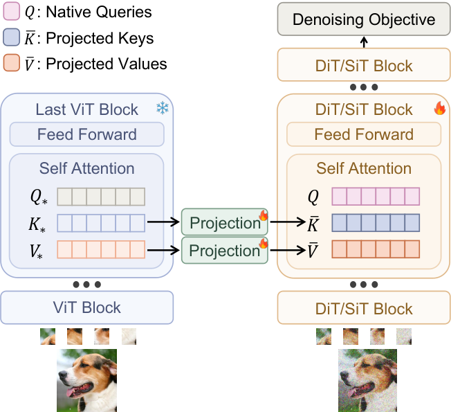
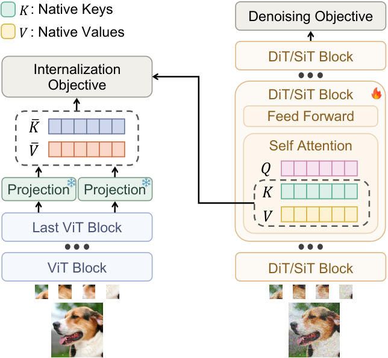
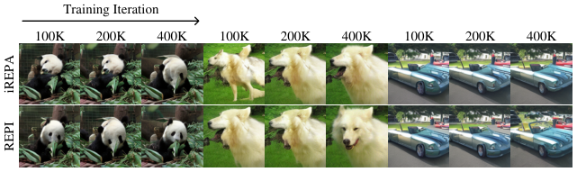

# AI Daily

## Scaffold Then Internalize: Representation Injection for Diffusion Transformers

> **一句話摘要：** REPI 不再只把 Diffusion Transformer（DiT）的 hidden states 對齊到外部視覺表徵，而是在訓練早期把預訓練視覺 encoder 的資訊直接注入 DiT 的 attention K/V，讓它先作為「支架（scaffold）」幫助去噪，再透過 internalization loss 讓 DiT 自己學會重建這份表徵；推理時移除 encoder，模型仍可用原本的 DiT 進行生成。[1] [2]

## 論文基本資訊

| 欄位 | 內容 |
|---|---|
| 論文標題 | *Scaffold Then Internalize: Representation Injection for Diffusion Transformers* |
| 方法名稱 | REPresentation Injection（REPI） |
| 作者 | Han Fu、Jiacheng Chen、Baoquan Zhao、Weidong Chen、Wei Liu、Qing Li、Xudong Mao |
| 研究單位 | Sun Yat-sen University、Video Rebirth、The Hong Kong Polytechnic University（依論文頁面列示）[1] |
| 發表狀態 | arXiv:2609.35292v1，2026-09-28；截至 2026-10-02，arXiv 頁面未列正式會議或期刊 venue，因此應視為預印本，而不是已被 CVPR、ICML 或 NeurIPS 接收的論文。[1] [2] |
| 主要任務 | DiT/SiT/DiG 的訓練加速與圖像生成品質提升 |
| 評估資料 | ImageNet 256×256、ImageNet 512×512、MS-COCO text-to-image |
| 主要 backbone | DiT、SiT、DiG、MM-DiT |
| 預訓練視覺 encoder | 預設為 DINOv2-B/14；實驗也比較多種 encoder。[1] |
| Repo 去重 | 已與 `KaiCobra/AI_Daily` 既有文章及 arXiv ID 比對；repo 中未找到 `2609.35292`、REPI 或完整標題。 |
| 論文連結 | [arXiv abstract](https://arxiv.org/abs/2609.35292)／[HTML 全文](https://arxiv.org/html/2609.35292v1)／[作者列出的程式碼頁](https://jeneveuxpas.github.io/REPI) |

我選擇 REPI，是因為它同時落在「圖像生成、Diffusion Transformer、表徵學習、attention modulation 與訓練效率」的交集，而且提出的不是另一個 inference-time heuristic，而是重新思考外部視覺表徵在生成模型訓練中應該扮演什麼角色。它也能自然連到你關注的 JEPA、Energy-based Transformer、VAR 與 training-free 研究方向。

## 為什麼這個問題重要？

DiT 的 scaling 特性很好，但從隨機噪聲學出足夠好的語義與空間表徵，通常需要很長的訓練。REPA 的觀察是：DiT 的生成效率受到 representation learning bottleneck 限制，因此讓 DiT 的中間狀態對齊到外部視覺 encoder，可以顯著加速訓練。[3]

REPI 問的是一個方向相反、但更積極的問題：既然外部 encoder 已經知道某些有用的視覺結構，為什麼只把它當成 loss target，而不讓它直接參與 denoising？論文因此把外部表徵從「監督訊號」改成「attention memory」，先讓生成器使用，再把這種能力內化回原本的 DiT。[1]

這個想法的關鍵不在於把 clean-image encoder 永久接到生成器上。因為標準生成推理時沒有 clean image，REPI 必須在訓練期間使用外部表徵，然後在推理前移除它。這使得方法的核心成為一種 **train-time privileged scaffold → inference-time self-contained model** 的轉換。

## 核心貢獻與創新點

1. **把表徵注入 denoising，而非只做表徵對齊。** REPA 是 diffusion-to-encoder 的對齊；REPI 則是 encoder-to-diffusion 的注入。兩者的資訊流方向不同，所以可以互補，而不是只能二選一。[1] [3]

2. **提出 scaffold-to-internalization 訓練流程。** 前期用外部 encoder 的 K/V 當支架，後期恢復 DiT 自己的 K/V，同時用 internalization loss 讓 native representation 靠近支架表徵。

3. **保留 noisy input 的原生 Query。** 論文沒有直接覆寫整個 hidden state，而是主要替換 attention 裡的 K/V。這保留了由 noisy input 算出的 Query 以及 residual shortcut，避免把前面層累積的輸入相關資訊切斷。[1]

4. **跨模型與任務驗證。** REPI 在 SiT、DiT、DiG 與 MM-DiT 上測試，包含 class-conditional ImageNet 與 MS-COCO text-to-image；它並不只對單一 DiT 實作有效。[1]

5. **重新定義「加速」的正確量測。** 論文最醒目的 43.5× 是達到相近 FID 所需的 training steps 比值，不是端到端 wall-clock 或 GPU energy 的 43.5×。在固定 100K steps、四張 H200 的比較中，REPI 相對 REPA 的訓練時間只增加 3.2%，REPA+REPI 增加 3.9%。[1]

## 技術方法：從 Flow Matching 到 REPI

### 1. DiT/SiT 的 flow-matching 目標

論文沿用 flow-matching／interpolant 類生成設定。給定乾淨樣本 $\mathbf{x}_*$、高斯噪聲 $\boldsymbol{\epsilon}\sim\mathcal{N}(0,I)$，以及時間 $t\in[0,1]$，建立插值狀態：

$$
\mathbf{x}_t=\alpha_t\mathbf{x}_*+\sigma_t\boldsymbol{\epsilon},
$$

其中 $t=0$ 接近資料端，$t=1$ 接近噪聲端。模型 $\mathbf{v}_\theta(\mathbf{x}_t,t,c)$ 預測該路徑的速度：

$$
\mathbf{v}_t=\dot{\alpha}_t\mathbf{x}_*+\dot{\sigma}_t\boldsymbol{\epsilon},
$$

並以 velocity matching loss 訓練：

$$
\mathcal{L}_{\mathrm{velocity}}(\theta)
=\mathbb{E}_{\mathbf{x}_*,\boldsymbol{\epsilon},t}
\left[
\left\|\mathbf{v}_\theta(\mathbf{x}_t,t,c)-\mathbf{v}_t\right\|_2^2
\right].
$$

SiT 將 diffusion 與 stochastic interpolant 統一在相同的 Transformer backbone 上，並以連續時間與 velocity prediction 改善 ImageNet 生成的收斂與品質。[4] REPI 的生成目標仍然是這個 denoising/velocity objective；它改變的是中間 attention representation 的來源。

### 2. REPA：REPI 的對照方向

REPA 將 DiT 中間狀態 $\mathbf{h}_t$ 投影到預訓練 encoder 的表徵空間。若 $f(\mathbf{x}_*)=\mathbf{y}_*$ 是 clean image 的外部表徵，$h_\phi$ 是投影 head，REPA 可抽象寫成：

$$
\mathcal{L}_{\mathrm{REPA}}
=-\mathbb{E}\left[
\frac{1}{N}\sum_{n=1}^{N}
\operatorname{sim}\left(h_\phi(\mathbf{h}_t^{[n]}),\mathbf{y}_*^{[n]}\right)
\right].
$$

這種方法把外部 encoder 當成「應該靠近的表徵目標」。REPI 的反轉是：先把 encoder 的表徵映射到 DiT attention 空間，讓它實際參與 denoising，再逐步移除這個依賴。[1] [3]

### 3. K/V injection：把外部表徵變成 attention memory

REPI 從預訓練視覺 encoder 最後一個 self-attention 層取出 clean image 的 $K_*$ 與 $V_*$。兩個可學習的線性投影把它們轉到 DiT 對應 attention layer 的空間：

$$
\bar{K}=h_{\phi_K}(K_*),
\qquad
\bar{V}=h_{\phi_V}(V_*).
$$

在目標 DiT block 中，保留由 noisy latent 算出的 native Query $Q$，但以 $\bar{K},\bar{V}$ 替換原本的 $K,V$：

$$
Z_{\mathrm{inj}}
=\operatorname{softmax}
\left(\frac{Q\bar{K}^{\top}}{\sqrt{d}}\right)\bar{V}.
$$

這個公式可以從兩個角度理解。$\bar K$ 決定 noisy query 要從外部語義記憶中「取哪裡」，$\bar V$ 決定被取出的內容；native $Q$ 則保留目前 noisy state 對外部記憶的查詢方式。因為 residual shortcut 仍在，前面層對 noisy input 的處理不會被整段丟掉。[1]

這也解釋了論文為什麼不直接覆寫 block output。Oracle 實驗中，直接替換 hidden state 的 FID 是 **212.5**，幾乎等於失敗；放在 attention 內部則可保留輸入依賴的訊息。Oracle 設定下 V-only injection 的 FID 是 **4.6**，但完整 REPI 需要後續移除 scaffold，因此最後 K/V injection 的 internalization 結果更好。[1]

*圖 1：論文 Figure 2(a) 的聚焦版。外部視覺表徵只在訓練早期扮演 scaffold。圖片取自 REPI 論文頁面。[1]*

### 4. Scaffold removal 與 internalization

若在訓練初期使用外部 K/V，模型很容易學會依賴它；若突然移除，模型可能再次失去穩定的語義結構。因此 REPI 讓模型在 scaffold 被移除後，仍以 native K/V 去逼近外部投影出的 K/V：

$$
\mathcal{L}_{\mathrm{int}}
=\frac{1}{|K|}\left\|K-\operatorname{sg}[\bar K]\right\|_F^2
+\frac{1}{|V|}\left\|V-\operatorname{sg}[\bar V]\right\|_F^2,
$$

其中 $\operatorname{sg}[\cdot]$ 是 stop-gradient。整體訓練目標為：

$$
\mathcal{L}
=\mathcal{L}_{\mathrm{velocity}}
+\lambda\mathcal{L}_{\mathrm{int}}.
$$

這裡的 stop-gradient 很重要：外部投影結果作為穩定 target，native K/V 才是需要學習的對象。方法不是要求 encoder 與 DiT 互相追逐，而是先把外部表示固定成 scaffold，再讓 DiT 的自有路徑吸收它。

論文的 standalone REPI 設定使用 20K steps 的 scaffold duration；SiT-B/L/XL 的 injection layer 分別是 6/8/8，$\lambda=2$。與 REPA 結合時，作者將 REPI 放在 REPA alignment layer 前方，並把 injection layer 改為 4、$\lambda$ 改為 0.25。[1]

*圖 2：論文 Figure 2(b) 的聚焦版。推理時 encoder 與 projection layers 都被移除。[1]*

## 實驗設定與結果

### 實驗設定

作者遵循 REPA 的 protocol：batch size 256、AdamW、learning rate $10^{-4}$、$(\beta_1,\beta_2)=(0.9,0.999)$、無 weight decay，使用 fp16、gradient clipping、EMA 與 `torch.compile`。ImageNet 實驗以 DINOv2-B/14 作為預訓練視覺 encoder，latent 來自預訓練 VAE；SiT 使用 Euler–Maruyama sampler，250 NFE。評估通常使用 50K generated samples，並回報 FID、sFID、IS、Precision 與 Recall。[1]

### ImageNet 256×256：無 CFG

下表是 SiT 主結果。REPI 在 B、L、XL 三個規模都比 REPA 有更低 FID；在 XL 上，REPA+REPI 以 160K steps 達到 8.22，接近 vanilla SiT 7M steps 的 8.30。[1]

| 模型／方法 | 訓練 steps | FID ↓ |
|---|---:|---:|
| SiT-B/2 | 400K | 33.00 |
| SiT-B/2 + REPA | 400K | 24.40 |
| SiT-B/2 + REPI | 400K | 19.47 |
| SiT-L/2 | 400K | 18.81 |
| SiT-L/2 + REPA | 400K | 9.70 |
| SiT-L/2 + REPI | 400K | 9.04 |
| SiT-XL/2 | 7M | 8.30 |
| SiT-XL/2 + REPA | 100K | 19.40 |
| SiT-XL/2 + REPI | 100K | 14.51 |
| SiT-XL/2 + REPA + REPI | 100K | 11.78 |
| SiT-XL/2 + REPA + REPI | 160K | **8.22** |
| SiT-XL/2 + REPA + REPI | 400K | **6.33** |

*圖 3：論文 Figure 3 的聚焦版，顯示相同初始噪聲下 iREPA 與 REPI 在 100K、200K、400K iterations 的生成樣本對照；它不是 FID 曲線，定量結果以表格為準。[1]*

### CFG、text-to-image 與實際訓練成本

在帶有 guidance interval 的 CFG 設定中，80 epochs 的 SiT-XL/2 結果為：REPI 的 FID 是 **1.79**，REPA+REPI 是 **1.73**；這說明 REPI 的效益不只存在於無 CFG 的特定設定。[1]

在 MS-COCO text-to-image 的 MM-DiT 實驗中，150K steps、ODE sampling、NFE=50 的 FID 如下：[1]

| 方法 | 無 CFG | 有 CFG |
|---|---:|---:|
| REPA | 10.40 | 4.73 |
| REPI | 9.47 | 4.61 |
| REPA + REPI | **9.08** | **4.56** |

更值得注意的是實際訓練成本。SiT-XL/2 在四張 NVIDIA H200 上訓練 100K steps 時，REPA 用時 4.63 小時；REPI 用時 4.78 小時，只增加 3.2%；REPA+REPI 用時 4.81 小時，只比 REPA 多 3.9%。在這個相近 wall-clock 設定下，FID 由 REPA 的 19.40 降至 REPI 的 14.51，再降至組合方法的 11.78；IS 則由 67.4 提高到 82.7 與 96.8。[1]

| 方法 | 100K steps 時間 | FID ↓ | IS ↑ |
|---|---:|---:|---:|
| REPA | 4.63 h | 19.40 | 67.4 |
| REPI | 4.78 h（+3.2%） | 14.51 | 82.7 |
| REPA + REPI | 4.81 h（+3.9%） | **11.78** | **96.8** |

因此，「43.5×」應該解讀成 **training-step efficiency**；如果要宣稱能源或 wall-clock 加速，仍需要完整量測 encoder extraction、資料管線、GPU utilization、記憶體與採樣成本。這個區分是閱讀本文時最重要的 metric hygiene。

### Ablation：為什麼是 K/V，而不是直接覆寫 hidden state？

在完整 REPI、SiT-XL/2、100K steps 的 injection-target ablation 中，K/V injection 最好：FID **14.51**、IS **82.71**。V-only 的 FID 是 15.53；K-only 是 15.81；直接替換 attention output 是 16.34；Q/K/V 全部替換反而是 17.40。[1]

這個結果與 oracle 實驗的 V-only 最佳不同，透露出兩個階段的目標並不一樣：oracle 只問「外部表徵能不能幫助 denoising」，而完整 REPI 還要問「外部表徵能不能被移除並被 native path 內化」。K 與 V 一起保留，讓模型同時學習外部 memory 的可尋址結構與內容。

其他消融也支持這個解釋。只使用 scaffold、在早期移除但不加 internalization objective，已能把 SiT-XL 在 400K steps 的 FID 從 17.2 降到 9.49；再加入 internalization objective 還能繼續改善。scaffold duration 從 10K 到 30K 的 FID 變化只有約 0.22；standalone REPI 的 $\lambda$ 在 1.0 到 4.0 間時，FID 約落在 7.21–7.28，顯示方法對這些超參數不太敏感。[1]

## 相關研究與技術脈絡

### REPA：從 alignment target 到 active denoising memory

REPA 的核心是把 noisy hidden state 對齊到 clean visual representation，原始工作報告在 SiT 上可超過 17.5× 加速訓練，並在 classifier-free guidance 與 guidance interval 下取得 FID 1.42。[3] REPI 的差別不是換一個 encoder，而是換一個資訊流方向：REPA 要求 DiT 的表示靠近 encoder；REPI 讓 encoder 表示先進入 DiT 的 attention，再要求 DiT 自己學會重建它。這解釋了為什麼 REPA 與 REPI 可以疊加。

### SiT 與 Self-Flow：生成目標本身是否足以學出語義？

SiT 研究了 continuous-time、velocity prediction、interpolant 與 sampler 的設計，建立了 REPI 主要實驗使用的 flow-based DiT backbone。[4] Self-Flow 則走另一條路：不依賴外部 encoder，而是用不同 token 的 noise levels 造成資訊不對稱，迫使模型在 flow matching 中同時學 representation；其 Dual-Timestep Scheduling 是 REPI 很值得比較的內生式替代方案。[5]

可以把兩者放在同一個問題上看：

- **REPI：** 外部表徵先提供高品質 scaffold，再內化到生成器。
- **Self-Flow：** 透過訓練任務本身製造 prediction pressure，讓生成器自行長出較強 representation。
- **下一步：** 用同一個 benchmark 比較外部 scaffold 的 sample efficiency 與內生 representation learning 的 scaling law，而不是只比較最終 FID。

### DINOv2 與 JEPA：外部表徵是否真的必須是「完整影像語義」？

REPI 預設使用 DINOv2-B/14。DINOv2 的定位是從大規模自監督學習得到可泛化的 visual features，適合作為跨任務的 representation teacher。[6] 但這也帶出一個問題：REPI 使用的是 clean image 的完整表徵，而不是只保留對未來或被遮蔽區域可預測的資訊。

I-JEPA 的核心精神是用 context 去預測 target 的 latent representation，而非重建全部像素。[7] 因此，JEPA 版本的 REPI 可以把 $K_*,V_*$ 換成 masked/future target 的 predictive latent $\hat{Y}$，再只把可預測的語義結構注入 attention。這有機會減少 clean-image shortcut，也更接近 world model 或 video generation 中的 temporal abstraction。

### Energy-Based Transformer：把 K/V compatibility 變成可校準訊號

REPI 本身不是 Energy-Based Transformer，也沒有學習一個可做 energy descent 的模型。Energy-Based Transformer 研究的是讓 Transformer 透過能量函數反覆更新狀態，並將 associative retrieval 與 iterative inference 納入可擴展架構。[8]

不過 REPI 的 attention logit 提供了一個自然接口。可以定義一個近似的 compatibility energy：

$$
E_t(q,\bar K)
=-\frac{1}{N}\sum_{i=1}^{N}
\frac{q_i\bar k_i^{\top}}{\sqrt d},
$$

或直接使用 native attention 與 injected attention 之間的 KL divergence 作為 disagreement。這些量可以決定哪一個 layer、timestep 或 token 需要 scaffold，哪一些位置已經被 native K/V 內化而可以停止額外計算。這是研究構想，不是 REPI 已經驗證的結論。

### VAR、training-free 與 zero-shot：如何把 REPI 的想法搬到推理端？

VAR 將圖像生成改寫為 coarse-to-fine 的 next-scale prediction，而不是 raster-order next-token prediction。[9] 因此可把 REPI 的介入單位從 DiT layer 改成 VAR scale：在早期 coarse scales 注入語義 K/V，在後期只保留 native K/V，並讓 $\lambda_s$ 隨尺度遞減。這可能同時處理 VAR 的 semantic drift 與細節生成成本。

但必須清楚區分三個概念：

1. REPI **不是 training-free**，因為 DiT、projection heads 與 internalization objective 都需要訓練。
2. REPI **不是 zero-shot generation**，它依賴從資料與外部 encoder 學到的新模型；推理時移除 encoder，不代表沒有 task-specific training。
3. REPI 的 attention 操作是 **training-time representation injection**，不是像 training-free editing 那樣在推理時直接調整 logits、K/V 或 sampling trajectory。

這三個界線很重要，否則很容易把「inference 時不需要 encoder」誤寫成「不用訓練」或「跨任務 zero-shot」。

## 個人評價與研究意義

我認為 REPI 的真正價值不是 43.5× 這個 headline，而是它把一個常被混在一起的問題拆成兩層：**外部表徵是否能改善 denoising？** 以及 **生成器能否把這份外部表徵吸收成自己的計算？** Oracle 與 internalization 的差異，讓 attention injection 不只是工程上的 feature replacement，而成為可測量的 representation transfer process。

它最有說服力的地方有三個。第一，hidden-state overwrite 的失敗與 K/V injection 的成功，提供了清楚的 architectural diagnosis。第二，REPI 在 REPA 失效或較弱的部分 encoder 上仍有改善，說明「直接參與 denoising」可能比單純相似度 alignment 更有彈性。第三，四張 H200 的成本表把 training-step speedup 與實際時間分開，讓結果更容易被正確解讀。[1]

但我不會把它當作已經解決 DiT training 的定論。論文仍是 arXiv 預印本，主要證據來自 ImageNet 與 MS-COCO；clean-image scaffold 可能在訓練期間提供一種很強的 privileged signal，而這種 signal 在 domain shift、長影片、細粒度構圖或複雜文字條件下是否能被完整內化，尚未被充分測試。作者也寫明程式碼將會公開，重現性仍要等完整 code、checkpoint 與訓練成本資料釋出後再判斷。[1] [2]

## 可以直接延伸的研究題目

### 1. Energy-Gated REPI

凍結或部分訓練 REPI，額外計算 native K/V 與 scaffold K/V 的 attention disagreement：

$$
D_t=\operatorname{KL}
\left(
A_t^{\mathrm{native}}\,\middle\|\,A_t^{\mathrm{scaffold}}
\right),
\qquad
A_t=\operatorname{softmax}\left(\frac{QK^\top}{\sqrt d}\right).
$$

只有當 $D_t>\tau$ 時才啟用 scaffold 或 internalization loss。評估不只看 FID，還要回報 H200 energy、wall-clock、NFE、activation memory、FID/IS 與 layer-wise intervention rate。這會把 REPI 從固定 20K scaffold schedule 推進成可校準的 energy-based controller。

### 2. JEPA-REPI：只注入可預測的語義

令 $f_\theta$ 是 context encoder、$p_\psi$ 是 JEPA predictor、$y_*$ 是 target encoder 表徵，將 REPI 的外部 memory 改成：

$$
(\bar K,\bar V)
= h_\phi\left(p_\psi(f_\theta(x_{\mathrm{context}}))\right).
$$

這樣模型不再直接讀取完整 clean image 的 representation，而是讀取由 context 預測出的 semantic target。對 ImageNet-C、COCO-Caption shift、video frame prediction 與未見類別做 transfer，可以測試 predictive representation 是否比 static DINOv2 feature 更容易被生成器內化。

### 3. Scale-wise REPI for VAR

對 VAR 的第 $s$ 個尺度，使用不同的 injection strength：

$$
\bar K_s=(1-\alpha_s)K_s+\alpha_sK_s^{\mathrm{ext}},
\qquad
\bar V_s=(1-\alpha_s)V_s+\alpha_sV_s^{\mathrm{ext}},
$$

並讓 $\alpha_s$ 由 compatibility energy、prompt satisfaction 或 predictive disagreement 決定。粗尺度以高語義約束確定 layout，細尺度逐步回到 native token dynamics。這會把 REPI 的「先借用、再內化」轉成 VAR 的「先語義、後細節」生成政策。

### 4. 真正的 training-free attention modulation

REPI 論文不是 training-free，但其 K/V 介面可以提供一個可驗證的 inference-only baseline：不更新 DiT 權重，只使用一個已存在的視覺 encoder 或 reference image，對 attention 做：

$$
K'=K+\alpha\,\Delta K,
\qquad
V'=V+\beta\,\Delta V,
$$

其中 $\Delta K,\Delta V$ 來自 reference 或 JEPA predictive target。研究重點應放在「什麼時候介入」與「什麼時候停止」，而不是只報一個固定 $\alpha$。要嚴格稱為 zero-shot，必須使用未見類別、未見 domain、未見 prompt template，且不能為每個新任務重新訓練 controller。

## 結論

REPI 將外部視覺表徵在生成訓練中的角色從 **alignment target** 推進到 **temporary denoising memory**，再透過 internalization 將它變成 DiT 自己的 representation。其最值得記住的設計原則是：不要粗暴覆寫 Transformer block output；保留 native Query 與 residual path，把外部知識放在 attention 內部可尋址的 K/V 介面，再讓模型學會在沒有外部 encoder 的情況下重建這種結構。

對你目前關注的方向而言，REPI 最適合作為一個「連接器」：它可以接上 JEPA 的 predictive target、Energy-based Transformer 的 compatibility energy、VAR 的 scale-wise token hierarchy，以及 training-free attention modulation 的 inference policy。下一個真正有研究價值的問題不是「要不要再加一個 encoder」，而是：**模型能否知道何時仍需要外部語義支架，以及何時已經足以靠自己的 latent dynamics 生成？**

## References

[1]: https://arxiv.org/html/2609.35292v1 "Scaffold Then Internalize: Representation Injection for Diffusion Transformers — full paper HTML"
[2]: https://arxiv.org/abs/2609.35292 "Scaffold Then Internalize: Representation Injection for Diffusion Transformers — arXiv abstract and metadata"
[3]: https://openreview.net/forum?id=DJSZGGZYVi "Training Diffusion Transformers Is Easier Than You Think — REPA"
[4]: https://arxiv.org/html/2401.08740v1 "SiT: Exploring Flow and Diffusion-based Generative Models with Scalable Interpolant Transformers"
[5]: https://arxiv.org/abs/2603.06507 "Self-Supervised Flow Matching for Scalable Multi-Modal Synthesis — Self-Flow"
[6]: https://arxiv.org/abs/2304.07193 "DINOv2: Learning Robust Visual Features without Supervision"
[7]: https://arxiv.org/abs/2301.08243 "Self-Supervised Learning from Images with a Joint-Embedding Predictive Architecture — I-JEPA"
[8]: https://arxiv.org/abs/2507.02092 "Energy-Based Transformers are Scalable Learners and Thinkers"
[9]: https://arxiv.org/abs/2404.02905 "Scalable Image Generation via Next-Scale Prediction — VAR"
[10]: https://jeneveuxpas.github.io/REPI "REPI project page listed by the authors"
