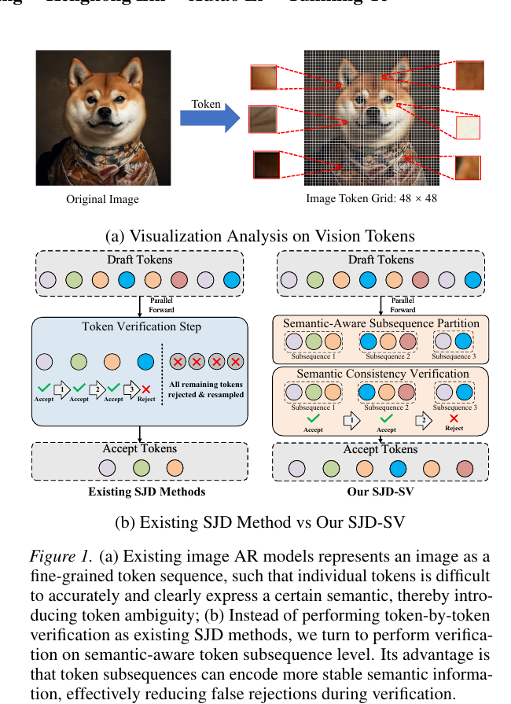
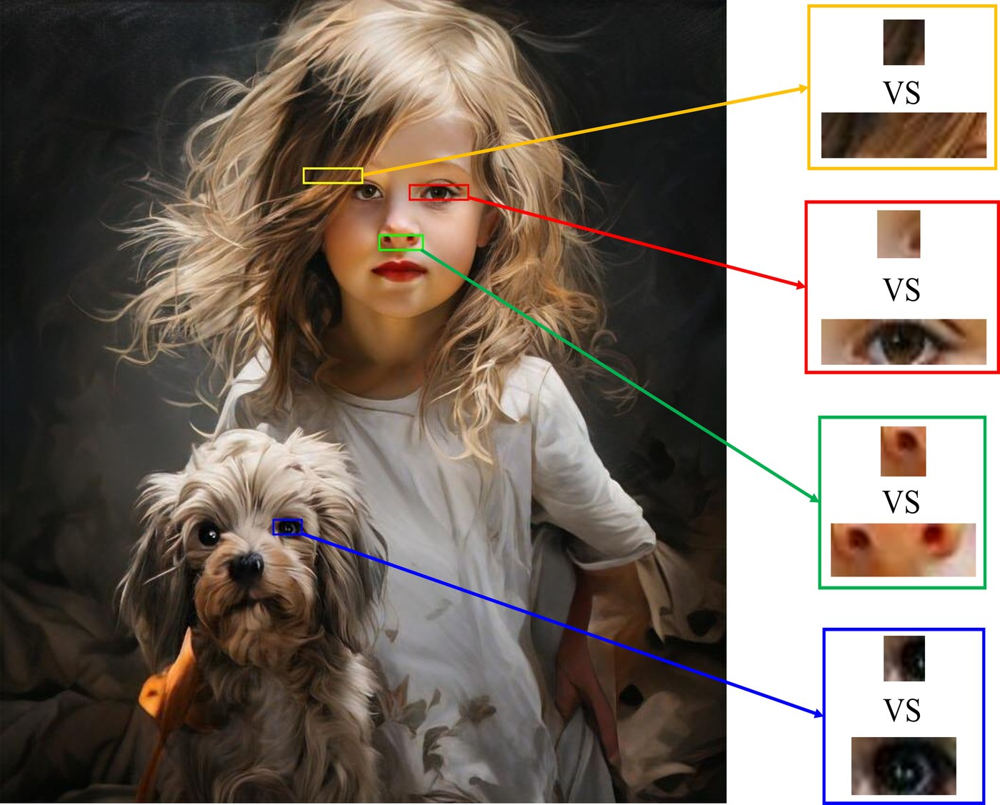
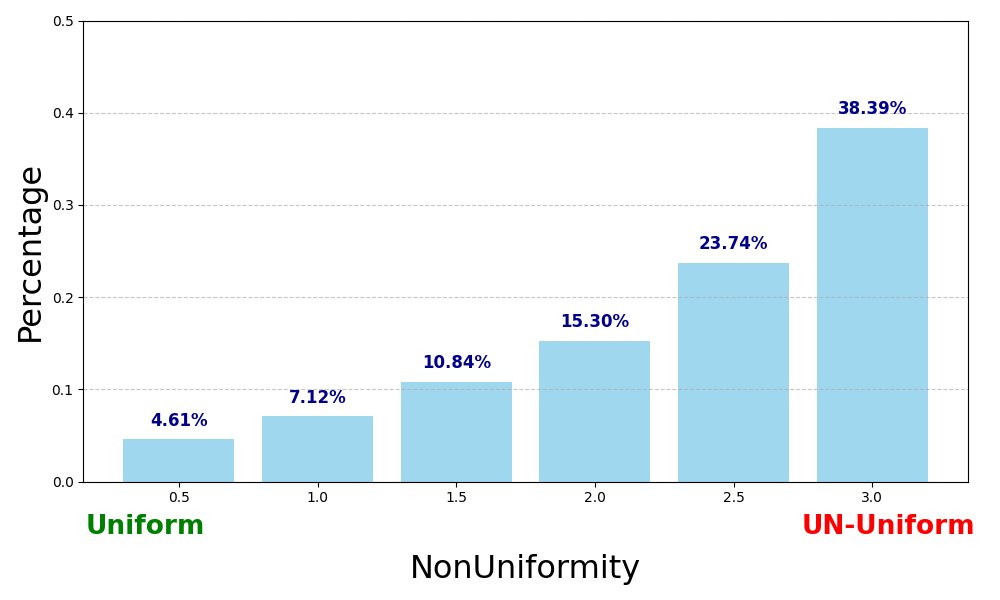

# AI Daily

**日期：2026-10-01**  
**今日主題：Training-Free Inference、Speculative Jacobi Decoding、Visual Autoregressive Image Generation**  
**作者：Manus AI**

## SJD-SV: Speculative Jacobi Decoding with Semantics Verification for Autoregressive Image Generation

今日精選 **SJD-SV**。論文由 Baoquan Zhang、Bingqi Shan、Shihao Fang、Kenghong Lin、Xutao Li 與 Yunming Ye 撰寫，主要來自 **Harbin Institute of Technology, Shenzhen**，Bingqi Shan 亦列有 Pengcheng Laboratory affiliation。論文收錄於 **ICML 2026**，正式論文首頁標示 *Proceedings of the 43rd International Conference on Machine Learning, PMLR 306, 2026*；arXiv v1 於 2026-09-04 公開。[1] [2] [3]

> **一句話摘要：** SJD-SV 發現視覺 token 太細，每個 token 往往只描述很小、語義不清楚的局部 patch，所以逐 token speculative verification 很容易誤拒絕本來合理的候選；它不改模型、不微調，改以 token probability 的非遞減區段建立 semantic-aware subsequence，再以 subsequence 的 joint likelihood 驗證，讓 SJD、GSD、LANTERN 等既有方法在保持 FID/CLIP 品質的情況下進一步降低 NFE 和 latency。

## 為什麼今天選它

本次先排除 `KaiCobra/AI_Daily` 實際 Git 索引中已存在的 Logit Refiner，再從未收錄候選中優先考慮頂會、VAR/AR、training-free 與推理效率方向。SJD-SV 最終入選的原因是：它是 **ICML 2026** 論文，直接處理 visual autoregressive generation 的推理瓶頸，完全符合使用者偏好的 training-free、VAR-based 與 zero-shot inference 脈絡，而且提出的問題診斷可以自然連到 energy-based verifier、JEPA predictive check 和 scale-wise adaptive compute。

更重要的是，SJD-SV 沒有把「速度提升」簡化為放寬 threshold。它先問：**為什麼視覺 token 的 acceptance rate 特別低？** 作者的回答是，單一視覺 token 的語義約束太弱。這個觀察把研究方向從「如何更寬鬆地接受 token」推向「應該以什麼粒度判斷 semantic consistency」。

本篇也明確區分三個容易混淆的詞：

- **Training-free**：SJD-SV 凍結既有 autoregressive model，不需要 fine-tuning 或改 architecture。
- **Plug-in**：它可以加在 SJD 以及 SJD 的變體 GSD、LANTERN 上，不必重訓生成模型。
- **不是新的 VAR backbone**：它目前主要在 Lumina-mGPT、Emu3 和 LlamaGen 等 fine-grained visual AR 模型上驗證，並沒有在原始 VAR 的 next-scale schedule 或 Infinity 上報告實驗。[1] [2]

## 研究背景：為什麼 AR 圖像生成很慢

自回歸圖像生成先把圖片轉成離散 visual token，再依序預測下一個 token。令 conditioning input 為 $c$，目標圖像 token sequence 為 $y_{1:N}$，標準 autoregressive factorization 是

\[
p(y_{1:N}\mid c)
=\prod_{n=1}^{N}
 p(y_n\mid y_{<n},c).
\]

因此生成完整圖片理想上需要 $N$ 次 sequential model evaluations。對高解析度圖像，$N$ 可以達到數百或數千；例如論文分析的 Lumina-mGPT 使用 $48\times48$ token grid，總序列長度為 2,304。AR 模型的優點是能直接建模複雜語義與細節，代價則是每一步都必須等待前一步的 token。[1]

### SJD 如何在不訓練的情況下平行化

Speculative Jacobi Decoding（SJD）把一段未來 token 當成 draft window。給定目前已接受的 prefix，SJD 先以 Jacobi-style iteration 平行提出多個候選，再用同一個 target model 的概率分布逐步 verification。若第 $i$ 個候選通過，就接受它；若某個位置失敗，後面的候選通常一併丟棄，並從第一個失敗位置重新 sample。[4] [5]

令 draft distribution 為 $p_i$，verification/target distribution 為 $q_i$，對已 draft 的 token $\hat{x}_i$，標準 speculative acceptance probability 為

\[
a_i
=\min\left(1,
\frac{q_i(\hat{x}_i)}{p_i(\hat{x}_i)}
\right).
\]

SJD 的速度由一個核心量控制：每次 verification 平均能接受多少 token。若候選經常在 window 的前幾個位置被拒絕，後面的平行 draft 就無法轉換成真正減少的 sequential evaluations。

### 視覺 token 的 ambiguity 不等於文字 token 的 ambiguity

語言 token 往往對應詞或 subword，受語法和語義上下文強約束；下一個 token 的 probability 可能相對集中。視覺 token 則通常只對應一個很小的局部 patch。單一 patch 可能只是頭髮的一小段、眼睛的邊緣或材質紋理，許多離散 code 都可能產生視覺上可接受的局部結果。

這會造成兩種困難：

1. target 與 draft 對單一 token 的 top choice 可能不同，但兩者 decode 出來的局部語義其實都合理。
2. 單一 token 的 probability 不能穩定代表一個完整 semantic unit，因此嚴格的 token-level acceptance 會產生 false rejection。

LANTERN 將這個現象稱為 visual AR 的 **token selection ambiguity**，並以 latent-neighbor relaxation 放寬接受條件。[6] SJD-SV 的新增觀點是：即使不改變 acceptance strictness，也可以先改變 **verification granularity**，不要讓一個語義不完整的 token 單獨決定整段 draft 的命運。

## 核心貢獻

第一，論文以視覺化分析說明 token ambiguity 的來源：高解析度圖像需要細粒度 token 來表達局部細節，但細粒度也讓單一 token 的語義變得不充分。作者因此把問題定位為 **semantic under-specification of individual visual tokens**，而不只是模型 confidence 不夠。[1]

第二，論文提出 semantic-aware token subsequence partition。它不使用額外的 semantic encoder，而是觀察一段 draft 中各 token 的 target probability。如果 probability 沿 sequence 非遞減，作者將這些 token 視為同一個可能逐步變得更確定的局部語義單元。

第三，論文提出 adaptive joint probability estimation。直接把整段 subsequence 的所有 token probability 相乘，會讓前面高度不確定的 token 過度影響 joint score。SJD-SV 會保留 probability mass 主要集中的高信心 suffix，再進行 joint verification。

第四，論文提出 progressive fallback。若整段 suffix 驗證失敗，不直接丟掉整個 subsequence，而是逐步移除尾端 token，保留已確認的 prefix，直到找到可接受的最長 suffix；只有第一個失敗位置之後的 token 需要重新 sample。

第五，方法是 **plug-in、training-free、model-agnostic**。在論文的實驗中，同一個 SJD-SV 概念可以附加到 SJD、GSD、LANTERN，也能延伸到 Emu3 和 LlamaGen。[1] [2]

## Figure：從細粒度 token 到 semantic-aware verification

*圖 1。論文 Figure 1 的局部裁切版本。左上把一張圖轉成 $48\times48$ token grid；左下是既有 SJD，某個 token 一旦被拒絕，後續 token 會一起被丟棄。右下先把 draft 分成 semantic-aware subsequences，再以 subsequence-level consistency verification 接受或拒絕。圖片由論文 PDF 使用 `pdf-image-extractor` 提取後，只保留 Figure 1 和圖說相關區域。[1]*

## 技術方法詳解

### 1. Semantic-aware subsequence partition

令 Jacobi draft window 為 $\hat{x}_{1:L}$。在 verification forward 中，對位置 $i$ 計算 target model 對 drafted token $\hat{x}_i$ 的 probability：

\[
q_i=q_i(\hat{x}_i\mid \hat{x}_{<i},c).
\]

SJD-SV 從起點 $b$ 開始，把連續 probability 非遞減的 token 放進同一個 subsequence $\mathcal{S}_k=\hat{x}_{b:e}$：

\[
q_b(\hat{x}_b)
\le q_{b+1}(\hat{x}_{b+1})
\le \cdots
\le q_e(\hat{x}_e).
\]

當下一個位置出現 confidence drop，就在前一個位置結束：

\[
q_{e+1}(\hat{x}_{e+1})
<q_e(\hat{x}_e).
\]

如此反覆掃描整個 draft，就能得到變長的 subsequence set

\[
\mathcal{S}
=\{\mathcal{S}_1,\ldots,\mathcal{S}_M\}.
\]

這個規則的直覺是：在一個局部語義單元中，先出現的 token 可能仍然模糊，後面的 token 隨著局部 context 完整而變得更可預測。連續上升的 confidence 因而被當作「這些 token 正在共同形成一個 semantic unit」的訊號。

需要精確說明的是，SJD-SV 的「semantic-aware」不是由 CLIP、文字 encoder 或 learned energy model 直接判定。它是從既有 target probability 的序列形狀推導出的 heuristic grouping。語義一詞描述 grouping 的效果與動機，不代表模型額外取得了人類可解釋的 object segmentation。

### 2. 為什麼不直接乘上整段 probability

最直接的 subsequence joint probability 是

\[
Q_{b:e}(\hat{x}_{b:e})
=\prod_{i=b}^{e}q_i(\hat{x}_i).
\]

但作者分析被拒絕的 subsequences 後發現，token probability 通常高度不均勻：前面的 token probability 低，代表它們仍有很多 plausible candidates；後面的 token probability 高，反而更能鎖定局部語義。若把前面的低信心 token 一視同仁地乘進 joint score，這些 ambiguous prefix token 會主導 rejection。

論文的 Figure 2(a) 用局部 patch 直觀展示這個現象：單一 patch 可能有多個看起來相近的候選，但連續 token 共同描述的區域比較穩定。Figure 2(b) 則量化 subsequence 內的 probability non-uniformity；越靠近右側，token confidence 的分布越不均勻。

*圖 2。論文 Figure 2(a) 的縮小版本。不同顏色框標示局部 token；單一 token 對應的 patch 很小，但連續 token 的組合能保留更穩定的局部結構。[1]*

*圖 3。論文 Figure 2(b) 的局部提取版本。non-uniformity 越高，表示同一 subsequence 中 token confidence 差異越大，單純等權重乘積越容易被不確定 prefix 影響。[1]*

### 3. Adaptive high-confidence suffix

令完整 subsequence 為 $\hat{x}_{b:e}$。SJD-SV 引入 confidence proportion threshold $\alpha\in(0,1)$，從 subsequence 中找最大的起點 $b_g$，使高信心 suffix 的 probability sum 至少佔完整 subsequence 的 $\alpha$：

\[
\frac{
\sum_{i=b_g}^{e}q_i(\hat{x}_i)
}{
\sum_{i=b}^{e}q_i(\hat{x}_i)
}
\ge \alpha.
\]

實際驗證只在 suffix $\hat{x}_{b_g:e}$ 上計算 joint ratio：

\[
Q_{\mathcal{S}_k}(\hat{x}_{b:e})
=\prod_{i=b_g}^{e}q_i(\hat{x}_i).
\]

這個設計有兩個效果。第一，它保留同一 subsequence 的後半段高信心語義 anchors。第二，它避免一個很模糊的起始 token 直接讓整個局部 semantic group 被拒絕。作者在 Parti-prompt 上固定使用 $\alpha=0.8$，並透過消融比較 $0.5$ 到 $1.0$。[1]

### 4. Subsequence verification 與 fallback

對 draft distribution $p_i$ 和 target distribution $q_i$，SJD-SV 對 high-confidence suffix 使用一個 joint acceptance ratio：

\[
r_{b_g:e}
=\min\left(
1,
\prod_{i=b_g}^{e}
\frac{q_i(\hat{x}_i)}{p_i(\hat{x}_i)}
\right).
\]

抽樣 $u\sim U[0,1]$。若 $u\le r_{b_g:e}$，整個 suffix 通过；若不通過，SJD-SV 不像 baseline 那樣立即丟棄全部候選，而是令 $e'\gets e-1$，重新驗證縮短後的 suffix：

\[
\hat{x}_{b_g:e'},
\qquad e'=e-1,e-2,\ldots,b_g.
\]

找到最長可接受 prefix 後，只在第一個未通過位置 $e'+1$ 重新 sample。論文使用 standard rectified distribution：

\[
x_{e'+1}
\sim
\operatorname{norm}
\left(
\max\left(0,
q_{e'+1}-p_{e'+1}
\right)
\right).
\]

這個 fallback 會把「整段被拒絕」改成「保留可證實的部分，只修復第一個不一致位置」。因此速度改善不只來自把多個 token 放到同一個 acceptance event，也來自減少 rejection 後的無謂 resampling。

### 5. 為什麼理論上 acceptance rate 不會下降

標準 SJD 對 subsequence 中每個 token 使用獨立的 uniform random variable $u_i$。長度為 $k$ 的 draft sequence，其 acceptance probability 為

\[
P_{\mathrm{SJD}}
=\prod_{i=1}^{k}
\min\left(1,
\frac{q_i(\hat{x}_i)}{p_i(\hat{x}_i)}
\right).
\]

SJD-SV 將整個 subsequence 視為一個 event，只使用一個 uniform random variable，因此

\[
P_{\mathrm{SV}}
=\min\left(1,
\prod_{i=1}^{k}
\frac{q_i(\hat{x}_i)}{p_i(\hat{x}_i)}
\right).
\]

對任意非負 $a_i$，有

\[
\min\left(1,\prod_{i=1}^{k}a_i\right)
\ge
\prod_{i=1}^{k}\min(1,a_i).
\]

令 $a_i=q_i/p_i$，便得到

\[
P_{\mathrm{SV}}
\ge P_{\mathrm{SJD}}.
\]

這個不等式解釋了 SJD-SV 的核心：若某些 token 的 ratio 小於 1，但同一 subsequence 後面的 ratio 足夠大，整段 joint ratio 仍可能高於逐 token acceptance 的乘積。換句話說，SJD-SV 把 token-level false negative 轉換成 sequence-level semantic consistency 判斷。

### 6. Distributional consistency 的解讀

若 draft sequence 的 joint probability 是 $p(\hat{x})$，target verification distribution 的 joint probability 是 $q(\hat{x})$，則被 draft 並且通過 acceptance 的輸出機率與下式成正比：

\[
P_{\mathrm{out}}(\hat{x})
\propto
p(\hat{x})
\min\left(1,
\frac{q(\hat{x})}{p(\hat{x})}
\right)
=q(\hat{x}).
\]

這是論文主張 distributional consistency 的理想化推導。它依賴 joint $p$、joint $q$ 和 exact acceptance ratio 都被正確計算。實際系統還加入 adaptive suffix、fallback、finite numerical precision 和 Jacobi draft approximation，因此閱讀時應把這個結果理解成方法設計的理論基礎，而不是對所有工程近似的無條件保證。[1]

## 實驗設定與結果

作者在單張 NVIDIA A100 80GB 上實驗，所有設定遵循 GSD，以保持 baseline 公平；SJD-SV 的 confidence proportion threshold 設為 $\alpha=0.8$。資料包含 1,600 個 diverse/complex 的 Parti-prompt，以及 MS-COCO 2017 的自然場景 caption。評估指標包括：

- **Latency**：完成一張圖的秒數，越低越好。
- **NFE**：Number of Function Evaluations，越低越好。
- **Acceleration**：相對原始 Lumina-mGPT 的 latency 或 NFE 比值，越高越好。
- **FID**：視覺分布與 fidelity，越低越好。
- **CLIP-Score**：文字—圖像語義對齊，越高越好。[1]

### Parti-prompt

在 Parti-prompt 上，原始 Lumina-mGPT 是 79.37 秒、2,392 NFE。原始 SJD 降到 36.07 秒、1,035.3 NFE，也就是 latency 2.20×、NFE 2.31× 的 acceleration；SJD-SV 再降到 **30.48 秒、826.32 NFE**，達到 **2.60× latency acceleration、2.89× NFE acceleration**，FID 為 32.13，接近 SJD 的 32.09。

把 SJD-SV 加到其他 verification 方法也有改善：

- **GSD → GSD-SV**：33.36 → **30.77 秒**；898.97 → **721.47 NFE**；NFE acceleration 由 2.66× 提升到 **3.32×**；CLIP 32.11 → 32.12。
- **LANTERN → LANTERN-SV**：31.40 → **27.72 秒**；636.66 → **552.93 NFE**；NFE acceleration 由 3.76× 提升到 **4.33×**；CLIP 32.10 → 32.11。

這組結果支持 plug-in claim，但也顯示不同 baseline 的收益不同。LANTERN-SV 的 NFE 較低，並不代表 SJD-SV 單獨勝過所有 verification relaxation；它更像一個可疊加的 verification granularity module。

### MS-COCO 2017

在 COCO 上，原始 Lumina-mGPT 是 86.55 秒、2,379 NFE。SJD-SV 的結果是 **32.92 秒、866.80 NFE**，相對 baseline 為 **2.63× latency acceleration、2.74× NFE acceleration**；FID 為 30.76，CLIP-Score 為 **31.33**。原始 SJD 是 40.10 秒、1,058.6 NFE、FID 30.78、CLIP 31.31，因此 SJD-SV 同時降低成本並帶來很小的品質改善。

這個改善幅度要精確表達：SJD-SV 的主要貢獻是降低 NFE/latency，並保持品質；它不是一個用來提升生成畫質的新 generator。COCO 的 FID 只由 30.78 變為 30.76，CLIP 由 31.31 變為 31.33，應視為品質沒有被破壞，而不是顯著的 quality breakthrough。[1]

### Token ambiguity 消融

作者將 token 分成 ambiguous positions 和 clear positions，比較 SJD 與 SJD-SV 的 acceptance rate：

- **All tokens**：60.53% → **64.16%**，增加 3.63 個百分點。
- **Ambiguous tokens**：56.49% → **62.03%**，增加 5.54 個百分點。
- **Clear tokens**：61.67% → **65.83%**，增加 4.16 個百分點。

ambiguous positions 的提升最大，直接支持作者的機制說法：方法不是只把所有 token 均勻放寬，而是特別減少局部語義尚未穩定時的 false rejection。[1]

### Fallback mechanism

在 Parti-prompt 上，不使用 fallback 時 latency 是 35.78 秒、972.92 NFE、CLIP 32.11；加入 fallback 後降到 **30.48 秒、826.32 NFE**，CLIP 反而升到 32.13。這表示 fallback 保留有效 prefix 的確減少了整段 rejection 和重採樣。

### Adaptive suffix 與固定長度比較

固定只驗證最後 1 個 token 時 latency 最低，26.29 秒、710.83 NFE，但 CLIP 只有 31.04；固定最後 2、3、4 個 token 時，品質逐步上升，成本也升高：

- Fixed-2：28.84 秒、760.92 NFE、CLIP 31.76。
- Fixed-3：30.53 秒、822.11 NFE、CLIP 32.09。
- Fixed-4：32.74 秒、867.37 NFE、CLIP 32.11。
- Verify all：33.25 秒、877.29 NFE、CLIP 32.08。
- **Adaptive（SJD-SV）**：**30.48 秒、826.32 NFE、CLIP 32.13**。

因此 adaptive suffix 的價值不是取得最低 latency，而是在接近最佳品質的情況下避免永遠驗證整段 subsequence。這是它比單純 fixed-$k$ heuristic 更合理的地方。

### Threshold $\alpha$ 的敏感度

在 Parti-prompt 上，$\alpha=1.0$ 等同保留全部 token 的 probability mass，結果為 33.25 秒、877.29 NFE、CLIP 32.08。降低到 $\alpha=0.9$ 時為 31.44 秒、843.53 NFE、CLIP 32.11；論文預設的 $\alpha=0.8$ 為 **30.48 秒、826.32 NFE、CLIP 32.13**。

再降低到 $\alpha=0.7$、$0.6$、$0.5$，結果分別為 29.13/790.84/32.06、27.38/748.26/32.01、24.68/670.80/31.88（依序為 latency/NFE/CLIP）。因此 $\alpha$ 太低會換取更多速度，卻讓 CLIP 開始下降；$0.8$ 是作者在這個 benchmark 上的品質—效率折衷，而不是一個由理論唯一決定的常數。[1]

### 額外計算 overhead

SJD-SV 主要新增 subsequence partition、suffix probability aggregation 和 fallback。論文以 latency-per-NFE 比較額外時間，報告 SJD-SV 約 **2.05 ms**，GSD-SV 約 5.54 ms，LANTERN-SV 約 0.81 ms。這個 overhead 相對 target model forward 很小，所以端到端 latency 的改善主要由 NFE 減少決定。

### 跨模型泛化

作者也把方法加到其他 AR image model：

- **Emu3**：vanilla 780.98 秒、8,193 NFE；加上 SJD-SV 後 180.30 秒、2,786.1 NFE，達到 **4.33× latency acceleration、2.94× NFE acceleration**，CLIP 32.13 → 32.16。
- **LlamaGen**：vanilla 30.58 秒、927.5 NFE；加上 SJD-SV 後 19.43 秒、555.4 NFE，達到 **1.57× latency acceleration、1.67× NFE acceleration**，CLIP 28.14 → 28.17。

這些結果讓 plug-in claim 更可信，但不同 model 的 baseline tokenization、sequence length 和 model forward cost 都不同，不能直接以 acceleration ratio 排出一個跨模型排行榜。[1]

## 相關研究分析

### 1. 原始 SJD：把 Jacobi decoding 變成 probabilistic acceptance

原始 SJD 針對傳統 Jacobi decoding 只能支援 greedy decoding 的問題，引入 probabilistic convergence criterion，使 speculative parallel decoding 能保留 sampling-based image diversity。[4] [5]

SJD-SV 不取代 SJD 的 draft 机制，也不要求另訓一個 drafter。它只改寫 verification：原始 SJD 對 draft window 的 token 做細粒度接受判斷，SJD-SV 則先找 subsequence，再對 subsequence 做 joint acceptance。可以把兩者理解成：SJD 解決「如何用概率接受平行 draft」，SJD-SV 解決「應該以什麼單位接受 draft」。

### 2. LANTERN：relax strictness，SJD-SV：改變 granularity

LANTERN 發現 visual AR 的 token probability 分布較分散，傳統 speculative decoding 對單一 top token 的要求過於嚴格，因此用 latent-neighbor token acceptance relaxation，並以 total variation bound 控制 distribution deviation。作者在 LlamaGen 上報告，random sampling 的 acceleration 可由 0.93× 提升到 1.64×。[6]

SJD-SV 的方向與 LANTERN 正交：

- LANTERN 問的是「token 必須完全匹配嗎？」
- SJD-SV 問的是「單一 token 是適當的 verification unit 嗎？」

因此 SJD-SV 可以作為 LANTERN 的後置 module，論文的 LANTERN-SV 實驗也正是這樣驗證。

### 3. GSD：將可接受 token 分群

GSD 是 ICCV 2025 的 training-free acceleration 方法，觀察到視覺 token 具有 redundancy 和 diversity，不應只接受 target model 的單一最可能 token。它以 dynamic grouping 評估一群視覺上有效的 token，官方頁面報告平均 3.7× acceleration。[7]

GSD 與 SJD-SV 都拒絕「單一 token 等於唯一正確答案」的假設，但方法焦點不同。GSD 主要建立候選 token cluster；SJD-SV 主要建立沿著 draft sequence 的 semantic-aware subsequence，並計算 joint likelihood。前者偏向 **candidate-space grouping**，後者偏向 **sequence-granularity grouping**。兩者能組合，且論文確實報告 GSD-SV 的結果。

### 4. SJD-VP：利用 Jacobi iteration 的時間訊號

SJD-VP 觀察到，跨 Jacobi iterations，probability 上升的 token 更可能在後續 verification 中被接受，因此用 probability change 預測 verification outcome。[8]

SJD-VP 與 SJD-SV 是另一組很自然的互補：

- **SJD-VP** 使用 iteration-to-iteration temporal signal，判斷哪個 token 更可能變對。
- **SJD-SV** 使用同一 draft window 內的 spatial/sequence confidence trend，判斷哪些 token 應共同驗證。

未來可以測試「probability trend across iterations」與「non-decreasing probability within subsequence」是否能形成統一的 acceptance energy，而不是各自使用獨立 heuristic。

## 與使用者偏好方向的連接

### Energy-based Transformer：把 verification 寫成 compatibility energy

SJD-SV 目前使用 ratio-based acceptance，而不是 learned energy model。但可以把每個 draft token 的 negative log probability 寫成局部 energy：

\[
E_i(\hat{x}_i)
=-\log q_i(\hat{x}_i).
\]

其 partition rule

\[
q_b(\hat{x}_b)
\le q_{b+1}(\hat{x}_{b+1})
\le\cdots\le q_e(\hat{x}_e)
\]

等價於

\[
E_b(\hat{x}_b)
\ge E_{b+1}(\hat{x}_{b+1})
\ge\cdots\ge E_e(\hat{x}_e).
\]

也就是說，SJD-SV 把 energy 下降的連續區段視為一個可共同驗證的 unit。未來可加入 entropy、draft-target KL、latent distance 或 region-level energy：

\[
E_{\mathrm{group}}(\mathcal{S}_k)
=\sum_{i\in\mathcal{S}_k}E_i
+\lambda E_{\mathrm{coherence}}(\mathcal{S}_k)
+\mu E_{\mathrm{future}}(\mathcal{S}_k).
\]

這會把手寫的 monotonic probability heuristic 推向 **energy-gated verification**。但要注意，這是研究延伸，不是 SJD-SV 已完成的 Energy-Based Transformer。

### JEPA：以 predictive consistency 判斷 subsequence 是否真的有語義

SJD-SV 用 probability trend 推測 subsequence 的 semantic coherence，卻沒有直接驗證「這段 token 能否預測未來 latent」。JEPA-style critic 可以補上這一點：給定候選 subsequence representation $z_{\mathcal{S}_k}$，預測下一段 token 或下一個 latent target $z_{k+1}$：

\[
E_{\mathrm{JEPA}}(\mathcal{S}_k)
=\left\|
 g_{\psi}(z_{\mathcal{S}_k})
-ar z_{k+1}
\right\|_2^2.
\]

如果 subsequence 的 token probabilities 看似穩定，但它對未來 latent 的預測 disagreement 很大，便不應直接整段接受。反過來，若 future prediction 一致，即使某個早期 token ratio 稍低，也可以用更合理的 group-level acceptance 保留它。

這會形成一個兩層 verifier：ratio acceptance 保證 target distribution 的基本修正，JEPA predictive energy 判斷 semantic unit 是否足夠完整。要真正維持 training-free，就必須使用已存在的 frozen representation 或無參數 feature distance；若另訓 JEPA critic，則應稱為 trained auxiliary verifier，而不是純 training-free。

### VAR / next-scale generation：可以移植，但尚未被論文證實

SJD-SV 目前驗證的是 fine-grained token-by-token visual AR，不是 VAR 的 next-scale model。不能把論文的 Emu3/LlamaGen 結果直接寫成 VAR 結果。

不過，VAR 的每一個尺度仍然包含一組 spatial token。可以在某個 scale 的 draft tokens 上使用 SJD-SV 的 grouping：先按 within-scale confidence trend 把 token 分成 subsequences，再對每個 subsequence 做 joint verification。這可能比讓整個 scale 完全獨立採樣更能保留局部結構，同時比 full raster AR 便宜。

一個更符合 VAR 的版本可以把 scale index $s$ 也納入 energy：

\[
E_{s,k}
=E_{\mathrm{joint}}(\mathcal{S}_{s,k})
+\lambda E_{\mathrm{next\text{-}scale}}(z_s,z_{s+1}).
\]

若早期 coarse scale 的 future disagreement 高，就進行較細的 subsequence verification；若某個 fine scale 的局部 prediction 很穩定，就保留 parallel decoding。這便形成 **scale-adaptive, training-free joint verification**，但需要新的實驗來驗證是否能兼容 VAR 的 multi-scale cache。

## 個人評價與研究意義

我認為 SJD-SV 最強的地方是問題定義。許多 speculative decoding 工作把低 acceptance rate 視為 threshold 太嚴格，於是直接放寬 acceptance。SJD-SV 則指出，錯誤可能更基本：**單一視覺 token 根本不是一個穩定的語義判斷單位。**

這個觀察有三個研究價值。第一，它將 visual AR 與 language speculative decoding 的差異放在 tokenization granularity，而不只是 model size 或 draft quality。第二，它提供一個可以直接測量的分析軸：ambiguous token 的 acceptance、subsequence 的 probability non-uniformity、fallback 後保留的 prefix 長度。第三，它使 GSD、LANTERN、SJD-VP 這些看似不同的方法可以放進同一個框架：它們分別在 candidate space、acceptance strictness、iteration dynamics 和 sequence granularity 上處理 ambiguity。

工程上，我也認為它的 fallback 比「把 threshold 調低」更有價值。降低 threshold 很容易接受錯誤候選；fallback 則保留已經驗證的 prefix，只在第一個不一致處修復，對 latency 和 distribution fidelity 都更容易分析。

不過，論文對「semantic-aware」的使用需要保守閱讀。實作核心是 monotonic probability grouping，不是 learned semantic parser。它確實能在局部 patch visualization 中形成更連貫的 subsequence，但尚未證明同一規則對 object boundary、長距離關係、文字渲染或複雜 compositional prompt 都能穩定產生語義單元。

## 限制與可重現性提醒

第一，論文的 distributional consistency 推導建立在 exact joint draft/target ratio 上；實際上的 adaptive suffix、fallback、Jacobi draft approximation 和 finite-precision log probability 會讓工程實作更複雜。尤其是長 subsequence 的 probability product 容易 underflow，實作應在 log-domain 中處理，但論文 HTML 沒有詳細展開數值穩定性策略。

第二，SJD-SV 的主要超參數 $\alpha=0.8$ 是實驗選擇，而非由理論唯一決定。Table 5 顯示 $\alpha=0.5$ 可以把 Parti-prompt latency 降到 24.68 秒，但 CLIP 下降到 31.88；因此所謂 acceleration 必須連同品質約束一起報告。

第三，SJD-SV 依賴 target model 在每一輪提供 token-level probabilities。它不需要額外 drafter training，但不代表 verification 完全免費；如果模型 forward、KV cache 或 GPU kernel 的實作不適合 grouped probability aggregation，理論 acceptance gain 可能不會完全轉成端到端 speedup。

第四，論文的主要實驗集中在 Lumina-mGPT、GSD、LANTERN、Emu3、LlamaGen，沒有直接驗證原始 VAR、Infinity、diffusion、flow matching 或 video AR。它是 visual AR inference 方法，而不是對所有 image generation paradigm 的通用加速器。

第五，品質評估以 FID 和 CLIP-Score 為主，沒有完整的人類偏好、文字渲染、object counting、long compositional relation 或 temporal consistency 評估。CLIP 小幅上升並不能證明每張圖都保留細節。

第六，作者首頁將 SJD-SV 列為 ICML 2026 論文，並顯示 `[Code]`、`[arXiv]` 文字；但目前抓到的 HTML href 似乎仍指向 `zhangbq-research/VQCT` 與另一個 arXiv identifier，像是 publication page template 尚未更新。因此本報告只把 arXiv HTML、論文 PDF 和 ICML 官方 poster 當作 SJD-SV 的主要證據，不把該 Code 連結視為已核實的專用重現 repository。[3]

## 結論

SJD-SV 最值得記住的不是單一的 2.60× 或 3.75× acceleration，而是它對 visual autoregressive inference 提出了一個更精確的設計問題：**verification 的基本單位應該是 token，還是一段共同承載局部語義的 token subsequence？**

作者的答案是：對細粒度視覺 token，後者通常更合理。以 confidence trend 做 grouping，以高信心 suffix 做 joint probability，以 fallback 保留有效 prefix，SJD-SV 在不修改模型、不微調、維持 FID/CLIP 的前提下，讓 SJD、GSD 和 LANTERN 都得到額外加速。

對 AI Daily 後續研究，最值得追的是三個方向。第一，把 probability monotonicity 變成可學習或可解釋的 energy-based group verifier。第二，以 JEPA-style predictive disagreement 檢查 subsequence 是否真的能支撐未來 latent。第三，把 subsequence verification 移植到 VAR 的 within-scale 或 cross-scale decoding，讓容易的 scale 保持 parallel，只有 energy/uncertainty 高的區域啟用更細的 joint verification。

這些延伸都應保持一個原則：清楚區分 **training-free inference plug-in**、**需要額外訓練的 learned verifier**、以及 **真正修改 backbone 或 tokenizer 的新模型**。SJD-SV 的價值，正是在不改變第一層條件的情況下，示範 verification granularity 本身就能成為一個有效的研究旋鈕。

## References

[1]: https://arxiv.org/html/2609.13245v1 "SJD-SV: Speculative Jacobi Decoding with Semantics Verification for Autoregressive Image Generation"
[2]: https://icml.cc/virtual/2026/poster/65268 "ICML 2026 official poster: SJD-SV"
[3]: https://zhangbq-research.github.io/ "Baoquan Zhang research homepage"
[4]: https://arxiv.org/abs/2410.01699 "Accelerating Auto-regressive Text-to-Image Generation with Training-free Speculative Jacobi Decoding"
[5]: https://github.com/tyshiwo1/Accelerating-T2I-AR-with-SJD "Official SJD code repository"
[6]: https://arxiv.org/html/2410.03355v1 "LANTERN: Accelerating Visual Autoregressive Models with Relaxed Speculative Decoding"
[7]: https://iccv.thecvf.com/virtual/2025/poster/1200 "ICCV 2025 official poster: Grouped Speculative Decoding for Autoregressive Image Generation"
[8]: https://arxiv.org/abs/2603.27115 "SJD-VP: Speculative Jacobi Decoding with Verification Prediction"
