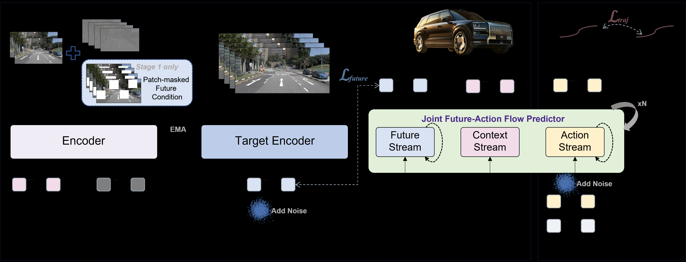
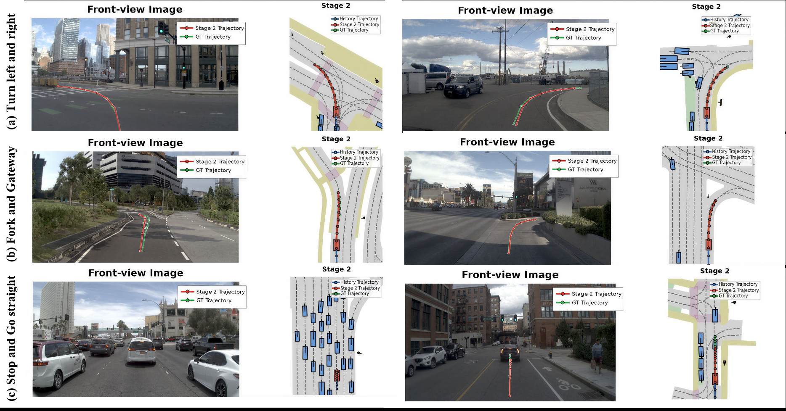
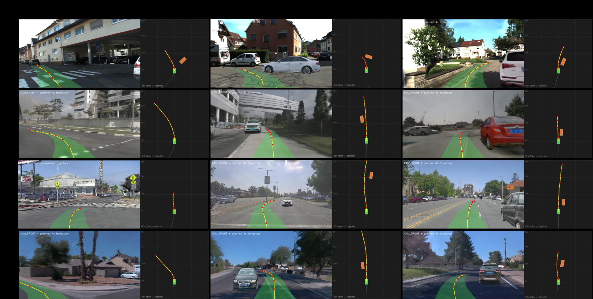

# AI Daily

## 2026-10-05｜WA-JEPA：把 V-JEPA 改造成能預測未來、理解動作的 World-Action Model

> **一句話結論：** WA-JEPA 的真正新意，不只是把 JEPA 接到自動駕駛，而是把「未來表徵預測」從隨機遮罩補全改成因果的 future masking，再用 latent flow matching 保留多模態未來，最後讓 scene stream 與 action stream 在同一個 predictive space 中聯合生成。它是今天候選中最直接連結 **JEPA、flow matching 與 zero-shot world-action transfer** 的工作；但它**不是** Energy-Based Transformer、canonical VAR、完全 training-free 或顯式 attention-modulation 方法。

## 論文基本資訊

| 欄位 | 資訊 |
|---|---|
| 論文標題 | *WA-JEPA: Rethinking the Video JEPA Paradigm for World-Action Modeling in Autonomous Driving* |
| 作者 | Xinlin Wang、Yujiao Xiang、Yuheng Zhou、Jingqi Wang、Minqing Huang、Jiajie Huang、Dongxu Wei、Tingguang Zhou、Xiyang Wang、Gong Chen、Zhi Xu、Feiyang Tan、Hangning Zhou、Mu Yang [1] |
| 研究單位 | Afari Intelligent Drive、University of Electronic Science and Technology of China、Southeast University、Beijing University of Posts and Telecommunications、Tianjin University [1] |
| 發表狀態 | arXiv v2 預印本，2026-09-05；截至本報告日未核到正式會議或期刊收錄資訊 [1] [3] |
| 領域 | JEPA、world models、autonomous driving、conditional flow matching、predictive representation |
| 論文頁面 | [arXiv abstract][1]；[HTML 全文][2]；[PDF](https://arxiv.org/pdf/2608.20974v2) |
| 官方實作 | [AFARI-Research/WA-JEPA][3]；[安裝、評估與重現文件][4] |
| Repo 去重 | 已讀取 `KaiCobra/AI_Daily` 的 `README.md`、`INDEX.md`、`papers/`。`2608.20974`、WA-JEPA 與完整標題均未出現，因此不是既有文章的重複。 |

本次廣搜以 2026-08-27 至 2026-10-05 的最新論文為主，並特別查找 JEPA、training-free inference、attention modulation、VAR、flow matching 與 Energy-based 方向。候選中，WA-JEPA 的 JEPA 方法級命中最直接；若把「training-free + attention modulation」視為硬性條件，**World in World** 會是更直接的備選，但它不是 JEPA 或 EBT [14]。這裡選 WA-JEPA，是因為它同時具備完整方程式、公開程式碼、消融、seed-level statistics，以及 source-disjoint 的閉環 simulator transfer。

## 為什麼這篇值得讀？

V-JEPA 原本的強項是從影片中學習高品質的 latent representation。它用 target encoder 產生停止梯度的 target embedding，再讓 predictor 從部分觀測預測 target latent，而不是把影片解碼回 pixel。V-JEPA 2 已經展示了從大規模網路影片學習 video understanding、prediction 與 robot planning 的能力；V-JEPA 2.1 則進一步強調 dense、spatially grounded 與 temporally consistent features [5] [6] [7]。

但自動駕駛 planning 需要的不是一般的「把缺少的片段補起來」，而是：

1. 只能從過去推測未來，不能偷看未來影像；
2. 未來可能有多個合理結果，不能只回歸條件平均；
3. 世界表徵必須和 ego action 共享資訊，使表徵真的與決策相關；
4. 方法要能在不同視覺域中閉環運作，而不是只在 recorded trajectory 上做 open-loop matching。

WA-JEPA 針對這四點分別改動 mask、future objective、world-action coupling 與 evaluation protocol。它不是把 V-JEPA 當作 frozen feature extractor，而是重新設計 JEPA 的 predictive interface。

*圖 1。由 PDF 以 `/pdf-image-extractor` 技能擷取的必要方法圖。左側是 Stage 1 的 encoder/EMA target encoder 與 future latent prediction；右側是 Stage 2 同時處理 future scene 與 action 的 joint predictor。[2]*

## 核心貢獻與創新點

### 1. Hybrid future masking：把 completion objective 改成 planning objective

原始 V-JEPA 偏向 random-mask completion。WA-JEPA 只在 future tokens 上做遮罩，保留 history tokens，並混合兩種分支：

- **Full-mask：** 所有 future tokens 都被遮住，模型只能由歷史影像預測未來。
- **Patch-mask：** 未來影像保留部分可見 patch，再預測其餘 future patch，讓模型同時保留原始 V-JEPA 的部分遮罩學習訊號。

Full-mask 給出嚴格的 causal past-to-future constraint；Patch-mask 則降低學習難度並保留局部 spatiotemporal completion 的穩定性。消融結果顯示兩者不是重複技巧：只用 Patch-mask 得 91.0 EPDMS，只用 Full-mask 得 91.3，兩者合用得到 91.7 [2]。

### 2. Clean-latent flow matching：避免 future latent 退化成平均值

若未來有多種合理演化，直接用 MSE 回歸單一 future latent，容易產生過度平滑、directional collapse 或 change-magnitude collapse。WA-JEPA 將 future scene latent 的學習改成 conditional flow matching，從 Gaussian noise 逐步生成 clean future latent。

### 3. Joint future-action predictor：讓 action supervision 直接塑造 scene representation

Stage 2 不再把 future scene prediction 和 trajectory planner 串成兩個獨立模組，而是讓同一個 MMDiT-style predictor 同時處理 context、future scene 與 action tokens。它採用不對稱的 stop-gradient 路由：scene loss 不更新 action stream；action loss 卻可以穿過 joint interaction 回到 scene/context stream。這個設計試圖保留 future representation 的穩定性，同時讓 scene representation 捕捉對 ego planning 有用的 dynamics [2] [4]。

### 4. 用兩種評估回答兩個不同問題

- **NAVSIM-v1/v2：** 在 recorded log 上做 pseudo-simulation，測試 trajectory 的安全、道路遵循、舒適度與進度。
- **HUGSIM：** 把模型的 plan 送入 3D Gaussian Splatting closed-loop simulator，車輛移動後重新渲染視角，錯誤會累積，測試更接近 deployment 的 closed-loop behavior [8] [9]。

## 技術方法與數學細節

### 1. V-JEPA 的 predictive representation 基礎

令 $E_\theta$ 為 online encoder，$E_{\bar\theta}$ 為 EMA target encoder，$P_\psi$ 為 predictor。原始 V-JEPA 的基本目標可以寫成：

$$
\min_{\theta,\psi}
\left\|
P_\psi(E_\theta(\alpha))
-\operatorname{sg}(E_{\bar\theta}(\beta))
\right\|_1,
$$

其中 $\alpha$ 是 context，$\beta$ 是 target，$\operatorname{sg}(\cdot)$ 表示 stop-gradient。target encoder 不用 gradient 更新，而是以 EMA 更新：

$$
\bar\theta
\leftarrow
\mu\bar\theta+(1-\mu)\theta.
$$

這樣做的目的，是讓 target representation 緩慢變化，避免 online predictor 和 target encoder 同時追逐造成 collapse [2] [6]。

### 2. Stage 1：混合未來遮罩

一筆多鏡頭 driving sample 由 history 與 future 組成：

$$
\mathcal X_{1:H+K}
=
[\mathcal X_{1:H},\mathcal X_{H+1:H+K}],
\qquad
\mathcal X_t=\{X_t^c\}_{c=1}^{C}.
$$

歷史影像經 online encoder 得到 context scene tokens：

$$
\mathcal Z_{\mathrm{ctx}}
=E_\theta(\mathcal X_{1:H}).
$$

未來影像先套用 full 或 patch mask。令 $M^{(m)}$ 是 mask pattern，$m\in\{\mathrm{full},\mathrm{patch}\}$，則 future condition tokens 為：

$$
\mathcal Z_{\mathrm{cond}}^{(m)}
=
\Phi^{(m)}
\left(
\mathcal Z_{\mathrm{mask}},
E_\theta(\mathcal X_{H+1:H+K},M^{(m)})
\right).
$$

其中 $\Phi^{(m)}$ 把 visible future tokens scatter 回原始位置，其餘位置填入 learnable mask token。Full-mask 時沒有任何 future image content 可見，因此 $\mathcal Z_{\mathrm{cond}}^{(\mathrm{full})}$ 全部由 mask tokens 組成。

EMA target encoder 則直接看未遮罩的 future image，產生 supervision target：

$$
\mathcal Z^*_{\mathrm{future}}
=E_{\bar\theta}(\mathcal X_{H+1:H+K}).
$$

注意這個 target 只用於訓練 supervision，不會在 inference 時提供給 student predictor [2]。

### 3. Clean-latent conditional flow matching

WA-JEPA 從 Gaussian noise 開始：

$$
\epsilon_{\mathrm{future}}\sim\mathcal N(0,I).
$$

在 flow time $t\in[0,1]$ 上，以線性路徑連接 noise 與 clean target：

$$
\mathcal Z_t
=(1-t)\epsilon_{\mathrm{future}}
+t\mathcal Z^*_{\mathrm{future}}.
$$

Predictor 讀取 context、future condition、noisy future tokens 與時間 $t$，直接預測 clean endpoint：

$$
\hat{\mathcal Z}_{\mathrm{future}}
=
P^{\mathrm{future}}_\psi
(\mathcal Z_{\mathrm{ctx}},
\mathcal Z_{\mathrm{cond}},
\mathcal Z_t,t).
$$

訓練 loss 為 clean-latent MSE：

$$
\mathcal L_{\mathrm{future}}
=
\frac1N
\left\|
\hat{\mathcal Z}_{\mathrm{future}}
-\operatorname{sg}(\mathcal Z^*_{\mathrm{future}})
\right\|_2^2.
$$

這裡的關鍵是 **x-prediction**。若 flow path 是

$$
\mathcal Z_t=(1-t)\epsilon+t\mathcal Z^*,
$$

則理想 velocity 為 $\mathcal Z^*-\epsilon$。當 predictor 給出 clean endpoint $\hat{\mathcal Z}^*$ 時，可估計：

$$
\hat v_t
=\frac{\hat{\mathcal Z}^*-\mathcal Z_t}{1-t},
$$

再以數值積分把 noise 推向 future latent。官方 v2 設定使用 4 個 sampling steps [2] [4]。

這與直接 regression 的差異在於：MSE regression 傾向把多個合法 future 壓到一個平均點；flow matching 則提供由 noise 到 target distribution 的生成路徑，理論上能保留更多 future variation。論文的診斷結果支持這個解釋，但它仍是 representation proxy，而不是對 world state correctness 的完整證明。

### 4. Stage 2：將 future action 放進同一個 flow space

先把真實 future trajectory $\mathcal Y_{H+1:H+K}$ 做 normalization：

$$
\bar{\mathcal Y}_{H+1:H+K}
=\operatorname{Norm}(\mathcal Y_{H+1:H+K}).
$$

再加入 action noise：

$$
\tilde{\mathcal Y}_t
=(1-t)\epsilon_y
+t\bar{\mathcal Y}_{H+1:H+K},
\qquad
\epsilon_y\sim\mathcal N(0,I).
$$

歷史 actions、noisy future actions 與 compact ego state 分別編碼後串接：

$$
\mathcal T_{\mathrm{act}}
=\operatorname{Concat}
[\mathcal T_n,\mathcal T_h,\mathcal T_s],
$$

$$
\mathcal T_n=F_n(\tilde{\mathcal Y}_t),
\quad
\mathcal T_h=F_h(\mathcal Y_{1:H}),
\quad
\mathcal T_s=F_s(s).
$$

同一個 joint predictor 輸出 scene 與 action：

$$
\hat{\mathcal Z}_{\mathrm{future}}
=
P^{\mathrm{future}}_\psi
(\mathcal Z_{\mathrm{ctx}},
\mathcal Z_{\mathrm{cond}},
\mathcal Z_t,
\operatorname{sg}(\mathcal T_{\mathrm{act}}),t),
$$

$$
\hat{\bar{\mathcal Y}}_{H+1:H+K}
=
P^{\mathrm{act}}_\psi
(\mathcal Z_{\mathrm{ctx}},
\mathcal Z_{\mathrm{cond}},
\mathcal Z_t,
\mathcal T_{\mathrm{act}},t).
$$

action loss 為：

$$
\mathcal L_{\mathrm{act}}
=\frac1K\sum_{k=1}^{K}
\left\|
\hat{\bar{\mathbf y}}_k-\bar{\mathbf y}_k
\right\|_2^2.
$$

最後的 Stage 2 目標是：

$$
\mathcal L_{\mathrm{Stage2}}
=\lambda_{\mathrm{future}}\mathcal L_{\mathrm{future}}
+\lambda_{\mathrm{act}}\mathcal L_{\mathrm{act}}.
$$

### 5. 為什麼 stop-gradient 是不對稱的？

這不是單純的 implementation detail，而是方法的因果假設：

- scene output 讀得到 action tokens，但 scene loss 的 gradient 在 action-token interface 被截斷，所以 future scene objective 不會反過來更新 action stream；
- action output 可以讀取可微的 context 與 future scene tokens，因此 action loss 可以更新 planning-relevant scene representation。

官方 config 將這個方向寫成 `traj_loss_grad_to_scene_flow: true` 與 `scene_loss_grad_to_traj_flow: false` [4]。換句話說，作者希望 **action 監督塑造 scene representation**，但不希望 **scene reconstruction/future prediction 反過來把 action branch 拉向與 planning 無關的解**。

### 6. Inference

Inference 時只輸入：

- 四個歷史 camera views；
- 歷史 trajectory/action；
- ego state。

future images 與 ground-truth future actions 都不提供。future scene latent 和 normalized future action 都從 Gaussian noise 初始化，joint predictor 反覆估計 clean endpoints，再沿 flow path 做 4-step integration，最後使用 $\operatorname{Norm}^{-1}$ 還原成原始的 $(x,y,\phi)$ trajectory [2] [4]。

## 實驗設定與性能指標

### 設定

官方釋出的 WA-JEPA 以 V-JEPA 2.1 ViT-L/16 作 visual encoder，使用四個 camera：`CAM_L0`、`CAM_F0`、`CAM_R0`、`CAM_B0`。輸入是 4 個歷史 frames、解析度 $256\times512$；輸出是 8 個 future trajectory points，頻率為 2 Hz。joint flow predictor 為 12 layers、hidden size 512、8 attention heads；官方文件標示約 480.9M trainable parameters、含 frozen EMA encoder 共約 787.7M [4]。

Stage 1 在 nuPlan multi-camera video 上學 future scene representation，Stage 2 以 NAVSIM `navtrain` 做 action fine-tuning，最後在互斥的 `navtest` 上評估。訓練使用 AdamW、bfloat16 與 DeepSpeed ZeRO-2；Stage 1 使用 64 張 NVIDIA A800，Stage 2 使用 32 張 A800，每張 GPU batch size 為 4 [2] [4]。

### NAVSIM 指標如何讀？

NAVSIM-v1 的 PDMS 由 safety penalty 與 comfort/progress 的 weighted average 組成：

$$
\operatorname{PDMS}
=
\operatorname{NC}\cdot\operatorname{DAC}
\cdot
\frac{5\operatorname{TTC}+2\operatorname{Comf.}+5\operatorname{EP}}{12}.
$$

NC 是 no-at-fault collision，DAC 是 drivable-area compliance，TTC 是 time-to-collision，Comf. 是 comfort，EP 是 ego progress。NAVSIM-v2 額外加入 DDC、TLC、LK、HC、EC，並在部分 metric 上先使用 human-reference penalty filter，再聚合成 EPDMS [2] [8]。

這裡必須分清楚：論文表格同時列出修正前的 $\operatorname{EPDMS}^*$ 與修正後的 EPDMS。WA-JEPA 的 NAVSIM-v2 單一主結果是 **corrected EPDMS 91.7**，不是把修正前的 88.0 混在一起比較。

## 實驗結果

### 1. NAVSIM-v2：91.7 corrected EPDMS

| 設定 | NC | DAC | DDC | TLC | EP | TTC | LK | HC | EC | EPDMS |
|---|---:|---:|---:|---:|---:|---:|---:|---:|---:|---:|
| WA-JEPA | 99.4 | 98.2 | 99.7 | 99.9 | 87.8 | 98.9 | 98.3 | 98.3 | 88.1 | **91.7** |
| 最強 E2E baseline：SparseDriveV2 | 98.1 | 98.1 | 99.6 | 99.8 | 91.1 | 97.3 | 96.9 | 98.2 | 78.4 | 90.1 |
| 最強 WAM baseline：Discrete-WAM | 98.5 | 98.2 | 99.7 | 99.8 | 90.5 | 97.9 | 97.2 | 98.3 | 78.1 | 90.4 |

WA-JEPA 比最強 E2E baseline 高 1.6 EPDMS，比最強 WAM baseline 高 1.3。它在 safety/compliance 類指標很強，但 EP 不是最高；因此 91.7 應讀成整體 aggregation 的優勢，不是所有單項都第一 [2]。

### 2. NAVSIM-v1：91.8 PDMS

在 NAVSIM-v1 navtest，WA-JEPA 的指標為 NC 99.5、DAC 98.3、TTC 97.7、Comfort 100、EP 85.0，最終 PDMS 為 **91.8**。這高於表中 DriveWorld-VLA 的 91.3 與 DriveFuture 的 90.7，但 v1 的 PDMS 與 v2 的 EPDMS 不是同一個評分協議，不能直接當成同一數字排序 [2] [4]。

*圖 2。由 PDF 以 `/pdf-image-extractor` 技能擷取的 NAVSIM trajectory prediction 摘要；論文分別展示 turn、fork/gateway、stop 與 go-straight 情境中的 front view、history trajectory、Stage 2 trajectory 與 ground-truth trajectory。[2]*

### 3. HUGSIM：436 個 closed-loop scenarios 的 zero-shot transfer

WA-JEPA 的兩個 training stages 沒有使用 HUGSIM-rendered observations，也沒有使用 HUGSIM 的四個 source datasets。模型在 HUGSIM 436 個 scenarios 上做 closed-loop rollout，結果如下：

| 方法 | NC | DAC | TTC | Comfort | PDMS | RC | HD-Score |
|---|---:|---:|---:|---:|---:|---:|---:|
| WA-JEPA | **0.6856** | **0.9635** | **0.6120** | 0.6620 | **0.5717** | **0.5689** | **0.4462** |
| DrivoR | 0.5217 | 0.9559 | 0.4620 | 0.9390 | 0.4475 | 0.4721 | 0.3252 |
| UniAD | 0.6555 | 0.9320 | 0.5156 | 0.6633 | 0.4940 | 0.4383 | 0.3124 |
| LTF | 0.4428 | 0.9275 | 0.3751 | **0.9478** | 0.3653 | 0.3804 | 0.2310 |
| VAD | 0.4117 | 0.9028 | 0.2798 | **0.9534** | 0.2831 | 0.3006 | 0.1393 |

這個結果的重點不是「每一項都最好」；WA-JEPA 的 Comfort 反而低於 LTF/VAD。較精確的結論是：它在 closed-loop 的碰撞、道路遵循、TTC、進度與 HD-Score 上有整體優勢，但平順性仍是 trade-off [2] [4]。

按 difficulty tier 的 HD-Score 為：easy 0.7977、medium 0.5563、hard 0.3060、extreme 0.1362。按 source dataset 則為 nuScenes 0.4725、KITTI-360 0.2963、Waymo 0.5542、PandaSet 0.4702 [2] [4]。

*圖 3。由 PDF 以 `/pdf-image-extractor` 技能擷取的 HUGSIM rollout 摘要。每一格同時顯示 front camera 與 BEV planned trajectory；論文以此說明模型在 turning、oncoming vehicle 與 overtaking 情境中維持可行駛走廊。[2]*

### 4. Ablation：三個設計各自有可辨識的作用

| 消融問題 | 設定 | EPDMS |
|---|---|---:|
| Encoder initialization | MAE / SigLIP2 / DINOv3 / V-JEPA 2 | 83.8 / 83.1 / 83.8 / **89.5** |
| Stage 1 masking | no Stage 1 / Patch-mask / Full-mask / 兩者 | 89.5 / 91.0 / 91.3 / **91.7** |
| Stage 2 design | action-only / separate future predictor / joint no future supervision / joint + direct regression / joint + flow matching | 89.9 / 90.8 / 91.1 / 90.7 / **91.7** |

這組 ablation 的價值在於它沒有只報整體模型：

- **V-JEPA initialization：** 在完全跳過 Stage 1 的公平比較中，V-JEPA 2 得 89.5，明顯高於 MAE、SigLIP2、DINOv3 的 83.1–83.8；這支持「predictive video representation」本身對 planning 有貢獻，而不只是 ViT-L 規模的效果。
- **Hybrid masking：** Full-mask 比 Patch-mask 稍好，表示 causal future prediction 比 partial completion 更接近 planning；但兩者合用最好，表示保留 completion branch 仍有表示學習價值。
- **Joint + flow matching：** action-only 只有 89.9；加入 separate future predictor 到 90.8；joint future-action 到 91.1；joint + direct regression 反而降到 90.7；joint + flow matching 才達 91.7。

### 5. Flow matching 是否真的保留了 temporal dynamics？

論文使用 target-referenced metrics 檢查 predicted future scene tokens 是否比 direct regression 保留更多時間變化：

- **Directional similarity collapse gap：** 預測 future steps 彼此過度相似的程度，越低越好。Flow matching 從 0.30 降至 0.10。
- **Change-magnitude ratio：** 預測相鄰 future token change 與 target change 的比例，越接近 1 越好。Flow matching 從 0.45 提升至 0.80。

附錄說明，這些指標是在相同 projected feature space、相同 target-selected dynamic locations 上計算；flow matching 使用 sampled training flow time 的 **one-step x-prediction**，不是跑完整 multi-step inference sampler。標準設定是 8 future frames、tubelet size 2，因此 future token steps $F=4$，並選取 $K=64$ 個 target-dynamic locations [2]。

## 相關研究與差異

### V-JEPA 2 / V-JEPA 2.1：從表示學習到 world-action

V-JEPA 2 在超過百萬小時網路影片上做 action-free latent prediction，並以少量 robot interaction data post-train V-JEPA 2-AC，展示 image-goal planning 與不收集目標環境資料的 robot deployment [6]。V-JEPA 2.1 則把重點放在 dense predictive loss、deep self-supervision、多模態 tokenizer 與 scaling，形成更 spatially structured、semantically coherent、temporally consistent 的 encoder [7]。

WA-JEPA 的差別是：它不把 V-JEPA 2.1 只當作 frozen encoder，而是用 driving-specific future mask 重新訓練 predictor，讓 target 時間方向與 planning task 對齊，再接上 action generation。也就是說，V-JEPA 2/2.1 提供 foundation representation；WA-JEPA 重新定義 representation 要預測什麼，以及預測結果如何被 action 使用 [5] [6] [7]。

### Drive-JEPA：同一條 JEPA 路線，兩種 planner interface

Drive-JEPA 也將 V-JEPA 適配到 end-to-end driving，但它的核心是 **multimodal trajectory distillation**：以 simulator-generated trajectories 與 human trajectories 建立 proposal-centric planner，再用 momentum-aware selection 選出穩定軌跡。其官方摘要報告 NAVSIM v1 的 93.3 PDMS 與 v2 的 87.8 EPDMS [10]。

WA-JEPA 則把 future scene latent 與 ego trajectory 放進同一個 joint flow predictor，沒有使用 Drive-JEPA 那種另外建 proposal-centric downstream planner 的介面。兩者的差異可以濃縮成：

- Drive-JEPA：V-JEPA representation → multimodal trajectory proposals → selection。
- WA-JEPA：V-JEPA future latent + noisy action → shared joint predictor → future action。

因此，Drive-JEPA 強調 trajectory distribution 與 planner selection；WA-JEPA 強調 world representation 與 action supervision 的 joint predictive geometry。兩者結果不能只看單一 EPDMS 排名，因為 backbone、資料、NAVSIM 版本與 training protocol 不完全相同。

### DINO-WM、Latent-WAM 與 DriveWAM：三種 world representation 選擇

- **DINO-WM：** 用 DINOv2 的 spatial patch features 預測 future features，再透過 action sequence optimization 做 task-agnostic planning；它代表「不重建 pixel，直接預測 frozen visual feature」的 world model 路線 [11]。
- **Latent-WAM：** 以 spatial-aware compressive world encoder 把多視角影像壓成 scene tokens，再用 causal Transformer autoregressively 預測 future world status；它強調 compact、spatially aware 與 dynamics-informed latent，並報告 NAVSIM-v2 89.3 EPDMS [12]。
- **DriveWAM：** 把 pretrained video diffusion transformer 改成 autoregressive video-action policy，在 unified temporal token sequence 上做 joint flow matching，並用 selective KV memory 支援長時 rollout [13]。

WA-JEPA 的位置介於「predictive feature world model」與「generative world-action model」之間：它保留 JEPA 的 semantic latent，而不是 VAE pixel latent；但又用 flow matching 取代單點 regression，使 future representation 具備生成式多樣性。它不是 canonical visual autoregressive model，因為 inference 是從 noise 迭代積分，不是逐 token 或逐 scale 的 next-token factorization。

### NAVSIM 與 HUGSIM：評估協議本身也是研究脈絡

NAVSIM 官方將 pseudo-simulation 定位成 open-loop efficiency 與 closed-loop robustness 的折衷：它能在不逐步互動的情況下，以 recorded data 與 synthetic observations 估計多種 driving metrics [8]。因此 NAVSIM 適合大規模 ranking，但不等同於真實 closed-loop deployment。

HUGSIM 則把 plan 回饋給 simulator，ego vehicle 移動後重新渲染 camera view，錯誤會累積；這使它更接近 world-action model 的 closed-loop stress test [9]。WA-JEPA 同時報兩個 benchmark，是它比只報 NAVSIM 分數更有說服力的地方，但仍不能取代真實車輛測試。

## 個人評價與研究意義

我給 WA-JEPA **8.7/10**。

### 最重要的 insight

這篇工作最值得帶走的不是「V-JEPA + flow matching」這個組合名稱，而是它重新定義了 **predictive representation 的訓練方向**：如果 representation 要支援 action，就不應只學會補完被遮住的內容，而要在訓練時明確要求它預測未來，並讓 action loss 有一條可控的路徑回到 scene representation。

這個觀點也解釋了為什麼 joint scene-action modeling 不是把兩個 head 並排就結束。真正重要的是：哪一個 loss 可以更新哪一個 stream？哪些 tokens 可以互相讀取？future scene objective 是否會被 action branch 污染？WA-JEPA 用 stop-gradient 把這個問題顯式化，提供了一個很適合後續研究的 gradient topology。

### 強項

1. **方法和任務對齊。** Full future mask 讓 Stage 1 的 prediction direction 與 planning direction 一致。
2. **數學介面清楚。** x-prediction flow、joint tokens、asymmetric gradient routing 都能直接檢查與改寫。
3. **消融具辨識力。** mask、future objective、scene-action coupling 和 encoder initialization 都有單獨對照。
4. **評估不只停留在 pseudo/open-loop。** HUGSIM 436 scenarios 的 source-disjoint closed-loop 結果讓 world-action claim 更完整。
5. **程式碼與 checkpoint 已公開。** 官方 repo 包含 training、NAVSIM、HUGSIM evaluation 與 checkpoint 路徑，重現門檻雖高但不是只靠摘要宣稱 [3] [4]。

### 不能過度解讀的地方

- **91.7 不是所有單項指標都第一。** 它是 corrected EPDMS aggregation；EP 不是最高，且 $\operatorname{EPDMS}^*=88.0$ 與 corrected EPDMS 91.7 必須分開。
- **Flow matching 的 representation 證據是 proxy。** 0.30→0.10 與 0.45→0.80 來自 one-step x-prediction 的 temporal statistics，不能直接等同「模型已學會真實世界因果 dynamics」。
- **zero-shot 不等於 training-free。** WA-JEPA 做了大規模 Stage 1 pretraining 和 NAVSIM Stage 2 fine-tuning；zero-shot 只表示沒有使用 HUGSIM-specific data/fine-tuning。
- **沒有正式 venue。** 截至研究截止日，它仍是 arXiv preprint，不應寫成 ICCV、CVPR、ICML 或 NeurIPS 已接收論文。

## 主要限制與查核提醒

1. **論文與 release 的版本命名有落差。** 論文正文多處寫 V-JEPA 2 ViT-L；官方 release 文件寫 V-JEPA 2.1 ViT-L/16。官方 repo 最新 commit 又是因為改動 denoising steps，v2 用 4 steps，而較早版本曾寫 12 steps。若要重現，應以 released config、checkpoint 與 commit 為準，不要只按論文 v1/v2 的文字設定 [2] [3] [4]。
2. **計算成本很高。** 官方訓練使用 Stage 1 的 64 張 A800 與 Stage 2 的 32 張 A800；論文沒有建立真實車輛上的 latency、energy cost、thermal budget 或 fleet-scale closed-loop safety [2] [4]。
3. **HUGSIM 仍是 simulator evidence。** 436 個 scenarios 跨 nuScenes、KITTI-360、Waymo、PandaSet，確實比單一資料集更好，但不等於 real-road deployment。極端 tier 的 HD-Score 只有 0.1362，表示困難情境仍明顯退化。
4. **HUGSIM protocol 有需要保留的工程假設。** WA-JEPA release 使用 heading correction；官方文件也記錄 PandaSet `medium_02` 的 `max_t` 相容性 patch 與 background-agent failure case，並提醒這些情況需要在 aggregation 時單獨 audit。這些修正有助於可重跑，但也代表 historical HUGSIM numbers 不能不加說明地直接互比 [4] [9]。
5. **Action distribution 仍被簡化。** action stream 的主 supervision 是 normalized trajectory MSE。即使 noise initialization 讓 sampling 具有 stochasticity，也沒有直接證明它能覆蓋所有合理、多峰、互相衝突的 driving maneuvers。
6. **沒有明確的 energy function 或 attention intervention。** 這篇工作與 Energy-Based Transformer、training-free attention modulation 的連結目前是研究延伸，不是原論文已驗證的貢獻。
7. **沒有真實 causal sufficiency 證明。** temporal representation metrics 顯示 flow matching 比 regression 保留更多變化，但不能證明 latent 已經是可干預、可識別、action-sufficient 的 world state。

## 可以激發後續研究的方向

以下是基於 WA-JEPA 的延伸構想，不是原論文已完成的結果。

### 1. Energy-Gated WA-JEPA：把 scene-action compatibility 寫成 energy

令 future scene latent 為 $z_f$、候選 action 為 $y$，可以定義 action-conditioned compatibility energy：

$$
E_\phi(z_f,y\mid z_{\mathrm{ctx}})
=-\operatorname{sim}\left(g_\phi(z_f),h_\phi(y,z_{\mathrm{ctx}})\right)
+\lambda\,\|r_\phi(z_f,y)\|^2.
$$

除了 flow predictor 生成候選，使用 energy 重新排序或做少量 iterative refinement：

$$
 y^{(n+1)}
=y^{(n)}-\eta\nabla_y E_\phi(z_f,y^{(n)}\mid z_{\mathrm{ctx}}).
$$

這會把 WA-JEPA 從「一次 joint sampling」推向「生成 proposal + energy verification」，直接對接 Energy-Based Transformer。

### 2. JEPA predictive disagreement：用 uncertainty 決定 flow steps

目前 release 固定 4 sampling steps。可以用多個 predictor head、不同 mask branch 或不同 noise seeds 的 disagreement：

$$
U_t
=\frac1M\sum_{m=1}^{M}
\left\|
\hat z^{*(m)}_t-ar{\hat z}^{*}_t
\right\|_2^2.
$$

若 $U_t$ 低，提前停止或重用上一個 velocity；若 $U_t$ 高，增加 flow steps，或強化 action-to-scene gradient。這能把「4 steps」從固定 engineering choice 改成 state-dependent adaptive compute，並直接測試 quality–latency–energy frontier。

### 3. VAR × JEPA：把 future latent 改成 coarse-to-fine scale prediction

WA-JEPA 從 Gaussian noise 一次處理整段 future scene/action。VAR 則以多尺度 token sequence 逐級生成。可令第 $s$ 個尺度的 scene state 為 $z^{(s)}$：

$$
 p\left(z^{(s+1)}\mid z^{(\le s)},y\right),
$$

在 coarse scale 先預測道路 topology、車道方向與大物體位置，再在 fine scale 用 action-conditioned JEPA predictor 補細節。這會把 WA-JEPA 的 semantic predictive latent 接到 VAR 的 coarse-to-fine factorization，測試早期尺度是否能降低 planning ambiguity。

### 4. Training-free attention modulation：凍結模型、只改 sampling interface

若不想再訓練完整 predictor，可以把 flow predictor 的 uncertainty/energy 轉成 attention control：

$$
A^{(l)}_t
\leftarrow
A^{(l)}_t
+\alpha_t B^{(l)}(U_t,E_t),
$$

其中 $A^{(l)}_t$ 是第 $l$ 層 attention logits，$B^{(l)}$ 可以是 scene–action compatibility bias，$\alpha_t$ 由 uncertainty 或 energy 決定。此方向的嚴格 protocol 應同時報告：是否有 learned controller、額外 forward 次數、FLOPs、latency、無介入 baseline，以及 held-out camera/domain transfer。

### 5. 嚴格 zero-shot protocol

WA-JEPA 的 HUGSIM transfer 已是 source-disjoint，但還可以建立更嚴格的 protocol：

- training 不使用 target city、target simulator source dataset 或 target camera calibration；
- 評估不同 camera order、不同 weather/lighting 與未見 traffic density；
- 同時報 `no adaptation`、`linear probe`、`test-time optimization` 與 `training-free modulation`；
- 將 failure recovery、uncertainty calibration、inference energy 與 closed-loop progress 一起報告。

這樣才可以分辨「zero-shot domain transfer」與「只是模型在相近分布上仍然有效」。

## 結論

WA-JEPA 把 V-JEPA 從「學習有用的影片表徵」往「預測能被 action 使用的未來世界」推進了三步：

1. 用 hybrid future masking 建立 causal future direction；
2. 用 latent flow matching 保留 future dynamics，而不是只回歸平均 latent；
3. 用不對稱 gradient routing 讓 action supervision 反向塑造 planning-relevant scene representation。

它最可信的研究價值，是提供一個可實作、可消融、可延伸的 **JEPA world-action interface**。它最需要保留的限制，則是：目前仍是大型訓練式 world model；zero-shot 只是在 HUGSIM-specific data 上零微調；flow representation metrics 仍是 proxy；而 EBM、VAR、training-free、attention modulation 都還只是下一步的研究方向。

對我而言，這篇論文真正留下的問題是：**如果 future latent 可以被 flow 生成、action 可以塑造 representation，那麼我們能否再用一個可校準的 energy 或 predictive disagreement，決定哪個 future、哪個 scale、哪個 attention head 值得繼續計算？** 這正是 WA-JEPA 與 Energy-Based Transformer、JEPA、VAR、training-free inference 交會的地方。

## References

[1]: https://arxiv.org/abs/2608.20974v2 "WA-JEPA: Rethinking the Video JEPA Paradigm for World-Action Modeling in Autonomous Driving — arXiv abstract and version metadata"

[2]: https://arxiv.org/html/2608.20974v2 "WA-JEPA: Rethinking the Video JEPA Paradigm for World-Action Modeling in Autonomous Driving — full HTML paper"

[3]: https://github.com/AFARI-Research/WA-JEPA "Official WA-JEPA code, checkpoints, NAVSIM and HUGSIM evaluation repository"

[4]: https://raw.githubusercontent.com/AFARI-Research/WA-JEPA/main/docs/installation.md "WA-JEPA official installation, configuration, result and evaluation-caveat documentation"

[5]: https://github.com/facebookresearch/vjepa2 "Official V-JEPA 2, V-JEPA 2-AC and V-JEPA 2.1 codebase and checkpoints"

[6]: https://arxiv.org/abs/2506.09985 "V-JEPA 2: Self-Supervised Video Models Enable Understanding, Prediction and Planning — arXiv abstract"

[7]: https://arxiv.org/abs/2603.14482 "V-JEPA 2.1: Unlocking Dense Features in Video Self-Supervised Learning — arXiv abstract"

[8]: https://github.com/autonomousvision/navsim "Official NAVSIM repository: pseudo-simulation benchmark, PDMS/EPDMS and release history"

[9]: https://github.com/hyzhou404/HUGSIM "Official HUGSIM repository: real-time photorealistic closed-loop autonomous-driving simulator"

[10]: https://arxiv.org/abs/2601.22032 "Drive-JEPA: Video JEPA Meets Multimodal Trajectory Distillation for End-to-End Driving — arXiv abstract"

[11]: https://arxiv.org/abs/2411.04983 "DINO-WM: World Models on Pre-Trained Visual Features Enable Zero-Shot Planning — arXiv abstract"

[12]: https://arxiv.org/abs/2603.24581 "Latent-WAM: Latent World Action Modeling for End-to-End Autonomous Driving — arXiv abstract"

[13]: https://arxiv.org/abs/2605.28544 "DriveWAM: Video Generative Priors Enable Scalable World-Action Modeling for Autonomous Driving — arXiv abstract"

[14]: https://arxiv.org/abs/2609.11548 "World in World: Explore the World with World Models — arXiv abstract"
